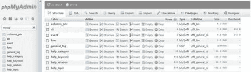
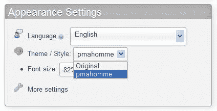
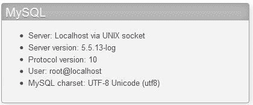
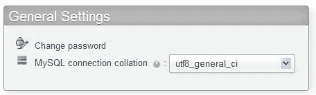
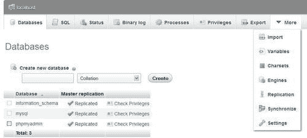
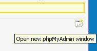
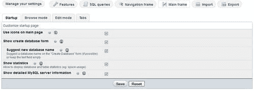

# 第三章，界面浏览

在深入研究面向任务的章节（如搜索等）之前，最好先看看 phpMyAdmin 接口的总体组织结构。我们还将看到影响整个界面的配置参数和设置。

# 在观察面板和窗户上方

phpMyAdmin 接口由各种面板和窗口组成，每个面板和窗口都有特定的功能。我们将首先简要介绍每个面板，然后在本章后面详细介绍。

## 登录面板

显示的登录面板取决于所选的身份验证类型。对于 `http`类型，它将采用浏览器的 HTTP 身份验证弹出屏幕的形式。对于 `cookie`类型，将显示 phpMyAdmin 特定的登录面板（在[第 2 章](02.html "Chapter 2. Configuring Authentication and Security")中介绍）。对于外部身份验证`(signon)`，登录面板由外部应用程序自己处理。默认情况下，此面板上存在一个**服务器**选择对话框和一个**语言**选择器。

但是，如果我们使用的是 `config`认证类型，则不显示登录面板，并且第一个显示的界面包含导航和主面板。

## 导航和主面板

这些面板组合在一起，并在我们与 phpMyAdmin 的大部分工作会话中显示。**导航面板**是我们浏览数据库和表格的向导。**主面板**是管理数据和显示结果的工作区。其确切布局取决于导航面板的选择和执行的操作顺序。对于大多数语言（从左到右书写），导航面板位于左侧，主面板位于右侧，但对于从右到左的语言（如希伯来语），这些面板是反向的。



### 主页

主面板可以采用主页的形式。然后，主页将包含与 MySQL 操作或 phpMyAdmin 信息相关的各种链接，一个**语言**选择器，可能还有**主题/风格**选择器。

### 观点

在主面板中，我们可以看到 `Database`视图，在该视图中我们可以对特定数据库执行各种操作，或者 `Table`视图中我们可以访问许多函数来管理一个表。还有一个 `Server`视图，对系统管理员和非管理员用户都有用。所有这些视图都有一个顶部菜单，它采用选项卡的形式，这些选项卡指向不同的页面，这些页面用于显示由常用函数（表结构、权限等）重新组合的信息。

## 查询窗口

这是一个独特的窗口，通常在编辑 SQL 查询时从导航面板打开，有时从主面板打开。其主要目的是方便查询工作，并在主面板上显示结果。

## 起始页

启动 phpMyAdmin 时，我们将看到以下面板之一（取决于 `config.inc.php`中指定的身份验证类型，以及其中是否定义了多个服务器）：

*   其中一个登录面板
*   导航和主面板，主页显示在主面板中

# 定制常规设置

本节介绍对许多面板有影响的设置。这些设置修改窗口中标题的外观、信息图标的外观以及表格列表的排序方式。所有页面的整个视觉样式都由主题系统控制，本节也介绍了主题系统。本节还讨论如何限制用户看到的数据库列表。

## 配置窗口标题

当显示导航和主面板时，窗口的标题会更改，以反映哪个 MySQL 服务器、数据库和表处于活动状态。这些指令控制要显示的以下信息量： `$cfg['TitleDefault'], $cfg['TitleServer'], $cfg['TitleDatabase']`和 `$cfg['TitleTable']`。

如果未选择服务器， `$cfg['TitleDefault']`控制标题。选择服务器（但无数据库）时， `$cfg['TitleServer']`控制标题栏中显示的内容。然后，如果选择了一个数据库， `$cfg['TitleDatabase']`开始发挥作用。最后，如果选择了一个表， `$cfg['TitleTable']`是有效的。

这些指令包含控制显示哪条信息的格式字符串。例如，以下是其中一个指令的默认值：

```php
$cfg['TitleTable'] = '@HTTP_HOST@ / @VSERVER@ / @DATABASE@ / @TABLE@ | @PHPMYADMIN@';

```

可能的格式字符串及其含义见 FAQ 6.27 中的 `Documentation.html`。

## 数据库和表名的自然排序顺序

通常，计算机按词汇顺序对项目进行排序，这会为一系列表提供以下结果：

```php
table1
table10
table2
table3

```

phpMyAdmin 默认实现**自然排序顺序**，由 `$cfg['NaturalOrder']`为 `TRUE`指定。因此，导航和主面板中的数据库和表列表被排序为：

```php
table1
table2
table3
table10

```

## 创建站点特定的页眉和页脚

一些用户可能希望在`phpMyAdmin`界面上显示公司徽标、公司帮助台链接或其他信息。在 `phpMyAdmin`主目录中，我们可以创建两个脚本`—config.header.inc.php`和 `config.footer.inc.php`。我们可以在这些脚本中放入我们自己的 PHP 或 XHTML 代码，它将出现在 `cookie`登录和主面板页面的开头（页眉）或结尾（页脚）。

例如，创建一个包含以下行的 `config.footer.inc.php`：

```php
<hr />
<em>All the information on this page is confidential.</em>

```

在页脚中使用这样的句子将在所有页面上产生预期的消息，如以下屏幕截图所示：


## 主题

主题系统在 phpMyAdmin 中可用。颜色参数和各种图标位于 `themes`子目录下的目录结构中。对于每个可用的主题，都有一个以主题命名的子目录。它包含：

*   `layout.inc.php`主题参数
*   带有各种 CSS 脚本的目录
*   `img`包含任何图标或其他图像（例如徽标）的目录
*   `screen.png`，这一主题的截图

下载的工具包包含两个主题，但在[上有更多主题 http://phpmyadmin.net/home_page/themes.php](http://phpmyadmin.net/home_page/themes.php) 。安装新主题只需下载相应的 `.zip`文件并将其解压缩到 `themes`子目录中即可。

### 注

如果有人想构建一个包含 JavaScript 代码的自定义主题，请注意所有 phpMyAdmin 3.4 页面都包含 jQuery 库。

### 配置主题

在 `config.inc.php`中， `$cfg['ThemePath']`参数默认包含`'./themes'`，表示所需结构所在的子目录。可以将其更改为指向公司特定 phpMyAdmin 主题所在的另一个目录。

默认选择的主题在 `$cfg['ThemeDefault']`中指定，并设置为`'pmahomme'`。如果用户没有可用的主题选择，则将使用此主题。

### 选择主题

在主页上，我们可以为用户提供一个主题选择器。将 `$cfg['ThemeManager']`设置为 `TRUE`（默认值）将显示选择器，如以下屏幕截图所示：



为了帮助选择合适的主题，**主题/风格**链接显示一个面板，其中包含可用主题的屏幕截图和**获取更多主题**链接。然后，我们可以在我们想要的主题下点击**take it**。对所选主题的引用存储在 cookie 中，默认情况下应用于我们连接到的所有服务器。

为了让 phpMyAdmin 记住每个 MySQL 服务器的一个主题，我们将 `$cfg['ThemePerServer']`设置为 `TRUE`。

## 选择语言

登录面板（如果有）和主页上会出现一个**语言**选择器。phpMyAdmin 的默认行为是使用浏览器首选项中定义的语言（如果此版本有相应的语言文件）。

如果程序无法检测到所使用的默认语言，则在 `$cfg['DefaultLang']`参数的 `config.inc.php`中用`'en'`（英语）定义。此值可以更改。语言名称的可能值在 `PMA_langDetails()`函数的 `libraries/select_lang.lib.php`脚本中定义。

即使定义了默认语言，每个用户（尤其是在多用户安装中）都可以从选择器中选择其首选语言。只要有可能，用户的选择就会在 cookie 中被记住。

我们也可以通过将 `$cfg['Lang']`参数设置为一个值，例如`'fr'`（法语），来强制使用一种语言。另一个参数 `$cfg['FilterLanguages']`可用。假设我们想将可用语言列表缩短为**英语**和**法语**，因为这两种语言是 phpMyAdmin 实例的用户专用的。这是通过构建一个正则表达式来实现的，该正则表达式根据这些语言的 ISO 639 代码指示要显示的语言。为了继续我们的示例，我们将使用：

```php
$cfg['FilterLanguages'] = '^(fr|en)';

```

在此表达式中，插入符号（^）表示“以开头”，而（|）表示“或”。该表达式表示我们将列表限制为相应 ISO 代码以 `fr`或 `en`开头的语言。

默认情况下，此参数为空，这意味着不会对可用语言列表应用任何筛选器。

## 滑块

在某些页面上，您将看到一个小加号，后跟一个控制标签**选项**或**详细信息**。点击标签会打开一个滑块，显示界面的一部分，这被认为在日常工作中很少使用。由于很少有人愿意以牺牲屏幕空间为代价立即看到整个界面，因此有一个配置参数控制滑块最初的设置方式：

```php
$cfg['InitialSlidersState'] = 'closed';

```

`closed`的默认值表示必须点击标签才能打开滑块；您可能已经猜到反向值是 `open`。用户可以使用第三个值 `disabled`。

## 限制数据库列表

有时，避免在导航面板中显示用户可以访问的所有数据库是很有用的。phpMyAdmin 提供了两种限制方式`—only_db` 和 `hide_db`。

要指定可以看到的内容列表，请使用 `only_db`参数。它可能包含数据库名称或数据库名称列表。在导航面板中只能看到这些数据库：

```php
$cfg['Servers'][$i]['only_db'] = 'payroll';
$cfg['Servers'][$i]['only_db'] = array('payroll', 'hr);

```

数据库名称可以包含 MySQL 通配符，如 `_`和 `%`。这些通配符在[中描述 http://dev.mysql.com/doc/refman/5.1/en/account-names.html](http://dev.mysql.com/doc/refman/5.1/en/account-names.html) 。如果使用一个数组来指定多个数据库，则它们将按照在数组中列出的顺序显示在界面上。

`only_db`的另一个特点是，您可以使用它不限制列表，而是强调将显示在列表顶部的某些名称。在这里， `myspecial`数据库名称将首先出现，然后是所有其他名称：

```php
$cfg['Servers'][$i]['only_db'] = array('myspecial', '*');

```

我们还可以使用 `hide_db`参数指示必须隐藏哪些数据库名称。它包含一个正则表达式（[http://en.wikipedia.org/wiki/Regular_expression](http://en.wikipedia.org/wiki/Regular_expression) ）表示要排除的内容。如果我们不希望用户看到任何名称以`'secret'`开头的数据库，我们将使用：

```php
$cfg['Servers'][$i]['hide_db'] = '^secret';

```

这些参数适用于此服务器特定配置的所有用户。

### 注

这些机制不会取代 MySQL 特权系统。用户对其他数据库的权限仍然适用，但他们无法使用 phpMyAdmin 的导航面板访问其他数据库或表。

## 停用 Ajax

某些页面正在使用**异步**JavaScript 来改善用户体验。我们可以通过将 `$cfg['AjaxEnable']`设置为 `false`来停用此行为；在这种情况下，为其编程了非 Ajax 行为的页面将停止使用 Ajax，而是执行完全刷新。这可能被用户视为流动性较低。

# 字符集和排序规则

**字符集**描述了特定语言或方言的符号是如何编码的。**排序规则**包含对字符集的字符进行比较和排序的规则。用于存储数据的字符集可能与用于显示数据的字符集不同，从而导致数据差异。因此，需要转换数据。

自 MySQL 4.1.x 以来，MySQL 服务器为我们进行字符重新编码工作。此外，MySQL 使我们能够指示每个数据库、每个表甚至每个字段的字符集和排序规则。数据库的默认字符集应用于其每个表，除非在表级别重写它。同样的原则适用于每一列。

## 有效字符集和排序规则

在主页上，我们可以看到**MySQL 字符集**信息和**MySQL 连接排序规则**选择器。以下是**MySQL 字符集**信息：



字符集信息（如**MySQL 字符集之后所示）**用于生成 HTML 信息，告诉浏览器页面的字符集是什么。

我们还可以使用**MySQL 连接排序规则**对话框选择将用于连接 MySQL 服务器的字符集和排序规则。这将传递给 MySQL 服务器。MySQL 然后将发送到浏览器的字符转换成这个字符集。MySQL 还根据字符集信息解释它从浏览器接收到的内容。请记住，所有表和列都有一个字符集信息，用于描述其数据的编码方式。



通常情况下，默认值应该有效。但是，如果使用不同的字符集输入某些字符，则可以在此对话框中选择适当的字符集。

以下参数定义默认连接排序规则和字符集：

```php
$cfg['DefaultConnectionCollation'] = 'utf8_unicode_ci';

```

# 导航面板

导航面板包含以下元素：

*   标志
*   服务器列表（如果 `$cfg['LeftDisplayServers']`设置为 `TRUE)`
*   **主页**链接或图标（带您返回 phpMyAdmin 主页）
*   一个**注销**链接或图标（如果可以注销）
*   指向**查询窗口**的链接或图标
*   显示 phpMyAdmin 和 MySQL 文档的图标
*   **重新加载**链接或图标（仅刷新此面板）
*   表名过滤器（在某些情况下，请参见后面的*表名过滤器*部分）
*   数据库和表的名称

如果 `$cfg['MainPageIconic']`设置为 `TRUE`（默认值），我们会看到图标。但是，如果设置为 `FALSE`，我们会看到链接。

如果数据库或表名对于默认导航面板大小来说太长，则可以通过单击垂直分隔线并沿首选方向移动来调整导航面板的大小，以显示更多数据。

我们可以自定义此面板的外观。许多外观相关参数位于 `themes/<themename>/layout.inc.php`中。 `$cfg['NaviWidth']`参数包含导航面板的默认宽度（以像素为单位）。背景色在 `$cfg['NaviBackground']`中定义。 `$cfg['NaviPointerColor']`参数定义指针颜色。要激活任何正在使用的主题的导航指针， `config.inc.php`中存在一个主设置 `$cfg['LeftPointerEnable']`。其默认值为 `TRUE`。

## 配置标识

徽标显示行为由多个参数控制。首先， `$cfg['LeftDisplayLogo']`必须设置为 `TRUE`，以启用徽标的任何显示。默认为 `true`。点击此徽标会将界面带到 `$cfg['LeftLogoLink']`参数中列出的页面，该页面通常是主 phpMyAdmin 页面（默认值 `main.php)`，但可以更改为任何 URL。最后， `$cfg['LeftLogoLinkWindow']`参数指示点击徽标后新页面出现在哪个窗口中。默认情况下，它位于主页上（值 `main)`。但是，可以使用值 `new`将其放在一个全新的窗口上

徽标图像本身来自 `logo_left.png`文件，该文件位于每个特定的主题目录结构中。

## 数据库及表列表

以下示例显示尚未选择任何数据库：


也可以看到**无数据库**消息，而不是数据库列表。这意味着我们当前的 MySQL 权限不允许我们查看任何现有数据库。

### 注

MySQL 服务器总是至少有一个数据库（名为**MySQL】**，但可能是我们没有权限查看它。此外，与 MySQL 5.0.2 一样，一个名为**信息模式**的特殊数据库始终出现在数据库列表中，除非它通过 `$cfg['Servers'][$i]['only_db']`或 `$cfg['Servers'][$i]['hide_db']`机制隐藏。它包含一组视图，描述登录用户可见的元数据。

如[第 4 章](04.html "Chapter 4. Creating and Browsing Tables")所述，我们可能有权创建一个。

### 灯光模式

导航面板有两种显示方式，**灯**模式和**满**模式。默认使用灯光模式，由 `$cfg['LeftFrameLight']`中的 `TRUE`值定义。此模式显示可用数据库的下拉列表，并且仅显示当前所选数据库的表。它比全模式更有效；原因将在本章后面的*全模式*一节中解释。在下面的截图中，我们选择了**mysql**数据库：


单击数据库名称或选择它将在 `Database`视图中打开主面板，单击表名称将在 `Table`视图中打开主面板以浏览此表。（详见*主面板*章节）

#### 数据库名称树显示

可能允许用户在单个数据库上工作，例如**marc**。一些系统管理员提供了更灵活的方案，允许用户**marc**创建多个数据库，前提是所有数据库的名称都以**marc**开头，例如**marc_airline**和**marc_car**。在这种情况下，导航面板可以设置为显示这些数据库名称的树，如以下屏幕截图所示：


此功能由以下参数控制：

```php
$cfg['LeftFrameDBTree'] = TRUE;
$cfg['LeftFrameDBSeparator'] = '_';

```

`$cfg['LeftFrameDBTree']`中的 `TRUE`默认值确保此功能被激活。分隔符的常用值为`'_'`。如果我们需要多组字符作为分隔符，我们只需要使用一个数组：

```php
$cfg['LeftFrameDBSeparator'] = array('_', '+');

```

#### 表名过滤器

如果一个数据库有太多的表，我们可能希望根据筛选文本字符串只显示其中的一个子集。仅在灯光模式下，如果当前选择了数据库，则在当前数据库名称的正下方显示一个表名过滤器，前提是表的数量超过默认设置为 `30`的 `$cfg['LeftDisplayTableFilterMinimum']`值。当我们在这个过滤器中输入表名的子集时，表的列表将减少以匹配这个子集。为了尝试此功能，我们将指令的值设置为 `15`，并在过滤器字段中输入**时间**：


### 全模式

前面的示例是在灯光模式下显示的，但将 `$cfg['LeftFrameLight']`参数设置为 `FALSE`会使用可折叠菜单（如果浏览器支持）生成数据库和表的完整布局，如以下屏幕截图所示：


默认不选择全模式；如果我们当前的权限允许我们访问大量数据库和表，那么它会增加网络流量和服务器负载。必须在导航面板中生成链接以启用表访问和对每个表的快速访问。

### 表格摘要统计

将光标移动到表名上会显示有关该表的注释（如果有），以及该表中当前的行数，如以下屏幕截图所示：


### 表格快速访问图标

已经确定，表上最常见的操作必须是浏览它。因此，单击表名本身将在浏览模式下打开它。每个表名旁边的图标是对每个表执行另一个操作的快捷方式，默认情况下，它会将我们带到 `Structure`视图。


`$cfg['LeftDefaultTabTable']`参数控制此操作。它有一个默认值`'tbl_structure.php'`，这是显示表结构的脚本。此参数的其他可能值在 `Documentation.html`中列出。如果我们喜欢在**结构**页面中点击表格名称打开表格，点击快速访问图标进入**浏览**页面的设置，我们必须设置以下指令：

```php
$cfg['LeftDefaultTabTable'] = 'sql.php';
$cfg['DefaultTabTable'] = 'tbl_structure.php';

```

### 数据库中表的嵌套显示

MySQL 的数据结构基于两级数据库和表。这不允许对每个项目的表进行细分。要按项目工作，用户必须依赖于拥有多个数据库，但他们的提供商并不总是允许这样做。为了帮助他们实现这一点，phpMyAdmin 支持基于表命名的**嵌套级别**特性。

假设我们可以访问**db1**数据库，我们希望代表两个项目**营销**和**工资**。在项目名称和表名之间使用一个特殊的分隔符（默认为双下划线），我们创建了**营销、工资单员工**和**工资单工作**表，实现了一个视觉上有趣的效果，如以下屏幕截图所示：


此功能参数化为 `$cfg['LeftFrameTableSeparator']`（此处设置为`'__')`以选择标记每个级别更改的字符），以及 `$cfg['LeftFrameTableLevel']`（此处设置为`'1')`以表示子级别的数量。

### 注

嵌套级别功能仅用于改善导航面板的外观。在 MySQL 语句中引用表的正确方式保持不变，例如， `db1.payroll__jobs`。

点击项目名称上的导航面板（此处为**工资单】**将在主面板中打开该项目，仅显示与该项目相关的表。

### 统计表数

默认情况下， `$cfg['Servers'][$i]['CountTables']`设置为 `false`，通过不计算每个数据库的表数来加快显示速度。如果设置为 `true`，则该计数将显示在导航面板中每个数据库名称旁边。

## 从服务器列表中选择

如果我们必须从同一 phpMyAdmin 窗口管理多个服务器，并且经常需要在服务器之间切换，那么在导航面板中始终显示服务器列表是非常有用的。


为此， `$cfg['LeftDisplayServers']`参数必须设置为 `TRUE`。服务器列表可以有两种形式—下拉列表或链接。出现哪种形式取决于 `$cfg['DisplayServersList']`。默认情况下，此参数设置为 `FALSE`，因此我们可以看到服务器的下拉列表。将 `$cfg['DisplayServersList']`设置为 `TRUE`将生成指向所有已定义服务器的链接列表。

## 处理多个数据库或表

本节介绍了一些处理服务器中包含大量数据库和表的技术。

### 对接口的限制

如果我们能够访问数百甚至数千个数据库，或者同一数据库中的数百个表，那么使用该接口将很困难。此处显示的两个参数及其默认值通过添加页面选择器和导航链接来限制显示的数据库和表的数量：

```php
$cfg['MaxDbList'] = 100;
$cfg['MaxTableList'] = 250;

```

在导航面板上可以看到将 `$cfg['MaxTableList']`设置为 `5`的效果，这里显示的是一个具有五个以上表的数据库：


页面选择器和导航链接也显示在主面板中。

### 提高取数速度

三个配置参数会影响数据库名称检索和表计数的速度。第一个是：

```php
$cfg['Servers'][$i]['ShowDatabasesCommand'] = 'SHOW DATABASES';

```

每次 phpMyAdmin 需要从服务器获取数据库列表时，它都会使用此参数中列出的命令。默认命令 `SHOW DATABASES`在正常情况下可以正常使用。但是，在具有许多数据库的服务器上，可以通过尝试其他命令（如以下命令之一）来观察速度的提高：

```php
SHOW DATABASES LIKE '#user#\_%'
SELECT DISTINCT TABLE_SCHEMA FROM information_schema.SCHEMA_PRIVILEGES'
SELECT SCHEMA_NAME FROM information_schema.SCHEMATA

```

在第一个示例中， `#user#`被当前用户名替换。

在极端情况下（数千个数据库），安装自己的 phpMyAdmin 副本的用户应将 `false`放入此参数中。这将阻止任何数据库名称的获取，并且需要使用此用户的数据库列表填充 `$cfg['Servers'][$i]['only_db']`参数。

最后，一些用户在 `INFORMATION_SCHEMA`的信息检索中遇到速度问题（至少在 MySQL 5.1 下）。因此， `$cfg['Servers'][$i]['DisableIS']`指令的默认值为 `TRUE`，它禁止在 phpMyAdmin 代码的主要部分使用 `INFORMATION_SCHEMA`。对于您的服务器，可能值得将其设置为 `FALSE`，以查看响应时间是否有所改善。

# 主面板

**主面板**是主要工作区域，所有可能的视图将在以下章节中解释。其外观可定制。背景色在 `$cfg['MainBackground']`中定义。

## 主页

主页可能包含不同数量的链接，具体取决于登录模式和用户权限。导航面板的**主页**链接用于显示此页面。它显示 phpMyAdmin 和 MySQL 版本、MySQL 服务器名称和登录用户。为了减少我们的 web 服务器和 MySQL 服务器的信息，我们可以将 `$cfg['ShowServerInfo']`设置为 `FALSE`。如果我们想在主页上看到**显示 PHP 信息**链接，另一个设置 `$cfg['ShowPhpInfo']`可以设置为 `TRUE`，默认值为 `FALSE`。在某些情况下，此处可能会出现**无特权**消息；[第 4 章](04.html "Chapter 4. Creating and Browsing Tables")介绍了出现这种情况的原因以及如何修复这种情况。

在本例中，允许普通用户通过**更改密码**链接从界面更改其密码，该链接会带来以下对话框：


我们可以通过键入两次来选择新密码，或者使用**生成**按钮（仅在支持 JavaScript 的浏览器中可用）；在这种情况下，新密码会显示在一个清晰的字段中，以便我们注意到它，并自动填充到用于更改密码的对话框中。强烈建议以这种方式生成密码，因为它们很可能比人工选择的密码更安全。为了禁止主页上的**更改密码**链接，我们将 `$cfg['ShowChgPassword']`设置为 `FALSE`。特权用户在主页上有更多选项。他们有更多的链接来管理整个服务器，例如，**特权**链接（更多信息参见[第 19 章）](19.html "Chapter 19. Administrating the MySQL Server")。

## 数据库视图

每次单击导航面板中的数据库名称时，phpMyAdmin 都会进入 `Database`视图（如下屏幕截图所示）。

在这里，我们可以看到数据库概述、现有表、创建表的对话框、 `Database`视图页面的选项卡，以及我们可能在此数据库上执行的一些特殊操作，以生成文档和统计数据。每个表旁边都有一个复选框，用于对该表进行全局操作（参见[第 9 章）](09.html "Chapter 9. Performing Table and Database Operations")。通过使用复选框或单击行背景上的任意位置来选择表。如果 `$cfg['ShowStats']`设置为 `TRUE`，我们也可以看到每个表的大小。此参数还控制表特定统计信息在 `Table`视图中的显示。

此处显示的初始屏幕是数据库**结构**页面。我们在这里注意到，几乎每个列标题，如**表、记录**和**大小**——都是一个链接，可以用来对相应的列进行排序（第[章第 4](04.html "Chapter 4. Creating and Browsing Tables")章包括排序）。虽然按表名降序排序可能没有多大用处，但按大小降序排序肯定是我们应该经常做的事情。


我们可能希望在进入 `Database`视图时显示不同的初始页面。这由 `$cfg['DefaultTabDatabase']`参数控制，可用选项在配置文件中作为注释给出。

行数是通过快速方法 `SHOW TABLE STATUS`语句获得的，而不是通过 `SELECT COUNT(*) FROM TABLENAME`获得的。这种快速方法通常是准确的，除了返回大致记录数的 `InnoDB`表。为了帮助获得正确数量的记录，即使对于 `InnoDB`，也可以使用 `$cfg['MaxExactCount']`参数。如果默认情况下近似记录数低于此参数的值，则将使用较慢的 `SELECT COUNT(*)`方法。

不要为 `MaxExactCount`参数设置过高的值。如果您的 `InnoDB`表中有数千行，您将得到正确的结果，但只需等待几分钟。要查看 `InnoDB`显示的行数，请参考[第 10 章](10.html "Chapter 10. Benefiting from the Relational System")，我们实际上有一个 `InnoDB`表可以玩。

当用户在**大小**和**开销**列中看到术语**KiB**时，可能会感到惊讶。phpMyAdmin 采用了**国际电工委员会（IEC）**二进制前缀（见[http://en.wikipedia.org/wiki/Binary_prefix)](http://en.wikipedia.org/wiki/Binary_prefix))。显示的值在每个语言文件中定义。

## 表视图

这是一个常用的视图，可以访问所有特定于表的页面。默认情况下，初始屏幕是表格的**浏览**屏幕，显示该表格数据的第一页。请注意，此屏幕的标题始终显示当前数据库和表名。我们还可以看到表名旁边为表设置的注释：


`$cfg['DefaultTabTable']`参数定义 `Table`视图上的初始页面。一些用户宁愿避免看到第一页的数据，因为在生产中，他们通常会运行保存的查询或进入**搜索**页面（在[第 8 章](08.html "Chapter 8. Searching Data")中解释）。

## 服务器视图

每次返回主页时都会输入此视图。当然，特权用户会在 `Server`视图中看到更多选择。创建 `Server`视图面板是为了将相关的服务器管理页面组合在一起，并在它们之间实现轻松导航。



默认的**服务器**页面由 `$cfg['DefaultTabServer']`参数控制。此参数还定义初始起始页。对于多用户安装，建议保留默认值`(main.php)` ，显示传统主页。我们可以通过将此参数更改为 `server_status.php`来选择显示服务器统计信息，或者使用 `server_privileges.php`查看用户列表。其他可能的选择在配置文件中解释，服务器管理页面在[第 19 章](19.html "Chapter 19. Administrating the MySQL Server")中介绍。

## 主页和菜单选项卡的图标

配置参数 `$cfg['MainPageIconic']`控制主面板各个位置图标的外观：

*   在主页上
*   在页面顶部列出**服务器、数据库**和**表**信息时
*   在 `Database, Table`和 `Server`视图的菜单选项卡上

当参数设置为默认的 `TRUE`时，您会看到以下屏幕截图：


## 打开新的 phpMyAdmin 窗口

有时，我们希望同时比较两个表中的数据，或者需要多个 phpMyAdmin 窗口。在几乎每个页面的底部，都有一个小图标，可以在 phpMyAdmin 中打开另一个窗口，其中包含当前面板的内容。此外，此图标可用于创建指向当前 phpMyAdmin 页面的浏览器书签（但我们应该登录以访问数据）。



# 用户偏好

可以安装一个 phpMyAdmin 实例来服务多个用户；但是，在版本 3.4.0 之前，这些用户必须满足于负责此实例的人员选择的参数值。

的确，界面上的一些页面允许调整特定参数，其中一些参数在 cookie 中被记住，例如，所选语言；但是这个版本是第一个提供一个全局机制来调整和记住每个用户的偏好的版本。

即使在实例只有一个用户的情况下，也可以更方便地从界面微调首选项，而不是操纵配置文件。

## 访问用户偏好

在主页上，我们点击**更多设置**。从 `Server`视图中的任何页面，我们点击**设置**菜单选项卡。进入**设置**面板，我们看到**管理您的设置**子页面：


这个子页面是我们根据自己的喜好在全球范围内采取行动的地方。其他子页面如**功能**和**主框架**用于更改特定偏好，请参阅*更改设置*部分。

**导入**和**导出**对话框将在*保存首选项的可能位置*部分中介绍。**更多设置**对话框提醒我们 `config.inc.php`是配置所有可能性的地方，例如，指定服务器和身份验证模式超出了用户偏好的范围。

通过**重置**对话框，我们可以轻松单击返回所有用户首选项的默认值。

## 保存首选项的可能位置

有三个可能的地方可以保存用户首选项。各有利弊,；本节介绍这些模式。

### 保存在 phpMyAdmin 配置存储中

要启用此模式， `$cfg['Servers'][$i]['userconfig']`必须配置包含这些首选项的表的名称，并且该表必须存在。此保存位置非常有用，因为登录时会立即将设置应用于正在运行的实例；此外，无论用户使用哪种浏览器，它都会跟踪用户。

如果未配置此存储，则设置页面会向我们发送以下消息：

**您的首选项将仅为当前会话保存。永久存储它们需要 phpMyAdmin 配置存储**。

### 保存在文件中

我们始终可以将设置导出到文件，然后再重新导入。文件采用 JSON 格式（参见[http://json.org)](http://json.org))。此方法在以下情况下非常方便：

*   我们计划在另一个 phpMyAdmin 实例上使用这些设置
*   我们希望保存我们的设置历史记录；因此，需要不时将它们保存在多个文件中

### 保存在浏览器的本地存储中

最近的浏览器，例如 Firefox6 和 InternetExplorer9，提供了一种本地存储机制，在会话之间是持久的。第一次进入**管理您的设置**子页面，我们看到**您没有保存的设置！**从浏览器存储器导入**对话框中的**消息。但是，在将设置导出到浏览器的本地存储后，**导入**部分会告诉我们上次使用此机制保存设置的日期和时间。

此外，当在浏览器的存储中找到 phpMyAdmin 设置且 phpMyAdmin 配置存储不可用时，每个 phpMyAdmin 页面的顶部都会显示以下消息：

**您的浏览器具有此域的 phpMyAdmin 配置。是否要为当前会话导入它？是/否**

使用此方法的一个缺点是，我们的设置仅在使用此浏览器时可用；此外，如果我们更改工作站时浏览器的设置不符合我们的要求，则这些设置将绑定到此特定工作站（并应用于在其上运行 phpMyAdmin 的任何其他用户）。

## 更改设置

在本例中，当输入特定首选项的子页面**主框架**子页面时，我们会看到与此主题相关的第三级菜单：



如果首选项已从其默认值更改，则复选框或数据字段具有不同的背景色，并在其旁边显示回收图标，以快速将此首选项重置为其默认值。每个指令都有快速解释，链接指向文档和官方维基。作为一般建议，我们需要保存在页面上所做的任何更改，然后再更改为其他子页面；然而，在本例中，我们可以从**启动**切换到其他三级菜单，如**浏览模式**并返回，而不会丢失我们的更改。

## 不允许特定偏好

`config.inc.php`负责人对用户偏好中哪些设置可以更改有最后决定权。为了禁止某些设置，我们使用 `$cfg['UserprefsDisallow']`指令。我们在其中放置了一个数组，其中包含 `$cfg`中表示不允许的指令的键。例如，我们将该指令设置为：

```php
$cfg['UserprefsDisallow'] = array('AjaxEnable', 'MaxDbList');

```

这将产生一个警告，如以下屏幕截图所示：


## 显示开发者设置

某些设置是敏感的，仅适用于开发 phpMyAdmin 的人员。例如，显示所有错误（包括 PHP 通知）的可能性可能会导致公开 phpMyAdmin 实例的完整路径。因此，在**功能**子选项卡中，仅当 `$cfg['UserprefsDeveloperTab']`设置为 `true`时，才会显示**开发者**菜单。

# 查询窗口

拥有一个独特的窗口通常很方便，我们可以在其中键入和细化查询，并与主面板同步。此窗口称为**查询窗口**。我们可以使用小的**SQL**图标或导航面板图标或链接区域中的**查询窗口**链接打开此窗口。此功能仅适用于启用 JavaScript 的浏览器。

**查询窗口**本身有子页面，出现在主面板上方，如下图所示：


我们可以使用 `$cfg['QueryWindowWidth']`和 `$cfg['QueryWindowHeight']`选择此窗口的尺寸（以像素为单位）。[第 11 章](11.html "Chapter 11. Entering SQL Statements")更详细地解释了查询窗口，包括可用的 SQL 查询历史记录功能。

# 总结

本章包括：

*   语言选择系统
*   导航和主面板的用途
*   导航面板的内容，包括灯光模式和完全模式
*   主面板的内容，其各种视图取决于上下文
*   用户首选项功能
*   查询窗口

下一章将指导您使用新安装的 phpMyAdmin 完成初始表创建、数据插入和检索的简单步骤。