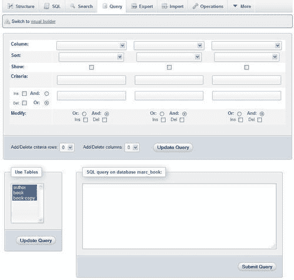
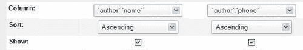
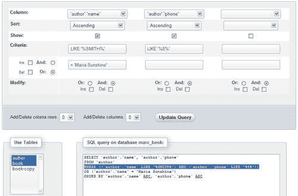
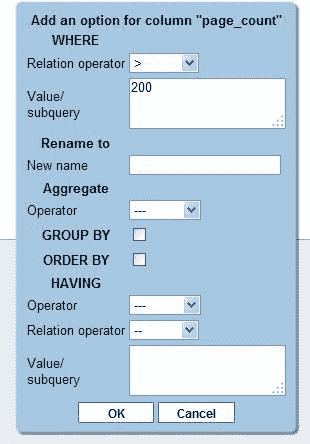
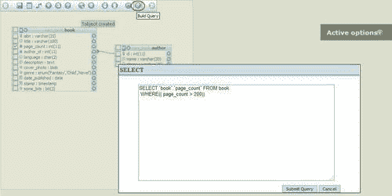

# 十二、生成多表查询

`Database`或 `Table`视图中的**搜索**页面用于单表查找。本章介绍了 `Database`视图中可用的多表**示例查询（QBE）**功能。

许多 phpMyAdmin 用户在 `Table`视图中逐个表地工作，因此往往忽略多表查询生成器，这是微调查询的一个极好特性。查询生成器不仅在多表情况下有用，而且在单表情况下也有用。它使我们能够为一列指定多个条件，这是 `Table`视图中的**搜索**页面不具备的功能。

### 注

本章中的示例假设 phpMyAdmin 配置存储已经进行了多用户安装（参见[第 1 章](01.html "Chapter 1. Getting Started with phpMyAdmin")，并且在[第 9 章](09.html "Chapter 9. Performing Table and Database Operations")的练习中创建的 `book-copy`表仍然存在于 `marc_book`数据库中。

要打开此功能的页面，请转到特定数据库的 `Database`视图（查询生成器支持一次只处理一个数据库），然后单击**查询**。

下面的屏幕截图显示了初始 QBE 页面。它包含以下元素：

*   一个**visual builder**链接（在本章末尾介绍）
*   标准列
*   用于添加条件行的接口
*   用于添加条件列的接口
*   表选择器
*   查询区
*   更新或执行查询的按钮

# 选表

初始选择包括所有表。因此，**列**选择器包含大量列。对于我们的示例，我们将只使用**作者**和**图书**表。因此，我们仅从**使用表**选择器中选择这些。

然后点击**更新查询**按钮。这将刷新屏幕并减少**列**选择器中可用的列数。我们可以随时在以后更改选定的表，使用浏览器的下拉菜单中的多选机制（通常是控制单击）。

# 探索列标准

默认情况下提供三个条件列。本节讨论我们用于编辑其标准的选项。这些选项包括选择列、对各个列进行排序、为各个列输入条件等。

## 列选择器：单列或所有列

**列**选择器包含所选表的所有单独列，以及每个表以星号（*）结尾的特殊选项，这意味着所有列都已被选中。

要显示 `author`表中的所有列，我们将选择**`author`.***并选中**显示**复选框，而不在**排序**和**标准**框中输入任何内容。在本例中，我们选择**`author`.`name`**，因为我们想为作者的姓名输入一些条件。

## 排序列

对于每个选中的单独列，我们可以指定一个排序（以**升序**或**降序**顺序），或者让此行保持不变（不排序，这是默认行为）。如果我们选择多个排序列，则排序将从左到右进行。

### 注

当我们要求对列进行排序时，通常选中**显示**复选框。但这不是必需的，因为我们可能只想执行排序操作而不显示此列。

## 显示一列

我们选中**显示**复选框，以便在结果中看到该列。有时，我们可能只想在列上应用一个条件，而不将其包含在结果页面中。在这里，我们添加 `phone`列，要求对其进行排序，并选择显示姓名和电话号码。我们还要求按升序对名称进行排序。排序将首先按姓名进行，如果姓名相同，则按电话号码进行。这是因为名称位于 phone 列左侧的列中，因此具有更高的优先级。

## 更新查询

在任何时候，我们都可以点击**更新查询**按钮查看我们生成的查询的进度。在执行查询之前，我们必须至少单击它一次。现在，让我们单击它并查看查询区域中生成的查询。在下面的例子中，我们将在每次修改后点击**更新查询**按钮。

我们已经选择了两个表，但是还没有从**书**表中选择任何列。因此，在生成的查询中没有提到该表。

## 向条件框中添加条件

在**条件**框中，我们可以为每个对应的列输入一个条件（关于 SQL `WHERE`子句的语法）。默认情况下，我们有两个标准行。要查找姓名中有**Smith**的所有作者，我们使用类似于**的**标准**（类似于“%Smith%”）**，然后单击**更新查询**。

我们还有另一行可以输入附加标准。假设我们也想找到作者**Maria Sunshine**。这一次，我们使用了一个**=**条件。两个条件行将由**或**操作符连接，默认从界面左侧选择。

为了更好地证明**或**运营商链接了两个条件行，现在让我们在电话号码上添加一个条件**，如“%8%”**，如以下屏幕截图所示：

通过检查**和**以及**或**操作符的位置，我们可以看到第一行条件是由**和**操作符链接的（因为**和**是在**名称**列下选择的），第二行条件是由**和**操作符链接的**或**接线员。我们刚刚添加**（如%8%）**的条件不是为了找到任何人，因为我们将所有名为“史密斯”的作者的电话号码改为“444-5555”（在[第 11 章](11.html "Chapter 11. Entering SQL Statements")中）

如果我们希望在同一列上有另一个条件，我们只需添加一个条件行。

### 调整条件行数

可以通过两种方式更改条件行的数量。首先，我们可以选中**条件**下的**Ins**复选框，添加一个条件行（点击**更新查询后）**。由于该复选框一次只能添加一个标准行，我们将取消选中该复选框并使用**添加/删除标准行**对话框。在此对话框中，我们选择添加两行。

再次点击**更新查询**按钮，出现如下画面：

现在，您可以看到还有两个额外的条件行（目前为空）。我们还可以删除标准行。这可以通过勾选我们要删除的行旁边的**Del**复选框来完成。让我们删除刚才添加的两行，因为现在不需要它们。**更新查询**按钮用指定的调整刷新页面。

### 调整标准列数

使用类似的机制，我们可以通过选中**修改**对话框或**添加/删除列**对话框中每个列下的**Ins**或**Del**复选框来添加或删除列。我们已经有一个未使用的列（在前面的图像中未显示）。在这里，我们使用位于未使用列下的**Ins**复选框添加了一列（这次我们需要它）：

# 生成自动连接（内部关系）

phpMyAdmin 可以在其构建的查询中生成表之间的联接，前提是定义了内部关系。现在，让我们用**书籍**表中的**标题**和**类型**列填充两个未使用的列，看看更新查询时会发生什么。

现在，有两个额外的标准列分别与**`book`.`title`**和**`book`.`genre`**列相关。phpMyAdmin 利用其对表之间定义的关系的了解，在**author_id**键列上生成一个**LEFT JOIN**子句（在前面的屏幕截图中突出显示）。当前版本的一个缺点是只检查内部关系，而不检查 `InnoDB`关系。

### 注

联接中可能涉及两个以上的表。

# 执行查询

点击**提交查询**按钮发送查询执行。在下面的屏幕截图中，您可以在上半部分看到完整生成的查询，在下半部分看到生成的数据行：

提交查询后，没有简单的方法（除了使用浏览器的**返回**按钮）返回查询生成页面。[第 14 章](14.html "Chapter 14. Using Query Bookmarks")讨论了如何保存生成的查询以供以后执行。

# 视觉建设者

从版本 3.4 开始，提供了另一种查询构建方法。通过将查询生成与**设计器**界面相结合，它利用了用户可能更熟悉的**设计器**界面。我们可以通过点击**切换到 visual builder**链接打开此界面，产生一个初始屏幕，如以下截图所示：

我们现在应该通过点击**小/大所有**图标来打开所有表的列列表。

每列都有一个左侧复选框和一个右侧选项图标。复选框用于指示我们希望成为结果一部分的列；虽然选项图标允许打开一个面板，我们将在其中指定要应用于此列的标准。例如，如果我们想要选择超过 200 页的书籍，我们会点击**page_count**列旁边的选项图标，并填充标准对话框，如以下屏幕截图所示：

点击**确定**保存该查询选项；现在，在右侧的**活动选项**对话框中可以使用该选项，我们是否需要查看该选项或将其删除。

为了构建查询，我们使用**构建查询**图标，生成如下屏幕截图所示的屏幕：

此时，我们可以使用其他选项优化查询，或者单击**提交查询**以获得结果。

# 总结

本章涵盖了各个方面，包括打开查询生成器、选择表、输入列条件、排序和显示列，以及更改条件行或列的数量。我们还学习了如何使用 `AND`和 `OR`操作符定义行和列之间的关系，以及如何在表之间使用自动联接。还介绍了**设计器**集成的可视化查询生成器。

下一章将向您展示如何在服务器之间同步数据以及如何管理复制。