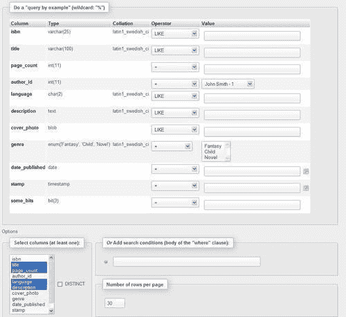
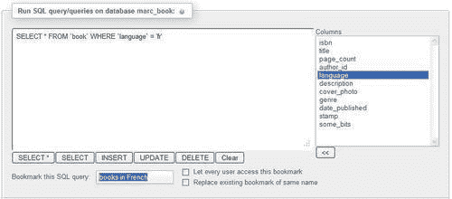
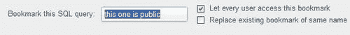
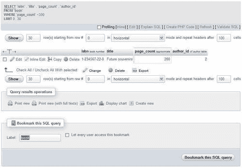
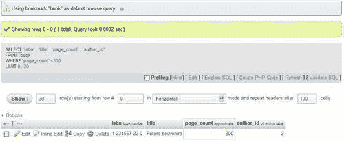
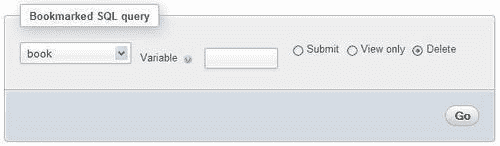
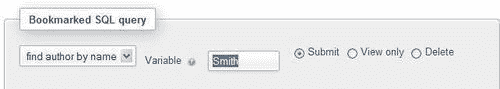

# 十四、使用查询书签

本章介绍 phpMyAdmin 配置存储的一个功能——查询书签。能够标记查询，并通过标签调用它们，可以节省实时时间。书签是具有以下属性的查询：

*   永久储存
*   可视
*   可擦除
*   与一个数据库相关
*   仅作为用户操作的结果记录
*   标记
*   默认情况下为 Private（仅对创建它们的用户可用），但可能为 public

书签也可以有可变部分，如本章后面的*将参数传递给书签*部分所述。

没有用于管理书签的书签页面。相反，书签的各种操作在特定页面上可用，例如结果页面或查询框页面。

# 比较书签和查询历史特征

在[第 11 章](11.html "Chapter 11. Entering SQL Statements")中，我们了解了自动存储查询（临时或永久）的 SQL 历史记录功能。历史记录中存储的查询和书签之间有相似之处。毕竟，这两个功能都是为了存储查询以便以后执行。但是，在查询的存储方式和触发查询记录的操作方面存在重要差异。

历史记录中的查询存储是自动的；而查询则通过用户的显式请求保存为书签。此外，永久历史记录中存储的查询数量有一个可配置的限制（参见[第 11 章）](11.html "Chapter 11. Entering SQL Statements")；但是，书签的数量不受限制。最后，历史记录功能以与发送时间相反的顺序显示查询。但是，书签是按标签显示的（不直接显示查询文本）。

总之，当我们既不打算调用查询，也不想记住键入的查询时，自动查询历史记录非常有用。这与书签功能形成对比，在书签功能中，我们故意要求系统记住一个查询，甚至给它一个名称（标签）。因此，与查询历史相比，我们可以用书签做更多的事情，但这两个特性都有其自身的重要性。

# 创建书签

有两种情况可以在执行查询之后（在这种情况下，我们不需要提前计划创建书签）和将查询发送到 MySQL 服务器执行之前创建书签。以下各节将探讨这两个选项。

## 查询成功后创建书签

初始书签创建可通过**书签此 SQL 查询**按钮实现。此按钮仅在执行生成结果的查询后出现（当至少找到一行时）；因此，这种创建书签的方法只存储 `SELECT`语句。例如，多表查询生成器生成的复杂查询（如[第 12 章](12.html "Chapter 12. Generating Multi-table Queries")所示）可以通过这种方式存储为书签，前提是它可以找到一些结果。

让我们看一个例子。在 `book`表的**搜索**页面中，我们选择结果中需要的列，并输入搜索值，如下图所示：



点击**Go**后，我们看到结果页面显示一个书签对话框。我们只为该书签输入一个标签**books for author 1**，然后单击**书签该 SQL 查询**将该查询另存为书签。书签保存在 `$cfg['Servers'][$i]['bookmarktable']`定义的表中。


此书签对话框可以在任何包含结果的页面上看到。作为测试，我们只需点击**浏览**表即可获得结果，然后将此查询存储为书签。但是，存储（在书签中）一个只需单击即可轻松完成的查询没有多大意义。

## 发送查询前存储书签

我们已经看到，在执行生成结果的 `SELECT`语句之后，很容易创建书签。有时，即使查询没有找到任何结果，我们也可能希望存储书签。如果查询所引用的数据尚未出现，或者如果查询是一条非 `SELECT`的语句，则可能出现这种情况。为了实现这一点，我们在 `Database`视图、 `Table`视图和查询窗口的**SQL**选项卡中提供了**书签此 SQL 查询**对话框。

现在我们进入 `book`表的**SQL**页面，输入检索法文图书的查询，直接将法文**图书**书签标签放入**书签本 SQL 查询**对话框。如果以前使用过此书签标签，将创建一个同名的新书签，除非选中**替换同名的现有书签**复选框。书签带有内部识别号，以及用户选择的标签。



点击**Go**按钮，执行查询并将其存储为书签。如果查询没有找到任何内容，这并不重要。这就是我们如何为非选择查询（如 `UPDATE, DELETE, CREATE TABLE`）生成书签的方法。

### 注

这种技术也可以用于返回结果或不返回结果的 `SELECT`语句。

## 公开书签

默认情况下，我们创建的所有书签都是私有的。创建书签时，我们登录时使用的用户名将与书签一起存储。假设我们选中了**让每个用户访问此书签**复选框，如下面的屏幕截图所示：



这将产生以下效果：

*   所有访问同一数据库（当前数据库）的用户都可以访问书签。
*   用户从书签中查看有意义结果的能力取决于他们对书签中引用的表拥有的权限。
*   任何用户都可以删除书签。
*   通过在发送查询之前存储此书签，并使用**替换同名的现有书签**选项，用户可以更改书签的查询。

公共书签在被调用时会显示一个**（共享）**后缀。

## 表的默认初始查询

在前面的示例中，我们根据偏好选择书签标签。但是，按照惯例，如果私有书签与表具有相同的名称，则在单击该表的**浏览**时将执行该书签。因此，我们将看到书签的结果，而不是该表的正常**浏览**结果。

假设我们有兴趣查看（默认情况下，在**浏览**模式下）所有页数小于 300 的书籍。我们首先从**搜索**页面生成合适的查询，然后在结果页面上使用**书籍**作为书签标签。



执行此操作后，创建此书签的用户每次浏览 `book`表时，都会看到以下屏幕截图：



## 多查询书签

单个书签还可以存储多个查询（用分号分隔）。这对于非`-SELECT` 查询非常有用。例如，假设我们需要定期从电话号码中删除一个无效的区号，从而清除有关作者的数据。此操作之后始终会显示 `author`表。

为了实现这一目标，我们存储了一个书签（在发送执行之前），其中包含以下查询：

```php
update author set phone = replace(phone,'(123)', '(456)');
select * from author;

```

在书签中，我们可以放置许多数据修改语句，例如 `INSERT, UPDATE`或 `DELETE`，然后可选地添加一条 `SELECT`语句。堆积大量的 `SELECT`语句不会产生预期的结果，因为我们只能看到最后一条 `SELECT`语句获取的数据。

# 从书签列表中调用书签

任何创建的书签都可以在以下页面上找到：

*   `Table`视图：**marc_book**中任意表的**SQL**页面
*   查询窗口：**SQL 历史记录**页签
*   `Database`视图：**马克书**数据库的**SQL**页面


回忆书签时有三种选择-**提交、仅查看**和**删除。（提交**为默认值）。

## 执行书签

选择书签并点击**Go**执行存储的查询并显示其结果。书签执行产生的页面没有另一个对话框来创建书签，因为这是多余的。

### 注

我们得到的结果不一定与创建书签时相同。它们反映了数据库的当前内容。只有查询存储为书签。

## 操作书签

有时，我们可能只想确定书签的内容。这是通过选择书签并选择**仅查看**来完成的。然后显示查询，我们有机会修改其内容。通过这样做，我们将编辑原始书签查询的副本。要保留这个新的、经过编辑的查询，我们可以将其另存为书签。同样，这将创建另一个书签，即使我们选择相同的书签标签，除非我们明确要求替换原始书签。

可以使用**删除**选项擦除书签。没有确认对话框来确认书签的删除。我们现在应该继续删除我们的**图书**书签。



# 将参数传递给书签

如果我们再看看我们创建的第一个书签（查找**作者 1 的所有书籍）**，我们会意识到，尽管它很有用，但它仅限于查找一位作者始终是同一位作者。

特殊的查询语法允许将参数传递给书签。此语法使用了一个事实，即 MySQL 忽略了包含在 `/*`和 `*/`中的 SQL 注释。如果 `/*[VARIABLE]*/`构造存在于查询中的某个地方，则在执行时将使用调用书签时提供的值对其进行扩展。

## 创建参数化书签

比如说，当我们不知道某位作者的 `id`时，我们想找到该作者的所有书籍。我们首先输入以下查询：

```php
SELECT author.name, author.id, book.title
FROM book, author
WHERE book.author_id = author.id
/* AND author.name LIKE '%[VARIABLE]%' */

```

注释字符 `(/* */)`之间的部分稍后将展开，标记将被删除。我们将此查询标记为一个书签，名为**按姓名**查找作者（在执行之前），然后单击**Go**。查询的第一次执行只是在检索所有作者的所有书籍时存储书签，因为这次我们没有向查询传递参数。

在本例中， `WHERE`子句中有两个条件，其中一个包含特殊语法。如果我们在 `WHERE`子句中的唯一标准需要一个参数，我们可以使用像 `/* WHERE author_id = [VARIABLE] */`这样的语法。

## 传递参数值

为了测试书签，我们像往常一样调用它，并在**变量**对话框中输入一个值。



当我们点击**Go**时，我们会看到扩展的查询，以及作者史密斯的书。


# 总结

在本章中，我们概述了如何记录书签（在发送查询之后或之前），如何操作它们，以及如何公开一些书签。本章还介绍了**浏览**模式的默认初始查询。它还包括将参数传递给书签。

下一章将解释如何通过 phpMyAdmin 提供的工具生成解释数据库结构的文档。