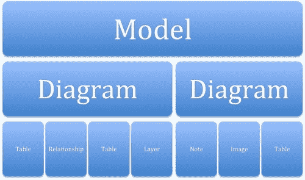
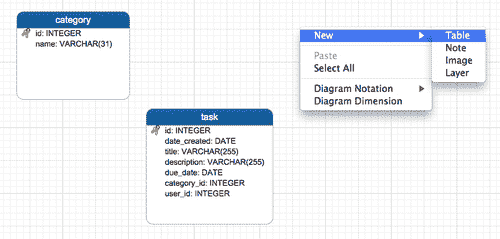
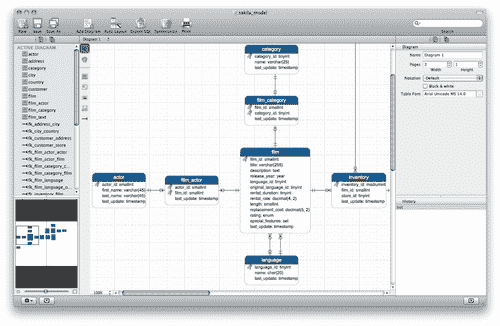

# 第四章 Navicat 数据建模

自 Navicat 版本 10 起，应用程序中添加了数据建模器功能，允许用户在可视化编辑器中创建和编辑数据库对象，如表、字段和关系。

PremiumSoft（Navicat 的制造商）也将此功能作为一个单独的应用软件产品发布，名为**Navicat Data Modeler**，可用于 Windows、Mac OS X 和 Linux。对于那些只需要可视化工具进行数据建模，而不需要其他管理和数据管理工具（如前几章所述）的人，Navicat data Modeler 可能是一个合适的选择。

虽然 Oracle 的 MySQL Workbench（MySQL 的 GUI 管理和数据库建模工具）可以被视为一个免费的替代方案，但 Navicat Data Modeler 提供了简化模型对象操作的方法，并提供了一些高级功能，如历史跟踪和数据库同步；有鉴于此，您可以异步使用数据图，以便稍后与实际数据库结构进行同步。为了更好地理解 Navicat 建模工具的功能，我们将在本章开始时按照教程设计第一个数据模型，以帮助您逐步学习每个功能。

在本章中，我们将学习如何掌握 Navicat 的可视化数据建模工具，该工具便于：

*   在 GUI 中设计数据模型
*   在可视化编辑器中创建、编辑和操作表结构
*   将数据模型转发到`.sql`文件中
*   将现有数据库逆向工程为可视化表示

# 与 Navicat 的模型设计师合作

在开始设计第一个数据模型之前，最好先了解 Navicat data Modeler 提供的工具，我们可以使用这些工具。

Navicat 主窗口主工具栏上的最后一个按钮是**型号**按钮。单击此按钮将带您进入模型视图。另一种方法是从**查看**菜单中选择**型号**（在 Mac 上，您可以同时按下*+*键和*8*键作为快捷键）。然后，您可以通过右键单击主窗口对象窗格中的任意位置并选择**新建模型**来创建一个新的空白模型。

### 注

在 Mac 电脑上，同时按下*+*键和*N*键作为快捷键，或点击主窗口左下框的*+*按钮。在 Windows PC 上，只需单击位于主窗口主工具栏下的辅助工具栏上的**新型号**按钮。

Mac 和 Windows 上 Navicat 工具栏的屏幕截图如下：


此操作还将打开一个名为**模型设计器**的新窗口，您可以在其中编辑数据模型。**model designer**窗口的左侧窗格包含树调色板的示意图，可帮助您切换对应的树调色板；单击模型树上方的小图标即可获得模型树调色板。图表树选项板按字母顺序列出活动图表的模型对象，例如表、关系、注释和图像（图片）。“模型树”选项板仅列出模型中所有图表的表对象。现在这些隐喻可能非常令人困惑，所以我将简要描述每个隐喻的含义，并解释它们的层次结构。

每个模型可以包含一个或多个关系图，在数据库管理员中也可以称为**实体关系图**（**ER 图**）。一个数据库设计可以在一个模型中的多个图中分割。还有**层**的概念，但与图形和图像处理应用程序不同，Navicat 的数据建模器中的层不是容器或占位符。与其他对象一样，它们是在画布上绘制的，但略有不同，因此它们是不透明的，可以覆盖在其他对象上。通过对相关对象进行分组并根据不同关注点将其分离，层在组织某些对象时非常有用。例如，在设计 ERP 数据库时，您可能希望在一个层中收集与会计和财务相关的表，在另一个层中收集与销售和营销相关的表。



与右侧对齐的是一个垂直工具栏，也称为模型图调色板，从中可以选择要放置在图中的数据库对象的类型。此上下文中的可用对象包括表、注释（标签）、图片（图像）、层和关系。窗口右侧包含**属性**调色板（在窗口的左下方），用于显示和编辑活动图及其包含的对象的属性。在这里，您可以管理与画布中所选项目相关的每个设置，以及重命名图表、调整页数（打印时有效）、调整对象标签的字体和颜色以及图表的符号的选项。有五种可用的符号-**默认值**、**简单值**、**IDEF1X**、**UML**和**鱼尾纹**。

在**属性**调色板的下方是**历史调色板**（Mac 版本），它列出了您一步一步执行的每个操作，允许您按照自己的意愿以任意多个步骤执行这些操作。另一侧还有一个预览窗格，几乎对称放置，可用于类似地图的导航。在 Windows 版本中，这两个选项板彼此放置在完全相反的位置。请参阅 Mac 版本中 Navicat 的以下屏幕截图：


## 创建我们的第一个模型

本节提供了一个教程，我们将为数据库创建一个非常简单的应用程序模型。我们的新数据库将由三个表组成：**任务**、**类别**和**用户**。使用模型设计器，我们将设计这些表，并定义字段类型、主键和关系。所有这三个表都将使用外键相互关联。然后，我们将对模型进行注释，并最终生成实际的数据库，对我们将创建的模型进行正向工程设计。要开始处理模型，请单击 Navicat 主窗口主工具栏上的大**模型**图标，切换到**模型视图**窗口（如果您尚未切换）；或者从**视图**菜单中选择**模型**，然后右键点击对象窗格中的空白区域，从弹出菜单中选择**新模型**，创建新模型。在 Windows 版本的 Navicat 中，您也可以从 Navicat 主窗口主工具栏正下方较小的辅助工具栏中单击**新型号**按钮。在 Mac 版本中，没有辅助工具栏。取而代之的是，在下框上有一个**+**标志，下框的厚度足以装下一个小按钮。此**+**符号直观地表示在所选上下文中添加对象的功能。在这种情况下，一个模型附带两个以上的按钮；一个有一个**-**符号，表示删除，另一个有一个铅笔图标，表示编辑。（Windows 版本有明确标记为**设计模型**和**删除模型**的等效按钮）执行此步骤后，将弹出一个名为**Untitle–Model**的新模型设计器窗口，显示一个名为**图 1 的空白图**。现在，让我们通过创建图表中的第一个表格来开始编辑模型。单击垂直模型图表工具栏中的**表格**按钮（一个带有表格形状图标的小按钮），然后单击画布的空白区域。您也可以右键单击画布并选择**新建弹出菜单中的****表**将在您上次单击的右侧画布中绘制一个新的带圆角的方形框，并突出显示一个标记为**表 1**的蓝色标题栏，表示为方便起见，可以对其进行重命名。要对其进行重命名，请键入`category`然后按*输入*键。接下来，在框内单击鼠标右键，从弹出菜单中选择**添加字段**。（另一种快捷方式是在编辑表格或字段名称时按键盘上的向下箭头或*选项卡*键。）您会注意到代表表格的框中有一个文本光标在闪烁。

输入`id`并按*进入*。当 Navicat 创建字段时，它还通过您输入的名称感知该字段的含义，并自动将该字段定义为**整型**类型的主键。现在继续并重复上一步，这次输入`name`作为字段名，然后按*输入*。尤里卡！Navicat 也正确地理解了这一点，并将字段创建为长度为 255 个字符的 varchar 类型。255 个字符的长度可能太离谱了，但我们将看到如何在一点时间内将其缩减到原来的大小。ID 和 name 字段对于 category 表已经足够了，所以我们现在进入第二个表。请参阅以下屏幕截图，了解如何创建表**类别**和**任务**：



1.  创建另一个表并将其命名为`task`。
2.  为这个字段添加一个名为`id`的字段（请参见 Navicat 如何使其成为**整数**类型的另一个主键）。
3.  将第二个字段添加为`title`并按*键输入*。（Navicat 将创建类型为**VARCHAR（255）**的一个。）
4.  同样，添加以下字段-`description`、`due_date`、`category_id`和`user_id`。（Navicat 将决定创建它们的类型。）
5.  创建最后一个表并将其命名为`user`。
6.  为其创建以下字段-`id`、`login_name`、`password`、`email`和`role.`

现在，我们需要对其中一些字段进行微调。例如，我们将把这些 varchar 字段的长度从 255 个字符的长度修剪为更合理的长度。为此，右键点击**任务**并从弹出菜单中选择**设计表**。这将使表设计器界面与您在[第 2 章](2.html "Chapter 2. Working with Databases")*使用数据库*中看到的表非常相同。在 Mac 中，该表将类似于以下屏幕截图：


在此屏幕上，您可以添加或删除字段，或重命名字段，更改其数据类型，更改数据长度，分配或删除主键，定义字段的默认值，添加索引，甚至添加外键或唯一性定义等约束。

您甚至可以通过鼠标在该界面中拖放字段来重新排序字段。

对于这个例子，我们将把标题的长度减少到`50`，而描述的长度减少到`200`。

您可以参考[第 2 章](2.html "Chapter 2. Working with Databases")、*使用数据库*，了解更多有关表格设计器界面及其提供的功能的详细信息，以编辑和调整表格结构。

## 定义关系

现在我们有了三个相关的表，是时候定义它们之间的关系了。此模型用于一个**简单易用的**数据库，我们的主要数据将存储在**任务**表中。在此处输入的每个任务都有标题、说明、输入日期、截止日期、类别和用户。在这里，我们将类别和用户存储在单独的表中，因此我们需要使用 ID 列引用**任务**表中的相关类别和用户。**类别**表与**任务**表之间存在多对一关系。在我们的例子中，一个任务可以有一个类别与其关联，但一个类别下可以有许多任务。因此，一个任务可以分配给一个用户，但一个用户可以有许多任务。

要在两个表之间建立连接，首先从垂直调色板中选择关系工具，然后将指针移动到**任务**表，点击并拖动**类别 id**字段，将其拖动到**类别**表的**id**字段上。这将在两个表之间建立连接，并在画布上显示一条连接它们的线。

但这还不是全部。到目前为止，我们所做的是建立一个基本的一对一关系，没有关于两个对象之间基数的进一步信息，如以下屏幕截图所示：


现在，右键单击相邻行，然后从弹出菜单中选择**类别上的**基数**中的一个或多个**。现在两个表之间建立了一对多关系，自动创建从**类别**到**任务**的外键；此外，连接线的类别端在图中将有一个叉形接头。图表编辑器（直接在画布上编辑）的一个缺点是，当通过点击和拖放手势直观地定义关系时，线的接头可能不会放置在引用和引用字段的开始或结束处。因此，您需要通过单击关节并将其拖动到图表对象上的正确位置来手动调整它们（当然，如果您希望这些关系的视觉表示更精确的话）。

我们也可以使用**设计关系。。。弹出菜单中的**命令相当于双击连接线，这将使我们回到激活了**外键**选项卡的表格设计器。在这里，您可以微调相邻表字段对的外键定义；此外，它还为您提供了在联接中引用多个字段的灵活性。

正如您所看到的，最好将画布上的编辑和表设计器彼此结合使用，而不是作为备选方案，以充分利用两个世界，并在数据建模中获得最大的灵活性。请参阅以下屏幕截图，了解如何创建**外键**：


### 注

正如许多 DBA 和软件项目经理所建议的（如果不需要的话），在创建数据库对象时遵循某些命名约定是一个好主意，尤其是像**外键**这样的约束。我更喜欢将**外键命名为**，以前缀`fk_`开头，并由表名连接，然后以`_4_`开头，接着是引用的表名，然后是其主键字段的名称。例如，在任务类别关系的情况下，我使用了`fk_task_4_category_id`作为外键名称，这意味着该约束是为**任务**表定义的外键，该表从任务的**类别**字段中引用**类别**表的**id**字段**任务**表本身。

虽然 Navicat 为数据库对象管理提供了很多功能，特别是约束和索引管理，但许多其他工具却没有。在需要修改的情况下，对于不使用复杂 GUI 工具来管理数据库、在数据库中查找外键或其他约束的人来说，这可能会变得很麻烦，除非从头到尾都遵守某个命名标准，并且所有相关人员都遵守该标准。

编辑完成后，点击屏幕右下方的**确定**按钮保存更改，或点击**取消**放弃更改。

## 通过注释和图像为模型添加一些活力

想象一下，您正在设计一个数据库模型作为项目提案的一部分，并且希望您的模型看起来漂亮、吸引人。嗯，要想让你的模型吸引人，可能需要一个精心设计的 ER 图。垂直模型图调色板上的其他对象（我称之为注释工具）可以帮助您实现这一点。

在垂直模型图调色板上，单击带有类似 post-it 便笺的黄色图标的小按钮，激活便笺工具，然后单击画布上的空白区域，放入便笺。您可以双击它来编辑其文本，如以下屏幕截图所示：


我们刚刚添加的便笺看起来确实像一张贴子，我个人认为，它看起来相当不错。但是，如果希望更改注释的外观（例如颜色和文本样式），可以转到“属性”窗格并尝试不同的设置。属性编辑器允许您调整注释颜色、（矩形）大小、位置，甚至字体大小和样式。

如果您不希望模型上有一张便签，而是更现代的东西，您可以选择使纸质图形完全消失，只留下文本。为此，只需使用箭头工具单击注释，使其保持高亮显示（或选中），然后在属性窗格中，从名为**注释样式**的下拉列表中选择**标签**。在 Windows 中，右键单击注释，然后转到**样式****注释**。

在 notes 图标的正下方，有一个带有小图片图标的图像工具。您可以先单击此工具，然后单击画布上的任意位置，将任何图片或图像添加到图表中。这将提示您使用操作系统的标准**打开**文件对话框，从磁盘中选择图像文件或照片。执行此操作后，您选择的图像将放置在您在画布上单击的位置。例如，你可以把你的公司标志放在一个角落里，让它看起来和感觉更像公司。

## 分层作业

如前所述，Navicat 的模型设计器中的层仅用于为某种注释着色画布的某些区域，并可用于标记画布的特定区域以收集特定类型业务逻辑的某些表。例如，您可能希望将与人力资源相关的表分开，并将它们放在某个层的边界内，并将与制造和物流相关的表放在另一个层中，例如，在同一图表中，放在由不同层区分的不同区域，最好用不同的颜色。

要创建一个层，只需单击垂直调色板上关系工具上方（以及图像工具下方）的图标，然后单击并拖动画布上您想要放置层的矩形区域。

### 注

请记住，层既不是容器也不是占位符，它们除了作为视觉辅助工具之外没有其他用途。

## 删除不需要的对象

在模型设计器中创建表时，它开始同时存在于关系图和模型中。此后从图表中删除一个表并不一定意味着它将从模型中删除，但好消息是，如果您右键单击该表并从图表中选择**删除****或**删除****，系统会询问您要从哪个上下文中删除一个表来自图和模型**。**

有什么区别？这个决定会影响从模型设计生成数据库时将创建的对象。在本节的最后，您将学习如何通过从模型设计生成 SQL 来对数据库进行正向工程。

表和关系以外的对象对数据库结构没有影响，因此从图表中删除它们也会将其从模型中删除。

## 使用多个图表

如本章开头所述，一个模型可以包含多个图表。如果您使用的是非常大的数据库（其模型太大而无法管理），那么在一个模型中使用多个关系图可能是必要的，这样您就别无选择，只能将它们划分为子组，并将它们放在单独的关系图中。

我们不会详细讨论在同一个模型中使用多个图表的问题。不过，我想在这里提几点。此外，Navicat for Windows 的用户界面在某些方面与 Mac 版本有所不同，因此我将尝试简要解释这两个用户界面之间的差异。

在 Windows 和 Mac 平台上，只需单击模型设计器窗口工具栏上的**新建图表**按钮即可创建新图表。在 Windows 上执行此操作时，新图表将显示在画布区域正上方的新选项卡下。只需单击图表的选项卡，即可在图表之间切换。

在 Mac 版本中，画布的左上方没有选项卡栏，而是有一个标有活动图表名称的下拉菜单。同样在 Mac 版本中，在每个窗口的左下方，都有一个小的黑色齿轮形状的图标。单击时，会弹出一个菜单，供您添加与当前上下文相关的对象。要在 Mac 上的图表之间切换，只需单击其名称，然后从打开的下拉菜单中选择要切换的图表名称。

# 将模型图导出到 SQL

我们已经完成了一个简单但功能强大的数据库模型设计。现在，是时候使用它了。

我前面提到了从模型生成数据库的可能性。为了用我们从头开始设计的模型实现这一点，我们首先需要将我们的设计导出到一个`.sql`文件。

在 Mac 上，模型设计器窗口的工具栏上有一个标记为**导出 SQL**的按钮。按下该按钮时，画布将被导出设置窗体遮罩，在该窗体中，您必须指示要导出的表，并可以选择指定一些高级设置，例如从生成的 SQL 中排除 DROP 语句、主键、索引和外键。如果你不想遗漏任何东西，你可以不动这些东西。

但是，在 Windows 版本中，工具栏上没有“导出”按钮；相反，您必须选择**工具****导出 SQL。。。从菜单栏中选择**。

我建议您取消选中 DROP 语句选项，这可能会导致 SQL 错误，因为这是我们第一次创建**简单易用的**数据库。

您可以将要导出的文件命名为类似于`simple-todo.sql`的名称，然后继续导出过程。

在[第 3 章](3.html "Chapter 3. Data Management with Navicat")、*与 Navicat*的数据管理中详细讨论了数据的导入和导出。

导出文件的源代码应类似于以下内容：

```sql
CREATE TABLE category (
id INTEGER NULL,
name VARCHAR(31) NULL,
PRIMARY KEY (id) 
);
CREATE TABLE task (
id INTEGER NULL,
date_created DATE NULL,
title VARCHAR(50) NULL,
description VARCHAR(200) NULL,
due_date DATE NULL,
category_id INTEGER NULL,
user_id INTEGER NULL,
PRIMARY KEY (id) 
);
CREATE TABLE user (
id INTEGER NULL,
login_name VARCHAR(12) NULL,
password VARCHAR(12) NULL,
email VARCHAR(40) NULL,
role INT NULL,
PRIMARY KEY (id) 
);
ALTER TABLE task ADD CONSTRAINT fk_task_4_category FOREIGN KEY (category_id) REFERENCES category (id);
ALTER TABLE task ADD CONSTRAINT fk_task_4_user FOREIGN KEY (user_id) REFERENCES user (id);
```

最后，通过应用您在[第 2 章](2.html "Chapter 2. Working with Databases")、*使用数据库*和[第 3 章](3.html "Chapter 3. Data Management with Navicat")、*使用 Navicat*进行数据管理中所学到的知识，您可以创建一个名为**simple_todo**或只是**todo**的新数据库，并**执行 SQL 文件。。。**根据我们导出的模型生成数据库。

### 注

还可以在查询窗口中粘贴下面的代码，并执行查询以获得相同的结果，前提是您已经创建了空白数据库。

# 将数据库反向工程为模型

在前面的部分中，我们学习了如何从头开始设计数据模型。现在您已经熟悉了数据建模工具和图表结构，我们可以开始从现有数据库生成模型。

对于这一部分，我选择了 Sakila 示例数据库，这是我在[第 3 章](3.html "Chapter 3. Data Management with Navicat")中介绍的，*使用 Navicat*进行数据管理。如果您已经学习了上一章中的教程，那么您必须有一个**sakila**数据库的工作副本，可以将其反向工程到数据模型中。如果没有，现在是研究它的好时机，至少按照步骤将**sakila**数据库导入 MySQL 服务器。

进入 Navicat 的主窗口，在**连接**窗格中找到**sakila**数据库；右键点击其名称，选择**反向数据库进行建模。。。从弹出菜单中选择**。

新的“模型设计”窗口应立即显示，以可视化图表的形式显示 Sakila 数据库的所有表和关系，如以下屏幕截图所示：



您可以尝试应用本章所学内容，例如，添加注释和图层，以及微调连接线。

如果最终通过添加表、字段和关系来修改模型，则可以将这些更改同步回**sakila**数据库，而无需从 SQL 文件重新生成整个数据库。

要执行此操作，只需点击工具栏（Mac 上）上的**同步**按钮或选择**工具****同步到数据库。。。**从菜单栏（在 Windows 上）。

有关数据同步过程及其设置的详细信息，请参见[第 3 章](3.html "Chapter 3. Data Management with Navicat")、*与 Navicat*的数据管理。

# 总结

本章开始时，我们让您了解 Navicat 的可视化数据建模器、它介绍的隐喻以及如何设计表、字段、约束以及这些对象之间的关系。这些都是可视化和基于表单的工具，类似于前面章节中介绍的 Navicat 的其他工具。

使用这些工具，您了解了如何从头开始设计数据库模型，然后从模型中实际生成该数据库。

最后，我们对一个更大的现有数据库进行了反向工程，并通过一个单击向导自动生成了它的可视化模型，您已经了解了如何在处理模型时将更改同步回数据库。