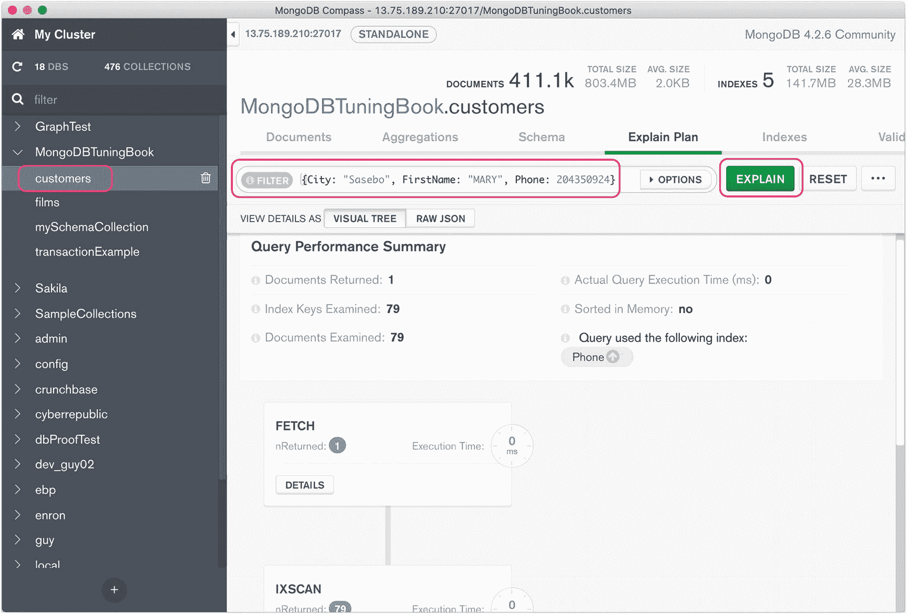
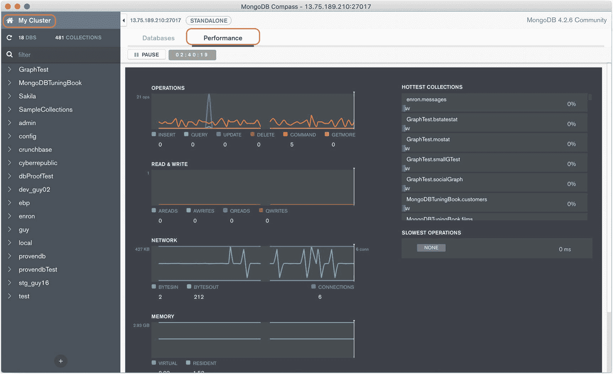

# 三、贸易工具

他们说一个商人的好坏取决于他或她的工具。幸运的是，您不需要昂贵或难以找到的工具来调优 MongoDB 应用或数据库。但是，您应该非常熟悉 MongoDB 在 MongoDB 服务器中免费提供给您的工具。

在本章中，我们将回顾构成 MongoDB 性能调优基本工具包的组件，特别是:

*   `explain()`方法，揭示了 MongoDB 在执行命令时采取的步骤

*   *分析器*，它允许您捕获和分析 MongoDB 服务器上的工作负载

*   揭示 MongoDB 服务器全局状态的命令，特别是`ServerStatus()`和`CurrentOp()`

*   图形化的 MongoDB *Compass* 工具，它为前面列出的大部分命令行实用程序提供了一个用户友好的图形化替代工具

## 介绍解释( )

`explain()`方法允许您检查查询计划。这是调优 MongoDB 性能的重要工具。

对于几乎所有的操作，MongoDB 都有不止一种方法来检索和处理所涉及的文档。当 MongoDB 准备执行一条语句时，它必须决定哪种方法最快。确定这个“最优”数据路径的过程就是我们在第二章[中介绍的*查询优化*的过程。](02.html)

例如，考虑以下查询:

```js
db.customers.
  find(
    {
      FirstName: "RUTH",
      LastName: "MARTINEZ",
      Phone: 496523103

    },
    { Address: 1, dob: 1 }
  ).
  sort({ dob: 1 });

```

对于这个例子，假设在`FirstName`、`LastName`、`Phone`和`dob`上有索引。这些索引为 MongoDB 解析查询提供了以下选择:

*   扫描整个集合，寻找符合姓名和电话号码过滤条件的文档，然后按`dob`对这些文档进行排序。

*   使用`FirstName`上的索引找到所有的“RUTH ”,然后根据`LastName`和`Phone`过滤这些文档，然后在`dob`上对剩余的文档进行排序。

*   使用`LastName`上的索引找到所有的“MARTINEZ ”,然后根据`FirstName`和`Phone`过滤这些文档，然后在`dob`上对剩余的文档进行排序。

*   使用`Phone`上的索引查找电话号码匹配的所有文档。然后排除任何不是露丝·马丁内斯的，再按`dob`排序。

*   使用`dob`上的索引按照出生日期的顺序对文档进行排序，然后排除不符合查询条件的文档。

每种方法都会返回正确的结果，但是每种方法都有不同的性能特征。MongoDB 优化器的工作是决定哪种方法最快。

`explain()`方法揭示了查询优化器的决策——在某些情况下——让您检查它的推理。

### 开始使用 explain()

为了检查优化器的决策，我们使用集合对象的`explain()`方法，并向该方法传递一个`find()`、`update()`、`insert()`或`aggregate()`操作。例如，为了解释我们之前介绍的查询，我们可以发出这个命令 <sup>[1](#Fn1)</sup> :

```js
var explainCsr=db.customers.explain().
  find(
    {
      FirstName: "RUTH",
      LastName: "MARTINEZ",
      Phone: 496523103
    },
    { Address: 1, dob: 1 }
  ).
  sort({ dob: 1 });
var explainDoc=explainCsr.next();

```

`explain()`发出一个游标，返回包含查询执行信息的 JSON 文档。因为它是一个光标，我们需要在调用`explain()`之后通过调用`next()`来获取解释输出。

解释输出中最初最重要的部分是`winningPlan`部分，我们可以这样提取:

```js
mongo> printjson(explainDoc.queryPlanner.winningPlan);
{
  "stage": "PROJECTION_SIMPLE",
  "transformBy": {
    "Address": 1,
    "dob": 1
  },
  "inputStage": {
    "stage": "SORT",
    "sortPattern": {
      "dob": 1
    },
    "inputStage": {
      "stage": "SORT_KEY_GENERATOR",
      "inputStage": {
        "stage": "FETCH",
        "filter": {
          "$and": [
           <snip>
          ]
        },
        "inputStage": {
          "stage": "IXSCAN",
          "keyPattern": {
            "Phone": 1
          },
          "indexName": "Phone_1",
          "isMultiKey": false,
          "multiKeyPaths": {
            "Phone": [ ]
          },
          "isUnique": false,
          "isSparse": false,
          "isPartial": false,
          "indexVersion": 2,
          "direction": "forward",
          "indexBounds": {
            "Phone": [
              "[496523103.0, 496523103.0]"
            ]
          }
        }
      }
    }
  }
}

```

它仍然非常复杂，我们删除了一些内容来简化它。但是，您可以看到它列出了查询执行的多个阶段，每个阶段(前一步)的输入嵌套为`inputStage`。为了破译输出，您从嵌套最深的`inputStage`——从内向外读取 JSON 开始获取计划。

如果您愿意，您可以使用我们的实用程序脚本中的`mongoTuning.quickExplain`函数，按照执行的顺序打印出各个步骤:

```js
Mongo Shell>mongoTuning.quickExplain(explainDoc)
1      IXSCAN Phone_1
2     FETCH
3    SORT_KEY_GENERATOR
4   SORT
5  PROJECTION_SIMPLE

```

这个脚本以非常简洁的格式打印执行计划。以下是对每个步骤的解释:

1.  `IXSCAN Phone_1` : MongoDB 使用`Phone_1`索引来查找与`Phone`属性具有匹配值的文档。

2.  `FETCH` : MongoDB 过滤掉从索引返回的不具有正确的`FirstName`和`LastName`值的文档。

3.  `SORT_KEY_GENERATOR` : MongoDB 从`FETCH`操作中提取`dob`值，为后续的`SORT`操作做准备。

4.  `SORT` : MongoDB 根据`dob`的值对文档进行排序。

5.  `PROJECTION_SIMPLE` : MongoDB 将`address`和`dob`属性发送到输出流中(这是查询请求的唯一属性)。

有很多种可能的执行计划，我们将在后面的章节中看到很多。

熟悉 MongoDB 可能采用的执行步骤对于理解 MongoDB 正在做的事情至关重要。你可以在 [`https://github.com/gharriso/MongoDBPerformanceTuningBook/blob/master/ExplainPlanSteps.md`](https://github.com/gharriso/MongoDBPerformanceTuningBook/blob/master/ExplainPlanSteps.md) 找到这本书的 Github 库的不同步骤的解释。您还可以在 [`https://docs.mongodb.com/manual/reference/explain-results/`](https://docs.mongodb.com/manual/reference/explain-results/) 的 MongoDB 文档中找到大量信息。

光是`explain()`操作的数量就可能让人望而生畏，但是大多数时候，您将会处理一些基本程序的组合，例如

*   `COLLSCAN`:不使用索引扫描整个集合

*   `IXSCAN`:使用索引查找文件(见第 [5 章](05.html)关于索引的细节)

*   `SORT`:不使用索引的文件分类

### 替代计划

我不仅能告诉你哪个计划被采用了，还能告诉你哪个计划被否决了。被拒绝的计划可以在`queryPlanner`部分的数组`rejectedPlans`中找到。这里，我们使用`quickExplain`来检查一个被拒绝的计划:

```js
Mongo> mongoTuning.quickExplain
      (explainDoc.queryPlanner.rejectedPlans[1])
1       IXSCAN LastName_1
2       IXSCAN Phone_1
3      AND_SORTED
4     FETCH
5    SORT_KEY_GENERATOR
6   SORT
7  PROJECTION_SIMPLE

```

这个被拒绝的计划合并了两个索引——一个在`LastName`上，一个在`Phone`上——来检索结果。为什么被拒？第一次执行这个查询时，MongoDB 查询优化器估计了执行每个候选计划所需的工作量。具有最低工作估计的计划——通常是必须处理最少数量文档的计划——胜出。`queryPlanner.rejectedPlans`列出被拒绝的计划。

### 执行统计

如果您将参数“`executionStats"`传递给`explain()`，那么`explain()`将执行整个请求并报告计划中每一步的执行情况。这里有一个使用`executionStatistics`的例子:

```js
var explainObj = db.customers.
  explain('executionStats').
  find(
    {FirstName: "RUTH",
      LastName: "MARTINEZ",
      Phone: 496523103},
    { Address: 1, dob: 1 }
  ).sort({ dob: 1 });

var explainDoc = explainObj.next();

```

执行统计包含在生成的计划文档的`executionStages`部分:

```js
mongo> explainDoc.executionStats
{
  "executionSuccess": true,
  "nReturned": 1,
  "executionTimeMillis": 0,
  "totalKeysExamined": 1,
  "totalDocsExamined": 1,
  "executionStages": {
    "stage": "PROJECTION_SIMPLE",
    "nReturned": 1,
    "executionTimeMillisEstimate": 0,
    "works": 6,
    "advanced": 1,
    "needTime": 3,
    "needYield": 0,
    "saveState": 0,
    "restoreState": 0,
    "isEOF": 1,
    "transformBy": {
      "Address": 1,
      "dob": 1
    },
    "inputStage": {
      "stage": "SORT",
// Many, many more lines of output
            }}
}

```

Note

为了获得执行统计数据，`explain("executionStats")`将完全执行相关的 MongoDB 语句。这意味着它可能需要比简单的`explain()`更长的时间来完成，并给 MongoDB 服务器带来很大的负载。

`executionSteps`子文档包含总体执行统计数据——比如`executionTimeMillis`——以及`executionStages`文档中的注释执行计划。`executionStages`的结构就像`winningPlan`，但是它有每一步的统计数据。有很多统计数据，但也许最重要的是

*   `executionTimeMillisEstimate`:执行相关步骤所消耗的毫秒数

*   `keysExamined`:该步骤读取的索引键数量

*   `docsExamined`:该步骤读取的文档数

很难阅读`executionSteps`文档——所以我们编写了`mongoTuning.executionStats()`,以与`mongoTuning.quickExplain`脚本相同的格式打印出步骤和关键统计数据:

```js
mongo> mongoTuning.executionStats(explainDoc);

1     COLLSCAN ( ms:10427 docs:411121)
2    SORT_KEY_GENERATOR ( ms:10427)
3   SORT ( ms:10427)
4  PROJECTION_SIMPLE ( ms:10428)

Totals:  ms: 12016  keys: 0  Docs: 411121

```

我们将在下一节中使用这个函数来调优 MongoDB 查询。

### 使用 explain()优化查询

既然我们已经学会了如何使用`explain()`，让我们来看一个简短的例子，展示如何使用它来调优一个查询。下面是我们想要优化的查询的解释命令:

```js
mongo> var explainDoc=db.customers.
   explain('executionStats').
   find(
    { Country: 'United Kingdom',
      'views.title': 'CONQUERER NUTS' },
    { City:1,LastName: 1, phone: 1 }
  ).
  sort({City:1, LastName: 1 });

```

这个查询——针对一个假想的网飞风格的客户数据库——生成了一个在英国看过电影*征服者坚果*的客户列表。

让我们使用`mongoTuning.executionStats`来提取执行统计数据:

```js
Mongo> mongoTuning.executionStats(explainDoc);

1     COLLSCAN ( ms:12 docs:411121)
2    SORT_KEY_GENERATOR ( ms:12)
3   SORT ( ms:12)
4  PROJECTION_SIMPLE ( ms:12)

Totals:  ms: 253  keys: 0  Docs: 411121

```

第`COLLSCAN`步——对整个收藏进行全面扫描——首先检查 411，121 份文件。这只需要 253 毫秒(大约四分之一秒)，但也许我们可以做得更好。这里还有一个`SORT`,我们想看看是否可以使用索引来避免排序。因此，让我们创建一个索引，它具有来自过滤子句的属性(`Country`和`views.title`)以及来自排序操作的属性(`City`和`LastName`):

```js
db.customers.createIndex(
  { Country: 1, 'views.title': 1,
    City: 1, LastName: 1  },
  { name: 'ExplainExample' }
);

```

现在，当我们生成 executionStats 时，我们的输出如下所示:

```js
1    IXSCAN ( ExplainExample ms:0 keys:685)
2   FETCH ( ms:0 docs:685)
3  PROJECTION_SIMPLE ( ms:0)

Totals:  ms: 2  keys: 685  Docs: 685

```

有了新索引，查询几乎立即返回，检查的文档(键)数量从 411，121 减少到 685。我们将访问的数据量减少了 97%，并将执行时间提高了几个数量级。还要注意不再有一个`SORT`步骤——MongoDB 能够使用索引以排序的顺序返回文档，而不需要显式排序。

Explain 本身并不能调优查询，但是如果没有`explain()`的话，对于 MongoDB 要做什么，你只能得到最模糊的提示。因此，在优化 MongoDB 查询时，我们将在整本书中广泛使用 explain。

### 可视化解释工具

有很多可视化解释输出的选项，而不必通读堆积如山的 JSON 输出或使用我们的实用程序脚本。可视化解释实用程序可能是有益的，尽管根据我们的经验，能够调试原始解释输出并能够从命令行获得解释仍然是必不可少的。

*MongoDB Compass* 是 MongoDB 自己的图形用户界面实用程序。图 [3-1](#Fig1) 显示了 MongoDB Compass 如何显示 explain 输出的可视化表示。



图 3-1

MongoDB Compass 中的可视化解释输出

图 [3-2](#Fig2) 显示了开源 dbKoda 产品中的可视化解释输出。 <sup>[2](#Fn2)</sup>


图 3-2

dbKoda 中的可视化解释输出

MongoDB 的其他 GUI 也包括显示解释输出的可视化选项。

请记住，虽然这些工具可以帮助可视化`explain()`命令的输出，但是能否解释输出并采取适当的调优措施取决于您自己！

## 查询探查器

`explain`()是调优单个 MongoDB 查询的好工具，但是不能告诉您应用中的哪些查询可能需要调优。例如，在我们在第 [1 章](01.html)中给出的例子中，我们描述了一个应用，在这个应用中，由于一个索引丢失，IO 过载。我们如何找到生成 IO 的语句，并从那里确定所需的索引？这就是 MongoDB *分析器*的用武之地。

MongoDB profiler 允许您收集关于数据库上正在运行的命令的信息。其中`explain()`将使您能够确定单个命令是如何执行的，概要分析器将为您提供关于哪些命令正在运行以及哪些命令可能需要调优的更高级视图。

默认情况下，查询探查器是禁用的，可以在每个数据库上单独配置。探查器可以设置为三个级别之一:

*   **0** :设置为 0 表示对数据库禁用分析。这是默认级别。

*   **1** :评测器只会收集比`slowms`更长时间来完成`.`的命令的信息

*   **2** :分析器将收集所有命令的信息，无论它们是否比`slowms`完成得更快。

轮廓由`db.setProfilingLevel()`命令控制。`setProfilingLevel`具有以下语法:

```js
db.setProfilingLevel(level,
      {slowms:slowMsThreshold,
       sampleRate:samplingRate});

```

`setProfilingLevel`采用以下参数:

*   `Level`对应于前文中概述的三个等级(0、1 或 2)。0 禁用跟踪，1 为消耗超过`slowms`阈值的语句设置跟踪，而 2 为所有语句设置跟踪。

*   `slowMsThreshold`设置 1 级跟踪的毫秒执行阈值。

*   `samplingRate`确定随机抽样水平。例如，如果`samplingRate`设置为 0.5，那么将跟踪所有语句的一半。

Note

查询探查器不能用于分片实例。如果`setProfilingLevel`是针对分片集群发出的，它将只设置`slowms`和`samplerate`的值，这两个值决定哪些操作将被写入 MongoDB 日志。

您可以使用`db.getProfilingStatus()`命令检查当前的跟踪级别。

在下面的示例中，我们检查当前的性能分析级别，然后设置性能分析，以便它捕获消耗超过 2 毫秒执行时间的所有语句，最后，我们再次检查当前的性能分析级别，以观察我们的新配置:

```js
mongo>db.getProfilingStatus();
{
  "was": 0,
  "slowms": 20,
  "sampleRate": 1
}
mongo>db.setProfilingLevel(1,{slowms:2,sampleRate:1});
{
  "was": 0,
  "slowms": 20,
  "sampleRate": 1,
  "ok": 1
}
mongo>db.getProfilingStatus();
{
  "was": 0,
  "slowms": 2,
  "sampleRate": 1
}

```

### system.profile 集合

分析信息存储在`system.profile`集合中。`system.profile`是一个循环集合——集合的大小是固定的，当超过该大小时，旧的条目将被删除，以便为新的条目让路。system.profile 的默认大小只有 1MB，所以您可能希望增加它的大小。您可以通过停止分析、删除集合并以更大的大小重新创建它来实现这一点，如下例所示:

```js
mongo>db.setProfilingLevel(0);
{
  "was": 1,
  "slowms": 2,
  "sampleRate": 1,
  "ok": 1
}
mongo >db.system.profile.drop();
true
mongo >db.createCollection(
             "system.profile",
            {capped: true, size:10485760 } ); // 10MB
{
  "ok": 1
}
mongo >db.setProfilingLevel(1);
{
  "was": 0,
  "slowms": 2,
  "sampleRate": 1,
  "ok": 1
}

```

### 分析分析数据

我们进行分析的一般方法如下:

1.  使用适当的`slowms`级别、`sampleRate`和`system.profile`集合大小打开分析。

2.  允许有代表性的工作负载对数据库进行操作。

3.  关闭分析并分析结果。

Note

我们通常不希望概要分析一直打开，因为这会给数据库带来很大的性能负担。

为了分析`system.profile`中的数据，我们可以针对该集合发出 MongoDB `find()`或`aggregate()`语句。`system.profile`中保存了许多有用的信息，但这些信息可能会令人困惑，难以分析。有大量的属性需要检查，在某些情况下，单个语句的执行统计信息可能会分布在集合中的多个条目上。

为了准确了解特定语句给数据库带来的负担，我们需要汇总结构相同的所有语句的数据，即使它们在文本中并不完全相同。这样的语句被称为具有相同的查询形状。例如，以下两个查询可能来自同一段代码，并且具有相同的调优解决方案:

```js
db.customers.find({"views.filmId":987}).sort({LastName:1});
db.customers.find({"views.filmId":317}).sort({LastName:1});

```

然而，由于该语句的每次执行在`system.profile`集合中都有一个单独的条目，我们需要汇总所有这些执行的统计数据。我们可以通过聚合所有对属性`queryHash`具有相同值的语句来实现。

对于处理大量数据的语句来说，还有一个更复杂的问题。例如，提取超过 1000 个文档的查询将有一个初始查询的条目，以及每个获取后续数据批次的`getMore`操作的条目。幸运的是，每个`getMore`操作将与其父操作共享一个`cursorId`属性，因此我们也可以在该属性上进行聚合。

清单 [3-1](#PC17) 显示了一个聚合管道，它执行必要的聚合来列出数据库中消耗时间最多的语句。<sup>T33</sup>

```js
db.system.profile.aggregate([
  { $group:{ _id:{ "cursorid":"$cursorid"  },
             "count":{$sum:1},
             "queryHash-max":{$max:"$queryHash"} ,
             "millis-sum":{$sum:"$millis"} ,
             "ns-max":{$max:"$ns"}
      }
  },
  { $group:{ _id:{"queryHash":"$queryHash-max" ,
             "collection":"$ns-max"  },
             "count":{$sum:1},
             "millis":{$sum:"$millis-sum"}
      }
  },
  { $sort:{  "millis":-1 }},
  { $limit:  10 },
]);

Listing 3-1Aggregating statistics from system.profile

```

这是该聚合的输出:

```js
{ "_id": { "queryHash": "14C08165", "collection": "MongoDBTuningBook.customers" }, "count": 17, "millis": 6844 }
{ "_id": { "queryHash": "81BACDE0", "collection": "MongoDBTuningBook.customers" }, "count": 13, "millis": 3275 }
{ "_id": { "queryHash": "1215D594", "collection": "MongoDBTuningBook.customers" }, "count": 13, "millis": 3197 }
{ "_id": { "queryHash": "C05DC5D9", "collection": "MongoDBTuningBook.customers" }, "count": 14, "millis": 2821 }
{ "_id": { "queryHash": "B3A7D0DB", "collection": "MongoDBTuningBook.customers" }, "count": 12, "millis": 2525 }
{ "_id": { "queryHash": "F7B164E4", "collection": "MongoDBTuningBook.customers" }, "count": 12, "millis": 43 }

```

我们可以看到带有`queryHash`“`14C08165`”的查询在我们的调优运行中消耗了最多的时间。我们可以通过在`system.profile`集合中查找具有匹配哈希值的条目来获得这个查询的详细信息:

```js
mongo>db.system.profile.findOne(
...   { queryHash: '14C08165' },
...   { ns: 1, command: 1, docsExamined: 1,
...     millis: 1, planSummary: 1 }
... );
{
  "ns": "MongoDBTuningBook.customers",
  "command": {
    "find": "customers",
    "filter": {
      "Country": "Yugoslavia"
    },
    "sort": {
      "phone": 1
    },
    "projection": {

    },
    "$db": "MongoDBTuningBook"
  },

  "docsExamined": 101,
  "millis": 31,
  "planSummary": "IXSCAN { Country: 1, views.title: 1, City: 1, LastName: 1, phone: 1 }"
}

```

这个查询包含在函数`mongoTuning.getQueryByHash`中的`mongoTuning`包中。

该查询检索给定`queryHash`的命令、执行时间、检查的文档和执行计划摘要。`system.profile`包含了很多额外的属性，但是前面有限的属性集应该足以帮助您开始优化工作。下一步可能是为该命令生成完整的执行计划——包括`executionStats`——并确定是否可以实现更好的执行计划(提示:我们可能想对排序操作做些什么)。

请记住:`explain()`可以帮助您调优单个命令，而概要分析器可以帮助您找到需要调优的命令。现在，您已经准备好识别和优化有问题的 MongoDB 命令。

## 使用 MongoDB 日志调优

查询分析器并不是找出后台运行的查询的唯一方法。命令执行也可以在 MongoDB 日志中找到。这些日志的位置取决于您的服务器配置。您通常可以使用以下命令来确定日志文件的位置:

```js
db.getSiblingDB("admin").
   runCommand({ getCmdLineOpts: 1 } ).parsed.systemLog;

```

假设我们已经将日志推送到一个文件中，使用如下例所示的`--logpath`参数:

```js
User> mongod --port 27017 --dbpath ./data --logpath ./mongolog.txt

```

我们可以用操作系统命令查看日志，比如`tail`，甚至可以选择文本编辑器。但是，如果我们运行一个查询，然后查看我们的日志文件，我们可能看不到任何记录查询执行的日志条目。这是因为，默认情况下，只有超过慢速操作阈值的命令才会被记录。这个慢速操作阈值与我们在上一节的查询分析器中引入的参数`slowms`相同。

有两种方法可以确保我们执行的查询显示在日志文件中:

1.  我们可以使用`db.setProfilingLevel`命令减小`slowms`的值。如果`db.setProfilingLevel`设置为 0，那么满足`slowms`标准的命令将被写入日志。例如，如果我们发出`db.setProfilingLevel(0, {slowms: 10})`，任何执行时间超过 10 毫秒的命令都会被输出到日志中。

2.  我们可以使用`db.setLogLevel`命令来强制记录指定类型的所有查询。

`db.setLogLevel`可用于控制日志输出的详细程度。该命令具有以下语法:

```js
db.setLogLevel(Level,Component)

```

在哪里

*   **级别**是日志记录的详细程度，从 0 到 5。通常，级别 2 足以进行命令监控。

*   **组件**控制受影响的日志消息的类型。以下组件与此相关:
    *   *查询*:记录所有`find()`命令

    *   *写*:日志`update`、`delete`、`insert`语句

    *   *命令*:记录其他 MongoDB 命令，包括`aggregate`

通常，当您完成测试时，您应该将详细度设置回 0——否则，您可能会生成不可接受的日志输出。

现在我们知道了如何在日志中显示我们的命令，让我们看看它的实际操作吧！

让我们设置`logLevel`来捕捉`find()`操作，发出`find()`，然后恢复日志记录级别:

```js
mongo> db.setLogLevel(2,'query')
mongo> db.listingsAndReviews.find({name: "Ribeira Charming Duplex"}).cancellation_policy;
Moderate
mongo> db.setLogLevel(0,'query');

```

最后，让我们通过日志文件来查看我们的操作。在本例中，我们使用`grep`从文件中获取日志，但是您也可以在编辑器中打开文件:

```js
$ grep -i "Ribeira" /var/log/mongodb/mongo.log

2020-06-03T07:14:56.871+0000 I  COMMAND  [conn597] command sample_airbnb.listingsAndReviews appName: "MongoDB Shell" command: find { find: "listingsAndReviews", filter: { name: "Ribeira Charming Duplex" }, lsid: { id: UUID("01885ece-c731-4549-8b4f-864fe527888c") }, $db: "sample_airbnb" } planSummary: IXSCAN { name: 1 } keysExamined:1 docsExamined:1 cursorExhausted:1 numYields:0 nreturned:1 queryHash:01AEE5EC planCacheKey:4C5AEA2C reslen:29543 locks:{ ReplicationStateTransition: { acquireCount: { w: 1 } }, Global: { acquireCount: { r: 1 } }, Database: { acquireCount: { r: 1 } }, Collection: { acquireCount: { r: 1 } }, Mutex: { acquireCount: { r: 1 } } } storage:{} protocol:op_msg 0ms

```

您的日志位置可能不同，尤其是在 Windows 上，用于过滤日志的命令也可能不同。

让我们分解日志记录的关键元素，跳过一些不是特别有趣的字段。前几个元素是关于日志本身的:

*   `2020-06-03T07:14:56.871+0000`:该日志的时间戳

*   `COMMAND`:该日志的类别

接下来，我们有一些特定于命令的信息:

*   `airbnb.listingsAndReviews`:命令的命名空间——数据库和集合。此属性对于查找特定于数据库或集合的命令非常有用。

*   `command: find`:执行的命令类型，例如`find`、`insert`、`update`或`delete`。

*   `appName: "MongoDB Shell"`:执行该命令的连接类型；这对于过滤特定的驱动程序或Shell非常有用。

*   `filter: { name: "Ribeira Charming Duplex" }`:提供给命令的过滤器。

然后，我们有一些关于命令如何执行的更具体的信息:

*   `planSummary: IXSCAN`:执行计划中最重要的部分。您可能还记得我们对`explain()`的讨论，即`IXSCAN`表示使用了索引扫描来解析查询。

*   `keysExamined:1 docsExamined: 1 ... nreturned:1`:与命令执行相关的统计。

*   `0ms`:执行时间。在这种情况下，执行时间不到一毫秒，所以四舍五入为 0。

除了这些关键指标，日志条目还包含更多关于锁定和存储的信息，您可能在更具体的用例中需要这些信息。您可能会认为，与本章中的其他一些工具相比，阅读这些日志是非常笨拙的，您可能是对的。即使使用文本编辑器提供的搜索和过滤工具，解析这些日志也会很麻烦。

减轻日志格式负担的一种方法是使用作为 *mtools* 实用工具套件的一部分提供的日志管理工具。Mtools 包括 *mlogfilter* ，它允许您过滤和子集化日志记录，而 *mplotqueries* 创建日志数据的图形化表示。

您可以在 [`https://github.com/rueckstiess/mtools`](https://github.com/rueckstiess/mtools) 了解更多关于 mtools 的信息。

## 服务器统计

到目前为止，我们已经用`explain()`分析了单个查询的执行，并用 MongoDB profiler 检查了在给定数据库上运行的查询。为了进一步缩小范围，我们可以向 MongoDB 请求关于所有数据库、查询和命令的服务器活动的高级信息。检索这些信息的命令是`db.serverStatus()`。该命令生成大量指标，包括操作计数器、队列信息、索引使用、连接、磁盘 IO 和内存利用率。

`db.serverStatus()`命令是获取关于 MongoDB 服务器的大量高级信息的快速而强大的方法。`db.serverStatus()`可以帮助您识别性能问题，甚至更深入地了解在您调优时可能起作用的其他因素。如果您不知道给定查询运行如此缓慢的原因，快速检查 CPU 和内存使用情况可能会提供重要线索。在优化应用时，您可能并不总是独占使用数据库。在这些情况下，获得对影响服务器性能的外部因素的高度理解是至关重要的。

通常，这是我们详细检查命令输出的地方。然而，`db.serverStatus()`输出了如此多的数据(将近 1000 行),以至于试图分析原始输出会让人不知所措(并且经常不切实际)。通常，您会寻找一个特定的值或值的子集，而不是检查服务器记录的每一个指标。正如您可以从下面极度截断的输出中看到的，还有许多无关的信息可能与我们的性能调优工作没有直接关系:

```js
mongo> db.serverStatus()
{
        "host" : "Mike-MBP-3.modem",
        "version" : "4.2.2",
        "process" : "mongod",
        "pid" : NumberLong(3750),
        "uptime" : 474921,
        "uptimeMillis" : NumberLong(474921813),
        "uptimeEstimate" : NumberLong(474921),
        "localTime" : ISODate("2020-05-13T22:04:10.857Z"),
        "asserts" : {
                "regular" : 0,
                "warning" : 0,
                "msg" : 0,
                "user" : 2,
                "rollovers" : 0
        },
        ...
         945 more lines here.
        ...
        "ok" : 1,
        "$clusterTime" : {
                "clusterTime" : Timestamp(1589407446, 1),
                "signature" : {
                        "hash" : BinData(0,"AAAAAAAAAAAAAAAAAAAAAAAAAAA="),
                        "keyId" : NumberLong(0)
                }
        },
        "operationTime" : Timestamp(1589407446, 1)
}

```

由于`db.serverStatus()`输出的压倒性本质，简单地执行命令然后滚动到相关数据是不常见的。相反，只提取您要搜索的特定值或将数据聚合成更容易解析的格式通常更有用。

例如，要获取已经执行的各种高级命令的计数，可以执行以下操作:

```js
mongo> db.serverStatus().opcounters
{
        "insert" : NumberLong(3),
        "query" : NumberLong(1148),
        "update" : NumberLong(15),
        "delete" : NumberLong(11),
        "getmore" : NumberLong(0),
        "command" : NumberLong(2584)
}

```

以下来自`db.serverStatus()`的顶级类别通常很有用:

*   **连接**:与服务器内的连接相关的统计

*   **操作计数器**:命令执行总数

*   **锁**:与内部锁相关的计数器

*   **网络**:进出服务器的网络流量汇总

*   **操作时间**:读写命令和事务所用的时间

*   **wiredTiger** : WiredTiger 存储引擎统计

*   **mem** :内存利用率

*   **交易**:交易统计

*   **指标**:各种指标，包括聚合阶段和特定单个命令的计数

我们可以使用这些高级类别和其中的嵌套文档来深入研究感兴趣的统计数据。例如，我们可以像这样钻取 WiredTiger 缓存大小:

```js
mongo> db.serverStatus().wiredTiger.cache["maximum bytes configured"]
1073741824

```

然而，这样使用`db.serverStatus()`有两个问题。首先，这些计数器不能告诉我们服务器*上正在发生什么*，这使得我们很难确定哪些指标可能会影响我们应用的性能。其次，该方法假设您知道要寻找哪些指标，或者一次遍历一个指标来寻找线索。

如果您正在使用 MongoDB Atlas 或 Ops Manager，这两个问题可能会得到解决，因为这些工具会计算基本指标的比率并以图形方式显示它们。但是，最好理解如何从命令行获得这些指标，因为您永远不知道将来可能会使用什么类型的 MongoDB 配置。

我们的第一个问题——需要获取最近一段时间的统计数据——的解决方案是在给定的时间间隔内获取两个样本，并计算它们之间的差异。例如，让我们创建一个简单的助手函数，它将使用两个样本来查找在 10 秒钟间隔内运行的查找操作的数量:

```js
mongo> var sample = function() {
...   var sampleOne = db.serverStatus().opcounters.query;
...   sleep(10000); // Wait for 10000ms (10 seconds)
...   var sampleTwo = db.serverStatus().opcounters.query;
...   var delta = sampleTwo - sampleOne;
...   print(`There were ${delta} query operations during the sample.`);
... }
mongo> sample()
There were 6 query operations during the sample.

```

现在，我们可以很容易地看到在我们的采样周期中运行了哪些操作，并且我们可以用操作数除以我们的采样周期来计算每秒的操作率。尽管这是可行的，但最好构建一个助手函数来获取所有服务器状态数据，并计算所有感兴趣的指标的变化率。我们已经在`mongoTuning`包中包含了这样一个通用脚本。

`mongoTuning.keyServerStats`在感兴趣的时间段内获取`serverStatus`的两个样本，并打印一些关键性能指标。这里，我们打印了 60 秒间隔内的一些感兴趣的统计数据:

```js
rs1:PRIMARY> mongoTuning.keyServerStats(60000)
{
      "netKBInPS" : "743.4947",
      "netKBOutPS" : 946.0005533854167,
      "intervalSeconds" : 60,
      "queryPS" : "2392.2833",
      "getmorePS" : 0,
      "commandPS" : "355.4667",
      "insertPS" : 0,
      "updatePS" : "118.4500",
      "deletePS" : 0,
      "docsReturnedPS" : "0.0667",
      "docsUpdatedPS" : "118.4500",
      "docsInsertedPS" : 0,
      "ixscanDocsPS" : "118.4500",
      "collscanDocsPS" : "32164.4833",
      "scansToDocumentRatio" : 484244,
      "transactionsStartedPS" : 0,
      "transactionsAbortedPS" : 0,
      "transactionsCommittedPS" : 0,
      "transactionAbortPct" : 0,
      "readLatencyMs" : "0.4803",

      "writeLatencyMs" : "7.0247",
      "cmdLatencyMs" : "0.0255",

```

我们将在后面的章节中看到使用`mongoTuning`脚本的例子。

从`db.serverStatus()`输出的原始数据量现在看起来可能令人生畏。但是不要担心，您只需要知道十几个关键指标就可以理解 MongoDB 是如何执行的，并且通过使用类似于我们的`mongoTuning`包中包含的帮助函数，您可以轻松地检查那些相关的统计数据。在后面的章节中，我们将看到如何利用`db.serverStatus()`指标来调优 MongoDB 服务器性能。

## 检查当前操作

在 MongoDB 中调优性能的另一个有用工具是`db.currentOp()`命令。该命令的工作方式与您想象的一样——它返回关于当前正在数据库上运行的操作的信息。即使您当前没有对数据库运行任何操作，该命令仍可能返回后台操作的详细列表。

当前正在执行的操作将被列在一个名为`inprog`的数组中。这里，我们计算操作的数量，并查看列表中第一个操作的(被截断的)详细信息:

```js
mongo> db.currentOp().inprog.length
7
mongo> db.currentOp().inprog[0]
       {
                "type" : "op",
                "host" : "Centos8:27017",
                "desc" : "conn557",
                "connectionId" : 557,
                "client" : "127.0.0.1:44036",
                "clientMetadata" : {
                        /* Info about the OS and client driver */
                },
                "active" : true,
                "currentOpTime" : "2020-06-08T07:05:12.196+0000",
                "effectiveUsers" : [
                        {
                                "user" : "root",
                                "db" : "admin"
                        }

                ],
                "opid" : 27238315, /* Other ID info */
                },
                "secs_running" : NumberLong(0),
                "microsecs_running" : NumberLong(35),
                "op" : "update",
                "ns" : "ycsb.usertable",
                "command" : {
                        "q" : {
                                "_id" : "user5107998579435405958"
                        },
                        "u" : {
                          "$set":{"field4":BinData(0,"O1sxM..==")
                                }
                        },
                        "multi" : false,
                        "upsert" : false
                },
                "planSummary" : "IDHACK",
                "numYields" : 0,
                "locks" : {
                        /* Lots of lock statistics */
                },
                "waitingForFlowControl" : false,
                "flowControlStats" : {
                        "acquireCount" : NumberLong(1),
                        "timeAcquiringMicros" : NumberLong(1)
                }

        }

```

我们可以在前面的输出中看到，有七个操作正在运行。如果我们像在前面的例子中那样检查其中的一个条目，我们会看到许多关于当前正在执行的进程的信息。

与`db.serverStatus()`一样，输出中有很多信息，乍一看可能太多了。但是输出中有几个部分很关键:

*   告诉我们操作已经进行了多长时间。

*   `ns`是操作使用的名称空间——数据库和集合。

*   `op`显示正在进行的操作类型，`command`显示当前正在执行的命令。

*   列出了 MongoDB 认为执行计划中最重要的元素。

在调优的情况下，我们可能只关心作为应用的一部分发送的操作。幸运的是，`currentOp()`命令支持一个额外的参数来帮助我们过滤掉我们不关心的操作。

如果您试图只识别在给定集合上运行的操作，我们可以传入一个针对`ns`(名称空间)的过滤器，只有匹配该过滤器的操作才会被输出:

```js
> db.currentOp({ns: "enron.messages"})
{
        "inprog" : [
                {
                        "type" : "op",
                        "host" : "Centos8:27017",
                        "desc" : "conn213",
                        "connectionId" : 213,
                        "client" : "1.159.98.235:52456",
                        "appName" : "MongoDB Shell",
                        "clientMetadata" : {
. . .
                        "op" : "getmore",
                        "ns" : "enron.messages",
. . .
}

```

我们还可以通过为`op`字段传递一个过滤器来过滤特定类型的操作，或者组合多个字段过滤器来回答诸如“当前在特定集合上运行什么插入操作？”：

```js
> db.currentOp({ns: "enron.messages", op: "getmore"})

```

*还有两个特殊的操作符我们可以传递到* `db.currentOp`的过滤器中。第一个选项是`$all`。可以想象，如果`$all`设置为`true`，输出将包括所有操作，包括系统和空闲连接操作。这里，我们计算总操作数，包括空闲操作:

```js
mongo> db.currentOp({$all: true}).inprog.length
25

```

另一个选项是`$ownOps`。如果`$ownOps`设置为`true`，则只返回用户执行`db.currentOp`命令的操作。如下例所示，这些选项有助于减少返回的操作数量:

```js
mongo> db.currentOp({$ownOps: true}).inprog.length
1
> db.currentOp({$ownOps: false}).inprog.length
7

```

在使用`currentOp`识别出一个麻烦的、资源密集型的或者长时间运行的操作之后，您可能想要终止那个操作。您可以使用来自`currentOp`的`opid`字段来确定要终止的进程，然后使用`db.killOp`来终止该操作。

例如，假设我们发现了一个运行时间非常长的查询，该查询使用了过多的资源，并导致了其他操作的性能问题。我们可以使用`currentOp`来识别这个查询，使用`db.killOp`来终止它:

```js
mongo> db.currentOP({$ownOps: true}).inprog[0].opid
69035
mongo> db.killOp(69035)
{ "info" : "attempting to kill op", "ok" : 1 }
mongo> db.currentOp({$ownOps: true, opid: 69035})
{ "inprog" : [ ], "ok" : 1 }

```

发出`killOp`后，我们可以看到 operation 不再运行。

## 操作系统监控

到目前为止，我们看到的命令阐明了 MongoDB 服务器或集群的内部状态。但是，可能导致性能问题的原因不是集群中的资源消耗过多，而是托管 MongoDB 进程的系统上的资源可用性不足。

正如我们在第 [2](02.html) 章中看到的，一个 MongoDB 集群可能由多个 Mongo 进程实现，而这些进程可能分布在多台机器上。此外，MongoDB 进程可能会与其他进程和工作负载共享机器资源。当 MongoDB 运行在容器化或虚拟化的主机中时尤其如此。

操作系统监控是一个很大的话题，我们在这里只能触及皮毛。但是，以下注意事项适用于所有操作系统和类型:

*   为了有效地利用 **CPU 资源**，让 *CPU 利用率*接近 100%是再好不过了。然而， *CPU 运行队列*——等待 CPU 可用的进程数量——应该保持尽可能低。我们希望 MongoDB 能够在需要时获得 CPU 资源。

*   MongoDB 进程——尤其是 WiredTiger 缓存——应该完全包含在**真实系统内存**中。如果 MongoDB 进程或内存被“换出”到磁盘，性能会迅速下降。

*   **磁盘服务时间**应保持在相关磁盘设备的预期范围内。不同磁盘的预期服务时间不同，尤其是固态磁盘和老式磁盘。但是，磁盘响应时间通常应该低于 5 毫秒。

大多数严重的 MongoDB 集群都运行在 Linux 操作系统上。在 Linux 上，命令行实用程序`vmstat`和`iostat`可以检索高级统计信息。

在微软 Windows 上，图形化的*任务管理器*和*资源监控器*工具可以执行一些相同的功能。

无论使用哪种方法，在检查服务器统计数据时，都要确保了解操作系统资源的使用情况。例如，很可能通过对`db.serverStatus()`的检查发现增加 WiredTiger 缓存大小，但是如果没有足够的空闲内存来支持这样的增加，那么当您增加缓存大小时，您实际上可能会看到性能下降。

在第 [10](10.html) 章中，我们将更仔细地观察操作系统资源的监控。

## MongoDB 罗盘

理解如何仅使用 MongoDB shell 进行调优是一项重要的技能。但这不是唯一的方法。

MongoDB Compass 是 MongoDB 的官方 GUI(图形用户界面),它封装了我们在这里看到的许多命令，以及一些更高级的功能。它在一个易于使用的界面中呈现这些工具。MongoDB Compass 是免费的，在进行性能调优时，它是 shell 旁边的一个方便工具。

然而，重要的是要记住，你离你的核心工具越远(我们在前面的文本中已经学过的数据库方法)，你就越不可能理解幕后发生的事情。我们不会在本书中详细介绍 Compass 的每一个部分，但是我们会简单看一下它是如何包装和显示我们在本章中学到的其他工具的。您可以在 [`www.mongodb.com/products/compass`](http://www.mongodb.com/products/compass) 下载 MongoDB 指南针。

我们之前看到了 MongoDB Compass 如何显示图形化的解释计划(见图 [3-1](#Fig1) )。

MongoDB Compass 还将允许您更容易地解释我们从`db.serverStatus()`检索的服务器信息。在 Compass 中，当您选择一个集群时，您可以简单地切换到窗口顶部的“Performance”选项卡。Compass 将自动开始收集和绘制关于您的服务器的关键信息。还将显示有关当前操作的信息。图 [3-3](#Fig3) 显示了 MongoDB 罗盘性能选项卡。



图 3-3

MongoDB Compass 中的可视化服务器状态

## 摘要

本章旨在让您熟悉在调优 MongoDB 应用性能时可以在尽可能多的条件下使用的工具。当然，我们不可能在一章中涵盖所有可能的工具或方法，也不是本章描述的所有技术都适合所有问题。这些实用程序和技术有时可能只是作为一个起点，不应该依赖于解决或立即识别任何问题。

`explain()`方法将允许您查看、分析和改进操作在服务器上的执行方式。当您认为查询需要改进时，检查`explain()`输出是第一步。*查询分析器*识别哪些查询可能需要调优。这两个工具一起使用可以让您找到并修复 MongoDB 服务器中最有问题的查询和命令。

如果您的服务器运行缓慢或者您不确定从哪里开始，那么`serverStatus()`命令可以为您提供对服务器性能的高级洞察。

使用`currentOp()`，您可以实时查看给定名称空间上正在运行的操作，识别长期运行的事务，甚至终止有问题的操作。

既然我们已经装备了我们的工具箱，我们可以学习基本的原则和方法来有效地使用它们。正如我们在本章开始时所说的，一个商人的好坏取决于他的工具，但是如果没有使用工具的知识，工具是没有用的。

<aside aria-label="Footnotes" class="FootnoteSection" epub:type="footnotes">Footnotes [1](#Fn1_source)

也可以将`explain()`操作放在最后:`db.collection.find().explain()`而不是`db.collection.explain().find()`。但是，不推荐使用前一种语法。

  [2](#Fn2_source)

完全披露:Mike 和 Guy 都参与了 dbKoda 产品的开发。

  [3](#Fn3_source)

清单 [3-1](#PC17) 中的查询作为`mongoTuning.profileQuery()`包含在我们的调优脚本中。

 </aside>