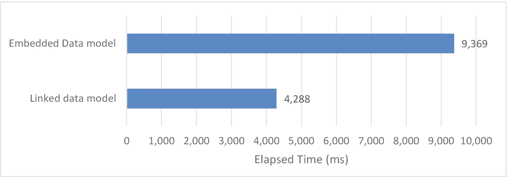
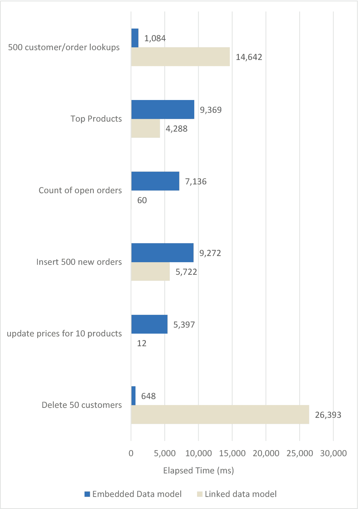
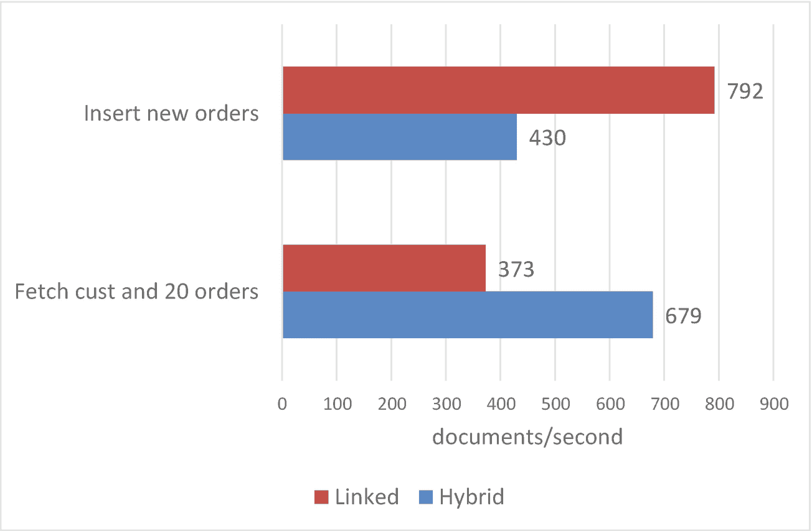

# 4.模式建模

在数据库中，*模式*定义了数据的内部结构或组织。在 MySQL 或 Postgres 这样的关系数据库中，模式被实现为表和列。

MongoDB 经常被描述为无模式数据库，但这多少有些误导。默认情况下，MongoDB 不强制任何特定的文档结构，但是所有的 MongoDB 应用程序都将实现某种文档模型。因此，将 MongoDB 描述为支持*灵活的*模式更加准确。

在 MongoDB 中，模式是由集合(通常表示相似文档的集合)和这些集合中的文档结构实现的。

MongoDB 应用程序的性能限制很大程度上取决于应用程序实现的文档模型。应用程序检索或处理信息所需的工作量主要取决于信息在多个文档中的分布情况。此外，文档的大小将决定 MongoDB 可以在内存中缓存多少文档。这些以及许多其他的权衡将决定数据库需要做多少物理工作来满足一个数据库请求。

尽管 MongoDB 没有昂贵且耗时的 SQL `ALTER TABLE`语句，但是一旦文档模型被建立并部署到生产环境中，对其进行根本性的修改仍然非常困难。因此，在设计应用程序时，选择正确的数据模型是一项至关重要的早期任务。

你可以写一本关于数据建模的书，事实上有些人已经写了。在这一章中，我们将试着从性能的角度介绍数据建模的核心租户。

## 指导原则

具有讽刺意味的是，使用 MongoDB 灵活模式进行模式建模实际上比在关系数据库的固定模式中更难。

在关系数据库建模中，您对数据进行逻辑建模，消除冗余，直到达到第三范式。简而言之，当一行中的每个元素都依赖于键、整个键并且除了键之外什么都不依赖时，就实现了第三范式。 <sup>[1](#Fn1)</sup> 然后通过*反规格化*引入冗余来支持性能目标。最终的数据模型通常大致保持第三范式，但稍加修改以支持关键查询。

您可以将 MongoDB 文档建模为第三范式，但这几乎总是错误的解决方案。MongoDB 的设计理念是，您应该在一个文档中包含几乎所有的相关信息——而不是像在关系模型中那样将它分散到多个实体中。因此，不是基于数据结构创建模型，而是基于查询和更新的结构创建模型。

以下是 MongoDB 数据建模的主要目标:

*   避免连接:MongoDB 使用聚合框架支持简单的连接功能(参见第 7 章[第 7 章](07.html))。然而，与关系数据库相比，联接应该是一个例外，而不是常规。基于聚合的连接很笨拙，更常见的是在应用程序代码中连接数据。一般来说，我们试图确保我们的关键查询可以在一个集合中找到它们需要的所有数据。

*   **管理冗余**:通过将相关数据封装到一个文档中，我们制造了一个冗余问题——我们可能在数据库中有不止一个地方可以找到某个数据元素。例如，考虑一个`products`集合和一个`orders`集合。`orders`集合可能会在订单细节中包含产品名称。如果我们需要更改产品名称，我们必须在多个地方进行更改。这将使得更新操作可能非常耗时。

*   **小心 16MB 的限制** : MongoDB 对单个文档的大小有 16MB 的限制。我们需要确保永远不要试图嵌入太多的信息，否则会有超出限制的风险。

*   **保持一致性** : MongoDB 确实支持事务(参见第 [9 章](09.html))，但是它们需要特殊的编程，并且有很大的约束。如果我们希望自动更新信息集，将这些数据元素包含在单个文档中可能是有利的。

*   **监控内存**:我们希望确保对 MongoDB 文档的大多数操作都发生在内存中。然而，如果我们通过嵌入大量信息使我们的文档变得非常大，那么我们就减少了可以放入内存的文档数量，并可能增加 IO。因此，我们希望尽可能保持文档较小。

## 链接与嵌入

有各种各样的 MongoDB 模式设计模式，但是它们都涉及这两种方法的变体:

*   *将所有内容嵌入到一个文档中。*

*   *使用指向其他集合中数据的指针链接*集合。这大致相当于使用关系数据库的第三范式模型。

### 案例研究

链接和嵌入方法之间有很大的折衷空间，并且有许多与性能无关的原因来选择一个而不是另一个(例如，原子更新和 16M 文档限制)。然而，让我们从性能的角度来看一下这两个极端是如何比较的——至少对于特定的工作负载来说是这样。

在这个案例研究中，我们将对经典的“订单”模式进行建模。订单模式包括订单、创建订单的客户的详细信息以及组成订单的产品。在关系数据库中，我们会把这个模式绘制成图 [4-1](#Fig1) 。


图 4-1

关系形式的订单-产品模式

如果我们只使用链接范例来建模这个模式，我们将为四个逻辑实体中的每一个创建一个集合。它们可能看起来像这样:

```js
mongo>db.customers.findOne();
{
      "_id" : 3,
      "first_name" : "Danyette",
      "last_name" : "Flahy",
      "email" : "dflahy2@networksolutions.com",
      "Street" : "70845 Sullivan Center",
      "City" : "Torrance",
      "DOB" : ISODate("1967-09-28T04:42:22Z")
}
mongo>db.orders.findOne();
{
      "_id" : 1,
      "orderDate" : ISODate("2017-03-09T16:30:16.415Z"),
      "orderStatus" : 0,
      "customerId" : 3
}
mongo>db.lineitems.findOne();
{
      "_id" : ObjectId("5a7935f97e9e82f6c6e77c2b"),
      "orderId" : 1,
      "prodId" : 158,
      "itemCount" : 48
}
mongo>db.products.findOne();
{
      "_id" : 1,
      "productName" : "Cup - 8oz Coffee Perforated",
      "price" : 56.92,
      "priceDate" : ISODate("2017-07-03T06:42:37Z"),
      "color" : "Turquoise",
      "Image" : "http://dummyimage.com/122x225.jpg/cc0000/ffffff"
}

```

在嵌入式设计中，我们会将与订单相关的所有信息放在一个文档中，如下所示:

```js
{
  "_id": 1,
  "first_name": "Rolando",
  "last_name": "Riggert",
  "email": "rriggert0@geocities.com",
  "gender": "Male",
  "Street": "6959 Melvin Way",
  "City": "Boston",
  "State": "MA",
  "ZIP": "02119",
  "SSN": "134-53-2882",
  "Phone": "978-952-5321",
  "Company": "Wikibox",
  "DOB": ISODate("1998-04-15T01:03:48Z"),
  "orders": [
    {
      "orderId": 492,
      "orderDate": ISODate("2017-08-20T11:51:04.934Z"),
      "orderStatus": 6,
      "lineItems": [
        {
          "prodId": 115,
          "productName": "Juice - Orange",
          "price": 4.93,
          "itemCount": 172,
          "test": true

        },

```

每个客户都有自己的文档，在该文档中有一组订单。每个订单内部都有一组订单中包含的产品(行项目)以及该行项目中包含的产品的所有信息。

在我们的示例模式中，有 1000 个客户、1000 个产品、51，116 个订单和 891，551 个行项目。定义了以下索引:

```js
OrderExample.embeddedOrders {"_id":1}
OrderExample.embeddedOrders {"email":1}
OrderExample.embeddedOrders {"orders.orderStatus":1}

OrderExample.customers {"_id":1}
OrderExample.customers {"email":1}

OrderExample.orders {"_id":1}
OrderExample.orders {"customerId":1}
OrderExample.orders {"orderStatus":1}

OrderExample.lineitems {"_id":1}
OrderExample.lineitems {"orderId":1}
OrderExample.lineitems {"prodId":1}

```

让我们来看看我们可能对这些模式执行的一些典型操作，并比较两种极端情况下的性能。

### 获取客户的所有数据

当所有信息都嵌入在一个文档中时，获取客户的所有数据是一项简单的任务。我们可以通过如下查询从嵌入式版本中获取所有数据:

```js
db.embeddedOrders.find({ email: 'bbroomedr@amazon.de' })

```

有了电子邮件上的索引，这个查询不到一毫秒就能完成。

四集版本的生活要艰难得多。我们需要使用聚合或自定义代码来实现相同的结果，并且我们需要确保在`$lookup`连接条件上有索引(参见第 [7 章](07.html))。以下是汇总数据:

```js
db.customers.aggregate(
    [
      {
        $match: { email: 'bbroomedr@amazon.de' }
      },
      {
        $lookup: {
          from: 'orders',
          localField: '_id',
          foreignField: 'customerId',
          as: 'orders'
        }
      },
      {
        $lookup: {
          from: 'lineitems',
          localField: 'orders._id',
          foreignField: 'orderId',
          as: 'lineitems'
        }
      },
      {
        $lookup: {
          from: 'products',
          localField: 'lineitems.prodId',
          foreignField: '_id',
          as: 'products'
        }
      }
    ]
  )

```

毫不奇怪，聚合/连接比嵌入式解决方案花费的时间要长。图 [4-2](#Fig2) 展示了相对性能——嵌入式模型每秒能够提供十倍以上的读取。


图 4-2

执行 500 次客户查找所花费的时间，包括所有订单详细信息

### 获取所有未结订单

在典型的订单处理场景中，我们希望检索所有处于未完成状态的订单。在我们的示例中，这些订单由`orderStatus=0`标识。

在嵌入式案例中，我们可以获得这样的未结订单客户:

```js
db.embeddedOrders.find({"orders.orderStatus":0})

```

这确实为我们提供了至少有一个未结订单的所有客户，但是如果我们只想检索未结订单，我们将需要使用聚合框架:

```js
db.embeddedOrders.aggregate([
  { $match:{   "orders.orderStatus": 0 }},
  { $unwind:  "$orders" },
  { $match:{   "orders.orderStatus": 0 }},
  { $count: "count" }
] );

```

您可能想知道为什么我们的聚合中有重复的`$match`语句。第一个`$match`给我们带来未结订单的客户，而第二个`$match`给我们自己带来订单。我们不需要第一个就能得到正确的结果，但它确实能提高性能(见第 7 章)。

在链接数据模型中获得这些订单要容易得多:

```js
db.orders.find({orderStatus:0}).count()

```

毫不奇怪，越简单的链接查询性能越好。图 [4-3](#Fig3) 比较了两种解决方案的性能。


图 4-3

获得未结订单计数所花费的时间

### 顶级产品

大多数公司都想找出最畅销的产品。对于嵌入式模型，我们需要展开行项目并按产品名称进行聚合:

```js
db.embeddedOrders.aggregate([
  { $unwind:  "$orders" },
  { $unwind:  "$orders.lineItems" },
  { $project: { "lineitems": "$orders.lineItems"   }},
  { $group:{  _id:{ "prodId":"$lineitems.prodId" ,
              " productName":"$lineitems.productName" },
              " itemCount-sum":{$sum:"$lineitems.itemCount"}} },
  { $sort:{  "lineitems_itemCount-sum":-1 }},
  { $limit:  10 },
]);

```

在链接模型中，我们还需要使用 aggregate，通过行项目和产品之间的`$lookup`连接来获取产品名称:

```js
db.lineitems.aggregate([
  { $group:{ _id:{ "prodId":"$prodId"  },
             "itemCount-sum":{$sum:"$itemCount"} }
  },
  { $sort:{  "itemCount-sum":-1 }},
  { $limit:  10 },
  { $lookup:
     { from:         "products",
       localField:   "_id.prodId",
       foreignField: "_id",
       as:           "product"
     }
  },
  { $project: {
          "ProductName": "$product.productName"  ,
          "itemCount-sum": 1  ,
          "_id": 1
         }
  },
]);

```

尽管必须执行联接，但链接数据模型的性能最好。我们只需在获得前十名产品后加入，而在嵌入式设计中，我们必须扫描集合中的所有数据。图 [4-4](#Fig4) 比较了这两种方法。嵌入式数据模型花费的时间大约是链接数据模型的两倍。



图 4-4

检索前十个产品所用的时间

### 插入新订单

在这个工作负载示例中，我们查看了为现有客户插入新订单的情况。在嵌入式的情况下，这可以通过在客户文档中使用一个`$push`操作来完成:

```js
db.embeddedOrders.updateOne(
            { _id: o.order.customerId },
            { $push: { orders: orderData } }
      );

```

在链接数据模型中，我们必须插入到`line items`集合和`orders`集合中:

```js
var rc1 = db.orders.insertOne(orderData);
var rc2 = db.lineItems.insertMany(lineItemsArray);

```

您可能会认为单次更新会轻易胜过链接模型所需的多次插入。但实际上，更新是一项非常昂贵的操作——尤其是当集合中没有足够的空闲空间来容纳新数据的时候。链接插入虽然数量更多，但操作更简单，因为它们不需要找到匹配的文档来更新。因此，在本例中，链接模型的性能优于嵌入模型。图 [4-5](#Fig5) 比较了 500 个订单插入的性能。


图 4-5

是时候插入 500 个订单了

### 更新产品

如果我们想更新一个产品的名称呢？在嵌入的情况下，产品名称被嵌入到行项目本身中。我们使用`arrayFilters`操作符在 MongoDB 的一个操作中更新所有产品的名称。这里，我们更新产品 193 的名称:

```js
db.embeddedOrders.update(
      { 'orders.lineItems.prodId':193 },
      { $set: { 'orders.$[].lineItems.$[i].productName':
              'Potatoes - now with extra sugar' } },
      { arrayFilters: [{ 'i.prodId': { $eq: 193 } }], multi: true });

```

当然，在链接模型中，我们可以对产品集合进行非常简单的更新:

```js
db.products.update(
      { _id: 193 },
      { $set: { productName:  'Potatoes - now with extra sugar' } }
);

```

嵌入式模型比链接模型需要我们接触更多的文档。因此，在嵌入式数据模型中，10 次产品代码价格更新需要几百倍的时间。图 [4-6](#Fig6) 说明了性能。


图 4-6

是时候更新十个产品名称了

### 删除客户

如果我们想要删除四个集合模型中单个客户的所有数据，我们需要遍历`line items`、`orders`和`customers`集合。代码看起来会像这样:

```js
db.orders.find({customerId:customerId},{_id:1}).forEach((order)=>{
      db.lineitems.deleteMany({orderId:order._id});
});
db.orders.deleteMany({customerId:1});
db.customers.deleteOne({_id:1});

```

当然，在嵌入式情况下，事情要简单得多:

```js
db.embeddedOrders.deleteOne({_id:1});

```

链接的示例表现很差——图 [4-7](#Fig7) 比较了删除 50 个客户的性能。


图 4-7

是时候删除 50 个客户了

### 案例研究总结

我们已经看了很多场景，如果你有点头晕，我们不会责怪你。因此，让我们将所有性能数据汇总到一个图表中。图 [4-8](#Fig8) 综合了我们六个例子的结果。



图 4-8

链接模型与嵌入模型的性能比较

正如您所看到的，虽然嵌入式模型在获取单个客户或删除客户的所有数据方面非常出色，但在其他情况下，它并不比链接模型优越。

Tip

“对我的应用程序来说，什么是最好的数据模型”这个问题的答案是——也一直是——视情况而定。

当读取实体的所有相关数据时，嵌入式模型提供了许多优势，但是对于更新和聚合查询来说，它通常不是最快的模型。哪种模型最适合您将取决于应用程序性能的哪些方面是最关键的。但是请记住，一旦部署了应用程序，就很难更改数据模型，因此在应用程序设计过程的早期获得数据模型所花费的时间可能会有所回报。

此外，请记住，很少有应用程序使用“全有或全无”的方法。当我们混合使用链接和嵌入方法来最大化应用程序的关键操作时，通常可以获得最好的结果。

## 高级模式

在前一节中，我们研究了 MongoDB 数据建模的两个极端:嵌入一切与链接一切。在现实生活中，您可能会结合使用这两种技术，以便在每种方法的利弊之间取得最佳平衡。让我们看看一些结合了这两种方法的建模模式。

### 系统增强

正如我们在上一节中看到的，当检索一个实体的所有数据时，嵌入式模型具有显著的性能优势。然而，我们需要注意两大风险:


图 4-9

混合“桶”数据模型

*   在典型的主-细节模型中——例如客户及其订单——细节文档的数量没有特定的限制。但是在 MongoDB 中，文档的大小不能超过 16MB。因此，如果有大量的详细文档，嵌入式模型可能会崩溃。例如，我们最大的客户可能会订购如此多的产品，以至于我们无法将所有订单放在一个 16MB 的文档中。

*   即使我们确定不会超过 16MB，对 MongoDB 内存的影响也可能是不可取的。随着平均文档大小的增加，可以放入内存的文档数量会减少。大量大型文档(可能充满“旧”数据)可能会降低缓存和性能。我们将在第 [11](11.html) 章中详细讨论这一点。

    解决这一冲突最常见的方法之一是*混合*策略，有时也称为*子集化*。

    在子集模式中，我们在主文档中嵌入有限数量的细节文档，并将剩余的细节存储在另一个集合中。例如，我们可能只在`customers`集合中保存每个客户最近的 20 个订单，其余的保存在`orders`集合中。

    图 [4-9](#Fig9) 说明了这个概念。每个客户都嵌入了最近的 20 个订单，所有订单都在`orders`集合中。

如果我们设想我们的应用程序在客户查找页面上显示每个客户的最新订单，那么我们可以看到这种模型的好处。我们不仅避免了触及 16M 文档大小的限制，而且现在可以从单个文档填充这个客户查找页面。

然而，解决方案是有代价的。特别是，我们现在每次添加或修改订单时，都必须打乱嵌入式订单数组中的订单。每次更新都需要对嵌入的订单执行额外的操作。以下代码实现了混合设计中`customers`数据的混洗:

```js
  let orders=db.hybridCustomers.
               findOne({'_id':customerId}).orders;

  orders.unshift(newOrder); // add new order
  if (orders.length>20)
    orders.pop();           // Remove the order

  db.hybridCustomers.update({'_id':customerId},
          {$set:{orders:orders}});

```

由此产生的开销可能会很大。图 [4-10](#Fig10) 显示了获取客户和最新订单以及用新订单更新客户时混合模式的影响。读取性能显著提高，但更新率几乎减半。



图 4-10

混合模式可以提高读取性能，但会降低更新速度

### 垂直分割

将与实体相关的所有内容放在一个文档中通常是有意义的。正如我们之前看到的，我们可以在 JSON 数组中嵌入与一个实体相关的多个细节，从而避免在 SQL 数据库中执行连接操作。

然而，有时我们可以从将一个实体的细节分割到多个集合中得到好处，这样我们可以减少每次操作中获取的数据量。这种方法类似于混合数据模型，因为它减小了核心文档的大小，但是它应用于顶级属性，而不仅仅是细节数组。

例如，假设我们在每个客户记录中包含一张客户的高分辨率照片。这些不常访问的图像增加了集合的整体大小，降低了执行集合扫描所需的时间(参见第 [6](06.html) 章)。它们还减少了可以保存在内存中的文档数量，这可能会增加所需的 IO 数量(参见第 [11 章](11.html))。

在这种情况下，如果将二进制照片存储在单独的集合中，我们可以获得性能优势。图 [4-11](#Fig11) 示出了该布置。


图 4-11

垂直分割

### 属性模式

如果我们的文档包含大量相同数据类型的属性，并且我们知道我们将使用其中的许多属性来执行查找，那么我们可以通过使用属性模式来减少所需的索引数量。

考虑以下天气数据:

```js
{
        "timeStamp" : ISODate("2020-05-30T07:21:08.804Z"),
        "Akron" : 35,
        "Albany" : 22,
        "Albuquerque" : 22,
        "Allentown" : 31,
        "Alpharetta" : 24,
        <data for another 300 cities>
}

```

如果我们知道我们将支持搜索某个城市的特定值的查询(例如，在阿克伦找到超过 100 度的所有测量值)，那么我们就有问题了。我们不可能创建足够的索引来支持所有的查询。更好的组织是为每个城市定义`name:value`对。

下面是前面的数据在属性模式中的样子:

```js
{
        "timeStamp" : ISODate("2020-05-30T07:21:08.804Z"),
        "measurements" : [
                {
                        "city" : "Akron",
                        "temperature" : 35
                },
                {
                        "city" : "Albany",
                        "temperature" : 22
                },
                {
                        "city" : "Albuquerque",
                        "temperature" : 22
                },
                {
                        "city" : "Allentown",
                        "temperature" : 31
                },
                 <data for another 300 cities>

}

```

我们现在可以选择在`measurements.city`上定义一个索引，而不是尝试创建第一个设计中需要的数百个索引的不可能任务。

在某些情况下，您可以使用通配符索引而不是属性模式——参见第 [5](05.html) 章。然而，属性模式提供了一种灵活的方式来提供对任意数据项的快速访问。

## 摘要

尽管 MongoDB 支持非常灵活的模式建模，但是您的数据模型设计对于应用程序性能仍然是绝对关键的。数据模型决定了 MongoDB 为满足数据库请求而需要执行的逻辑工作量，并且一旦部署到生产环境中就很难更改。

MongoDB 建模中的两个“元模式”是*嵌入*和*链接*。嵌入包括在单个文档中包含关于逻辑实体的所有信息。链接包括将相关数据存储在单独的集合中，这种方式让人想起关系数据库。

嵌入通过避免连接提高了读取性能，但也带来了数据一致性、更新性能和 16MB 文档限制等挑战。大多数应用程序明智地混合了嵌入和链接，以实现“两全其美”的解决方案。

<aside aria-label="Footnotes" class="FootnoteSection" epub:type="footnotes">Footnotes [1](#Fn1_source)

为了纪念关系模型的创建者 Edgar Codd，我们经常说“关键，整个关键，只有关键，所以请帮助我 Codd！”

 </aside>