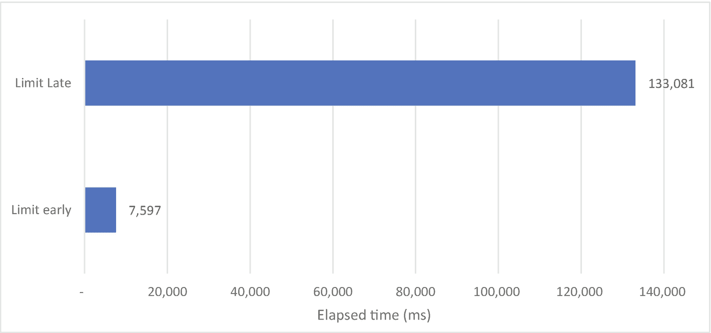
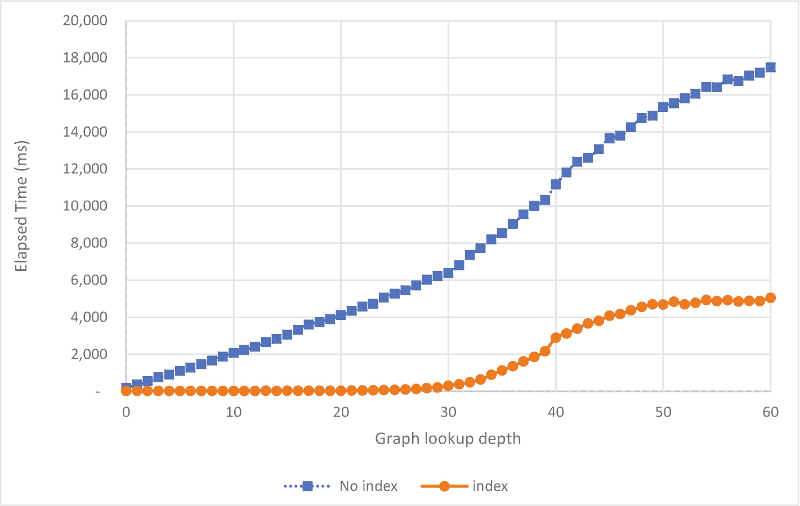
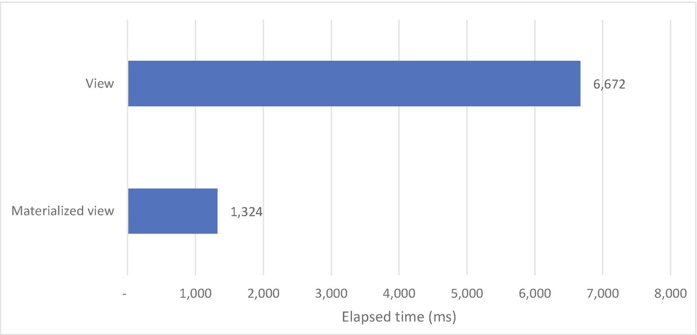

# 7.优化聚合管道

当开始使用 MongoDB 时，大多数开发者将从他们熟悉的来自其他数据库的基本 CRUD 操作(创建-读取-更新-删除)开始。`insert`、`find`、`update`和`delete`操作确实将构成大多数应用的主干。然而，在几乎所有的应用中，复杂的数据检索和操作需求将会存在，这超出了基本 MongoDB 命令的能力范围。

MongoDB `find()`命令功能多样且易于使用，但是聚合框架允许您将其提升到下一个级别。聚合管道可以做任何`find()`操作可以做的事情，甚至更多。正如 MongoDB 自己喜欢在博客、营销材料甚至 t 恤上说的那样:*聚合是新发现*。

聚合管道通过减少可能需要多次查找操作和复杂数据操作的逻辑来简化应用代码。如果利用得当，单个聚合可以取代许多查询及其相关的网络往返时间。

您可能还记得前面的章节，调优应用的一个重要部分是确保尽可能多的工作发生在数据库上。聚合允许您将通常位于应用中的数据转换逻辑移动到数据库中。因此，经过适当调整的聚合管道可以大大超越替代解决方案。

然而，尽管使用聚合带来了诸多好处，但它也带来了一系列新的调优挑战。在本章中，我们将确保您掌握利用和调整聚合管道所需的所有知识。

## 优化聚合管道

为了有效地优化聚合管道，我们必须首先能够有效地确定哪些聚合需要优化，以及哪些方面可以改进。与`find()`查询一样，`explain()`命令是我们最好的朋友。您可能还记得前面的章节，为了检查查询的执行计划，我们在集合名称后添加了`.explain()`方法。例如，为了解释一个`find()`，我们可以使用下面的命令:

```js
db.customers.
  explain().
  find(
    { Country: 'Japan', LastName: 'Smith' },
    { _id: 0, FirstName: 1, LastName: 1 }
  ).
  sort({ FirstName: -1 }).
  limit(3);

```

我们可以用同样的方式来解释聚合管道:

```js
db.customers.explain().aggregate([
  { $match: {
      Country: 'Japan',
      LastName: 'Smith',
    } },
  {  $project: {
      _id: 0,
      FirstName: 1,
      LastName: 1,
    } },
  { $sort: {
      FirstName: -1,
    } },
  { $limit: 3 } ] );

```

然而，来自`find()`命令的执行计划和来自`aggregate()`命令的执行计划有很大的不同。

当针对标准的 find 命令运行`explain()`时，我们可以通过查看`queryPlanner.winningPlan`对象来查看关于执行的信息。

聚合管道的`explain()`输出是相似的，但也有很大的不同。首先，我们以前使用的`queryPlanner`对象现在驻留在一个新对象中，这个新对象驻留在一个名为`stages`的数组中。`stages`数组包含作为单独对象的每个聚合阶段。例如，我们前面看到的聚合将具有以下简化的解释输出:

```js
{
  "stages": [
    {"$cursor": {
        "queryPlanner": {
          // . . .
          "winningPlan": {
            "stage": "PROJECTION_SIMPLE",
            //      . . .
            "inputStage": {
              "stage": "FETCH",
              //    . . .
              "inputStage": {
                "stage": "IXSCAN",
                . . .
              } } },
          "rejectedPlans": []
        } } },
    { "$sort": {
        "sortKey": {
          "FirstName": -1
        },
        "limit": 3
      } } ],
 . . .
}

```

在聚合管道的执行计划中，`queryPlanner`阶段揭示了将数据引入管道所需的初始数据访问操作。这通常代表支持初始`$match`操作的操作，或者——如果没有指定`$match`条件——从集合中检索所有数据的集合扫描。

`stages`数组显示了聚合管道中每个后续步骤的信息。请注意，MongoDB 可以在执行期间合并和重新排序聚合阶段，因此这些阶段可能与原始管道定义中的阶段不匹配——下一节将详细介绍。

我们已经编写了一个助手脚本来简化优化脚本包中聚合执行计划的解释。 <sup>[1](#Fn1)</sup> 方法`mongoTuning.aggregationExecutionStats()`将提供每一步所用时间的顶级汇总。这里有一个使用`aggregationExecutionSteps`的例子:

```js
mongo> var exp = db.customers.explain('executionStats').aggregate([
...   { $match:{
...         "Country":{ $eq:"Japan" }}
...   },
...   { $group:{ _id:{ "City":"$City"  },
...              "count":{$sum:1} }
...   },
...   { $sort:{  "_id.City":-1 }},
...   { $limit:  10 },
... ] );

mongo>  mongoTuning.aggregationExecutionStats(exp);

1  IXSCAN ( Country_1_LastName_1 ms:0 keys:21368 nReturned:21368)
2  FETCH ( ms:13 docsExamined:21368 nReturned:21368)
3  PROJECTION_SIMPLE ( ms:15 nReturned:21368)
4  $GROUP ( ms:70 returned:31)
5  $SORT ( ms:70 returned:10)

Totals:  ms: 72  keys: 21368  Docs: 21368

```

### 优化聚合排序

聚合是由一系列阶段构成的，由一组文档表示，这些文档按照从第一个到最后一个的顺序执行。每个阶段的输出被传递到下一个阶段进行处理，初始输入是整个集合。

这些阶段的顺序性质是聚合被称为管道的原因:数据通过管道流动，在每个阶段被过滤和转换，直到最终退出管道。优化这些管道最简单的方法是尽早减少数据量；这将减少每个后续步骤所做的工作量。从逻辑上讲，聚合中执行最多工作的阶段应该对尽可能少的数据进行操作，并在早期阶段执行尽可能多的筛选。

Tip

构建聚合管道时，早过滤，勤过滤！越早从管道中移除数据，MongoDB 的总体数据处理负载就越低。

MongoDB 将自动对管道中的操作顺序进行重新排序，以优化性能——我们将在下一节看到一些优化的示例。但是，对于复杂的管道，您可能需要自己设置顺序。

自动重新排序不可能的一种情况是使用`$lookup`进行聚合。`$lookup`阶段允许您加入两个系列。如果您要连接两个集合，您可以选择在连接之前或之后进行过滤，在这种情况下，在连接操作之前尝试减少数据*的大小是非常重要的，因为对于传递给查找操作的每个文档，MongoDB 必须尝试在单独的集合中找到匹配的文档。我们可以在 lookout 之前过滤掉的每个文档都将减少需要进行的查找次数。这是一个明显但关键的优化。*

让我们看一个生成“前 5 名”产品购买列表的聚合示例:

```js
db.lineitems.aggregate([
  { $group:{ _id:{ "orderId":"$orderId" ,"prodId":"$prodId"  },
             "itemCount-sum":{$sum:"$itemCount"} } },
  { $lookup:
     { from:         "orders",  localField:"_id.orderId",
       foreignField: "_id",             as:"orders"
     }  },
  { $lookup:
     { from:         "customers", localField:"orders.customerId",
       foreignField: "_id",               as:"customers"
     }  },
  { $lookup:
     { from:         "products",  localField:"_id.prodId",
       foreignField: "_id",               as:"products"
     }  },
  { $sort:{  "count":-1 }},
  { $limit:  5 },
],{allowDiskUse: true});

```

这是一个相当大的聚合管道。实际上，如果没有`allowDiskUse:true`标志，就会产生内存不足错误；我们将在本章的后面解释为什么会出现这个错误。

注意，我们在之前加入了`orders`、`customers,`和`products`、T6，对结果进行排序并限制输出。因此，我们必须为每个行项目执行所有三个连接查找。我们可以——也应该——在`$group`操作之后直接定位`$sort`和`$limit`:

```js
db.lineitems.aggregate([
  { $group:{ _id:{ "orderId":"$orderId" ,"prodId":"$prodId"  },
             "itemCount-sum":{$sum:"$itemCount"} } },
  { $sort:{  "count":-1 }},
  { $limit:  5 },
  { $lookup:
     { from:         "orders",  localField:"_id.orderId",
       foreignField: "_id",             as:"orders"
     }  },
  { $lookup:
     { from:         "customers", localField:"orders.customerId",
       foreignField: "_id",               as:"customers"
     }  },
  { $lookup:
     { from:         "products",  localField:"_id.prodId",
       foreignField: "_id",               as:"products"
     }  }
],{allowDiskUse: true});

```

性能上的差异是惊人的。通过将`$sort`和`$limit`提前几行，我们已经创建了一个更加高效和可伸缩的解决方案。图 [7-1](#Fig1) 展示了通过在管道中提前移动`$limit`获得的性能提升。



图 7-1

在`$lookup`管道中提前移动限制子句的效果

Tip

注意对聚合管道进行排序，以尽早而不是推迟删除文档。越早从管道中消除数据，后面管道中需要的工作就越少。

### 自动流水线优化

MongoDB 将对聚合管道进行一些优化，以提高性能。具体的优化因版本而异，当通过驱动程序或 MongoDB shell 运行聚合时，没有明显的迹象表明优化已经发生。事实上，唯一确定的方法是使用`explain()`检查查询计划。如果您惊讶地发现您的聚合解释与您刚刚发送到 MongoDB 的内容不匹配，不要惊慌。这是优化器的工作。

让我们运行一些聚合，观察 MongoDB 如何决定使用`explain()`来改进管道。这是一个非常糟糕的聚合管道:

```js
> var explain = db.listingsAndReviews.explain("executionStats").
   aggregate([
    {$match: {"property_type" : "House"}},
    {$match: {"bedrooms" : 3}},
    {$limit: 100},
    {$limit: 5},
    {$skip: 3},
    {$skip: 2}
]);

```

你大概能猜到这里会发生什么。多个`$match`、`$limit`和`$skip`阶段，当一个接一个地放置时，可以合并成单个阶段而不改变结果。使用`$and`可以合并两个`$match`阶段。两个`$limit`阶段的结果总是较小的极限值，两个`$skips`的效果是`$skip`值之和。尽管来自管道的结果没有改变，但是我们可以观察到查询计划中的优化效果。下面是从我们的`mongoTuning.aggregationExecutionStats`命令输出的合并阶段的简化视图:

```js
1  COLLSCAN ( ms:0 docsExamined:525 nReturned:5)
2  LIMIT ( ms:0 nReturned:5)
3  $SKIP ( ms:0 returned:0)

Totals:  ms: 1  keys: 0  Docs: 525

```

如您所见，MongoDB 将我们管道中的六个步骤合并成了三个操作。

MongoDB 还可以代表您执行其他一些智能合并。如果您有一个`$lookup`阶段，在那里您立即`$unwind`连接的文档，MongoDB 会将`$unwind`合并到`$lookup`中。例如，此聚合将用户与其博客评论结合在一起:

```js
> var explain = db.users.explain("executionStats").aggregate([
 { $lookup: {
     from: "comments",
     as: "comments",
     localField: "email",
     foreignField: "email"
 }},
 { $unwind: "$comments"}
]);

```

`$lookup`和`$unwind`将成为执行中的单个阶段，这将消除创建大型连接文档，这些文档将立即展开为较小的文档。执行计划将类似于下面的代码片段:

```js
> mongoTuning.aggregationExecutionStats(explain);

1  COLLSCAN ( ms:9 docsExamined:183 nReturned:183)
2  $LOOKUP ( ms:4470 returned:50146)

Totals:  ms: 4479  keys: 0  Docs: 183

```

类似地，`$sort`和`$limit`阶段将被合并，允许`$sort`只维护有限数量的文档，而不是它的全部输入。下面是这种优化的一个例子。该查询

```js
> var explain = db.users.explain("executionStats").
 aggregate([
  { $sort: {year: -1}},
  { $limit: 1}
 ]);
> mongoTuning.aggregationExecutionStats(explain);

```

将在解释输出中产生一个阶段:

```js
1  COLLSCAN ( ms:0 docsExamined:183 nReturned:183)
2  SORT ( ms:0 nReturned:1)

Totals:  ms: 0  keys: 0  Docs: 183

```

还有另一个重要的优化，它不涉及合并或移动管道中的阶段。如果您的聚合只需要文档属性的子集，MongoDB 可能会添加一个投影来删除所有未使用的字段。这减少了通过管道的数据集的大小。例如，以下聚合实际上只使用了两个字段-国家和城市:

```js
mongo> var exp = db.customers.
...   explain('executionStats').
...   aggregate([
...     { $match: { Country: 'Japan' } },
...     { $group: { _id: { City: '$City' } } }
...   ]);

```

MongoDB 在执行计划中插入一个投影，以消除所有不需要的属性:

```js
mongo> mongoTuning.aggregationExecutionStats(exp);

1  IXSCAN ( Country_1_LastName_1 ms:4 keys:21368 nReturned:21368)
2  FETCH ( ms:12 docsExamined:21368 nReturned:21368)
3  PROJECTION_SIMPLE ( ms:12 nReturned:21368)
4  $GROUP ( ms:61 returned:31)

Totals:  ms: 68  keys: 21368  Docs: 21368

```

因此，我们现在知道 MongoDB 将有效地添加和合并阶段，以改善您的管道。在某些情况下，优化器会对您的阶段重新排序。其中最重要的是`$match`操作的重新排序。

如果一个管道在一个将把新字段投射到文档中的阶段(例如`$group`、`$project`、`$unset`、`$addFields`或`$set`)之后包含一个`$match`，并且如果`$match`阶段不需要投射的字段，MongoDB 将把那个`$match`阶段移到管道的前面。这减少了后期必须处理的文档数量。

例如，考虑以下聚合:

```js
var exp=db.customers.explain("executionStats").aggregate([
  { '$group': {
      '_id': '$Country',
      'numCustomers': {
        '$sum': 1
      } } },
  { '$match': {
      '$or': [
        { '_id': 'Netherlands' },
        { '_id': 'Sudan' },
        { '_id': 'Argentina' } ] } }
]);

```

在 MongoDB 4.0 之前，MongoDB 将执行管道中指定的确切步骤——执行一个`$group`操作，然后使用`$match`来排除指定国家以外的国家。这是一种浪费，特别是因为我们有一个国家索引，可以用来快速找到所需的文件。

然而，在 MongoDB 的现代版本中，`$match`操作将被重新定位在`$group`操作之前，减少了需要分组的文档数量，并允许使用索引。以下是生成的执行计划:

```js
mongo> mongoTuning.aggregationExecutionStats(exp);

1  IXSCAN ( Country_1_LastName_1 ms:1 keys:13720 nReturned:13717)
2  PROJECTION_COVERED ( ms:1 nReturned:13717)
3  SUBPLAN ( ms:1 nReturned:13717)
4  $GROUP ( ms:20 returned:3)

```

MongoDB 自动优化是最近 MongoDB 版本中的无名英雄之一，它提高了性能，而不需要您做任何工作。了解这些优化是如何工作的，将使您能够在创建聚合时做出正确的决策，并了解执行计划中的异常情况

有关任何给定 MongoDB 版本的优化中会发生什么的更多信息，请参考位于 [`http://bit.ly/MongoAggregatePerf`](http://bit.ly/MongoAggregatePerf) 的官方文档。

## 优化多集合联接

聚合框架提供的真正重要的功能之一是合并来自多个集合的数据的能力。最重要和最成熟的功能是在`$lookup`操作符中，它允许两个集合之间的连接。

在第 4 章中，我们试验了一些可选的模式设计，其中一些经常需要连接来组装信息。例如，我们创建了一个模式，其中客户和订单保存在不同的集合中。在这种情况下，我们将使用`$lookup`来连接客户数据和订单数据，如下所示:

```js
db.customers.aggregate([
  { $lookup:
     { from:         "orders",
       localField:   "_id",
       foreignField: "customerId",
       as:           "orders"
     }
  },
]);

```

该语句在每个客户文档中嵌入了一组订单。客户文档中的`_id`属性与`orders`集合中的`customerId`属性相匹配。

使用`$lookup`构造一个连接并不太困难，但是有一些关于连接性能的潜在问题。因为对源数据中的每个文档执行一次`$lookup`函数，所以`$lookup`必须快速。实际上，这意味着`$lookup`应该由一个索引来支持。在前面的例子中，我们需要确保在`orders`集合中的`customerId`属性上有一个索引。

不幸的是，`explain()`命令不能帮助我们确定连接是否有效或者是否使用了索引。例如，下面是前面操作的解释输出(使用`mongoTuning.aggregationExecutionStats`):

```js
1  COLLSCAN ( ms:10 docsExamined:411121 nReturned:411121)
2  $LOOKUP ( ms:5475 returned:411121)

```

explain 输出告诉我们，我们使用了集合扫描来执行客户的初始检索，但是没有显示我们是否在`$lookup`阶段使用了索引。

但是，如果您没有一个支持索引，您几乎肯定会注意到由此导致的性能下降。图 [7-2](#Fig2) 显示了当越来越多的文档参与到一个连接中时，性能是如何下降的。有了索引，连接性能就变得高效且可预测。如果没有索引，随着更多的文档添加到连接中，连接性能会急剧下降。


图 7-2

`$lookup`绩效-指数化与非指数化

Tip

总是在一个`$lookup`中的`foreignField`属性上创建一个索引，除非集合很小。

### 加入订单

当加入集合时，我们有时可以选择加入的顺序。例如，该查询将来自客户*的*连接到*订单:*

```js
db.customers.aggregate([
  { $lookup:
     { from:         "orders",
       localField:   "_id",
       foreignField: "customerId",
       as:           "orders"
     }
  },
  { $unwind:  "$orders" },
  { $count: "count" },
]);

```

以下查询返回相同的数据，但是将来自订单*的*连接到*客户:*

```js
db.orders.aggregate([
  { $lookup:
     { from:         "customers",
       localField:   "customerId",
       foreignField: "_id",
       as:           "customer"
     }
  },
  { $count: "count" },
] );

```

这两个查询具有非常不同的性能特征。尽管每个查询中都有支持`$lookup`操作的索引，但是从订单到客户的连接会导致更多的`$lookup`调用——仅仅因为订单比客户多。因此，从订单到客户的连接比反过来需要更长的时间。图 [7-3](#Fig3) 显示了相对性能。


图 7-3

加入顺序和`$lookup`性能

决定连接顺序时，请遵循以下准则:

1.  在连接之前，您应该尽可能地减少要连接的数据量。因此，如果要过滤其中一个集合，该集合应该在连接顺序中排在第一位。

2.  如果您只有一个索引来支持两个连接顺序中的一个，那么您应该使用具有支持索引的连接顺序。

3.  如果两个连接顺序都满足前面的两个条件，那么您应该尝试从最小的集合连接到最大的集合。

    提示在其他条件相同的情况下，从小集合加入到大集合，而不是从大集合加入到小集合。

### 优化图形查找

Neo4J 等图形数据库专门遍历关系图——就像你可能在社交网络中找到的那些关系图。许多非图形数据库已经整合了图形计算引擎来执行类似的任务。使用旧版本的 MongoDB，您可能不得不通过网络获取大量的图形数据，并在应用级别上运行一些计算。这个过程将会是缓慢而繁琐的。幸运的是，从 MongoDB 3.4 开始，我们可以使用`$graphLookup`聚合框架阶段执行简单的图遍历。

假设您在 MongoDB 中存储了代表社交网络的数据。在这个网络中，单个用户作为朋友连接到大量其他用户。这类网络是图形数据库的常见用途。让我们用下面的样本数据来看一个例子:

```js
db.getSiblingDB("GraphTest").socialGraph.findOne();
{
      "_id" : ObjectId("5a739cda0c31c5f5afcff87f"),
      "person" : 561596,
      "name" : "User# 561596",
      "friends" : [
            94230,
            224410,
            387968,
            406744,
            707890,
            965522,
            1189677,
            1208173
      ]
}

```

使用带有`$graphLookup`阶段的聚合管道，我们可以为个人用户扩展我们的社交网络。下面是一个管道示例:

```js
db.socialGraph.aggregate([
  {$match:{person:1476767}},
  {$graphLookup: {
      from: "socialGraph",
      startWith: [1476767],
      connectFromField: "friends",
      connectToField: "person",
      maxDepth: 2,
      depthField: "Depth",
      as: "GraphOutput"
    }
  },{$unwind:"$GraphOutput"}
], {allowDiskUse: true});

```

我们在这里做的是从 person `1476767`开始，然后沿着 friends 数组的元素到两个层次，本质上是寻找“朋友的朋友”

增加`maxDepth`字段的值会成倍增加我们必须处理的数据量。你可以认为每一层深度都需要某种自我连接到集合中。对于初始数据集中的每个文档，我们读取集合来寻找朋友；然后，对于数据集中的每个文档，读取集合以找到那些朋友；等等。一旦达到`maxDepth`个连接，我们就停止。

很明显，如果每个自连接都需要一次集合扫描，那么随着网络深度的增加，性能将会迅速下降。因此，在遍历连接时，确保有一个索引可供 MongoDB 使用是很重要的。该索引应该在`connectToField`属性上。

图 [7-4](#Fig4) 显示了有和没有步进的`$graphLookup`操作的性能。如果没有索引，随着操作深度的增加，性能会迅速下降。有了索引，图形查找的可伸缩性和效率都大大提高了。



图 7-4

`$graphLookup`带或不带索引的性能

Tip

当执行`$graphLookup`操作时，确保在`connectToField`属性上有一个索引。

## 聚合内存利用率

在 MongoDB 中执行聚合时，有两个重要的限制需要记住，这两个限制适用于所有聚合，不管管道是从哪个阶段构建的。除此之外，在调优您的应用时，还需要考虑一些特定的限制。您必须牢记的两个限制是文档大小限制和内存使用限制。

在 MongoDB 中，单个文档的大小限制是 16MB。对于聚合也是如此。执行聚合时，如果任何输出文档超过此限制，将会引发错误。当执行简单的聚合时，这可能不是问题。但是，在对多个集合中的文档进行分组、操作、展开和连接时，您必须考虑输出文档不断增长的大小。这里一个重要的区别是，这个限制只适用于结果中的文档。例如，如果一个文档在管道中超过了这个限制，但是在结束之前又减少到这个限制以下，那么就不会抛出错误。此外，MongoDB 在内部结合了一些操作来避免限制。例如，如果一个`$lookup`返回一个大于限制的数组，但是`$lookup`后面紧跟着一个`$unwind`，那么就不会出现文档大小错误。

要记住的第二个限制是内存使用限制。在聚合管道的每个阶段，默认情况下都有 100MB 的内存限制。如果超过这个限制，MongoDB 将产生一个错误。

MongoDB 确实提供了一种在聚合期间绕过这个限制的方法。`allowDiskUse`选项可用于取消几乎所有阶段的限制。正如您可能已经猜到的，当设置为 true 时，这允许 MongoDB 在磁盘上创建一个临时文件来保存聚合时的一些数据，绕过内存限制。在前面的一些例子中，您可能已经注意到了这一点。以下是在我们之前的一个聚合中将此限制设置为 true 的示例:

```js
db.customers.aggregate([
  { '$group': {
      '_id': '$Country',
      'numCustomers': {
        '$sum': 1
      } } },
  { '$match': {
      '$or': [
        { '_id': 'Netherlands' },
        { '_id': 'Sudan' },
        { '_id': 'Argentina' } ] } }
],{allowDiskUse:true});

```

正如我们所说的，`allowDiskUse`选项将绕过*几乎*所有阶段的限制。不幸的是，即使`allowDiskUse`设置为真，仍然有几个阶段被限制在 100MB。两个累加器`$addToSet`和`$push`不会溢出到磁盘，因为如果不进行适当的优化，这些累加器会将大量数据添加到下一阶段。

对于这三个有限的阶段，目前没有明显的解决办法，这意味着您必须优化查询和管道本身，以确保您不会遇到这个限制并从 MongoDB 收到错误。

为了避免触及这些内存限制，您应该考虑实际需要获取多少数据。问问自己是否使用了查询返回的所有字段，数据是否可以更简洁地表示？从中间文档中删除不必要的属性是减少内存使用的一种简单而有效的方法。

如果所有这些都失败了，或者如果您想避免数据溢出到磁盘时的性能下降，您可以尝试增加这些操作的内部内存限制。这些内存限制由“`internal*Bytes`”形式的未记录参数控制。其中最重要的三个是

*   `internalQueryMaxBlockingSortMemoryUsageBytes`:a`$sort`可用的最大内存(详见下一节)

*   `internalLookupStageIntermediateDocumentMaxSizeBytes`:一个`$lookup`操作可用的最大内存

*   `internalDocumentSourceGroupMaxMemoryBytes`:一个`$group`操作可用的最大内存

您可以使用`setParameter`命令调整这些参数。例如，要增加排序内存，您可以发出以下命令:

```js
db.getSiblingDB("admin").
    runCommand({ setParameter: 1,
    internalQueryMaxBlockingSortMemoryUsageBytes: 1048576000 });

```

我们将在下一节的排序优化中进一步讨论这一点。但是，在调整内存限制时要非常小心，因为如果超过了服务器的内存容量，可能会损害 MongoDB 集群的整体性能。

## 聚合管道中的排序

我们在第 [6 章](06.html)中看到了在`find()`操作中优化排序。聚合管道中的排序在几个重要方面不同于排序:

1.  通过执行“磁盘排序”，聚合可以超过阻塞排序的内存限制在磁盘排序中，在排序操作过程中，多余的数据被写入磁盘或从磁盘中取出。

2.  聚合可能无法利用索引排序选项，除非排序在管道中处于非常早期的位置。

### 索引聚合排序

与`find()`类似，聚合能够使用索引来解析排序，从而避免高内存利用率或磁盘排序。然而，这通常只有在`$sort`足够早地出现在流水线中以滚动到初始数据访问操作时才会发生。

例如，考虑这个操作，其中我们对一些数据进行排序并添加一个字段:

```js
mongo> var exp=db.baseCollection.explain('executionStats').
...     aggregate([
...        { $sort:{  d:1 }},
...        {$addFields:{x:0}}
...     ],{allowDiskUse: true});
mongo> mongoTuning.aggregationExecutionStats(exp);

1  IXSCAN ( d_1 ms:97 keys:1000000 nReturned:1000000)
2  FETCH ( ms:500 docsExamined:1000000 nReturned:1000000)
3  $ADDFIELDS ( ms:3316 returned:1000000)

Totals:  ms: 3358  keys: 1000000  Docs: 1000000

```

排序后的属性有一个索引，我们可以使用这个索引来优化排序。但是，如果我们在排序之前移动`$addFields`操作，那么聚集就不能利用索引，并且会发生代价高昂的“磁盘排序”:

```js
mongo> var exp=db.baseCollection.explain('executionStats').
...     aggregate([
...        {$addFields:{x:0}},
...        { $sort:{  d:1 }},
... ],{allowDiskUse: true});

mongo> mongoTuning.aggregationExecutionStats(exp);

1  COLLSCAN ( ms:16 docsExamined:1000000 nReturned:1000000)
2  $ADDFIELDS ( ms:1164 returned:1000000)
3  $SORT ( ms:12125 returned:1000000)

Totals:  ms: 12498  keys: 0  Docs: 1000000

```

图 [7-5](#Fig5) 比较了两种聚合的性能。通过将排序移到聚合管道的开始，避免了成本高昂的磁盘排序，并显著减少了运行时间。


图 7-5

聚合管道中的磁盘排序与索引排序

Tip

在聚合管道中尽可能早地移动具有支持索引的排序，以避免昂贵的磁盘排序。

### 磁盘排序

如果没有支持排序的索引，并且排序超过了 100MB 的限制，那么您将收到一个`QueryExceededMemoryLimitNoDiskUseAllowed`错误:

```js
mongo>var exp=db.baseCollection.
...     aggregate([
...        { $sort:{  d:1 }},
...        {$addFields:{x:0}}
...     ],{allowDiskUse: false});

2020-08-22T15:36:01.890+1000 E  QUERY    [js] uncaught exception: Error: command failed: {
        "operationTime" : Timestamp(1598074560, 3),
        "ok" : 0,
        "errmsg" : "Error in $cursor stage :: caused by :: Sort exceeded memory limit of 104857600 bytes, but did not opt in to external sorting.",
        "code" : 292,
        "codeName" : "QueryExceededMemoryLimitNoDiskUseAllowed",

```

如果有可能使用索引来支持这种排序，如前一节所述，那么这通常是最好的解决方案。然而，在复杂的聚合管道中，这并不总是可能的，因为要排序的数据可能是先前管道阶段的结果。在这种情况下，我们有两个选择:

1.  通过指定`allowDiskUse:true`使用“磁盘排序”。

2.  通过更改`internalQueryMaxBlockingSortMemoryUsageBytes`参数增加阻塞排序的全局限制。

更改 MongoDB 默认内存参数应该非常小心，因为存在导致服务器内存不足的风险，这会使全局性能更差。然而，在当今世界，100MB 并不是很大的内存，因此增加该参数可能是最好的选择。这里，我们将最大排序内存增加到 1GB:

```js
mongo>db.getSiblingDB("admin").
...    runCommand({ setParameter: 1,
internalQueryMaxBlockingSortMemoryUsageBytes: 1048576000 });
{
        "was" : 104857600,
        "ok" : 1,
…

```

图 [7-6](#Fig6) 显示了当我们增加`internalQueryMaxBlockingSortMemoryUsageBytes`来避免磁盘排序时，示例查询的性能是如何提高的。


图 7-6

聚合中的磁盘排序与内存排序

使用磁盘排序要考虑的另一个问题是可伸缩性。如果您设置了`diskUsage:true`，那么您可以放心，即使没有足够的内存来完成排序，您的查询也会运行。但是，当查询从内存排序切换到磁盘排序时，性能会突然下降。在生产环境中，您的应用可能会突然“碰壁”

图 [7-7](#Fig7) 显示了当有足够的内存支持排序时，与相对线性的趋势相比，切换到磁盘排序如何导致执行时间的突然增加。


图 7-7

聚合中的磁盘排序如何影响可伸缩性

Tip

聚合管道中的磁盘排序既昂贵又缓慢。如果希望提高大型聚合排序的性能，您可能希望增加聚合排序的默认内存限制。

## 优化视图

如果您以前使用过 SQL 数据库，您可能对*视图*的概念很熟悉。在 MongoDB 中，视图是一种包含聚合管道结果的合成集合。从查询的角度来看，视图看起来和感觉上就像一个普通的集合，只是它们是只读的。

创建视图的主要优点是通过在数据库中存储复杂的管道定义来简化和统一应用逻辑。

就性能而言，重要的是理解当创建一个视图时，结果不会存储在内存中或复制到一个新的集合中。查询视图时，您仍然在查询原始集合。MongoDB 将获取为视图定义的聚合管道，然后附加您的附加查询参数，创建一个新管道。这看起来像是在查询视图，但实际上，复杂的聚合管道仍然在发布。

因此，与执行定义视图的管道相比，创建视图不会给您带来性能优势。

因为一个视图本质上只是一个集合的集合，所以我们优化视图的方法与任何集合都是一样的。如果您的视图性能不佳，请使用本章前面介绍的技术优化定义视图的管道。

针对视图编写查询时，请记住，针对视图执行查询时，通常不能利用基础集合上的索引。例如，考虑这个视图，它按订单计数汇总产品代码:

```js
db.createView('productTotals', 'lineitems', [
  { $group: {
      _id: { prodId: '$prodId' },
      'itemCount-sum': { $sum: '$itemCount' }
    }
  },
  { $project: {
      ProdId: '$_id.prodId',
      OrderCount: '$itemCount-sum',
      _id: 0
    }
  }]);

```

我们可以使用此视图查找特定产品代码的总数:

```js
mongo> db.productTotals.find({ ProdId: 83 });
{
  "ProdId": 83,
  "OrderCount": 460051
}

```

然而，即使在`lineItems`集合中的`prodId`上有一个索引，从视图中查询时也不会使用该索引。即使我们只要求一个产品代码，MongoDB 也会在返回结果之前聚合所有产品的数据。

虽然这要繁琐得多，但是这个聚合管道将使用`ProdId`上的索引，因此返回数据的速度会快得多:

```js
db.lineitems.aggregate(
  [ {  $match: { prodId: 83 }},
    {  $group: {
        _id: { prodId: '$prodId' },
        'itemCount-sum': { $sum: '$itemCount' }  }
    },
    { $project: {
        ProdId: '$_id.prodId',
        OrderCount: '$itemCount-sum',
        _id: 0
      }
    }
  ] );

```

Tip

在解析查询时，视图不能总是利用基础集合上的索引。如果从视图中查询在基础集合中编入索引的属性，绕过视图直接查询基础集合可能会获得更好的性能。

### 物化视图

正如我们已经讨论过的，MongoDB 视图不会提高查询性能，在某些情况下，可能会因为抑制索引而损害性能。即使视图只包含几个文档，查询仍然需要很长时间，因为每次查询视图时都需要重新构建数据。

物化视图在这里提供了一个解决方案——特别是当一个视图从大量的源集合中返回少量的聚合信息时。实体化视图是一个集合，它包含由视图定义返回的文档，但是将视图结果存储在数据库中，以便不必在每次读取数据时都执行视图。

在 MongoDB 中，我们可以使用`$merge`或`$out`聚合操作符来创建一个物化视图。`$out`用聚合的结果完全替换目标集合。`$merge`提供了一种对现有集合的“向上插入”,允许对目标进行增量更改。我们会在第八章[和](08.html)中更多地关注`$merge`。

要创建一个物化视图，我们只需运行一个通常用于定义视图的聚合管道，但是，作为聚合的最后一步，我们使用`$merge`将结果文档输出到一个集合中。通过运行这个聚合管道，我们可以创建一个新的集合，在执行时反映另一个集合中的数据聚合。然而，与视图不同的是，这个集合可能要小得多，从而可以提高性能。

让我们来看一个例子。下面是一个复杂的管道，它按产品和城市创建了一个销售汇总:

```js
db.customers.aggregate([
  { $lookup:
     { from:         "orders",
       localField:   "_id",
       foreignField: "customerId",
       as:           "orders"  } },
  { $unwind:  "$orders" },
  { $lookup:
     { from:         "lineitems",
       localField:   "orders._id",
       foreignField: "orderId",
       as:           "lineItems"  }  },
  { $unwind:  "$lineItems" },
  { $group:{ _id:{ "City":"$City" ,
                   "lineItems_prodId":"$lineItems.prodId"  },
             "count":{$sum:1},
             "lineItems_itemCount-sum":{$sum:"$lineItems.itemCount"} } },
  { $project: {
          "CityName": "$_id.City"  ,
          "ProductId": "$_id.lineItems_prodId"  ,
          "OrderCount": "$lineItems_itemCount-sum"  ,
          "_id": 0
         }  } ] );

```

如果我们将下面的`$merge`操作添加到管道中，那么我们将创建一个集合`salesByCityMV`，它包含聚合的输出: <sup>[2](#Fn2)</sup>

```js
{$merge:
    {       into:"salesByCityMV"}}

```

图 [7-8](#Fig8) 显示了物化视图查询与普通视图查询的执行时间对比。如您所见，物化视图的性能要优越得多。这是因为在发送最终的 find 查询时，大部分工作已经完成。



图 7-8

物化视图与直接视图

这种方法有一个明显的缺点:当原始集合中的第二个数据发生变化时，物化视图就会过时。应用或数据库管理员有责任确保物化视图以有意义的时间间隔刷新。例如，实体化视图可能包含前一天的 access 销售记录。聚合可以在每晚午夜运行，确保每天的数据都是正确的。

Tip

对于查询速度比绝对时间点准确性更重要的复杂聚合，物化视图提供了一种强大的方法来提供对聚合输出的快速访问。

创建实体化视图时，请确保视图的刷新不会比该视图上的查询运行得更频繁。数据库仍然需要使用资源来创建视图，所以没有理由每小时刷新一次物化视图，因为物化视图一天只查询一次。

如果源表很少更新，可以安排在检测到更新时自动刷新实体化视图。MongoDB *变更流*工具允许您监听集合中的变更。当收到更改通知时，您可以触发实体化视图的重建。

我们将在第 [8 章](08.html)中看到`$merge`操作符的更多用法。

## 摘要

MongoDB 创建了一个非常强大的方法来用聚合框架构造复杂的查询。多年来，他们扩展了这个框架，以支持更广泛的用例，甚至负责一些以前可能发生在应用级别的数据转换。如果从过去可以看出，`aggregate`命令将随着时间的推移而增长，以适应越来越复杂的功能。记住所有这些，如果您希望创建一个高级的高性能 MongoDB 应用，您应该利用`aggregate`所提供的一切。

但是，随着聚合管道的强大功能，确保管道得到优化的责任也随之而来。在本章中，我们概述了在创建聚合时需要牢记的一些关键性能问题。

过滤和阶段排序将允许您最大限度地减少流经管道的数据。索引`$lookup`和`$graphLookup`的相关字段将确保快速检索相关文件。您还需要确保在获取大型结果时使用`allowDiskUse`选项，以避免触及内存限制，或者更改这些内存限制，以避免昂贵的“磁盘排序”

在下一章中，我们将讨论 CRUD 的 C、U 和 D——创建、更新和删除——并考虑数据操作语句的优化，如`insert`、`update`和`delete`。

<aside aria-label="Footnotes" class="FootnoteSection" epub:type="footnotes">Footnotes [1](#Fn1_source)

有关如何使用调整包的信息，请参见简介。

  [2](#Fn2_source)

Merge 有很多额外的选项来处理现有数据，我们将在第 [8](08.html) 章中讨论。

 </aside>