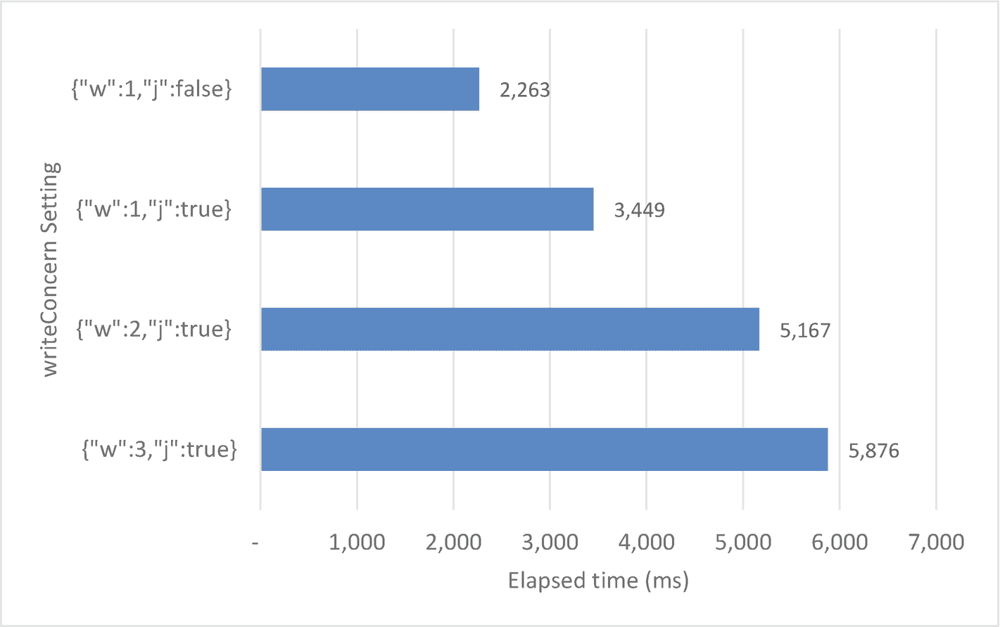
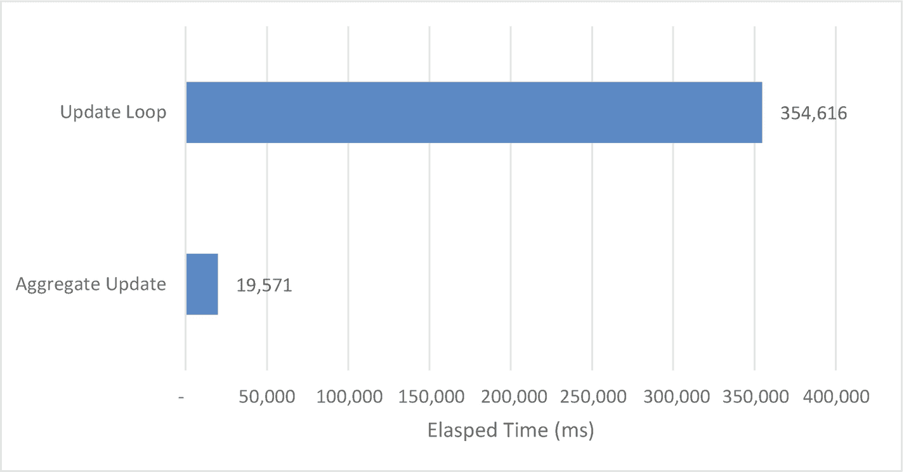

# 8.插入、更新和删除

在这一章中，我们来看看与*数据操作*语句的性能相关的问题。这些语句(`insert`、`update`和`delete`)改变了包含在 MongoDB 数据库中的信息。

即使在事务处理环境中，大多数数据库活动都与数据检索有关。为了更改或删除数据，您必须找到数据，甚至插入操作也经常涉及查询以获取查找键或嵌入其他集合中保存的数据。因此，大多数调优工作通常都涉及到查询优化。

然而，在 MongoDB 中有一些特定于数据操作的优化，我们将在本章中介绍它们。

## 基本原则

所有数据操作语句的开销都直接受到以下因素的影响:

*   语句中包含的任何筛选条件子句的效率

*   作为语句的结果，必须执行的索引维护量

### 过滤器优化

修改和删除文档所涉及的大量开销是定位要处理的文档所引起的。`Delete`和`update`语句通常包含一个筛选子句，用于标识要删除或更新的文档。优化这些语句性能的第一步显然是使用前面章节中讨论的原则来优化这些筛选子句。特别是，考虑对筛选条件中包含的属性创建索引。

Tip

如果 update 或 delete 语句包含过滤条件，请确保使用第 [6](06.html) 章中概述的原则优化过滤条件。

### 解释数据操作语句

在数据操作语句中使用`explain()`是完全可能的，也是绝对可取的。对于`delete`和`update`命令，`explain()`将揭示 MongoDB 如何找到要处理的文档。例如，这里我们看到一个更新，它将使用集合扫描来查找要处理的行:

```js
mongo> var exp=db.customers.explain().
               update({viewCount:{$gt:50}},
                      {$set:{discount:10}},{multi:true});
mongo> mongoTuning.quickExplain(exp);

1   COLLSCAN
2  UPDATE

```

您也可以安全地使用`explain().`的`executionStats`模式，尽管`executionStats`确实执行相关的语句，并将报告将要修改的文档数量，但它实际上并不修改任何文档。

在以下示例中，`explain()`报告有 45 个文档符合过滤条件并被更新:

```js
mongo> var exp=db.customers.explain('executionStats').
...            update({viewCount:{$gt:50}},
...                   {$set:{discount:10}},{multi:true});
mongo> mongoTuning.executionStats(exp);

1   COLLSCAN ( ms:29 docs:411121)
2  UPDATE ( ms:31 upd:45)

Totals:  ms: 385  keys: 0  Docs: 411121

```

### 索引开销

尽管索引可以极大地提高查询性能，但它们确实会降低更新、插入和删除的性能。当插入或删除文档时，通常会更新集合的所有索引，并且当更新改变了索引中出现的任何属性时，也必须修改索引。

因此，我们所有的索引对查询性能的贡献是很重要的，因为这些索引会不必要地降低`update`、`insert,`和`delete`的执行。特别是，在对频繁更新的属性创建索引时，应该特别小心。一个文档只能插入或删除一次，但可以更新多次。因此，对频繁更新的属性或具有非常高的插入/删除率的集合进行索引将需要特别高的成本。

图 [8-1](#Fig1) 展示了索引对插入和删除性能的影响。它显示了随着更多的索引被添加到集合中，插入然后删除 100，000 个文档所花费的时间是如何变化的。


图 8-1

索引对插入/删除性能的影响

Tip

索引总是会增加`insert`和`delete`语句的开销，并且可能会增加`update`语句的开销。避免过度索引，尤其是在频繁更新的列上。

### 查找未使用的索引

查询调优过程导致大量索引创建是很常见的，有时可能会有冗余和未使用的索引。您可以使用`$indexStats` aggregation 命令来查看索引利用率:

```js
mongo>db.customers.aggregate([
...   { $indexStats: {} },
...   { $project: { name: 1,
                    'accesses.ops': 1 } }]);

{ "name" : "LastName_1_FirstName_1",
       "accesses" : { "ops" : NumberLong(2068) } }
{ "name" : "_id_", "accesses" : { "ops" : NumberLong(1442414) } }
{ "name" : "updateFlag_1", "accesses" : { "ops" : NumberLong(0) } }

```

从这个输出中，我们可以看到自从 MongoDB 服务器最后一次启动以来,`updateFlag_1`索引没有对任何操作做出贡献。我们可能会考虑删除该索引。但是，请记住，如果服务器最近重新启动过，或者此索引支持上次在重新启动之前发生的定期查询，则此操作计数器可能会产生误导。

Tip

定期使用`$indexStats`来识别任何未使用或未充分利用的索引。这些索引可能会降低数据操作的速度，而不会加快查询速度。

该指南有一些例外:

*   唯一索引的存在可能纯粹是为了防止创建重复值，因此即使对查询性能没有帮助，它也有一定的用途。

*   类似地，*生存时间* (TTL)索引可能用于清除旧数据，而不是加速查询。

### 写关注

在操作集群中的数据时， *write concern* 控制集群中有多少成员必须在将控制权返回给应用程序之前确认该操作。指定大于 1 的写关注级别通常会增加延迟并降低吞吐量，但会导致更可靠的写，因为它消除了在单个副本集节点出现故障时丢失写的可能性。我们将在第 13 章[中详细讨论写关注点。](13.html)

通常，您不应该为了获得性能提升而牺牲数据完整性。然而，值得记住的是，writeConcern 对数据操作语句的性能有直接影响。图 [8-2](#Fig2) 显示了插入 100，000 个文档时不同 writeConcern 设置的效果。我们将在第 13 章[中详细讨论这个问题。](13.html)



图 8-2

写操作对插入性能的影响

Warning

调整 writeConcern 可以提高性能，但可能会以牺牲数据完整性或安全性为代价。除非您完全了解这些权衡，否则不要调整 writeConcern 来提高性能。

## 插入

将数据放入 MongoDB 数据库是取出数据的必要先决条件，插入数据容易受到各种瓶颈和调优机会的影响。

### 成批处理

在第 [6](06.html) 章中，我们看到了如何使用批处理来优化从 MongoDB 服务器获取数据。我们使用批处理来确保我们不会执行不必要的网络往返，通过确保每个网络传输都有一个“满”负载。如果我们使用的批量大小为 1000，我们的网络传输量比使用的批量大小为 10 少 100 倍。

同样的原理也适用于插入数据。我们希望确保将数据批量推送到 MongoDB，这样就不会执行不必要的网络往返。不幸的是，虽然当我们发出一个`find()`时，MongoDB 可以自动向我们发送成批的信息，但是为一个`insert`构造成批的信息是由我们自己决定的。

例如，考虑下面的代码:

```js
myDocuments.forEach((document)=>{
  db.batchInsert.insert(document);
});

```

对于`myDocuments`中的每个文档，我们发出一个 MongoDB `insert`语句。如果有 10，000 个文档，我们将发出 10，000 个 MongoDB 调用，因此有 10，000 次网络往返。这样会表现很差。

在一次数据库调用中插入所有文档会好得多。这可以简单地通过发出一个`insertMany`命令来完成:

```js
db.batchInsert.insertMany(db.myDocuments.find().toArray());

```

这个表现好很多。在一个简单的测试案例中，它返回的时间不到“一次一个”方法所用时间的 10%。

然而，我们不能总是一次插入所有数据。如果我们有一个流应用程序，或者如果要插入的数据量很大，我们可能无法在插入之前将数据全部累积到内存中。在这种情况下，我们可以使用 MongoDB *bulk* 操作。

bulk 对象是由集合方法创建的。您可以增量地插入 bulk 对象，然后发出 bulk 对象的`execute`方法，将批处理推入数据库。下面的代码对前面示例中使用的数据数组执行此任务。数据以 1000 为一批插入:

```js
var bulk = db.batchInsert.initializeUnorderedBulkOp();
var i=0;
myDocuments.forEach((document)=>{
  bulk.insert(document);
  i++;
  if (i%1000===0) {
     bulk.execute();
     bulk = db.batchInsert.initializeUnorderedBulkOp();
  }
});
bulk.execute;

```

图 [8-3](#Fig3) 显示了“一次一个”插入、“一次全部”插入和批量插入的相对性能。


图 8-3

通过批量插入获得的性能提升(10，000 个文档)

Tip

不要一次插入一个文档的重要数据量。尽可能使用批量插入来减少网络开销。

### 克隆数据

有时，您可能希望将集合中一组文档的数据复制或克隆到同一个集合或另一个集合中。

例如，在一个电子商务应用程序中，您可能会实现一个“重复订单”按钮——它会将一个订单中的所有行项目复制到一个新订单中。

我们可以使用如下逻辑实现这样一个工具:

```js
function repeatOrder(orderId) {
  let newOrder = db.orders.findOne({ _id: orderId },
                  { _id: 0 });
  let orderInsertRC = db.orders.insertOne(newOrder);
  let newOrderId = orderInsertRC.insertedId;
  let newLineItems = db.lineitems.
    find({ orderId: orderId },
         { _id: 0 }).toArray();
  for (let li = 0; li < newLineItems.length; li++) {
    newLineItems[li].orderId = newOrderId;
  }
  db.lineItems.insertMany(newLineItems);
  return newOrderId;
}

```

该函数检索现有的行项目，用新的订单 Id 修改，然后将项目重新插入到集合中。

如果有很多行项目，那么最大的瓶颈将是从数据库中提取行项目，然后将这些行项目放入新订单的网络延迟。

从 MongoDB 4.4 开始，我们可以使用一种替代技术，包括聚合框架管道来克隆数据。这种方法的优点是不需要将数据移出数据库——克隆发生在数据库服务器内，没有任何网络开销。`$merge`操作符允许我们根据聚合管道的输出执行插入。

以下是聚合备选方案的一个示例:

```js
function repeatOrder(orderId) {
  let newOrder = db.orders.findOne({ _id: orderId }, { _id: 0 });
  let orderInsertRC = db.orders.insertOne(newOrder);
  let newOrderId = orderInsertRC.insertedId;
  db.lineitems.aggregate([
    {
      $match: {
        orderId: { $eq: orderId }
      }
    },
    {
      $project: {
        _id: 0,
        orderId: 0
      }
    },
    { $addFields: { orderId: newOrderId } },
    {
      $merge: {
        into: 'lineitems'
      }
    }
  ]);
  return newOrderId;
}

```

这个函数使用`$merge`管道操作符将管道的输出推回到集合中。图 [8-4](#Fig4) 比较了两种方法的性能——超过 500 个数据克隆操作，使用聚合`$merge`方法所用时间大约减半。


图 8-4

使用聚合`$merge`管道加速数据克隆(500 个文档)

MongoDB `$out`聚合操作符提供了与`$merge`类似的功能，尽管它不能插入到源集合中，并且——我们将在本章后面看到——执行 upsert 类型合并的选项较少。

Tip

当插入来自集合中数据的批量数据时，使用聚合框架`$out`和`$merge`操作符来避免跨网络移动数据。

### 从文件加载

MongoDB 提供了`mongoimport`和`mongorestore`命令来从 JSON 或 CSV 文件或者从`mongodump`的输出中加载数据。

无论您使用哪种方法，这类数据负载中最重要的因素通常是网络延迟。压缩一个文件，通过网络将它移动到 MongoDB 服务器主机，解压缩，然后运行导入，几乎总是比直接从另一个服务器导入要快。

在 MongoDB Atlas 中，您无法将文件直接移动到 Atlas 服务器上。但是，您可能会发现，在同一区域创建一个虚拟机并从该虚拟机转移负载可以显著提升性能。

## 更新

文档只能插入或删除一次，但可以多次更新。因此，更新优化是 MongoDB 性能调优的一个重要方面。

### 动态值批量更新

有时，您可能需要更新集合中的多行，其中要设置的值取决于文档中的其他属性或另一个集合中的值。

例如，假设我们想要在视频流`customers`集合中插入一个“观看计数”。为每个客户设置的值是不同的，因此我们可以检索每个客户文档，然后使用`views`数组中的元素数更新同一个客户文档。逻辑可能是这样的:

```js
db.customers.find({}, { _id: 1, views: 1 }).
  forEach(customer => {
  let updRC=db.customers.update(
    { _id: customer['_id'] },
    { $set: { viewCount: customer.views.length } }
  );
});

```

这种解决方案很容易编码，但是性能很差:我们必须通过网络获取大量数据，并且我们必须发出与客户一样多的 update 语句。然而，在 MongoDB 4.2 之前，这可能是可用的最佳解决方案。

然而，从 MongoDB 4.2 开始，我们能够在更新语句中嵌入聚合框架管道。这些管道允许我们设置一个从文档中的其他值派生或依赖于其他值的值。例如，我们可以用这条语句填充`viewCount`属性:

```js
db.customers.update(
             {},
             [{ $set: { viewCount: { $size: '$views' } } }],
             {multi: true});

```

图 [8-5](#Fig5) 比较了两种方法的性能。聚合管道减少了大约 95%的执行时间。



图 8-5

使用聚合管道与多次更新(大约 411，000 个文档)

Tip

当需要根据现有值动态更新数据时，可以考虑在 update 语句中使用嵌入式聚合管道。

### 多:真标志

MongoDB update 命令接受一个`multi`参数，该参数决定是否在操作中更新多个文档。当设置了`multi:false`时，MongoDB 将在单个文档更新后立即停止处理。

以下示例显示了不带`multi`标志的 update 语句:

```js
mongo> var exp = db.customers.
...   explain('executionStats').
...   update({ flag: true }, { $set: { flag: false } });
mongo> mongoTuning.executionStats(exp);

1   COLLSCAN ( ms:1 docs:9999)
2  UPDATE ( ms:1 upd:1)

Totals:  ms: 10  keys: 0  Docs: 9999

```

MongoDB 扫描整个集合，直到找到匹配的值，然后执行更新。一旦找到单个文档，扫描就结束。

如果我们知道只有一个值需要更新，但是无论如何都要包括`multi:true`，我们将看到这个执行计划:

```js
mongo> var exp = db.customers.
...   explain('executionStats').
...   update({ flag: true }, { $set: { flag: false } },
...          {multi:true});
mongo> mongoTuning.executionStats(exp);

1   COLLSCAN ( ms:35 docs:411119)
2  UPDATE ( ms:35 upd:1)

Totals:  ms: 368  keys: 0  Docs: 411119

```

更新的文件数量相同，但处理的文件数量要高得多(411，000 对 999)。因此，该语句的运行时间要长得多。在初始更新之后，更新继续扫描集合，寻找更多符合条件的文档。

Tip

如果你知道你只需要更新一个文档，不要设置`multi:true`。如果涉及到索引或集合扫描，MongoDB 可能会执行不必要的工作，寻找其他要更新的文档。

### 冷门

Upserts 允许您发出一条语句，如果存在匹配的文档，则执行 update，否则执行 insert。当您试图将文档合并到一个集合中，并且不想明确检查文档是否存在时，Upserts 可以提高性能。

例如，如果我们将数据加载到一个集合中，但不知道我们是否需要插入或替换，我们可以实现类似这样的逻辑:

```js
  db.source.find().forEach(doc => {
    let matchingDocs = db.target.count({ _id: doc['_id'] });

    if (matchingDocs === 0) {
      db.target.insert(doc);
      inserts++;
    } else {
      db.target.update({ _id: doc['_id'] }, doc,
                        { multi: false });
      updates++;
    }
  });

```

我们寻找匹配的值，如果找到，就执行更新；否则，执行插入。

Upsert 允许我们将插入和更新操作合并到一个操作中，并且消除了首先检查匹配值的需要。这是 upsert 逻辑:

```js
  db.source.find().forEach(doc => {
    let returnCodes = db.target.update({ _id: doc['_id'] }, doc,
            {upsert: true});
    inserts += returnCodes.nUpserted;
    updates += returnCodes.nModified;
  });

```

新的逻辑更加简单，并且减少了需要处理的数据库命令的数量。通过远程网络连接，upsert 解决方案要快得多。图 [8-6](#Fig6) 比较了两种结果的性能。


图 8-6

与查找/插入/更新相比，插入性能提高(10，000 个文档)

Tip

如果不确定是插入还是更新文档，请使用 upsert 而不是条件 insert/update 语句。

### 使用$merge 批量增加插入

图 [8-6](#Fig6) 中比较的解决方案一次插入或更新一个文档。正如我们已经看到的，单个文档处理比批量处理花费的时间更长，所以如果我们能够在一次操作中插入或更新多个文档就更好了。

从 MongoDB 4.2 开始，我们可以使用`$merge`聚合操作符来实现这一点，前提是我们的输入数据已经在 MongoDB 集合中。`$merge`的操作与`upsert`非常相似，允许我们在匹配时更新文档，否则插入一个文档。上一节的逻辑可以用下面的语句在单个`$merge`操作中实现:

```js
db.source.aggregate([{$merge:
                      {        into:"target",
                                 on: "_id",
                        whenMatched:"replace",
                     whenNotMatched:"insert"}}]);

```

聚合管道的速度快得惊人。除了减少必须执行的 MongoDB 语句的数量并允许批量处理之外，聚合管道还避免了跨网络移动数据。图 [8-7](#Fig7) 显示了通过`$merge`可以实现的性能提升。


图 8-7

多个升级对比单个`$merge`语句(10，000 个文档)

## 删除优化

像插入一样，删除必须修改集合中存在的所有索引。因此，对于处理大量临时流数据的系统来说，从大量索引集合中删除数据通常会成为一个严重的问题。

在这种情况下，通过设置删除标志来“逻辑地”删除相关文档可能是有用的。删除标志可用于向应用程序指示应该忽略文档。这些文档可以在维护窗口中定期被物理删除。

如果您采用这种“逻辑删除”策略，那么您需要使删除标志成为所有索引中的一个属性，并在针对该集合的所有查询中包含删除标志。

## 摘要

在这一章中，我们已经了解了如何优化数据操作语句—`insert`、`update`和`delete`。

数据操作吞吐量在很大程度上取决于集合中的索引数量。用来加快查询速度的索引会降低数据操作语句的速度，所以要确保每个索引都物有所值。

`Update`和`delete`语句接受过滤条件，优化这些过滤条件的原则与`find()`和聚合`$match`操作的原则相同。

插入时，请确保成批插入，如果插入来自另一个集合的数据，请尽可能使用聚合管道。聚合管道还可以极大地改善依赖于 MongoDB 中已有数据的批量更新操作。