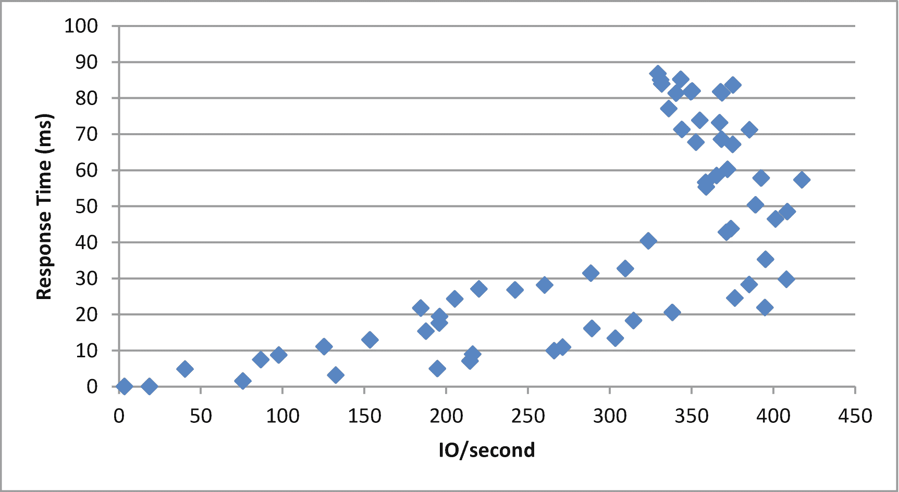
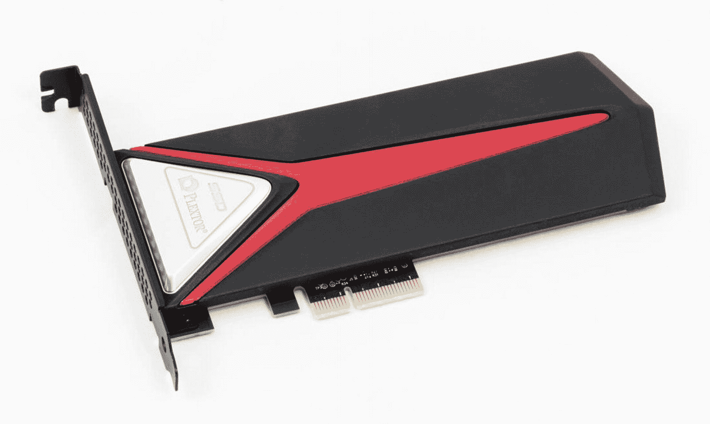
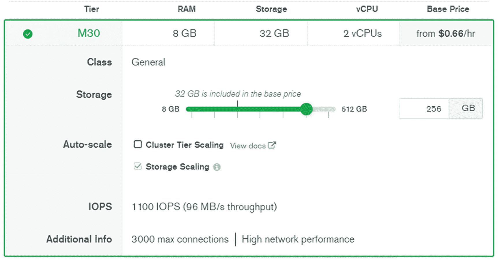

# 12.磁盘 IO

在前面的章节中，我们已经尽了最大努力来避免磁盘 IO。通过优化数据库设计和调优查询，我们最小化了工作负载需求，从而降低了 MongoDB 上的逻辑 IO 需求。优化内存减少了转化为磁盘活动的工作量。如果您已经应用了前几章中的实践，那么您的物理磁盘需求已经最小化:现在是时候优化磁盘子系统来满足这种需求了。

降低 IO 需求应该总是先于磁盘 IO 调整。就时间、金钱和数据库可用性而言，磁盘调优通常是昂贵的。这可能涉及购买昂贵的新磁盘设备和执行耗时的数据重组，从而降低可用性和性能。如果您在优化工作负载和内存之前尝试这些事情，那么您可能会为了不切实际的需求而不必要地优化磁盘。

## IO 基础知识

在我们研究 MongoDB 如何执行磁盘 IO 操作以及您可能部署的各种类型的 IO 系统之前，有必要回顾一下适用于任何磁盘 IO 系统和任何数据库系统的一些基本概念。

### 延迟和吞吐量

从性能角度来看，磁盘设备有两个与我们相关的基本特征:*延迟*和*吞吐量*。

*延迟*描述了从磁盘中检索一条信息所需的时间。对于旋转磁盘驱动器，这是将磁盘旋转到正确位置所需的时间(*旋转延迟*)，加上将读/写磁头移动到正确位置所需的时间(*寻道时间*)，再加上将数据从磁盘传输到服务器所需的时间。对于固态磁盘，没有机械寻道时间或旋转延迟，只有传输时间。

IO *吞吐量*描述了在给定的时间单位内，磁盘设备可以执行的 IO 数量。吞吐量一般用每秒 IO 操作数来表示，通常缩写为 *IOPS* 。

对于单个磁盘设备，尤其是固态硬盘，吞吐量和延迟密切相关。吞吐量直接由延迟决定—如果每个 IO 花费千分之一秒，那么吞吐量应该是 1000 IOPS。但是，当多个设备合并到一个逻辑卷中时，延迟和吞吐量之间的关系就不那么直接了。此外，在磁盘中，顺序读取的吞吐量远远高于随机读取。

对于大多数数据库服务器，数据存储在多个磁盘设备上，并在相关的磁盘上“分条”。在这种情况下，IO 带宽是 IO 操作类型(随机与顺序)、服务时间和磁盘数量的函数。例如，包含 10 个服务时间为 10ms 的磁盘的完美条带化磁盘阵列的随机 IO 带宽约为 1000 IOPS(每个磁盘 100 IOPS 乘以 10 个磁盘)。

### 排队等候

当磁盘空闲并等待请求时，磁盘设备的服务时间仍然是相当可预测的。服务时间会有所不同，具体取决于磁盘的内部缓存以及(对于磁盘)读/写磁头获取相关数据所需移动的距离。但一般来说，响应时间会在磁盘制造商报价的范围内。

然而，随着请求数量的增加，一些请求将不得不等待，而其他请求将得到服务。随着请求速率的增加，最终会形成一个队列。就像在一个繁忙的超市里，你很快就会发现你排队的时间比实际得到服务的时间还要长。

由于排队，当磁盘系统接近最大容量时，磁盘延迟会急剧增加。当磁盘变得 100%繁忙时，任何额外的请求只会增加队列的长度，服务时间会增加，而吞吐量不会随之增加。

这里的教训是，随着磁盘吞吐量的增加，延迟也会增加。图 [12-1](#Fig1) 说明了吞吐量和延迟之间的典型关系:吞吐量的增加通常与延迟的增加有关。最终，无法实现更多的吞吐量；此时，请求速率的任何增加都会增加延迟，而不会增加吞吐量。



图 12-1

延迟与吞吐量

Note

延迟和吞吐量是相互关联的:增加吞吐量或对磁盘设备的需求通常会导致延迟增加。为了最大限度地减少延迟，可能需要以低于最大吞吐量的速度运行磁盘。

如果单个磁盘的最大 IOPS 有限制，那么实现更高的 IO 吞吐率将需要部署更多的物理磁盘。与延迟计算(由相对复杂的排队论计算控制)不同，所需磁盘设备数量的计算非常简单。如果单个磁盘可以执行 100 IOPS，同时提供可接受的延迟，并且我们认为我们需要提供 500 IOPS，那么我们可能需要至少 5 个磁盘设备。

Tip

IO 系统的吞吐量主要取决于它包含的物理磁盘设备的数量。要增加 IO 吞吐量，请增加磁盘卷中物理磁盘的数量。

但是，并不总是能够确定磁盘设备的“舒适”IO 速率，即提供可接受服务时间的 IO 速率。磁盘供应商指定最小延迟(在不争用磁盘的情况下可以实现的延迟)和最大吞吐量(在忽略服务时间限制的情况下可以实现的吞吐量)。根据定义，磁盘设备的报价吞吐量是磁盘 100%繁忙时可以达到的吞吐量。为了确定在获得接近最小值的服务时间的同时可以实现的 IO 速率，您将希望 IO 速率低于供应商所报的速率。确切的差异取决于您在应用程序中如何平衡响应时间与吞吐量，以及您使用的驱动器技术类型。然而，超过供应商报价的最大*值*的 50–70%的吞吐量通常会导致响应时间比供应商公布的最小*值*高出数倍*。*

### 顺序和随机 IO

出于数据库工作负载的目的，IO 操作可以分为两个维度:*读取*与*写入* IO 和*顺序*与*随机* IO。

当按顺序读取数据块时，会出现顺序 IO。例如，当我们使用集合扫描读取集合中的所有文档时，我们正在执行顺序 IO。随机 IO 以任意顺序访问数据页面。例如，当我们在索引查找之后从集合中检索单个文档时，我们正在执行随机 IO。

表 [12-1](#Tab1) 显示了数据库 IO 如何映射到这两个维度。

表 12-1

数据库 IO 的类别

<colgroup><col class="tcol1 align-left"> <col class="tcol2 align-left"> <col class="tcol3 align-left"></colgroup> 
|   | 

阅读

 | 

写

 |
| --- | --- | --- |
| **随机** | 使用索引阅读单个文档 | 驱逐后将数据从缓存写入磁盘(参见第 [11](11.html) 章) |
| **连续的** | 使用全集合扫描读取集合中的所有文档扫描索引条目以避免磁盘排序 | 写入 WiredTiger 日志或操作日志将数据大容量加载到数据库中 |

## 磁盘硬件

在本节中，我们将回顾构成存储子系统的各种硬件组件，从单个磁盘或 SSD 磁盘到硬件和基于云的存储阵列。

## 磁盘(硬盘)

对于几代 IT 专业人士来说，磁盘或硬盘驱动器(T2 硬盘驱动器)已经成为主流计算机设备中无处不在的组件。这项技术最早于 20 世纪 50 年代推出，基本技术一直保持不变:一个或多个盘片包含代表信息位的磁荷。这些磁荷由致动器臂读写，致动器臂在磁盘上移动到盘片半径上的特定位置，然后等待盘片旋转到适当的位置。读取一项信息所花费的时间是将磁头移动到位所花费的时间(寻道时间)、将该项旋转到位所花费的时间(旋转延迟)以及通过磁盘控制器传输该项所花费的时间(传输时间)的总和。图 [12-2](#Fig2) <sup>[1](#Fn1)</sup> 说明了一个磁盘设备的核心架构。


图 12-2

硬盘驱动器架构

对于数据库工作负载，这个体系结构有一些我们应该知道的含义。虽然随机存取非常慢，因为我们必须等待磁盘磁头移动到位，但顺序读取和写入可以非常快，因为当顺序数据在其下方旋转时，读取磁头可以保持在原位。当我们稍后比较 HDD 和 SSD 的写入性能时，这具有一些含义。

摩尔定律——首先由英特尔创始人戈登·摩尔阐明——观察到晶体管密度每 18-24 个月翻一番。在最广泛的解释中，摩尔定律反映了几乎所有电子组件中常见的指数增长，影响了 CPU 速度、RAM 和磁盘存储容量。

虽然这种指数增长几乎出现在计算的所有电子方面，包括硬盘密度，但它不适用于机械技术，如磁盘 IO 的基础技术。例如，如果摩尔定律适用于磁盘设备的旋转速度，今天的磁盘应该比 20 世纪 60 年代初快 2000 万倍——事实上，它们的旋转速度只有 8 倍。

## 固态硬盘

固态硬盘(SSD)将数据存储在半导体单元中，没有移动部件。它们为数据传输提供了低得多的延迟，因为不需要等待磁盘设备中所需的磁盘或致动器臂的机械运动。

Note

人们通常将固态设备称为“磁盘”，即使它们没有旋转磁盘组件。

然而，只是在过去的 10-15 年间，固态硬盘才变得足够便宜，成为数据库系统的经济选择。即使是现在，磁盘提供的每 GB 存储比固态硬盘便宜得多，对于某些系统，磁盘或固态硬盘和磁盘的组合将提供最佳的性价比组合。

固态硬盘和磁盘之间的性能差异比简单的快速读取更复杂。正如磁盘的基础架构支持某些 IO 操作一样，固态硬盘的架构也支持不同类型的 IO。了解 SSD 如何处理不同类型的操作有助于我们做出部署 SSD 的最佳决策。

Note

在下面的讨论中，我们将集中讨论基于闪存的 SSD 技术，因为这种技术几乎普遍用于数据库系统。然而，也有基于 DRAM 的 SSD 设备具有更高的成本和更好的性能。

### SSD 存储层次结构

固态硬盘有三层存储结构。单个信息位存储在*单元*中。在单层单元( *SLC* ) SSD 中，每个单元只存储一位。在多级单元( *MLC* )中，每个单元可以存储两位或多位信息。因此，MLC SSD 设备具有更高的存储密度，但性能和可靠性较低。

单元以页为单位排列(通常大小为 4K ),页分为 128K 到 1M 的块。

### 写入性能

由于闪存技术中写入 IO 的特殊特征，页面和数据块结构对于 SSD 性能尤为重要。读操作和初始写操作只需要一次页面 IO。然而，改变页面的内容需要擦除和重写整个块。即使是初始写入也比读取慢得多，但是块擦除操作尤其慢，大约两毫秒。

图 [12-3](#Fig3) 显示了页面寻道、初始页面写入和块擦除的大致时间。


图 12-3

SSD 性能特征

### 写入耐久性

写 IO 在固态硬盘中还有另一个后果:经过一定次数的写操作后，一个单元可能会变得不可用。此*写耐久性限制*因驱动器而异，但对于低端 MLC 设备，通常在 10，000 个周期之间，对于高端 SLC 设备，则高达 1，000，000 个周期。

### 垃圾收集和损耗均衡

企业 SSD 制造商尽最大努力来避免擦除操作的性能损失和写入耐久性引起的可靠性问题。使用复杂的算法来确保最大限度地减少擦除操作，并确保写入操作在整个设备中均匀分布。

在企业 SSD 中，通过使用*空闲列表*和*垃圾收集*来避免擦除操作。在更新期间，SSD 会将要修改的块标记为无效，并将更新的内容复制到从“空闲列表”中检索的空块稍后，垃圾收集例程将恢复无效的块，将其放在空闲列表中以供后续操作使用。一些 SSD 将保持高于驱动器宣传容量的存储，以确保空闲列表不会为此耗尽空块。

*损耗均衡*是一种算法，可确保任何特定数据块都不会遭受不成比例的写入次数。它可能涉及将“热”块的内容从空闲列表移到块中，并最终将过度使用的块标记为不可用。

### SATA 与 PCI

固态硬盘通常以三种形式部署:

*   *基于 SATA* 或 *SAS* 的闪存驱动器与使用传统 SAS 或 SATA 连接器连接的其他磁性硬盘驱动器采用相同的封装形式。在图 [12-4](#Fig4) 中可以看到这样一个例子。

*   图 [12-5](#Fig5) 中的基于 PCI 的固态硬盘直接连接到电脑主板上的 *PCIe* 接口。 *NVMe* 或非易失性存储器快速规范描述了固态硬盘应该如何连接到 PCIe，因此这些类型的磁盘通常被称为 *NVMe 固态硬盘。*

*   Flash storage servers present multiple SSDs within a rack-mounted server with multiple high-speed network interface cards.

    

    图 12-5

    带 PCIe/NVMe 连接器的固态硬盘 <sup>[3](#Fn3)</sup>

    

    图 12-4

    SATA 和 mSATA 格式的固态硬盘 <sup>[2](#Fn2)</sup>

SATA 或 SAS 闪存驱动器比 PCI 便宜得多。然而，SATA 接口是为具有毫秒级延迟的较慢设备而设计的，因此在固态驱动器服务时间上强加了显著的开销。基于 PCI 的设备可以直接与服务器连接，并提供最佳性能。

### 对固态硬盘的建议

在过去的几页中，我们已经介绍了很多硬件的内部机制，您可能想知道如何将这些应用到您的 MongoDB 部署中。我们可以将磁盘和 SSD 架构的含义总结如下:

*   只要有可能，您应该为 MongoDB 数据库使用基于 SSD 的存储。只有当您拥有大量“冷”数据(很少被访问)时，磁盘才是合适的。

*   如果您正在混合使用存储技术，请记住，硬盘按 GB 计算更便宜，但按 IOPS 计算更贵。换句话说，您将花费更多的钱来尝试使用 HDD 实现给定的每秒 IO 速率，并花费更多的钱来尝试使用 SSD 实现一定量的 GB 存储。

*   基于 PCI 的固态硬盘(NVMe)比基于 SATA 的固态硬盘快，单层单元(SLC)固态硬盘比多层单元(MLC)固态硬盘快。

## 存储阵列

我们通常不会将生产 MongoDB 实例配置为直接写入单个设备。相反，MongoDB 访问多个磁盘，这些磁盘被组合成一个*逻辑卷*或*存储阵列*。

### RAID 级别

*RAID*——最初是*廉价磁盘冗余阵列* <sup>[4](#Fn4)</sup> 的缩写——定义了各种条带化和冗余方案。术语“RAID 阵列”通常指包括多个物理磁盘设备的存储设备，这些物理磁盘设备可以连接到服务器并作为一个或多个逻辑设备被访问。

存储供应商通常提供三种级别的 RAID:

*   **RAID 0** 被称为“条带化”磁盘。在这种配置中，逻辑磁盘由多个物理磁盘构成。逻辑磁盘上包含的数据均匀分布在物理磁盘上，因此随机 io 也可能均匀分布。这种配置没有内置冗余，因此如果磁盘出现故障，磁盘上的数据必须从备份中恢复。

*   **RAID 1** 被称为磁盘“镜像”在这种配置中，逻辑磁盘由两个物理磁盘组成。如果一个物理磁盘出现故障，可以使用另一个物理磁盘继续处理。每个磁盘都包含相同的数据，并且写入是并行处理的，因此对写入性能的负面影响应该很小或没有。可以从任何一个磁盘对进行读取，因此应该增加读取吞吐量。

*   在 **RAID 5** 中，一个逻辑磁盘由多个物理磁盘组成。数据以类似于磁盘条带化(RAID 0)的方式跨物理设备排列。但是，物理设备上一定比例的数据是*奇偶校验*数据。这种奇偶校验数据包含足够的信息，可以在单个物理设备出现故障时在其他磁盘上导出数据。

较低的 RAID 级别(2–4)具有与 RAID 5 相似的特征，但在实践中很少遇到。RAID 6 类似于 RAID 5，但具有更多冗余:两个磁盘可以同时发生故障而不会丢失数据。

将 RAID 0 和 RAID 1 组合使用(通常称为 *RAID 10* 或 *RAID 0+1* )是很常见的。这种条带化和镜像配置提供了针对硬件故障的保护，并具有 IO 条带化的优势。RAID 10 有时被称为 *SAME* (条带化和镜像一切)策略。

图 [12-6](#Fig6) 说明了各种 raid 级别。


图 12-6

RAID 级别

您可以使用 Linux 和 Windows 提供的*逻辑卷管理* ( *LVM* )软件，使用直接连接的磁盘设备实现 RAID。更常见的是，RAID 配置在硬件存储阵列中。我们很快就会看到这两种情况。

### RAID 5 写入损失

RAID 5 为提供容错存储提供了最经济的体系结构，IO 分布在多个物理磁盘上。因此，它在存储供应商和 MIS 部门中都很受欢迎。然而，对于数据库服务器来说，这是一个非常可疑的配置。

RAID 0 和 RAID 5 都通过将负载分散到多个设备来提高并发随机读取的性能。但是，RAID 5 会降低写入 IO 的性能，因为在写入过程中，必须读取源数据块和奇偶校验数据块，然后进行更新，总共四次 IO。如果一个磁盘发生故障，这种退化会变得更加严重，因为为了重建故障磁盘的逻辑视图，必须访问所有磁盘。

从性能的角度来看，RAID 5 几乎没有什么优势，但也有非常明显的缺点。RAID 5 导致的写入损失通常会降低检查点、逐出和日志 IO 的性能。RAID 5 应该只考虑用于以只读为主的数据库。即使对于数据仓库这样的读取密集型数据库，当执行大型聚合时，RAID 5 仍然会导致灾难性的性能:临时文件 IO 将会严重降级，甚至只读性能也会明显受到影响。

Caution

RAID 5 的写入代价使其不适合大多数数据库。当临时文件 IO 发生时，即使显然是只读的数据库也可能被 RAID 5 降级。

### RAID 5 设备中的非易失性缓存

通过使用*非易失性高速缓存*，可以减少与 RAID 5 设备相关的写入损失。非易失性高速缓存是一种带有备用电池的存储器，可确保高速缓存中的数据在断电时不会丢失。因为缓存中的数据受到保护，不会丢失，所以一旦数据存储到缓存中，磁盘设备就可以报告数据已经写入磁盘。数据可以在以后的某个时间点写入物理磁盘。

电池支持的缓存可以极大地提高写入性能，特别是当应用程序请求确认写入的数据实际上已经提交到磁盘时 MongoDB 几乎总是这样做。这种高速缓存在 RAID 设备中非常常见，部分原因是它们有助于减轻 RAID 5 配置中的磁盘写入开销。有了足够大的缓存，对于突发的写入活动，RAID 5 写入开销几乎可以消除。但是，如果写活动持续一段时间，缓存将被修改的数据填满，阵列性能将下降到底层磁盘的水平，性能可能会突然大幅下降。这种影响是非常显著的——磁盘吞吐量突然大幅下降，服务时间大幅缩短。

### 自己动手阵列

如果有多个设备直接连接到主机服务器，您可能希望自己对它们进行条带化和/或镜像。这个过程因系统而异，但是在大多数 Linux 系统上，您可以使用`mdadm`命令。

这里，我们从两个原始设备`/dev/sdh`和`/dev/sdi`创建一个条带卷`/dev/md0`。`–level=0`参数表示 RAID 0 设备。

```js
[root@Centos8 etc]# # Make the array
[root@Centos8 etc]# mdadm --create --verbose /dev/md0 --level=0
      --name=raid1a --raid-devices=2 /dev/sdh /dev/sdi
mdadm: chunk size defaults to 512K
mdadm: Defaulting to version 1.2 metadata
mdadm: array /dev/md0 started.

[root@Centos8 etc]# # create a filesystem on the array
[root@Centos8 etc]# mkfs -t xfs /dev/md0
meta-data=/dev/md0               isize=512    agcount=16, agsize=1047424 blks
         =                       sectsz=4096  attr=2,
  ...
[root@Centos8 etc]# # Mount the array
[root@Centos8 etc]# mkdir /mnt/raid1a
[root@Centos8 etc]# mount /dev/md0 /mnt/raid1a
Filesystem     Type 1K-blocks   Used Available Use% Mounted on
/dev/md0       xfs   67002404 501408  66500996   1% /mnt/raid1a

```

如果我们创建了多个 RAID 0 设备，我们可以使用 RAID 1 将它们组合起来，以创建一个 RAID 10 配置。

### 硬件存储阵列

许多 MongoDB 数据库使用直接连接的存储设备——运行 mongod 实例的服务器可以完全独占地访问使用 SATA、SAS 或 PCIe 接口直接连接到服务器的存储设备。然而，由通常被称为*存储阵列*的外部存储设备提供存储和 IO 至少是常见的。

存储阵列提供对设备池的共享访问，这些设备通常采用某种 RAID 配置来提供高可用性。通常有一个非易失性内存高速缓存，确保即使在电源故障的情况下，高速缓存中的数据仍能写入磁盘。

存储阵列通过本地(通常是专用的)网络接口连接到服务器，并为服务器提供块设备，该设备提供直接连接的磁盘驱动器的所有功能。

各种硬件供应商提供了各种各样的存储阵列配置。对于 MongoDB 服务器，存储阵列的关键考虑事项如下:

*   无论硬件存储阵列的内部配置有多好，都会增加每个 IO 请求的网络延迟。与优化的直连 IO 相比，硬件存储阵列可能具有更高的延迟。

*   存储阵列的内部配置很重要，关于 HDD 与 SSD、PCI 与 SATA 以及 SLC 与 MLC 的建议都适用于硬件存储阵列。

*   硬件存储阵列供应商通常会试图说服您，他们的 RAID 5 配置比 RAID 10 更经济。然而，数十年的数据库 IO 经验反对这一观点–RAID 5 是一种虚假的经济，它通常会增加 IOPS 的成本，即使它降低了每 GB 存储的美元成本。

Tip

当考虑 IO 子系统时，请记住，您必须为 IOPS 支付高达 GB 的存储费用。RAID 5 可能看起来每 GB 更具成本效益，但它将使实现所需的写入 IO 速率变得更加困难，最终也更加昂贵。

## 云存储

在云环境中，底层硬件架构通常是模糊的。相反，云供应商提供了各种块存储设备，每种设备都与特定的延迟和吞吐量服务级别相关联。

表 [12-2](#Tab2) 描述了亚马逊 AWS 云上可用的一些卷类型。谷歌云平台(GCP)和微软 Azure 提供非常相似的产品。

表 12-2

亚马逊 AWS 卷类型

<colgroup><col class="tcol1 align-left"> <col class="tcol2 align-left"></colgroup> 
| 

卷类型

 | 

描述

 |
| --- | --- |
| **通用固态硬盘** | 这些卷基于商用固态硬盘，IO 限制取决于请求的 GB 存储量。用于配置卷的 SSD 数量由请求的存储量决定。100 GB 的卷提供 300 IOPS 的基准。 |
| **调配 IOPS 固态硬盘** | 这些 SSD 卷提供特定的 IO 级别，与所调配的存储量无关。实际上，这意味着 SSD 设备的数量是由 IO 需求决定的，而不是由请求的存储决定的。 |
| **吞吐量优化的硬盘** | 针对顺序读写操作优化的高性能磁盘卷。 |
| **冷硬盘** | 为低成本存储而优化的廉价磁盘。 |
| **实例存储** | 实例存储(或临时磁盘)是直接连接到托管 EC2 虚拟机的物理机的硬盘、SATA 固态硬盘或 NVMe 固态硬盘设备。短暂的 NVMe 磁盘是所有设备类型中速度最快的，但与所有短暂的磁盘一样，一旦实例出现故障，数据就会丢失，因此这些磁盘不应用于 MongoDB 数据文件。 |

我们优化 IO 的指导原则是根据 IO 速率而不是存储容量来配置磁盘。因此，如果为 MongoDB 安装调配基于云的虚拟机，您通常会选择调配的 IOPS SSD 磁盘类型。在 AWS 中，这意味着选择一个*配置的 IOPS SSD* ，在 GCP 选择 *SSD 持久磁盘(pd-ssd)* 类型，在 Azure *选择高级 SSD* 磁盘。

上述每种磁盘类型都是通过专用网络连接到虚拟机的外部磁盘阵列中的磁盘实现的。如果您需要直连设备的极高性能，例如 NVMe 连接的 SSD，您可以考虑在高性能 EC2 虚拟机中提供高速直连磁盘设备的 *AWS Nitro* 配置。

Tip

在为 MongoDB 服务器配置基于云的虚拟机时，使用预配置的 IOPS SSD(亚马逊)、高级 SSD 磁盘(GCP)或 SSD 持久磁盘(GCP)。根据所需的 IO 容量而不是存储容量来选择设备。

### MongoDB Atlas 中的磁盘设备

在配置 MongoDB Atlas 集群时，您需要配置集群所需的最大 IOPS。在后台，Atlas 会从您选择的云平台中为调配的 SSD 设备附加所需的 IOPS 容量。

## 蒙戈布我

现在我们已经回顾了各种类型的存储设备的性能特征，让我们来看看 MongoDB 是如何使用这些设备的。

在使用 WiredTiger 作为存储引擎的 MongoDB 的标准配置中，MongoDB 执行三种主要类型的 IO 操作:

*   **临时文件 IO** 涉及对`dbPath`目录下的`_tmp`目录的读写。当进行磁盘排序或基于磁盘的聚合操作时，会出现这些 io。我们在第七章[和第十一章](07.html)中讨论了这些操作。这些 io 通常是顺序读写操作。

*   **数据文件 IO** 发生在 WiredTiger 读写`dbPath`目录中的集合和索引文件时。对索引文件的读写往往是随机访问(尽管索引扫描可能是顺序的)，而对集合文件的读写可能是随机的，也可能是顺序的。

*   **当 WiredTiger 存储引擎写入“预写”`journal`文件时，日志文件 IO** 发生。这些是顺序写入 io。

图 [12-7](#Fig7) 展示了 MongoDB IO 的各种类型。


图 12-7

蒙戈布 IO 体系结构

### 临时文件 IO

当 MongoDB 聚合请求不能在内存中执行，并且`allowDiskUse`子句被设置为 true 时，会出现临时文件 IO。在这种情况下，多余的数据将被写入到`dbPath`目录下的`_tmp`目录下的临时文件中。

例如，在这里我们看到正在进行三次磁盘排序，每次都写入到`_tmp`目录中的一个唯一文件:

```js
$ ls -l _tmp
total 916352
-rw-------. 1 mongod mongod 297770960 Sep 26 05:19 extsort-sort-executor.3
-rw-------. 1 mongod mongod 223665943 Sep 26 05:19 extsort-sort-executor.4
-rw-------. 1 mongod mongod  99258259 Sep 26 05:19 extsort-sort-executor.5

```

读写这些文件的 IO 数量不会直接暴露在`db.serverStatus()`中，也不会从监控工具中暴露出来，因此很容易“被发现”事实上，实际上您可能找到磁盘排序证据的唯一地方是在 MongoDB 日志中，并且只有当您设置了慢速查询设置时(参见第 [3 章](03.html)):

```js
[root@Centos8 mongodb]# tail mongod.log |grep '"usedDisk"'|jq
{
 <snip>
  "msg": "Slow query",
  "attr": {
    "type": "command",
    "ns": "SampleCollections.baseCollection",
    "appName": "MongoDB Shell",
    "command": {
      "aggregate": "baseCollection",
<snip>
    "planSummary": "COLLSCAN",
    "keysExamined": 0,
    "docsExamined": 1000000,
    "hasSortStage": true,
    "usedDisk": true,
<snip>
    "protocol": "op_msg",
    "durationMillis": 28011
  }
}

```

当此 IO 变得极端时，它会中断对数据文件和日志的 IO。因此，除了创建缓慢的聚合管道之外，磁盘排序还很容易造成普遍的性能瓶颈。

如果您怀疑临时文件的 IO 是一个问题，您应该考虑增加配置参数`internalQueryMaxBlockingSortMemoryUsageBytes`。这一改变可能允许这些操作在内存中得到满足，并避免对`_tmp`目录的 IO。

或者，因为这些 io 只针对临时文件，所以您可以考虑将“`_tmp`”目录放在快速易失性介质上。这可能是专用的 SSD 或基于云的临时磁盘。正如我们在上一节中讨论的，在云托管的虚拟机中，您通常可以配置快速、直接连接的磁盘，这些磁盘不会在虚拟机重启后持续存在。这些设备可能适用于“`_tmp`”目录。

不幸的是，在 MongoDB 的当前实现中，无法将“`_tmp`”直接映射到专用设备。您唯一的选择是将所有其他内容映射到专用设备上——这是可能的，但在大多数情况下可能不切实际。有关过程，请参阅本章后面的“在多个设备上拆分数据文件”一节。

### 《日刊》

当 MongoDB 更改 WiredTiger 缓存中的文档图像时，修改后的“脏”副本不会立即写入磁盘。仅当出现*检查点*时，修改的页面才会被写入磁盘。我们在前一章讨论了检查点。

为了确保在服务器出现故障时数据不会丢失，WiredTiger 将所有更改写入一个*日志*文件。日志文件是*预写日志(WAL)* 模式的一个例子，这种模式在数据库系统中已经普遍使用了几十年。预写日志的优点是可以顺序写入，对于大多数设备(尤其是磁盘)，顺序写入可以获得比随机写入更大的吞吐量。

MongoDB 通过`db.serverStatus()`输出中“WiredTiger”部分的“log”子部分公开 WiredTiger 日志统计信息:

```js
rs1:PRIMARY> db.serverStatus().wiredTiger.log
{
        "busy returns attempting to switch slots" : 1318029,
        "force archive time sleeping (usecs)" : 0,
        "log bytes of payload data" : 83701979208,
        "log bytes written" : 97884903040,
         ...
        "log sync operations" : 415082,
        "log sync time duration (usecs)" : 47627625426,
        "log sync_dir operations" : 936,
        "log sync_dir time duration (usecs)" : 331288246,
         ...
}

```

在此部分中，以下统计信息最有用:

*   **日志写入字节数**:写入日志的数据量。

*   **日志同步操作**:日志“同步”操作的次数。当内存中保存的日志信息被刷新到磁盘时，就会发生同步。

*   **日志同步持续时间(微秒)**:同步操作花费的微秒数。

通过监控这些指标，我们可以确定数据写入日志的速率以及将数据刷新到磁盘时发生的延迟。由于 MongoDB 会话必须等待这些刷新的发生，因此花费在刷新操作上的时间尤其重要。

以下命令计算自服务器启动以来的平均日志同步时间:

```js
rs1:PRIMARY> var journalStats = db.serverStatus().wiredTiger.log;
rs1:PRIMARY> var avgSyncTimeMs =
...   journalStats['log sync time duration (usecs)'] / 1000 /
      journalStats['log sync operations'];
rs1:PRIMARY> print('Journal avg sync time (ms)', avgSyncTimeMs);
Journal avg sync time (ms) 114.07684435539662

```

平均日志同步时间可能是日志磁盘争用最敏感的衡量标准。但是，预期时间确实取决于工作量的性质。在小文档更新的情况下，我们希望日志同步时间非常短，因为要写入的平均数据量很小。另一方面，批量装载大量文档可能会导致更长的平均时间。然而，我们通常对超过 100 毫秒的同步时间感到不舒服，之前的 114 毫秒同步时间可能需要注意。

在我们的调优脚本中(参见第 [3](03.html) 章)，我们计算一些与日志相关的统计数据，所有这些数据都以“log”开始。例如，在以下示例中，我们检索 5 秒钟内的日志统计信息:

```js
rs1:PRIMARY> mongoTuning.monitorServerDerived(5000,/^log/)
{
  "logKBRatePS": "888.6250",
  "logSyncTimeRateMsPS": "379.9926",
  "logSyncOpsPS": "6.2000",
  "logAvgSyncTime": "61.2891"
}

```

在本例中，我们看到服务器每秒写入大约 888KB 的日志数据，每秒将这些数据刷新到磁盘大约六次，每次刷新大约需要 61 毫秒。

不幸的是，日志同步时间没有“正确”的值。执行相同逻辑工作量的工作负载可能会导致非常不同的日志活动，具体取决于“批处理”到每个语句中的工作量。例如，考虑以下更新:

```js
db.iotData.find({ _id: { $lt: limit } }, { _id: 1 }).
      forEach(id => {
      var rc = db.iotData.update(
        { _id: id['_id'] },
        { $inc: { a: 1 } },
        { multi: false }
      );
    });

```

该语句会生成许多单独的更新，因此会产生大量的小日志写入。但是，下面的语句执行相同的工作，但只使用一条语句。这会导致日志写入减少，但每次日志写入都会增加。

```js
    db.iotData.update(
      { _id: { $lt: limit } },
      { $inc: { a: 1 } },
      { multi: true }
    );

```

图 [12-8](#Fig8) 说明了效果。单次大容量更新导致日志写入减少，但每次写入操作花费的时间更长。请注意，批量更新所用的日志时间总量是最低的。


图 12-8

批量更新会导致更少但更大的日志同步写入

Note

平均日志“同步”时间是日志写入 IO 争用的最佳指标。然而，平均时间在很大程度上取决于工作负载，并且对于该延迟没有“正确”的值。

#### 将日志移动到专用设备

因为日志的 IO 本质上与其他数据文件的 IO 完全不同，并且因为数据库修改通常必须等待日志写入完成，所以在某些情况下，您可能希望将日志装载到专用的高速设备上。此过程包括安装新的外部磁盘设备，并将日志文件移动到该设备。

这里有一个例子，我们将日志文件移动到位于`/dev/sde`的专用设备上:

```js
$ # go to the dbpath directory
$ cd /var/lib/mongodb

$ # Stop the Mongod service
$ service mongod stop
Redirecting to /bin/systemctl stop mongod.service

$ # Mount /dev/sde as the new journal device
$ # and copy existing journal files into it

$ mv journal OldJournal
$ mkdir journal
$ mount /dev/sde journal
$ cp -p OldJournal/* journal

$ # Set permissions including selinux
$ chown -R mongod:mongod journal
$ chcon -R -u system_u -t mongod_var_lib_t journal
$ service mongod start
Redirecting to /bin/systemctl start mongod.service

```

您还需要通过向`/dev/fstab`添加适当的条目来确保这个新设备是永久安装的。

移动日志文件不是一件轻而易举的事情，只有当您有强烈的动机去优化写性能时，才应该这样做。然而，这种影响是显著的。在图 [12-9](#Fig9) 中，我们比较了装载在外部 HDD 或 SSD 上的日志延迟与日志与数据文件放置在同一文件系统上的默认延迟。

将日志文件移动到专用磁盘增加了写入日志条目的平均时间。但是，将日志移动到专用的高速设备显著减少了平均同步时间。


图 12-9

将日志文件移动到专用设备的效果

Tip

因为日志 IO 本质上与数据文件 IO 完全不同，所以值得将日志移动到专用的高速设备。

### 数据文件 IO

对于大多数数据库，读取远远超过写入。即使系统是更新密集型系统，也必须先读取数据，然后才能写入数据。只有当工作负载几乎完全由大容量插入组成时，写性能才成为主导因素。

在前一章中，我们详细讨论了 WiredTiger 缓存在避免磁盘读取中的作用。如果可以在缓存中找到文档，则不需要从磁盘中读取该文档，对于典型的工作负载，90%以上的文档读取可以在缓存中找到。

但是，当在缓存中找不到数据时，必须从磁盘中读取数据。将 IO 读取到缓存中会记录在`db.serverStatus()`输出的`wiredTiger.cache`部分的以下两个统计数据中:

*   **应用程序线程页面从磁盘读取到缓存计数**:记录从磁盘读取到 WiredTiger 缓存的次数。

*   **应用程序线程页面从磁盘读取到缓存的时间(usecs)** :记录将数据从磁盘移动到缓存所花费的微秒数。

从磁盘读取页面到缓存的平均时间是 IO 子系统健康状况的一个很好的指标。从`db.serverStatus()`我们可以计算如下:

```js
mongo> var cache=db.serverStatus().wiredTiger.cache;
mongo> var reads=cache
     ['application threads page read from disk to cache count'];
mongo> var time=cache
     ['application threads page read from disk to cache time (usecs)'];
mongo> print ('avg disk read time (ms):',time/1000/reads);
avg disk read time (ms): 0.10630484187820192

```

虽然将页面读入缓存的平均时间肯定取决于您的硬件配置，并在一定程度上取决于工作负载，但这是一个我们有很好的经验法则基础的指标。如果时间超过了磁盘设备的正常读取时间，那么一定是出了问题！

通常，磁盘到缓存的平均读取时间应该少于 10 毫秒，即使您使用的是磁盘。如果您的磁盘子系统在固态磁盘设备上，那么平均读取时间通常应该低于 1 毫秒。

Tip

如果从磁盘加载页面到缓存的平均时间超过 1–2 毫秒，那么您的 IO 子系统可能会过载。如果您使用磁盘，那么平均时间可能接近 10ms。

#### 数据文件写入

正如我们在第 [11](11.html) 章中讨论的，WiredTiger 异步写入数据文件，大多数时候，应用程序不需要等待这些写入。如前所述，应用程序通常只会等待日志写入完成。

但是，如果写 IO 成为瓶颈，那么逐出过程将阻止操作，直到缓存中的脏(修改)数据被充分清除。这些等待很难监控，但是我们在第 [11 章](11.html)中讨论了优化检查点和驱逐处理的选项，试图减少这些等待。

从缓存到磁盘的写入以下列指标记录在`db.serverStatus()`输出的`WiredTiger.cache`部分:

*   **应用程序线程从缓存到磁盘的页面写入计数:**从缓存到磁盘的写入次数

*   **应用程序线程页面从缓存写入磁盘的时间(微秒):**从缓存写入磁盘所花费的时间

然而，虽然我们可以从这些指标中计算出平均写入时间，但是很难解释这个结果。从磁盘读取的页面通常应该是可预测的，但是写入磁盘的页面大小可能会有很大差异，因此，您可能会看到平均写入时间因工作负载波动而有所不同。因此，最好使用平均*读取*时间作为数据文件 IO 运行状况的主要指标。

#### 跨多个设备拆分数据文件

磁盘布局的常规做法是将所有数据文件放在由磁盘阵列支持的单个文件系统上，该磁盘阵列配置为 RAID 10 条带化和镜像。但是，在某些情况下，将数据文件的特定元素映射到专用设备可能是值得的。

例如，您的服务器可能包含一个数据库，其中包含大量“冷”存档数据，以及少量经常修改的“热”数据。将冷数据存储在廉价的磁盘上，将热数据存储在优质的固态硬盘上，这可能既经济又明智。

跨多个设备拆分数据文件是可能的。但是，如果在最初创建数据库时就计划好了，那就简单多了。`directoryPerDB`和`directoryForIndexes`配置参数导致每个数据库的数据文件存储在它们自己的目录中，索引和集合文件存储在单独的子目录中。

下面是一个配置文件示例，其中设置了这两个参数:

```js
# Where and how to store data.
storage:
  dbPath: /mnt/mongodb/mongoData/rs1
  directoryPerDB: true
  journal:
    enabled: true
  wiredTiger:
     engineConfig:
        cacheSizeGB: 16
        directoryForIndexes: true

```

该服务器的`dbPath`目录如下所示:

```js
├── _tmp
├── admin
│   ├── collection
│   │   ├── 13--419801202851022452.wt
│   │   ├── 21--419801202851022452.wt
│   │   └── 23--419801202851022452.wt
│   └── index
│       ├── 14--419801202851022452.wt
│       ├── 22--419801202851022452.wt
│       ├── 24--419801202851022452.wt
│       └── 25--419801202851022452.wt
├── config
│   ├── collection
│   │   ├── 17--419801202851022452.wt
│   │   ├── 19--419801202851022452.wt
│   │   └── 34--419801202851022452.wt
│   └── index
│       ├── 18--419801202851022452.wt
│       ├── 20--419801202851022452.wt
│       ├── 35--419801202851022452.wt
│       └── 36--419801202851022452.wt
├── diagnostic.data
│   └── metrics.2020-10-04T07-12-03Z-00000
├── journal
│   ├── WiredTigerLog.0000000014
│   ├── WiredTigerPreplog.0000000014
│   └── WiredTigerPreplog.0000000015
├── sizeStorer.wt
└── storage.bson

```

如您所见，每个数据库现在都有自己的目录，其中包含集合和索引文件的子目录。要将数据库转移到专用设备，我们可以按照前面使用的相同过程将日志文件转移到专用设备。例如，如果我们有一个包含不常访问的归档的数据库，我们可以将其安装在一个便宜的 HDD 上，而不是安装在可能支持服务器其余部分的快速 SSD 上。

## 检测和解决 IO 问题

正如您现在所看到的，在 IO 子系统类型、MongoDB IO 操作以及创建 IO 的工作负载方面有很多变化。现在，我们已经回顾了这些方面，是时候面对 IO 调优的两个关键问题了:

1.  我如何知道我的 IO 子系统是否过载？

2.  对于过载的 IO 子系统，我能做些什么？

我们已经回顾了 IO 过载的一些症状。例如，我们看到从磁盘读取一页数据到缓存的平均时间不应超过 1–2 毫秒(对于基于 SSD 的 IO)。

我们还可以从操作系统统计数据中寻找 IO 过载的证据。您可能还记得本章前面的内容，过载的 IO 子系统会显示出*排队*。这种排队在操作系统命令中是可见的。

在 Linux 中，我们可以使用`iostat`命令来查看磁盘统计数据。这里，我们来看一下`sdc`设备(在这个服务器上托管 MongoDB `dbPath`目录的设备) <sup>[5](#Fn5)</sup> 的聚合统计数据:

```js
# iostat -xm -o JSON sdc 5 2 |jq
          {
            "avg-cpu": {
              "user": 45.97,
              "nice": 0,
              "system": 3.63,
              "iowait": 1.81,
              "steal": 0,
              "idle": 48.59
            },
            "disk": [
              {
                "disk_device": "sdc",
                "r/s": 0.4,
                "w/s": 49.2,
                "rkB/s": 15.2,
                "wkB/s": 2972,
                "rrqm/s": 0,
                "wrqm/s": 0.4,
                "rrqm": 0,
                "wrqm": 0.81,
                "r_await": 15.5,
                "w_await": 42.55,
                "aqu-sz": 2.08,
                "rareq-sz": 38,
                "wareq-sz": 60.41,
                "svctm": 0.87,
                "util": 4.32
              }
            ]
          }

```

在这个输出中，`aqu-sz`统计数据表明了磁盘队列的长度。较高的值表示队列较长，并且表示设备过载。`r_await`统计数据表明服务一个读 IO 请求的平均时间，以毫秒为单位。大于 10 毫秒的值可能表示设备过载或配置不足。对于网络连接设备，它可能表示网络传输时间过长。

在 Windows 中，PowerShell 提供了原始性能计数器:

```js
PS C:\Users\guy> Get-Counter -Counter '\\win10\physicaldisk(_total)\% disk time'

Timestamp                 CounterSamples
---------                 --------------
4/10/2020 4:11:56 PM      \\win10\physicaldisk(_total)\% disk time :
                          0.201584556251408
PS C:\Users\guy> Get-Counter -Counter '\\win10\physicaldisk(_total)\current disk queue length'

Timestamp                 CounterSamples
---------                 --------------
4/10/2020 4:12:24 PM      \\win10\physicaldisk(_total)\current disk queue length :
                          0

```

Tip

磁盘 IO 瓶颈的最佳迹象是将页面读入 WiredTiger 缓存的平均等待时间比平时长。在操作系统层面，队列长度过长也是问题的征兆。

当出现 IO 瓶颈时，有两种补救措施:

1.  降低对 IO 子系统的需求。

2.  增加 IO 子系统的带宽。

第一个选择——降低对 IO 子系统的需求——几乎是本书前几章的主题。创建索引、优化模式、调优聚合等等都会减少逻辑 IO 请求的数量，从而减少对物理 IO 子系统的需求。配置 WiredTiger 缓存有助于减少变成物理 IO 的逻辑 IO 数量。

本章的重点是优化物理 IO。然而，在你对你的 IO 子系统进行任何重组之前，绝对要确保你已经做了一切来减少需求。特别是，您能为 WiredTiger 缓存腾出更多的内存吗？是否有一个主导 IO 的查询可以优化？如果没有，那么是时候考虑增加 IO 子系统的容量了。

## 增加 IO 子系统带宽

在“过去”，当数据库在专用硬件设备上运行时，IO 子系统瓶颈的解决方案相对简单:添加更多磁盘或获得更快的磁盘。这仍然是基本的解决方案，尽管它可能被磁盘阵列、云存储设备等提供的抽象层所掩盖。

让我们根据硬件平台的性质，考虑一下增加 IO 带宽可以采取的措施。

### 带有专用磁盘的专用服务器

如果您的 MongoDB 服务器托管在直接连接磁盘的专用服务器上，那么您有以下选择:

*   如果您直接连接的磁盘是多层单元(MLC)固态硬盘或(抖动)磁盘，那么您应该考虑用高速单层单元(SLC)设备替换它们。SLC 设备的延迟明显低于 MLC 设备，尤其是对于写操作。由于简单的垃圾收集算法，廉价的 MLC 设备通常表现出较差的持续写入吞吐量。

*   您还可以考虑使用 NVMe/PCI 连接的固态硬盘，而不是基于 SATA 或 SAS 的设备。

*   如果您的服务器有额外磁盘的空闲插槽，您可以添加额外的设备，或者跨所有磁盘条带化数据，或者通过将日志文件或数据文件重新定位到专用设备来对 IO 进行分段，如前几节所述。

这些操作中的每一项都涉及数据移动和大量停机时间。因此，如果有更简单的选择(比如给服务器增加更多的内存)，你一定要确保你已经用尽了这些选择。

Tip

在直接连接设备的专用服务器上，您可以考虑用高性能设备替换较慢的 SSD 或 HDD，或者连接更多设备并将数据分布到其他设备上。

### 存储阵列

如果您的 IO 服务是由存储阵列提供的，并且您遇到了 IO 瓶颈，那么您应该检查以下内容:

*   阵列中有哪些类型的设备？一些存储阵列混合使用磁盘和 SSD 来提供存储经济性。然而，这种混合阵列提供了不可预测的性能，尤其是对于数据库工作负载。如果可能，您的存储阵列应该只包含高速固态硬盘。

*   阵列中是否有足够的设备？阵列的最大 IO 带宽将由阵列中的设备数量决定。大多数阵列允许在不停机的情况下添加额外的设备:这可能是增加阵列 IO 容量的最简单的方法。

*   阵列中使用的 RAID 级别是什么？对于数据库工作负载，RAID 10(“条带化和镜像一切”)几乎总是正确的 RAID 级别，而 RAID 5 或 6 几乎总是错误的级别。如果供应商试图告诉您，他们的 RAID 5 拥有某种神奇的技术，可以避免 RAID 5 的写入损失，请持非常怀疑的态度，因为 RAID 5 对于数据库工作负载来说几乎总是坏消息。

Tip

对于依赖存储阵列 IO 的数据库服务器，请确保使用的设备是高速固态硬盘，有足够的固态硬盘来满足 IO 要求，并且 RAID 配置是 RAID 10，而不是 RAID 5 或 RAID 6。

### 云存储

如果您的服务器运行在云环境中，如 AWS、Azure 或 GCP，那么增加 IO 带宽的常用方法是重新配置虚拟磁盘。只需点击几下鼠标，您就可以为任何连接的磁盘更改类型和调配的 IOPS。在某些情况下，需要重新启动虚拟机才能实施更改。

图 [12-10](#Fig10) 显示了调整 AWS 卷的大小是多么容易。这里，我们修改连接到 EC2 虚拟机的 EBS 卷的最大 IOPS。


图 12-10

更改 AWS 卷的 IOPS

### 蒙戈布地图集

为基于 Atlas 的服务器更改 IO 级别甚至更容易。Atlas 控制台允许您选择所需的 IOPS 级别。不需要重新启动服务器，但是当更改通过副本集迁移时，会发生一系列主要的逐步降低。在 Atlas 中配置 IO 的界面如图 [12-11](#Fig11) 所示。



图 12-11

为 Atlas 服务器调整 IO

Tip

对于 AWS、Azure、GCP 或 Atlas 上基于云的 MongoDB 服务器，只需几次点击就可以改变 IO 带宽，有时甚至不需要停机！

## 摘要

一旦您尽了一切合理的努力来避免物理 IO——通过减少工作负载和优化内存——就该配置 IO 子系统了，以便它可以满足由此产生的 IO 需求。

单个 IO 的延迟被称为*延迟*或*服务时间*，通常以毫秒为单位。单位时间内可以完成的 IO 数量被称为*吞吐量*，通常用每秒 IO 操作数(IOPS)来表示。

延迟和吞吐量成反比，吞吐量越高，延迟越差。请注意，即使您成功地通过数据库完成了更多的工作，您也可能会对单个事务造成不可接受的延迟。

检测磁盘瓶颈的最佳方法是测量从磁盘读取一个页面到 WiredTiger 缓存的平均时间。如果这个平均值大于几毫秒，那么就有改进的空间。

固态硬盘(SSD)的延迟远远低于磁盘。在固态硬盘中，单层单元(SLC)设备优于多层单元(MLC)设备，NVMe 连接设备优于通过 SATA 或 SAS 接口连接的设备。

吞吐量通常是通过使用多个磁盘设备并跨设备条带化数据来实现的。只有获得足够的磁盘来满足总 IO 需求，才能实现吞吐量目标。或者，您可以将日志文件或特定的数据库目录直接挂载到专用设备上。

配置磁盘阵列的两种最流行的方式是 RAID 5 和 SAME(条带化和镜像一切)(RAID 10)。RAID 5 对写入性能有很大的影响，即使对于主要是只读的数据库，也不推荐使用 RAID 5。基于性能的技术选择也是如此。

<aside aria-label="Footnotes" class="FootnoteSection" epub:type="footnotes">Footnotes [1](#Fn1_source)

维基百科: [`http://en.wikipedia.org/wiki/Hard_disk_drive`](http://en.wikipedia.org/wiki/Hard_disk_drive)

  [2](#Fn2_source)

维基百科: [`https://tinyurl.com/y4tfn3n7`](https://tinyurl.com/y4tfn3n7)

  [3](#Fn3_source)

维基百科: [`https://tinyurl.com/y6dr2tm5`](https://tinyurl.com/y6dr2tm5)

  [4](#Fn4_source)

后来被磁盘供应商更改为*独立磁盘冗余阵列*；RAID 系统通常并不便宜。

  [5](#Fn5_source)

您可能需要安装`sysstat`包来启用`iostat`命令。

 </aside>