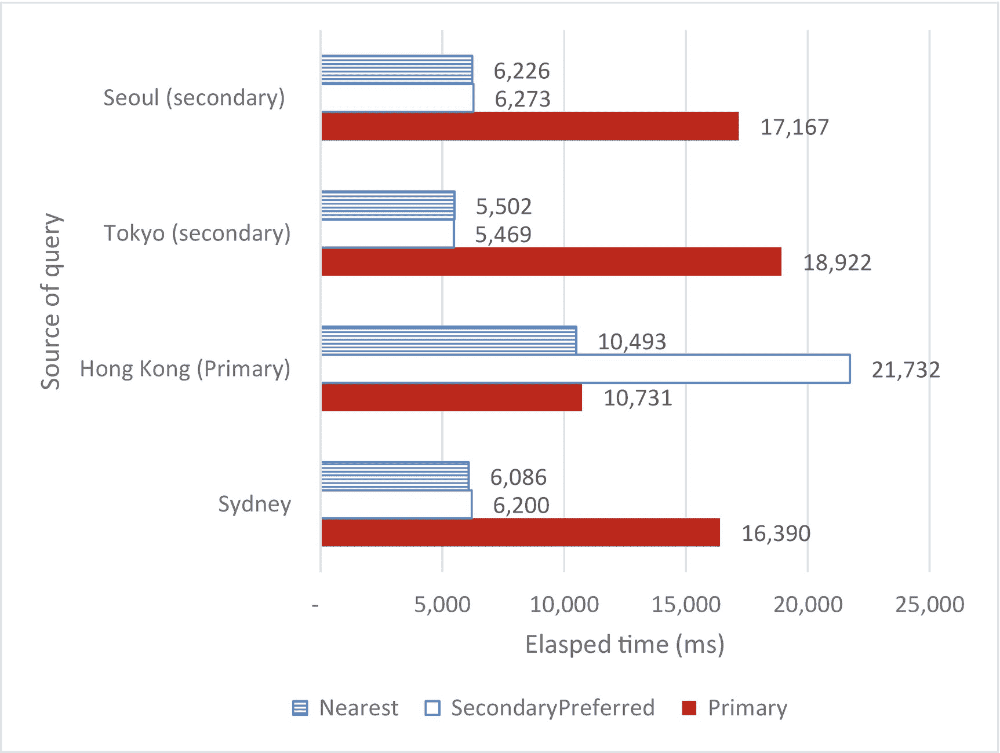
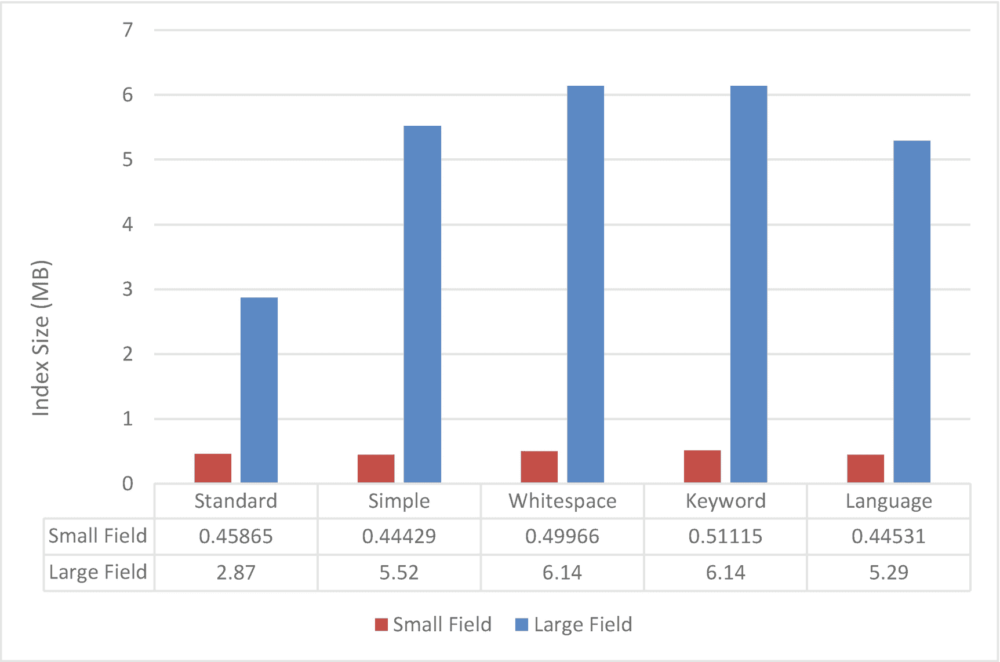
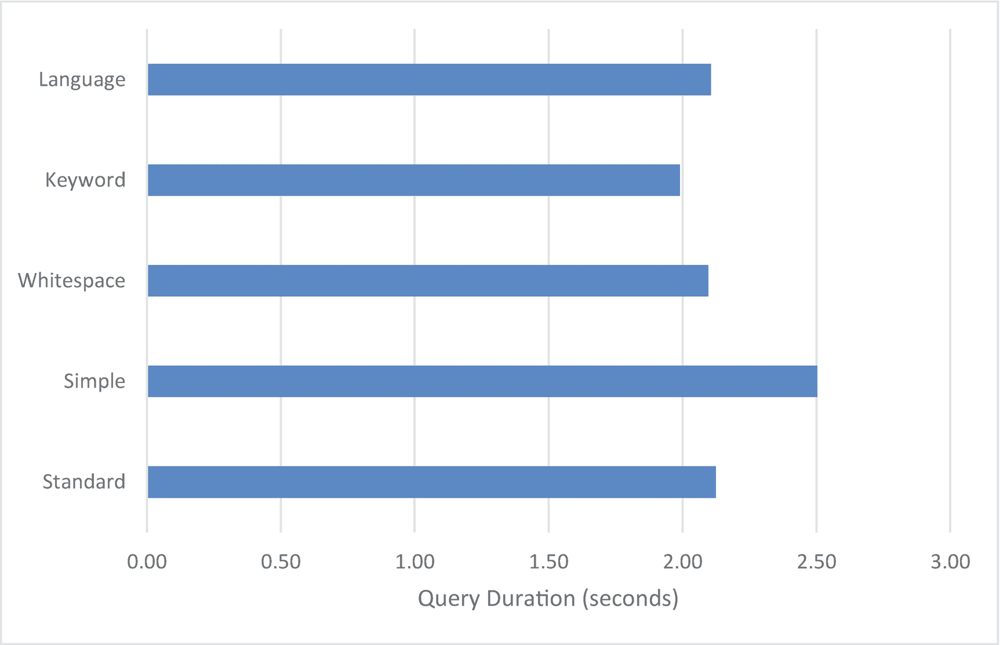
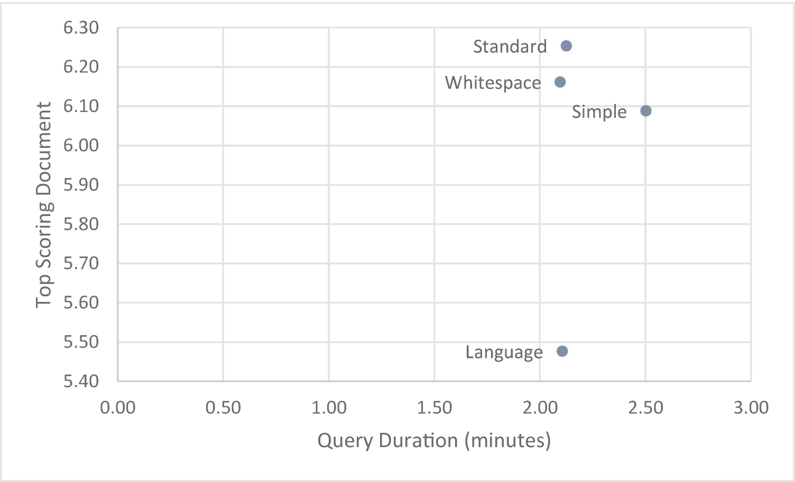

# 13.副本集和地图集

到目前为止，我们已经考虑了性能调优 singleton MongoDB 服务器——不属于集群的服务器。然而，大多数生产 MongoDB 实例都被配置为副本集，因为只有这种配置才能为现代的“永不停机”应用提供足够的高可用性保证。

在副本集配置中，我们在前面章节中介绍的所有优化原则都不会失效。然而，副本集给我们带来了一些额外的性能挑战和机遇，这将在本章中介绍。

MongoDB Atlas 为我们提供了一种创建云托管、完全托管的 MongoDB 集群的简单方法。除了提供便利和经济优势之外，MongoDB Atlas 还包含一些独特的功能，这些功能涉及到性能机遇和挑战。

## 副本集基础

我们在第 2 章中介绍了副本集。遵循最佳实践的副本集由一个*主节点*和两个或多个*次节点*组成。建议使用三个或更多节点，节点总数为奇数。主节点接受所有同步或异步传播到辅助节点的写请求。在主节点出现故障的情况下，会进行选举，选出一个辅助节点作为新的主节点，并且数据库操作可以继续。

在默认配置中，副本集的性能影响很小。所有读写操作都将定向到主节点，虽然主节点在向辅助节点传输数据时会产生少量开销，但这种开销并不严重。

但是，如果需要更高程度的容错，则要求在确认之前在一个或多个辅助节点上完成写入，可能会牺牲写入性能。这由 MongoDB *写关注点*参数控制。此外，MongoDB *读取偏好参数*可以配置为允许辅助节点服务读取请求，从而潜在地提高读取性能*。*

Note

为了清楚地说明读取偏好和写入关注的相对影响，我们使用了一个副本集，其中包含地理上分布广泛的节点——在香港、首尔和东京，应用工作负载来自悉尼。这种配置的延迟比典型配置要高得多，但允许我们更清楚地显示各种配置的相对效果。

## 使用阅读偏好设置

默认情况下，所有读取都定向到主节点。然而，我们可以设置一个*读取偏好*，它指示 MongoDB 驱动程序将读取请求指向辅助节点。从二级读取可能更好，原因有两个:

*   辅助节点可能没有主节点忙，因此能够更快地响应读取请求。

*   通过将读取定向到辅助节点，我们减少了主节点上的负载，可能会增加群集的写入吞吐量。

*   通过将读取请求分布到集群的所有节点，我们提高了整体读取吞吐量，因为我们利用了其他空闲的辅助节点。

*   我们可以通过将读取请求定向到离我们“更近”的辅助节点来减少网络延迟——就网络延迟而言。

这些优势需要与读取“陈旧”数据的可能性进行权衡。在默认配置中，只有主设备保证拥有所有信息的最新副本(尽管我们可以通过调整*写关注点*来改变这一点，如下一节所述)。如果我们从辅助节点读取，我们可能会得到过时的信息。

Warning

辅助读取可能会导致返回陈旧数据。如果这是不可接受的，要么配置写问题以防止过时读取，要么使用默认的`primary`读问题。

表 [13-1](#Tab1) 总结了各种读取偏好设置。

表 13-1

阅读偏好设置

<colgroup><col class="tcol1 align-left"> <col class="tcol2 align-left"></colgroup> 
| 

阅读偏好

 | 

影响

 |
| --- | --- |
| `primary` | 这是默认设置。所有读取都定向到主副本集。 |
| `primaryPreferred` | 直接读取到主节点，但是如果没有可用的主节点，则直接读取到辅助节点。 |
| `secondary` | 直接读取到辅助节点。 |
| `secondaryPreferred` | 直接读取到辅助节点，但如果没有辅助节点可用，则直接读取到主节点。 |
| `nearest` | 直接读取到副本集成员，与调用程序的网络往返时间最短。 |

如果您已经决定将读取路由到非主节点，建议设置为`secondaryPreferred`或`nearest`。`secondaryPreferred`通常比`secondary`好，因为如果没有辅助节点可用，它允许读操作回退到主节点。当有多个辅助节点可供选择，而其中一些“更远”(网络延迟更大)时，那么`nearest`会将请求路由到“最近”的节点——辅助节点或非辅助节点。

图 [13-1](#Fig1) 提供了一个读取偏好设置对从不同位置发出的查询的影响的例子。查询是从每个拥有一个复制集成员的节点(东京、香港和首尔)和悉尼的一个不属于复制集的远程节点发出的。除了在主服务器上直接发出查询之外，`secondaryPreferred`读取比`primary`读取更快。然而，`nearest`读取偏好总是会产生最佳的读取性能。



图 13-1

阅读偏好对阅读性能影响(阅读 411，000 个文档)

Tip

辅助读取通常比主读取快。`nearest`读取偏好可以帮助挑选具有最低网络延迟的副本集节点。

### 设置阅读偏好

可以在连接级别或语句级别设置读取首选项。

要在连接到 MongoDB 时设置它，可以将首选项添加到 MongoDB URI 中。这里，我们将 readPreference 设置为`secondary`:

```js
mongodb://n1,n2,n3/?replicaSet=rs1&readPreference=secondary

```

要为特定语句设置读取首选项，请在与每个命令关联的选项文档中包含读取首选项。例如，在这里，对于 NodeJS 中的 find 命令，我们将 read 首选项设置为`nearest`:

```js
const client = await mongo.MongoClient.connect(myMongoDBURI);
const collection=client.db('MongoDBTuningBook').
      collection('customers');
const options={'readPreference': mongo.ReadPreference.NEAREST};
await collection.find({}, options).forEach((customer) => {
    count++;
  });
});

```

请参阅 MongoDB 驱动程序文档，了解如何在编程语言中设置读取首选项。

### maxStalenessSeconds

`maxStalenessSeconds`可添加到读取首选项中，以控制数据的容许延迟。当选择一个辅助节点时，MongoDB 驱动程序将只考虑那些在主节点的`maxStalenessSeconds`秒内拥有数据的节点。最小值是 90 秒。

例如，此 URL 指定了辅助节点的首选项，但前提是它们的数据时间戳与主节点的数据时间戳相差不超过 5 分钟(300 秒):

```js
mongodb://n1,n2,n3/?replicaSet=rs1\
      &readPreference=secondary&maxStalenessSeconds=300

```

Tip

`maxStalenessSeconds`使用辅助阅读首选项时，可以保护您免受严重过时数据的影响。

### 标签集

标签集可用于微调阅读偏好。使用标记集，我们可以将查询指向特定的辅助节点或辅助节点集。例如，我们可以指定一个节点作为商业智能服务器，另一个节点用于 web 应用流量。

这里，我们将“位置”和“角色”标签应用于副本集中的三个节点:

```js
mongo> conf = rs.conf();

mongo> conf.members.forEach((m)=>{print(m.host);});
mongors01.eastasia.cloudapp.azure.com:27017
mongors02.japaneast.cloudapp.azure.com:27017
mongors03.koreacentral.cloudapp.azure.com:27017

mongo> conf.members[0].tags={"location":"HongKong","role": "prod" };
mongo> conf.members[1].tags={"location":"Tokyo","role":"BI" };
mongo> conf.members[2].tags={"location":"Korea","role": "prod" };

mongo> rs.reconfig(conf);
{
  "ok": 1,
   ...
}

```

我们现在可以在读取首选项字符串中使用任一标签:

```js
db.customers.
  find({ Phone: 40367898 }).
  readPref('secondaryPreferred', [{ role: 'prod' }]);

```

如果我们想设置一个特定的二级服务器作为只读服务器进行分析，标签集是一个完美的解决方案。

我们还可以使用标记集在服务器中的节点上平均分配工作负载。例如，考虑这样一个场景，我们并行地从三个集合中读取数据。使用默认读取首选项，所有读取都将定向到主节点。如果我们选择`secondaryPreferred`，那么我们可能会有更多的节点参与到工作中，但是仍然有可能所有的请求都指向同一个节点。然而，通过标记集，我们可以将每个查询指向不同的节点。

例如，这里我们将查询指向香港:

```js
db.getMongo().setReadPref('secondaryPreferred', [{
    "location": "HongKong"
}]);

db.iotData1.aggregate(pipeline, {
    allowDiskUse: true
});

```

对集合`iotData2`和`iotData3`的查询可以类似地指向韩国和日本。这不仅允许集群中的每个节点同时参与，还有助于提高缓存效率，因为每个节点负责一个特定的集合，所以该节点的所有缓存都可以专用于该集合。

图 [13-2](#Fig2) 显示了使用不同的读取偏好对不同的集合同时进行三次查询所用的时间。使用`secondaryPreferred`提高了性能，但是最好的性能是在使用标签集在所有节点上分配负载时实现的。


图 13-2

使用标记集在集群中的所有节点之间分配工作

Tip

标签集可用于将读取请求定向到特定节点。您可以使用标记集来指定用于特殊目的(如分析)的节点，或者在集群中的所有节点之间更均匀地分配读取工作负载。

## 写关注

*读取偏好*帮助 MongoDB 决定*哪个*服务器应该服务于读取请求。*写关注点*告诉 MongoDB *一个写请求中应该涉及多少个*服务器。

默认情况下，当更改进入主数据库的日志文件时，MongoDB 认为写请求完成。写关注允许你改变这个缺省值。写入问题有三种设置:

*   `w`控制在写入操作完成之前应该有多少节点接收写入。`w`可以设置为一个数字或设置为“`majority`”。

*   `j`控制写操作在完成前是否需要日志写。它被设置为`true`或`false`。

*   `wtimeout`指定在返回错误之前允许实现写问题的时间量。

### 日志

如果指定了`j:false`,那么如果 mongod 服务器接收到写操作，则认为写操作完成。如果指定了`j:true`，那么一旦写入到我们在第 [12 章](12.html)中讨论的*预写日志*，写入就被认为完成。

没有日志记录的运行被认为是鲁莽的，因为如果 mongod 服务器崩溃，它会导致数据丢失。然而，一些配置允许这样的数据丢失。例如，在`w:1,j:true`场景中，如果服务器死亡并故障转移到尚未收到写入的辅助服务器，数据可能会丢失。在这种情况下，设置`j:false`可能会增加吞吐量，而不会不可接受地增加数据丢失的机会。

### 写关注点`w`选项

`w`选项控制在写入操作完成之前群集中必须有多少节点接收写入。默认设置 1 要求只有主节点接收写入。较高的值要求写入传播到更多的节点。

`w:"majority"`设置要求大多数节点在写入完成前接收写入操作。对于数据丢失被视为不可接受的系统而言,`w:"majority"`是一个合理的默认值。如果大多数节点都有更新，那么在任何单节点故障或网络分区情况下，新选出的主节点都可以访问该数据。

当然，写入多个节点的影响会产生性能开销。您可能会想象您的数据被同时写入多个节点。但是，写入是对主节点进行的，然后才通过复制机制传播到其他节点。如果已经存在显著的复制延迟，那么延迟可能比预期的要高得多。即使复制延迟很小，复制也只能在初始写入成功后开始，因此性能延迟总是大于`w:1`。

图 [13-3](#Fig3) 显示了`{w:2,j:true}`写问题的事件顺序。只有在主节点收到写入并同步到日志后，才会通过复制传输到辅助节点。然后，写操作必须同步到辅助节点上的日志，写操作才能完成。这些操作按顺序进行，而不是并行进行。换句话说，复制延迟会添加到主写入延迟中，而不是同时发生。


图 13-3

`w:2, j:true`写问题的事件顺序

图 [13-4](#Fig4) 显示了插入 50，000 个具有不同写关注级别的文档所花费的时间。更高级别的写入问题会导致吞吐量显著降低。


图 13-4

写操作对写吞吐量的影响

您的写问题设置应该由容错问题决定，而不是由写性能决定。但是，重要的是要认识到，更高级别的写入问题可能会对性能产生重大影响。

Tip

更高级别的写入问题可能会导致写入吞吐量显著下降。但是，如果服务器出现故障，较低级别的写入问题可能会导致数据丢失。

正如我们所见，`w:0`提供了绝对最佳的性能。然而，即使数据没有到达 MongoDB 服务器，使用`w:0`的写操作也可以成功。即使短暂的网络故障也可能导致数据丢失。在几乎所有的情况下，`w:0`就是太不靠谱了。

Warning

`w:0`的写入问题可能会导致性能提升，但代价是完全不可靠的数据写入。

### 写入问题和二次读取

尽管更高级别的写操作会降低修改工作负载，但是如果应用的整体性能是以读操作为主的，那么可能会有一个令人愉快的副作用。如果写入问题被设置为写入集群的所有成员，那么辅助读取将*总是*返回正确的数据。这可能允许您使用二次读取，即使您不能容忍陈旧的查询。

但是，请注意，如果您手动设置群集中的节点数，群集中的任何故障都可能导致读取超时。

Warning

将`w`设置为集群中的节点数将导致辅助读取始终返回最新数据。但是，如果节点不可用，写操作可能会失败。

## 蒙戈布地图集

MongoDB Atlas 是 MongoDB 的完全托管的数据库即服务(DBaaS)产品。使用 Atlas，您可以从 web 界面创建和配置 MongoDB 副本集和分片集群，而无需配置自己的硬件或虚拟机。Atlas 负责大多数数据库操作考虑事项，包括备份、版本升级和性能监控。Atlas 也可以在三大公共云中使用:AWS、Azure 和 Google Cloud。

在部署 MongoDB 集群时，Atlas 通过在幕后处理大量脏活来提供很多便利。然而，除了操作优势之外，Atlas 还拥有其他部署类型所不具备的额外功能。这些特性包括高级分片和查询选项，这些选项在创建新集群时非常有吸引力。

尽管实施这些选项可能就像点击一个按钮一样简单，但重要的是要记住，它们也可能需要仔细的规划和设计才能发挥其全部潜力。在下文中，我们将详细介绍这些 Atlas 特性及其对性能的影响。

### 地图集搜索

Atlas Search (以前称为 Atlas 全文搜索)是建立在 *Apache Lucene* 基础上的一个功能，提供了更强大的文本搜索功能。尽管所有版本的 MongoDB 都支持文本索引(参见第 5 章)，但是 Apache Lucene 集成提供了更强大的文本搜索能力。

Apache Lucene 的优势是通过*分析器*提供的。简单地说，分析器将决定如何创建文本索引。您可以创建一个定制的分析器，但是 Atlas 提供的内置选项将覆盖大多数用例。

在索引创建过程中选择合适的分析器是改善 Atlas 搜索查询结果的最简单方法之一。

Note

当我们谈论提高文本搜索的性能时，我们并不总是指查询速度。一些分析器可以通过提供更相关的评分结果来提高查询的“性能”，但也可能导致查询速度变慢。

五个预构建的分析器包括

*   **标准**:所有单词转换成小写，忽略标点符号。此外，标准分析器可以正确解释特殊符号和首字母缩略词，并会丢弃“和”等连接词以提供更好的结果。标准分析器为每个“单词”创建索引条目，是最常用的索引类型。

*   **Simple** :正如您可能猜到的，Simple 分析器类似于标准分析器，但是在确定每个索引条目的“单词”时，它的逻辑不太先进。所有单词都转换成小写。一个简单的分析器将通过在任何两个不是字母的字符之间找到一个单词来创建一个条目。与标准分析器不同，简单分析器不处理连接词。

*   空白符:如果简单分析器是标准分析器的简化版本，空白符分析器会更进一步。单词不会被转换为小写，并且条目是为由空白字符分隔的任何字符串创建的，不需要额外处理标点符号或特殊字符。

*   **Keyword** :关键字分析器将字段的整个值作为单个条目，需要精确匹配才能在查询中返回结果。这是所提供的最具体的分析器。

*   语言:语言分析器是 Lucene 特别强大的地方，因为它为你可能遇到的每种语言提供了一系列预置。每个预设将基于以该语言编写的文本的典型结构创建索引条目。

在创建 Atlas 搜索索引时，没有单一的最佳分析器可供选择，做出选择也不仅仅是关于查询速度。您必须考虑数据的形状和用户可能发送的查询类型。

让我们看一个基于房产租赁市场数据集的例子。在这个数据集中，大量的文本数据以不同的属性存在。名称、地址、描述和属性元数据都作为字符串存储在每个列表中，还有评论和评论。

根据哪个分析器最适合匹配的查询，这些属性中的每一个都最适合不同类型的搜索索引。描述和注释最好由解释特定语言语义的语言索引来提供。像“房子”或“公寓”这样的属性类型最匹配关键字分析器，因为我们想要精确的匹配。其他字段可能被标准分析器正确索引，或者根本不需要索引。

选择分析器时要考虑的另一个因素是创建的索引的大小。图 [13-5](#Fig5) 是每个分析器在小文本字段(属性名称)和大文本字段(属性描述)上的索引大小的比较。



图 13-5

按分析器和字段长度的索引大小(5555 个文档)

尽管这些结果会因文本数据本身的不同而有很大差异，但该图表主要表明了两件事。

首先，文本字段越小，索引大小的变化就越小，甚至没有变化(因此扫描索引所需的时间也就越少)。这是有意义的，因为较少数量的单词或字符可以被细分成较少数量的方式，并且不太可能需要复杂的规则来创建索引。

其次，对于更大、更复杂的文本数据，不同分析器类型的索引大小会有很大的不同。有时，较大的索引是一件好事，可以提供更好的结果和性能。然而，在创建 Atlas 搜索索引时，这仍然是值得考虑的事情。

现在我们知道了不同的分析器类型如何影响索引大小，但是查询时间呢？图 [13-6](#Fig6) 显示了针对五种不同索引分析器类型执行的相同查询的执行时间。



图 13-6

按索引分析器类型划分的查询持续时间(5555 个文档，1000 个查询)

如果我们只看这些数据，我们会假设关键字分析器将为我们的查询提供最佳性能。然而，对于任何文本搜索，我们也需要考虑我们的结果评分。

例如，考虑以下查询:

```js
db.listingsAndReviews.aggregate([
      {
        $search: {
          text: {
            query: ["oven", "microwave", "air conditioning"],
            path: "notes",
          },
        },
      },
      {$limit: 3,},
      {$project: {
          name: 1,
          score: { $meta: "searchScore" },},
      },
    ]);

```

表 [13-2](#Tab2) 显示了我们针对每种指标类型的得分最高的文档。

表 13-2

不同分析仪类型的性能

<colgroup><col class="tcol1 align-left"> <col class="tcol2 align-left"> <col class="tcol3 align-left"> <col class="tcol4 align-left"></colgroup> 
| 

分析者

 | 

查询时间(分钟)

 | 

得分

 | 

文件

 |
| --- | --- | --- | --- |
| 标准 | Two point one three | Six point two five | studio 1q LeBron，促销... |
| 简单的 | Two point five | Six point zero nine | 1q LeBron 工作室，推广自-我...。 |
| 空白 | Two point one | Six point one six | 树蕨园附件，… |
| 关键字 | One point nine nine |   |   |
| 语言 | Two point one one | Five point four eight | 1q LeBron 工作室，推广自-我...。 |

您可能注意到的第一件事是，关键字分析器没有为我们的查询返回任何文档(因此得分为 0)，尽管查询时间最短。这是意料之中的，因为关键字索引要求与字段的整个值完全匹配。所以虽然很快，但不一定能返回最好的结果。

您可能还注意到，对于我们剩余的分析器，只有空白索引返回了不同的结果。其他类型的人找到了同样的文件，但是他们的可信度不同。图 [13-7](#Fig7) 显示了这些结果的散点图。



图 13-7

查询持续时间、文档得分和按分析器的文档(5555 个文档，1000 个查询)

这些结果大致对应于我们创建的索引大小，索引越大，返回结果的时间就越长。有趣的是，尽管标准分析器不是最快的，但它确实提供了高可信度结果的最佳组合，只不过查询时间多了一点点。您可能期望特定于语言的分析器比标准分析器执行得更好。在这种情况下，在索引字段和许多其他字段中都有多种语言。当涉及到用户输入时，很难保证有一种统一的语言。

您可以在数据集上重复这一分析，尝试为地图集搜索找到合适的分析器。在创建图集搜索索引时，考虑数据类型以及查询类型是必不可少的。虽然没有永远正确或永远错误的答案，但标准分析仪很可能为您提供良好的整体性能。但是，要注意不同的分析器可以返回不同的结果，如果返回错误的结果，那么提高查询速度通常不是好的做法。

Tip

各种 Atlas Search 文本搜索分析器具有不同的性能特征。然而，最快的分析器可能不会为您的应用返回最佳结果。确保在结果的准确性和文本搜索的速度之间取得平衡。

### 阿特拉斯数据湖

随着大数据和 Hadoop 等技术的兴起，“数据湖”作为大量结构化或非结构化数据的集中存储库的概念变得流行起来。从那时起，它已经成为许多企业环境中的标准配置。MongoDB 引入了 *Atlas 数据湖*作为与该模式集成的方法。简而言之，Atlas 数据湖允许您使用 Mongo 查询语言从亚马逊 S3 存储桶中查询数据。

Atlas Data Lake 是一个强大的工具，可以将您的 MongoDB 系统扩展到外部、非 BSON 数据，虽然它具有普通 MongoDB 数据库的外观，但是在查询 Data Lake 时需要考虑一些事项。

数据湖的第一个方面可能会让您止步不前，那就是缺少索引。Data Lake 中没有索引，所以默认情况下，您的许多查询将通过对所有文件的完整扫描来解决。

但是，有一种方法可以绕过这个限制。通过创建名称反映关键属性值的文件，我们可以将文件访问限制为仅相关文件。

例如，假设您的数据湖设置为每个集合一个文件。一个单独的`customers.json`文件包含您的所有客户，它被映射到`customers`集合，如下例所示:

```js
    databases: {
      dataLakeTest: {
        customers: [
          {
            definition: '/customers.json',
            store: 's3store'
          }
        ],
      }
    }

```

我们无法索引这些文件；然而，我们可以用多个文件来定义集合，每个客户一个文件，其中文件名是`customerId`(我们想要索引的字段):

```js
        customers: [
          {
            definition: '/customers/{customerId string}',
            store: 's3store'
          }
        ],

```

我们的新集合现在由/customers 文件夹中所有文件的联合来定义。`customers`文件夹中的每个文件将以`customerid`值命名；例如，文件`/customers/1234.json`将包含所有带有`1234`的`customerId`的数据。数据湖现在只需要扫描查询中涉及的客户 id 的文件，而不是目录中的所有文件。通过查看解释计划，您可以看到这一点:

```js
> db.customersNew.find({customerId:"1234"}).explain("queryPlanner")

{
    "ok": 1,
    "plan": {
        "kind": "mapReduce",
        "map": [{
            "$match": {
                "customerId": {
                    "$eq": "1234"
                }
            }
        }],
        "node": {
            "kind": "data",
            "partitions": [{
                "source": "s3://datalake02/customers/1234?delimiter=/&region=ap-southeast-2",
                "attributes": {
                    "customerId": "1234"
                }
            }]
        }
    }
}

```

我们可以看到只有一个文件(分区)和匹配分区的名称被访问。

Tip

我们可以通过创建其内容和文件名对应于特定键值的文件来避免扫描 Atlas 数据湖中的所有文件。

缺少索引会导致问题的另一个领域是在`$lookup`的情况下。正如我们在第 [7](07.html) 章中讨论的，当用`$lookup`优化连接时，索引是绝对必要的。

如果我们在一个 Atlas 数据湖中的两个集合之间进行连接，我们肯定希望确保在`$lookup`部分中引用的集合是基于连接条件进行分区的。我们可以在图 [13-8](#Fig8) 中看到这是如何提高`$lookup`性能的。


图 13-8

`$lookup`数据湖中文件结构的性能(5555 个文档)

此外，这种方法更具可扩展性。使用针对单个文件的`$lookup`，必须为我们加入的每个客户重复扫描该文件。然而，由于每个客户有单独的文件，所以每个`$lookup`操作读取的文件要小得多。对于单个大型文件，随着文档被添加到文件中，性能会急剧下降，而对于多个文件，性能会更线性地增长。

将数据分割成多个文件有一些缺点。如您所料，当扫描整个集合时，打开每个文件会有开销。例如，对一个集合中的所有文档进行计数的简单聚合在单个文件上几乎可以立即完成，但是当每个文档都存在于其文件中时，就要花费长得多的时间。打开每个文件的开销决定了查询的性能。我们可以在图 [13-9](#Fig9) 中看到这一点。


图 13-9

数据湖中按文件结构分类的完整收集查询持续时间(254，058 个文档)

总之，虽然不能直接在 Data Lake 中索引文件，但是可以通过操作文件名来弥补一些性能损失。文件名可以成为一种高级索引，这在使用`$lookup`时特别有用。但是，如果您总是访问完整的数据集，那么对单个文件的扫描性能将是最佳的。

## 摘要

大多数 MongoDB 产品实现都包含副本集，以提供高可用性和容错能力。副本集并不是为了解决性能问题，但是它们肯定会影响性能。

在副本集中，*读取偏好*可以被设置为允许从辅助节点读取。辅助读取可以在集群中的更多节点上分配工作，减少地理上分散的集群中的网络延迟，并允许并行处理工作负载。然而，二次读取可能会返回过时的结果，这并不总是可以接受的。

副本集*写关注点*控制在可以确认写之前必须有多少节点确认写。更高级别的写操作为数据提供了更大的保证，但却是以牺牲性能为代价的。

MongoDB Atlas 至少增加了两个对性能有影响的重要特性。Atlas 文本搜索允许更复杂的全文索引，而 Atlas 数据湖允许对低成本云存储上的数据进行查询。