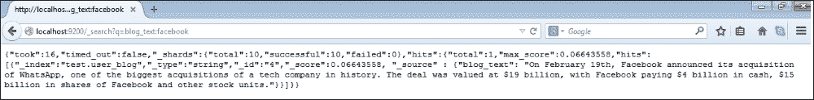

# 第五章高级操作

在本章中，我们将介绍以下配方：

*   原子查找和修改操作
*   在 Mongo 中实现原子计数器
*   实现服务器端脚本
*   在 MongoDB 中创建和跟踪有上限的集合游标
*   将普通集合转换为上限集合
*   在 Mongo 中存储二进制数据
*   使用 GridFS 在 Mongo 中存储大型数据
*   从 Java 客户端将数据存储到 GridFS
*   从 Python 客户端将数据存储到 GridFS
*   使用 oplog 在 Mongo 中实现触发器
*   使用地理空间索引在 Mongo 中进行平面（2D）地理空间查询
*   Mongo 中的球形索引和 GeoJSON 兼容数据
*   在 Mongo 中实现全文搜索
*   集成 MongoDB 进行全文搜索和 Elasticsearch

# 导言

在[第 2 章](02.html "Chapter 2. Command-line Operations and Indexes")、*命令行操作和索引*中，我们看到了如何执行从 shell 到查询、更新和插入文档的基本操作，还看到了不同类型的索引和索引创建。在本章中，我们将看到 Mongo 的一些高级功能，如 GridFS、地理空间索引和全文搜索。我们将看到的其他方法包括介绍和使用 capped 集合，以及在 MongoDB 中实现服务器端脚本。

# 原子查找和修改操作

在[第 2 章](02.html "Chapter 2. Command-line Operations and Indexes")*命令行操作和索引*中，我们有一些方法解释了我们在 MongoDB 中执行的各种 CRUD 操作。有一个概念我们没有涉及，它是原子地查找和修改文档。修改包括更新和删除操作。在本食谱中，我们将介绍 MongoDB`findAndModify`操作的基础知识。在下一个配方中，我们将使用此方法实现计数器。

## 准备好了吗

查看[第一章](01.html "Chapter 1. Installing and Starting the Server")中*安装单节点 MongoDB*的配方*安装启动服务器*并启动 MongoDB 的单实例。这是这个食谱的唯一先决条件。启动 mongo shell 并连接到已启动的服务器。

## 怎么做…

1.  我们将测试`atomicOperationsTest`集合中的文档。从 shell 执行以下操作：

    ```js
    > db.atomicOperationsTest.drop()
    > db.atomicOperationsTest.insert({i:1})

    ```

2.  从 mongo shell 执行以下操作并观察输出：

    ```js
    > db.atomicOperationsTest.findAndModify({
     query: {i: 1},
     update: {$set : {text : 'Test String'}},
     new: false
     }
    )

    ```

3.  这次我们将执行另一个，但参数略有不同；观察此操作的输出：

    ```js
    > db.atomicOperationsTest.findAndModify({
     query: {i: 1},
     update: {$set : {text : 'Updated String'}}, fields: {i: 1, text :1, _id:0},
     new: true
     }
    )

    ```

4.  这次我们将执行另一个更新，该更新将按如下方式插入文档：

    ```js
    >db.atomicOperationsTest.findAndModify({
     query: {i: 2},
     update: {$set : {text : 'Test String'}},
     fields: {i: 1, text :1, _id:0},
     upsert: true,
     new: true
     }
    )

    ```

5.  现在，按如下方式查询一次收款并查看当前单据：

    ```js
    > db.atomicOperationsTest.find().pretty()

    ```

6.  我们将最终执行如下删除：

    ```js
    >db.atomicOperationsTest.findAndModify({
     query: {i: 2},
     remove: true,
     fields: {i: 1, text :1, _id:0},
     new: false
     }
    )

    ```

## 它是如何工作的…

如果我们独立地执行查找和更新操作，首先查找文档，然后在 MongoDB 中更新文档，那么结果可能不会如预期的那样。查找和更新操作之间可能存在交错更新，这可能已更改文档状态。在某些特定的用例中，如实现原子计数器，这是不可接受的，因此我们需要一种方法以原子方式查找、更新和返回文档。返回的值要么是应用更新之前的值，要么是应用更新之后的值，由调用客户端决定。

现在我们已经执行了上一节中的步骤，让我们看看我们实际做了什么，以及 JSON 文档中所有这些字段作为参数传递给`findAndModify`操作意味着什么。从步骤 3 开始，我们将文档作为参数提供给包含字段`query`、`update`和`new`的`findAndModify`函数。

`query`字段指定用于查找文档的搜索参数，`update`字段包含需要应用的修改。第三个字段为 new，如果设置为`true`，则通知 MongoDB 返回更新后的文档。

在步骤 4 中，我们实际上向作为名为**字段**的参数传递的文档添加了一个新字段，用于从返回的结果文档中选择一组有限的字段。另外，字段 new 的值是`true`，这表示我们想要更新的文档，即执行更新操作后的文档，而不是之前的文档。

在第 5 步中，包含一个名为`upsert`的新字段，该字段向上插入（更新+插入）文档。也就是说，如果找到具有给定查询的文档，则会更新该文档，否则会创建并更新一个新文档。如果文档不存在且发生了 upsert，则将参数`new`的值设置为`false`将返回`null`。这是因为在执行更新操作之前不存在任何内容。

最后，在步骤 7 中，我们使用了值为`true`的`remove`字段来代替`update`字段，该值指示要删除文档。另外，新字段的值为`false`，这意味着我们期望删除的文档。

## 另见

原子`FindandModify`操作的一个有趣用例是在 Mongo 中开发一个原子计数器。在我们的下一个食谱中，我们将看到如何实现这个用例。

# 在 Mongo 中实现原子计数器

原子计数器是大量用例的必要条件。Mongo 没有用于原子计数器的内置功能；然而，它可以很容易地实现使用它的一些很酷的产品。事实上，在前面描述的`findAndModify()`命令的帮助下，实现非常简单。参考前面的配方*原子查找和修改操作*，了解 Mongo 中的原子查找和修改操作是什么。

## 准备好了吗

查看[第一章](01.html "Chapter 1. Installing and Starting the Server")中*安装单节点 MongoDB*的配方*安装启动服务器*并启动 Mongo 的单实例。这是这个食谱的唯一先决条件。启动 mongo shell 并连接到已启动的服务器。

## 怎么做…

1.  从 mongo shell 执行以下代码：

    ```js
    > function getNextSequence(counterId) {
     return db.counters.findAndModify(
     {
     query: {_id : counterId},
     update: {$inc : {count : 1}},
     upsert: true,
     fields:{count:1, _id:0},
     new: true
     }
     ).count
    }

    ```

2.  现在从 shell 调用以下命令：

    ```js
    > getNextSequence('Posts Counter')
    > getNextSequence('Posts Counter')
    > getNextSequence('Profile Counter')

    ```

## 它是如何工作的…

该函数是简单的，就像对用于存储所有计数器的集合进行`findAndModify`操作一样。计数器标识符是存储文档的`_id`字段，计数器值存储在`count`字段。传递给`findAndModify`操作的文档接受该查询，该查询唯一标识存储当前计数的文档—使用`_id`字段进行查询。更新操作是一个`$inc`操作，将`count`字段的值增加 1。但是如果文档不存在呢？这将在第一次调用计数器时发生。为了处理这个场景，我们将`upsert`标志设置为`true`。`count`的值将始终以 1 开头，它不可能接受任何用户定义的序列起始编号或自定义增量步骤。为了满足这些要求，我们必须向 counters 集合中专门添加一个具有初始化值的文档。最后，我们对值递增后计数器的状态感兴趣；因此，我们将字段`new`的值设置为`true`。

在三次调用此方法时（正如我们所做的），我们应该在集合计数器中看到以下内容。只需执行以下查询：

```js
>db.counters.find()
{ "_id" : "Posts Counter", "count" : 2 }
{ "_id" : "Profile Counter", "count" : 1 }

```

使用这个小函数，我们现在已经在 Mongo 中实现了原子计数器。

## 另见

我们可以将这些通用代码存储在 Mongo 服务器上，以便在其他函数中执行。查看实现*服务器端脚本*的配方*，了解如何在 Mongo 服务器上存储 JavaScript 函数。这甚至允许我们从其他编程语言客户端调用此函数。*

# 实现服务器端脚本

在这个配方中，我们将看到如何编写服务器存储的 JavaScript，类似于关系数据库中的存储过程。这是一个常见的用例，其他代码段需要访问这些通用函数，我们将它们放在一个中心位置。为了演示服务器端脚本，该函数只需添加两个数字。

这个食谱分为两部分。首先，我们将看到如何从客户端 JavaScript shell 上的集合加载脚本，其次，我们将看到如何在服务器上执行这些函数。

### 注

文档特别提到不建议使用服务器端脚本。安全性是一个问题，但是如果数据没有被正确审计，那么我们需要小心定义什么函数。由于 Mongo 2.4，服务器端 JavaScript 引擎是 V8，它可以并行执行多个线程，而 Mongo 2.4 之前的引擎一次只执行一个线程。

## 准备好了吗

查看[第一章](01.html "Chapter 1. Installing and Starting the Server")中*安装单节点 MongoDB*的配方*安装启动服务器*并启动 Mongo 的单实例。这是这个食谱的唯一先决条件。启动 mongo shell 并连接到已启动的服务器。

## 怎么做…

1.  创建一个名为`add`的新函数，并将其保存到集合`db.system.js`，如下所示。应测试当前数据库：

    ```js
    > use test
    > db.system.js.save({ _id : 'add', value : function(num1, num2) {return num1 + num2}})

    ```

2.  既然定义了此函数，请按如下方式加载所有函数：

    ```js
    > db.loadServerScripts()

    ```

3.  现在，调用`add`并查看它是否有效：

    ```js
    > add(1, 2)

    ```

4.  我们现在将使用这个函数，并在服务器端执行它：从 shell 执行以下命令：

    ```js
    > use test
    > db.eval('return add(1, 2)')

    ```

5.  执行以下步骤（您可以执行前面的命令）：

    ```js
    > use test1
    > db.eval('return add(1, 2)')

    ```

## 它是如何工作的…

集合`system.js`是一个特殊的 MongoDB 集合，用于存储 JavaScript 代码。我们使用此集合中的`save`函数添加了一个新的服务器端 JavaScript。`save`函数只是一个方便的函数，如果文档不存在，则插入文档或更新现有文档。目标是向该集合添加新文档，您甚至可以使用`insert`或`upsert`添加该文档。

秘密在于方法`loadServerScripts`。我们来看看这个方法的代码：`this.system.js.find().forEach(function(u){eval(u._id + " = " + u.value);});`

它使用`eval`函数对 JavaScript 进行求值，并将文档`value`属性中定义的函数分配给一个变量，该变量名为集合`system.js`中存在的每个文档的文档`_id`字段中给出的名称。

例如，如果集合`system.js``{ _id : 'add', value : function(num1, num2) {return num1 + num2}}`中存在以下文档，则文档的`value`字段中给出的函数将被分配给当前 shell 中名为`add`的变量。文档的`_id`字段中给出了值`add`。

这些脚本实际上不会在服务器上执行，但它们的定义存储在服务器上的集合中。JavaScript 方法`loadServerScripts`只是实例化当前 shell 中的一些变量，并使这些函数可供调用。执行这些函数的是 shell 的 JavaScript 解释器，而不是服务器。集合`system.js`在数据库范围内定义。一旦加载，这些函数将充当 shell 中定义的 JavaScript 函数，因此这些函数在整个 shell 范围内都可用，而与当前活动的数据库无关。

就安全性而言，如果 shell 连接到启用了安全性的服务器，那么调用`loadServerScripts`的用户必须具有读取数据库中集合的权限。有关启用安全性和用户可以拥有的各种角色的更多详细信息，请参阅[第 4 章](04.html "Chapter 4. Administration")、*管理*中的*在 Mongo*中设置用户。如前所述，函数`loadServerScripts`从集合`system.js`读取数据，如果用户没有从集合读取数据的权限，函数调用将失败。除此之外，加载后从 shell 执行的函数应该具有适当的权限。例如，如果函数在任何集合中插入/更新，则用户应具有从该函数访问的特定集合的读写权限。

在服务器上执行脚本可能是服务器端脚本，而不是在连接的 shell 中执行。在这种情况下，将在服务器的 JavaScript 引擎上对函数进行评估，安全检查将更加严格，因为长时间运行的函数可能会持有锁，从而对性能产生不利影响。在服务器端调用 JavaScript 代码执行的包装器是`db.eval`函数，该函数接受要在服务器端计算的代码以及参数（如果有）。

在评估函数之前，写操作采用全局锁；如果使用参数`nolock`，则可以跳过此操作。例如，可以按如下方式调用前面的`add`函数，而不是调用`db.eval`并获得相同的结果。我们还提供了`nolock`字段，指示服务器在评估功能之前不要获取全局锁。如果此函数对集合执行写入操作，则忽略`nolock`字段。

```js
> db.runCommand({eval: function (num1, num2) {return num1 + num2}, args:[1, 2],nolock:true})

```

如果服务器上启用了安全性，则调用用户需要具有以下四个角色：`userAdminAnyDatabase`、`dbAdminAnyDatabase`、`readWriteAnyDatabase`和`clusterAdmin`（在管理数据库上）才能成功调用`db.eval`功能。

编程语言确实提供了一种使用`eval`函数调用此类服务器端脚本的方法。例如，在 JavaAPI 中，`com.mongodb.DB`类有`eval`方法来调用服务器端 JavaScript 代码。当我们希望避免不必要的数据网络流量并将结果发送给客户端时，这种服务器端执行非常有用。然而，数据库服务器上太多的逻辑会很快使维护变得困难，并严重影响服务器的性能。

### 注

从 MongoDB 3.0.3 开始，`db.eval()`方法被弃用，建议用户不要依赖此方法，而是使用客户端脚本。参见[https://jira.mongodb.org/browse/SERVER-17453](https://jira.mongodb.org/browse/SERVER-17453) 了解更多详情。

# 在 MongoDB 中创建并跟踪有上限的集合游标

Capped 集合是固定大小的集合，其中文档添加到集合的末尾，类似于队列。由于封顶集合具有固定大小，如果达到限制，则会删除旧文档。

它们是按插入顺序进行自然排序的，并且可以使用`$natural`排序顺序对它们进行按时间排序所需的任何检索。这使得文档检索非常快。

下图给出了一个封顶集合的图示，该集合的大小足以容纳三个大小相同的文档（对于任何实际用途来说，该集合太小，但便于理解）。如图所示，集合类似于一个循环队列，如果集合已满，最旧的文档将被新添加的文档替换。可裁剪游标是跟踪集合的特殊类型的游标，类似于 Unix 中的 tail 命令。这些游标类似于普通游标在集合中进行迭代，但如果数据不可用，则会另外等待数据在集合中可用。我们将在本配方中详细介绍封顶系列和可定制游标。


## 准备好了吗

查看[第一章](01.html "Chapter 1. Installing and Starting the Server")中的*安装单节点 MongoDB*配方*安装启动服务器*并启动 Mongo 的单实例。这是这个食谱的唯一先决条件。启动 MongoDB shell 并连接到已启动的服务器。

## 怎么做…

这个配方有两个部分：在第一部分中，我们将创建一个名为`testCapped`的封顶集合，并尝试对其执行一些基本操作。接下来，我们将在此封顶集合上创建一个可裁剪光标。

1.  如果已存在具有此名称的集合，请删除该集合。

    ```js
    > db.testCapped.drop()

    ```

2.  现在创建一个 capped 集合，如下所示。注意：此处给出的大小是为集合分配的字节大小，而不是它包含的文档数：

    ```js
    > db.createCollection('testCapped', {capped : true, size:100})

    ```

3.  我们现在将在封顶集合中插入 100 份文件，如下所示：

    ```js
    > for(i = 1; i < 100; i++) {
    db.testCapped.insert({'i':i, val:'Test capped'})
     }

    ```

4.  现在查询集合如下：

    ```js
    > db.testCapped.find()

    ```

5.  尝试按如下方式从集合中删除数据：

    ```js
    > db.testCapped.remove()

    ```

6.  现在我们将创建并演示一个可裁剪光标。建议您将以下代码键入/复制到文本编辑器中，并使其便于执行。
7.  要在集合中插入数据，我们将使用以下代码片段。在 shell 中执行这段代码：

    ```js
    > for(i = 101 ; i < 500 ; i++) {
     sleep(1000)
     db.testCapped.insert({'i': i, val :'Test Capped'})
    }

    ```

8.  为了跟踪一个有上限的集合，我们使用以下代码：

    ```js
    > var cursor = db.testCapped.find().addOption(DBQuery.Option.tailable).addOption(DBQuery.Option.awaitData)
    while(cursor.hasNext()) {
     var next = cursor.next()
     print('i: ' + next.i + ', value: ' + next.val)
    }

    ```

9.  打开一个外壳，连接到正在运行的mongod 流程。这将是第二个打开并连接到服务器的 shell。在这个 shell 中复制并粘贴步骤 8 中提到的代码并执行它。
10.  观察插入的记录在插入到 capped 集合时的显示方式。

## 它是如何工作的…

我们将使用`createCollection`函数显式创建一个 capped 集合。这是创建封顶集合的唯一方法。`createCollection`功能有两个参数。第一个是集合的名称，第二个是 JSON 文档，其中包含两个字段`capped`和`size`，分别用于通知用户集合是否有上限以及集合的大小（以字节为单位）。可以提供一个附加字段`max`来指定集合中的最大文档数。即使指定了`max`字段，也需要字段大小。然后我们插入并查询文档。当我们试图从集合中删除文档时，会看到一个错误，即不允许从 capped 集合中删除文档。它只允许在添加新文档并且没有空间容纳它们时删除文档。

我们接下来看到的是我们创建的可裁剪光标。我们启动两个 shell，其中一个是正常插入文档，后续插入之间的间隔为 1 秒。在第二个 shell 中，我们创建一个游标并遍历它，然后将从游标获取的文档打印到 shell 上。不过，我们添加到光标的附加选项会产生不同。增加了两个选项，`DBQuery.Option.tailable`和`DBQuery.Option.awaitData`。这些选项用于指示光标是可裁剪的，而不是正常的，其中标记了最后一个位置，我们可以从停止的位置继续，其次，当没有数据可用时以及当我们分别到达光标末端时，等待更多数据一段时间，而不是立即返回。`awaitData`选项只能与可裁剪光标一起使用。这两个选项的组合给我们的感觉类似于 Unix 文件系统中的 tail 命令。

有关可用选项的列表，请访问以下页面：[http://docs.mongodb.org/manual/reference/method/cursor.addOption/](http://docs.mongodb.org/manual/reference/method/cursor.addOption/) 。

## 还有更多…

在下一个配方中，我们将看到如何将普通集合转换为封顶集合。

# 将正常集合转换为上限集合

此配方将演示将普通集合转换为上限集合的过程。

## 准备好了吗

查看[第一章](01.html "Chapter 1. Installing and Starting the Server")中*安装单节点 MongoDB*的配方*安装启动服务器*并启动 Mongo 的单实例。这是这个食谱的唯一先决条件。启动mongo shell 并连接到已启动的服务器。

## 怎么做…

1.  执行以下操作以确保您在`test`数据库中：

    ```js
    > use test

    ```

2.  创建一个普通集合，如下所示。我们将向其中添加 100 个文档，将以下代码段键入/复制到 mongo shell 并执行它。命令如下：

    ```js
    for(i = 1 ; i <= 100 ; i++) {
     db.normalCollection.insert({'i': i, val :'Some Text Content'})
    }

    ```

3.  按如下方式查询集合，确认集合中包含数据：

    ```js
    > db.normalCollection.find()

    ```

4.  现在，按如下方式查询集合`system.namespaces`并记录结果文档：

    ```js
    > db.system.namespaces.find({name : 'test.normalCollection'})

    ```

5.  执行以下命令将集合转换为上限集合：

    ```js
    > db.runCommand({convertToCapped : 'normalCollection', size : 100})

    ```

6.  查询集合查看数据：

    ```js
    > db.normalCollection.find()

    ```

7.  如下查询收款`system.namespaces`并记录结果单据：

    ```js
    > db.system.namespaces.find({name : 'test.normalCollection'})

    ```

## 它是如何工作的…

我们创建了一个包含 100 个文档的普通集合，然后尝试将其转换为大小为 100 字节的封顶集合。该命令将以下 JSON 文档传递给`runCommand`函数`{convertToCapped : <name of normal collection>, size: <size in bytes of the capped collection>}`。此命令创建具有所述大小的封顶集合，并以自然的顺序将文档从正常集合加载到目标封顶集合。如果封顶集合的大小达到上述限制，旧文档将在 FIFO 订单中删除，为新文档留出空间。完成此操作后，将重命名创建的 capped 集合。对 capped 集合执行查找可确认，正常集合中最初存在的 100 个文档并非全部存在于 capped 集合中。在执行`convertToCapped`命令前后对`system.namespaces`集合的查询显示`collection`属性的变化。请注意，此操作获取一个全局写锁，阻止此数据库中的所有读写操作。此外，在转换时，原始集合上存在的任何索引都不会为 capped 集合创建。

## 还有更多…

Oplog 是 MongoDB 中用于复制的一个重要集合，是一个有上限的集合。有关复制和 oplogs 的更多信息，请参考[第 4 章](04.html "Chapter 4. Administration")、*给药*中的配方*理解和分析 oplogs*。在本章后面的一个配方中，我们将使用这个 oplog 实现一个类似于关系数据库的插入/更新/删除触发器之后的特性。

# 在 Mongo 中存储二进制数据

到目前为止，我们了解了如何在文档中存储文本值、日期和数字字段。二进制内容有时也需要存储在数据库中。考虑用户需要在数据库中存储文件的情况。在关系数据库中，BLOB 数据类型最常用于满足此需求。MongoDB 还支持将二进制内容存储在集合中的文档中。需要注意的是，文档的总大小不应超过 16MB，这是撰写本书时文档大小的上限。在这个配方中，我们将把一个小的图像文件存储到 Mongo 的文档中，并在以后检索它。如果您希望存储在 MongoDB 集合中的内容大于 16MB，则 MongoDB 提供了一种开箱即用的解决方案，称为**GridFS**。我们将在本章后面的另一个菜谱中看到如何使用 GridFS。

## 准备好了吗

查看[第一章](01.html "Chapter 1. Installing and Starting the Server")中*安装单节点 MongoDB*的配方*安装启动服务器*并启动 MongoDB 的单实例。此外，将二进制内容写入文档的程序也是用 Java 编写的。参考[第 3 章](03.html "Chapter 3. Programming Language Drivers")*编程语言驱动程序*中的*使用 Java 客户端*执行查询和插入操作、*使用 Java 客户端*在 Mongo 中实现聚合、*使用 Java 客户端*在 Mongo 中执行 MapReduce，有关 Java 驱动程序的更多详细信息。打开 mongo 外壳，连接监听端口`27017`的本地 MongoDB 实例。对于此配方，我们将使用项目`mongo-cookbook-bindata`。这个项目可以从 Packt 站点下载源代码包。需要在本地文件系统上提取文件夹。打开命令行 shell 并转到项目的根目录。应该是找到文件`pom.xml`的目录。

## 怎么做…

1.  在`mongo-cookbook-bindata`项目当前目录中存在`pom.xml`的操作系统外壳上，执行以下命令：

    ```js
    $ mvn exec:java -Dexec.mainClass=com.packtpub.mongo.cookbook.BinaryDataTest

    ```

2.  观察输出；执行应该是成功的。
3.  切换到连接到本地实例的 mongo shell，执行以下查询：

    ```js
    > db.binaryDataTest.findOne()

    ```

4.  滚动文档并记下文档中的字段。

## 它是如何工作的…

如果我们滚动查看打印出来的大文档，我们会看到字段是`fileName`、`size`和`data`。前两个字段分别为 string 和 number 类型，我们在创建文档时填充了这两个字段，并保存我们提供的文件名和大小（以字节为单位）。数据字段是 BSON 类型 BinData 的字段，在这里我们可以看到以 Base64 格式编码的数据。

以下代码行显示了如何填充添加到集合中的 DBObject：

```js
DBObject doc = new BasicDBObject("_id", 1);
doc.put("fileName", resourceName);
doc.put("size", imageBytes.length);
doc.put("data", imageBytes);
```

如上所述，两个字段`fileName`和`size`用于存储文件名和文件大小，分别为 string 和 number 类型。字段数据作为字节数组添加到`DBObject`中，它会自动存储为文档中的 BSON 类型 BinData。

## 另见

只要文档大小小于 16MB，我们在这个配方中看到的内容就很简单。如果存储的文件大小超过此值，我们必须求助于 GridFS 等解决方案，这将在下一个配方*中解释，即使用 GridFS*在 Mongo 中存储大数据。

# 使用 GridFS 在 Mongo 中存储大数据

MongoDB 中的文档大小可达 16 MB。但这是否意味着我们不能存储超过 16MB 的数据？在某些情况下，您更愿意将视频和音频文件存储在数据库中，而不是文件系统中，因为这样做有许多优点，例如，当从中间位置访问文件时，其中一些视频和音频文件会存储元数据，如果在 MongoDB 服务器实例上启用了复制，则复制内容以实现高可用性。GridFS 可用于在 MongoDB 中处理此类用例。我们还将看到 GridFS 如何管理超过 16MB 的大型内容，并分析用于在幕后存储内容的集合。出于测试目的，我们不会使用超过 16MB 的数据，而是使用更小的数据来查看 GridFS 的运行情况。

## 准备好了吗

查看[第一章](01.html "Chapter 1. Installing and Starting the Server")中*安装单节点 MongoDB*的配方*安装启动服务器*并启动 Mongo 的单实例。这是这个食谱的唯一先决条件。启动 Mongo shell 并连接到已启动的服务器。此外，我们将使用 mongofiles 实用程序从命令行在 GridFS 中存储数据。

## 怎么做…

1.  下载本书的代码包并将图像文件`glimpse_of_universe-wide.jpg`保存到您的本地驱动器（您可以根据实际情况选择任何其他大文件，并为我们执行的命令提供适当的文件名）。在本例中，图像保存在主目录中。我们将把步骤分为三个部分。
2.  服务器启动并运行后，从操作系统的 shell 执行以下命令，当前目录为主目录。这里有两个论点。第一个是本地文件系统上的文件名，第二个是将附加到 MongoDB 中上载内容的名称。

    ```js
    $ mongofiles put -l glimpse_of_universe-wide.jpg universe.jpg

    ```

3.  现在让我们查询集合，看看这些内容实际上是如何存储在幕后的集合中的。在 shell 打开的情况下，执行以下两个查询。确保在第二个查询中，您确保提及未选择数据字段。

    ```js
    > db.fs.files.findOne({filename:'universe.jpg'})
    > db.fs.chunks.find({}, {data:0})

    ```

4.  现在，我们已经将一个文件从操作系统的本地文件系统放到 GridFS 中，我们将看到如何将该文件放到本地文件系统中。从操作系统外壳执行以下操作：

    ```js
    $ mongofiles get -l UploadedImage.jpg universe.jpg

    ```

5.  最后，我们将删除我们上传的文件，如下所示。在操作系统外壳中，执行以下操作：

    ```js
    $ mongofiles delete universe.jpg

    ```

6.  再次使用以下查询确认删除：

    ```js
    > db.fs.files.findOne({filename:'universe.jpg'})
    > db.fs.chunks.find({}, {data:0})

    ```

## 它是如何工作的…

Mongo 发行版附带了一个名为 mongofiles 的工具，它允许我们将大型内容上传到使用 GridFS 规范存储的 Mongo 服务器。GridFS 不是一个不同的产品，而是一个标准规范，MongoDB 遵循不同的驱动程序来存储大于 16MB 的数据，这是最大文档大小。它甚至可以用于小于 16MB 的文件，就像我们在食谱中所做的那样，但这并不是一个很好的理由。没有什么能阻止我们实现自己存储这些大文件的方法，但我们更愿意遵循标准。这是因为所有的驱动程序都支持它，并执行繁重的工作，将大文件拆分成小块，并在需要时将其重新组装。

我们保留了从 Packt 发布网站下载的图像，并使用 mongofiles 上传到 MongoDB。执行该操作的命令是`put`，而`-l`选项给出了本地驱动器上我们要上传的文件的名称。最后，名称`universe.jpg`是我们希望将其存储为 GridFS 的文件名。

成功执行后，我们应该在控制台上看到如下内容：

```js
connected to: 127.0.0.1
added file: { _id: ObjectId('5310d531d1e91f93635588fe'), filename: "universe.jpg
", chunkSize: 262144, uploadDate: new Date(1393612082137), md5: 
d894ec31b8c5add
d0c02060971ea05ca", length: 2711259 }
done!

```

这给了一些上传的细节，上传文件的唯一`_id`，文件名，区块大小，这是这个大文件分解成的区块大小（默认 256 KB），上传日期，上传内容的校验和，以及上传的总长度。此校验和可以在上传之前计算，然后在上传之后进行比较，以检查上传的内容是否损坏。

从测试数据库中的 mongo shell 执行以下查询：

```js
> db.fs.files.findOne({filename:'universe.jpg'})

```

我们看到 mongofiles 的`put`命令的输出与上面在集合`fs.files`中查询的文档相同。这是一个集合，当一些数据添加到 GridFS 时，所有上传的文件详细信息都会放在这个集合中。每次上传将有一个文档。应用程序稍后还可以修改此文档，以添加自己的自定义元数据以及添加数据时添加到 my Mongo 的标准详细信息。如果文档用于图像上传，应用程序可以很好地使用此集合添加详细信息，如摄影师、图像拍摄位置、拍摄地点，以及此集合中图像中个人的标签等详细信息。

文件内容是包含此数据的内容。让我们执行以下查询：

```js
> db.fs.chunks.find({}, {data:0})

```

我们故意从所选结果中省略了数据字段。让我们看看结果文档的结构：

```js
{
_id: <Unique identifier of type ObjectId representing this chunk>,
file_id: <ObjectId of the document in fs.files for the file whose chunk this document represent>,
n:<The chunk identifier starts with 0, this is useful for knowing the order of the chunks>,
data: <BSON binary content  for the data uploaded for the file>
}
```

对于我们上传的文件，我们有 11 个最大 256KB 的块。当请求文件时，`fs.chunks`集合由来自`fs.files`集合的`_id`字段的`file_id`和字段`n`搜索，这是区块的序列。首次使用 GridFS 上载文件时，将在这两个字段上创建唯一索引，以便使用按块序列号排序的文件 ID 快速检索块。

与`put`类似，`get`选项用于从 GridFS 中检索文件并将其放在本地文件系统中。命令的不同之处在于使用了`get`而不是`put`，仍然使用`-l`提供该文件将保存为本地文件系统的文件名，最后的命令行参数是存储在 GridFS 中的文件名。这是`fs.files`集合中`filename`字段的值。最后，mongofiles 的`delete`命令只是从`fs.files`和`fs.chunks`集合中删除文件条目。指定要删除的文件名同样是`fs.files`集合的`filename`字段中的值。

使用 GridFS 的一些重要用例是当一些用户生成的内容，如一些静态数据上的大型报告，这些内容不会经常更改，并且频繁生成成本很高。它可以运行一次并存储，直到检测到静态数据的变化，而不是一直运行它们；在这种情况下，存储的报告将被删除，并在下次请求数据时重新执行。文件系统可能并不总是可供应用程序将文件写入，在这种情况下，这是一个很好的选择。在某些情况下，人们可能会对存储的某个中间数据块感兴趣，在这种情况下，可以访问包含所需数据的数据块。您可以获得一些很好的特性，比如数据的 MD5 内容，它是自动存储的，可供应用程序使用。

现在我们已经了解了 GridFS 是什么，让我们来看一些使用 GridFS 可能不是一个好主意的场景。使用 GridFS 从 MongoDB 访问内容和直接从文件系统访问内容的性能将不同。直接文件系统访问将比 GridFS 更快，建议待开发系统的**概念验证**（**POC**）对性能命中进行测量，并查看其是否在可接受范围内；如果是这样的话，性能上的权衡对于我们获得的好处可能是值得的。此外，如果您的应用程序服务器是以 CDN 为前端的，那么实际上可能不需要为存储在 GridFS 中的静态数据提供大量 IO。由于 GridFS 将数据存储在集合中的多个文档中，因此不可能进行原子更新。如果我们知道内容小于 16MB，这在许多用户生成的内容或上载的一些小文件中都是如此，那么我们可能会完全跳过 GridFS，将内容存储在一个文档中，因为 BSON 支持在文档中存储二进制内容。有关更多详细信息，请参阅前面的配方*在 Mongo*中存储二进制数据。

我们很少使用 mongofiles 实用程序来存储、检索和删除 GridFS 中的数据。虽然偶尔会用到它，但我们主要是从应用程序执行这些操作。在接下来的两个菜谱中，我们将看到如何连接到 GridFS 以使用 Java 和 Python 客户端存储、检索和删除文件。

## 还有更多…

虽然这与 Mongo 没有太大关系，但 Openstack是一个**基础设施即服务**（**IaaS**平台，提供各种计算、存储、网络等服务。其中一个名为**Glance**的图像存储服务支持大量持久存储来存储图像。Glace 支持的商店之一是 MongoDB 的 GridFS。您可以在以下 URL 上找到有关如何配置 Glance 以使用 GridFS 的更多信息：[http://docs.openstack.org/trunk/config-reference/content/ch_configuring-openstack-image-service.html](http://docs.openstack.org/trunk/config-reference/content/ch_configuring-openstack-image-service.html) 。

## 另见

您可以参考以下配方：

*   *将数据从 Java 客户端*存储到 GridFS
*   *从 Python 客户端*将数据存储到 GridFS

# 将数据从 Java 客户端存储到 GridFS

在前面的方法中，我们看到了如何使用 MongoDB 附带的命令行实用程序将数据存储到 GridFS，以管理大型数据文件：mongofiles。要了解什么是 GridFS以及后台使用哪些集合来存储数据，请参考前面的配方*使用 GridFS*在 Mongo 中存储大数据。

在本食谱中，我们将研究使用 Java 客户机将数据存储到 GridFS。该程序将是一个高度缩小版的 mongofiles 实用程序，只关注如何存储、检索和删除数据，而不是像 mongofiles 那样尝试提供许多选项。

## 准备好了吗

请参阅[第 1 章](01.html "Chapter 1. Installing and Starting the Server")*安装和启动服务器*中的*安装单节点 MongoDB*配方，了解此配方的所有必要设置。如果您对 Java 驱动程序的更多细节感兴趣，请参阅[第 3 章](03.html "Chapter 3. Programming Language Drivers")*编程语言驱动程序*中的*使用 Java 客户端*在 Mongo 中实现聚合和*使用 Java 客户端*在 Mongo 中执行 MapReduce 的方法。打开 mongo 外壳，连接监听端口`27017`的本地 mongod 实例。对于此配方，我们将使用项目`mongo-cookbook-gridfs`。该项目可从 Packt网站下载源代码包。需要在本地文件系统上提取文件夹。打开操作系统的终端并转到项目的根目录。应该是找到文件`pom.xml`的目录。此外，将文件`glimpse_of_universe-wide.jpg`保存在本地文件系统上，类似于之前的配方，可从 Packt 站点下载该书。

## 怎么做…

1.  我们假设 GridFS 的集合是干净的，并且没有先前上传的数据。如果数据库中没有任何重要内容，则可以执行以下操作来清除集合。在丢弃集合之前一定要小心。

    ```js
    > use test
    > db.fs.chunks.drop()
    > db.fs.files.drop()

    ```

2.  打开操作系统外壳并执行以下操作：

    ```js
    $ mvn exec:java -Dexec.mainClass=com.packtpub.mongo.cookbook.GridFSTests -Dexec.args="put ~/glimpse_of_universe-wide.jpg universe.jpg"

    ```

3.  我需要上传的文件被放在主目录中。您可以选择在`put`命令后给出图像文件的文件路径。请记住，如果路径包含空格，则需要在单引号内给出整个路径。
4.  如果前面的命令成功运行，我们将看到以下输出到命令行：

    ```js
    Successfully written to universe.jpg, details are:
    Upload Identifier: 5314c05e1c52e2f520201698
    Length: 2711259
    MD5 hash: d894ec31b8c5addd0c02060971ea05ca
    Chunk Side in bytes: 262144
    Total Number Of Chunks: 11

    ```

5.  一旦前面的执行成功（我们可以从控制台输出确认），从 mongo shell 执行以下操作：

    ```js
    > db.fs.files.findOne({filename:'universe.jpg'})
    > db.fs.chunks.find({}, {data:0})

    ```

6.  Now, we will get the file from GridFS to local filesystem, execute the following to perform this operation:

    ```js
    $ mvn exec:java -Dexec.mainClass=com.packtpub.mongo.cookbook.GridFSTests -Dexec.args="get '~/universe.jpg' universe.jpg"

    ```

    确认文件位于所述位置的本地文件系统上。我们应该在控制台输出中看到以下内容，以指示成功的写入操作：

    ```js
    Connected successfully..
    Successfully written 2711259 bytes to ~/universe.jpg

    ```

7.  最后，我们将从GridFS:

    ```js
    $ mvn exec:java -Dexec.mainClass=com.packtpub.mongo.cookbook.GridFSTests -Dexec.args="delete universe.jpg"

    ```

    中删除该文件
8.  成功删除后，我们应该在控制台中看到以下输出：

    ```js
    Connected successfully..
    Removed file with name 'universe.jpg' from GridFS

    ```

## 它是如何工作的…

类`com.packtpub.mongo.cookbook.GridFSTests`接受三种类型的操作：`put`将文件上传到 GridFS，`get`从 GridFS 获取内容到本地文件系统，`delete`从 GridFS 删除文件。

该类最多接受三个参数，第一个是有效值为`get`、`put`和`delete`的操作。第二个参数与`get`和`put`操作相关，是本地文件系统上的文件名，用于分别写入要写入的下载内容或从中获取要上载的内容。第三个参数是 GridFS 中的文件名，它不一定与本地文件系统上的名称相同。但是，对于`delete`，只需要 GridFS 上的文件名即可删除。

让我们来看一些特定于 GridFS 的类中的重要代码片段。

在您最喜欢的 IDE 中打开类`com.packtpub.mongo.cookbook.GridFSTests`，并查找方法`handlePut`、`handleGet`和`handleDelete`。这些是所有逻辑都在使用的方法。我们首先从`handlePut`方法开始，该方法用于将文件内容从本地文件系统上载到 GridFS。

无论我们执行什么操作，我们都将创建类`com.mongodb.gridfs.GridFS`的实例。在我们的案例中，我们将其实例化如下：

```js
GridFS gfs = new GridFS(client.getDB("test"));
```

该类的构造函数取类`com.mongodb.DB`的数据库实例。一旦 GridFS 的实例被创建，我们将对其调用方法`createFile`。此方法接受两个参数，第一个参数是`InputStream`获取要上载内容的字节，第二个参数是将保存在 GridFS 上的文件在 GridFS 上的文件名。但是，此方法不会在 GridFS 上创建文件，而是返回`com.mongodb.gridfs.GridFSInputFile`的和实例。只有在此返回的对象中调用`save`方法时，才会进行上传。这种`createFile`方法几乎没有重载变体。详情请参见`com.mongodb.gridfs.GridFS`类的 Javadocs。

我们的下一个方法是`handleGet`，它将保存在 GridFS 上的文件内容获取到本地文件系统。与`com.mongodb.DBCollection`类类似，`com.mongodb.gridfs.GridFS`类也有`find`和`findOne`两种搜索方法。但是，GridFS 中的`find`和`findOne`不接受任何 DBObject 查询，而是接受要在`fs.files`集合中搜索的文档的文件名或 ObjectID 值。类似地，返回值不是 DBCursor，而是`com.mongodb.gridfs.GridFSDBFile`的实例。这个类有多种方法可以获取 GridFS 上文件中内容字节的`InputStream``writeTo`文件或`OutputStream`以及一种方法`getLength`，该方法给出文件中的字节数。详见`com.mongodb.gridfs.GridFSDBFile`类的 Javadocs。

最后，我们来看一下方法`handleDelete`，它用于删除 GridFS 上的文件，是最简单的方法。GridFS 对象上的方法是`remove`，它接受一个字符串参数：服务器上要删除的文件的名称。此方法的`return`类型为`void`。因此，无论内容是否存在于 GridFS 上，如果为不存在的文件提供了此方法的名称，则该方法将不会返回值，也不会引发异常。

## 另见

您可以参考以下配方：

*   *在 Mongo*中存储二进制数据
*   *从 Python 客户端*将数据存储到 GridFS

# 将数据从 Python 客户端存储到 GridFS

在使用 GridFS 在 Mongo 中存储大数据的配方*中，我们看到了什么是 GridFS，以及如何使用 GridFS在 MongoDB 中存储大文件。在前面的配方中，我们看到了使用来自 Java 客户端的 GridFSAPI。在这个配方中，我们将看到如何使用 Python 程序中的 GridFS 将图像数据存储到 MongoDB 中。*

## 准备好了吗

参考[第 1 章](01.html "Chapter 1. Installing and Starting the Server")*安装和启动服务器*中的*使用 Java 客户端*连接到单个节点的配方，了解此配方的所有必要设置。如果您对 Python 驱动程序的更多细节感兴趣，请参考以下方法：[第 3 章](03.html "Chapter 3. Programming Language Drivers")*编程语言驱动程序*中的*使用 PyMongo*执行查询和插入操作，以及*使用 PyMongo*执行更新和删除操作。从 Packt 站点的可下载捆绑包中下载图像`glimpse_of_universe-wide.jpg`并将其保存到本地文件系统，就像我们在上一个配方中所做的那样。

## 怎么做…

1.  通过在操作系统 shell 中键入以下命令打开 Python 解释器。请注意，当前目录与图像文件`glimpse_of_universe-wide.jpg`所在的目录相同：

    ```js
    $ python

    ```

2.  按如下方式导入所需的包装：

    ```js
    >>>import pymongo
    >>>import gridfs

    ```

3.  打开 Python shell 后，按如下方式为测试数据库创建一个`MongoClient`和一个数据库对象：

    ```js
    >>>client = pymongo.MongoClient('mongodb://localhost:27017')
    >>>db = client.test

    ```

4.  要清除与 GridFS 相关的集合，请执行以下操作：

    ```js
    >>> db.fs.files.drop()
    >>> db.fs.chunks.drop()

    ```

5.  创建 GridFS 实例如下：

    ```js
    >>>fs = gridfs.GridFS(db)

    ```

6.  现在，我们将读取该文件并将其内容上载到 GridFS。首先，创建文件对象，如下所示：

    ```js
    >>>file = open('glimpse_of_universe-wide.jpg', 'rb')

    ```

7.  现在将文件放入 GridFS 中，如下所示

    ```js
    >>>fs.put(file, filename='universe.jpg')

    ```

8.  成功执行`put`后，我们应该看到上传文件的 ObjectID。这将与此文件的`fs.files`集合的`_id`字段相同。
9.  从Python shell 执行以下查询。它应该打印出带有上传细节的对象。验证内容

    ```js
    >>> db.fs.files.find_one()

    ```

10.  现在，我们将获取上传的内容并将其写入本地文件系统上的文件。让我们获取表示要从 GridFS 读取数据的对象的`GridOut`实例，如下所示：

    ```js
    >>> gout = fs.get_last_version('universe.jpg')

    ```

11.  有了这个实例，我们将数据写入本地文件系统上的文件，如下所示。首先，打开本地文件系统上要写入的文件的句柄，如下所示：

    ```js
    >>> fout = open('universe.jpg', 'wb')

    ```

12.  然后我们会将内容写入如下：

    ```js
    >>>fout.write(gout.read())
    >>>fout.close()
    >>>gout.close()

    ```

13.  现在验证本地文件系统当前目录中的文件。将创建一个名为`universe.jpg`的新文件，其字节数与其中的源字节数相同。通过在图像查看器中打开进行验证。

## 它是如何工作的…

让我们看看我们执行的步骤。在 Python shell 中，我们导入两个包`pymongo`和`gridfs`，并实例化`pymongo.MongoClient`和`gridfs.GridFS`实例。类`gridfs.GridFS`的构造函数接受一个参数，即`pymongo.Database`的实例。

我们使用`open`函数以二进制模式打开一个文件，并将文件对象传递给 GridFS`put`方法。还有一个名为`filename`passed 的附加参数，它是放入 GridFS 的文件名。第一个参数不需要是文件对象，而是定义了`read`方法的任何对象。

一旦`put`操作成功，`return`值就是`fs.files`集合中上传文档的 ObjectID。查询`fs.files`可以确认文件已上传。验证上载的数据大小是否与文件大小匹配。

我们的下一个目标是将文件从上的 GridFS 获取到本地文件系统。直观地说，可以想象，如果将文件放入 GridFS 的方法是`put`，那么获取文件的方法将是`get`。是的，该方法确实是`get`，但是它将仅基于`put`方法返回的`ObjectId`获取。因此，如果您可以通过`ObjectId`取回，`get`是您的方法。但是，如果您想通过文件名获取，则使用的方法是`get_last_version`。它接受我们上传的文件名的名称，该方法的返回类型为`gridfs.gridfs_file.GridOut`。此类包含方法`read`，该方法将从上传的文件中读取所有字节到 GridFS。我们打开一个名为`universe.jpg`的文件，以二进制模式写入，并写入从`GridOut`对象读取的所有字节。

## 另见

您可以参考以下配方：

*   *在 Mongo*中存储二进制数据
*   *将数据从 Java 客户端*存储到 GridFS

# 使用 oplog 在 Mongo 中实现触发器

在关系数据库中，触发器是在数据库中的表上执行`insert`、`update`或`delete`操作时调用的代码。可以在操作之前或之后调用触发器。在MongoDB 开箱即用中没有实现触发器，如果在执行任何`insert`/`update`/`delete`操作时，您需要为您的应用程序发出某种通知，您可以在应用程序中自行管理。一种方法是在应用程序中有某种数据访问层，这是从集合中查询、插入、更新或删除文档的唯一位置。然而，它几乎没有什么挑战。首先，您需要显式地编写逻辑代码，以适应应用程序中的这一需求，这可能可行，也可能不可行。如果数据库是共享的，并且有多个应用程序访问它，事情就会变得更加困难。其次，访问需要严格管制，不允许其他来源的插入/更新/删除。

或者，我们需要在靠近数据库的层中运行某种逻辑。跟踪所有写操作的一种方法是使用 oplog。请注意，无法使用 oplog 跟踪读取操作。在此配方中，我们将编写一个小型 Java 应用程序，它将跟踪一个 oplog，并在一个 Mongo 实例上执行所有的`insert`、`update`和`delete`操作。请注意，这个程序是用 Java 实现的，在任何其他编程语言中都同样有效。关键在于实现的逻辑，实现的平台可以是任意的。此外，只有当 mongod 实例作为副本集的一部分而不是独立实例启动时，这才有效。此外，只有在执行操作之后，而不是在数据插入/更新或从集合中删除之前，才能调用类似触发器的功能。

## 准备好了吗

有关此配方的所有必要设置，请参阅[第 1 章](01.html "Chapter 1. Installing and Starting the Server")中的*安装和启动服务器*中的配方*将多个实例作为副本集*的一部分启动。如果您对 Java 驱动程序的更多细节感兴趣，请参考[第 3 章](03.html "Chapter 3. Programming Language Drivers")*编程语言驱动程序*中的*使用 Java 客户端*执行查询和插入操作*使用 Java 客户端*执行更新和删除操作。这两个食谱的先决条件就是我们制作这个食谱所需要的一切。

如果您不知道或需要复习，请参阅本章 MongoDB 中的配方*创建和跟踪封顶集合游标，以了解更多有关封顶集合和可定制游标的信息。最后，尽管不是强制性的，[第 4 章](04.html "Chapter 4. Administration")*给药*在*配方【理解和分析 oplog】中对 oplog*进行了深入解释。本配方不会像我们在[第 4 章](04.html "Chapter 4. Administration")*给药*中所做的那样深入解释 oplog。打开 shell 并将其连接到副本集的主。*

对于此配方，我们将使用项目`mongo-cookbook-oplogtrigger`。这个项目可以从 Packt 站点下载源代码包。需要在本地文件系统上提取文件夹。打开命令行 shell 并转到项目的根目录。应该是找到文件`pom.xml`的目录。此外，需要使用`TriggerOperations.js`文件来触发我们要捕获的数据库中的操作。

## 怎么做…

1.  打开操作系统外壳并执行以下操作：

    ```js
    $ mvn exec:java -Dexec.mainClass=com.packtpub.mongo.cookbook.OplogTrigger -Dexec.args="test.oplogTriggerTest"

    ```

2.  Java 程序启动后，我们将打开 shell，如下所示，当前目录中存在文件`TriggerOperations.js`，监听端口`27000`的 mongod 实例为主：

    ```js
    $ mongo --port 27000 TriggerOperations.js --shell

    ```

3.  连接 shell 后，执行我们从 JavaScript 加载的以下函数：

    ```js
    test:PRIMARY> triggerOperations()

    ```

4.  观察控制台上打印的输出，其中 Java 程序`com.packtpub.mongo.cookbook.OplogTrigger`正在使用 Maven 执行。

## 它是如何工作的…

我们实现的功能对于很多用例来说都非常方便，但是让我们先看看我们在更高级别上做了什么。Java 程序`com.packtpub.mongo.cookbook.OplogTrigger`在 MongoDB 中插入、更新或删除新数据时充当触发器。它使用 oplog 集合来实现此功能，oplog 集合是 Mongo 中复制的主干。

我们使用的 JavaScript 只是从集合中生成、更新和删除数据的源。您可以选择打开`TriggerOperations.js`文件，看看它是如何实现的。它执行的集合存在于测试数据库中，称为`oplogTriggerTest`。

当我们执行 JavaScript 函数时，应该会看到输出控制台中打印出如下内容：

```js
[INFO] <<< exec-maven-plugin:1.2.1:java (default-cli) @ mongo-cookbook-oplogtriger <<<
[INFO]
[INFO] --- exec-maven-plugin:1.2.1:java (default-cli) @ mongo-cookbook-oplogtriger ---
Connected successfully..
Starting tailing oplog...
Operation is Insert ObjectId is 5321c4c2357845b165d42a5f
Operation is Insert ObjectId is 5321c4c2357845b165d42a60
Operation is Insert ObjectId is 5321c4c2357845b165d42a61
Operation is Insert ObjectId is 5321c4c2357845b165d42a62
Operation is Insert ObjectId is 5321c4c2357845b165d42a63
Operation is Insert ObjectId is 5321c4c2357845b165d42a64
Operation is Update ObjectId is 5321c4c2357845b165d42a60
Operation is Delete ObjectId is 5321c4c2357845b165d42a61
Operation is Insert ObjectId is 5321c4c2357845b165d42a65
Operation is Insert ObjectId is 5321c4c2357845b165d42a66
Operation is Insert ObjectId is 5321c4c2357845b165d42a67
Operation is Insert ObjectId is 5321c4c2357845b165d42a68
Operation is Delete ObjectId is 5321c4c2357845b165d42a5f
Operation is Delete ObjectId is 5321c4c2357845b165d42a62
Operation is Delete ObjectId is 5321c4c2357845b165d42a63
Operation is Delete ObjectId is 5321c4c2357845b165d42a64
Operation is Delete ObjectId is 5321c4c2357845b165d42a60
Operation is Delete ObjectId is 5321c4c2357845b165d42a65
Operation is Delete ObjectId is 5321c4c2357845b165d42a66
Operation is Delete ObjectId is 5321c4c2357845b165d42a67
Operation is Delete ObjectId is 5321c4c2357845b165d42a68

```

Maven 程序将持续运行，并且不会像 Java 程序那样终止。您可以点击*Ctrl*+*C*停止执行。

让我们分析一下Java 程序，它是内容的核心所在。第一个假设是，为了让这个程序工作，必须设置一个副本集，因为我们将使用 Mongo 的 oplog 集合。Java 程序创建了到副本集主要成员的连接，连接到本地数据库，并获取`oplog.rs`集合。然后，它所做的就是在 oplog 中查找最后一个或接近最后一个时间戳。这样做是为了防止在启动时重放整个 oplog，但在 oplog 中标记一个接近末尾的点。以下是查找此时间戳值的代码：

```js
DBCursor cursor = collection.find().sort(new BasicDBObject("$natural", -1)).limit(1);
int current = (int) (System.currentTimeMillis() / 1000);
return cursor.hasNext() ? (BSONTimestamp)cursor.next().get("ts") : new BSONTimestamp(current, 1);
```

oplog 按与自然顺序相反的顺序排序，以查找其中最后一个文档中的时间。由于 oplog 遵循先进先出模式，因此按自然降序排序 oplog 相当于按时间戳降序排序。

完成此操作后，如前所述查找时间戳，我们将照常查询 oplog 集合，但有两个附加选项：

```js
DBCursor cursor = collection.find(QueryBuilder.start("ts")
          .greaterThan(lastreadTimestamp).get())
          .addOption(Bytes.QUERYOPTION_TAILABLE)
          .addOption(Bytes.QUERYOPTION_AWAITDATA);
```

查询查找大于特定时间戳的所有文档，并添加两个选项，`Bytes.QUERYOPTION_TAILABLE`和`Bytes.QUERYOPTION_AWAITDATA`。后一个选项只能在添加前一个选项时添加。这不仅查询并返回数据，还将在执行到达游标末尾时等待一段时间以获取更多数据。最终，当没有数据到达时，它终止。

在每次迭代期间，也存储最后看到的时间戳。当光标在没有更多可用数据时关闭，我们再次查询以获得一个新的可裁剪光标实例时，将使用此选项。这次的查询将使用我们在上一次迭代中存储的时间戳，即最后一个文档出现时的时间戳。这个过程将无限期地继续下去，我们基本上以类似于在 Unix 中使用`tail`命令跟踪文件的方式跟踪集合。

oplog 文档包含一个名为`op`的字段，用于操作，其值分别为`i`、`u`和`d`用于插入、更新和删除。插入和删除时，字段`o`包含插入或删除对象的 ID（`_id`。更新时，文件`o2`包含`_id`。我们所做的只是检查这些条件，并打印出操作和插入/删除或更新的文档 ID。

需要注意的事项如下。显然，删除的文档在集合中不可用，因此，如果您打算查询，`_id`将不会真正有用。另外，在使用我们获得的 ID 选择更新后的文档时要小心，因为 oplog 中稍后的一些其他操作可能已经对同一文档执行了更多更新，并且我们的应用程序的可裁剪光标尚未到达该点。这在大容量系统中很常见。同样，对于插入，我们也有类似的问题。我们可能使用提供的 ID 查询的文档可能已被更新/删除。使用此逻辑跟踪这些操作的应用程序必须知道它们。

或者，看看包含更多细节的 oplog。与插入的文档一样，`update`语句也会执行，等等。oplog 集合中的更新是幂等的，这意味着它们可以应用任意次数，而不会产生意外的副作用。例如，如果实际更新是将值增加 1，则 oplog 集合中的更新将具有具有预期最终值的`set`运算符。这样，可以多次应用相同的更新。您将使用的逻辑必须更加复杂才能实现这些场景。

此外，此处不处理故障切换。这是基于生产的系统所需要的。另一方面，无限循环在第一个游标终止时立即打开一个新游标。在再次查询 oplog 之前，可能会引入一段睡眠时间，以避免服务器被查询淹没。请注意，这里给出的程序不是一个生产质量代码，只是一个简单的技术演示，许多其他系统正在使用该技术来获取 MongoDB 中新数据插入、删除和集合更新的通知。

MongoDB 直到版本 2.4 和之前都没有文本搜索功能，所有全文搜索都是使用外部搜索引擎（如 Solr 或 Elasticsearch）处理的。即使现在，尽管 MongoDB 中的文本搜索功能已经可以投入生产，但许多人仍然会使用外部专用搜索索引器。如果决定使用外部全文索引搜索工具而不是利用 MongoDB 的内置工具，这并不奇怪。对于 Elasticsearch，将数据流到索引中的抽象称为河流。Elasticsearch 中的 MongoDB river 在 Mongo 中的集合中添加数据时将数据添加到索引中，它基于构建，与我们在 Java 实现的简单程序中看到的逻辑相同。

# 使用地理空间索引在 Mongo 中进行平面二维地理空间查询

在此配方中，我们将了解什么是地理空间查询，然后了解如何在平面上应用这些查询。我们将把它用于测试映射应用程序中。

可以对创建地理空间索引的数据执行地理空间查询。有两种类型的地理空间索引。第一个称为 2D 索引，是两个索引中较简单的一个，它假设数据以*x，y*坐标给出。第二种称为 3D 或球形索引，相对更复杂。在这个配方中，我们将探索 2D 索引并对 2D 数据执行一些查询。我们将要处理的数据是一个 25 x 25 的网格，其中一些坐标表示公共汽车站、餐馆、医院和花园。


## 准备好了吗

请参考[第 1](01.html "Chapter 1. Installing and Starting the Server")章*安装并启动服务器*中的配方配方*使用 Java 客户端*连接到单个节点，了解此配方的所有必要设置。下载数据文件`2dMapLegacyData.json`并将其保存在本地文件系统中，以便导入。打开连接到本地 MongoDB 实例的 mongo shell。

## 怎么做…

1.  从操作系统 shell 执行以下命令，将数据导入集合。文件`2dMapLegacyData.json`存在于当前目录中。

    ```js
    $ mongoimport -c areaMap -d test --drop 2dMapLegacyData.json

    ```

2.  如果我们在屏幕上看到如下内容，我们可以确认导入成功：

    ```js
    connected to: 127.0.0.1
    Mon Mar 17 23:58:27.880 dropping: test.areaMap
    Mon Mar 17 23:58:27.932 check 9 26
    Mon Mar 17 23:58:27.934 imported 26 objects

    ```

3.  After the successful import, from the opened mongo shell, verify the collection and its content by executing the following query:

    ```js
    > db.areaMap.find()

    ```

    这会让您感觉到集合中的数据。

4.  下一步是在此数据上创建二维地理空间索引。执行以下操作创建二维索引：

    ```js
    $ db.areaMap.ensureIndex({co:'2d'})

    ```

5.  创建索引后，我们现在将尝试从个人站立的位置查找最近的餐厅。假设此人对菜肴类型不挑剔，假设此人站在位置（12,8），我们执行以下查询，如图所示。此外，我们只对最近的三个地方感兴趣。

    ```js
    $ db.areaMap.find({co:{$near:[12, 8]}, type:'R'}).limit(3)

    ```

6.  这应该会给我们三个结果，从最近的餐厅开始，然后以越来越远的距离给出后续结果。如果我们看一下前面给出的图像，我们有点同意这里给出的结果。
7.  让我们为查询添加更多选项。个人必须步行，因此希望将距离限制为结果中的特定值。让我们通过以下修改重写查询：

    ```js
    $ db.areaMap.find({co:{$near:[12, 8], $maxDistance:4}, type:'R'})

    ```

8.  观察这次检索到的结果数量。

## 它是如何工作的…

现在让我们看看我们做了什么。在继续之前，让我们定义两点之间的距离的确切含义。假设在笛卡尔平面上有两个点（x<sub>1</sub>、y<sub>1</sub>）和（x<sub>2</sub>、y<sub>2</sub>），它们之间的距离将使用以下公式计算：

*√（x<sub>1</sub>–x<sub>2</sub><sup>2</sup>+（y<sub>1</sub>–y<sub>2</sub><sup>2</sup>*

假设两点为（2,10）和（12,3），则距离为：√（2-12）<sup>2</sup>+（10-3）<sup>2</sup>=√（-10）<sup>2</sup>+（7）<sup>2</sup>=√149 =12.207.

在了解了 MongoDB 在幕后是如何计算距离的之后，让我们看看我们在步骤 1 中做了什么。

我们首先将数据正常导入`test`数据库中的一个集合`areaMap`，并创建了一个索引`db.areaMap.ensureIndex({co:'2d'})`。索引是在文档中的字段`co`上创建的，该值是一个特殊值`2d`，表示这是一种特殊类型的索引，称为 2D 地理空间索引。通常，我们将该值作为`1`或`-1`，在其他情况下表示索引的顺序。

有两种类型的索引。第一种是二维索引，通常用于跨度较小且不涉及球面的平面。它可能像一幅建筑地图，一个地方，甚至是一个小城市，覆盖这部分土地的地球曲率并不明显。然而，一旦地图的跨度增大并覆盖全球，2D 索引将无法准确预测值，因为计算中需要考虑地球的曲率。在这种情况下，我们选择球形索引，我们将很快讨论。

创建二维索引后，我们可以使用它查询集合，并查找查询点附近的一些点。执行以下查询：

```js
> db.areaMap.find({co:{$near:[12, 8]}, type:'R'}).limit(3)

```

它将查询 R 类型的文档，其类型为`restaurants`且接近坐标（12,8）。在本例中，此查询返回的结果将按与所讨论点的距离（12，8）的递增顺序排列。该限制仅将结果限制为前三个文档。我们也可以在查询中提供`$maxDistance`，这将限制距离小于或等于提供的值的结果。我们查询的位置不超过四个单元，如下所示：

```js
> db.areaMap.find({co:{$near:[12, 8], $maxDistance:4}, type:'R'})

```

# Mongo 中的球形索引和 GeoJSON 兼容数据

在继续此配方之前，我们需要查看上一个配方*Mongo 中使用地理空间索引*的平面二维地理空间查询，以了解 MongoDB中有哪些地理空间索引以及如何使用二维索引。到目前为止，我们已经在 MongoDB 集合中以非标准格式导入了 JSON 文档，创建了地理空间索引，并对其进行了查询。这种方法工作得非常好，事实上，在 MongoDB 2.4 之前，它是唯一可用的选项。MongoDB 的 2.4 版支持一种额外的方式来存储、索引和查询集合中的文档。有一种标准的方式来表示地理空间数据，特别是用于 JSON中地理数据交换的，GeoJSON 规范在以下链接中详细提到了这一点：[http://geojson.org/geojson-spec.html](http://geojson.org/geojson-spec.html) 。我们现在可以用这种格式存储数据。

本规范支持多种地理图形类型。然而，对于我们的用例，我们将使用类型`Point`。首先，让我们看看在使用非标准格式之前导入的文档的外观，以及使用 GeoJSON 格式的文档的外观。

*   非标准格式文件：

    ```js
    {"_id":1, "name":"White Street", "type":"B", co:[4, 23]}

    ```

*   GeoJSON 格式的文件：

    ```js
    {"_id":1, "name":"White Street", "type":"B", co:{type: 'Point', coordinates : [4, 23]}}

    ```

它看起来比非标准格式更复杂，对于我们的特殊情况，我同意。但是，在表示多边形和其他线时，非标准格式可能必须存储多个文档。在这种情况下，只需更改`type`字段的值即可将其存储在单个文档中。有关更多详细信息，请参阅技术规格。

## 准备好了吗

此配方的先决条件与上一配方的先决条件相同，只是要导入的文件将是`2dMapGeoJSONData.json`和`countries.geo.json`。从 Packt 站点下载这些文件，并将它们保存在本地文件系统中，以便以后导入。

### 注

特别感谢 Johan Sundström 分享世界数据。世界的 GeoJSON 取自[https://github.com/johan/world.geo.json](https://github.com/johan/world.geo.json) 。在 Mongo 中对文件进行处理以启用导入和索引创建。版本 2.4 不支持多多边形，因此省略了所有多多边形类型的形状。不过，2.6 版似乎已经修复了这个缺点。

## 怎么做…

1.  在新集合中导入 GeoJSON 兼容数据，如下所示。这包含 26 个与我们上次导入的文档相似的文档，只是它们的格式使用 GeoJSON 格式。

    ```js
    $ mongoimport -c areaMapGeoJSON -d test --drop 2dMapGeoJSONData.json
    $ mongoimport -c worldMap -d test --drop countries.geo.json

    ```

2.  在此集合上创建地理空间索引，如下所示：

    ```js
    > db.areaMapGeoJSON.ensureIndex({"co" : "2dsphere"})
    > db.worldMap.ensureIndex({geometry:'2dsphere'})

    ```

3.  现在我们将首先查询`areaMapGeoJSON`集合如下：

    ```js
    > db.areaMapGeoJSON.find(
    {  co:{
     $near:{
     $geometry:{
     type:'Point',
     coordinates:[12, 8]
     }
     }
     },
     type:'R'
    }).limit(3)

    ```

4.  接下来，我们将尝试查找所有位于点（0,0）、（0,11）、（11,11）和（11,0）之间绘制的正方形内的餐厅。请参考前面配方介绍中给出的图，以清楚地了解各点和预期结果。
5.  Write the following query and observe the results:

    ```js
    > db.areaMapGeoJSON.find(
    {  co:{
     $geoIntersects:{
     $geometry:{
     type:'Polygon',
     coordinates:[[[0, 0], [0, 11], [11, 11], [11, 0], [0, 0]]]
     }
     }
     },
     type:'R'
    })

    ```

    检查它是否包含坐标（2,6）、（10,5）和（10,1）处的三家餐厅。

6.  我们下一步将尝试并执行一些操作，以找到完全位于另一个封闭多边形内的所有匹配对象。假设我们想找到一些位于给定方形街区内的公交车站。这样的用例可以使用`$geoWithin`操作符进行处理，实现它的查询如下：

    ```js
    > db.areaMapGeoJSON.find(
     {co:{
     $geoWithin:{
     $geometry:{ type: 'Polygon', coordinates : [[ [3, 9], [3, 24], [6, 24], [6, 9], [3, 9]] ]}
     }
     },
     type:'B'
     }
    )

    ```

7.  验证结果；结果我们应该有三个公共汽车站。参考前面配方介绍中的地图图像，以获得查询的预期结果。
8.  当我们执行上述命令时，它们只是按距离的升序打印文档。但是，我们在结果中看不到实际距离。让我们执行与第 3 点相同的查询，另外，计算出的距离如下：

    ```js
    > db.runCommand({ 
     geoNear: "areaMapGeoJSON",
     near: [ 12, 8 ],
     spherical: true,
     limit:3,
     query:{type:'R'}
     }
    )

    ```

9.  查询返回一个文档，该文档在名为 results 的字段中包含一个数组，其中包含匹配的文档和计算的距离。结果还包含一些额外的统计信息，这些信息给出了最大距离、结果中距离的平均值、扫描的文档总数以及所用的时间（以毫秒为单位）。
10.  我们最终将查询世界地图集合，以找到提供的坐标位于哪个国家。从 mongo shell 执行如下查询：

    ```js
    > db.worldMap.find(
     {geometry:{
     $geoWithin:{
     $geometry:{
     type:'Point',
     coordinates:[7, 52]
     }
     }
     }
     }
     ,{properties:1, _id:0}
    )

    ```

11.  我们可以使用`worldMap`集合执行的所有可能操作都有很多，并且并非所有操作都可以在本配方中涵盖。我鼓励您使用这个集合并尝试不同的用例。

## 它是如何工作的…

从 MongoDB 2.4 版开始，还支持以 JSON 格式存储地理空间数据的标准方式。请注意，我们看到的遗留方法也受到支持。但是，如果您重新开始，出于以下原因，建议继续使用此方法。

*   这是一个标准，任何了解该规范的人都可以很容易地理解文档的结构
*   它使存储复杂形状、多边形和多行变得容易
*   它还允许我们使用`$geoIntersect`和其他新的操作符集轻松查询形状的交点

为了使用 GeoJSON 兼容文档，我们将文件`2dMapGeoJSONData.json`中的 JSON 文档导入到集合`areaMapGeoJSON`中，并创建如下索引：

```js
> db.areaMapGeoJSON.ensureIndex({"co" : "2dsphere"})

```

该集合的数据与我们在之前的配方中导入`areaMap`集合的数据相似，但具有与 JSON 格式兼容的不同结构。这里使用的类型是 2Dsphere，而不是 2D。2Dsphere 类型的索引在计算中还考虑了球面。请注意，我们在其上创建地理空间索引的字段`co`不是坐标数组，而是与 GeoJSON 兼容的文档本身。

我们查询其中的`$near`操作符的值不是一个坐标数组，正如我们在前面的配方中所做的，而是一个带有键`$geometry`的文档，并且该值是一个与坐标点的 GeoJSON 兼容的文档。无论使用何种查询，结果都是相同的。参考本配方中的第 3 点和上一配方中的第 5 点，查看查询中的差异。使用 GeoJSON 的方法看起来更复杂，但它有一些优势，我们很快就会看到。

必须指出，我们不能将两种方法混用。尝试以我们刚刚在集合`areaMap`上执行的 GeoJSON 格式执行查询，并看到尽管我们没有得到任何错误，但结果是不正确的。

我们在本配方的第 5 点中使用了`$geoIntersects`运算符。只有当文档以 GeoJSON 格式存储在数据库中时，这才可能实现。查询只会查找与我们创建的任何形状相交的所有点。我们使用 GeoJSON 格式创建多边形，如下所示：

```js
{
  type:'Polygon',
  coordinates:[[[0, 0], [0, 11], [11, 11], [11, 0], [0, 0]]]
}
```

坐标是正方形的，给出了顺时针方向的四个角，最后一个坐标与第一个坐标相同，表示它是完整的。执行的查询与`$near`相同，只是`$near`操作符被`$geoIntersects`替换，`$geometry`字段的值是我们希望在`areaMapGeoJSON`集合中找到相交点的多边形的 GeoJSON 文档。如果我们看一下获得的结果，看一下引言部分或之前配方中的图，它们确实是我们所期望的。

我们还看到了点 12 中的`$geoWithin`操作符，当我们想要找到点或者甚至在另一个多边形中时，它非常方便使用。请注意，仅返回完全位于给定多边形内的形状。假设，与我们的`worldMap`集合类似，我们有一个`cities`集合，其坐标以类似的方式指定。然后，我们可以使用一个国家的多边形查询`cities`集合中位于该国家的所有多边形，从而为我们提供城市。显然，一种更简单、更快的方法是将国家代码存储在城市文档中。或者，如果我们在城市收集中缺少一些数据，而国家不存在，则可以使用城市多边形中的任意一个点（因为城市完全位于一个国家），并可以对`worldMap`收集执行查询以获取其国家，我们在第 12 点中演示了这一点。

我们之前看到的的组合可以很好地用于计算两点之间的距离，甚至执行一些几何运算。

一些功能，如获取集合中存储为 GeoJSON 的多边形图形的质心，甚至多边形的区域，都不受现成支持，在给定坐标的情况下，应该有一些实用函数来帮助计算这些图形。这些特性都很好，并且通常是必需的，也许我们在将来的版本中会得到一些支持；这些操作将由开发人员自己实现。此外，没有直接的方法来确定两个多边形之间是否存在重叠、坐标是什么、重叠的位置、重叠的区域等等。我们看到的`$geoIntersects`操作符确实告诉我们哪些多边形与给定的多边形、点或线相交。

虽然与 Mongo 无关，但 GeoJSON 格式不支持圆圈，因此不可能使用 GeoJSON 格式在 Mongo 中存储圆圈。请参考以下链接[http://docs.mongodb.org/manual/reference/operator/query-geospatial/](http://docs.mongodb.org/manual/reference/operator/query-geospatial/) 了解有关地理空间操作符的更多详细信息。

# 在 Mongo 中实现全文搜索

我们中的许多人（我敢说我们所有人都是对的）每天都在使用谷歌搜索网络上的内容。简言之，我们在谷歌页面的文本框中提供的文本用于搜索其索引的网页。然后，搜索结果按谷歌的页面排名算法确定的顺序返回给我们。我们可能希望在数据库中有一个类似的功能，让我们搜索一些文本内容并给出相应的搜索结果。请注意，此文本搜索与查找作为句子一部分的文本不同，可以使用 regex 轻松完成。它远远超出了这一点，并且可以用于获得包含相同单词、发音相似的单词、具有相似基础单词，甚至是实际句子中的同义词的结果。

自从 MongoDB 版本 2.4 以来，引入了文本索引，它允许我们在文档中的特定字段上创建文本索引，并启用对这些单词的文本搜索。在此配方中，我们将导入一些文档并在其上创建文本索引，稍后我们将查询这些文档以检索结果。

## 准备好了吗

测试需要一个简单的单节点。如何启动服务器，请参考[第一章](01.html "Chapter 1. Installing and Starting the Server")*安装和启动服务器*中的*安装单节点 MongoDB*配方。但是，请先不要启动服务器。在启动过程中会提供一个额外的标志来启用文本搜索。从 Packt 站点下载文件`BlogEntries.json`并将其保存在本地驱动器上，以便导入。

## 怎么做…

1.  如下启动 MongoDB 服务器监听端口`27017`。一旦服务器启动，我们将在一个集合中创建测试数据，如下所示。将文件`BlogEntries.json`放置在当前目录中，我们将使用`mongoimport`：

    ```js
    $ mongoimport -d test -c userBlog --drop BlogEntries.json

    ```

    创建集合`userBlog`，如下所示
2.  现在，通过在操作系统 shell 中键入以下命令，从 mongo shell 连接到`mongo`进程：

    ```js
    $ mongo

    ```

3.  一旦连接，就可以感受到`userBlog`集合中的文档，如下所示：

    ```js
    > db.userBlog.findOne()

    ```

4.  字段`blog_text`是我们感兴趣的，我们将在此字段上创建文本搜索索引。
5.  在文档的字段`blog_text`上创建一个文本索引，如下所示：

    ```js
    > db.userBlog.ensureIndex({'blog_text':'text'})

    ```

6.  Now, execute the following search on the collection from the mongo shell:

    ```js
    $ db.userBlog.find({$text: {$search : 'plot zoo'}})

    ```

    看看得到的结果。

7.  执行另一个搜索，如下所示：

    ```js
    $ db.userBlog.find({$text: {$search : 'Zoo -plot'}})

    ```

## 它是如何工作的…

现在让我们看看这一切是如何运作的。文本搜索由一个称为反向索引的过程完成。简单地说，这是一种将句子分解成单词，然后这些单词指向它们所属的文档的机制。不过，这个过程并不简单，所以让我们从高层次逐步了解这个过程中会发生什么：

1.  考虑下面的输入句子，第一步是将这个句子分解成标记，它们变成[`I`、`played`、`cricket`、`yesterday`。
2.  接下来，从分解的句子中删除停止词，我们只剩下其中的一个子集。停止词是删除的非常常见的词的列表，因为索引它们没有意义，因为它们在搜索查询中使用时可能会影响搜索的准确性。在这种情况下，我们将留下以下文字[`played`、`cricket`、`yesterday`。停止词是特定于语言的，对于不同的语言会有所不同。
3.  最后，这些单词的词干是它们的基本单词，在这种情况下，它将是[`play`、`cricket`、`yesterday`。词干分析是将一个单词还原为词根的过程。例如，所有单词`play`、`playing`、`played`和`plays`都有相同的词根`play`。目前有很多算法和框架用于将单词词干转换为词根形式。参考维基百科[http://en.wikipedia.org/wiki/Stemming](http://en.wikipedia.org/wiki/Stemming) 页面，了解有关词干分析和用于此目的的算法的更多信息。与消除停止词类似，词干生成算法依赖于语言。这里给出的例子是针对英语的。

如果我们看一下索引创建过程，它的创建过程如下`db.userBlog.ensureIndex({'blog_text':'text'})`。JSON 参数中给出的键是要在其上创建文本索引的字段的名称，该值始终是表示要创建的索引是文本索引的文本。创建索引后，在较高级别上，对每个文档中创建索引的字段内容执行前面三个步骤，并创建反向索引。您还可以选择在多个字段上创建文本索引。假设我们有两个字段，`blog_text1`和`blog_text2`；我们可以创建索引为`{'blog_text1': 'text', 'blog_text2':'text'}`。值`{'$**':'text'}`在文档的所有字段上创建索引。

最后，我们通过调用以下命令来执行搜索操作：`db.userBlog.find({$text: {$search : 'plot zoo'}})`。

此命令在集合`userBlog`上运行文本搜索，使用的搜索字符串为`plot zoo`。这将按任意顺序搜索文本中的值`plot`或`zoo`。如果我们看一下结果，我们会发现我们有两个匹配的文档，文档是按分数排序的。这个分数告诉我们所搜索文档的相关性，分数越高，相关性越强。在我们的例子中，其中一份文件中同时包含单词 plot 和 zoo，因此得到了比文件更高的分数，正如我们在这里看到的：

要获得结果中的分数，我们需要稍微修改查询，如下所示：

```js
db.userBlog.find({$text:{$search:'plot zoo'}}, {score: { $meta: "textScore"}})

```

我们现在在`find`方法中提供了一个额外的文档，该文档要求计算文本匹配的分数。结果仍然不是按分数降序排列的。让我们看看如何按分数对结果排序：

```js
db.userBlog.find({$text:{$search:'plot zoo'}}, { score: { $meta: "textScore" }}).sort({score: { $meta: "textScore"}})

```

我们可以看到，查询和以前一样，只是我们增加了一个`sort`函数，它将按照分数的降序对结果进行排序。

当搜索执行为`{$text:{$search:'Zoo -plot'}`时，它搜索所有包含单词`zoo`且不包含单词`plot`的文档，因此我们只得到一个结果。`-`符号表示否定，并从包含该单词的搜索结果中删除该文档。但是，不要期望在搜索中只给出`-plot`就可以找到所有没有单词 plot 的文档。

如果我们查看作为搜索结果返回的内容，它在结果中包含整个匹配的文档。如果我们对整个文档不感兴趣，而只对少数文档感兴趣，那么可以使用投影来获得文档的所需字段。例如，下面的查询`db.userBlog.find({$text: {$search : 'plot zoo'}},{_id:1})`将与查找`userBlog`集合中包含单词 zoo 或 plot 的所有文档相同，但结果将包含结果文档中的`_id`字段。

如果使用多个字段创建索引，则文档中不同字段的权重可能不同。例如，假设 blog_text1 和 blog_text2 是集合的两个字段。我们可以创建一个指数，其中`blog_text1`的权重高于`blog_text2`，如下所示：

```js
db.collection.ensureIndex(
  {
    blog_text1: "text", blog_text2: "text"
  },
  {
    weights: {
      blog_text1: 2,
      blog_text2: 1,
    },
    name: "MyCustomIndexName"
  }
)
```

这使得`blog_text1`中的内容的权重是`blog_text2`中的两倍。因此，如果在两个文档中发现一个单词，但在第一个文档的`blog_text1`字段和第二个文档的`blog_text2`字段中出现，则第一个文档的分数将大于第二个文档的分数。请注意，我们还使用名称字段`MyCustomIndexName`提供了索引的名称。

我们还可以从语言键中看到，本例中的语言是英语。MongoDB 支持各种语言来实现文本搜索。在为内容编制索引时，语言很重要，因为它们决定了停止词，而词的词干也是特定于语言的。

访问链接[http://docs.mongodb.org/manual/reference/command/text/#text-搜索语言](http://docs.mongodb.org/manual/reference/command/text/#text-search-languages)了解 Mongo 支持的文本搜索语言的更多详细信息。

那么，在创建索引时，我们如何选择语言呢？默认情况下，如果未提供任何内容，则创建索引时假定语言为英语。但是，如果我们知道该语言是法语，我们将创建如下索引：

```js
db.userBlog.ensureIndex({'text':'text'}, {'default_language':'french'})

```

假设我们最初使用法语创建索引，`getIndexes`方法将返回以下文档：

```js
[
  {
    "v" : 1,
    "key" : {
      "_id" : 1
    },
    "ns" : "test.userBlog",
    "name" : "_id_"
  },
  {
    "v" : 1,
    "key" : {
      "_fts" : "text",
      "_ftsx" : 1
    },
    "ns" : "test.userBlog",
    "name" : "text_text",
    "default_language" : "french",
    "weights" : {
      "text" : 1
    },
    "language_override" : "language",
    "textIndexVersion" : 1
  }
]
```

但是，如果每个文档的语言都不同，这在博客等场景中非常常见，那么我们有一条出路。如果我们查看上面的文档，`language_override`字段的值是 language。这意味着我们可以在每个文档的基础上使用此字段存储内容的语言。如果没有，该值将被假定为默认值，在前一种情况下为`french`。因此，我们可以有以下几点：

```js
{_id:1, language:'english', text: ….}  //Language is English
{_id:2, language:'german', text: ….}  //Language is German
{_id:3, text: ….}      //Language is the default one, French in this case
```

## 还有更多…

要在产品中使用MongoDB 文本搜索，您需要 2.6 或更高版本。将 MongoDB 与 Solr 和 Elasticsearch 等其他系统集成也是一种选择。在下一个配方中，我们将看到如何使用 Mongo 连接器将 Mongo 与 Elasticsearch 集成。

## 另见

*   有关`$text`操作员的更多信息，请访问[http://docs.mongodb.org/manual/reference/operator/query/text/](http://docs.mongodb.org/manual/reference/operator/query/text/)

# 整合 MongoDB 全文搜索与 Elasticsearch

MongoDB 集成了文本搜索功能，正如我们在前面的配方中看到的那样。然而，有多种原因导致用户不使用Mongo 文本搜索功能，转而使用 Solr 或 Elasticsearch 等传统搜索引擎，以下是其中的几个原因：

*   文本搜索功能在版本 2.6 中已准备就绪。在 2.4 版中，它是在 beta 版中引入的，不适用于生产用例。
*   Solr 和 Elasticsearch 等产品都建立在 Lucene 之上，Lucene 在搜索引擎领域已经证明了自己的实力。Solr 和 Elasticsearch 也是相当稳定的产品。
*   您可能已经拥有 Solr 和 Elasticsearch 等产品的专业知识，并希望将其用作全文搜索引擎，而不是 MongoDB。
*   您可能会发现 MongoDB 搜索中缺少一些应用程序可能需要的特定功能，例如 facets。

建立一个专用的搜索引擎确实需要额外的努力才能将其与 MongoDB 实例集成。在此配方中，我们将看到如何将 MongoDB 实例与搜索引擎 Elasticsearch 集成。

我们将使用 mongo 连接器进行集成。这是一个开源项目，可在[上找到https://github.com/10gen-labs/mongo-connector](https://github.com/10gen-labs/mongo-connector) 。

## 准备好了吗

请参阅[第 1 章](01.html "Chapter 1. Installing and Starting the Server")中*安装和启动服务器*中的*使用 Python 客户端*连接到单个节点的配方，以安装和设置 Python 客户端。工具 pip 用于获取 mongo 连接器。但是，如果您在 Windows 平台上工作，那么前面没有提到安装 pip的步骤。访问网址[https://sites.google.com/site/pydatalog/python/pip-for-windows](https://sites.google.com/site/pydatalog/python/pip-for-windows) 获取 windows 的 pip。

启动单个实例的先决条件就是这个配方所需的全部条件。但是，为了在本配方中进行演示，我们将以单节点副本集的形式启动服务器。

从 Packt 站点下载文件`BlogEntries.json`，并将其保存在本地驱动器上，以便导入。

从目标平台的以下 URL 下载弹性搜索：[http://www.elasticsearch.org/overview/elkdownloads/](http://www.elasticsearch.org/overview/elkdownloads/) 。解压缩下载的归档文件，并从 shell 中转到解压缩的`bin`目录。

我们将从 GitHub.com 获取 mongo 连接器源代码并运行它。为此需要一个 Git 客户端。在您的计算机上下载并安装 Git 客户端。访问网址[http://git-scm.com/downloads](http://git-scm.com/downloads) 并按照说明在目标操作系统上安装 Git。如果您不习惯在操作系统上安装 Git，那么有一种替代方法可以让您将源代码作为归档文件下载。

访问以下网址[https://github.com/10gen-labs/mongo-connector](https://github.com/10gen-labs/mongo-connector) 。在这里，我们将获得一个选项，允许我们下载当前源文件作为归档文件，然后在本地驱动器上提取。下图显示了右下角提供的下载选项：


### 注

请注意，我们也可以使用 pip 以非常简单的方式安装 mongo 连接器，如下所示：

```js
pip install mongo-connector

```

但是，PyPi 中的版本非常旧，支持的功能不多，因此建议使用存储库中的最新版本。

与前面的配方类似，我们在 Mongo 中看到文本搜索，我们将使用相同的五个文档来测试我们的简单搜索。下载并保存`BlogEntries.json`文件。

## 怎么做…

1.  此时，假设安装了 Python 和 PyMongo，并且安装了操作系统平台的 pip。我们现在将从源代码获取 mongo 连接器。如果您已经安装了 Git 客户端，我们将在操作系统外壳上执行以下操作。如果您决定将存储库作为归档文件下载，则可以跳过此步骤。转到要克隆连接器存储库的目录并执行以下操作：

    ```js
    $ git clone https://github.com/10gen-labs/mongo-connector.git
    $ cd mongo-connector
    $ python setup.py install

    ```

2.  前面的安装程序还将安装此应用程序将使用的 Elasticsearch 客户端。
3.  我们将现在启动单个mongo 实例，但作为副本集。从操作系统控制台执行以下操作：

    ```js
    $  mongod --dbpath /data/mongo/db --replSet textSearch --smallfiles --oplogSize 50

    ```

4.  启动 mongo shell 并连接到已启动的实例：

    ```js
    $ mongo

    ```

5.  从 mongo shell 启动副本集，如下所示：

    ```js
    > rs.initiate()

    ```

6.  副本集将在几分钟后启动。同时，我们可以继续启动`elasticsearch`服务器实例。
7.  进入提取的`elasticsearch`存档的`bin`目录后，从命令中执行以下操作：

    ```js
    $ elasticsearch

    ```

8.  我们不会进入 Elasticsearch 设置，我们将在默认模式下启动它。
9.  启动后，在浏览器`http://localhost:9200/_nodes/process?pretty`中输入以下 URL。
10.  如果我们看到一个 JSON 文档如下所示，给出了流程细节，那么我们已经成功启动了`elasticsearch`。

    ```js
    {
     "cluster_name" : "elasticsearch",
     "nodes" : {
     "p0gMLKzsT7CjwoPdrl-unA" : {
     "name" : "Zaladane",
     "transport_address" : "inet[/192.168.2.3:9300]",
     "host" : "Amol-PC",
     "ip" : "192.168.2.3",
     "version" : "1.0.1",
     "build" : "5c03844",
     "http_address" : "inet[/192.168.2.3:9200]",
     "process" : {
     "refresh_interval" : 1000,
     "id" : 5628,
     "max_file_descriptors" : -1,
     "mlockall" : false
     }
     }
     }
    }

    ```

11.  一旦`elasticsearch`服务器和 mongo 实例启动并运行，并且安装了必要的 Python 库，我们将启动连接器，在启动的 mongo 实例和`elasticsearch`服务器之间同步数据。为了进行此测试，我们将使用`test`数据库中的集合`user_blog`。我们希望实现文本搜索的字段是文档中的字段`blog_text`。
12.  从操作系统外壳启动mongo连接器，如下所示。以下命令以 mongo 连接器的目录作为当前目录执行。

    ```js
    $ python mongo_connector/connector.py -m localhost:27017 -t http://localhost:9200 -n test.user_blog --fields blog_text -d mongo_connector/doc_managers/elastic_doc_manager.py

    ```

13.  使用`mongoimport`实用程序将`BlogEntries.json`文件导入集合，如下所示。在当前目录中存在`.json`文件的情况下执行该命令。

    ```js
    $ mongoimport -d test -c user_blog BlogEntries.json --drop

    ```

14.  打开您选择的浏览器，并在其中输入以下 URL:`http://localhost:9200/_search?q=blog_text:facebook`。
15.  You should see something like the following in the browser:

    

## 它是如何工作的…

Mongo-连接器基本上是跟踪 oplog，以找到发布到另一个端点的新更新。我们在案例中使用了 elasticsearch，但它甚至可以是 Solr。您可以选择编写一个自定义 DocManager，它将与连接器一起插入。参考维基[https://github.com/10gen-labs/mongo-connector/wiki](https://github.com/10gen-labs/mongo-connector/wiki) 了解更多详细信息，以及[的自述文件 https://github.com/10gen-labs/mongo-connector](https://github.com/10gen-labs/mongo-connector) 也给出了一些详细的信息。

我们为连接器提供了选项`-m`、`-t`、`-n`、`--fields`和`-d`，其含义如下表所示：

<colgroup><col style="text-align: left"> <col style="text-align: left"></colgroup> 
| 

选项

 | 

描述

 |
| --- | --- |
| `-m` | 连接器连接到的用于获取要同步的数据的 MongoDB 主机的 URL。 |
| `-t` | 要与之同步数据的系统的目标URL。弹性搜索在这种情况下。URL 格式将取决于目标系统。如果您选择实现自己的 DocManager，则其格式将是您的 DocManager 能够理解的格式。 |
| `-n` | 这是我们希望与外部系统保持同步的名称空间。连接器将只在这些名称空间中查找更改，同时跟踪 oplog 以查找数据。如果要同步多个名称空间，则该值将以逗号分隔。 |
| `--fields` | 这些是文档中将发送到外部系统的字段。在我们的案例中，索引整个文档并浪费资源是没有意义的。建议仅将要添加文本搜索支持的字段添加到索引中。标识符`_id`和源的名称空间也出现在结果中，如前面的屏幕截图所示。然后可以使用`_id`字段查询目标集合。 |
| `-d` | 这是要使用的文档管理器，在本例中，我们使用了 elasticsearch 的文档管理器。 |

有关更多受支持的选项，请参阅 GitHub 上连接器页面的自述。

在 MongoDB 服务器上执行插入后，连接器会检测到其感兴趣的集合`user_blog`中新添加的文档，并开始将要从新文档编制索引的数据发送到 elasticsearch。为了确认添加，我们在浏览器中执行查询以查看结果。

Elasticsearch 会抱怨索引名中有大写字符。mongo 连接器不处理这个问题，因此集合的名称必须小写。例如，名称`userBlog`将失败。

## 还有更多…

我们没有对 elasticsearch 进行任何额外配置，因为这不是配方的目标。我们对整合 MongoDB 和 elasticsearch 更感兴趣。您必须参考 elasticsearch 文档以了解更高级的配置选项。如果需要与 elasticsearch 集成，elasticsearch 中有一个称为 rivers 的概念，也可以使用。河流是 elasticsearch 从其他数据源获取数据的方式。对于 MongoDB，河流代码位于[https://github.com/richardwilly98/elasticsearch-river-mongodb/](https://github.com/richardwilly98/elasticsearch-river-mongodb/) 。此存储库中的自述文件包含有关如何设置它的步骤。

在本章中，我们看到了一个配方，*使用 oplog*在 Mongo 中实现触发器，介绍了如何使用 Mongo 实现类似触发器的功能。此连接器和用于 elasticsearch 的 MongoDB river 在需要时使用相同的逻辑从 Mongo 获取数据。

## 另见

*   您可以在[找到其他 elasticsearch 文档 http://www.elasticsearch.org/guide/en/elasticsearch/reference/](http://www.elasticsearch.org/guide/en/elasticsearch/reference/)