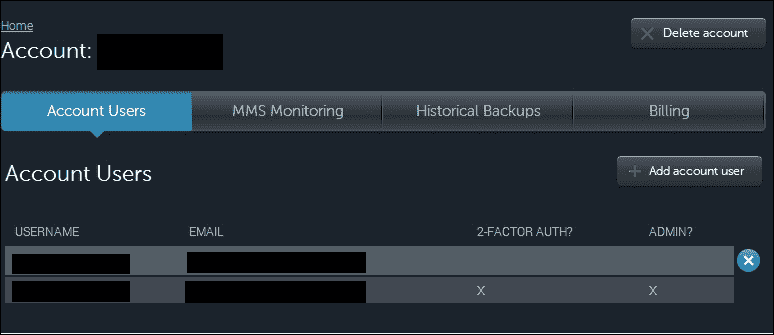
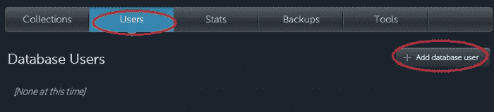
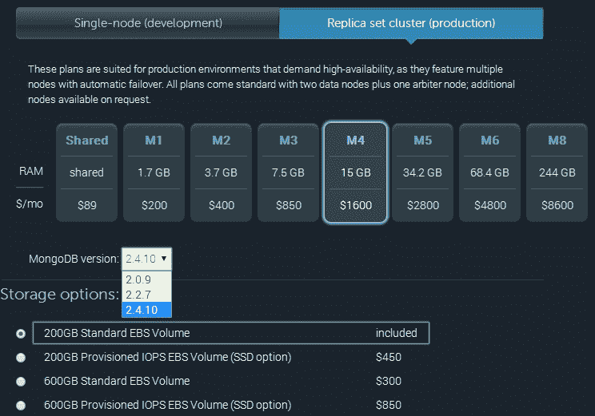
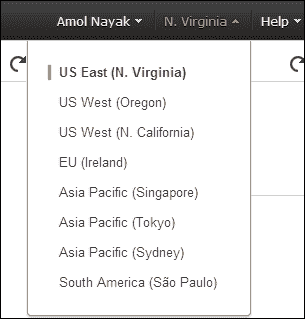
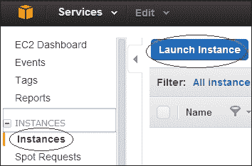

# 第七章云上部署 MongoDB

在本章中，我们将介绍以下配方：

*   建立和管理蒙古银行账户
*   在 MongoLab 上设置沙盒 MongoDB 实例
*   从 MongoLab GUI 对 MongoDB 执行操作
*   在没有 AMI 的 Amazon EC2 上设置 MongoDB
*   使用 Docker 容器设置 MongoDB

# 导言

虽然解释云计算不在本书的范围内，但我将在一段中解释它。任何企业，无论大小，都需要安装不同软件的硬件基础设施。操作系统是存储、邮件、web、数据库、DNS 等所需的基本软件以及不同的服务器（从软件角度来看）。最终需要的软件框架/平台的清单将非常庞大。有趣的是，这个硬件和软件平台的初始预算很高，因此我们甚至没有考虑托管它所需的房地产。这就是亚马逊、Rackspace、谷歌和微软等云计算提供商发挥作用的地方。他们在全球不同的数据中心托管了高端硬件和软件，让我们从不同的配置中选择启动实例。然后通过公共网络远程访问以进行管理。实际上，我们的所有设置都是在云提供商的数据中心完成的，我们只需按使用情况付费。关闭该实例，您将停止为此支付费用。不仅是小型初创企业，而且大型企业往往会因为计算资源需求的暂时上升而暂时求助于云服务器。供应商提供的价格也非常有竞争力，特别是 AWS，它的受欢迎程度说明了一切。

维基页面，[http://en.wikipedia.org/wiki/Cloud_computing](http://en.wikipedia.org/wiki/Cloud_computing) 有很多细节，也许对新概念的人来说有点太多了，但还是一本不错的读物。[的文章 http://computer.howstuffworks.com/cloud-computing/cloud-computing.htm](http://computer.howstuffworks.com/cloud-computing/cloud-computing.htm) 非常好，如果您不了解云计算的概念，也建议您阅读。

在本章中，我们将使用 MongoDB 服务提供商在云上设置 MongoDB 实例，然后在**亚马逊 Web 服务**（**AWS**上自行设置。

# 建立和管理蒙古银行账户

在这个配方中，我们将评估一个供应商 MongoDB，它将 MongoDB 作为服务提供。本介绍性配方将向您介绍什么是 MongoDB 服务，然后将演示如何在 MongoLab（[中）设置和管理帐户 https://mongolab.com/](https://mongolab.com/) 。

到目前为止，在本书的所有配方中，我们已经介绍了在组织/个人场所中设置、管理、监控和开发MongoDB 实例。这不仅需要具备适当技能的人力来管理部署，还需要安装和运行 Mongo 服务器的适当硬件。这需要大量的前期投资，而这对于初创企业，甚至对于不清楚采用或迁移到这项技术的组织来说，可能不是一个可行的解决方案。他们可能希望在全面采用此解决方案之前对其进行评估并了解其进展情况。理想的做法是让服务提供商负责托管 MongoDB 部署、管理和监控部署以及提供支持。选择这些服务的组织不需要预先投资建立服务器，也不需要招聘或外包顾问来管理和监控实例。只需选择硬件和软件平台、配置以及合适的 MongoDB 版本，然后从用户友好的 GUI 中设置环境。它甚至为您提供了使用现有云提供商服务器的选项。

我们简要地了解了这些供应商托管服务的功能以及为什么需要它们；我们将通过在 MongoLab 中建立一个帐户来开始这个配方，并查看一些基本的用户和帐户管理。MongoLab 绝不是 MongoDB 的唯一托管提供商。你也可以看看[http://www.mongohq.com/](http://www.mongohq.com/) 和[http://www.objectrocket.com/](http://www.objectrocket.com/) 。在写这本书的时候，MongoDB 自己开始在 Azure 云上提供 MongoDB 服务，目前处于测试阶段。

## 怎么做…

1.  访问[https://mongolab.com/signup/](https://mongolab.com/signup/) 如果您没有创建帐户，请注册；只需填写相关详细信息并创建一个帐户。
2.  Once the account has been created, click on the **Account** link in the top right corner:

    

3.  Click on the **Account Users** tab at the top; it should be selected by default:

    

4.  要添加新的账户，请单击**+添加账户用户**按钮上的。一个弹出窗口将询问用户名、电子邮件 ID 和密码。输入相关详细信息，点击**添加**按钮。
5.  单击用户，您将被导航到可以更改用户名、电子邮件 ID 和密码的页面。您可以通过点击此屏幕上的**更改为管理员**按钮将管理权限转移给用户。
6.  同样，通过单击您自己的用户详细信息，您可以选择更改用户名、电子邮件 ID 和密码。
7.  点击**设置双因素认证**按钮，使用 Google Authenticator 激活多因素认证。您需要在 Android、iOS 或黑莓手机上安装 Google Authenticator，才能继续设置多因素身份验证。
8.  On clicking the button, we should see the QR code that can be scanned using Google Authenticator or, if scanning is not possible, click on the URL underneath the QR code, which should show the code. Set up a time-based account in the Google Authenticator manually. There are two types of Google Authenticator accounts, time-based and counter-based.

    ### 提示

    参见[http://en.wikipedia.org/wiki/Google_Authenticator](http://en.wikipedia.org/wiki/Google_Authenticator) 获取更多详细信息。

9.  同样，您可以通过点击**账户用户**中用户行旁边的十字，从账户页面删除用户。

## 它是如何工作的…

本节中没有太多需要解释的内容。安装过程和用户管理非常简单。注意，我们在这里添加的用户不是数据库用户。这些是可以访问 MongoLab 帐户的用户。**账户**可以是组织的名称，可以在屏幕顶部看到。不应删除手持设备上 Google Authenticator 软件中设置的多因素身份验证帐户，因为只要用户从浏览器登录到 MongoLab 帐户，就会要求用户输入 Google Authenticator 帐户以继续。

# 在 MongoLab 上设置沙盒 MongoDB 实例

在前面的配方中，我们了解了如何在 MongoLab 上设置帐户并向帐户添加用户。我们还没有看到如何在云上启动实例并使用它执行一些简单的操作。在这个食谱中，这正是我们要做的。

## 准备好了吗

参考前面的配方*建立和管理蒙古银行账户*，在蒙古银行建立账户。我们将设置一个免费的沙盒实例。我们需要某种方式来连接到这个已启动的`mongo`实例，因此需要一个仅随完整 mongo 安装一起提供的 mongo 外壳，或者您可以选择使用自己选择的编程语言来连接到已启动的`mongo`实例。有关使用 Java 或 Python 客户端连接和执行操作的方法，请参阅[第 3 章](03.html "Chapter 3. Programming Language Drivers")、*编程语言驱动程序*。

## 怎么做…

1.  进入主页[https://mongolab.com/home](https://mongolab.com/home) ，点击**新建**按钮。
2.  Select a cloud provider, for this example, we choose Amazon Web Services (AWS):

    

3.  点击单节点（开发），然后点击**沙盒**选项。不要更改云服务器的位置，因为免费沙盒实例在所有数据中心都不可用。由于这是一个沙箱，我们对任何位置都没有意见。
4.  为数据库添加任何名称；我选择的名字是`mongolab-test`。输入名称后点击**新建 MongoDB 部署**。
5.  这将带您进入主页，数据库现在应该是可见的。单击实例名称。此处的页面显示所选 MongoDB 实例的详细信息。页面顶部给出了使用 shell 或编程语言进行连接的指令以及已启动实例的公共主机名。
6.  Click on the **Users** tab and then the **Add database user** button. In the pop-up window, add the username and password as `testUser` and `testUser`, respectively (or any of your choice).

    

7.  With the user added, start the mongo shell as follows, assuming that the name of the database is `mongolab-test` and the username and password is `testUser`:

    ```js
    $ mongo <host-name>/mongolab-test –u testUser –p testUser

    ```

    连接时，在 shell 中执行以下操作，检查数据库名称是否为`mongolab-test`：

    ```js
    > db

    ```

8.  在集合中插入一份文件，如下所示：

    ```js
    > db.messages.insert({_id:1, message:'Hello mongolab'})

    ```

9.  查询收款情况如下：

    ```js
    > db.messages.findOne()

    ```

## 它是如何工作的…

执行的步骤非常简单，我们在云中创建了一个共享沙盒实例。MongoLab 本身不托管实例，而是使用一个云提供商来托管。MongoLab 不支持所有提供程序的沙箱实例。沙盒实例的存储容量为 0.5 GB，并与同一台计算机上的其他实例共享。共享实例比在专用实例上运行便宜，但代价是性能。CPU 和 IO 与其他实例共享，因此共享实例的性能不一定由我们控制。对于生产用例，不建议使用共享实例。类似地，我们需要在生产环境中运行时设置副本集。如果我们查看步骤 2 中的图像，那么我们会看到**单节点（开发）**选项旁边的另一个选项卡。在这里，您可以根据 RAM 和磁盘容量（以及价格）选择机器的配置，并设置副本集。



正如您所看到的，您可以选择使用 MongoDB 的版本。即使发布了新版本的 MongoDB，MongoLab 也不会立即开始支持它，因为他们通常会等待一些小版本的推出，然后再为生产用户提供支持。此外，当我们选择配置时，默认的可用选项是两个数据节点和一个仲裁器，这对于大多数用例来说已经足够了。

选择的 RAM 和磁盘完全取决于数据的性质以及查询密集型或写密集型的程度。无论我们是在自己的基础设施上还是在云上部署，我们都会进行这种规模调整。在我们选择硬件的 RAM 之前，必须了解工作集。对概念进行验证和实验，以处理数据子集，然后对整个数据集进行估计。如果 IO 活动较高且需要较低的 IO 延迟，您甚至可以选择 SSD，如上图所示。除了可用性之外，独立实例在可伸缩性方面与副本集一样好。因此，我们可以选择独立实例来进行此类评估和开发。共享实例，无论是免费的还是付费的，对于开发目的来说都是很好的选择。请注意，共享实例不能像专用实例那样按需重新启动。

我们选择什么云提供商？如果您已经在云中部署了应用程序服务器，那么显然它必须是与您现有供应商相同的供应商。建议您对应用程序服务器和数据库使用相同的云供应商，并确保它们都部署在同一位置，以最小化延迟并提高性能。如果你刚开始，那么就花点时间选择云提供商。查看应用程序需要的所有其他服务，如存储、计算、邮件、通知服务等其他服务。所有这些分析都不在本书的范围内，但一旦您完成了这些分析并与提供商达成一致，您就可以在 MongoLab 中相应地选择要使用的提供商。就价格而言，所有领先的供应商都提供有竞争力的价格。

# 从 MongoLab GUI 对 MongoDB 执行操作

在前面的配方中，我们看到了如何使用MongoDB 在云中为 MongoDB 设置一个简单的沙盒实例。在本食谱中，我们以它为基础，从管理、管理、监控和备份的角度来了解 MongoLab 为您提供了哪些服务。

## 准备好了吗

参考前面的配方*在 MongoLab*上设置沙盒 MongoDB 实例，了解如何使用 MongoLab 在云中设置沙盒实例。

## 怎么做…

1.  转到[https://mongolab.com/home](https://mongolab.com/home) ；您应该看到数据库、服务器和集群的列表。如果您遵循了上一个方法，您应该会看到一个独立的数据库，`mongolab-test`（或者您为数据库选择的任何名称）。单击数据库名称，这将带您进入数据库详细信息页面。
2.  点击**集合**选项卡后，我们会看到数据库中存在的集合列表，该选项卡默认为选中。如果前面的配方是在这个配方之前执行的，那么您应该在数据库中看到一个集合 messages。
3.  Click on the name of the collection and we should get navigated to the collection details page as follows:

    

4.  点击的**统计**选项查看收藏的统计信息。
5.  在**单据**页签中可以查询收款情况。默认情况下，我们可以看到每页显示 10 个文档的所有文档，这些文档可以从记录/页面下拉菜单中更改。可以选择最大值 100。
6.  There is another way to view the documents, as a table. Click on the **table** radio button in the **Display** mode and click on the link to create/edit table view. In the popup that is shown, enter the following document for the messages collection and click on **Submit**:

    ```js
    {
        "id": "_id",
        "Message Text": "message"
    }
    ```

    执行此操作时，显示屏将改变如下：

    

7.  From the **--Start new search--** dropdown, select the **[new search]** option, as shown in the following image:

    

8.  With the new query, we see the following fields that let us enter the query string, sort order, and projections. Enter the query as `{"_id":1}` and fields as `{"message":1, "_id":0}`:

    

9.  您可以点击**保存此搜索**按钮并给出要保存的查询的名称，选择保存查询。
10.  单击每条记录旁边的十字可以删除单个文档。同样，顶部的**删除所有**按钮将删除集合的所有内容。
11.  类似地，单击**+添加文档**将弹出一个编辑器，输入将插入到集合中的文档。由于 MongoDB 是无模式的，文档不需要有固定的字段集；应用程序应该是有意义的。
12.  转到`https://mongolab.com/databases/<your database name> (mongolab-test`，在这种情况下，也可以通过单击主页上的数据库名称来访问`https://mongolab.com/databases/<your database name> (mongolab-test`。
13.  点击**用户**选项卡旁边的**统计**选项卡。表中显示的内容是`db.stats()`命令的结果。
14.  同样，点击**统计**选项卡旁边顶部的**备份**选项卡。在这里，我们可以选择定期备份或一次性备份。
15.  当您点击**计划定期备份**时，您会看到一个弹出窗口，可用于输入计划的详细信息，例如备份频率、需要进行备份的时间以及要保留的备份数量。
16.  备份位置可以选择为 MongoLab 自己的 S3 存储桶或 Rackspace 云文件。您可以选择使用自己帐户的存储，在这种情况下，您必须共享 AWS 访问密钥/密钥，或者在机架空间中共享 UserID/API 密钥。

## 它是如何工作的…

步骤 1 到 5 非常简单。在步骤 6 中，我们提供了一个 JSON 文档，以表格格式显示结果。文件格式如下：

```js
{
  <display column 1> : <name of the field in the JSON document> ,
  <display column 2> : <name of the field in the JSON document> ,

  <display column n> : <name of the field in the JSON document> 
}
```

键是要显示的列的名称和实际文档中字段名称的值，该字段的值将显示为此列的值。要获得清晰的理解，请查看为 messages 集合定义的文档，然后查看显示的表格数据。下面是我们提供的 JSON 文档，其中列的名称表示键的值，文档中的实际字段表示列的值：

```js
{
    "id": "_id",
    "Message Text": "message"
}
```

请注意，此处 JSON 文档的字段名和值用引号括起来。从这个意义上讲，Mongo shell 是宽松的，它允许我们不加引号地给出字段名。

如果我们访问关于备份的步骤 16，我们会看到备份存储在 MongoLab 的 AWS S3/Rackspace 云文件或您的自定义 AWS S3 bucket/Rackspace 云文件中。在后一种情况下，您需要与 MongoLab 共享 AWS/Rackspace 凭据。如果这是一个问题，并且凭据可能用于访问其他资源，建议您创建一个单独的帐户，并将其用于备份目的。您还可以使用创建的备份从 MongoDB 创建新的 MongoDB 服务器实例。不用说，如果您使用了自己的 AWS S3 bucket/Rackspace 云文件，存储费用是额外的，因为它们不属于 MongoLab 的费用。

有一些要点值得一提。MongoLab 为各种操作提供了 RESTAPI。RESTAPI 可以代替标准驱动程序来执行 CRUD 操作；但是，建议使用 MongoDB 客户端库。现在通过语言驱动程序使用 RESTAPI 的一个很好的理由是，客户端是否通过公共网络连接到 MongoDB 服务器。我们在本地机器上启动的 shell 连接到云上的 MongoDB 服务器，将未加密的数据发送到服务器，这使得它很容易受到攻击。另一方面，如果使用 RESTAPI，则使用 HTTPS 时通过安全通道发送流量。MongoLab 计划在将来为客户机和服务器之间的通信提供一个安全通道，但截至本书撰写之时，这还不可用。如果应用程序和数据库位于云提供商的同一数据中心，则您是安全的，并且可以依赖云提供商为其本地网络提供的安全性，而这通常不是一个问题。但是，对于安全通信，除了确保数据不会通过公共网络传输之外，您无能为力。

还有一个场景MongoLab 不起作用，即您希望实例在您自己的虚拟机实例上运行，而不是 MongoLab 选择的实例，或者我们希望应用程序位于虚拟私有云中。云提供商确实提供亚马逊专有网络（Amazon VPC）等服务，AWS 云的一部分可以被视为您网络的一部分。如果您打算在这样的环境中部署 MongoDB 实例，则不能使用 MongoLab。

# 在 Amazon EC2 上手动设置 MongoDB

在前面的几篇文章中，我们看到了如何使用 MongoLab 提供的托管服务在云中启动 MongoDB，该服务提供了在所有领先的云供应商上安装 MongoDB 的替代方案。但是，如果我们计划自己托管和监控实例，以获得更大的控制权，或者在我们自己的虚拟私有云中进行设置，我们可以自己完成。虽然程序因云提供商而异，但我们将使用 AWS 进行演示。有几种方法可以做到这一点，但在这个配方中，我们将使用**亚马逊机器图像**（**AMI**。AMI 是一个包含详细信息的模板，如操作系统、启动的虚拟机上可用的软件等。所有这些信息都将在云上启动新的虚拟机器实例时使用。欲了解更多有关 AMI 的信息，请参考[http://en.wikipedia.org/wiki/Amazon_Machine_Image](http://en.wikipedia.org/wiki/Amazon_Machine_Image) 。

说到 AWS EC2，它代表弹性云计算，它是一种服务，允许您在云中创建、启动和停止在您选择的操作系统上运行的不同配置的服务器。（价格相应不同）同样，亚马逊**弹性块存储**（**EBS**）是一项提供高可用性、低延迟的持久块存储的服务。最初，每个实例都有一个称为临时存储的存储。这是一个临时存储，当实例重新启动时，数据可能会丢失。因此，EBS 块存储连接到 EC2 实例，以保持持久性，即使该实例停止然后重新启动。标准 EBS 不提供每秒保证的最低**IO 操作数**（**IOPS**。对于中等工作负载，默认值约为 100 IOPS 是可以的。但是，对于高性能 IO，也可以使用具有保证 IOPS 的 EBS 块。与标准 EBS 块相比，定价更高，但如果低 IO 速率可能成为系统性能的瓶颈，则定价是一个很好的选择。

在这个配方中，我们将设置一个小的微实例，它足够好，作为一个沙盒实例，附带一个 EBS 块卷。

## 准备好了吗

你需要做的第一件事就是注册一个 AWS 账户。访问[http://aws.amazon.com/](http://aws.amazon.com/) 点击**注册**。如果您有亚马逊帐户，请登录，或者创建一个新帐户。您必须提供您的信用卡详细信息，尽管我们这里的食谱将使用免费微实例，除非我们明确提及其他内容。我们将使用 Putty 连接到云上的实例。您可以下载 Putty 并将其安装到您的计算机上（如果尚未安装）。可从[下载http://www.putty.org/](http://www.putty.org/) 。

对于使用 AMI 安装的这个特定方法，我们不能使用微实例，而必须使用标准的大型实例。您可以在[获取不同地区 EC2 实例定价的更多详细信息 https://aws.amazon.com/ec2/pricing/](https://aws.amazon.com/ec2/pricing/) 。根据地理和金融因素选择合适的地区。

1.  您需要做的第一件事是创建一个密钥对，以防尚未创建密钥对。以下从 1 到 5 的步骤仅用于创建密钥对。此密钥对将用于从 Putty 客户端登录到云中启动的 Unix 实例。如果已创建密钥对并且`.pem`文件可供您使用，请跳至步骤 6。
2.  Go to [https://console.aws.amazon.com/ec2/](https://console.aws.amazon.com/ec2/) and make sure that the region you have on the top right (as shown in the following image) is the same as the one in which you are planning to set up the instance.

    

3.  选择区域后，带有**资源**标题的页面将显示该区域的所有实例、密钥对、IP 地址等。点击**密钥对**链接，该链接将引导您进入显示所有现有密钥对的页面，您可以创建新密钥对。
4.  点击**创建密钥对**按钮，在弹出窗口中键入您选择的任何名称。假设我们称之为`EC2 Test Key Pair`，然后点击**创建**。
5.  一旦创建，将生成一个`.pem`文件。确保将文件保存为后续访问计算机所需的文件。
6.  我们接下来将把这个`.pem`文件转换成`.ppk`文件，与腻子一起使用。
7.  Start puttygen; if it is not available already, it can be downloaded from [http://www.chiark.greenend.org.uk/~sgtatham/putty/download.html](http://www.chiark.greenend.org.uk/~sgtatham/putty/download.html).

    您应该在屏幕上看到以下内容：

    

8.  选择**SSH-2 RSA**选项，点击**加载**按钮。在文件对话框中，选择**所有文件**，然后选择与密钥对一起下载的`.pem`文件，该文件在 EC2 控制台中生成。
9.  Once the `.pem` file is imported, click the **Save private key** option and save the file with any name; the file this time is a `.ppk` file. Save this file for future logging in to the EC2 instance from putty.

    ### 注

    如果您使用的是 Mac OS X 或 Linux，则可以使用`ssh-keygen`实用程序生成 SSH 密钥。

## 怎么做…

1.  Go to [https://console.aws.amazon.com/ec2/](https://console.aws.amazon.com/ec2/) and click on the **Instances** option on the left and then the **Launch Instance** button:

    

2.  由于我们想要启动一个免费的微实例，请选中左侧的**仅免费层**复选框。在右侧，选择要设置的实例。我们选择使用**Ubuntu 服务器**。点击**选择**导航到下一个窗口。
3.  选择微实例，点击**查看并启动**。忽视安全警告；您将拥有的默认安全组将通过端口 22 接受来自公共网络上所有主机的连接。
4.  在不编辑任何默认设置的情况下，点击**启动**。启动时，将出现一个弹出窗口，允许您选择现有密钥对。如果在没有密钥对的情况下继续，则需要密码或创建新的密钥对。在前面的配方中，我们已经创建了一个密钥对，这就是我们将在这里使用的。
5.  点击**启动实例**启动新微实例。
6.  关于如何使用 Putty 连接到已启动实例，请参阅上一个配方中的步骤 9 到 12。请注意，我们将使用 Ubuntu 用户而不是上一个配方中使用的`ec2-user`，因为这次我们使用的是 Ubuntu 而不是 Amazon Linux。
7.  在添加 MongoDB 存储库之前，我们需要导入 MongoDB 公钥，如下所示：

    ```js
    $ sudo apt-key adv --keyserver hkp://keyserver.ubuntu.com:80 --recv 7F0CEB10

    ```

8.  在操作系统外壳中执行以下命令：

    ```js
    $ echo "deb http://repo.mongodb.org/apt/ubuntu trusty/mongodb-org/3.0 multiverse" | sudo tee /etc/apt/sources.list.d/mongodb-org-3.0.list

    ```

9.  通过执行以下命令加载本地数据库：

    ```js
    $ sudo apt-get install mongodb-org

    ```

10.  执行以下命令创建所需目录：

    ```js
    $ sudo mkdir /data /log

    ```

11.  Start the `mongod` process as follows:

    ```js
    $ sudo mongod --dbpath /data --logpath /log/mongodb.log --smallfiles --oplogsize 50 –fork

    ```

    要确保服务器进程已启动并正在运行，请在 shell 中执行以下命令，我们应该在日志中看到以下内容：

    ```js
    $ tail /log/mongodb.log
    2015-05-04T13:41:16.533+0000 [initandlisten] journal dir=/data/journal
    2015-05-04T13:41:16.534+0000 [initandlisten] recover : no journal files present, no recovery needed
    2015-05-04T13:41:16.628+0000 [initandlisten] waiting for connections on port 27017

    ```

12.  按如下方式启动 mongo shell 并执行以下命令：

    ```js
    $ mongo
    > db.ec2Test.insert({_id: 1, message: 'Hello World !'})
    > db.ec2Test.findOne()

    ```

## 它是如何工作的…

很多步骤都是不言自明的。建议您至少阅读前面的配方，因为其中解释了很多概念。上述配方中解释的大多数概念适用于此处。本节将解释一些不同的内容。对于安装，我们选择 Ubuntu 而不是 AmazonLinux，这是使用 AMI 设置服务器时的标准。不同的操作系统有不同的安装步骤。参见[http://docs.mongodb.org/manual/installation/](http://docs.mongodb.org/manual/installation/) 了解如何在不同平台上安装 MongoDB的步骤。本配方中的步骤 7 至 9 是在 Ubuntu 上安装 MongoDB 的特定步骤。参见[https://help.ubuntu.com/12.04/serverguide/apt-get.html](https://help.ubuntu.com/12.04/serverguide/apt-get.html) 了解我们在这里执行的安装 MongoDB 的`apt-get`命令的更多详细信息。

在我们的例子中，我们选择将数据、日志和日志文件夹放在同一个 EBS 卷上。这是因为我们设置的是`dev`实例。在`prod`实例的情况下，存在不同的 EBS 卷，这些卷配置了 IOPS 以获得最佳性能。此设置允许我们利用以下事实：这些不同的卷具有不同的控制器，因此可以进行并发写入操作。带有已配置卷的 EBS 卷由 SSD 驱动器支持。[中的生产部署说明 http://docs.mongodb.org/manual/administration/production-notes/](http://docs.mongodb.org/manual/administration/production-notes/) 声明 MongoDB 部署应该由 RAID-10 磁盘支持。在 AWS 上部署时，首选 PIOP 而不是 RAID-10。例如，如果需要 4000 IOPS，则选择具有 4000 IOPS 的 EBS 卷，而不是具有 2 X 2000 IOPS 或 4 X 1000 IOPS 设置的 RAID-10 设置。这不仅消除了不必要的复杂性，而且与在 RAID-10 设置中处理多个磁盘相比，可以对单个磁盘进行快照。说到快照，日志和数据在大多数生产部署中都写入到单独的卷中。这是快照不起作用的场景。我们需要刷新数据库写入，锁定数据以便进一步写入，直到备份完成，然后释放锁。参见[http://docs.mongodb.org/manual/tutorial/backup-with-filesystem-snapshots/](http://docs.mongodb.org/manual/tutorial/backup-with-filesystem-snapshots/) 了解快照和备份的更多详细信息。

参见[http://docs.mongodb.org/ecosystem/platforms/](http://docs.mongodb.org/ecosystem/platforms/) 了解在不同云提供商上部署的更多详细信息。有一节专门介绍 AmazonEC2 实例上的备份。与手动设置实例相比，更喜欢使用 AMI 为生产部署设置 MongoDB 实例，如前一个配方中所示。对于小型开发目的来说，手动设置是可以的，在这种情况下，具有 EBS 卷和已配置 IOPS 的大型实例是一种过度使用。

## 另见

*   云形成是一种可以为 EC2 实例定义模板并自动创建实例的方式。您可以在[了解更多云的形成 https://aws.amazon.com/cloudformation/](https://aws.amazon.com/cloudformation/) 并参考[https://mongodb-documentation.readthedocs.org/en/latest/ecosystem/tutorial/automate-deployment-with-cloudformation.html](https://mongodb-documentation.readthedocs.org/en/latest/ecosystem/tutorial/automate-deployment-with-cloudformation.html) 。
*   另一种选择是使用 Mongo 的云服务：[https://docs.cloud.mongodb.com/tutorial/nav/add-servers-through-aws-integration/](https://docs.cloud.mongodb.com/tutorial/nav/add-servers-through-aws-integration/) 。
*   通过参考维基百科上的这两个 URL，您可以了解有关 RAID 的更多信息：[http://en.wikipedia.org/wiki/Standard_RAID_levels](http://en.wikipedia.org/wiki/Standard_RAID_levels) 和[http://en.wikipedia.org/wiki/Nested_RAID_levels](http://en.wikipedia.org/wiki/Nested_RAID_levels) 。这里给出的描述相当全面。

# 使用 Docker 容器设置 MongoDB

我喜欢称之为集装箱运动，它几乎触及了信息技术的所有方面。Docker 作为首选工具，是创建和管理容器不可或缺的一部分。

在此配方中，我们将在 Ubuntu（14.04）服务器上安装Docker，并在容器中运行 MongoDB。

## 准备好了吗

1.  首先，我们需要在 Ubuntu 服务器上安装 Docker，这可以通过运行以下命令来完成：

    ```js
    $ wget -qO- https://get.docker.com/ | sh

    ```

2.  启动 Docker 服务：

    ```js
    $ service docker start 
    > docker start/running, process 24369

    ```

3.  确认 Docker 正在按如下方式运行：

    ```js
    $ docker info
    > Containers: 40
    > Images: 311
    > Storage Driver: aufs
    >  Root Dir: /var/lib/docker/aufs
    >  Dirs: 395
    > Execution Driver: native-0.2
    > Kernel Version: 3.13.0-37-generic
    > Operating System: Ubuntu 14.04.2 LTS
    > WARNING: No swap limit support

    ```

## 怎么做…

1.  从 Docker Hub 获取默认 MongoDB图像，如下所示：

    ```js
    $ docker pull mongo

    ```

2.  让我们确认图像是通过以下命令安装的：

    ```js
    $ docker images | grep mongo

    ```

3.  Start the MongoDB server:

    ```js
    $ docker run -d  --name mongo-server-1 mongo
    > dfe7684dbc057f2d075450e3c6c96871dea98ff6b78abe72944360f4c239a72e

    ```

    或者，您也可以运行`docker ps`命令来检查正在运行的容器列表。

4.  获取此容器的 IP:

    ```js
    $ docker inspect mongo-server-1 | grep IPAddress
    > "IPAddress": "172.17.0.3",

    ```

5.  使用 mongo 客户端连接到我们的新容器：

    ```js
    $ mongo  172.17.0.3
    >MongoDB shell version: 3.0.4
    > connecting to: 172.17.0.3/test
    > 

    ```

6.  在服务器上创建目录：

    ```js
    $ mkdir –p /data/db2

    ```

7.  启动新的 MongoDB 容器：

    ```js
    $ docker run -d --name mongo-server-2 -v /data/db1:/data/db mongo

    ```

8.  获取步骤 4 中提到的这个新容器的 IP，并使用 Mongo 客户端进行连接：

    ```js
    $ docker inspect mongo-server-2 | grep IPAddress
    > "IPAddress": "172.17.0.4",
    $ mongo  172.17.0.4
    >MongoDB shell version: 3.0.4
    > connecting to: 172.17.0.4/test
    > 

    ```

9.  Let's make another directory for our final container:

    ```js
    $ mkdir –p /data/db3 

    ```

    启动新的 MongoDB 容器：

    ```js
    $ docker run -d --name mongo-server-3  -v /data/db3:/data/db -p 9999:27017 mongo

    ```

10.  让我们通过 localhost:

    ```js
    $ mongo localhost:9999
    > MongoDB shell version: 3.0.4
    > connecting to: localhost:9999/test

    ```

    连接到此容器

## 它是如何工作的…

我们首先从 DockerHub 下载默认的 MongoDB 映像（[https://hub.docker.com/_/mongo/](https://hub.docker.com/_/mongo/) ）。Docker 映像是一个自我维持的操作系统映像，它是为应该运行的应用程序定制的。所有 Docker 容器都是这些图像的独立执行。这与使用操作系统模板创建虚拟机的方式非常相似。

图像下载操作默认取最新稳定的 MongoDB 图像，但您可以通过提及标签指定您选择的版本，例如`docker pull mongo:2.8`。

我们通过运行`docker images`命令来验证映像是否已下载，该命令将列出服务器上安装的所有映像。在步骤 3 中，我们使用 mongo 图像以分离（`-d`模式启动一个名为`mongo-server-1`的容器。描述容器内部可能超出了本烹饪书的范围，但简而言之，我们现在有一个独立的`docker pseudo-sever`在我们的 Ubuntu 机器中运行。

默认情况下，每个 Docker 容器都会获得 Docker 服务器分配的 RFC1918（不可路由）IP 地址空间。为了连接到这个容器，我们在步骤 4 中获取 IP 地址，并在步骤 5 中连接到`mongodb`实例。

但是，每个 Docker 容器都是短暂的，因此，销毁容器将意味着丢失数据。在步骤 6 中，我们创建一个本地目录，用于存储 mongo 数据库。我们在步骤 7 中启动一个新容器；它与前面的命令类似，添加了 Volumes（`-v`开关。在我们的示例中，我们将把`/data/db2`目录公开给 mongo 容器名称空间，作为`/data/db`。这类似于类似 NFS 的文件装载，但在内核名称空间的范围内。

最后，如果我们希望外部系统连接到此容器，我们将容器的端口绑定到主机的端口。在步骤 9 中，我们使用端口（-p）开关将 Ubuntu服务器上的 TCP`9999`端口绑定到此容器的 TCP`27017`。这确保连接到服务器端口`9999`的任何外部系统都将路由到此特定容器。

## 另见

您还可以尝试使用 docker 命令的 link（`-l`命令行参数链接两个容器。

欲了解更多信息，请访问[http://docs.docker.com/userguide/dockerlinks/](http://docs.docker.com/userguide/dockerlinks/) 。