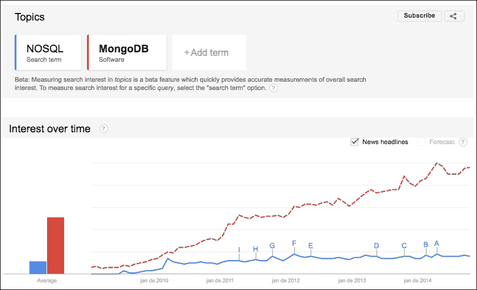
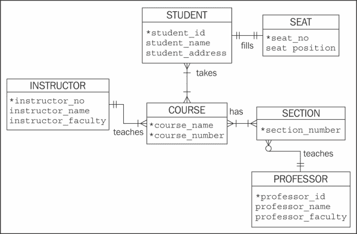
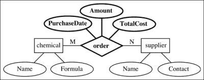

# 一、数据建模简介

数据建模是一个已经讨论了很长时间的主题。因此，关于这个问题的不同作者可能有不同的观点。不久前，当主要讨论关系数据库时，数据建模是域中数据发现和分析过程的一部分。这是一个整体的愿景，最终目标是拥有一个能够支持任何类型应用程序的健壮数据库。

由于 NoSQL 数据库的灵活性，数据建模一直是一个由内而外的过程，在这个过程中，您需要事先了解应用程序的需求或性能特征，以便最终拥有一个好的数据模型。

在本章中，我们将提供多年来数据建模过程的简要历史，向您展示重要的概念。我们将讨论以下主题：

*   MongoDB 与 NoSQL 的关系
*   介绍 NoSQL
*   数据库设计

# MongoDB 与 NoSQL 的关系

如果你在谷歌上搜索 MongoDB，你会发现大约 10900000 条搜索结果。同样地，如果你在谷歌搜索 NoSQL，你会得到不少于 13000000 个结果。

现在，在谷歌趋势（Google Trends）上，一个显示一个词相对于全球所有搜索词的搜索频率的工具，我们可以看到两个主题的兴趣增长非常相似：

2009 年以来 NoSQL 和 MongoDB 术语的 Google 趋势搜索比较

但是，除了 MongoDB 是一个 NoSQL 数据库这一事实之外，在这种关系中实际存在着什么？

自从 2009 年由一家名为 10gen 的公司发布第一个开源版本以来，MongoDB 是许多网络玩家的选择，因此DB 引擎（[http://db-engines.com/en/](http://db-engines.com/en/) 成为第四大最受欢迎的数据库，也是最受欢迎的 NoSQL 数据库系统。

2013 年 8 月 27 日，10gen 转换为 MongoDB Inc.，这表明所有的目光都集中在 MongoDB 及其生态系统上。在这一变化过程中，向开源项目的转变至关重要。特别是，由于社区采用率非常高。

MongoDB 现任董事长兼联合创始人德怀特·梅里曼（Dwight Merriman）表示：

> *“我们的开源平台导致 MongoDB 在项目推出后的五年内被下载了 800 万次，这是社区采用的一个非常快的速度。”*

此外，MongoDB Inc.推出了产品和服务，以支持该社区并丰富 MongoDB 生态系统。其中包括:

*   **MongoDB 企业**：对 MongoDB 的商业支持
*   **MongoDB 管理服务**：一款SaaS 监控工具
*   **MongoDB 大学**：提供免费在线培训的EdX 合作伙伴

NoSQL 运动以同样的方式跟随 MongoDB 的发展，为了迎接 Web 2.0 带来的挑战和机遇，NoSQL 运动也得到了实质性的发展。

# 引入 NoSQL（不仅仅是 SQL）

尽管这个概念是新的，但 NoSQL 是一个极具争议的话题。如果你广泛搜索，你可能会发现许多不同的解释。因为我们没有任何意图去创造一个新的，所以让我们来看看最常用的解释。

正如我们今天所知，NoSQL 这个术语是由 Eric Evans 在 Last.fm 的 Johan Oskarsson 组织的一次会面后引入的。

事实上，Oskarsson 和其他参加了 2009 年 6 月 11 日在旧金山召开的历史会议的人已经讨论了许多我们称之为 NoSQL 数据库的数据库，如卡桑德拉、HBASE 和 CouCHDB。正如 Oskarsson 所描述的，这次会议是关于开放源代码、分布式、非关系数据库的，面向那些“在传统关系数据库中遇到限制…”的人，目的是“…弄清楚为什么这些新型的 Dynamo 克隆和 Bigtable 最近如此流行。”

四个月后，埃文斯在他的博客中写道，除了 NoSQL 运动的发展和正在讨论的一切，他认为他们不会有任何进展。然而，Neo4J 的创始人兼首席执行官埃米尔·埃夫伦（Emil Eifren）将该术语命名为“不仅仅是 SQL”是正确的

Emil Eifrem 在 Twitter 上发布了一篇文章，介绍了“不仅仅是 SQL”一词

更重要的是所有这些事件都是讨论 NoSQL 到底是什么的起点，而不是给出 NoSQL 一词的定义。如今，人们似乎普遍认为，NoSQL 的诞生是对关系数据库所不能解决的每一个问题的响应。

值得注意的是，我们现在可以区分从 70 年代到今天信息系统必须解决的问题。当时，单片建筑足以满足需求，这与我们现在所看到的不同。

你有没有想过有多少网站，比如社交网络、电子邮件提供商、流媒体服务和在线游戏，你已经有了账户？现在，你家里有多少设备连接到了互联网？

如果你不能准确回答前面的问题，不要担心。你并不孤单。随着每一项新的研究项目的开展，全球互联网接入用户的数量都在增加，移动互联网接入所占的份额也越来越大。

这意味着每秒钟、每一处都会生成大量非结构化或半结构化数据。由于用户是信息的主要来源，因此无法估计数据量。因此，预测这一数量何时或为什么会变化变得越来越困难。这只是世界上某个地方发生的不可预测事件的问题，比如进球得分、大罢工、大规模示威或飞机失事，从而导致流量的变化，从而导致用户生成的内容的增长。

为此，NoSQL 技术的发展带来了各种不同的方法。

## NoSQL 数据库类型

正如之前所述，在亚马逊 DynamoDB 和谷歌 BigTable 的帮助下，亚马逊公司和谷歌处于 NoSQL 开发的最前沿。由于样式的多样性，我们一直在开发新类型的 NoSQL 数据库。然而，基于数据模型，已知四种基本类型：键值存储、宽列存储、文档数据库和图形数据库，解释如下：

*   **Key-value stores**: The key-value is one of the most simple and straightforward data models, where each record is stored as a key together with its value. Examples of key-value stores are Amazon Dynamo, Riak, and Redis.

    ### 提示

    Redis 可以描述为一种高级键值缓存和存储。因为它的键可以存储许多不同的数据类型并对这些类型运行原子操作，所以我们可以假设 Redis 是一个数据结构服务器。

*   **宽列存储**：概念上，最接近关系数据库的，因为它的数据是在表中表示的。然而，数据库存储的是数据列而不是行。宽列存储的示例有 Google BigTable、Cassandra 和 HBase。
*   **文档数据库**：正如的名称所示，该数据库的数据模型以文档为主要概念。文档是以键值形式存储数据的复杂结构，可以包含许多键值对、键数组对甚至嵌套文档。文档数据库的示例有 MongoDB、ApacheCouchDB 和 AmazonSimpleDB。
*   **图形数据库**：图形数据库是存储数据项的最佳方式，这些数据项的关系最好用图形表示，例如网络拓扑和社交网络。节点、边和属性是存储数据的结构。图形数据库的示例有 Neo4J 和 HyperGraphDB。

## 动态模式、可扩展性和冗余

尽管如前所述，NoSQL 数据库类型基于不同的数据模型，但它们有一些共同的特性。

为了支持非结构化或半结构化数据，NoSQL 数据库没有预定义的模式。动态模式在插入新数据时简化了实时更改，在需要数据迁移时更经济高效。

为了处理不可预测的大量数据，NoSQL 数据库使用自动分片来水平扩展并确保数据的连续可用性。自动分片允许用户在多个服务器上自动传播数据和流量。

NoSQL数据库也支持本机复制，这为您提供了快速简便的高可用性和恢复。随着数据的不断分发和恢复策略的改变，我们可能会微调一致性级别。

# 数据库设计与数据建模

在我开始写这一章之前（或者在开始写这本书之前），我考虑过如何处理这个问题。首先，因为我猜这是你的期望之一。第二，因为这是一个几乎存在于所有文献中的主题，我不想（也不打算）激化这一讨论。

事实上，讨论的方向是理论与实践，直到现在，在我的生活中，我一直倾向于实践的一面。因此，我调查，搜索了许多不同的来源，在那里我可以读到更多关于这个主题的内容，也许我可以在这本书中总结到目前为止关于这个主题的所有内容。

我在研究之初发现的很多东西表明，数据库设计和数据建模之间存在着明显的分离。然而，最后，我的结论是，这两个概念的相似之处多于分歧。为了得出这个结论，我在*数据库系统简介*、*皮尔逊教育*中提到了 C.J.Date 提到的一个事实。

在书中，C.J.Date 说他不喜欢使用术语数据建模，因为它可能是指术语数据模型，这种关系可能会引起一些混乱。C.J.Date 提醒我们，术语数据模型在文献中有两种含义。第一个是数据模型通常是数据模型，第二个是数据模型是与特定企业相关的持久数据模型。Date 在他的书中选择了第一个定义。

如 C.J.日期所述：

> *“我们认为，在非关系系统中进行数据库设计的正确方法是首先进行干净的关系设计，然后作为一个单独的后续步骤，将该关系设计映射到目标 DBMS 碰巧支持的任何非关系结构（例如，层次结构）。*

因此，谈论数据库设计是一个良好的开端。因此，C.J.Date 采用了术语语义建模，或概念建模，并将此活动定义为数据库设计过程中的辅助工具。

### 提示

如果您想了解更多，可以在*数据库系统简介第 8 版*、*第 14 章*、*第 410 页*中找到。

我发现的另一个重要来源是 Graeme Simson 在*数据管理通讯*[上发表的出版物，在某种程度上补充了 C.J.日期论证 http://www.tdan.com](http://www.tdan.com) 和*数据建模：理论与实践**一书中技术出版有限责任公司*。Graeme Simson 是一名数据建模者，两本数据建模书的作者，墨尔本大学的研究员。

在绝大多数出版物中，Simson 论述了数据库设计和数据建模主题，并得出结论，数据建模是数据库设计的一门学科，因此，数据模型是设计中唯一且最重要的组成部分。

我们注意到，与 C.J.Date 不同，Graeme Simson 使用数据建模这一术语。

在其中一份出版物中，Simson 向我们介绍了一个重要事实，即数据建模概念是数据库设计过程的一部分。他谈到了数据库设计的各个阶段，并试图通过使用一些历史事实和对直接参与数据建模的人员的研究来解释它。

从历史的角度来看，他提到了 3-schema 体系结构对数据建模概念演变的重要性。

要理解这一演变，我们必须追溯到 1975 年。同年，由 Charles Bachman 领导的美国国家标准协会标准规划和要求委员会（也称为 ANSI/SPARC/X3 数据库管理系统研究小组）发布了一份报告，提出了 DBMS 体系结构。

本报告介绍了一种适用于任何数据模型的数据库管理系统的抽象体系结构，即一种用户视图倍增和感知数据的方式。

3-schema 架构的开发是为了描述最终产品、数据库，而不是设计数据库的过程。但是，如前所述，3-schema 体系结构引入了直接影响数据库设计过程（包括数据建模）的概念。在下一节中，我们将介绍 3-schema 架构概念，以更好地理解数据建模概念。

## ANSI-SPARC 体系结构

ANSI-SPARC 架构建议使用三个视图（或三个模式），以便：

*   向用户隐藏物理存储实现
*   确保 DBMS 允许用户一致地访问相同的数据，这意味着所有用户都有自己的视图
*   允许数据库管理员在物理级别更改某些内容，而不影响用户的视图

### 外部层面

外部级别，也称为用户视图，详细说明每个特定用户如何查看数据库。此级别允许每个用户以不同的方式查看数据。因此，它也是保存有关用户特定需求的信息的适当级别。外部模式描述如何为不同的用户视图构造数据库。因此，一个数据库可以有许多外部模式。

### 概念层面

概念层面，尽管被许多人认为是最重要的层面，但却是架构中出现的最后一个层面。此级别旨在显示数据库的逻辑结构。我们可以说它是数据库中存储的数据的抽象视图。

概念层充当用户视图和数据库实现之间的层。因此，在此级别中，不考虑物理实现的细节和用户视图的特殊性。

一旦概念层到了这里，数据库管理员就在这个体系结构层中扮演着重要的角色，在这个体系结构层中，我们有一个数据库全局视图。他们的责任是定义逻辑结构。

关于概念层，一件非常有趣的事情是，我们必须记住，这个层独立于硬件或软件。概念模式定义了逻辑数据结构以及数据库中数据之间的关系。

### 内部层面

内部级别表示数据的存储方式。此模式定义物理存储结构，如索引、数据字段和表示。数据库只有一个内部模式，但概念模式可能有许多内部模式。

ANSI/SPARC/X3 数据库体系结构

查尔斯·巴赫曼（Charles Bachman）和 ANSI/SPARC/X3 成员演示的概念介绍非常有意义。他们带来了一种查看数据库的新方法，并引入了有助于开发数据建模规程的概念。

## 数据建模

正如我们前面提到的，数据建模不再被视为一个单独的过程。它是数据库设计过程中的一个阶段，必须与业务分析一起完成。作为建模过程的最终结果，我们应该拥有逻辑数据模型。

这个建模过程提出了一个有争议的问题，即我们使用哪种方法。本次讨论的核心是关于什么是学术性的或我们在实践中看到的。

对于 Matthew West 和 Julian Fowler，查看建模过程的一种方法如下图所示：

数据建模过程

格雷姆·西米森有一整篇关于这一讨论的文章。本文展示了建模过程的学术观点与现实观点的不同。两者都为建模阶段命名，这是完全不同的。

在本章的写作过程中，我不仅要介绍 Simson 的研究，还要介绍自我开始使用信息系统以来所经历的一切，以及关于建模概念的广泛研究，以及我在许多其他来源中看到的无数观点。

此外，如前所述，以及 Simson 所观察到的，三模式 ANSI-SPARC 体系结构在我们今天的基本概念形成过程中发挥了关键作用。随着关系模型和基于关系模型的数据库管理系统的普及，支持旧的数据库体系结构（如分层和基于网络的）的需求已经过去。然而，我们将建模过程分为两个阶段的方式仍然存在，一个阶段反映非常接近用户视图的概念，然后自动转换为概念模式。

我们可以说，我们现在所知道的数据建模过程的各个阶段都来自于 3-schema 体系结构。不仅是在概念上，而且是在每个阶段的名词上。

因此，我们最常见的数据模型有三种：概念模型、逻辑模型和物理模型。

### 概念模型

概念模型是实体和关系的地图，其中有一些属性需要说明。这是一个高层次的抽象视图，的目标是识别基本概念，非常接近用户对数据的感知，而不是专注于特定的业务理念。

如果我们的受众是商界人士，那就是正确的模式。它经常用于描述通用域概念，并且应该独立于 DBMS。例如，我们可以提到实体，如个人、商店、产品、讲师、学生和课程。

在学术文献和实践中，广泛使用关系表示法来表示概念模型，即使目标实现不是关系 DBMS。事实上，正如 C.J.Date 所说，这是一个很好的方法。

概念模型的常见图形表示法是流行的“鱼尾纹符号”。

鱼尾纹符号

人们常说，最好的做法是将概念模型限制在一页上打印。概念模型可以是一个图表，也可以只是一个描述您所识别的一切的文档。

### 逻辑模型

逻辑模型是一种更为商业友好的模型。这个模型也应该是独立于 DBMS 的，并且是从概念模型派生出来的。

在这个模型中描述业务需求是很常见的。因此，此时，数据建模师将更加关注项目的范围。具有数据类型和约束的关系属性的基数和可空性等详细信息也映射到此模型上。与概念模型一样，通常使用关系表示法来表示逻辑模型。数据建模师必须在逻辑模型上做更多的工作。这是因为逻辑模型是建模者探索所有可能性和不同想法的地方。

通常，逻辑模型是一种图形表示。最广泛使用的是 Peter Chen 在 1976 年提出的模型**实体关系**（**ER**）。ER 模型有一个符合逻辑模型所有需求的图形符号。

实体关系图

### 物理模型

物理模型是一种模型，在该模型中，我们对数据有更详细的和更少的通用信息。在这个模型中，我们应该知道应该使用哪种技术。在这里，我们可以包括表、列名、键、索引、安全角色、验证规则，以及您作为数据建模师认为必要的任何细节。

为了明确与三模式体系结构的联系，物理模型在某种程度上与体系结构上的内部级别相关联，因为我们正是在这个级别处理如何向用户表示存储的数据。这个阶段的目标是实现一个数据库。

# 总结

数据建模是数据库设计过程中的一个重要步骤。通过让所有利益相关者参与进来，有许多方法可以确保这一过程的高质量。在对数据建模之后，您可能会对数据有更好的了解。

也就是说，我们应该始终考虑我们的数据，并使用一种技术对其进行建模。

在本章中，您了解了 NoSQL 的历史，并从整体上探讨了数据库设计和数据建模。我们回顾了数据库体系结构，您还了解了概念模型、逻辑模型和物理模型。

既然您了解了更多关于数据建模的知识，我们将在下一章中介绍 MongoDB 数据模型以及这些概念的应用。