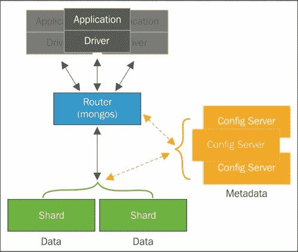

# 七、扩容

多年来，可伸缩性一直是一个备受讨论的话题。尽管已经有很多关于它的说法，但这个话题非常重要，在这本书中，它肯定也会找到它的位置。

处理所有涉及数据库可伸缩性的概念，特别是在 NoSQL 数据库中，并不符合我们的兴趣，而是展示 MongoDB 在集合中处理可伸缩性时提供的可能性，以及 MongoDB 数据模型的灵活性如何影响我们的选择。

基于简单的基础设施和低成本的分片请求，可以横向扩展 MongoDB。分片是通过称为**分片**的多个物理分区分发数据的技术。即使数据库是物理分区的，但对于我们的客户机来说，数据库本身就是一个实例。分片技术对于数据库的客户端是完全透明的。

亲爱的读者，准备好！在本章中，您将看到数据库维护的一些关键主题，例如：

*   通过切分向外扩展
*   选择分片键
*   扩展社交收件箱模式设计

# 通过分片扩展 MongoDB

当我们谈到数据库可伸缩性时，我们有两种参考方法：

*   **放大或垂直扩容**：在这种方法中，我们向机器添加更多资源。例如，CPU、磁盘和内存，以增加系统容量。
*   **向外扩容或水平扩容**：在这种方法中，我们在系统中添加更多节点，并在可用节点之间分配工作。

两者之间的选择并不取决于我们的欲望。这取决于我们想要扩展的系统。有必要知道是否有可能以我们想要的方式扩展该系统。我们还必须记住，这两种技术之间存在差异和权衡。

由于我们的服务提供商的限制，增加存储容量、CPU 或内存可能非常昂贵，有时甚至不可能。另一方面，增加系统中节点的数量也会增加概念上和操作上的复杂性。

然而，考虑到虚拟化技术的进步和云提供商提供的设施，水平扩展正在成为一些应用程序更实用的解决方案。

MongoDB 准备水平扩展。这是在切分技术的帮助下完成的。这种技术包括对数据集进行分区，并在多个服务器之间分发数据。分片的主要目的是通过在每个分片之间分配操作的负载来支持能够处理高吞吐量操作的大型数据库。

例如，如果我们有一个 1TB 的数据库和四个配置的碎片，每个碎片应该有 256GB 的数据。但是，这并不意味着每个碎片将管理 25%的吞吐量操作。这只取决于我们决定构建碎片的方式。这是一个巨大的挑战，也是本章的主要目标。

下图演示了碎片在 MongoDB 上的工作方式：


在本书撰写之时，MongoDB 在其 3.0 版本中提供了多种分片策略：**基于范围的**、**基于散列的**和**基于位置的**分片。

*   在基于范围的策略中，MongoDB 将根据 shard key 的值对数据进行分区。切分键值彼此接近的文档将分配到同一切分中。
*   在基于散列的策略中，文档的分发考虑了切分密钥的 MD5 值。
*   在基于位置的策略中，文档将在基于的分片中分发，该配置将分片范围值与特定分片关联。此配置使用标记来完成此操作，这与您在[第 6 章](6.html "Chapter 6. Managing the Data")*管理数据*中看到的非常相似，我们在其中讨论了操作隔离。

分片在 MongoDB 中的集合级别工作，这意味着我们可以在同一数据库中启用分片和不启用分片的集合。要在集合中设置分片，必须配置分片集群。分片集群的元素包括分片、查询路由器和配置服务器：

*   **分片**是将分配我们数据集的一部分。碎片可以是 MongoDB 实例或副本集
*   **查询路由器**是为数据库客户端提供的接口，负责将操作定向到正确的碎片
*   **配置服务器**是一个 MongoDB 实例，负责保存分片集群配置，或者换句话说，集群的元数据

下图显示了一个共享集群及其组件：



我们将不再深入讨论碎片集群的创建和维护，因为这不是本章的目标。但是，切分集群的设置取决于场景，这一点很重要。

在生产环境中，建议的最低设置是至少三个配置服务器、两个或多个副本集（即我们的碎片）和一个或多个查询路由器。通过这样做，我们可以确保我们的环境具有最小的冗余和高可用性。

## 选择碎片键

一旦我们决定需要分片集群，下一步就是选择分片密钥。碎片密钥负责确定文档在集群碎片中的分布。这些也是决定我们数据库成败的关键因素。

对于每个写入操作，MongoDB 将根据 shard 键的范围值分配一个新文档。碎片键的范围也称为**块**。块的默认长度为 64 MB，但如果您希望根据需要自定义此值，可以对其进行配置。在下图中，您可以看到给定一个从无穷负到无穷正的数字切分键，文档是如何分布在块上的：


在开始讨论可能影响切分键构造的事情之前，MongoDB 中有一些必须遵守的限制。这些限制是非常重要的，在某些方面，它们帮助我们消除选择中某些错误的可能性。

碎片密钥的长度不能超过 512 字节。切分键是文档中的索引字段。此索引可以是简单字段或组合字段，但它永远不会是多键字段。自从 MongoDB 的 2.4 版本以来，还可以使用简单散列字段的索引。

以下信息必须像咒语一样安静地阅读，这样你从一开始就不会犯任何错误。

### 注

你必须记住一件事：切分键是不可更改的。

要重复，切分键是不可更改的。这意味着，亲爱的读者，一旦创建了碎片密钥，您就永远无法更改它。从不

您可以在[的MongoDB 手册参考中找到有关 MongoDB 分片集群限制的详细信息 http://docs.mongodb.org/manual/reference/limits/#sharded-集群](http://docs.mongodb.org/manual/reference/limits/#sharded-clusters)。

但是如果我创建了一个碎片密钥，并且我想要更改它，会怎么样？我该怎么办？我们不应试图改变它，而应采取以下措施：

1.  在磁盘文件中执行数据库转储。
2.  删除集合。
3.  使用新的分片密钥配置新集合。
4.  执行块的预分割。
5.  恢复转储文件。

如您所见，我们不会更改碎片键。我们几乎从头开始重建了一切。因此，在执行创建 shard key 的命令时要小心，否则如果需要更改它，您会感到头痛。

### 注

您需要记住的下一条信息是，您不能更新作为 shard 键一部分的一个或多个字段的值。换句话说，切分键的值也是不可更改的。

尝试在作为切分键一部分的字段中执行`update()`方法是没有用的。这是行不通的。

在我们继续之前，让我们看看在实践中我们讨论了什么，直到现在。让我们创建一个分片集群进行测试。下面的碎片配置对于测试和开发非常有用。切勿在生产环境中使用此配置。给出的命令将创建：

*   两块碎片
*   一个配置服务器
*   单查询路由器

作为第一步，让我们启动一个配置服务器实例。配置服务器不过是一个初始化参数为`--configsvr.`的`mongod`实例，如果我们没有设置参数`--port <port number>`的值，默认情况下会在 27019 端口启动：

```js
mongod --fork --configsvr --dbpath /data/configdb --logpath /log/configdb.log

```

下一步是启动查询路由器。查询路由器是一个`mongos`MongoDB 实例，它使用参数`--configdb <configdb hostname or ip:port>`将查询和写入操作路由到碎片，该参数表示配置服务器。默认情况下，MongoDB 在端口 27017 上启动它：

```js
mongos --fork --configdb localhost --logpath /log/router.log

```

最后，让我们开始碎片。这个例子中的碎片只是`mongod`的两个简单实例。与`mongos`类似，`mongod`实例默认在端口 27017 上启动。因为我们已经在这个端口上启动了`mongos`实例，所以让我们为`mongod`实例设置一个不同的端口：

```js
mongod --fork --dbpath /data/mongod1 --port 27001 --logpath /log/mongod1.log
mongod --fork --dbpath /data/mongod2 --port 27002 --logpath /log/mongod2.log

```

完成！现在我们有了测试分片集群的基本基础设施。但是，等等！我们还没有分片集群。下一步是将碎片添加到集群中。为此，我们必须将已经启动的`mongos`实例连接到查询路由器：

```js
mongo localhost:27017

```

一旦进入`mongos`shell，我们必须按以下方式执行`addShard`方法：

```js
mongos> sh.addShard("localhost:27001")
mongos> sh.addShard("localhost:27002")

```

如果我们想检查前面操作的结果，可以执行`status()`命令，查看创建的碎片的一些信息：

```js
mongos> sh.status()
--- Sharding Status --- 
 sharding version: {
 "_id" : 1,
 "minCompatibleVersion" : 5,
 "currentVersion" : 6,
 "clusterId" : ObjectId("54d9dc74fadbfe60ef7b394e")
}
 shards:
 {  "_id" : "shard0000",  "host" : "localhost:27001" }
 {  "_id" : "shard0001",  "host" : "localhost:27002" }
 databases:
 {  "_id" : "admin",  "partitioned" : false,  "primary" : "config" }

```

在返回的文档中，我们只能看到基本信息，例如我们的分片集群的主机以及我们拥有的数据库。目前，我们还没有启用切分的任何集合。因此，信息大大简化了。

现在我们有了碎片、配置服务器和查询路由器，让我们在数据库中启用碎片。在对集合执行相同操作之前，必须首先在数据库中启用分片。以下命令在名为`ecommerce`的数据库中启用分片：

```js
mongos> sh.enableSharding("ecommerce")

```

通过查询分片集群的状态，我们可以注意到我们有关于`ecommerce`数据库的信息：

```js
mongos> sh.status()
--- Sharding Status --- 
 sharding version: {
 "_id" : 1,
 "minCompatibleVersion" : 5,
 "currentVersion" : 6,
 "clusterId" : ObjectId("54d9dc74fadbfe60ef7b394e")
}
 shards:
 {  "_id" : "shard0000",  "host" : "172.17.0.23:27017" }
 {  "_id" : "shard0001",  "host" : "172.17.0.24:27017" }
 databases:
 {  "_id" : "admin",  "partitioned" : false,  "primary" : "config" }
 {  "_id" : "ecommerce",  "partitioned" : true,  "primary" : "shard0000" }

```

考虑到在 PosiT0}数据库中，我们有一个带有以下文档的 Oracle T1 集合：

```js
{
 "_id" : ObjectId("54fb7110e7084a229a66eda2"),
 "isActive" : true,
 "age" : 28,
 "name" : "Paige Johnson",
 "gender" : "female",
 "email" : "paigejohnson@combot.com",
 "phone" : "+1 (830) 484-2397",
 "address" : {
 "city" : "Dennard",
 "state" : "Kansas",
 "zip" : 2492,
 "latitude" : -56.564242,
 "longitude" : -160.872178,
 "street" : "998 Boerum Place"
 },
 "registered" : ISODate("2013-10-14T14:44:34.853Z"),
 "friends" : [
 {
 "id" : 0,
 "name" : "Katelyn Barrett"
 },
 {
 "id" : 1,
 "name" : "Weeks Valentine"
 },
 {
 "id" : 2,
 "name" : "Wright Jensen"
 }
 ]
}

```

我们必须执行`shardCollection`命令才能在此集合中启用分片，使用集合名称和将表示我们的分片密钥的文档作为参数。

让我们通过在`mongos`shell 中执行以下命令来启用`customers`集合中的碎片：

```js
mongos> sh.shardCollection("ecommerce.customers", {"address.zip": 1, "registered": 1})
{
 "proposedKey" : {
 "address.zip" : 1,
 "registered" : 1
 },
 "curIndexes" : [
 {
 "v" : 1,
 "key" : {
 "_id" : 1
 },
 "name" : "_id_",
 "ns" : "ecommerce.customers"
 }
 ],
 "ok" : 0,
 "errmsg" : "please create an index that starts with the shard key before sharding."
}

```

如您所见，在命令执行过程中出现了一些错误。MongoDB 警告我们必须有索引，并且 shard 键必须是前缀。因此，我们必须在`mongos`外壳上执行以下序列：

```js
mongos> db.customers.createIndex({"address.zip": 1, "registered": 1})
mongos> sh.shardCollection("ecommerce.customers", {"address.zip": 1, "registered": 1})
{ "collectionsharded" : "ecommerce.customers", "ok" : 1 }

```

做得好！现在我们有了启用碎片的`ecommerce`数据库的`customers`集合。

### 注

如果您正在切分一个空集合，`shardCollection`命令将创建切分键的索引。

但是决定选择`address.zip`和`registered`作为切分键的因素是什么？在本例中，正如我前面所说，我选择了一个随机场来说明。从现在开始，让我们思考哪些因素可以创建一个好的碎片密钥。

## 选择切分键时的基本问题

选择哪一个分片键不是一件容易的事情，也没有配方。大多数情况下，提前了解我们的领域及其使用是至关重要的。进行此操作时必须非常小心。一个不太合适的切分键会给我们的数据库带来一系列问题，从而影响其性能。

首先是可分性。我们必须考虑一个碎片键，它允许我们可视化文档在碎片之间的划分。值数量有限的切分键可能会导致“无法切分”的块。

我们可以声明此字段必须具有高基数，例如具有多种值的字段以及唯一字段。标识字段（如电子邮件地址、用户名、电话号码、社会保险号码和邮政编码）是基数较高的字段的一个很好示例。

事实上，如果我们考虑到特定的情况，它们中的每一个都可能是独一无二的。在电子商务系统中，如果我们有一个与装运相关的文档，我们将有多个具有相同邮政编码的文档。但是，再举一个例子，一个城市美容院的目录系统。然后，如果文档表示美容院，则邮政编码将比上一个示例中的邮政编码更为唯一。

第三点可能是迄今为止争论最多的一点，因为它在某种程度上与最后一点相矛盾。我们已经看到，在尝试提高写操作的性能时，具有高度随机性的切分键是一种很好的做法。现在，我们将考虑碎片密钥的创建，以单个碎片为目标。当我们考虑读取操作的性能时，最好从单个碎片读取。正如您已经知道的，在分片集群中，数据库复杂性是在查询路由器上抽象的。换句话说，**mongos 的**职责是发现它应该搜索哪些碎片以获取查询中请求的信息。如果我们的碎片密钥分布在多个碎片上，那么`mongos`将搜索碎片上的信息，收集并合并所有碎片，然后交付。但是，如果分片密钥计划以单个分片为目标，那么 mongos 任务将搜索此唯一分片中的信息，并按顺序传递它。

第四点也是最后一点是关于文档中没有任何字段作为碎片密钥的好选择的情况。在这种情况下，我们必须考虑一个组合的碎片密钥。在上一个示例中，我们使用了一个包含字段`address.zip`和`registered`的组合切分键。合成的分片键还将帮助我们拥有更可分割的键，因为如果分片键的第一个值没有高基数，则添加第二个值将增加基数。

因此，这些基本关注点告诉我们，根据我们想要搜索的内容，我们应该为 shard key 的文档选择不同的方法。如果我们需要查询隔离，那么可以集中在一个切分上的切分键是一个不错的选择。但是，当我们需要升级写入操作时，碎片密钥越随机，性能就越好。

# 扩展社交收件箱模式设计

2014 年 10 月 31 日MongoDB Inc.在其社区博客上推出了三种不同的方法来解决一个非常常见的问题，即社交收件箱。

### 注

如果您想查看博客帖子，请参考[http://blog.mongodb.org/post/65612078649/schema-design-for-social-inboxes-in-mongodb](http://blog.mongodb.org/post/65612078649/schema-design-for-social-inboxes-in-mongodb) 。

从三个呈现的模式设计中，我们可以看到到目前为止我们所看到的所有扩容概念都以一种简单有效的方式得到应用。在所有情况下，扇出的概念都适用，其中工作负载并行地分布在碎片之间。根据数据库客户端的需要，每种方法都有自己的应用程序。

三种方案设计为：

*   读时展开
*   发散
*   用桶展开写操作

## 读取时扇出

由于客户机读取收件箱时查询路由器的行为，在读取时扇出设计使用此名称。与其他设计相比，它被认为是力学最简单的设计。它也是最容易实现的。

在 fan out on read 设计中，我们将有一个`inbox`集合，在那里我们将插入每一条新消息。将驻留在此集合中的文档有四个字段：

*   `from`：表示消息发送方的字符串
*   `to`：包含所有邮件收件人的数组
*   `sent`：日期字段，表示消息发送给收件人的时间
*   `message`：表示消息本身的字符串字段

在以下文档中，我们可以看到 John 发送给 Mike 和 Billie 的消息示例：

```js
{
from: "John", 
to: ["Mike", "Billie"], 
sent: new Date(), 
message: "Hey Mike, Billie"
}

```

对该集合的操作将是最简单的。发送消息是在`inbox`集合中进行插入操作，而读取则是查找具有特定收件人的所有消息。

首先要做的是在数据库上启用分片。我们的`inbox`收藏在一个名为`social`的数据库中。为了做到这一点，以及我们在本章中要做的所有其他事情，我们将使用`mongos`shell。那么，让我们开始：

```js
mongos> sh.enableSharding("social")

```

现在，我们必须创建集合的碎片密钥。为了实现此设计，我们将使用`inbox`集合的`from`字段创建一个碎片密钥：

```js
mongos> sh.shardCollection("social.inbox", {from: 1})

```

### 注

如果我们的集合已经有文档，我们应该为 shard key 字段创建一个索引。

最后一步是在`to`和`sent`字段上创建复合索引，以寻求更好的读取操作性能：

```js
mongos> db.inbox.createIndex({to: 1, sent: 1})

```

我们现在已经准备好发送和阅读`inbox`系列中的信息。在`mongos`shell 中，我们创建一条消息并将其发送给收件人：

```js
mongos> var msg = {
from: "John", 
to: ["Mike", "Billie"], 
sent: new Date(), 
message: "Hey Mike, Billie"
}; // this command creates a msg variable and stores a message json as a value
mongos> db.inbox.insert(msg); // this command inserts the message on the inbox collection

```

如果我们想阅读 Mike 的收件箱，我们应该使用以下命令：

```js
mongos> db.inbox.find({to: "Mike"}).sort({sent: -1})

```

本设计中的写入操作可视为有效。根据活动用户的数量，我们将在碎片上均匀分布数据。

另一方面，查看收件箱的效率不高。每次收件箱读取都会使用按`sent`字段排序的`to`字段发出`find`操作。因为我们的集合有`from`字段作为分片密钥，这意味着消息是按分片上的发送者分组的，所以每个不使用分片密钥的查询都将路由到所有分片。

如果我们的应用程序以发送消息为目标，那么这种设计非常适用。由于我们需要一个社交应用程序，在其中你发送和阅读消息，让我们看看下一个设计方法，扇出写。

## 写入时展开

有了扇出式写设计，我们可以说，与之前的设计相比，我们将产生相反的效果。在读时扇出时，我们访问集群上的每个碎片以查看收件箱；在写时扇出时，我们将在所有碎片之间分发写操作。

为了在写入时实现扇出，而不是在发送方上分片，我们将在消息的接收方上分片。以下命令在`inbox`集合中创建碎片密钥：

```js
mongos> sh.shardCollection("social.inbox", {recipient: 1, sent: 1})

```

我们将使用我们在扇出读取设计中使用的相同文档。因此，为了从 John 向 Mike 和 Billie 发送消息，我们将在`mongos`shell 中执行以下命令：

```js
mongos> var msg = {
 "from": "John",
 "to": ["Mike", "Billie"], // recipients
 "sent": new Date(),
 "message": "Hey Mike, Billie"
}

mongos> for(recipient in msg.to){ // iterate though recipients
msg.recipient = msg.to[recipient]; // creates a recipient field on the message and stores the recipient of the message
db.inbox.insert(msg); // inserts the msg document for every recipient
}

```

为了更好地理解正在发生的事情，让我们做一点代码分解：

*   我们应该做的第一件事是创建一个`msg`变量，并将一条消息存储在 JSON 中：

    ```js
    var msg = {
     "from": "John",
     "to": ["Mike", "Billie"], // recipients
     "sent": new Date(),
     "message": "Hey Mike, Billie"
    }

    ```

*   要向每个收件人发送消息，我们必须迭代`to`字段中的值，在消息 JSON 上创建一个新字段`msg.recipient`，并存储消息的收件人：

    ```js
    for(recipient in msg.to){
    msg.recipient = msg.to[recipient];

    ```

*   最后，我们在`inbox`集合中插入消息：

    ```js
    db.inbox.insert(msg); 
    }

    ```

对于邮件的每个收件人，我们将在`inbox`集合中插入一个新文档。在`mongos`shell 上执行的以下命令显示 Mike 的收件箱：

```js
mongos> db.inbox.find ({recipient: "Mike"}).sort({ sent:-1})
{
 "_id": ObjectId("54fe6319b40b90bd157eb0b8"),
 "from": "John",
 "to": [
 "Mike",
 "Billie"
 ],
 "sent": ISODate("2015-03-10T03:20:03.597Z"),
 "message": "Hey Mike, Billie",
 "recipient": "Mike"
}

```

由于消息的收件人为 Mike 和Billie，我们还可以阅读 Billie 的收件箱：

```js
mongos> db.inbox.find ({recipient: "Billie"}).sort({ sent:-1})
{
 "_id": ObjectId("54fe6319b40b90bd157eb0b9"),
 "from": "John",
 "to": [
 "Mike",
 "Billie"
 ],
 "sent": ISODate("2015-03-10T03:20:03.597Z"),
 "message": "Hey Mike, Billie",
 "recipient": "Billie"
}

```

这样，当我们阅读用户的收件箱时，我们的目标是单个碎片，因为我们使用碎片键作为 find 查询的条件。

但是，尽管我们只能访问一个碎片来查看收件箱，但随着用户数量的增加，我们将有许多随机读取。为了解决这个问题，我们将遇到 bucketing 的概念。

## 使用存储桶在写入时展开

fanout on write design是解决社交收件箱问题的一种非常有趣的方法。每次我们需要的时候，我们都可以向集群添加更多的碎片，并且收件箱数据将在这两者之间均匀分布。然而，正如我们前面所说的，随着数据库的增长，我们进行的随机读取是我们必须处理的瓶颈。尽管我们使用 shard 键作为 find 查询的条件，将单个 shard 作为读取操作的目标，但在查看收件箱时，我们始终会进行随机读取。假设每个用户平均有 50 封邮件，那么对于每个收件箱视图，它将产生 50 次随机读取。因此，当我们将这些随机读取乘以同时访问收件箱的用户时，我们可以想象我们将以多快的速度使数据库饱和。

为了减少这一瓶颈，出现了使用存储桶进行扇出写入的方法。使用 bucket 进行扇出是一种精细的写操作扇出，它将消息按时间排序，并存储在消息文档中。

与以前的设计相比，此设计的实现有很大不同。在使用存储桶进行扇出写入时，我们将有两个集合：

*   一个`users`收藏
*   一个`inbox`收藏

`users`集合将包含包含用户数据的文档。在本文档中，除了基本用户信息外，我们还有一个字段，用于存储用户收到的收件箱消息总数。

`inbox`集合将存储带有一组用户消息的文档。我们将有一个用于标识此集合中的用户的`owner`字段和一个用于标识 bucket 的`sequence`字段。我们将使用这些字段切分`inbox`集合。

在我们的示例中，每个 bucket 将有 50 条消息。以下命令将在社交数据库上启用分片，并在`inbox`集合中创建分片密钥：

```js
mongos> sh.enableSharding("social")
mongos> sh.shardCollection("social.inbox", {owner: 1, sequence: 1})

```

如前所述，我们还有一个`users`系列。以下命令在`user`集合中创建碎片密钥：

```js
mongos> sh.shardCollection("social.users", {user_name: 1})

```

现在我们已经创建了切分键，让我们将 John 的消息发送给 Mike 和 Billie。消息文档将与上一个非常相似。它们之间的区别在于`owner`和`sequence`字段。在`mongos`外壳上执行的以下代码将从 John 向 Mike 和 Billie 发送一条消息：

```js
mongos> var msg = { 
 "from": "John",
 "to": ["Mike", "Billie"], //recipients
 "sent": new Date(),
 "message": "Hey Mike, Billie"
}

mongos> for(recipient in msg.to) {

var count = db.users.findAndModify({
 query: {user_name: msg.to[recipient]},
 update:{"$inc":{"msg_count":1}},
 upsert: true,
 new: true}).msg_count;

 var sequence = Math.floor(count/50);

 db.inbox.update({
 owner: msg.to[recipient], sequence: sequence},
 {$push:{"messages":msg}},
 {upsert: true});
}

```

正如我们之前所做的，为了理解发送消息，让我们进行代码分解：

*   首先，我们创建一个`msg`变量并将消息 JSON 存储在那里
*   我们在`to`字段中迭代收件人，并执行`findAndModify`方法，在`users`集合中查找文档以及消息收件人的所有者。当我们使用带有值 `true`的`upsert`选项时，如果我们没有找到用户，那么我们将创建一个新的用户。`update`字段有一个`$inc`运算符，这意味着我们将向`msg_count`字段增加一个运算符。该方法还使用了一个值为`true`的`new`选项，我们将根据该命令执行保存的文档。
*   从返回的文档中，我们得到`msg_count`字段的值，该字段表示发送给用户的全部消息，并将该值存储在`count`变量中。
*   为了发现将保存消息的 bucket，我们将使用`mongos`shell 上可用的`Math`类的函数`floor`。如前所述，每个 bucket 中有 50 条消息，因此我们将把`count`变量的值除以 50，得到结果的`floor`函数。因此，例如，如果我们发送第三条用户消息，那么保存该消息的 bucket 是`Math.floor(3/50)`的结果，即 0。当我们到达第 50 条消息时，bucket 值变为 1，这意味着下一条消息将位于新的 bucket 中。
*   我们将更新`inbox`集合中具有我们计算的`owner`和`sequence`值的文档。由于我们在`update`命令上使用了值为`true`的`upsert`选项，如果文档不存在，它将创建文档。

通过这种方式，我们将保证用户的收件箱完全位于单个碎片上。与 fan-on-write 不同，fan-on-write 在查看收件箱时有许多随机读取，而在 fan-out-on-write 中，我们每 50 条用户消息读取一个文档。

当我们的要求是高效地发送和读取消息时，使用 bucket 进行扇出写入无疑是社交收件箱模式设计的最佳选择。但是，`inbox`集合的文档大小可能会成为一个问题。根据消息的大小，我们必须小心存储。

# 总结

模式设计是一种更好的可伸缩性策略。无论我们有多少技术和工具可供使用，了解我们的数据将如何使用并将时间用于我们的设计是一种更便宜、更持久的使用方法。

在下一章中，您将使用到目前为止所学的所有知识，为一个实际示例从头开始创建一个模式设计。