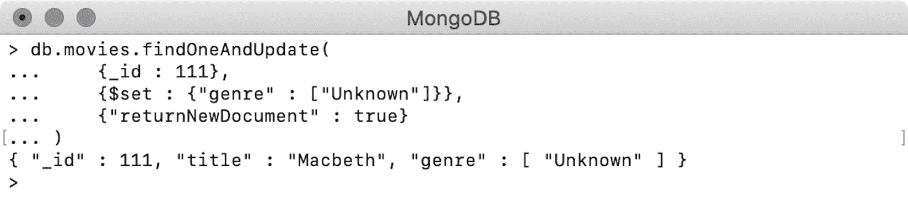
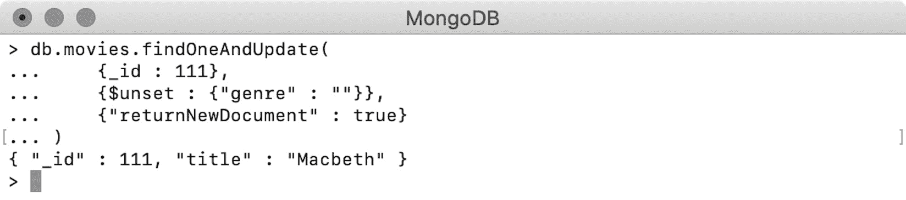
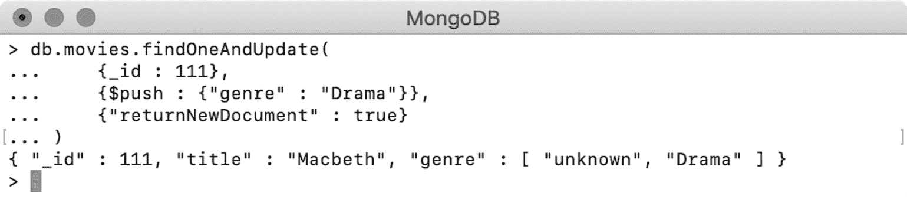
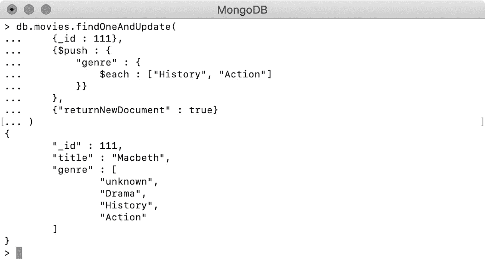
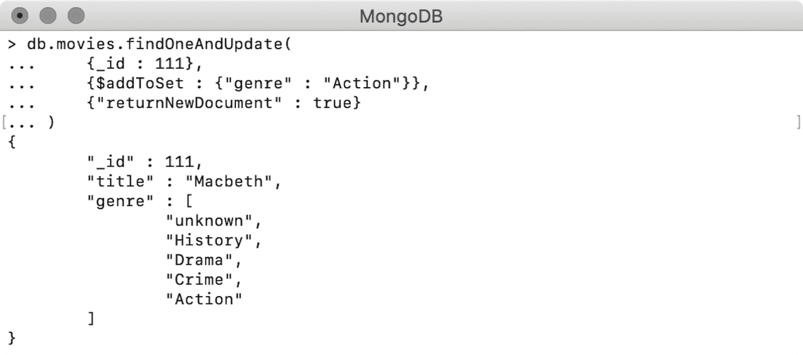
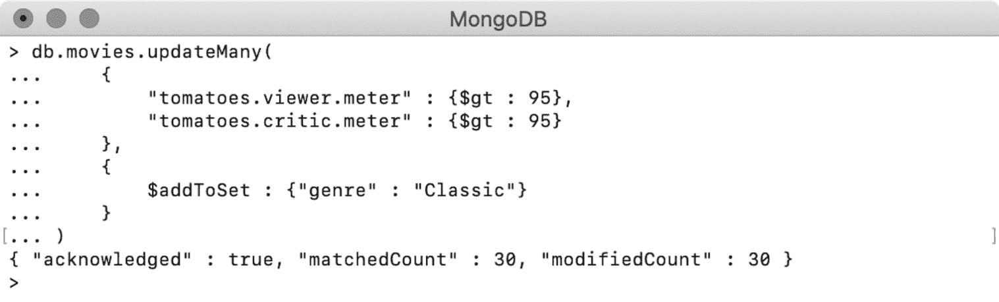
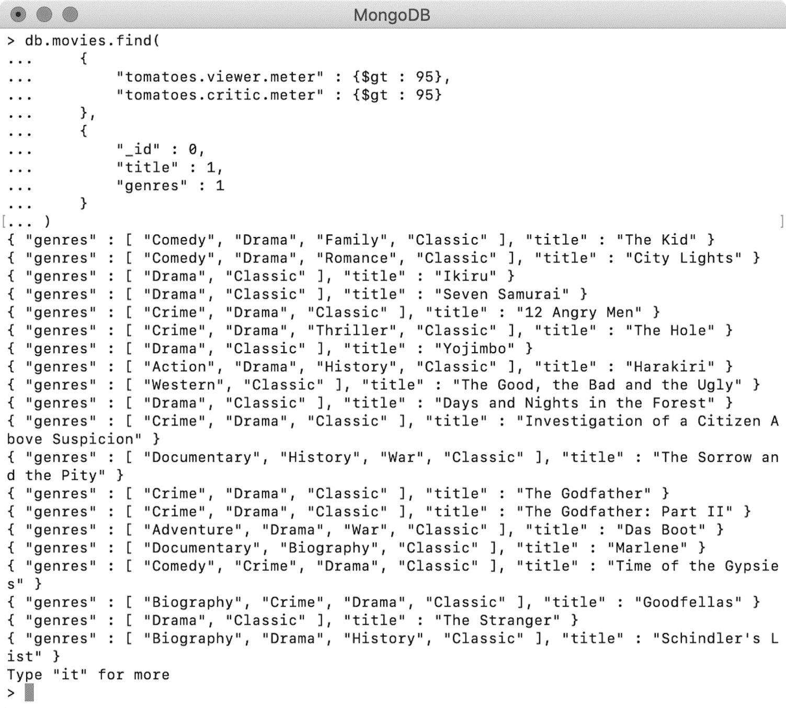
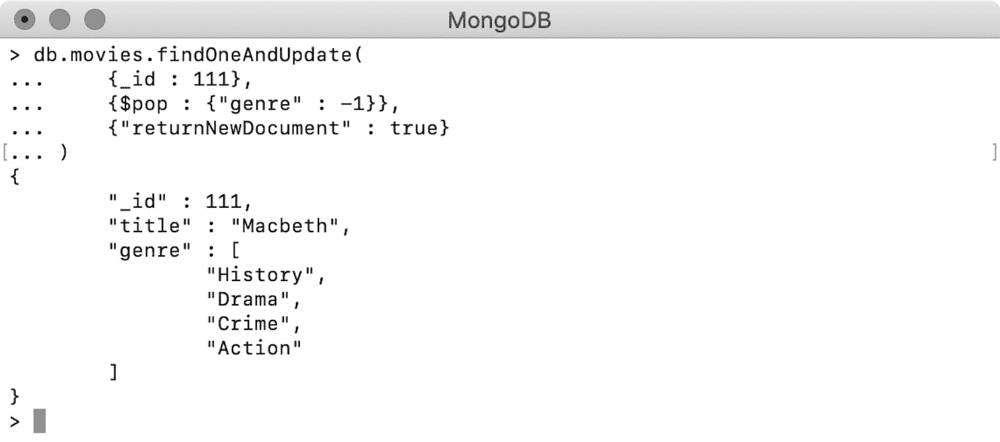
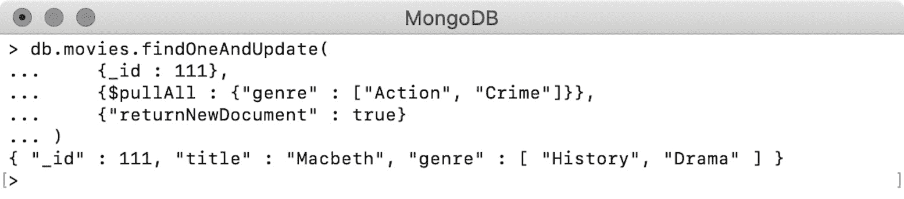

# 6。使用聚合管道和阵列进行更新

概述

本章向您介绍 MongoDB 中更新操作的两个附加功能。您将首先学习如何使用管道支持执行一些复杂的更新操作。使用管道支持，您将能够编写一个多步骤更新表达式，还可以引用其他字段的值。接下来，本章将介绍文档中数组字段的更新，包括向数组中添加元素、更新或删除所有或特定元素、将数组创建为一个集合以及对数组元素进行排序。您将练习将唯一元素推送到数组中，并将其元素排序作为最终活动的一部分。本章结束时，您将能够基于其他字段的值派生更新表达式，并操作集合文档中的数组字段。

# 导言

到目前为止，我们已经介绍了使用各种操作符准备查询表达式的查询。我们还学习了如何创建、删除和修改集合中的文档，使用了各种删除和更新功能，并考虑了它们的差异和可用性。我们还介绍了如何替换文档以及如何使用一些更新操作符执行 upsert 操作。现在是时候使用聚合管道支持实践更复杂的更新操作，并学习如何修改文档中的数组。

本章将从 MongoDB 管道支持开始，我们将简要介绍聚合管道以及它如何帮助您执行更复杂的更新操作。然后我们将介绍如何更新数组字段，如何添加和排序现有数组的元素，以及如何将数组用作一组唯一的元素。接下来，您将学习如何从数组中删除第一个、最后一个或另一个特定元素。最后，您将学习如何使用查询条件准备数组过滤器，并使用它仅修改数组中的特定元素。

## 使用聚合管道进行更新（MongoDB 4.2）

在上一章中，我们介绍了用于修改一个或多个文档中的字段的更新函数。我们还使用各种操作符编写了许多更新操作。正如您在示例中所看到的，在为字段分配新值的情况下，我们要么使用硬编码值（例如，在更新**num_mflix_comments**时），要么使用诸如**$inc**之类的运算符动态导出值。但是，在更复杂的更新操作中，可能需要使用基于其他字段值的动态派生字段。或者，更新操作可能涉及更新表达式的多个步骤。

在以前版本的 MongoDB 中，引用其他字段的值或编写多步骤更新操作是不可能的，但随着 MongoDB 4.2 的发布，其所有更新功能都开始支持聚合管道。*第 7 章*、*聚合管道*中的**细节**将介绍聚合管道和各种聚合运营商。现在，我们将讨论限制在使用管道支持编写更新表达式。

管道由多个称为阶段的更新表达式组成。当执行包含更新表达式的多个阶段的更新操作时，每个匹配的文档都会依次通过每个阶段进行处理和转换。第一阶段的输出是下一阶段的输入，直到管道中的最后一阶段产生最终输出。除了编写多阶段更新表达式外，管道支持还允许在更新表达式中使用字段引用。

在以前的更新表达式中，我们在字段上设置了硬编码值，或者对于数值字段，我们使用了各种运算符来操纵其现有值。但是，使用管道支持，我们可以读取和使用更新表达式中其他字段的值。

下面的代码片段显示了在**updateMany（）**中使用聚合管道的语法。这与所有其他更新功能相同：

```js
db.collection.updateMany(
    <query condition>, 
    [<update expression 1>, <update expression 2>, ...],
    <options>
)
```

您可能已经注意到，函数的第二个参数指定了一个更新表达式，现在是多个更新表达式或阶段的数组。如上所述，该语法仅在 MongoDB 版本为 4.2 或更高版本时有效。如果提供了具有单个更新表达式的文档，则它将作为普通的更新命令执行，而不是传递数组。

让我们考虑聚合管道如何允许我们编写复杂的更新查询，并使我们能够使用字段表达式和聚合操作。在上一章的示例中，我们一直在使用*CH05*数据库，并将在这里继续使用它。如果您已经拥有**用户**集合，请先删除其所有元素，然后再向其中插入两条记录。

让我们将以下记录添加到集合中：

```js
db.users.insertMany([
    {_id: 1, full_name : "Arya Stark"}, 
    {_id: 2, full_name : "Khal Drogo"}
])
```

两个文档都有一个**id**和**全名**字段，由名字和姓氏组成，用空格分隔。我们将编写一个更新命令，将全名拆分为名字和姓氏的相应字段，并更新**全名**字段，以便只有名字以大写形式出现：

```js
db.users.updateMany(
    {},
    [
        {
            $set : {"name_array" : {$split : ["$full_name", " "]}},
        },
        {
            $set: {
                "first_name" : {"$arrayElemAt" : ["$name_array", 0]},
                "last_name" : {"$arrayElemAt" : ["$name_array", 1]}
            }
        },
        {
            $project : {
                "first_name" : 1,
                "last_name" : 1,
                "full_name" : {
                    $concat : [{$toUpper : "$first_name"}, " ", "$last_name"]
                }
            }
        }
    ]
)
```

这里，**updateMany（）**操作正在更新**用户**集合中的所有文档。函数的第二个参数是包含三个阶段的数组（**$set**、**$set**和**$project**）。现在，我们将经历这些阶段并探索管道。

笔记

**$project**、**$arrayElemAt**、**$concat**等运营商为聚合运营商。这些运算符不能在早于 MongoDB 4.2 的版本上使用，也不能在不属于聚合管道的更新表达式中使用。

### 第一阶段（套）

在这个阶段中，我们使用**$split**操作符将全名拆分为一个空格。这为我们提供了一个包含名字和姓氏的两元素数组。我们还使用**$set**操作符创建了一个新的**名称 _ 数组**字段，并将新创建的数组分配给它。**name_array**对我们来说是一个临时字段。

### 第二阶段（套）

在这个阶段中，我们引用存储在**name_array**中的数组，并为名字和姓氏创建新字段。为此，我们在名称数组上使用**$arrayElemAt**从特定索引位置获取其元素。使用第零个位置元素创建名为**姓氏**的新字段，使用第一个索引位置元素创建**姓氏**字段。在该阶段结束时，每个用户的文档将有**名**、**姓**、**名**数组以及原始**全名**字段。

### 第三阶段（项目）

在最后一个阶段，我们对字段进行了投影。我们明确包含**名**和**姓**字段，并通过将**名**大写和**姓**串联，重写**全名**；请注意，我们不会更改**姓**的大小写。

**$toUpper**运算符引用**first_name**的值，并返回相同的大写字符串。**$concat**运算符接受字符串数组，并通过以相同顺序连接所有元素来返回单个字符串。在这里，我们将大写的**名**和**姓**连接在一起。

**$project**操作符用于项目字段并分配字段。在这个阶段，我们投射了**名**、**姓**和**全名**，这意味着**名**将自动省略：


图 6.1：使用管道支持进行更新

前面的输出显示操作成功。它匹配了两份文件，并对其进行了修改。现在，我们将查询文档并查看它们是否已正确更新：

```js
> db.users.find({}, {_id : 0})
{ "first_name" : "Arya", "last_name" : "Stark", "full_name" : "ARYA Stark" }
{ "first_name" : "Khal", "last_name" : "Drogo", "full_name" : "KHAL Drogo" }
```

在这里，**find**查询和输出显示文档被正确修改。原始全名正确地分为名和姓。此外，**全名**字段中的名字也是大写的。

在本节中，我们研究了如何使用 MongoDB 4.2 提供的管道阶段和聚合操作符支持编写复杂的更新命令。我们还了解到，这些阶段是按顺序执行的，一个阶段的输出将成为下一个阶段的输入。

# 更新数组字段

在前面的部分中，我们了解了如何更新一个或多个 MongoDB 文档中的字段。我们还学习了如何使用各种操作符编写更新表达式，以及如何使用 MongoDB 管道支持。在本节中，我们将学习如何从文档中更新数组字段。

为了尝试对数组字段进行一些基本的更新操作，我们将在**电影**集合中插入以下文档：

```js
db.movies.insert({"_id" : 111, "title" : "Macbeth"})
```

文档只有一个**标题**字段，不包含数组，我们试着创建一个：

```js
db.movies.findOneAndUpdate(
    {_id : 111},
    {$set : {"genre" : ["Unknown"]}},
    {"returnNewDocument" : true}
)
```

前面的操作在**类型**字段中使用**$set**。**流派**的值是一个单元素数组-**[“未知”]【T7]。可以在此处看到输出：**



图 6.2：更新数组字段的值

输出显示创建了**类型**字段，并为其分配了给定数组的值。接下来，我们将从文档中删除字段，如下所示：

```js
db.movies.findOneAndUpdate(
    {_id : 111},
    {$unset : {"genre" : ""}},
    {"returnNewDocument" : true}
)
```

前面的更新命令使用**$unset**删除**类型**字段。您可以在此处看到输出：



图 6.3：删除阵列字段

输出表明该字段已从文档中正确删除。从这两个示例中可以清楚地看出，当使用数组作为值更新数组字段时，它将被视为其他任何字段。接下来，我们将了解如何操作数组元素。

我们已经了解了如何使用数组值更新字段。当我们想要完全替换数组值时，它非常有用。但是，要向数组添加更多元素，可以使用名为**$push**的操作符。运算符将给定元素推送到数组的末尾，如果给定字段不存在，则创建该字段。让我们在下一个练习中使用它。

## 练习 6.01：向数组添加元素

在本练习中，您将使用以下步骤向阵列添加元素：

1.  To insert a single document, add the following command:

    ```js
    db.movies.findOneAndUpdate(
        {_id : 111},
        {$push : {"genre" : "unknown"}},
        {"returnNewDocument" : true}
    )
    ```

    前面代码段中的更新操作通过其**id**值查找文档，并将元素推送到**类型**数组中。文档中当前缺少此字段。您应该看到以下输出：

    

    图 6.4：向数组中添加一个元素

2.  As shown here, the **genre** array field is created successfully, and the given element is added to the array. Now add one more genre, as follows:

    ```js
    db.movies.findOneAndUpdate(
        {_id : 111},
        {$push : {"genre" : "Drama"}},
        {"returnNewDocument" : true}
    )
    ```

    前面的命令插入了另一种类型，**戏剧**。您可以在这里看到输出，这表明**戏剧**元素已添加到现有数组的末尾：

    

图 6.5：向数组中添加另一个元素

在本练习中，我们讨论了添加单个元素。在下一节中，我们将一次添加多个元素。

## 添加多个元素

正如我们所看到的，**$push**可以一次添加一个元素。要在一个更新命令中将多个元素添加到一个数组中，我们必须使用**$push**以及**$each**。以下是此操作的语法：

```js
$push : {<field_name> : {$each : [<element 1>, <element2>, ..]}}
```

需要附加到数组的元素以数组的形式提供给**$each**操作符。当执行这样的更新表达式时，**$each**迭代每个元素，并将元素推送到数组中：

```js
db.movies.findOneAndUpdate(
    {_id : 111},
    {$push : {
        "genre" : {
            $each : ["History", "Action"]
        }}
    },
    {"returnNewDocument" : true}
)
```

前面的更新操作通过其**id**字段查找并更新文档，并使用**$push**向**类型**字段添加元素。我们通过将这两个元素分别提供给**$**来向数组中添加两个元素：



图 6.6：将多个元素推入阵列

响应中的文档（请参见前面的屏幕截图）表明这两个元素都正确地追加到数组的末尾，并且以相同的顺序添加。

## 排序数组

MongoDB 中的数组通常是有序但未排序的元素集合。换句话说，数组的元素将始终保持插入顺序。但是，在使用**$push**执行更新命令时，我们还可以对数组进行排序。要做到这一点，我们必须使用**$sort**操作符，其中**$each**。在前面的示例中，我们向**类型**数组添加了四个元素。现在，我们将尝试按字母顺序对数组进行排序：

```js
db.movies.findOneAndUpdate(
    {_id : 111},
    {$push : {
        "genre" : {
            $each : [],
            $sort : 1
        }}
    },
    {"returnNewDocument" : true}
)
```

在前面的命令中，我们在**类型**字段中使用**$push**。需要注意的一点是，此查询没有将任何元素推送到数组中，因为没有向**$each**操作符提供任何元素。新的**$sort**操作符被赋值为**1**，表示升序：


图 6.7：对数组进行排序

如图所示，**类型**数组现在按照元素的升序按字母顺序排序。在上一个示例中，我们对数组进行了排序，但没有向其中添加元素，但是我们也可以在将一个或多个元素插入数组时执行排序。在这种情况下，新元素将添加到数组中，数组将根据给定的排序顺序进行排序。考虑下面的片段：

```js
db.movies.findOneAndUpdate(
    {_id : 111},
    {$push : {
        "genre" : {
            $each : ["Crime"],
            $sort : -1
        }}
    },
    {"returnNewDocument" : true}
)
```

在这个更新命令中，我们将一个新元素**Crime**传递给流派。注意，**$sort**操作符的值为**-1**。当我们执行这个命令时，新元素将被添加到数组中，数组将按字母降序排序。这将产生以下输出：


图 6.8：排序数组并将元素推入其中

从回应中我们可以看到，数组按降序排列，新元素**犯罪**是**类型**数组的一部分。如果不提供**$sort**操作符，新元素将附加到数组的末尾。在前面的两个示例中，**类型**数组包含纯字符串元素。但是，如果有一个包含多个字段的对象数组，则可以根据嵌套对象的字段执行排序。考虑以下记录中的一个项目：

```js
> db.items.insert({_id : 11, items: [
    {"name" : "backpack", "price" : 127.59, "quantity" : 3},
    {"name" : "notepad", "price" : 17.6, "quantity" : 4},
    {"name" : "binder", "price" : 18.17, "quantity" : 2},
    {"name" : "pens", "price" : 60.56, "quantity" : 3},

]})
WriteResult({ "nInserted" : 1 })
```

**项**字段是一个由四个对象组成的数组，每个对象包含三个字段。我们现在将按价格对阵列进行排序：

```js
db.items.findOneAndUpdate(
    {_id : 11},
    {$push : {
        "items" : {
            $each : [],
            $sort : {"price" : -1}
        }}
    },
    {"returnNewDocument" : true}
)
```

update 命令查找一个文档并对数组字段进行排序。与前面的示例不同，这次我们希望根据元素的嵌套字段对元素进行排序：


图 6.9：根据嵌套字段的值对数组进行排序

请注意已修改文档中的数组字段。所有元素现在都按价格降序排列。在下一节中，我们将学习如何在 MongoDB 中将数组用作集合。

## 一个数组作为一个集合

数组是元素的有序集合，可以使用其特定的索引位置对其进行迭代或访问。集合是唯一元素的集合，其顺序不受保证。MongoDB 只支持普通数组，不支持其他类型的集合。但是，您可能希望数组仅包含唯一的元素。MongoDB 通过使用**$addToSet**操作符提供了一种实现这一点的方法。

**$addToSet**操作符类似于**$push**，唯一的区别是，只有当一个元素不存在时才会被推送。此运算符不会更改基础数组，但可确保只将唯一元素推入其中。目前，我们**电影**系列中的电影**麦克白**的文档如下：

```js
> db.movies.find({"_id" : 111}).pretty()
{
    "_id" : 111,
    "title" : "Macbeth",
    "genre" : [
        "unknown",
        "History",
        "Drama",
        "Crime",
        "Action"
    ]
}
```

**类型**数组是一个非常好的例子，您希望数组具有唯一的元素，因为电影的重复类型没有意义。考虑下面的片段：

```js
db.movies.findOneAndUpdate(
    {_id : 111},
    {$addToSet : {"genre" : "Action"}},
    {"returnNewDocument" : true    }
)
```

这里，更新操作使用**$addToSet**推送**体裁**数组中的**动作**元素。请注意，元素已经是数组的一部分：



图 6.10：将元素作为集合添加到数组中

正如前面的屏幕截图所示，**Action**元素没有被推送到数组中，因为数组已经包含了它。即使我们使用**$each**将多个元素推入一个数组中，同样的行为也很明显。例如，考虑这个片段：

```js
db.movies.findOneAndUpdate(
    {_id : 111},
    {$addToSet : {
        "genre" : {
            $each : ["History", "Thriller", "Drama"]
        }}
    },
    {"returnNewDocument" : true}
)
```

在这里，我们使用**$每个**向数组添加三种类型，其中只有中间一种是新的：


图 6.11：将多个元素作为一个集合添加到数组中

修改后的文档确认，只有新类型**颤栗**被添加到阵列中。

## 练习 6.02：经典电影新类别

最近，由于**卡萨布兰卡**的重新上映，对经典电影的需求已经相当高涨。贵公司的分析部门发现，不足为奇的是，经典电影是唯一一部影评人和观众评分都在 95 分以上的电影。因此，您的公司希望将数据库中的所有电影分配到一种新类型，称为“经典”。在您的电影文档中，番茄评级示例如下所示：

```js
"tomatoes" : {
"viewer" : {
        "rating" : 3.7,
        "numReviews" : 2559,
        "meter" : 75
    },
"fresh" : 6,
    "critic" : {
        "rating" : 7.6,
        "numReviews" : 6,
        "meter" : 100
    },
    "rotten" : 0,
    "lastUpdated" : ISODate("2015-08-08T19:16:10Z")
}
```

您的任务是在**查看器**和**批评家**子对象的米字段中放置一个过滤器，以查找经典电影并将其指定为新类型。以下步骤将帮助您完成此练习：

1.  打开文本编辑器并开始编写查询。您需要准备一个更新命令来更新多个文档，因此请使用**updateMany（）**：

    ```js
    db.movies.updateMany()
    ```

2.  The first criterion in finding movies is that the tomato meter rating from viewers needs to be more than **95**. Type in the following command:

    ```js
    db.movies.updateMany(
        {"tomatoes.viewer.meter" : {$gt : 95}}
    )
    ```

    在这里，您已经向查看器仪表添加了一个过滤器。由于该字段嵌套在嵌套字段中，因此使用了相应的点符号。

3.  According to the second criterion, you need to put the same filter on the **critic** ratings. Add the second criterion to the query, as follows:

    ```js
    db.movies.updateMany(
        {
            "tomatoes.viewer.meter" : {$gt : 95}, 
            "tomatoes.critic.meter" : {$gt : 95}
        }
    )
    ```

    在前面的命令中，您已将相同的过滤器添加到了该表中。该命令现在具有所有必需的筛选器。

4.  Now, create an update expression to add a new genre called **Classic** to all the matching movies:

    ```js
    db.movies.updateMany(
        {
            "tomatoes.viewer.meter" : {$gt : 95}, 
            "tomatoes.critic.meter" : {$gt : 95}
        },
        {
            $addToSet : {"genres" : "Classic"}
        }
    )
    ```

    现在，您已经添加了更新表达式。请注意，数组中的类型应该始终是唯一的，因此您可以使用**$addToSet**而不是**$push**将**经典**元素添加到**类型**数组中。

5.  Now, open a MongoDB shell and connect to the Mongo Atlas cluster, and then go to the **sample_mflix** database. Execute the preceding command on the database. The output should be as follows:

    

    图 6.12：添加新类型

    您可以看到，所有 30 条记录都已成功更新。

6.  To verify this, write a **find** query using the same condition and project the essential fields with the following command:

    ```js
    db.movies.find(
        {
            "tomatoes.viewer.meter" : {$gt : 95},
            "tomatoes.critic.meter" : {$gt : 95}
        },
        {
            "_id" : 0,
            "title" : 1,
            "genres" : 1
        }
    )
    ```

    此处的**查找**查询使用相同的过滤器，仅显示**标题**和**类型**字段。您可以看到如下输出：

    

图 6.13：显示属于经典类型电影的输出

输出表明所有电影现在都有了新的类型，**经典**。在本练习中，您将集合的概念用于业务用例。在下一节中，让我们看一下数组元素的删除。

## 移除阵列元素

到目前为止，我们已经研究了向数组中添加元素和使用各种运算符对数组进行排序的各种方法。MongoDB 还提供了从数组中删除元素的方法。在本节中，我们将介绍允许您从数组中删除所有或特定元素的不同运算符。

### 移除第一个或最后一个元素（$pop）

**$pop**运算符在 update 命令中使用时，允许删除数组中的第一个或最后一个元素。它一次删除一个元素，只能与值**1**（用于最后一个元素）或**-1**（用于第一个元素）一起使用：

```js
> db.movies.find({"_id" : 111}).pretty()
{
    "_id" : 111,
    "title" : "Macbeth",
    "genre" : [
        "unknown",
        "History",
        "Drama",
        "Crime",
        "Action",
        "Thriller"
    ]
}
```

前面片段中的输出显示电影记录在**类型**数组中有六个元素：

```js
db.movies.findOneAndUpdate(
    {_id : 111},
    {$pop : {"genre" : 1}},
    {"returnNewDocument" : true    }
)
```

前面的**findOneAndUpdate**操作使用**类型**字段上的**$pop**，值为**1**，这将从数组中删除最后一个元素。命令的所有其他方面与我们在前面的示例中看到的相同：


图 6.14：从数组中删除最后一个元素

修改后的文档表明最后一个元素（**Thriller**已成功从阵列中移除。现在，使用以下值为**$pop**的命令作为**-1**：

```js
db.movies.findOneAndUpdate(
    {_id : 111},
    {$pop : {"genre" : -1}},
    {"returnNewDocument" : true    }
)
```

让我们看看执行此命令时会发生什么：



图 6.15：从数组中删除第一个元素

输出显示数组的第一个元素（**‘未知’**现在已被删除。请记住，**$pop**只允许**1**或**-1**作为值，并且提供任何其他数字（包括零）都会导致错误。

### 拆除所有元件

当您只需要从数组中删除某些元素时，可以使用**$pullAll**操作符。为此，您需要向操作符提供一个或多个元素，然后操作符会从数组中删除这些元素的所有引用。例如，考虑以下命令：

```js
db.movies.findOneAndUpdate(
    {_id : 111},
    {$pullAll : {"genre" : ["Action", "Crime"]}},
    {"returnNewDocument" : true    }
)
```

在这个更新操作中，我们在**类型**字段中使用**$pullAll**。我们以数组的形式提供两个元素，**动作**和**犯罪**。其输出如下所示：



图 6.16：移除阵列的所有元素

我们可以看到，指定的类型**动作**和**犯罪**现在已从底层数组中移除。

### 移除匹配元素

在前面的示例中，我们看到了如何使用**$pullAll**从数组中删除特定元素。在本例中，我们将使用另一个名为**$pull**的运算符，使用各种逻辑和条件运算符编写查询条件，然后删除与查询匹配的数组元素。例如，考虑下面的代码段，其中阿纳尔 T4 项目的数组包含四个对象：

```js
> db.items.find({"_id" : 11}).pretty()
{
    "_id" : 11,
    "items" : [
        {
            "name" : "backpack",
            "price" : 127.59,
            "quantity" : 3
        },
        {
            "name" : "pens",
            "price" : 60.56,
            "quantity" : 3
        },
        {
            "name" : "binder",
            "price" : 18.17,
            "quantity" : 2
        },
        {
            "name" : "notepad",
            "price" : 17.6,
            "quantity" : 4
        }
    ]
}
```

现在，我们将编写一个查询，用**$pull**更新数组。请记住，它允许我们使用逻辑运算符和条件运算符的组合来准备查询条件，就像任何**查找**查询一样：

```js
db.items.findOneAndUpdate(
    {_id : 11},
    {$pull : {
        "items" : {
            "quantity" : 3,
            "name" : {$regex: "ck$"}
        }
    }},
    {"returnNewDocument" : true    }
)
```

在这个更新命令中，**$pull**操作符在数组字段**项**中提供了一个查询条件。条件过滤数组元素，其中**数量**为**3**，且**名称**以“ck”结尾。输出应如下所示：


图 6.17：删除与给定正则表达式匹配的元素

响应的文档显示，数量为**3**且名称以“ck”结尾的元素被删除，如预期的那样。现在让我们看一下更新数组元素。

## 更新数组元素

在数组中，每个元素都绑定到特定的索引位置。这些索引位置从零开始，我们可以使用一对方括号（**【**、**）和相应的索引位置来引用数组中的元素。将这样一对方括号与**$**一起使用可以更新数组的元素。考虑下面的代码片段，它显示了当前 Type T6 样式数组的外观：**

 **```js
> db.movies.find({"_id" : 111})
{ "_id" : 111, "title" : "Macbeth", "genre" : [ "History", "Drama" ] }
```

**类型**数组有两个元素，我们将使用以下命令更新这两个元素：

```js
db.movies.findOneAndUpdate(
    {_id : 111},
    {$set : {"genre.$[]" : "Action"}},
    {"returnNewDocument" : true}
)
```

在此操作中，我们在**体裁**字段中使用**$set**。该字段使用表达式**genre.$[]”**表达式引用，并提供值**Action**值。**$[][**运算符引用给定数组包含的所有元素，更新表达式将应用于所有元素：


图 6.18：替换阵列中的所有元素

作为回应，文档指出**类型**仍然是一个两元素数组。但是，这两个元素现在都更改为**动作**。因此，我们可以使用**$【】**以相同的值更新数组中的所有元素。

类似地，我们还可以更新数组中的特定元素。要做到这一点，我们首先需要找到这些元素并加以识别。为了导出元素标识符，我们可以使用**arrayFilters**的更新选项提供一个查询条件，并将一个变量（称为标识符）分配给匹配的元素。然后，我们使用标识符和**$[][]T3]来更新这些特定元素的值。为了查看此示例，我们将使用**items**集合中的文档，并向其数组中添加一个元素，如下所示：**

```js
> db.items.findOneAndUpdate(
    {"_id" : 11},
    {$push : {"items" : {"name" : "it"}}},
    {"returnNewDocument": true}
)
{
    "_id" : 11,
    "items" : [
        {
            "name" : "pens",
            "price" : 60.56,
            "quantity" : 3
        },
        {
            "name" : "binder",
            "price" : 18.17,
            "quantity" : 2
        },
        {
            "name" : "notepad",
            "price" : 17.6,
            "quantity" : 4
        },
        {
            "name" : "it"
        }
    ]
}
```

使用前面的**更新**命令，我们向数组中添加了一个新元素。请注意，新添加的元素没有**价格**和**数量**字段。在以下更新命令中，我们将查找并更新此数组中的元素：

```js
db.items.findOneAndUpdate(
    {_id : 11},
    {$set : {
        "items.$[myElements]" : {
            "quantity" : 7,
            "price" : 4.5,
            "name" : "marker"
        }
    }},
    {
        "returnNewDocument" : true,
        "arrayFilters" : [{"myElements.quantity" : null}]
    }
)
```

在前面的更新操作中，我们使用**$set**更新**项**数组的元素。要更新的数组元素由表达式**$[myElements]**引用，并分配一个新值，该值是嵌套对象。**myElements**的标识符是根据查询条件使用**数组过滤器**定义的。所有符合给定条件的元素都由**myElements**标识，然后使用**$set**更新：


图 6.19：更换与给定过滤器匹配的元件

**{quantity:null}**的查询条件与数组的最后一个元素匹配，并已用新文档更新。

## 练习 6.03：更新董事姓名

在你的电影网站上，人们可以通过片名或演员或导演的名字找到电影。本练习的任务是将其中一位导演的名字从**H.C.Potter**更新为**H.C.Potter（Henry Codman Potter）**，这样用户就不会将他与另一位同名导演混淆。请记住，一部电影或一系列电影可以由多人导演。数据库中的**董事**字段是一个数组，董事团队成员可以出现在任何索引位置：

```js
db.movies.find(
    {"directors" : "H.C. Potter"}, 
    {_id : 0, title: 1, directors :1}
).pretty()
```

此**find**命令按导演的缩写名查找所有电影，并打印电影标题，后跟导演的姓名：

1.  打开 mongo 外壳并连接到 mongo Atlas 集群上的**示例 _mflix**数据库。
2.  由于所有六部电影都需要更新，请使用**updateMany（）**更新功能。打开任意文本编辑器并编写以下命令：

    ```js
    db.movies.updateMany()
    ```

3.  Next, use the director's abbreviated name in the query condition, as follows:

    ```js
    db.movies.updateMany(
        {"directors" : "H.C. Potter"}
    )
    ```

    此命令仍然不完整，语法无效。到目前为止，您只在命令中添加了查询条件。

4.  Next, add the update expression. As you are changing a field here, use the **$set** operator in the array field. Also, to change only a specific element in an array, use an element identifier:

    ```js
    db.movies.updateMany(
        {"directors" : "H.C. Potter"},
        {$set : {
            "directors.$[hcPotter]" : "H.C. Potter (Henry Codman Potter)"
        }}
    )
    ```

    在前面的（但仍然不完整）命令中，您添加了一个更新表达式，该表达式在数组上使用了**$set**运算符。请注意，**hcPotter**标识符所指的数组元素被赋予了新的值，即**Henry Codman Potter**。

5.  Now that you have used an element identifier in the update expression, define the identifier using **arrayFilters** as follows:

    ```js
    db.movies.updateMany(
        {"directors" : "H.C. Potter"},
        {$set : {
            "directors.$[hcPotter]" : "H.C. Potter (Henry Codman Potter)"
        }},
        {
            "arrayFilters" : [{hcPotter : "H.C. Potter"}]
        }
    )
    ```

    从前面的代码片段可以看出，您添加了一个选项**arrayFilters**。**hcPotter**的标识符被赋予一个值**H.C.Potter**——数组中当前存在的值。

6.  Now, open the mongo shell and connect to the MongoDB Atlas cluster. Use the database of **sample_mflix** and execute the preceding command.

    

    图 6.20：更新董事姓名

    输出表明所有六条记录都已找到并正确更新。

7.  Now, find the director's movies with his full name using a regular expression in the **directors** field:

    ```js
    db.movies.find(
        {"directors" : {$regex : "Henry Codman Potter"}}, 
        {_id : 0, title: 1, directors :1}
    ).pretty()
    ```

    查询使用正则表达式根据导演的全名查找导演的电影：

    

图 6.21：显示控制器正确名称的输出

输出表明您已在所有记录中正确更新了控制器的名称。在本练习中，您练习了使用阵列过滤器仅修改阵列中的匹配元素。

在本节中，我们研究了如何更新文档中的数组字段。我们学习了添加新元素、从数组中删除元素以及更新数组中的特定元素。我们还学习了如何将数组视为一个集合，并对数组中的现有元素或新元素进行排序。

## 活动 6.01：在演员阵容中添加演员姓名

最近，您注意到数据库中的一个错误。演员尼克·罗宾逊在 2015 年的电影《侏罗纪世界》中扮演**扎克**的角色。但是，电影记录中的**演员**字段并未将该演员归于该电影：


图 6.22：仅显示电影的演员阵容

如前一屏幕截图所示，输出确认缺少演员的姓名。本次活动的任务是将**尼克·罗宾逊**加入本片演员阵容，并按演员姓名对该阵列进行排序。作为最佳实践，您还应该确保**cast**数组具有唯一的值。以下步骤将帮助您完成此活动：

1.  基于电影标题准备查询表达式并向其添加更新表达式。由于必须避免重复插入，因此应使用**$addToSet**运算符将数组视为一个集合。
2.  接下来，需要对数组进行排序。由于集合被视为唯一且无序元素的集合，因此在使用**$addToSet**时无法对元素进行排序。因此，首先将元素推送到唯一元素数组中。
3.  最后，创建另一个 update 命令并对所有数组进行排序。

在本活动中，您将唯一元素添加到数组并对其进行排序。您还验证了不可能将元素作为集合添加到数组中，同时对其进行排序。

笔记

此活动的解决方案可通过[此链接](14.html#_idTextAnchor471)找到。

# 总结

本章开始时，我们学习了如何使用聚合管道支持更新文档。MongoDB 版本 4.2 中引入的管道支持帮助我们执行一些复杂的更新。使用管道支持，我们可以编写多阶段更新表达式，其中阶段的输出作为下一阶段的输入提供。它还允许我们使用字段引用和聚合运算符。我们还学习了如何操作数组字段中的元素，如何添加、删除和更新数组中的元素，如何对数组进行排序，以及如何仅向数组添加唯一的元素。

在下一章中，我们将详细了解 MongoDB 聚合框架和管道。**