# 7。数据聚合

概述

本章向您介绍聚合的概念及其在 MongoDB 中的实现。您将学习如何识别 aggregate 命令的参数和结构，使用主聚合阶段组合和操作数据，使用高级聚合阶段处理大型数据集，以及优化和配置聚合以获得查询的最佳性能。

# 导言

在前面的章节中，我们学习了与 MongoDB 交互的基本原理。通过这些基本操作（**插入**、**更新**和**删除**），我们现在可以像处理任何其他数据库一样开始探索和处理我们的数据。我们还观察到，通过充分利用**find**命令选项，我们可以使用操作员回答有关数据的更具体问题。我们还可以对查询进行排序、限制、跳过和投影，以创建有用的结果集。

在更直接的情况下，这些结果集可能足以回答您想要的业务问题或满足用例。然而，更复杂的问题需要回答更复杂的查询。仅使用**find**命令解决此类问题将极具挑战性，并且可能需要多次查询或客户端的一些处理来组织或链接数据。

基本限制是数据包含在两个单独的集合中。要找到正确的数据，您必须运行两个查询，而不是一个查询，在客户端或应用程序级别连接数据。这似乎不是什么大问题，但随着应用程序或数据集规模的增加，性能和复杂性也会增加。只要有可能，服务器就可以完成所有繁重的工作，只返回我们在单个查询中查找的数据。这就是**聚合管道**的用武之地。

**聚合管道**正是顾名思义。它允许您定义一系列阶段来过滤、合并和组织数据，比标准的**查找**命令具有更多的控制。除此之外，聚合的管道结构允许开发人员和数据库分析师轻松、迭代和快速地在不断变化和增长的数据集上构建查询。如果您想在 MongoDB 中大规模地完成任何重要的事情，您需要编写复杂的、多阶段的聚合管道。在本章中，我们将确切地了解如何做到这一点。

笔记

在本章期间，包含的练习和活动是单个场景的迭代。数据和示例基于 MongoDB Atlas 样本数据库**sample_mflix**。

考虑一个电影公司经营年度经典电影马拉松的场景，并试图决定他们的阵容应该是什么。他们需要满足特定标准的各种流行电影来满足他们的客户群。公司要求你研究并确定他们应该放映的电影。在本章中，我们将使用聚合来检索给定一组复杂约束的数据，然后转换和操作数据以创建新结果，并通过单个查询回答整个数据集的业务问题。这将有助于电影公司决定他们应该放映什么电影来满足他们的客户。

值得注意的是，聚合管道足够健壮，可以通过多种方式完成相同的任务。本章介绍的练习和活动只是提出的场景的一种解决方案，可以使用不同的模式来解决。掌握聚合流水线的最好方法是考虑多种方法来解决同样的问题。

# 骨料是新发现

MongoDB 中的**聚合**命令类似于**查找**命令。您可以以 JSON 文档的形式提供查询条件，并输出包含搜索结果的**光标**。听起来很简单，对吧？那是因为它是。虽然聚合可以变得非常大和复杂，但在其核心，它们相对简单。

聚合中的关键元素称为管道。我们稍后将详细介绍它，但在较高的层次上，管道是一系列指令，其中每条指令的输入是前一条指令的输出。简言之，聚合是一种方法，用于获取一个集合，并以过程方式过滤、转换和连接来自其他集合的数据，以创建新的、有意义的数据集。

## 聚合语法

**聚合**命令对集合进行操作，就像其他**创建、读取、更新、删除**（**CRUD**命令）一样，如下所示：

```js
use sample_mflix;
var pipeline = [] // The pipeline is an array of stages.
var options  = {} // We will explore the options later in the   chapter.
var cursor   = db.movies.aggregate(pipeline, options);
```

有两个参数用于聚合。**管道**参数包含查找、排序、投影、限制、转换和聚合数据的所有逻辑。**管道**参数本身作为 JSON 文档数组传入。您可以将其视为发送到数据库的一系列指令，然后在最后阶段后生成的数据存储在**光标**中，以返回给您。管道中的每个阶段都是独立完成的，一个接一个，直到没有剩余。第一阶段的输入是集合（**电影**在上例中），每个后续阶段的输入是前一阶段的输出。

第二个参数是**选项**参数。这是可选的，允许您指定配置的详细信息，例如聚合应该如何执行，或者在调试和构建管道期间需要的一些标志。

**聚合**命令中的参数小于**查找**命令中的参数。我们将把**选项**作为本章的最后一个主题，因此现在我们可以通过完全排除**选项**来简化我们的命令，如下所示：

```js
var cursor = db.movies.aggregate(pipeline);
```

在前面的示例中，我们不是将管道直接写入命令，而是首先将管道保存为变量。聚合管道可能会变得非常大，并且在开发过程中很难解析。为了代码的清晰性，有时将管道（甚至管道的大部分）分离成单独的变量是很有帮助的。尽管建议使用此模式，但它是完全可选的，与以下模式类似：

```js
var cursor = db.movies.aggregate([])
```

建议您在代码或文本编辑器中遵循这些示例，保存脚本，然后将它们复制并粘贴到 MongoDB shell 中。例如，假设我们创建一个名为**aggregation.js**的文件，其内容如下：

```js
var MyAggregation_A = function() {
    print("Running Aggregation Script Ch7.1");
    var pipeline = [];
      // This next line stores our result in a cursor.
    var cursor = db.movies.aggregate(pipeline);
      // This line will print the next iteration of our cursor.
    printjson(cursor.next())
};
MyAggregation_A();
```

然后，将此代码直接复制到 MongoDB shell 中会返回以下输出：

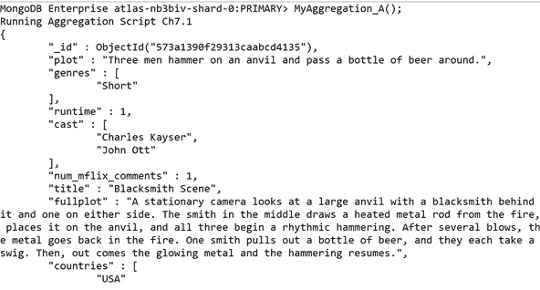

图 7.1：聚合结果（为简洁起见，输出被截断）

我们可以在这个输出中看到，一旦定义了**MyAggregation_A.js**函数，我们只需再次调用该函数即可查看聚合结果（在本例中，是电影列表）。您可以一次又一次地调用此函数，而不必每次都写入整个管道。

通过这种方式构建聚合，您不会丢失任何聚合。它还有一个额外的好处，即允许您将所有聚合作为函数以交互方式加载到 shell 中。但是，如果愿意，也可以将整个函数复制并粘贴到 MongoDB shell 中，或者以交互方式输入。在本章中，我们将混合使用这两种方法。

## 聚合管道

如前所述，聚合中的关键元素是管道，它是对初始集合执行的一系列指令。您可以将数据视为流经此管道的水，在每个阶段进行转换和过滤，直到最终从管道末端倒出。

在下图中，橙色块表示聚合管道。管道中的每个块都称为聚合阶段：


图 7.2：聚合管道

关于聚合需要注意的是，尽管管道总是从一个集合开始，但使用某些阶段，我们可以在管道中进一步添加集合。我们将在本章后面介绍加入收藏。

大型多阶段管道可能看起来很吓人，但如果您了解命令的结构以及在给定阶段可以执行的单个操作，则可以轻松地将管道分解为更小的部分。在第一个主题中，我们将探讨聚合管道的构造，比较使用**find**实现的查询与使用**aggregate**创建的查询，并确定一些基本运算符。

## 管道语法

聚合管道的语法非常简单，很像**aggregate**命令本身。管道是一个数组，数组中的每个项都是一个对象：

```js
var pipeline = [
        { . . . },
        { . . . },
        { . . . },
];
```

数组中的每个对象表示整个管道中的一个阶段，这些阶段按其数组顺序（从上到下）执行。每个阶段对象采用以下形式：

```js
{$stage : parameters}
```

stage 表示我们要对数据执行的操作（例如**limit**或**sort**，参数可以是单个值，也可以是另一个对象，具体取决于 stage。

管道可以通过两种方式传递，既可以作为保存的变量传递，也可以直接作为命令传递。以下示例演示如何将管道作为变量传递：

```js
var pipeline = [
        { $match:   { "location.address.state": "MN"} },
        { $project: { "location.address.city": 1    } },
        { $sort:    { "location.address.city": 1    } },
        { $limit: 3 }
     ];
```

然后，在 MongoDB shell 中输入**db.theaters.aggregate（pipeline）**命令将提供以下输出：

```js
MongoDB Enterprise atlas-nb3biv-shard-0:PRIMARY> var pipeline = [
...         { $match:   { "location.address.state": "MN"} },
...         { $project: { "location.address.city": 1    } },
...         { $sort:    { "location.address.city": 1    } },
...         { $limit: 3 }
...      ];
MongoDB Enterprise atlas-nb3biv-shard-0:PRIMARY> 
MongoDB Enterprise atlas-nb3biv-shard-0:PRIMARY> db.theaters.aggregate(pipeline)
{ "_id" : ObjectId("59a47287cfa9a3a73e51e94f"), "location" :   { "address" : { "city" : "Apple Valley" } } }
{ "_id" : ObjectId("59a47287cfa9a3a73e51eb8f"), "location" :   { "address" : { "city" : "Baxter" } } }
{ "_id" : ObjectId("59a47286cfa9a3a73e51e833"), "location" :   { "address" : { "city" : "Blaine" } } }
MongoDB Enterprise atlas-nb3biv-shard-0:PRIMARY>
```

将其直接传递到命令中，输出将如下所示：

```js
MongoDB Enterprise atlas-nb3biv-shard-0:PRIMARY> db   .theaters.aggregate([
... ...         { $match:   { "location.address.state": "MN"} },
... ...         { $project: { "location.address.city": 1    } },
... ...         { $sort:    { "location.address.city": 1    } },
... ...         { $limit: 3 }
... ...      ]
... );
{ "_id" : ObjectId("59a47287cfa9a3a73e51e94f"), "location" :   { "address" : { "city" : "Apple Valley" } } }
{ "_id" : ObjectId("59a47287cfa9a3a73e51eb8f"), "location" :   { "address" : { "city" : "Baxter" } } }
{ "_id" : ObjectId("59a47286cfa9a3a73e51e833"), "location" :   { "address" : { "city" : "Blaine" } } }
MongoDB Enterprise atlas-nb3biv-shard-0:PRIMARY> 
```

如您所见，使用这两种方法都可以获得相同的输出。

## 创建聚合

让我们开始探索管道本身。当粘贴到 MongoDB shell 中时，以下代码将帮助我们获得明尼苏达州（MN）所有剧院的列表：

```js
var simpleFind = function() {
    // Find command using filter, project, sort and limit.
    print("Find Result:")
    db.theaters.find(
        {"location.address.state" : "MN"}, 
        {"location.address.city" : 1})
    .sort({"location.address.city": 1})
    .limit(3)
    .forEach(printjson);
}
simpleFind();
```

这将为我们提供以下输出：

```js
MongoDB Enterprise atlas-nb3biv-shard-0:PRIMARY> simpleFind();
Find Result:
{
        "_id" : ObjectId("59a47287cfa9a3a73e51e94f"),
        "location" : {
                "address" : {
                        "city" : "Apple Valley"
                }
        }
}
{
        "_id" : ObjectId("59a47287cfa9a3a73e51eb8f"),
        "location" : {
                "address" : {
                        "city" : "Baxter"
                }
        }
}
{
        "_id" : ObjectId("59a47286cfa9a3a73e51e7e2"),
        "location" : {
                "address" : {
                        "city" : "Blaine"
                }
        }
}
```

这种语法现在应该很熟悉了。这是一个非常简单的命令，因此让我们看看所涉及的步骤：

1.  匹配剧院集合以获得**MN**（明尼苏达州）所有剧院的列表。
2.  仅投影剧院所在的城市。
3.  按**城市**名称对列表进行排序。
4.  将结果限制在前**三个**影院。

让我们将此命令重建为聚合。如果一开始这看起来有点吓人，不要担心。我们将一步一步地介绍：

```js
var simpleFindAsAggregate = function() {
    // Aggregation using match, project, sort and limit.
    print ("Aggregation Result:")
    var pipeline = [
        { $match:   { "location.address.state": "MN"} },
        { $project: { "location.address.city": 1    } },
        { $sort:    { "location.address.city": 1    } },
        { $limit: 3 }
    ];
    db.theaters.aggregate(pipeline).forEach(printjson);
};
simpleFindAsAggregate();
```

您应该看到以下输出：

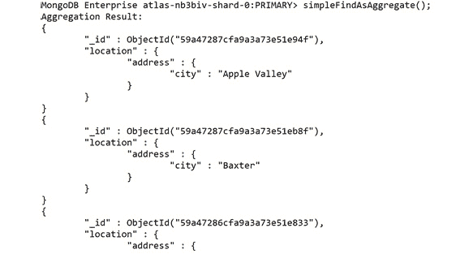

图 7.3：聚合结果（为简洁起见，输出被截断）

如果运行这两个函数，将得到相同的结果。记住，**find**和**aggregate**命令都返回游标，但我们使用的是**.forEach（printjson）；**最后将其打印到控制台，以便于理解。

如果您观察前面的示例，您应该能够匹配**find**中的大部分相同功能。**项目**、**排序**、**限制**都是 JSON 文档，就像**查找**命令一样。唯一明显的区别是，它们现在是数组中的文档，而不是函数。管道最开始的**$match**阶段相当于我们的过滤文档。所以，让我们一步一步地把它分解：

1.  首先，搜索剧院的收藏，找到与状态**MN**：

    ```js
    { $match:   { "location.address.state": "MN"} },
    ```

    匹配的文档
2.  将此剧院列表传递到第二阶段，该阶段仅投影选定状态下剧院所在的城市：

    ```js
    { $project: { "location.address.city": 1    } },
    ```

3.  该城市（和 ID）列表随后被传递到**排序**阶段，该阶段按照城市名称的字母顺序对数据进行排序：

    ```js
    { $sort:    { "location.address.city": 1    } },
    ```

4.  最后，列表被传递到**限制**阶段，只输出前三个条目：

    ```js
    { $limit: 3 }
    ```

很简单，对吧？您可以想象这条管道在生产中会有多大、多复杂，但它的优势之一是能够将大型管道分解为更小的分段或单个阶段。通过单独和顺序地查看各个阶段，看似不可理解的查询可以变得相当简单。同样重要的是要注意，步骤的顺序与阶段本身一样重要，不仅在逻辑上，而且在提高性能方面也是如此。首先执行**$match**和**$project**阶段，因为这将减少每个阶段的结果集大小。虽然不适用于每种类型的查询，但通常最好尝试减少早期使用的文档数量，而忽略任何会给服务器增加过多负载的文档。

尽管管道结构本身很简单，但需要更复杂的阶段和操作员来完成高级聚合并对其进行优化。我们将在接下来的几个主题中介绍其中的许多内容。

## 练习 7.01：执行简单聚合

在我们开始这个练习之前，让我们从*简介*中概述的场景重新审视一下电影公司，在这一场景中，一家电影公司每年都会举办经典电影马拉松。在前几年，他们对几个子类别使用了手动过程，最后手动合并所有数据。作为此任务初始研究的一部分，您将尝试重新创建一个较小的手动过程作为 MongoDB 聚合。此任务将使您更熟悉数据集并为更复杂的查询创建基础。

您决定重新创建的过程如下所示：

“*返回按 IMDb 评级排序的爱情类电影前三名，仅返回 2001 年之前发行的电影。*

这可以通过执行以下步骤来完成：

1.  将查询转换为可映射到聚合阶段的连续阶段：限制为三部电影、仅匹配浪漫电影、按 IMDb 评级排序，以及仅匹配 2001 年之前发布的电影。
2.  Simplify your stages wherever possible by merging duplicate stages. In this case, you can merge the two match stages: limit to three movies, sort by IMDb rating, and match romance movies released before 2001.

    重要的是要记住，阶段的顺序是至关重要的，除非我们重新安排，否则会产生错误的结果。为了在实际操作中演示这一点，我们暂时将它们保留在错误的顺序中。

3.  Take a quick peek into the structure of the movie documents to help write the stages:

    ```js
    db.movies.findOne();
    ```

    文件如下：

    

    图 7.4：查看文档结构（为简洁起见，输出被截断）

    对于这个特定的用例，您将需要**imdb.rating**、**released**和**流派**字段。既然您知道了要搜索的内容，就可以开始编写管道了。

4.  Create a file called **Ch7_Activity1.js** and add the following basic stages: **limit** to limit the output to three movies, **sort** to sort them by their rating, and **match** to make sure you only find romantic movies released before 2001:

    ```js
    // Ch7_Exercise1.js   
    var findTopRomanceMovies = function() {
           print("Finding top Classic Romance Movies...");
           var pipeline = [
               { $limit: 3 }, // Limit to 3 results.
                { $sort: {"imdb.rating": -1}}, // Sort by IMDB rating.
          { $match: {. . .}}
            ];
            db.movies.aggregate(pipeline).forEach(printjson);
        }
        findTopRomanceMovies();
    ```

    **$match**操作符的功能与**find**命令中的过滤器参数非常相似。您可以简单地传递两个条件，而不是一个。

5.  For the **older than 2001** condition, use the **$lte** operator:

    ```js
    // Ch7_Exercise1.js
        var findTopRomanceMovies = function() {
            print("Finding top Classic Romance Movies...");
            var pipeline = [
                { $limit: 3 },         // Limit to 3 results.
                { $sort: {"imdb.rating": -1}}, // Sort by IMDB rating.
                { $match: {
                    genres: {$in: ["Romance"]}, // Romance movies only.
                    released: {$lte: new ISODate("2001-01-01T00:00:                  00Z") }}},
            ];
            db.movies.aggregate(pipeline).forEach(printjson);
    }
    findTopRomanceMovies();
    ```

    因为**类型**字段是一个数组（电影可以属于多个类型），所以您必须使用操作符中的**$来查找包含所需值的数组。**

6.  Run this pipeline now; you may notice that it returns no documents:

    ```js
    MongoDB Enterprise atlas-nb3biv-shard-0:PRIMARY>   findTopRomanceMovies();
    Finding top Classic Romance Movies...
    MongoDB Enterprise atlas-nb3biv-shard-0:PRIMARY>
    ```

    是否可能没有文档满足此查询？当然，可能没有满足所有这些要求的电影。然而，正如你可能已经猜到的，这里的情况并非如此。如前所述，这条管道的顺序产生了误导性的结果。因为限制阶段是管道中的第一个阶段，所以您只能查看三个文档，后续阶段没有足够的数据来找到匹配项。因此，务必记住：

    *编写聚合管道时，操作顺序很重要。*

    因此，重新排列它们，以确保只将文档限制在管道的末尾。由于命令具有类似数组的结构，这非常简单：只需剪切限制阶段并将其粘贴到管道的末尾。

7.  安排阶段，以便限制最后出现，并且不会产生错误结果：

    ```js
    // Our new pipeline.
    var pipeline = [
                { $sort: {"imdb.rating": -1}}, // Sort by IMDB rating.
                { $match: {
                    genres: {$in: ["Romance"]}, // Romance movies only.
                    released: {$lte: new ISODate("2001-01-01T00:00:                  00Z") }}},
                { $limit: 3 },  // Limit to 3 results (last stage)
            ];
    ```

8.  Rerun this after the change. This time, the documents are returned:

    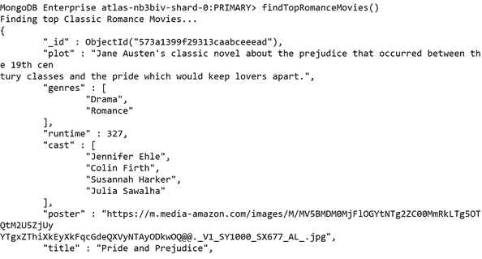

    图 7.5：返回有效文档的输出（为简洁起见，输出被截断）

    这是编写聚合管道的挑战之一：这是一个迭代过程，在处理大量复杂文档时可能会很麻烦。

    缓解此痛点的一种方法是在开发过程中添加简化数据的阶段，然后在最终查询中删除这些阶段。在本例中，您将添加一个阶段，以仅投影您正在查询的数据。这将更容易判断您是否捕获了正确的条件。执行此操作时必须小心，以免影响查询结果。我们将在本章后面更详细地讨论这一点。现在，您只需在末尾添加投影阶段，以确保它不会干扰您的查询。

9.  在管道末尾添加一个投影阶段，以帮助调试您的查询：

    ```js
    var pipeline = [
        { $sort:  {"imdb.rating": -1}}, // Sort by IMDB rating.
        { $match: {
        genres: {$in: ["Romance"]}, // Romance movies only.
        released: {$lte: new ISODate("2001-01-01T00:00:00Z") }}},
        { $limit: 3 },     // Limit to 3 results.
        { $project: { genres: 1, released: 1, "imdb.rating": 1}}
    ];
    ```

10.  Run this query again and you will see a much shorter, more easily understood output, as shown in the following code block:

    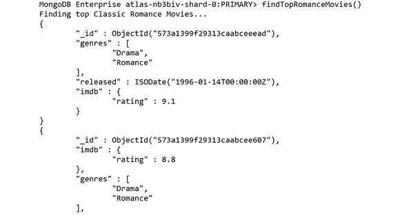

图 7.6：前面代码段的输出

如果您是从桌面上的文件运行代码，请记住，只需将整个代码段（如下所示）直接复制并粘贴到 shell 中即可：

```js
// Ch7_Exercise1.js
var findTopRomanceMovies = function() {
    print("Finding top Classic Romance Movies...");
       var pipeline = [
        { $sort: {"imdb.rating": -1}}, // Sort by IMDB rating.
        { $match: {
            genres: {$in: ["Romance"]}, // Romance movies only.
            released: {$lte: new ISODate("2001-01-01T00:00:              00Z") }}},
        { $limit: 3 },          // Limit to 3 results.
        { $project: { genres: 1, released: 1, "imdb.rating": 1}}
];
    db.movies.aggregate(pipeline).forEach(printjson);
}
findTopRomanceMovies();
```

输出应如下所示：


图 7.7:2001 年之前上映的顶级经典爱情电影列表

你还可以看到，每一部回归的电影都属于浪漫类，在 2001 年之前发行，并且拥有很高的 IMDb 评级。因此，在本练习中，您已经成功创建了第一个聚合管道。现在，让我们来看看我们刚刚完成的管道，并努力改进它。当你相信自己已经完成了一条管道时，问问自己：

*“我可以减少通过管道传递的文件数量吗？”*

在下一个练习中，我们将尝试回答这个问题。

## 练习 7.02：聚合结构

将管道视为一个多层漏斗。它从顶部开始变宽，接近底部时变薄。当您将文档倒入漏斗顶部时，会有很多文档，但随着您进一步向下移动，每个阶段的文档数量都会不断减少，直到只有您希望作为输出的文档从底部退出。通常，最简单的方法是首先进行匹配（*过滤*。

在此管道中，您将对集合中的所有文档进行排序，并丢弃不匹配的文档。您当前正在对不需要的文档进行排序。交换这些阶段：

1.  Swap the **match** and **sort** stages to improve the efficiency of your pipeline:

    ```js
            var pipeline = [
                { $match: {
                    genres: {$in: ["Romance"]}, // Romance movies only.
                    released: {$lte: new ISODate("2001-01-01T00:00:                  00Z") }}},
                { $sort: {"imdb.rating": -1}}, // Sort by IMDB rating.
                { $limit: 3 },            // Limit to 3 results.
                { $project: { genres: 1, released: 1,               "imdb.rating": 1}}
    ];
    ```

    另一个要考虑的是，尽管你有一个符合标准的电影列表，但是你希望你的结果对你的用例有意义。在这种情况下，您希望您的结果对查看此数据的电影公司有意义和有用。他们很可能最关心电影的片名和收视率。他们可能还希望看到电影符合他们的要求，所以让我们在最后也投影这些内容，放弃所有其他属性。

2.  将电影**标题**字段添加到投影舞台。您的最终聚合应该如下所示：

    ```js
    // Ch7_Exercise2.js
    var findTopRomanceMovies = function() {
        print("Finding top Classic Romance Movies...");
        var pipeline = [
            { $match: {
                genres: {$in: ["Romance"]}, // Romance movies only.
                released: {$lte: new ISODate("2001-01-01T00:00:              00Z") }}},
            { $sort: {"imdb.rating": -1}}, // Sort by IMDB rating.
            { $limit: 3 },     // Limit to 3 results.
            { $project: { title: 1, genres: 1, released: 1,           "imdb.rating": 1}}
        ];
        db.movies.aggregate(pipeline).forEach(printjson);
    }
    findTopRomanceMovies();
    ```

3.  Rerun your pipeline by copying and pasting the code from *step 2* into your mongo shell. You should see that the top two movies are **Pride and Prejudice** and **Forrest Gump**:

    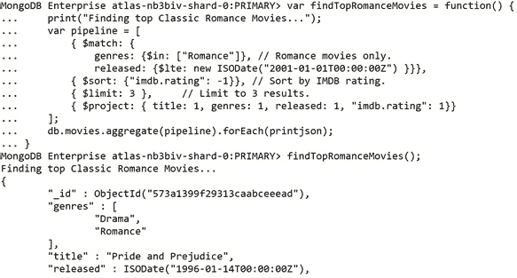

图 7.8：前面代码段的输出

如果您看到这些结果，那么您已经优化了第一个聚合管道。

如您所见，聚合管道是灵活、健壮且易于操作的，但您可能会认为，对于这个用例来说，它似乎有点繁重，并且可能在大多数情况下，一个简单的**find**命令就可以做到这一点。事实上，并非每个简单查询都需要聚合管道，但您才刚刚开始。在接下来的几节中，您将看到**聚合**命令提供了**查找**命令没有提供的内容。

# 操纵数据

我们的大多数活动和示例可以简化为以下内容：集合中的一个或多个文档应该以易于消化的格式返回部分或全部文档。**find**命令和聚合管道的核心就是识别和获取正确的文档。但是，聚合管道的功能比**find**命令更健壮、更广泛。

使用管道中的一些更先进的阶段和技术，我们可以转换数据，获得新数据，并在更广泛的范围内产生见解。聚合命令的这种更广泛的实现比仅仅将 find 命令重写为管道更常见。如果您想回答复杂的问题或从数据中提取尽可能高的价值，您需要知道如何实现聚合管道的聚合部分。

毕竟，我们甚至还没有开始汇总任何数据。在本主题中，我们将探讨如何开始转换和聚合数据的基础知识。

## 小组赛阶段

正如您可能从名称中看到的，**$group**阶段允许您根据特定条件对文档进行分组（*或聚合*。尽管有许多其他阶段和方法可以使用**聚合**命令完成各种任务，**$group**阶段是最强大的查询的基石。以前，我们可以返回的最重要的数据单元是单个文档。我们可以对这些文档进行排序，通过对文档的直接比较获得见解。然而，一旦我们掌握了**$group**阶段，我们将能够通过将文档聚合为大型逻辑单元，将查询范围扩大到整个集合。一旦我们有了更大的组，我们就可以像对待每个文档一样应用我们的过滤器、排序、限制和预测。

**$group**阶段最基本的实现只接受一个**id**键，其值是一个表达式。此表达式定义管道将文档分组到一起所依据的条件。该值成为新输出文档的**，为**$组**阶段创建的每个唯一的**生成一个文档。例如，以下代码将按分级对所有电影进行分组，为每个分级类别输出一条记录：****

 ****```js
    var pipeline = [
     {$group: {
         _id: "$rated"
     }}
    ];
    db.movies.aggregate(pipeline).forEach(printjson);
```

结果输出如下所示：


图 7.9：前面代码段的结果输出

在我们的**$组**阶段，您可能会注意到的第一件事是**评级**字段前的**$**符号。如前所述，我们的**id**键的值是一个*表达式*。在聚合术语中，表达式可以是文字、表达式对象、运算符或字段路径。在本例中，我们传入一个字段路径，它告诉管道在输入文档中要访问哪个字段。您可能在 MongoDB 中遇到过字段路径，也可能没有。

您可能想知道为什么我们不能像在 find 命令中那样传递字段名。这是因为在聚合时，我们需要告诉管道我们想要访问当前正在聚合的文档的字段。**$group**阶段将**id:**$rated】解释为等同于**id:**$CURRENT.rated】。这可能看起来很复杂，但它表明，对于每个文档，它都将适合与具有**“额定”**键的相同（当前）文档匹配的组。在下一节的实践中，这一点将变得更加清楚。

到目前为止，通过单个字段进行分组对于获取唯一值列表非常有用。然而，这并没有告诉我们更多关于我们的数据。我们想更多地了解这些不同的群体；例如，每个组适合多少个标题？这就是我们的累加器表达式将派上用场的地方。

## 累加器表达式

**$group**命令可以接受多个参数。它还可以接受以下格式的任意数量的附加参数：

```js
field: { accumulator: expression},
```

让我们将其分解为三个部分：

*   **字段**将为每个组定义我们新计算的字段的键。
*   **蓄能器**必须是受支持的蓄能器操作员。这些运营商是一组运营商，就像您可能已经与之合作过的其他运营商一样——比如**$lte**——但顾名思义，它们将在属于同一组的多个文档中累积其价值。
*   此上下文中的**表达式**将传递给**累加器**操作符，作为每个文档中应该累加的字段的输入。

在上一个示例的基础上，让我们确定每组电影的总数：

```js
    var pipeline = [
     {$group: {
         _id: "$rated",
         "numTitles": { $sum: 1},
     }}
    ];
    db.movies.aggregate(pipeline).forEach(printjson);
```

您可以从中看到，我们可以创建一个名为**numTitles**的新字段，每个组的该字段值为文档的总和。这些新创建的字段通常称为**计算字段**。对于组中的每个文档，我们可以将文字值**1**与迄今为止的累积结果相加。在 MongoDB shell 中运行此命令将得到以下结果：

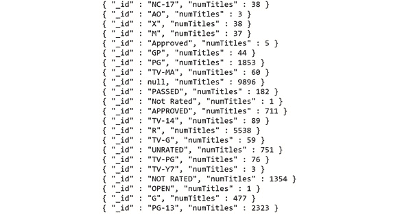

图 7.10：前面代码段的输出

类似地，您可以累加给定字段的值，而不是对每个文档累加**1**。例如，假设我们想要在一个等级中找到每一部电影的总运行时间。我们按照**评级**字段分组，并累积每部影片的运行时间：

```js
    var pipeline = [
     {$group: {
         _id: "$rated",
         "sumRuntime": { $sum: "$runtime"},
     }}
    ];
    db.movies.aggregate(pipeline).forEach(printjson);
```

记住，我们必须在运行时字段前面加上**$**符号，告诉 MongoDB 我们指的是我们正在积累的每个文档的运行时值。我们的新结果如下：


图 7.11：前面代码段的输出

虽然这是一个简单的示例，但您可以看到，只需一个聚合阶段和两个参数，我们就可以开始以令人兴奋的方式转换数据。几个累加器操作符可以组合和分层，以生成关于组的更复杂和深入的信息。我们将在下面的示例中看到其中一些操作符。

需要注意的是，我们可以使用不仅仅是累加器运算符作为表达式。我们还可以使用其他几种有用的运算符在积累数据后转换数据。假设我们想要得到每个组标题的平均运行时间。我们可以将我们的**$sum**累加器更改为**$avg**，这将返回每个组的平均运行时间，因此我们的管道如下所示：

```js
    var pipeline = [
     {$group: {
        _id: "$rated",
        "avgRuntime": { $avg: "$runtime"},
     }}
    ];
    db.movies.aggregate(pipeline).forEach(printjson);
```

我们的产出变成：


图 7.12：基于评级的平均运行时间值

在这种情况下，这些平均运行时值不是特别有用。让我们向项目运行时添加另一个阶段，使用**$trunc**阶段为我们提供一个整数值：

```js
    var pipeline = [
     {$group: {
         _id: "$rated",
         "avgRuntime": { $avg: "$runtime"},
     }},
     {$project: {
         "roundedAvgRuntime": { $trunc: "$avgRuntime"}
     }}
    ];
    db.movies.aggregate(pipeline).forEach(printjson);
```

这将为我们提供一个格式更精确的结果，如下所示：

```js
{ "_id" : "PG-13", "avgRuntime" : 108 }
```

本节演示了如何将组阶段与操作员、累加器和其他阶段相结合，以帮助操作我们的数据，从而回答更多的业务问题。现在，让我们开始聚合并将这一新阶段付诸实践。

## 练习 7.03：操作数据

在前面的场景中，您已经习惯了数据的形状，并将客户机的一个手动过程重新创建为聚合管道。作为经典电影马拉松赛前准备工作的一部分，这家电影公司决定尝试为每种类型放映一部电影（马拉松赛前每周放映一部），他们希望最后放映最受欢迎的电影类型，以围绕这一赛事大肆宣传。然而，他们有一个问题。他们这几周的日程已经安排好了，这意味着经典电影将不得不填补日程上的空白。因此，要做到这一点，他们必须知道每种类型中最长电影的长度，包括为每部电影的预告片增加时间。

笔记

在这个场景中，**受欢迎程度**由**IMDb 评级**定义，预告片在任何电影之前播放 12 分钟。

目标可概括如下：

*“仅针对 2001 年以前的电影，找到每种类型的平均和最大受欢迎程度，按受欢迎程度对类型进行排序，并找到每种类型中最长电影的调整（带预告片）运行时间。”*

将查询转换为连续阶段，以便可以映射到聚合阶段：

*   匹配 2001 年之前发行的电影。
*   找出每种类型的平均受欢迎程度。
*   按流行程度对流派进行排序。
*   输出调整后的每部电影的运行时间。

由于您已经了解了更多关于小组阶段的知识，请使用您的新知识详细说明该步骤：

*   匹配 2001 年之前发行的电影。
*   将所有电影按其第一种类型分组，并累积平均和最大 IMDb 评级。
*   按每种类型的平均受欢迎程度排序。
*   将调整后的运行时间投影为**总运行时间**。

以下步骤将帮助您完成此练习。

1.  首先为聚合创建大纲。创建一个名为**Ch7_Exercise3.js**：

    ```js
    // Ch7_Exercise3.js
    var findGenrePopularity = function() {
      print("Finding popularity of each genre");
      var pipeline = [
                { $match: {}},
                { $group: {}},
                { $sort: {}},
                { $project: {}}
            ];
            db.movies.aggregate(pipeline).forEach(printjson);
        }
        findGenrePopularity();
    ```

    的新文件
2.  Fill in the steps one at a time, starting with **$match**:

    ```js
                { $match: {
                    released: {$lte: new ISODate("2001-01-01T00:00:                  00Z") }}},
    ```

    这类似于*练习 7.01**执行简单聚合*，您匹配了 2001 年之前发布的所有文档。

3.  For the **$group** stage, first identify your new **id** for each output document:

    ```js
    { $group: {
        _id: {"$arrayElemAt": ["$genres", 0]},
    }},
    ```

    **$arrayElemAt**从指定索引处的数组中获取一个元素（*在本例中为 0*。对于此场景，假设阵列中的第一种类型是电影的主要类型。

    接下来，在结果中指定所需的新计算字段。记住使用累加器操作符，包括**$avg**（*平均值*）和**$max**（*最大值*）。请记住，在**累加器**中，由于您引用的是变量，因此必须在字段前面加上**$**符号：

    ```js
    { $group: {
        _id: {"$arrayElemAt": ["$genres", 0]},
        "popularity": {  $avg: "$imdb.rating"},
        "top_movie": { $max: "$imdb.rating"},
        "longest_runtime": { $max: "$runtime"}
    }},
    ```

4.  填写**排序**字段。现在您已经定义了计算字段，这很简单：

    ```js
    { $sort: { popularity: -1}},
    ```

5.  要获得调整后的运行时间，请使用**$add**操作符并添加**12**（分钟）。您增加 12 分钟，因为客户（电影院公司）通知您这是每部电影之前播放的预告片的长度。一旦调整了运行时间，您将不再需要**最长的运行时间**：

    ```js
    { $project: {
        _id: 1,
        popularity: 1, 
        top_movie: 1, 
        adjusted_runtime: { $add: [ "$longest_runtime", 12 ] } } }
    ```

6.  Also add a **$**. Your final aggregation pipeline should look like this:

    ```js
    var findGenrePopularity = function() {
        print("Finding popularity of each genre");
        var pipeline = [
            { $match: {
            released: {$lte: new ISODate("2001-01-01T00:00:00Z") }}},
            { $group: {
                _id: {"$arrayElemAt": ["$genres", 0]},
                "popularity": {  $avg: "$imdb.rating"},
                "top_movie": { $max: "$imdb.rating"},
                "longest_runtime": { $max: "$runtime"}
            }},
                { $sort: { popularity: -1}},
                { $project: {
                    _id: 1,
                    popularity: 1, 
                    top_movie: 1, 
                    adjusted_runtime: { $add: [ "$longest_runtime",                   12 ] } } }
            ];
            db.movies.aggregate(pipeline).forEach(printjson);
        }
        findGenrePopularity();
    ```

    如果您的结果是正确的，您的前几个文档应如下所示：

    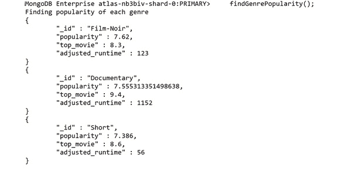

图 7.13：返回的前几个文档

结果显示，黑色电影、纪录片和短片最受欢迎，我们还可以看到每个类别的平均运行时间。在下一个练习中，我们将根据特定要求从每个类别中选择一个标题。

## 练习 7.04：从每个电影类别中选择标题

您现在已经回答了客户向您提出的问题。然而，这个结果并不能帮助他们选择一部特定的电影。他们必须执行不同的查询，以获得每种类型的电影列表，并从列表中选择要播放的最佳电影。此外，您还了解到可用的最大时间段为 230 分钟。您将更改此查询，为电影院公司提供在每个类别中选择的推荐标题。以下步骤将帮助您完成此练习：

1.  首先，增加第一个匹配以过滤掉不适用的胶片。过滤掉超过 218 分钟的电影（230 多部预告片）。同时过滤掉等级较低的胶片。首先，您将获得评级高于 7.0 的电影：

    ```js
    { $match: {
      released: {$lte: new ISODate("2001-01-01T00:00:00Z") },
      runtime:  {$lte: 218},
      "imdb.rating": {$gte: 7.0}
      }
    },
    ```

2.  要获得每个类别的推荐标题，请在我们的分组阶段使用**$first**累加器获取每个类别的顶级文档（电影）。要做到这一点，您必须首先按评级按降序排序，确保第一个文档也是最高评级的文档。在初始**$match**阶段

    ```js
    { $sort: {"imdb.rating": -1}},
    ```

    之后添加一个新的**$sort**阶段
3.  现在，将**$first**累加器添加到您的小组阶段，添加新字段。同时添加**推荐的**和**推荐的【原始】运行时间**字段，以便于使用：

    ```js
    { $group: {
      _id: {"$arrayElemAt": ["$genres", 0]},
      "recommended_title": {$first: "$title"},
      "recommended_rating": {$first: "$imdb.rating"},
      "recommended_raw_runtime": {$first: "$runtime"},
      "popularity": {  $avg: "$imdb.rating"},
      "top_movie": { $max: "$imdb.rating"},
      "longest_runtime": { $max: "$runtime"}
    }},
    ```

4.  Ensure that you add this new field to your final projection:

    ```js
    { $project: {
         _id: 1,
          popularity: 1, 
          top_movie: 1, 
          recommended_title: 1,
          recommended_rating: 1,
          recommended_raw_runtime: 1,
          adjusted_runtime: { $add: [ "$longest_runtime", 12 ] } } }
    ```

    新的最终查询应如下所示：

    ```js
    // Ch7_Exercise4js
    var findGenrePopularity = function() {
        print("Finding popularity of each genre");
        var pipeline = [
           { $match: {
            released: {$lte: new ISODate("2001-01-01T00:00:00Z") },
                runtime:  {$lte: 218},
                "imdb.rating": {$gte: 7.0}
                }
               },
               { $sort: {"imdb.rating": -1}},
               { $group: {
                 _id: {"$arrayElemAt": ["$genres", 0]},
                 "recommended_title": {$first: "$title"},
                 "recommended_rating": {$first: "$imdb.rating"},
                 "recommended_raw_runtime": {$first: "$runtime"},
                 "popularity": {  $avg: "$imdb.rating"},
                 "top_movie": { $max: "$imdb.rating"},
                 "longest_runtime": { $max: "$runtime"}
               }},
               { $sort: { popularity: -1}},
               { $project: {
                    _id: 1,
                     popularity: 1, 
                     top_movie: 1, 
                     recommended_title: 1,
                     recommended_rating: 1,
                     recommended_raw_runtime: 1,
                     adjusted_runtime: { $add: [ "$longest_runtime",                    12 ] } } }
            ];
            db.movies.aggregate(pipeline).forEach(printjson);
        }
        findGenrePopularity();
    ```

5.  Execute this, and your first two result documents should look something like the following:

    

图 7.14：前两个结果文件

您可以看到，通过在管道中添加一些内容，您已经提取了具有最高收视率和最长运行时间的电影，为您的客户创造了额外的价值。

在本主题中，我们了解了如何查询数据，然后对结果进行排序、限制和投影。在本主题中，我们看到，通过使用更高级的聚合阶段，我们可以完成更复杂的任务。对数据进行操作和转换，以创建新的、有意义的文档。这些新的阶段使用户能够回答范围更广、难度更高的业务问题，并获得对数据集的宝贵见解。

# 处理大型数据集

到目前为止，我们使用的文档数量相对较少。**电影**收藏中约有 23500 份文档。对于一个人来说，这可能是一个相当大的数字，但是对于大型生产系统来说，您的工作规模可能是数百万而不是数千。到目前为止，我们一次也严格关注一个集合，但是如果我们的聚合范围扩大到包括多个集合呢？

在第一个主题中，我们简要讨论了如何在开发管道时使用投影阶段来创建更可读的输出，以及简化调试结果。但是，我们没有介绍如何在开发和最终的生产就绪查询时，在处理越来越大的数据集时提高性能。在本主题中，我们将讨论处理大型多集合数据集时需要掌握的几个聚合阶段。

## 使用$sample 进行抽样

学习如何处理大型数据集的第一步是理解**$sample**。这个阶段简单但有用。**$sample**的唯一参数是所需样本大小。此阶段随机选择文档（达到指定大小），并将其传递到下一阶段：

```js
{ $sample: {size: 100}}, // This will reduce the scope to   100 random docs.
```

通过这样做，您可以显著减少通过管道传输的文档数量。这主要是因为以下两个原因之一。第一个原因是，在运行大量数据集时，主要是在微调或构建聚合时，要加快执行时间。第二种是用于用例可以容忍结果中缺少文档的查询。例如，如果您想返回某一类型的任意五部电影，可以使用**$sample**：

```js
var findWithSample = function() { 
    print("Finding all documents WITH sampling") 
    var now = Date.now(); 
    var pipeline = [ 
        { $sample: {size: 100}}, 
        { $match: { 
            "plot": { $regex: /around/} 
        }} 
    ]; 
    db.movies.aggregate(pipeline) 
    var duration = Date.now() - now; 
    print("Finished WITH sampling in " + duration+"ms"); 
}
findWithSample();
```

执行新的**findWithSample（）**函数后，将获得以下结果：

```js
Finding all documents WITH sampling
Finished WITH sampling in 194ms
```

您可能想知道，为什么不使用**$limit**命令来实现在管道的某个阶段减少文档数量的相同结果。主要原因是**$limit**始终尊重文档的顺序，因此每次都返回相同的文档。但是，需要注意的是，在某些情况下，如果您不需要伪随机选择**$sample**，则使用**$limit**更为明智。

让我们看一个**$sample**正在运行的示例。下面是一个在**plot**字段中搜索所有电影中特定关键字的查询，该查询在使用和不使用**$sample**的情况下实现：

```js
var findWithoutSample = function() {
    print("Finding all documents WITHOUT sampling")
    var now = Date.now();
    var pipeline =[
        { $match: {
            "plot": { $regex: /around/}
        }},
    ]
    db.movies.aggregate(pipeline)
    var duration = Date.now() - now;
    print("Finished WITHOUT sampling in " + duration+ "ms");
}
findWithoutSample();
```

前面的示例不是衡量性能的最佳方法，还有更好的方法来分析管道的性能，例如**解释**。但是，由于我们将在本书的后面部分介绍这些内容，因此这将作为一个简单的示例。如果运行此小脚本，您将始终获得以下结果：

```js
Finding all documents WITHOUT sampling
Finished WITHOUT sampling in 862ms
```

这两个命令的两个输出的简单比较如下：

```js
Finding all documents WITH sampling 
Finished WITH sampling in 194ms 
Finding all documents WITHOUT sampling
Finished WITHOUT sampling in 862ms
```

通过采样，性能显著提高。但是，这是因为我们只查看 100 个文档。更可能的是，在这种情况下，我们希望在**匹配**语句之后对结果进行采样，以确保在第一阶段不排除所有结果。在大多数情况下，在处理执行时间很长的大型数据集时，您可能希望在构建管道时从一开始就进行采样，并在查询完成后删除采样。

## 使用$lookup 加入集合

在针对大量集合开发查询时，采样可能有助于您，但在生产查询中，您有时可能需要编写跨多个集合运行的查询。在 MongoDB 中，这些集合联接使用**$lookup**聚合步骤完成。

通过以下聚合可以轻松理解这些连接：

```js
var lookupExample = function() {
    var pipeline = [
        { $match:  { $or: [{"name": "Catelyn Stark"},           {"name": "Ned Stark"}]}},
        { $lookup: { 
            from: "comments",
            localField: "name",
            foreignField: "name",
            as: "comments"
        }},
  { $limit: 2},
    ];
    db.users.aggregate(pipeline).forEach(printjson);
}
lookupExample();
```

在我们尝试运行它之前，让我们先分析一下。首先，我们正在对**用户**集合运行**美元匹配**，只获得两个名为**内德·斯塔克**和**卡特琳·斯塔克**的用户。一旦我们有了这两条记录，我们就执行查找。**$lookup**的四个参数如下：

*   **来自**：我们加入当前聚合的集合。在本例中，我们将**注释**加入**用户**。
*   **localField**：我们将用于在本地集合中加入文档的字段名（*我们正在*上运行聚合的集合）。在本例中，是用户的名称。
*   **外来字段**：从集合中链接到**中**本地字段**的字段。它们可能有不同的名称，但在这种情况下，它是相同的字段：**名称**。**
*   **as**：这就是我们新加入的数据的标记方式。

在本例中，查找采用我们用户的名称，搜索**注释**集合，并将具有相同名称的任何注释添加到原始用户文档的新数组字段中。这个新数组称为**注释**。通过这种方式，我们可以获取另一个集合中所有相关文档的数组，并将它们嵌入原始文档中，以便在聚合的其余部分中使用。

如果我们按原样运行管道，则输出的开头将如下所示：


图 7.15：运行管道后的输出（为简洁起见截断）

由于输出非常大，前面的屏幕截图只显示了**注释**数组的开头。

在本例中，用户发表了许多评论，因此嵌入式阵列变得相当丰富，并且很难查看。本期文章提供了一个介绍**$unwind**操作符的好地方，因为这些连接通常会产生大量相关文档。**$放松**是一个相对简单的阶段。它从输入文档解构数组字段，为数组中的每个元素输出新文档。例如，如果您展开此文档：

```js
{a: 1, b: 2, c: [1, 2, 3, 4]}
```

输出将是以下文档：

```js
{"a" : 1, "b" : 2, "c" : 1 }
{"a" : 1, "b" : 2, "c" : 2 }
{"a" : 1, "b" : 2, "c" : 3 }
{"a" : 1, "b" : 2, "c" : 4 }
```

我们可以将此新阶段添加到加入并尝试运行它：

```js
var lookupExample = function() {
    var pipeline = [
        { $match:  { $or: [{"name": "Catelyn Stark"},           {"name": "Ned Stark"}]}},
        { $lookup: { 
            from: "comments",
            localField: "name",
            foreignField: "name",
            as: "comments"
        }},
        { $unwind: "$comments"},
        { $limit: 3},
    ];
    db.users.aggregate(pipeline).forEach(printjson);
}
lookupExample();
```

我们将看到如下输出：


图 7.16：前面代码段的输出（为简洁起见截断）

我们可以看到每个用户有多个文档，每个注释只有一个文档，而不是一个嵌入数组。使用这种新格式，我们可以添加更多的阶段来操作我们的新文档集。例如，我们可能希望过滤掉对特定电影的任何评论，或者按日期对我们的评论进行排序。**$lookup**和**$unwind**的组合是一个强大的组合，用于在单个聚合中跨多个集合回答复杂问题。

## 使用$out 和$merge 输出结果

想象一下，上周我们一直在开发一个大型、多阶段的聚合管道。我们一直在调试、采样、过滤和测试我们的管道，以在一个巨大的数据集上解决一个具有挑战性和复杂的业务问题。我们最终对我们的管道感到满意，我们希望执行它，然后保存结果以供后续分析和演示。

我们可以运行查询并将结果导出为新格式。但是，如果我们想对结果集运行后续分析，这将意味着重新导入结果。

我们可以将输出保存在一个数组中，然后将其重新插入 MongoDB，但这意味着将所有数据从服务器传输到客户端，然后从客户端传输回服务器。

幸运的是，从 MongoDB 版本 4.2 开始，我们提供了两个聚合阶段来解决这个问题：**$out**和**$merge**。这两个阶段都允许我们从管道中获取输出，并将其写入一个集合中供以后使用。重要的是，整个过程都发生在服务器上，这意味着所有数据永远不需要通过网络传输到客户端。不难想象，在创建一个复杂的聚合查询之后，您可能希望每周运行一次，并通过将数据写入集合来创建结果的快照。

让我们看看这两个阶段最基本的语法形式，然后比较它们的功能：

```js
// Available from v2.6
{ $out: "myOutputCollection"}
// Available from version 4.2
{ $merge: {
    // This can also accept {db: <db>, coll: <coll>} to       merge into a different db
    into: "myOutputCollection", 
}}
```

如您所见，没有任何可选参数的语法几乎相同。然而，在所有其他方面，这两个命令都存在分歧。**$out**非常简单；要指定的唯一参数是所需的输出集合。它将创建新集合或完全替换现有集合。**$out**还有几个与**$merge**不共享的约束。例如，**$out**必须输出到与聚合目标相同的数据库。

在 MongoDB 4.2 服务器上运行时，**$merge**可能是更好的选择。然而，在本书的范围内，我们将使用运行 MongoDB 4.0 的 MongoDB 免费层。因此，在这些示例中，我们将更多地关注**$out**阶段。

**$out**的语法非常简单。唯一的参数是要将结果输出到的集合。下面是带有**$out**的管道示例：

```js
var findTopRomanceMovies = function() {
    var pipeline = [
        { $sort:  {"imdb.rating": -1}}, // Sort by IMDB rating.
        { $match: {
            genres: {$in: ["Romance"]}, // Romance movies only.
            released: {$lte: new ISODate("2001-01-01T00:00:              00Z") }}},
        { $limit: 5 },                 // Limit to 5 results.
        { $project: { title: 1, genres: 1, released: 1,           "imdb.rating": 1}},
        { $out: "movies_top_romance"}
    ];
    db.movies.aggregate(pipeline).forEach(printjson);
}
findTopRomanceMovies();
```

通过运行此管道，您将不会收到任何输出。这是因为输出已重定向到所需的集合：

```js
MongoDB Enterprise atlas-nb3biv-shard-0:PRIMARY>   findTopRomanceMovies();
MongoDB Enterprise atlas-nb3biv-shard-0:PRIMARY>
```

我们可以看到，我们的结果创建了一个新集合：

```js
MongoDB Enterprise atlas-nb3biv-shard-0:PRIMARY> show collections
comments
movies
movies_top_romance
sessions
theaters
users
```

如果我们在新集合上运行查找，我们可以看到聚合结果现在存储在其中：

```js
MongoDB Enterprise atlas-nb3biv-shard-0:PRIMARY> db.movies_top_romance.findOne({})
{
        "_id" : ObjectId("573a1399f29313caabceeead"),
        "genres" : [
                "Drama",
                "Romance"
        ],
        "title" : "Pride and Prejudice",
        "released" : ISODate("1996-01-14T00:00:00Z"),
        "imdb" : {
                "rating" : 9.1
        }
}
```

通过将结果放入集合中，我们可以存储、共享和更新新的复杂聚合结果。我们甚至可以对这个新集合运行进一步的查询和聚合。**$out**是一个简单但功能强大的聚合阶段。

## 练习 7.05：列出用户评论最多的电影

这家电影公司希望更多地了解哪些电影能获得用户最多的评论。但是，考虑到数据库中有许多注释（以及您使用新学到的技能的倾向），您决定在开发此管道时，只使用注释的一个示例。从这个示例中，您将找出谈论最多的电影，并将这些文档与**电影**集合中的文档结合起来，以获得有关该电影的更多信息。公司还要求您的工作的最终交付物是一个带有输出文档的新集合。考虑到您现在已经了解了**$merge**阶段，这个要求应该很容易满足。

您收集的一些附加信息是，他们希望结果尽可能简单，并且希望了解电影标题和评级。此外，他们希望看到评论最多的五部电影。

在本练习中，您将帮助电影院公司获得从用户那里获得最多评论的电影列表。执行以下步骤以完成此练习：

1.  First, outline the stages in your pipeline; they appear in the following order:

    **$sample**该**评论**集合（在构建管道时）。

    **$group**他们所针对的电影评论。

    **$sort**根据总评论数对结果进行排序。

    **$limit**通过评论进入前五名电影的结果。

    **$lookup**匹配每个文档的电影。

    **$展开**电影数组以保持结果文档的简单性。

    **$project**只是电影标题和评级。

    **$merge**将结果合并到新集合中。

    虽然这看起来像是许多阶段，但每个阶段都相对简单，并且流程可以从头到尾按逻辑进行。

2.  创建一个名为**Ch7_Exercise5.js**的新文件，并编写管道骨架：

    ```js
    // Ch7_Exercise5.js
    var findMostCommentedMovies = function() {
        print("Finding the most commented on movies.");
        var pipeline = [
                 { $sample: {}}, 
                 { $group: {}},
                 { $sort: {}},
                 { $limit: 5},
                 { $lookup: {}},
                 { $unwind: },
                 { $project: {}},
                 { $out: {}}
        ];
        db.comments.aggregate(pipeline).forEach(printjson);
    }
    findMostCommentedMovies();
    ```

3.  在决定样本大小之前，您应该了解**注释**集合有多大。对**评论**集合

    ```js
    MongoDB Enterprise atlas-nb3biv-shard-0:PRIMARY>   db.comments.count()
    50303
    ```

    运行**计数**
4.  在开发过程中，抽取大约 10%的样本。将本练习的样本量设置为**5000**：

    ```js
    { $sample: {size: 5000}}, 
    ```

5.  现在，您已经有了更简单的步骤，请填写**$group**语句，按相关电影对评论进行分组，累计每部电影的评论总数：

    ```js
    { $group: {
        _id: "$movie_id",
        "sumComments": { $sum: 1}
    }},
    ```

6.  接下来，添加**排序**，使**评论**值最高的电影排在第一位：

    ```js
    { $sort: { "sumComments": -1}},
    ```

7.  When building pipelines, it's important to periodically run them partially completed to make sure you see the results you're expecting. Since you're about halfway through the stages, quickly comment out the incomplete stages and run the aggregation to list your most-commented movies. Keep in mind that because you are sampling, the results will not be the same each time you run your pipeline. The following output is just an example:

    

    图 7.17：示例输出

    我们的输出将显示如下：

    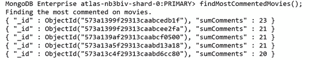

    图 7.18：运行聚合管道后的输出（为简洁起见截断）

    您现在需要在**电影**集合中执行查找，以将您的评论组与电影文档相匹配：

    ```js
    { $lookup: {
        from: "movies",
        localField: "_id",
        foreignField: "_id",
        as: "movie"
    }},
    ```

    重新运行此程序，您现在可以看到一个包含所有电影细节的**电影**数组：

    

    图 7.19：重新运行管道后的输出

    每个**电影**数组中只有一部电影，因此展开这些数组以简化结构。一旦它被解开，您就可以投射出所有您不想看到的字段。现在，填写以下两个步骤：

    ```js
    { $unwind: "$movie" },
    { $project: {
        "movie.title": 1,
        "movie.imdb.rating": 1,
        "sumComments": 1,
    }}
    ```

8.  Your data is now complete, but you still need to output this result into a collection. Add the **$out** step at the end:

    ```js
    { $out: "most_commented_movies" }
    ```

    最终生成的代码应该如下所示：

    ```js
    // Ch7_Exercise5.js
    var findMostCommentedMovies = function() {
        print("Finding the most commented on movies.");
        var pipeline = [
                 { $sample: {size: 5000}}, 
                 { $group: {
                     _id: "$movie_id",
                     "sumComments": { $sum: 1}
                 }},
                 { $sort: { "sumComments": -1}},
                 { $limit: 5},
                 { $lookup: {
                     from: "movies",
                     localField: "_id",
                     foreignField: "_id",
                     as: "movie"
                 }},
                 { $unwind: "$movie" },
                 { $project: {
                     "movie.title": 1,
                     "movie.imdb.rating": 1,
                     "sumComments": 1,
                 }},
                 { $out: "most_commented_movies" }
        ];
        db.comments.aggregate(pipeline).forEach(printjson);
    }
    findMostCommentedMovies();
    ```

    运行此代码。如果一切顺利，您将注意到 shell 中的管道没有输出，但您应该能够使用**find（）**检查新创建的集合并查看结果。请记住，由于采样阶段的原因，每次的结果都不相同：

    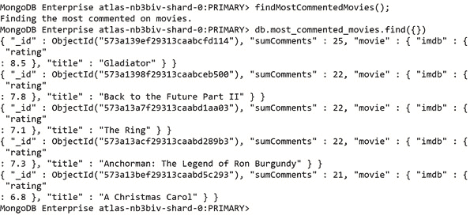

图 7.20：前面代码片段的结果（为简洁起见，输出被截断）

随着我们在这个话题中了解到的新阶段，我们现在拥有了一个极好的基础，用于在更大规模、更复杂的数据集上执行聚合。此外，重要的是，我们现在能够在多个集合之间有效地连接数据。通过这样做，我们可以增加查询的范围，从而满足更广泛的用例。

通过**out**阶段，我们可以存储聚合的结果。这允许用户通过正常 CRUD 操作快速探索结果，并允许我们定期轻松地更新结果。“展开”阶段还使我们能够从查找中获取连接的文档，并将它们分离为单独的文档，然后将它们输入到后续的管道阶段。

将所有这些阶段结合起来，我们现在能够创建广泛的新聚合，这些聚合可以跨大型、多集合数据集进行操作。

# 从您的聚合中获得最大收益

在最后三个主题中，我们学习了聚合结构以及构建复杂查询所需的关键阶段。我们可以使用给定的条件搜索大型多集合数据集，操纵该数据以创建新的见解，并将结果输出到新的或现有的集合中。

这些基础知识将允许您解决聚合管道中遇到的大多数问题。然而，还有其他几个阶段和模式可以最大限度地利用聚合。在本书中，我们将不一一介绍，但在本主题中，我们将讨论一些零碎的东西，这些零碎的东西将有助于您对管道进行微调，以及一些我们到目前为止尚未介绍的其他零碎东西。我们将使用**解释**来分析聚合选项。

## 调整管道

在前面的主题中，我们通过输出聚合前后的时间来计时管道的执行。这是一种有效的技术，您通常可以在客户端或应用程序端对 MongoDB 查询计时。但是，这只提供了大致的持续时间，只告诉我们响应到达客户机所用的总时间，而不是服务器执行管道所用的时间。MongoDB 为我们提供了一种很好的方法，可以准确地了解它是如何执行我们请求的查询的。此功能称为**Explain**，是检查和优化 MongoDB 命令的常用方法。

然而，有一个陷阱。**解释**还不支持聚合的详细执行计划，这意味着它在管道优化方面的使用是有限的。**解释**和执行计划将在本书后面进行更详细的介绍。由于我们不能依赖**解释**来分析我们的管道，因此仔细构建和规划我们的管道以提高聚合的性能就变得更加重要。虽然没有一种正确的方法可以在任何情况下工作，但是有一些启发式方法通常是有用的。我们将通过示例介绍其中的一些方法。MongoDB 在幕后进行了大量性能优化，但这些仍然是值得遵循的好模式。

## 早滤、常滤

聚合管道的每个阶段都将对输入执行一些处理。这意味着输入越重要，处理的规模就越大。如果您正确设计了管道，那么对于您试图返回的文档，这种处理是不可避免的。你能做的最好的事情就是确保你只处理你想要退回的文件。

实现这一点的最简单方法是添加或移动过滤掉文档的管道阶段。我们已经在前面的场景中使用了**$match**和**$limit**实现了这一点。确保这一点的一种常见方法是，将管道中的第一个阶段设置为**$match**，它只匹配管道中稍后需要的文档。让我们借助下面的管道示例来理解这一点，其中管道的设计不是为了按预期执行：

```js
var badlyOrderedQuery = function() {
  print("Running query in bad order.")
  var pipeline = [
    { $sort: {"imdb.rating": -1}}, // Sort by IMDB rating.
    { $match: {
        genres: {$in: ["Romance"]}, // Romance movies only.
        released: {$lte: new ISODate("2001-01-01T00:00:00Z") }}},
    { $project: { title: 1, genres: 1, released: 1,       "imdb.rating": 1}},
    { $limit: 1 },                 // Limit to 1 result.
  ];
  db.movies.aggregate(pipeline).forEach(printjson);
}
badlyOrderedQuery();
```

输出结果如下：

```js
MongoDB Enterprise atlas-nb3biv-shard-0:PRIMARY>   badlyOrderedQuery();
Running query in bad order.
{
        "_id" : ObjectId("573a1399f29313caabceeead"),
        "genres" : [
                "Drama",
                "Romance"
        ],
        "title" : "Pride and Prejudice",
        "released" : ISODate("1996-01-14T00:00:00Z"),
        "imdb" : {
                "rating" : 9.1
        }
}
```

正确订购管道后，它将如下所示：

```js
var wellOrderedQuery = function() {
print("Running query in better order.")
var pipeline = [
    { $match: {
        genres: {$in: ["Romance"]}, // Romance movies only.
        released: {$lte: new ISODate("2001-01-01T00:00:00Z") }}},
    { $sort:  {"imdb.rating": -1}}, // Sort by IMDB rating.
    { $limit: 1 },                 // Limit to 1 result.
    { $project: { title: 1, genres: 1, released: 1,       "imdb.rating": 1}},
];
db.movies.aggregate(pipeline).forEach(printjson);
}
wellOrderedQuery();
```

这将产生以下输出：

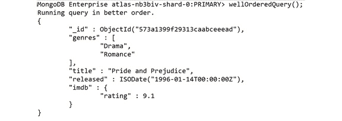

图 7.21：前面代码段的输出（为简洁起见截断）

从逻辑上讲，这一变化意味着我们要做的第一件事是在对所有符合条件的文档进行排序之前获取它们的列表，然后我们选择前五名，并仅投影这五个文档。

两条管道输出相同的结果，但第二条管道更健壮，更容易理解。您可能不会总是看到这种更改会显著提高性能，尤其是在较小的数据集上。但是，这是一个很好的实践，因为它将帮助您创建逻辑、高效和简单的管道，这些管道可以更容易地修改或扩展。

## 使用你的索引

索引是 MongoDB 查询性能的另一个关键元素。本书在*第 9 章*、*性能*中进一步深入介绍了索引及其创建。在创建聚合时，您需要记住的是，在使用诸如**$sort**和**$match**等阶段时，您需要确保在正确索引的字段上操作。使用索引的概念将变得更加明显。

## 考虑期望的输出

改进管道最重要的方法之一是规划和评估管道，以确保获得所需的输出，从而解决业务问题。如果您在创建微调管道时遇到困难，请问自己以下问题：

*   我是否输出所有数据来解决问题？
*   我是否只输出解决问题所需的数据？
*   我是否能够合并或删除任何中间步骤？

如果您已经对管道进行了评估、调整，但仍然发现它过于复杂或效率低下，那么您可能需要询问一些有关数据本身的问题。聚合困难是因为设计了错误的查询，还是因为提出了错误的问题？或者，这可能是需要重新评估数据形状的迹象。

## 聚合选项

更改管道是您在使用聚合时花费大部分时间的地方，对于初学者来说，您可能只需编写管道就可以完成大部分目标。如本章前面所述，可以将多个选项传递到**聚合**命令中，以配置其操作。我们不会深入研究这些选项，但认识它们是有帮助的。下面是一个聚合示例，其中包括我们的一些选项：

```js
    var options = { 
        maxTimeMS: 30000,
        allowDiskUse: true
        }
    db.movies.aggregate(pipeline, options);
```

要指定这些选项，将在管道数组之后向命令中传递第二个参数。在这种情况下，我们称之为**选项**。需要注意的一些选项包括：

*   **maxTimeMS**：在 MongoDB 杀死一个操作之前，可以处理该操作的时间量。本质上是聚合的超时。默认为**0**，表示操作不超时。
*   **allowDiskUse**：聚合管道中的阶段可能只会占用最大内存量，这使得处理海量数据集具有挑战性。通过将此选项设置为**true**，MongoDB 可以写入临时文件，以允许处理更多数据。
*   **bypassDocumentValidation**：此选项专门用于将使用**$out**或**$merge**写入集合的管道。如果此选项设置为**true**，则从该管道写入集合的文档将不会进行文档验证。
*   **注释**：此选项仅用于调试，允许指定一个字符串，以帮助在解析数据库日志时识别此聚合。
*   现在让我们做一个练习，将我们学到的概念付诸实践。

## 练习 7.06：寻找获奖纪录片

在看到了在以前的练习中实现的聚合管道的结果以及它们给电影院公司带来的价值之后，该公司的一些内部工程师试图自己编写一些新的聚合。电影院公司要求您审查这些管道，以协助其内部工程师的学习过程。您将使用前面的一些技术以及您对前三个主题中的聚合的理解来修复管道。这个简单管道的目标是获得一个高收视率的纪录片列表。

对于此场景，您还将在假设集合中有大量数据的情况下工作。提供给您的待审查管道如下所示。本练习的目的是查找一些获奖纪录片，然后列出获奖最多的影片：

```js
var findAwardWinningDocumentaries = function() {
    print("Finding award winning documentary Movies...");
    var pipeline = [
        { $sort: {"awards.wins": -1}}, // Sort by award wins.
        { $match: {"awards.wins": { $gte: 1}}},
        { $limit: 20}, // Get the top 20 movies with more than           one award
        { $match: {
            genres: {$in: ["Documentary"]}, // Documentary               movies only.
        }},
        { $project: { title: 1, genres: 1, awards: 1}},
        { $limit: 3}, 
    ];
    var options = { }
    db.movies.aggregate(pipeline, options).forEach(printjson);
}
findAwardWinningDocumentaries();
```

可通过以下步骤获得结果：

1.  首先，合并两个**$match**语句，并将**match**移动到管道顶部：

    ```js
    var pipeline = [
        { $match: {
            "awards.wins": { $gte: 1},
            genres: {$in: ["Documentary"]},
        }},
        { $sort: {"awards.wins": -1}}, // Sort by award wins.
        { $limit: 20}, // Get the top 20 movies. 
        { $project: { title: 1, genres: 1, awards: 1}},
        { $limit: 3},
    ];
    ```

2.  开始时不再需要**排序**，因此您可以将其移动到倒数第二步：

    ```js
    var pipeline = [
        { $match: {
            "awards.wins": { $gte: 1},
            genres: {$in: ["Documentary"]},
        }},
        { $limit: 20}, // Get the top 20 movies. 
        { $project: { title: 1, genres: 1, awards: 1}},
        { $sort: {"awards.wins": -1}}, // Sort by award wins.
        { $limit: 3},
    ];
    ```

3.  这两个限制不再需要。删除第一条：

    ```js
    var pipeline = [
        { $match: {
            "awards.wins": { $gte: 1},
            genres: {$in: ["Documentary"]},
        }},
        { $project: { itle: 1, genres: 1, awards: 1}},
        { $sort: {"awards.wins": -1}}, // Sort by award wins.
        { $limit: 3},
    ];
    ```

4.  最后，将投影移到最后，因为它只需要操作最后三个文档：

    ```js
    var pipeline = [
        { $match: {
            "awards.wins": { $gte: 1},
            genres: {$in: ["Documentary"]},
        }},
        { $sort: {"awards.wins": -1}}, // Sort by award wins.
        { $limit: 3},
        { $project: { title: 1, genres: 1, awards: 1}},
    ];
    ```

5.  看起来已经好多了。您已经被告知集合非常庞大，因此也可以向聚合添加一些选项：

    ```js
    var options ={
            maxTimeMS: 30000,
            allowDiskUse: true,
            comment: "Find Award Winning Documentary Films"
        }
        db.movies.aggregate(pipeline, options).forEach(printjson);
    ```

6.  Run the full query:

    ```js
    var findAwardWinningDocumentaries = function() {
        print("Finding award winning documentary Movies...");
        var pipeline = [
            { $match: {
                "awards.wins": { $gte: 1},
                genres: {$in: ["Documentary"]},
            }},
            { $sort:  {"awards.wins": -1}}, // Sort by award wins.
            { $limit: 3},
            { $project: { title: 1, genres: 1, awards: 1}},
        ];

        var options ={
            maxTimeMS: 30000,
            allowDiskUse: true,
            comment: "Find Award Winning Documentary Films"
        }
        db.movies.aggregate(pipeline, options).forEach(printjson);
    }
    findAwardWinningDocumentaries();
    ```

    因此，您的结果应如下所示：

    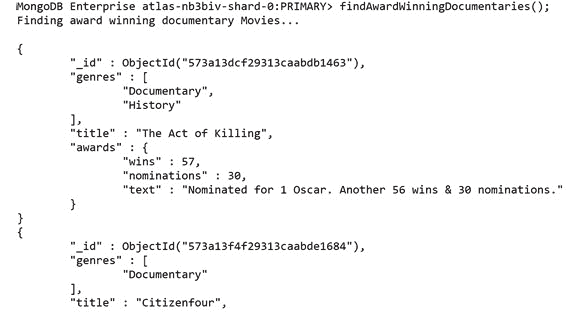

图 7.22：获奖纪录片列表（为简洁起见截短）

这样，您就可以根据电影公司的要求检索获奖纪录片列表。我们在本主题中看到，为了从聚合中获得最大价值，您需要设计、测试并不断重新评估您的管道。然而，前面列出的启发式方法只是设计有用聚合的模式的一小部分，并且总是建议研究其他模式和过程。

我们还看到了如何将一些选项传递给**聚合**命令，以帮助我们处理特定用例或可能需要更长时间处理的海量数据集。

## 活动 7.01：将聚合付诸实践

在之前的练习中，电影公司对您使用聚合管道从数据中提取的见解印象深刻。然而，该公司在管理不同的查询和将数据组合成有意义的结果方面遇到了困难。他们决定，他们想要一个单一的、统一的聚合，为即将到来的电影马拉松活动总结基本信息。

您的目标是设计、测试和运行将创建此统一视图的聚合管道。您应该确保聚合的最终输出能够解决以下业务问题：

*   对于每种类型，哪部电影的提名最多，因为他们至少获得了一项提名？
*   如果每部电影都有 12 分钟的预告片，那么每部电影的附加运行时间是多少？
*   这是一个关于用户对这部电影的评论的例子。
*   因为这是一场经典的电影马拉松，只有 2001 年之前发行的电影才有资格。
*   在所有类型中，列出获奖次数最多的所有类型。

无论您选择哪种方式，都可以完成此活动，但请尝试将重点放在创建一个简单高效的聚合管道上，以便在将来对其进行调整或修改。有时，最好尝试确定输出文档的外观，然后从那里向后工作。

请记住，您也可以选择使用**$sample**阶段在测试时加快查询速度，但您必须在最终解决方案中删除这些步骤。

为了保持所需的输出简单，将此场景的结果限制为三个文档。

以下步骤将帮助您完成此任务：

1.  过滤掉 2001 年之前未发布的任何文档。
2.  筛选出没有至少一次获奖的任何文档。
3.  按奖项提名对文件进行排序。
4.  将文档分组为一种类型。
5.  每组取第一部电影。
6.  取每组获奖总数。
7.  加入**评论**集合，获得每部电影的评论列表。
8.  使用投影将每部电影的评论数量减少到一条。（提示：使用**$slice**操作符减少数组长度。）
9.  将 12 分钟的预告片时间附加到每部电影的运行时间。
10.  根据获奖总数对结果进行排序。
11.  限制三份文件。

所需的输出如下：


图 7.23：执行活动步骤后的最终输出

笔记

此活动的解决方案可通过[此链接](14.html#_idTextAnchor473)找到。

# 总结

在本章中，我们介绍了理解、编写、理解和改进 MongoDB 聚合所需的所有基本组件。此新功能将帮助您回答有关数据的更复杂和困难的问题。通过创建连接多个集合的多阶段管道，可以将查询范围扩大到整个数据库，而不是单个集合。我们还研究了如何将结果写入新的集合中，以便进一步探索或操纵数据。

在最后一节中，我们讨论了确保管道编写时考虑可伸缩性、可读性和性能的重要性。通过关注这些方面，您的管道将在未来继续提供价值，并可以作为进一步聚合的基础。

然而，我们在这里介绍的只是使用聚合特性可以完成的工作的开始。为了真正掌握 MongoDB 技能，您必须不断探索、试验和测试您的管道。

在下一章中，我们将在 Node.js 中以 MongoDB 作为后端创建一个应用程序。即使您不是开发人员，这也会让您有意义地了解 MongoDB 应用程序是如何构建的，并对构建和执行动态查询有更深入的了解。****