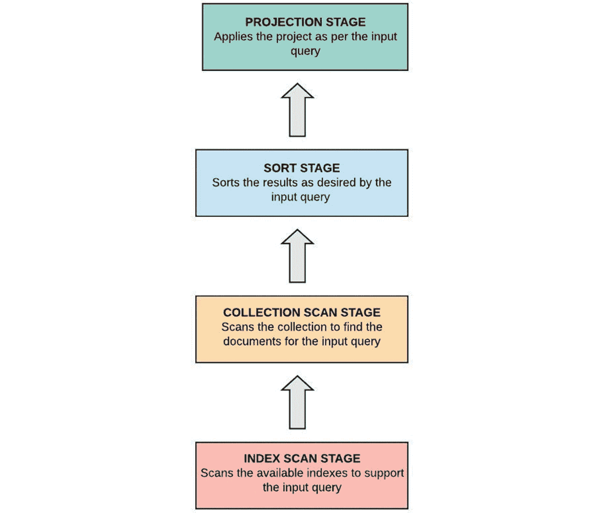
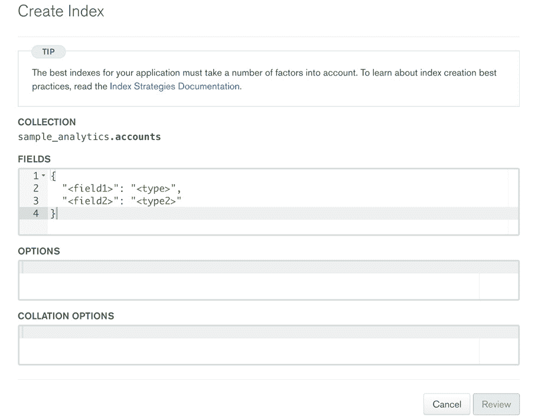
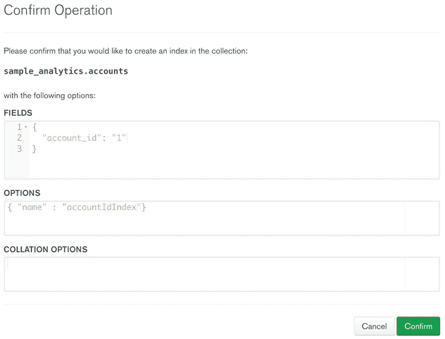
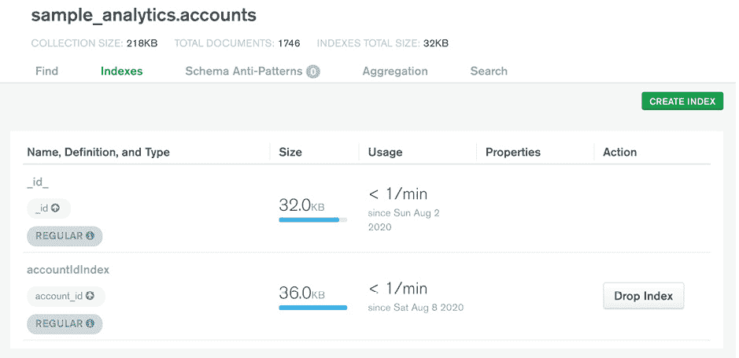
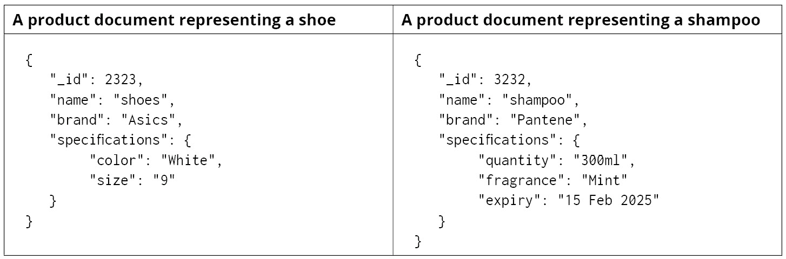

# 九、性能

概述

本章向您介绍 MongoDB 中查询优化和性能改进的概念。在继续讨论数据库索引以及索引如何缩短查询执行时间之前，您将首先研究查询执行的内部工作方式，并确定可能影响查询性能的因素。您还将学习如何创建、列出和删除索引，并学习各种类型的索引及其优点。在最后一节中，将向您介绍各种查询优化技术，这些技术可以帮助您有效地使用索引。在本章结束时，您将能够分析查询并使用索引和优化技术来提高查询性能。

# 导言

在前面的章节中，我们学习了 MongoDB 查询语言和各种查询运算符。我们学习了如何编写查询来检索数据。我们还学习了用于添加和删除数据以及更新或修改数据的各种命令。我们确保查询为我们带来所需的输出；但是，我们没有太多地关注它们的执行时间和效率。在本章中，我们将重点讨论如何分析查询的性能，并在需要时进一步优化其性能。

真实世界的应用程序由多个组件组成，例如用户界面、处理组件、数据库等等。应用程序的响应性取决于每个组件的效率。数据库组件执行不同的操作，例如保存、读取和更新数据。数据库表或集合存储的数据量，或从数据库中推入或检索的数据量，都会影响整个系统的性能。因此，了解数据库操作的执行效率以及是否可以进一步优化以提高这些操作的速度非常重要。

在下一节中，您将学习如何基于数据库提供的详细统计信息分析查询，并使用它们来识别问题。

# 查询分析

为了编写高效的查询，分析它们、发现任何可能的性能问题并修复它们是很重要的。这种技术称为性能优化。有许多因素会对查询的性能产生负面影响，例如不正确的缩放、不正确的集合结构以及 RAM 和 CPU 等资源不足。但是，最大也是最常见的因素是查询执行期间扫描的记录数与返回的记录数之间的差异。差异越大，查询速度越慢。谢天谢地，在 MongoDB 中，这个因素是最容易处理的，并且是使用索引完成的。

在集合上创建和使用索引可以减少扫描的记录数，并显著提高查询性能。不过，在深入研究索引之前，我们首先需要介绍查询执行的细节。

假设您想查找 2015 年发行的电影列表。以下代码段显示了此命令的命令：

```js
db.movies.find(
    { 
        "year" : 2015
    },
    {
        "title" : 1, 
        "awards.wins" : 1
    }
).sort(
    {"awards.wins" : -1}
)
```

该查询根据**年**字段过滤**电影**集合，在输出中预测赢得的电影标题和奖项，并对结果进行排序，以使赢得最多的电影出现在顶部。如果我们通过连接 MongoDB Atlas**sample_mflix**数据库执行此查询，则返回**484**条记录。

要执行任何此类查询，MongoDB 查询执行引擎将准备一个或多个查询执行计划。数据库有一个内置的查询优化器，它为执行选择最有效的计划。计划通常由多个处理阶段组成，这些阶段按顺序执行以产生最终输出。我们创建的上一个查询有一个查询条件、一个投影表达式和一个排序规范。对于形状相似的查询，典型的执行计划如*图 9.1*所示：



图 9.1：查询执行阶段

首先，如果给定查询条件有支持索引，则扫描该索引以识别匹配的记录。在我们的例子中，**年**字段没有索引，因此索引扫描阶段将被忽略。在下一阶段，将扫描整个集合以查找匹配的记录。然后，匹配的记录被传递到排序阶段，在那里记录在内存中被排序。最后，将投影应用于已排序的记录，并将最终输出交付给客户机。

MongoDB 提供了一种查询分析机制，通过该机制，我们可以获取有关查询执行的一些有用的统计信息。在下一节中，我们将学习如何使用查询分析和统计数据来识别上一个查询中的性能问题。

## 解释问题

**explain（）**函数对于探索查询的内部工作非常有用。该函数可与查询或命令一起使用，以打印与其执行相关的详细统计信息。它能为我们提供的最重要指标如下：

*   查询执行时间
*   扫描的文档数
*   返回的文件数
*   使用的索引

下面的代码片段显示了一个示例，该示例使用您先前创建的同一查询对查询使用**explain**函数：

```js
db.movies.explain().find(
    { 
        "year" : 2015
    },
    {
        "title" : 1, 
        "awards.wins" : 1
    }
).sort(
    {"awards.wins" : -1}
)
```

请注意，**解释**功能也可以与以下命令一起使用：

*   **移除（）**
*   **更新（）**
*   **计数（）**
*   **骨料（）**
*   **不同的（）**
*   **查找并修改（）**

默认情况下，**explain**功能打印查询计划器详细信息，即各个执行阶段的详细信息。这可以在以下代码段中看到：

```js
       "queryPlanner" : {
          "plannerVersion" : 1,
          "namespace" : "mflix.movies",
          "indexFilterSet" : false,
          "parsedQuery" : {
               "year" : {
                    "$eq" : 2015
               }
          },
          "queryHash" : "9A7F8C29",
          "planCacheKey" : "9A7F8C29",
          "winningPlan" : {
               "stage" : "PROJECTION_DEFAULT",
               "transformBy" : {
                    "title" : 1,
                    "awards.wins" : 1
               },
               "inputStage" : {
                    "stage" : "SORT",
                    "sortPattern" : {
                         "awards.wins" : -1
                    },
                    "inputStage" : {
                         "stage" : "SORT_KEY_GENERATOR",
                         "inputStage" : {
                              "stage" : "COLLSCAN",
                              "filter" : {
                                   "year" : {
                                        "$eq" : 2015
                                   }
                              },
                              "direction" : "forward"
                         }
                    }
               }
          },
          "rejectedPlans" : [ ]
     },
```

输出显示获胜计划和被拒绝计划的列表。在前面的查询中，由于没有合适的索引，执行从**COLLSCAN**开始。因此，查询没有任何被拒绝的计划，唯一可用的计划是获胜的计划。在获胜计划中，有多个嵌套的**inputStage**对象，清楚地显示了不同阶段的执行顺序。

第一阶段为**COLLSCAN**，在**年**字段中应用过滤器。下一阶段**排序**根据**awards.wins**字段，即获奖数量进行排序。最后在**投影默认**阶段，选择**标题**和**奖项**字段并在输出中返回。

**explain**函数可以采用一个名为 verbosity mode 的可选参数，该参数控制函数返回的信息。以下列表详细说明了三种不同的详细程度：

1.  **查询计划器**：默认选项，打印查询计划器明细，如被拒绝的计划、中标计划、中标计划的执行阶段等。
2.  **executionStats**：此选项打印**queryPlanner**提供的所有信息以及查询执行的详细执行统计信息。此选项对于查找查询中任何与性能相关的问题非常有用。
3.  **allPlansExecution**：此选项输出**executionStats**提供的详细信息以及被拒绝的执行计划的详细信息。

## 查看执行统计信息

为了查看执行统计信息，您需要将**executionStats**作为参数传递给**explain（）**函数。以下代码片段显示了供您查询的**executionStats**：

```js
       "executionStats" : {
          "executionSuccess" : true,
          "nReturned" : 484,
          "executionTimeMillis" : 85,
          "totalKeysExamined" : 0,
          "totalDocsExamined" : 23539,
          "executionStages" : {
               "stage" : "PROJECTION_DEFAULT",
               "nReturned" : 484,
               "executionTimeMillisEstimate" : 3,
               "works" : 24027,
               "advanced" : 484,
               "needTime" : 23542,
               "needYield" : 0,
               "saveState" : 187,
               "restoreState" : 187,
               "isEOF" : 1,
               "transformBy" : {
                    "title" : 1,
                    "awards.wins" : 1
               },
               "inputStage" : {
                    "stage" : "SORT",
                    "nReturned" : 484,
                    "executionTimeMillisEstimate" : 3,
                    "works" : 24027,
                    "advanced" : 484,
                    "needTime" : 23542,
                    "needYield" : 0,
                    "saveState" : 187,
                    "restoreState" : 187,
                    "isEOF" : 1,
                    "sortPattern" : {
                         "awards.wins" : -1
                    },
                    "memUsage" : 613758,
                    "memLimit" : 33554432,
                    "inputStage" : {
                         "stage" : "SORT_KEY_GENERATOR",
                         "nReturned" : 484,
                         "executionTimeMillisEstimate" : 3,
                         "works" : 23542,
                         "advanced" : 484,
                         "needTime" : 23057,
                         "needYield" : 0,
                         "saveState" : 187,
                         "restoreState" : 187,
                         "isEOF" : 1,
                         "inputStage" : {
                              "stage" : "COLLSCAN",
                              "filter" : {
                                   "year" : {
                                        "$eq" : 2015
                                   }
                              },
                              "nReturned" : 484,
                              "executionTimeMillisEstimate" : 3,
                              "works" : 23541,
                              "advanced" : 484,
                              "needTime" : 23056,
                              "needYield" : 0,
                              "saveState" : 187,
                              "restoreState" : 187,
                              "isEOF" : 1,
                              "direction" : "forward",
                              "docsExamined" : 23539
                         }
                    }
               }
          }
     },
```

执行统计数据提供了与每个执行阶段相关的有用指标，以及一些顶级字段，其中一些指标在查询的整个执行过程中聚合。以下是执行统计数据中一些最重要的指标：

*   **executionTimeMillis**：查询执行的总时间（毫秒）。
*   **TotalKeysInspected**：表示扫描的索引键数。
*   **TotalDocsChecked**：表示根据给定查询条件检查的单据数。
*   **nReturn**：查询输出返回的记录总数。

现在，让我们在下一节中分析执行统计数据。

## 识别问题

执行统计数据（从前面的代码片段中可以看到）告诉我们查询过程中存在一些问题。为了返回**484**匹配记录，查询检查了**23539**单据，这也是集合中的单据总数。必须扫描大量文档会降低查询的执行速度。从**85**毫秒的查询执行时间来看，似乎已经足够快了。但是，查询执行时间可能会根据网络流量、服务器上的 RAM 和 CPU 负载以及扫描的记录数而有所不同。扫描文档的数量降低性能的原因将在下一节中解释。

## 线性搜索

当我们对集合执行带有搜索条件的**find**查询时，数据库搜索引擎会选择集合中的第一条记录，并检查它是否符合给定的条件。如果没有找到匹配项，搜索引擎将转到下一条记录以查找匹配项，并重复该过程，直到找到搜索。

这种搜索技术称为顺序或线性搜索。当线性搜索应用于少量数据时，或在最佳情况下，即在第一次搜索中找到所需术语时，线性搜索的性能会更好。因此，在小集合中搜索文档时，搜索性能会很好。但是，如果有大量数据，或者在最坏的情况下，当所需的术语出现在收集的末尾时，数据量会明显变差。

大多数情况下，当一个新构建的系统投入使用时，集合要么是空的，要么是包含非常少量的数据。因此，所有数据库操作都是即时的。但是，随着时间的推移，随着集合规模的增长，相同的操作开始花费更长的时间。缓慢的主要原因是线性搜索，这是大多数数据库（包括 MongoDB）使用的默认搜索算法。通过在集合的特定字段上创建索引，可以避免或至少限制线性搜索。在下一节中，我们将详细探讨这个概念。

# 指标介绍

数据库可以维护和使用索引来提高搜索效率。在 MongoDB 中，索引是在字段或字段组合上创建的。数据库维护索引字段及其部分数据的特殊注册表。注册表很容易搜索，因为它在索引字段的值和集合中的各个文档之间保持逻辑链接。在搜索操作期间，数据库首先在注册表中定位值，并相应地标识集合中的匹配文档。注册表中的值始终按值的升序或降序排序，这有助于范围搜索和结果排序。

为了更好地理解索引注册表在搜索过程中的帮助，假设您正在按剧院 ID 搜索剧院，如下所示：

```js
db.theaters.find(
    {"theaterId" : 1009}
)
```

在**sample_mflix**数据库上执行查询时，返回一条记录。请注意，集合中的影院总数为 1564 家。下图描述了带索引和不带索引的文档搜索之间的差异：


图 9.2：带索引和不带索引的数据搜索

下表显示了在这两种不同情况下扫描的文档数与返回的文档数。


图 9.3：扫描文件和返回文件的详细信息

从上表可以看出，使用索引进行搜索比不使用索引进行搜索更可取。在本节中，我们了解到数据库支持索引以更快地检索数据，以及索引注册表如何帮助避免完整的集合扫描。现在我们将学习如何创建索引并在集合中查找索引。

# 创建并列出索引

可以通过对集合执行**createIndex（）**命令来创建索引，如下所示：

```js
db.collection.createIndex(
keys, 
options
)
```

该命令的第一个参数是键值对列表，其中每对键值对由字段名和排序顺序组成，可选的第二个参数是控制索引的一组选项。

在上一节中，您编写了以下查询以查找 2015 年发行的所有电影，按获奖数量降序排列，并打印标题和获奖数量：

```js
db.movies.find(
    { 
        "year" : 2015
    },
    {
        "title" : 1, 
        "awards.wins" : 1
    }
).sort(
    {"awards.wins" : -1}
)
```

由于查询在**年**字段上使用过滤器，因此需要在该字段上创建索引。下一个命令通过传递排序顺序**1**，在**年**字段上创建索引，表示升序：

```js
db.movies.createIndex(
    {year: 1}
)
```

下一个代码段显示在 mongo shell 上执行命令后的输出：

```js
 {
     "createdCollectionAutomatically" : true,
     "numIndexesBefore" : 2,
     "numIndexesAfter" : 3,
     "ok" : 1,
     "$clusterTime" : {
          "clusterTime" : Timestamp(1596352285, 3),
          "signature" : {
               "hash" : BinData(0,"Ce9YztoqHYaBhubyzM3SsujEYFY="),
               "keyId" : NumberLong("6853300587753111555")
          }
     },
     "operationTime" : Timestamp(1596352285, 3)
}
```

输出表明索引已成功创建。它还提到了在执行此命令之前和之后存在的索引数量（请参阅代码中突出显示的部分）以及创建索引的时间。

## 列出集合上的索引

您可以使用**getIndexes（）**命令列出集合的索引。此命令不接受任何参数。它只返回一个包含一些基本细节的索引数组。

执行以下命令将列出**电影**集合中存在的所有索引：

```js
db.movies.getIndexes()
```

其输出如下所示：

```js
[
     {
          "v" : 2,
          "key" : {
               "_id" : 1
          },
          "name" : "_id_",
          "ns" : "sample_mflix.movies"
     },
     {
          "v" : 2,
          "key" : {
               "_fts" : "text",
               "_ftsx" : 1
          },
          "name" : "cast_text_fullplot_text_genres_text_title_text",
          "default_language" : "english",
          "language_override" : "language",
          "weights" : {
               "cast" : 1,
               "fullplot" : 1,
               "genres" : 1,
               "title" : 1
          },
          "ns" : "sample_mflix.movies",
          "textIndexVersion" : 3
     },
     {
          "v" : 2,
          "key" : {
               "year" : 1
          },
          "name" : "year_1",
          "ns" : "sample_mflix.movies"
     }
]
```

输出表明集合上有三个索引，包括刚才创建的索引。对于每个索引，它显示版本、索引字段及其排序顺序、索引名称以及由索引名称和数据库名称组成的命名空间。请注意，在**年**字段上创建索引时，您没有指定其名称。在下一节中，您将看到如何派生索引名。

## 索引名

如果没有明确提供名称，MongoDB 将为索引指定默认名称。索引的默认名称由字段名和排序顺序组成，用下划线分隔。如果索引中有多个键（称为复合索引），则以相同的方式连接所有键。

以下命令为**theateId**字段创建索引，但不提供名称：

```js
db.theaters.createIndex(
    {theaterId : 1}
)
```

此命令将导致创建一个具有默认名称**theaterId_1**的索引。

但是，也可以使用特定名称创建索引。为此，您可以使用**name**属性为索引提供自定义名称，如下所示：

```js
db.theaters.createIndex(
    {theaterId : -1},
    {name : "myTheaterIdIndex"}
);
```

前面的命令将创建一个名为**myTheaterIdIndex**的索引。在下一个练习中，您将使用 MongoDB Atlas 创建索引。

## 练习 9.01：使用 MongoDB Atlas 创建索引

在上一节中，您学习了如何使用 mongo shell 创建索引。在本练习中，您将使用 MongoDB Atlas 门户在**账户**集合上创建索引，该索引存在于**样本分析**数据库中。执行以下步骤以完成此练习：

1.  在[登录您的帐户 https://www.mongodb.com/cloud/atlas](https://www.mongodb.com/cloud/atlas) 。
2.  Go to the **sample_analytics** database and select the **accounts** collection. On the collection screen, select the **Indexes** tab, and you should see one index.

    

    图 9.4:sample_analytics 数据库中 accounts 集合中的 Indexes 选项卡

3.  Click on the **CREATE INDEX** button in the top-right corner. You should be presented with a modal, as shown in the following figure:

    

    图 9.5：创建索引页面

4.  To create an index on **account_id**, remove the default field and type entries from the **FIELDS** section. Introduce **account_id** as the field and type with value **1** for ascending index order. The following is a screenshot showing the updated **FIELDS** section:

    

    图 9.6：更新字段部分

5.  Pass the **name** parameter to provide a custom name for this index in the **OPTIONS** section, as shown here:

    

    图 9.7：在选项部分传递 name 参数

6.  Once you update the fields section, the **Review** button should turn green. Click on it to go to the next step:

    

    图 9.8“查看”按钮

7.  A confirmation screen will be presented to you. Click the **Confirm** button on the following screen to finish creating the index:

    

图 9.9：确认屏幕

索引创建完成后，将更新索引列表，如下所示：



图 9.10：更新的索引列表

在本练习中，您已经成功地使用 MongoDB Atlas 门户创建了索引。

现在，您已经了解了如何在集合上创建索引。接下来，您将看到索引字段如何提高查询性能。

# 索引后的查询分析

在*查询分析*部分中，您分析了没有适当索引来支持其查询条件的查询的性能。因此，查询扫描了集合中的所有**23539**单据，返回**484**匹配单据。现在您已经在**年**字段中添加了一个索引，让我们看看查询执行统计数据是如何变化的。

以下查询打印同一查询的执行统计信息：

```js
db.movies.explain("executionStats").find(
    { 
        "year" : 2015
    },
    {
        "title" : 1, 
        "awards.wins" : 1
    }
).sort(
    {"awards.wins" : -1}
)
```

此项的输出与前一项略有不同，如以下代码段所示：

```js
       "executionStats" : {
          "executionSuccess" : true,
          "nReturned" : 484,
          "executionTimeMillis" : 7,
          "totalKeysExamined" : 484,
          "totalDocsExamined" : 484,
          "executionStages" : {
               "stage" : "PROJECTION_DEFAULT",
               "nReturned" : 484,
               "executionTimeMillisEstimate" : 0,
               "works" : 971,
               "advanced" : 484,
               "needTime" : 486,
               "needYield" : 0,
               "saveState" : 7,
               "restoreState" : 7,
               "isEOF" : 1,
               "transformBy" : {
                    "title" : 1,
                    "awards.wins" : 1
               },
               "inputStage" : {
                    "stage" : "SORT",
                    "nReturned" : 484,
                    "executionTimeMillisEstimate" : 0,
                    "works" : 971,
                    "advanced" : 484,
                    "needTime" : 486,
                    "needYield" : 0,
                    "saveState" : 7,
                    "restoreState" : 7,
                    "isEOF" : 1,
                    "sortPattern" : {
                         "awards.wins" : -1
                    },
                    "memUsage" : 613758,
                    "memLimit" : 33554432,
                    "inputStage" : {
                         "stage" : "SORT_KEY_GENERATOR",
                         "nReturned" : 484,
                         "executionTimeMillisEstimate" : 0,
                         "works" : 486,
                         "advanced" : 484,
                         "needTime" : 1,
                         "needYield" : 0,
                         "saveState" : 7,
                         "restoreState" : 7,
                         "isEOF" : 1,
                         "inputStage" : {
                              "stage" : "FETCH",
                              "nReturned" : 484,
                              "executionTimeMillisEstimate" : 0,
                              "works" : 485,
                              "advanced" : 484,
                              "needTime" : 0,
                              "needYield" : 0,
                              "saveState" : 7,
                              "restoreState" : 7,
                              "isEOF" : 1,
                              "docsExamined" : 484,
                              "alreadyHasObj" : 0,
                              "inputStage" : {
                                   "stage" : "IXSCAN",
                                   "nReturned" : 484,
                                   "executionTimeMillisEstimate" : 0,
                                   "works" : 485,
                                   "advanced" : 484,
                                   "needTime" : 0,
                                   "needYield" : 0,
                                   "saveState" : 7,
                                   "restoreState" : 7,
                                   "isEOF" : 1,
                                   "keyPattern" : {
                                        "year" : 1
                                   },
                                   "indexName" : "year_1",
                                   "isMultiKey" : false,
                                   "multiKeyPaths" : {
                                        "year" : [ ]
                                   },
                                   "isUnique" : false,
                                   "isSparse" : false,
                                   "isPartial" : false,
                                   "indexVersion" : 2,
                                   "direction" : "forward",
                                   "indexBounds" : {
                                        "year" : [
                                             "[2015.0, 2015.0]"
                                        ]
                                   },
                                   "keysExamined" : 484,
                                   "seeks" : 1,
                                   "dupsTested" : 0,
                                   "dupsDropped" : 0
                              }
                         }
                    }
               }
          }
     },
```

第一个区别是第一阶段（即，**COLLSCAN**）现在被**IXSCAN**和**FETCH**阶段所取代。这意味着首先执行索引扫描阶段，然后根据检索到的索引引用从集合中提取数据。此外，顶级字段表示只检查了**484**个文档，并且返回了相同数量的文档。

因此，我们可以看到，通过减少扫描的文档数量，查询性能大大提高。这一点在这里很明显，因为查询执行时间现在从**85**毫秒减少到**7**毫秒。即使每年有越来越多的文档被推送到集合中，查询的性能仍将保持一致。

我们已经了解了如何创建索引以及如何列出集合中的索引。MongoDB 还提供了删除或删除索引的方法。下一节将详细探讨这一点。

# 隐藏和删除索引

删除索引意味着从索引注册表中删除字段的值。因此，如果字段上不存在其他索引，则对相关字段的任何搜索都将以线性方式执行。

需要注意的是，MongoDB 不允许更新现有索引。因此，要修复错误创建的索引，我们需要删除它并正确地重新创建它。

使用**dropIndex**功能删除索引。它采用单个参数，可以是索引名称，也可以是索引规范文档，如下所示：

```js
db.collection.dropIndex(indexNameOrSpecification)
```

索引规范文档是用于创建它的索引的定义（例如，如以下代码段）：

```js
db.movies.createIndex(
    {title: 1}
)
```

考虑下面的片段：

```js
db.movies.dropIndex(
     {title: 1}
)
```

此命令在**电影**集合的**标题**字段上删除索引：

```js
{
     «nIndexesWas» : 4,
     "ok" : 1,
     "$clusterTime" : {
          "clusterTime" : Timestamp(1596885249, 1),
          "signature" : {
               "hash" : BinData(0,"WNi8vLv+MUP5F7bUg6ZGAbhbT1o="),
               "keyId" : NumberLong("6853300587753111555")
          }
     },
     "operationTime" : Timestamp(1596885249, 1)
}
```

输出包含**nindexswas**（高亮显示），表示执行命令前的索引计数。**ok**字段显示状态为**1**，表示命令成功。

## 删除多个索引

您还可以使用**dropIndexes**命令删除多个索引。命令语法如下所示：

```js
db.collection.dropIndexes()
```

此命令可用于删除集合上的所有索引，默认的**\u id**索引除外。通过传递索引名或索引规范文档，可以使用该命令删除单个索引。还可以使用该命令通过传递索引名数组来删除一组索引。以下是**dropIndexes**命令的示例：

```js
db.theaters.dropIndexes()
```

前面的命令生成以下输出：

```js
{
     "nIndexesWas" : 3,
     «msg» : «non-_id indexes dropped for collection»,
     "ok" : 1,
     "$clusterTime" : {
          "clusterTime" : Timestamp(1596887253, 1),
          "signature" : {
               "hash" : BinData(0,"+OYwY3X1upiuad63SOAYOe0uPXI="),
               "keyId" : NumberLong("6853300587753111555")
          }
     },
     "operationTime" : Timestamp(1596887253, 1)
}
```

除默认的**索引外，所有索引都被删除，如**消息**属性（突出显示）中所确认的。**

 **## 隐藏索引

MongoDB 提供了一种对查询计划器隐藏索引的方法。创建和删除索引在时间上是昂贵的操作。对于大型集合，这些操作需要更长的时间才能完成。因此，在决定删除索引之前，您可以先隐藏它以分析性能影响，然后做出相应的决定。

要隐藏索引，可以在集合上使用**hideIndex（）**命令，如下所示：

```js
db.collection.hideIndex(indexNameOrSpecification)
```

该命令的参数类似于**dropIndex（）**函数的参数。它采用索引的名称或索引规范文档。

需要注意的一点是，隐藏索引仅出现在**getIndexes（）**函数调用中。每次对集合执行写入操作后，都会更新它们。但是，查询计划器不会看到这些索引，因此它们不能用于执行查询。

隐藏索引后，可以分析对查询的影响，如果确实不需要索引，则可以删除索引。但是，如果隐藏索引对性能有不利影响，可以使用**unhideIndex（）**函数恢复或取消隐藏索引，如下所示：

```js
db.collection.unhideIndex(indexNameOrSpecification)
```

**unhideIndex（）**函数接受一个参数，该参数可以是索引名称，也可以是索引规范文档。由于隐藏索引总是在写操作后更新，因此它们总是处于就绪状态。解除隐藏可以立即使其恢复运行。

## 练习 9.02：使用 Mongo Atlas 删除索引

在本练习中，您将使用 Atlas 门户从**样本分析**数据库的**账户**集合中删除索引。以下步骤将帮助您完成此练习：

1.  在[登录您的帐户 https://www.mongodb.com/cloud/atlas](https://www.mongodb.com/cloud/atlas) 。
2.  Go to the **sample_ analytics** database and select the **accounts** collection. On the collection screen, select the **Indexes** tab and you should see the existing indexes. Click on the **Drop Index** button next to the index that you want to remove:

    

    图 9.11:sample_analytics 数据库 accounts 集合的 Indexes 选项卡

3.  A confirmation dialog box should be presented as shown in the following figure. Enter the index name, which is also displayed in bold in the dialog message:

    

    图 9.12：输入要删除的索引的名称

4.  The index should be removed from the list of indexes, as indicated by the following screen. Note the absence of the **accountIdIndex** index:

    

图 9.13：指示 AccountId 索引已成功删除的 Indexes 选项卡

在本练习中，您练习了使用 MongoDB Atlas 门户在集合上删除索引。在下一节中，我们将介绍 MongoDB 中可用的索引类型。

# 指标类型

我们已经了解了索引如何帮助提高查询性能，以及如何在集合中创建、删除和列出索引。MongoDB 支持不同类型的索引，例如单键、多键和复合索引。每个索引都有不同的优点，在决定哪种类型适合您的集合之前，您需要知道这些优点。让我们从默认索引的简要概述开始。

## 默认索引

如前几章所示，集合中的每个文档都有一个主键（即，**\U id**字段），并且默认情况下索引。MongoDB 使用此索引来维护**字段的唯一性，它在所有集合上都可用。**

 **## 单键索引

使用集合中的单个字段创建的索引称为单键索引。您在本章前面使用了单键索引。语法如下：

```js
db.collection.createIndex({ field1: type}, {options})
```

## 复合指数

在搜索中使用单键索引可以显著减少要扫描的文档数量。但是，在某些情况下，单键索引不足以减少集合扫描。当查询基于多个字段时，通常会发生这种情况。

考虑您在 2015 中找到的发布查询的查询。您看到，在**年**字段上添加一个单键索引提高了查询性能。现在，您将根据**等级**字段修改查询并添加过滤器，如下所示：

```js
db.movies.find(
    { 
        "year" : 2015,
        "rated" : "UNRATED"
    },
    {
        "title" : 1, 
        "awards.wins" : 1
    }
).sort(
    {"awards.wins" : -1}
)
```

在此查询中使用**解释（“executionStats”）**并分析执行统计：

```js
"executionStats" : {
          "executionSuccess" : true,
          "nReturned" : 3,
          "executionTimeMillis" : 1,
          "totalKeysExamined" : 484,
          "totalDocsExamined" : 484,
          "executionStages" : {
```

前面的代码段来自查询的执行统计信息。以下是这些统计数据的重要观察结果：

*   由于索引的原因，仅扫描了**484 个**文档。
*   索引有助于定位**484**文档，第二个过滤器基于**等级**字段，通过收集扫描应用。

从这些方面来看，很明显，我们再次扩大了要扫描的文件数量和返回的文件数量之间的差异。当同一查询用于具有数千条记录的其他年份时，这可能是一个潜在的性能问题。对于这种情况，数据库允许您基于多个字段（称为复合索引）创建索引。**createIndex**命令可用于使用以下语法创建复合索引：

```js
db.collection.createIndex({ field1: type, field2: type, ...}, {options})
```

此语法与单个字段索引的语法类似，只是它接受多对字段及其各自的排序顺序。请注意，复合索引最多可包含**32 个**字段。

现在，在**年份**和**等级**字段上创建一个复合索引：

```js
db.movies.createIndex(
    {year : 1, rated : 1}
) 
```

此命令生成以下输出：

```js
{
     "createdCollectionAutomatically" : false,
     "numIndexesBefore" : 3,
     "numIndexesAfter" : 4,
     "ok" : 1,
     "$clusterTime" : {
          "clusterTime" : Timestamp(1596932004, 4),
          "signature" : {
               "hash" : BinData(0,"y8fxEd0oLD6+OkLmhCjirg2Cm14="),
               "keyId" : NumberLong("6853300587753111555")
          }
     },
     "operationTime" : Timestamp(1596932004, 4)
}
```

复合索引的默认名称包含字段名及其排序顺序，以下划线分隔。最后一个索引创建的索引的索引名称将为**年【U 1】级**。您还可以为复合索引指定自定义名称。

现在您已经在这两个字段上创建了一个附加索引，请观察查询提供的执行统计信息：

```js
"executionStats" : {
          "executionSuccess" : true,
          "nReturned" : 3,
          "executionTimeMillis" : 2,
          "totalKeysExamined" : 3,
          "totalDocsExamined" : 3,
          "executionStages" : {
```

前面的代码段表示复合索引用于执行此查询，而不是您先前创建的单键索引。扫描的文档数与返回的文档数相同。由于只扫描了**3**文档，因此查询执行时间也减少了。

## 多键索引

在数组类型的字段上创建的索引称为多键索引。当数组字段作为参数传递给**createIndex**函数时，MongoDB 会为数组的每个元素创建一个索引项。**createIndex**元素的语法与创建常规（非数组）字段索引的语法相同：

```js
db.collectionName.createIndex( { arrayFieldName: sortOrder } )
```

MongoDB 检查输入字段，如果它是一个数组，将创建一个多键索引。例如，考虑以下命令：

```js
db.movies.createIndex(
    {"languages" : 1}
)
```

此查询在**语言**字段上添加索引，该字段是一个数组。在 MongoDB 中，可以根据文档的数组字段中的元素查找文档。多键索引有助于加速此类查询：

```js
db.movies.explain("executionStats").count(
    {"languages": "Cantonese"}
)
```

让我们看看前面的查询是如何执行的：

```js
     "executionStats" : {
          "executionSuccess" : true,
          "nReturned" : 361,
          "executionTimeMillis" : 1,
          "totalKeysExamined" : 361,
          "totalDocsExamined" : 361,
          "executionStages" : {
```

执行统计的片段显示返回了**361 个**文档，并扫描了相同数量的文档。证明了多键索引的创建和使用是正确的。

## 文本索引

在字符串字段或字符串元素数组上定义的索引称为文本索引。文本索引没有排序，这意味着它们比普通索引快。创建文本索引的语法如下所示：

```js
db.collectionName.createIndex({ fieldName : "text"})
```

以下是要在**名称**字段的**用户**集合上创建的文本索引示例：

```js
db.users.createIndex(
    { name : "text"}
)
```

该命令应生成如下输出：

```js
{
     "createdCollectionAutomatically" : false,
     "numIndexesBefore" : 2,
     "numIndexesAfter" : 3,
     "ok" : 1,
     "$clusterTime" : {
          "clusterTime" : Timestamp(1596889407, 2),
          "signature" : {
               "hash" : BinData(0,"B4Ro1V1WTwkGUMGEImtxvctR9C4="),
               "keyId" : NumberLong("6853300587753111555")
          }
     },
     "operationTime" : Timestamp(1596889407, 2)
}
```

笔记

您不能通过传递索引规范文档来删除文本索引，只有在**dropIndex**函数中传递索引名称才能删除文本索引。

## 嵌套文档上的索引

文档可以包含嵌套对象以对一些属性进行分组。例如，**sample_mflix**数据库中的**剧院**集合包含**位置**字段，该字段有一个嵌套对象：

```js
{
     "_id" : ObjectId("59a47286cfa9a3a73e51e72c"),
     "theaterId" : 1000,
     "location" : {
          "address" : {
               "street1" : "340 W Market",
               "city" : "Bloomington",
               "state" : "MN",
               "zipcode" : "55425"
          },
          "geo" : {
               "type" : "Point",
               "coordinates" : [
                    -93.24565,
                    44.85466
               ]
          }
     }
}
```

使用点（**。**符号，您可以在任何嵌套文档字段上创建索引，就像集合中的任何其他字段一样，如下例所示：

```js
db.theaters.createIndex(
    { "location.address.zipcode" : 1}
)
```

您还可以在嵌入的文档上创建索引。例如，您可以在**位置**字段上创建索引，而不是其属性，如下所示：

```js
db.theaters.createIndex(
    { "location" : 1}
)
```

通过传递整个嵌套文档来搜索位置时，可以使用此类索引。

## 通配符索引

MongoDB 支持灵活的模式，不同的文档可以有不同类型和数量的字段。在并非所有文档中都存在的非统一字段上创建和维护索引可能会很困难。此外，在文档中引入新字段时，该字段仍保持未索引状态。

考虑到这一点，考虑下面的文档，从假设的 To.t0 产品。下表显示了两种不同的产品文档：



图 9.14：两种不同的产品规范文件

如您所见，**规范**下的字段本质上是动态的。不同的产品可以有不同的规格。在每个字段上定义索引将导致索引定义过多。由于不断添加具有新字段的新产品，因此在所有字段上创建索引的想法并不实际。MongoDB 提供通配符索引来解决此问题。例如，考虑下面的查询：

```js
db.products.createIndex(
    { "specifications.$**"  : 1}
)
```

此查询使用特殊通配符（**$****）在**规范**字段上创建索引。它将在**规范**下的所有字段上创建索引。如果将来添加新的嵌套字段，它们将自动编制索引。

同样，也可以在集合的顶级字段上创建通配符索引：

```js
db.products.createIndex(
    { "$**" : 1 } 
)
```

前面的命令在所有文档的所有字段上创建索引。因此，默认情况下，添加到文档中的所有新字段都将编制索引。

您还可以通过传递**通配符投影**选项和一个或多个字段名，从通配符索引中选择或省略特定字段，如以下代码段所示：

```js
db.products.createIndex(
    { "$**" : 1 },
    { 
        "wildcardProjection" : { "name" : 0 }
    }
)
```

前面的查询在集合的所有字段上创建通配符索引，不包括**名称**字段。要显式包含**名称**字段，不包括所有其他字段，您可以使用**1**值传递它。

笔记

MongoDB 提供了两个索引来支持几何字段：**2dsphere**和**2d**。这些索引超出了本书的范围，但感兴趣的读者可以在[上找到更多关于它们的信息 https://docs.mongodb.com/manual/geospatial-queries/#geospatial-索引](https://docs.mongodb.com/manual/geospatial-queries/#geospatial-indexes)。

既然我们已经介绍了索引的类型，我们将在下一节中探讨索引属性。

# 指标的性质

在本节中，我们将介绍 MongoDB 中索引的不同属性。索引属性可以影响索引的使用，还可以对集合强制执行某些行为。索引属性作为选项传递给**createdIndex**函数。我们将研究唯一索引、TTL（生存时间）索引、稀疏索引，最后是部分索引。

## 唯一索引

唯一索引属性限制索引键的复制。如果要保持集合中字段的唯一性，这非常有用。唯一字段有助于避免在准确识别文档时出现任何歧义。例如，在**许可证**集合中，**许可证编号**等唯一字段可以帮助单独识别每个文档。此属性对集合强制执行拒绝重复项的行为。可以在单个字段或字段组合上创建唯一索引。以下是在单个文件上创建唯一索引的语法：

```js
db.collection.createIndex(
    { field: type}, 
    { unique: true }
)
```

**{unique:true}**选项用于创建唯一索引。

在某些情况下，您可能希望字段的组合是唯一的。对于这种情况，您可以通过在创建复合索引时传递**unique:true**标志来定义唯一的复合索引，如下所示：

```js
db.collection.createIndex(
    { field1 : type, field2: type2, ...}, 
    { unique: true }
)
```

## 练习 9.03：创建唯一索引

在本练习中，您将在**样本库**中的**剧场**集合中强制执行**剧场 ID**字段的唯一性：

1.  将您的 shell 连接到 Atlas 集群并选择**sample_mflix**数据库。
2.  Confirm whether the **theaters** collection enforces any uniqueness of the **theaterId** field. To do so, find a record and try to insert another record using the same **theaterId** present in the fetched record. The following is the command to retrieve a document from the **theaters** collection:

    ```js
    db.theaters.findOne();
    ```

    这将产生以下输出，尽管您可能会得到不同的记录：

    

    图 9.15：从剧院集合检索文档的结果

3.  Now, insert a record with the same **theaterId** (that is, **1012**):

    ```js
    db.theaters.insertOne(
        {theaterId : 1012}
    );
    ```

    文档插入成功，证明**TERID**不是唯一字段。

4.  Now, create a unique index on the **theaterId** field using the following command:

    ```js
    db.theaters.createIndex(
        {theaterId : 1}, 
        {unique : true}
    )
    ```

    前面的命令将返回错误响应，因为这是集合中不存在重复记录的先决条件。以下是确认这一点的输出：

    ```js
    {
         "operationTime" : Timestamp(1596939398, 1),
         "ok" : 0,
         "errmsg" : "E11000 duplicate key error collection: 5f261717eae2b55842a6aff0_sample_mflix.theaters index: theaterId_1 dup key: { theaterId: 1012.0 }",
         "code" : 11000,
         "codeName" : "DuplicateKey",
         "keyPattern" : {
              "theaterId" : 1
         },
         "keyValue" : {
              "theaterId" : 1012
         },
         "$clusterTime" : {
              "clusterTime" : Timestamp(1596939398, 1),
              "signature" : {
                   "hash" : BinData(0,"hzOmtVWMNJkF3fkISbf3kJLLZIA="),
                   "keyId" : NumberLong("6853300587753111555")
              }
         }
    }
    ```

5.  现在，使用其**值

    ```js
    db.theaters.remove(
        {_id : ObjectId("5dd9c2d9de850e38c5cfc6dd")}
    )
    ```

    删除插入*步骤 3*的重复记录**
***   Try creating the unique index once again, as follows:

    ```js
    db.theaters.createIndex(
        {theaterId : 1},
        {unique : true}
    )
    ```

    这一次，您应该会收到一个成功的响应，如下所示：

    ```js
    {
         "createdCollectionAutomatically" : false,
         "numIndexesBefore" : 1,
         "numIndexesAfter" : 2,
         "ok" : 1,
         "$clusterTime" : {
              "clusterTime" : Timestamp(1596939728, 2),
              "signature" : {
                   "hash" : BinData(0,"hdejOvB7dqQojg46DRWRLJVwblM="),
                   "keyId" : NumberLong("6853300587753111555")
              }
         },
         "operationTime" : Timestamp(1596939728, 2)
    }
    ```

    *   Now that the field has a unique index, try inserting a duplicate record, as follows:

    ```js
    db.theaters.insertOne(
        {theaterId : 1012}
    );
    ```

    由于重复密钥错误，此命令将失败：

    ```js
    2020-08-09T12:24:11.584+1000 E  QUERY    [js] WriteError({
         "index" : 0,
         "code" : 11000,
         "errmsg" : "E11000 duplicate key error collection: sample_mflix.theaters index: theaterId_1 dup key: { theaterId: 1012.0 }",
         "op" : {
              "_id" : ObjectId("5f2f5e4b78436de2a47da0e4"),
              "theaterId" : 1012
         }
    }) :
    WriteError({
         "index" : 0,
         "code" : 11000,
         "errmsg" : "E11000 duplicate key error collection: sample_mflix.theaters index: theaterId_1 dup key: { theaterId: 1012.0 }",
         "op" : {
              "_id" : ObjectId("5f2f5e4b78436de2a47da0e4"),
              "theaterId" : 1012
         }
    })
    ```** 

 **在本练习中，您对索引强制了唯一性属性。

## TTL 指标

**TTL**（或**生存时间**索引在文档上设置了到期日。文档过期后，将被删除。只能在日期类型的字段上创建此索引。要创建索引，需要传递字段详细信息和**expireAfterSeconds**属性。以下代码段显示了创建 TTL 索引的语法：

```js
db.collection.createIndex({ field: type}, { expireAfterSeconds: seconds })
```

这里，**{expireAfterSeconds:seconds}**选项用于创建 TTL 索引。MongoDB 删除已超过**expireAfterSeconds**值阈值的文档。

## 练习 9.04：使用 Mongo Shell 创建 TTL 索引

在本练习中，您将在名为**reviews**的集合上创建一个 TTL 索引。一个名为**reviewDate**的字段将用于捕获当前审核日期和时间。您将引入一个 TTL 索引来检查是否删除了超过阈值的记录：

1.  将 mongo 外壳连接到 Atlas 集群，并切换到**样本库**数据库。
2.  通过插入两个文档创建**评论**集合，如下所示：

    ```js
    db.reviews.insert(
        {"reviewer" : "Eliyana A" , "movie" : "Cast Away","review" : "Interesting plot", "reviewDate" : new Date() }
    );
    db.reviews.insert(
        {"reviewer" : "Zaid A" , "movie" : "Sully","review" : "Captivating", "reviewDate" : new Date() }
    );
    ```

3.  Fetch these documents from the **reviews** collection to confirm they exist in the collection:

    ```js
    db.reviews.find().pretty();
    ```

    此命令产生以下输出：

    ```js
    {
         "_id" : ObjectId("5f2f65d978436de2a47da0e5"),
         "reviewer" : "Eliyana",
         "movie" : "Cast Away",
         "review" : "Interesting plot",
         "reviewDate" : ISODate("2020-08-09T02:56:25.415Z")
    }
    {
         "_id" : ObjectId("5f2f65dd78436de2a47da0e6"),
         "reviewer" : "Zaid",
         "movie" : "Sully",
         "review" : "Captivating",
         "reviewDate" : ISODate("2020-08-09T02:56:29.144Z")
    }
    ```

4.  Introduce a TTL index to expire documents older than 60 seconds, using the following command:

    ```js
    db.reviews.createIndex(
        { reviewDate: 1}, 
        { expireAfterSeconds: 60 }
    )
    ```

    这将产生以下输出：

    ```js
     {
         "createdCollectionAutomatically" : false,
         "numIndexesBefore" : 1,
         "numIndexesAfter" : 2,
         "ok" : 1,
         "$clusterTime" : {
              "clusterTime" : Timestamp(1596941915, 2),
              "signature" : {
                   "hash" : BinData(0,"s5DU9ZElN+N2cCZ8d27pV5802Uk="),
                   "keyId" : NumberLong("6853300587753111555")
              }
         },
         "operationTime" : Timestamp(1596941915, 2)
    }
    ```

5.  After 60 seconds, execute the **find** query again:

    ```js
    db.reviews.find().pretty();
    ```

    查询不会返回任何记录，并证明两个文档在 60 秒后都被删除。

在本练习中，您在集合上创建了一个 TTL 索引，并看到文档在指定的时间（即 60 秒）后过期。

## 稀疏索引

在字段上创建索引时，所有文档中该字段的所有值都保存在索引注册表中。如果文档中不存在该字段，则为该文档注册一个**null**值。相反，如果索引被标记为**稀疏**，则仅注册存在给定字段且具有某个值（包括**null**的文档。稀疏索引不会包含索引字段不存在的集合中的条目，这就是为什么这种类型的索引称为稀疏索引。

复合索引也可以标记为稀疏索引。对于复合稀疏索引，只有存在字段组合的文档才会注册。稀疏索引是通过向**createIndex**命令传递一个标志**{Sparse:true}**来创建的，如以下代码段所示：

```js
db.collection.createIndex({ field1 : type, field2: type2, ...}, { sparse: true })
```

MongoDB 不提供任何命令来列出由索引维护的文档。这使得分析稀疏索引的行为变得困难。正如您将在下一个练习中看到的那样，**db.collection.stats（）**函数在这里非常有用。

## 练习 9.05：使用 Mongo Shell 创建稀疏索引

在本练习中，您将在**评论**集合中的**评论**字段上创建一个稀疏索引。您将验证索引仅为存在**审阅**字段的文档维护条目。为此，您将使用**db.collection.stats（）**命令检查索引的大小，方法是先插入带有索引字段的文档，然后再插入不带索引字段的文档。插入文档时，如果没有**审阅**字段，索引的大小应保持不变：

1.  将 mongo 外壳连接到 Atlas 集群，并切换到**样本库**数据库。
2.  在**审阅**字段

    ```js
    db.reviews.createIndex(
        {review: 1},
        {sparse : true}
    )
    ```

    上创建稀疏索引
3.  Check the size of the index on the current collection:

    ```js
    db.reviews.stats();
    ```

    此命令产生以下输出：

    ```js
    {
         "ns" : "sample_mflix.reviews",
         "size" : 0,
         "count" : 0,
         "storageSize" : 36864,
         "capped" : false,
         "nindexes" : 3,
         "indexBuilds" : [ ],
         "totalIndexSize" : 57344,
         "indexSizes" : {
              "_id_" : 36864,
              "reviewDate_1" : 12288,
              «review_1» : 8192
         },
         "scaleFactor" : 1,
         "ok" : 1,
         "$clusterTime" : {
              "clusterTime" : Timestamp(1596943433, 1),
              "signature" : {
                   "hash" : BinData(0,"9z0Sj95cZplzIj5JQv+IgYfMIPI="),
                   "keyId" : NumberLong("6853300587753111555")
              }
         },
         "operationTime" : Timestamp(1596943433, 1)
    }
    ```

    注意前面输出的**索引**部分下新创建的索引**review_1**的大小（8192 字节，如片段中突出显示的）。

4.  插入没有**审阅**字段的文档，如下所示：

    ```js
    db.reviews.insert(
        {"reviewer" : "Jamshed A" , "movie" : "Gladiator"}
    );
    ```

5.  Check the size of the index using the **stats()** function:

    ```js
    db.reviews.stats()
    ```

    其输出如下所示：

    ```js
         "indexSizes" : {
              "_id_" : 36864,
              "reviewDate_1" : 12288,
              "review_1" : 8192
         }
    ```

    您可以看到**回顾 _1**索引（突出显示）的大小没有改变。这是因为最后一个文档未在索引中注册。

6.  现在，插入一个包含**审阅**字段的文档：

    ```js
    db.reviews.insert(
        {"reviewer" : "Javed A" , "movie" : "The Pursuit of Happyness", "review": "Inspirational"}
    );
    ```

7.  Check the size of the index after a couple of minutes using the **stats()** function once again:

    ```js
    db.reviews.stats()
    ```

    **将输出的**部分索引如下：

    ```js
          "indexSizes" : {
              "_id_" : 36864,
              "reviewDate_1" : 36864,
              "review_1" : 24576
         },
    ```

    如您所见，稀疏索引大小已更改。这是因为最后一个 insert 包含了**reviews**字段，它是稀疏索引的一部分。

    笔记

    根据索引的大小，索引更新可能需要一些时间。因此，在查看索引的更新大小之前，请稍等片刻。

在本练习中，您创建了一个稀疏索引，并证明了没有索引字段的文档不会被索引。

## 部分指标

可以创建索引来维护与给定筛选器表达式匹配的文档。这样的索引称为部分索引。由于文档根据输入表达式进行过滤，因此索引的大小小于普通索引。创建部分索引的语法如下所示：

```js
db.collection.createIndex(
    { field1 : type, field2: type2, ...}, 
    { partialFilterExpression: filterExpression }
) 
```

在前面的代码段中，**{partialFilterExpression:filterExpression}**选项用于创建部分索引。**partialFilterExpression**只能接受包含以下列表中操作的表达式文档：

*   相等表达式（即，**字段：值**或使用**$eq**运算符）
*   **$存在：true**表达式
*   **$gt**、**$gte**、**$lt**和**$lte**表达式
*   **$type**表达式
*   仅顶层的**和**操作员

为了更好地了解部分索引是如何工作的，让我们执行一个简单的练习。

## 练习 9.06：使用 Mongo Shell 创建部分索引

在本练习中，您将为 1950 年之后发行的所有电影在**标题**和**类型**字段上引入一个复合索引。然后，您将使用**partialFilterExpression**验证索引是否包含所需的条目：

1.  将 mongo 外壳连接到 Atlas 集群，并切换到**样本库**数据库。
2.  Introduce a partial index on the **title** and **type** fields in the **movies** collection, using **partialFilterExpression**, as follows:

    ```js
    db.movies.createIndex(
        {title: 1, type:1}, 
        {
            partialFilterExpression: { 
                year : { $gt: 1950}
            }
        }
    )
    ```

    前面的命令为 1950 年之后发行的所有电影在给定字段上创建部分复合索引。以下代码段显示了此命令的输出：

    ```js
    {
         "createdCollectionAutomatically" : false,
         "numIndexesBefore" : 2,
         "numIndexesAfter" : 3,
         "ok" : 1,
         "$clusterTime" : {
              "clusterTime" : Timestamp(1596945704, 2),
              "signature" : {
                   "hash" : BinData(0,"jaL6CDJrPPntbo5LibWl+Yv74Zo="),
                   "keyId" : NumberLong("6853300587753111555")
              }
         },
         "operationTime" : Timestamp(1596945704, 2)
    }
    ```

3.  Check and note down the index size on the collection using the **stats()** function:

    ```js
    db.movies.stats();
    ```

    以下是结果输出的**索引**部分：

    ```js
         "indexSizes" : {
              "_id_" : 368640,
              "cast_text_fullplot_text_genres_text_title_text" : 13549568,
              «title_1_type_1» : 618496
         },
    ```

    请注意，您新创建的**索引****title\u 1\u type\u 1**的大小为 618496 字节（突出显示）。

4.  插入 1950 年之前发行的电影：

    ```js
    db.movies.insert(
        {title: "In Old California", type: "movie", year: "1910"}
    )
    ```

5.  Check the index size and ensure it is unchanged using the **stats()** function:

    ```js
    db.movies.stats()
    ```

    下一个代码段显示了输出的**索引**部分：

    ```js
         "indexSizes" : {
              "_id_" : 368640,
              "cast_text_fullplot_text_genres_text_title_text" : 13615104,
              «title_1_type_1» : 618496
         },
    ```

    从突出显示的部分可以看出，输出片段证明索引大小保持不变。

6.  现在，插入一部 1950 年后发行的电影：

    ```js
    db.movies.insert(
        {title: "The Lost Ground", type: "movie", year: "2019"}
    )
    ```

7.  Check the index size again, with the help of the **stats()** function:

    ```js
    db.movies.stats()
    ```

    以下是前面命令输出的**索引**部分：

    ```js
         "indexSizes" : {
              "_id_" : 258048,
              "cast_text_fullplot_text_genres_text_title_text" : 13606912,
              "title_1_type_1" : 643072
         },
    ```

    如图所示，当插入通过**部分过滤表达式**的记录时，索引的大小会增加。

在本练习中，您引入了部分索引，并验证了它是否按预期工作。

## 不区分大小写的索引

不区分大小写的索引允许您以不区分大小写的方式使用索引查找数据。这意味着索引将与文档匹配，即使字段的值以不同于搜索表达式中的值的大小写写入。这是因为 MongoDB 中的排序功能，它允许输入特定于语言的规则，例如大小写和重音符号，以匹配文档。要创建不区分大小写的索引，需要传递字段详细信息和**排序规则**参数。

创建不区分大小写索引的语法如下所示：

```js
db.collection.createIndex( 
    { "field" : 1 }, 
    { 
        collation: { locale : <locale>, strength : <strength> } 
    } 
)
```

注意**排序**由**地区**和**强度**参数组成：

*   **语言环境**：指要使用的语言，如**en**（英语）、**fr**（法语）等。有关地区的完整列表，请参见[https://docs.mongodb.com/manual/reference/collation-locales-defaults/#collation-语言地区](https://docs.mongodb.com/manual/reference/collation-locales-defaults/#collation-languages-locales)。
*   **强度**：值为 1 或 2 表示案例级排序。您可以在[找到 Unicode（**ICU**级别）的整理**国际组件的详细信息 http://userguide.icu-project.org/collation/concepts#TOC-比较级别**](http://userguide.icu-project.org/collation/concepts#TOC-Comparison-Levels)。

要使用指定排序规则的索引，查询和排序规范必须与索引具有相同的排序规则。

## 练习 9.07：使用 Mongo Shell 创建不区分大小写的索引

在本练习中，您将通过将 mongo shell 连接到 Atlas 集群来创建不区分大小写的索引。此功能对于基于 web 的应用程序非常有用，因为数据库查询是在后端以区分大小写的方式执行的。不过，在前端，用户不一定会使用与后端相同的案例进行搜索。因此，确保搜索不区分大小写非常重要。执行以下步骤以完成此练习：

1.  将 mongo 外壳连接到 Atlas 集群，并切换到**样本库**数据库。
2.  Perform a case-insensitive search and verify that the expected document is not returned:

    ```js
    db.movies.find(
        {"title" : "goodFEllas"},
        {"title" : 1}
    )
    ```

    前面的查询不返回任何结果。

3.  To solve this problem, create a case-insensitive index on the **title** attribute of the **movies** collection, as follows:

    ```js
    db.movies.createIndex(
        {title: 1}, 
        { 
            collation: { 
                locale: 'en', strength: 2 
            } 
        } 
    )
    ```

    此命令产生以下输出：

    ```js
    {
         "createdCollectionAutomatically" : false,
         "numIndexesBefore" : 3,
         "numIndexesAfter" : 4,
         "ok" : 1,
         "$clusterTime" : {
              "clusterTime" : Timestamp(1596961452, 2),
              "signature" : {
                   "hash" : BinData(0,"9cdM8c3neW3oRd9A/IFGn5gZiic="),
                   "keyId" : NumberLong("6856698413690388483")
              }
         },
         "operationTime" : Timestamp(1596961452, 2)
    }
    ```

4.  Rerun the command in *step 2* to confirm that the correct movie is returned:

    ```js
    db.movies.find(
        {"title" : "goodFEllas"}
    ).collation({ locale: 'en', strength: 2});
    ```

    该命令返回正确的电影，如下一个片段所示：

    ```js
    { "_id" : ObjectId("573a1398f29313caabcebf8e"), "title" : "Goodfellas" }
    ```

在本练习中，您创建了一个不区分大小写的索引，并验证了它是否按预期工作。

笔记

**排序规则**选项还允许我们对未索引的字段执行不区分大小写的搜索。唯一的区别是，这样的查询将进行完整的集合扫描。

在本节中，您回顾了不同的索引属性，并学习了如何使用这些属性创建索引。在下一节中，您将探索一些可以与索引一起使用的查询优化技术。

# 其他查询优化技术

到目前为止，我们已经了解了查询的内部工作方式，以及索引如何帮助限制要扫描的文档数量。我们还探讨了各种类型的索引及其属性，并了解了如何在特定用例中使用正确的索引和正确的索引属性。创建正确的索引可以提高查询性能，但还需要一些技术来微调查询性能。我们将在本节中介绍这些技术。

## 只取你需要的东西

查询的性能还受其返回的数据量的影响。数据库服务器和客户端通过网络进行通信。如果查询产生大量数据，则需要更长的时间通过网络传输。此外，要通过网络传输数据，服务器需要对其进行转换和序列化，并由接收客户端进行反序列化。这意味着数据库客户端必须等待更长的时间才能获得查询的最终输出。

为了提高整体性能，考虑以下因素。

**查询条件和投影正确**

一个应用程序可以有多种用例，每种用例都可能需要不同的数据子集。因此，分析所有这样的用例并确保我们有最佳的查询或命令来满足它们是很重要的。这可以通过使用最佳查询条件和正确使用投影来实现，以仅返回与用例相关的基本字段。

**分页**

分页是指在每个后续请求中只向客户机提供一小部分数据。它也是性能优化的最佳方法，尤其是在向客户端提供大量数据时。它通过限制返回的数据量和提供更快的结果来改善用户体验。

## 使用索引进行排序

查询通常需要以某种顺序返回数据。例如，如果用户选择查看最新电影的选项，则可以根据发布日期对生成的电影进行排序。类似地，如果用户想要观看流行电影，我们可以根据电影的收视率对其进行排序。

默认情况下，查询的排序操作在内存中执行。首先，将所有匹配结果加载到内存中，然后对其应用排序规范。对于大型数据集，这样的过程需要大量内存。MongoDB 仅保留**100 MB**内存来执行排序操作，如果超出内存限制，则会抛出错误。为了避免错误，您可以使用**allowDiskUse**标志，以便在达到内存限制时，将记录写入磁盘，然后进行排序。但是，在磁盘上写入记录并将其读回会减慢查询速度。

为了避免这种情况，可以使用索引进行排序，因为索引是按照特定的排序顺序创建和维护的。这意味着对于索引字段，索引注册表始终基于该字段的值进行排序。当排序规范基于这样的索引字段时，MongoDB 引用索引来检索已排序的数据集并返回它。

## 闸板内的配合指标

当索引适合内存时，它们的效率会更高。如果它们超过可用内存，则会写入磁盘。正如您已经知道的，磁盘操作比内存操作慢。MongoDB 智能地利用磁盘和内存，将最近添加的记录保存在内存中，旧记录保存在磁盘上。此逻辑假定查询的最新记录比查询的旧记录多。要在内存中匹配索引，可以对集合使用**totalIndexSize**函数，如下所示：

```js
db.collection.totalIndexSize()
```

如果大小超过服务器上的可用内存，则可以选择增加内存或优化索引。这样，您可以确保所有索引始终保留在内存中。

## 指标选择性

当索引可以大大缩小实际的收集扫描范围时，索引会更有效。这取决于索引字段的**选择性**。例如，从集合中考虑以下记录。**isRunning**字段包含一个布尔值，这意味着它将以**true**或**false**作为其值：

```js
{_id: ObjectId(..), name: "motor", type: "electrical", isRunning: "true"};
{_id: ObjectId(..), name: "gear", type: "mechanical",  isRunning: "false"};
{_id: ObjectId(..), name: "plug", type: "electrical",  isRunning: "false"};
{_id: ObjectId(..), name: "starter", type: "electrical",  isRunning: "false"};
{_id: ObjectId(..), name: "battery", type: "electrical",  isRunning: "true"};
```

现在，在**isRunning**字段上添加一个索引，并执行以下查询，以按名称查找正在运行的设备：

```js
db.devices.find({
    "name" : "motor",
    "isRunning" : false
})
```

MongoDB 将首先使用**isRunning**索引定位所有正在运行的设备，然后再进行收集扫描，以查找具有匹配**名称**值的文档。由于**正在运行的**只能有**true**或**false**值，因此必须扫描集合的很大一部分。

因此，为了使前面的查询更高效，我们应该在**名称**字段上放置一个索引，因为不会有太多同名文档。索引在具有更大范围值或唯一值的字段上更有效。

## 提供提示

MongoDB 查询规划器根据自己的内部逻辑为查询选择索引。当有多个索引可用于执行查询时，查询计划器将使用其默认的查询优化技术来选择和使用最合适的索引。但是，我们可以使用**hint（）**函数来指定执行时应该使用哪个索引：

```js
db.users.find().hint(
    { index }
)
```

此命令显示用于提供索引提示的语法。**提示**函数的参数可以是索引名或索引规范文档。

## 最优指标

在了解了索引的好处之后，您可能想知道我们是否可以在所有字段及其各种组合上创建索引。然而，索引也有一些开销。每个索引都需要一个专用的索引注册表，它将数据的子集存储在内存或磁盘上。索引太多会占用大量空间。因此，在向集合添加索引之前，我们应该首先分析需求，列出用例和应用程序将执行的可能查询。然后，根据这些信息，应该创建最少数量的索引。

虽然索引使查询更快，但会减慢集合上的每个写入操作。由于索引的存在，集合上的每个写操作都涉及更新相应索引注册表的开销。无论何时在集合中添加、删除或更新文档，都需要更新、重新扫描和重新调用所有相应的索引注册表，这比实际的集合写入操作花费的时间更长。因此，在决定使用索引之前，建议检查数据库操作是读重还是写重。对于写操作繁重的集合，索引是一项开销，因此只有在仔细评估之后才能创建索引。

简言之，索引既有好处，也有开销。索引数量越多，通常意味着读取操作越快，写入操作越慢。因此，我们应该始终以最佳方式使用索引。

## 活动 9.01：优化查询

想象一下，您的组织在世界各地都有零售店。所有售出商品的详细信息都存储在 MongoDB 数据库中。数据分析团队使用销售数据，根据不同客户的年龄和位置确定其购买趋势。最近，一名团队成员抱怨他们编写的查询的性能。下面的片段显示了该查询，查询**销售**集合，以查找在丹佛商店购买了一个或多个背包的客户的电子邮件地址和年龄。然后，它按照客户年龄的降序对结果进行排序：

```js
db.sales.find(
    {
        "items.name" : "backpack",
        "storeLocation" : "Denver"
    },
    {
        "_id" : 0,
        "customer.email": 1,
        "customer.age": 1
    }
).sort({
    "customer.age" : -1
})
```

此活动的任务是分析给定的查询，识别问题，并创建正确的索引以加快查询速度。以下步骤将帮助您完成此活动：

1.  使用 mongo shell 连接到**样本**数据集。
2.  查找查询执行统计信息并确定问题。
3.  在集合上创建正确的索引。
4.  Analyze the query performance again to see if the problems are fixed.

    笔记

    此活动的解决方案可通过[此链接](14.html#_idTextAnchor477)找到。

# 总结

在本章中，您练习了如何提高查询性能。您首先研究了查询执行的内部工作方式和查询执行阶段。然后，您学习了如何分析查询的性能，并根据执行统计信息确定任何现有问题。接下来，您回顾了索引的概念；他们如何解决查询的性能问题；创建、列出和删除索引的各种方法；不同类型的指标；以及它们的性质。在本章的最后一节中，您学习了查询优化技术，并简要了解了与索引相关的开销。在下一章中，您将了解复制的概念以及它是如何在 Mongo 中实现的。******