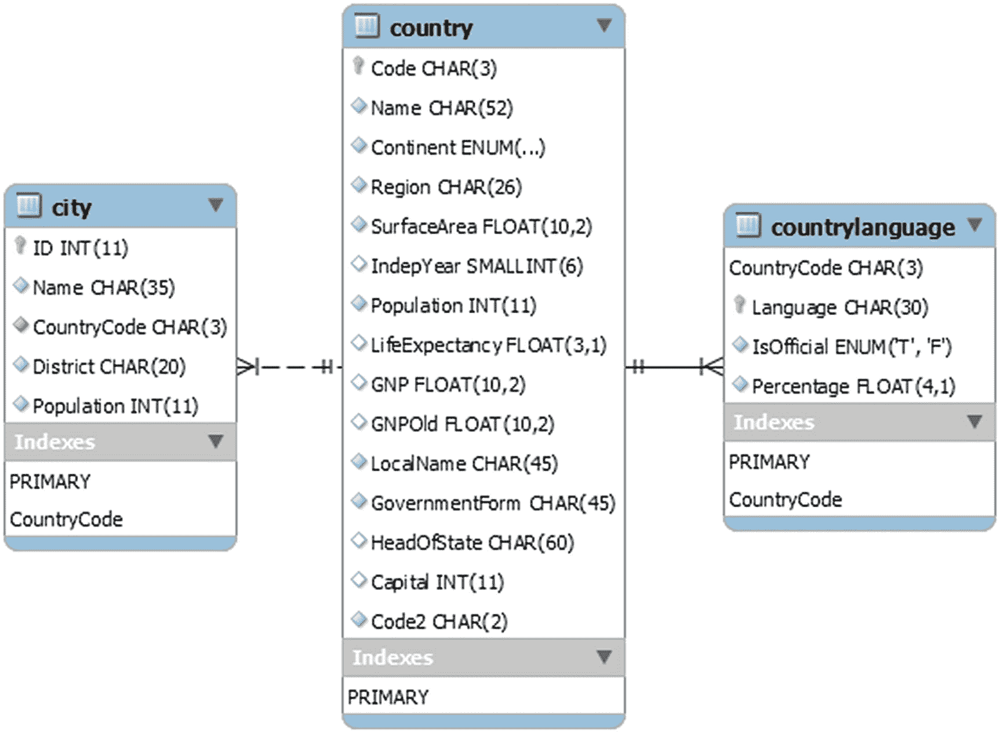
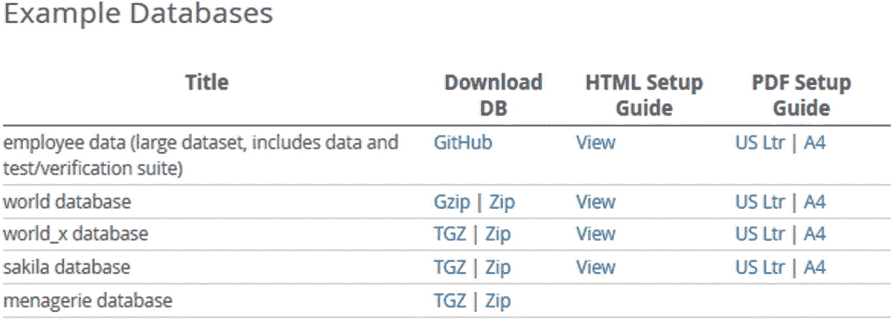
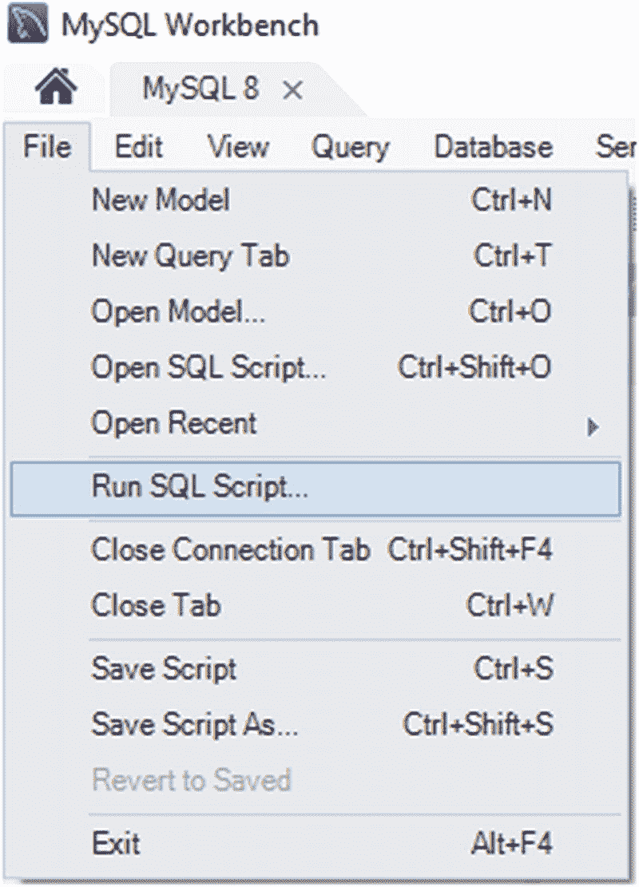
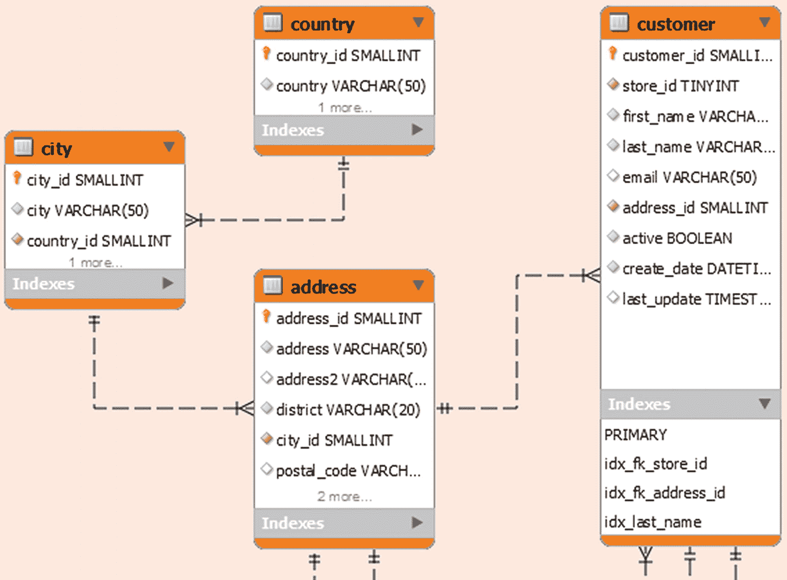
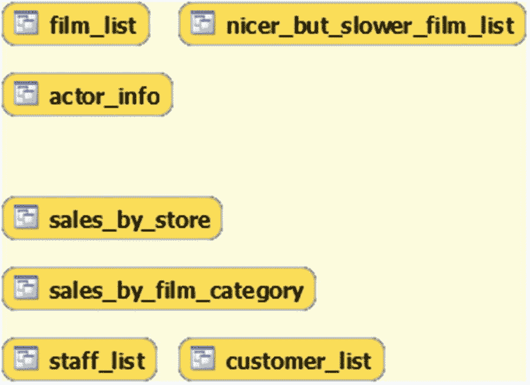
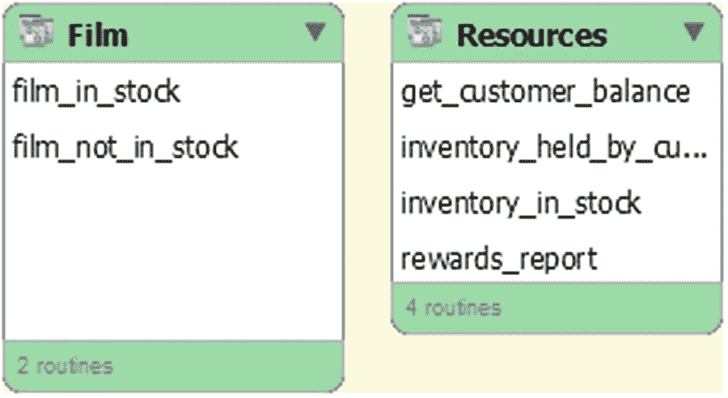

# 1.介绍

就数据库而言，并发和锁定是一些最复杂的主题。当条件“刚刚好”时，通常执行快速且没有问题的查询可能会突然花费更长时间或失败并出现错误，因此锁定或争用成为一个问题。你可能会问自己，为什么锁会引起这样的问题。这一章和接下来的 11 章将试图解释这一点，以及你如何最好地处理它们。本书的最后六章通过六个案例研究，将现实场景中的信息与分析以及如何避免或减少问题结合在一起。

在这一章中，你将首先学习为什么锁是重要的，尽管它们会引起一些问题。然后将解释与事务的关系。本章的其余部分介绍了本书中如何使用示例，以及本书中用于示例的`world`、`sakila`和`employees`数据库。

## 为什么需要锁？

这似乎是一个不需要锁定数据库的完美世界。然而，价格会很高，只有少数用例可以使用该数据库，而且对于 MySQL 这样的通用数据库来说，避免锁是不可能的。如果没有锁定，就不能有任何并发性。假设只允许一个到数据库的连接(你可以说它本身是一个锁，因此系统不是无锁的)——这对大多数应用程序来说不是很有用。

Note

通常，MySQL 中所谓的锁实际上是一个锁请求，它可以处于授权或挂起状态。

当您有几个连接同时执行查询时，您需要某种方法来确保这些连接不会互相妨碍。这就是锁进入画面的地方。你可以把锁想象成道路交通中的交通信号(图 [1-1](#Fig1) )，它控制资源的使用以避免事故。在道路交叉路口，要保证两车不交叉，不发生碰撞。


图 1-1

数据库中的锁类似于交通灯

在数据库中，有必要确保两个查询对数据的访问不冲突。由于控制进入十字路口有不同的级别——让行、停车标志和交通灯——数据库中有不同的锁类型。

## 锁定级别

MySQL 中的锁有几种风格，在 MySQL 的不同级别上起作用，从用户级锁到记录锁。最高层是用户级锁，可以保护应用程序中的整个代码路径和数据库中的任何对象。中间是操作数据库对象的锁。这些锁包括保护表元数据的元数据锁和保护表中所有数据的表锁。用户级锁和表级锁的共同点是它们是在数据库的 SQL 层实现的。高级锁在第 [6](06.html) 章中讨论。

最底层是由存储引擎实现的锁。本质上，这些锁取决于您使用的存储引擎。由于 InnoDB 是 MySQL 中使用最多的存储引擎(也是默认的)，本书涵盖了 InnoDB 特有的锁。InnoDB 包括记录上的锁，这是最容易理解的，以及更难的概念，如间隙锁、下一个键锁、谓词锁和插入意图锁。此外，还有互斥和信号量(这也发生在 SQL 层)。特定于 InnoDB 的锁和互斥/信号量将在第 [7](07.html) 章中介绍。

## 锁和事务

乍一看，将锁和事务的主题合并到一本关于并发性的书中似乎有些奇怪。然而，正如你将在本书中看到的几个例子一样，它们是紧密相关的。一些锁在事务期间被持有，因此理解事务如何工作以及如何监视它们是很重要的。

在使用锁时，事务隔离级别的概念也很重要。隔离级别会影响使用哪些锁以及持有这些锁的时间。

第 [3](03.html) 和 [4](04.html) 章讲述了如何监控事务，第 [11](11.html) 和 [12](12.html) 章讲述了事务如何工作、它们的影响以及事务隔离级别。

## 例子

整本书都有例子来帮助说明正在讨论的主题，或者设置一个你可以研究的情境。除了第 [17 章](17.html)和第 [18 章](18.html)之外，列出了重现试验所需的所有声明。一般来说，对于这些示例，您将需要不止一个连接，所以查询的提示已经被设置为在重要的时候指示哪个连接用于哪个查询。例如，`Connection 1>`意味着查询应该由您的第一个连接执行。

本书中的所有例子都是在 MySQL Shell 中执行过的。为简洁起见，示例中的提示是`mysql>`，除非连接很重要或者语言模式不是 SQL。然而，这些示例也可以在旧的`mysql`命令行客户端上运行。

Tip

如果您不熟悉 MySQL Shell，那么它是第二代 MySQL 命令行客户端，同时支持 SQL、Python 和 JavaScript。它还带有几个内置的实用程序，包括用于管理 MySQL InnoDB 集群和传统复制拓扑的工具。有关 MySQL Shell 的介绍，请参见位于 [`https://dev.mysql.com/doc/mysql-shell/en/`](https://dev.mysql.com/doc/mysql-shell/en/) 的用户指南或查尔斯·贝尔( [`www.apress.com/gp/book/9781484250822`](http://www.apress.com/gp/book/9781484250822) )的《T4 介绍 MySQL Shell (Apress》)一书。

此外，这本书还附带了一个 Python 模块—`concurrency_book.generate`,可以导入到 MySQL Shell 中，用于重现除了最简单的例子之外的所有例子。本节的其余部分描述了如何使用 MySQL Shell 模块。这里的内容是附录 B 的摘录，其中包含该模块的更长的参考，包括如何实现您自己的示例。

Note

本质上，示例中的一些数据对于每次执行都是不同的。对于 id 和存储器地址等尤其如此。因此，当您试图重现这些示例时，不要期望在所有细节上都得到相同的结果。

### concurrency_book.generate 模块的先决条件

使用本书提供的 MySQL Shell 模块的最重要要求是，您使用的是 MySQL Shell 8.0.20 或更高版本。这是一个严格的要求，因为模块主要使用`shell.open_session()`方法来创建测试用例所需的连接。此方法仅在 8.0.20 版中引入。`shell.open_session()`相对于`mysql.get_classic_session()`和`mysqlx.get_session()`的优势在于`open_session()`透明地与经典的 MySQL 协议和新的 X 协议一起工作。

如果出于某种原因，您被老版本的 MySQL Shell 所困，您可以更新测试用例，以包括`protocol`设置(参见附录 B 中的*定义工作负载*)来明确指定使用哪个协议。

还要求从 MySQL Shell 到 MySQL Server 的连接已经存在，因为模块在创建示例所需的附加连接时会使用该连接的 URI。

这些例子已经在 MySQL Server 8.0.21 上进行了测试；然而，大多数例子都适用于旧版本，有些甚至适用于 MySQL 5.7。也就是说，建议使用 MySQL Server 8.0.21 或更高版本。

### 安装 concurrency_book.generate 模块

要使用该模块，你需要从本书的 GitHub 库下载`concurrency_book`目录下的文件(链接可以在本书的首页 [`www.apress.com/gp/book/9781484266519`](http://www.apress.com/gp/book/9781484266519) 找到)。最简单的方法是克隆存储库或使用图 [1-2](#Fig2) 所示的菜单下载包含所有文件的 ZIP 文件。


图 1-2

用于克隆或下载资源库的 GitHub 菜单

点击剪贴板图标，使用您系统的 Git 软件复制用于克隆存储库的 URL，或者使用*下载 ZIP* 链接下载存储库的 ZIP 文件。只要保持`concurrency_book`目录下的结构，您可以自由选择任何路径作为文件的位置。对于这个讨论，假设您已经克隆了存储库或者将文件解压缩到了`C:\Book\mysql-concurrency`，所以`generate.py`文件在目录`C:\Book\mysql-concurrency\concurrency_book\`中。

为了能够在 MySQL Shell 中导入模块，打开或创建`mysqlshrc.py`文件。MySQL Shell 在四个地方搜索该文件。在 Microsoft Windows 上，路径按搜索顺序排列:

1.  `%PROGRAMDATA%\MySQL\mysqlsh\`

2.  `%MYSQLSH_HOME%\shared\mysqlsh\`

3.  `<mysqlsh binary path>\`

4.  `%APPDATA%\MySQL\mysqlsh\`

在 Linux 和 Unix 上

1.  `/etc/mysql/mysqlsh/`

2.  `$MYSQLSH_HOME/shared/mysqlsh/`

3.  `<mysqlsh binary path>/`

4.  `$HOME/.mysqlsh/`

始终搜索所有四个路径，如果在多个位置找到文件，将执行每个文件。这意味着，如果文件影响相同的变量，则最后找到的文件优先。如果你做出对你个人有意义的改变，最好的地方是在第四个位置。步骤 4 中的路径可以用环境变量`MYSQLSH_USER_CONFIG_HOME`覆盖。

您需要确保`mysqlshrc.py`文件将包含该模块的目录添加到 Python 搜索路径中，并且可以选择添加一个`import`语句，以便在启动 MySQL Shell 时该模块可用。`mysqlshrc.py`文件的一个例子是

```
import sys
sys.path.append('C:\\Book\\mysql-concurrency')
import concurrency_book.generate

```

双反斜杠用于窗口；在 Linux 和 Unix 上，不需要对分隔路径元素的斜杠进行转义。如果您没有在`mysqlshrc.py`文件中包含`import`，您将需要在 MySQL Shell 中执行它，然后才能使用该模块。

### 获取信息

该模块包括两个返回如何使用该模块的信息的方法。一个是`help()`方法，提供如何使用模块的信息:

```
mysql-py> concurrency_book.generate.help()

```

还有一个`show()`方法，它列出了`run()`方法可以执行的工作负载和`load()`方法可以加载的模式:

```
mysql-py> concurrency_book.generate.show()

```

工作负载以书中的代码清单命名，例如，名为“清单 [6-1](06.html#PC1) 的工作负载实现了清单 [6-1](06.html#PC1) 中的示例。

在开始执行工作负载之前，您需要加载一些测试数据，这个模块也可以为您完成。

### 加载测试数据

`concurrency_book.generate`模块支持将`employees`、`sakila`和`world`示例数据库加载到 MySQL 实例中。对于`employees`数据库，您可以选择带有分区的版本。对于这本书来说，`world`数据库是最重要的，其次是`sakila`数据库。`employees`数据库仅用于第 [18](18.html) 章中的案例研究。这三种模式的每一种都将在本章的后面进行更详细的描述。

Note

如果该模式存在，它将作为加载作业的一部分被删除。这实际上意味着`load()`重置了模式。

您可以用`load()`方法加载一个模式，该方法可以选择您想要加载的模式的名称。如果不提供模式名，系统会提示您。清单 [1-1](#PC4) 展示了一个加载`world`模式的例子。

```
mysql-py> concurrency_book.generate.load()
Available Schema load jobs:
===========================

 # Name                   Description
---------------------------------------------------------------------------
 1 employees              The employee database
 2 employees partitioned  The employee database with partitions
 3 sakila                 The sakila database
 4 world                  The world database

Choose Schema load job (# or name - empty to exit): 4
2020-07-20 21:27:15.221340  0 [INFO] Downloading https://downloads.mysql.com/docs/world.sql.zip to C:\Users\myuser\AppData\Roaming\mysql_concurrency_book\sample_data\world.sql.zip
2020-07-20 21:27:18.159554  0 [INFO] Processing statements in world.sql
2020-07-20 21:27:27.045219  0 [INFO] Load of the world schema completed

Available Schema load jobs:
===========================

 # Name                   Description
---------------------------------------------------------------------------
 1 employees              The employee database
 2 employees partitioned  The employee database with partitions
 3 sakila                 The sakila database
 4 world                  The world database

Choose Schema load job (# or name - empty to exit):

Listing 1-1Loading the world schema

```

`load()`方法下载带有模式定义的文件，如果它还没有模式定义的话。下载的文件在微软 Windows 上存储在`%APPDATA\mysql_concurrency_book\sample_data\`中，在其他平台上存储在`${HOME}/.mysql_concurrency_book/sample_data/`中。如果您想要重新下载该文件，请将其从该目录中删除。

Tip

由于 MySQL Shell 的 Python 中只有相对低级的网络例程，如果您的连接速度慢或不稳定，下载 employees 数据库可能会失败。除了手动安装模式之外，还有一种选择是下载 [`https://github.com/datacharmer/test_db/archive/master.zip`](https://github.com/datacharmer/test_db/archive/master.zip) 并将其保存在`sample_data`目录中。在那之后，`load()`方法将获取它，并且不再尝试下载它。

如果您只想加载一个模式，您可以将名称指定为`load()`的参数。例如，当调用 MySQL Shell 时，在命令行上直接给出命令来启动模式加载时，这可能特别有用

```
shell> mysqlsh --user=myuser --py -e "concurrency_book.generate.load('world')"

```

当您加载完您需要的模式后，您可以用一个空答案来回答退出。您现在已经准备好执行工作负载了。

Note

如果加载过程崩溃，抱怨文件，例如，它不是一个 ZIP 文件，那么它表明文件损坏或不完整。在这种情况下，请删除该文件，以便重新下载，或者尝试使用浏览器手动下载该文件。

### 执行工作负荷

您用`run()`方法执行一个工作负载。如果指定已知工作负荷的名称，那么该工作负荷将立即执行。否则，将列出可用的工作负荷，并提示您输入工作负荷。在这种情况下，您可以通过数量(例如，列表 [6-1](06.html#PC1) 中的 15)或名称来指定工作量。使用名称时，只要至少有一个空格，`Listing`和列表编号之间的空格数并不重要。当您使用提示选择工作负荷时，您可以在前一个工作负荷完成后选择另一个工作负荷。

工作负载完成后，对于几个工作负载，您将获得一个您可以进行的调查的建议列表。例如，这可以是查询示例中使用的连接持有的锁。这些调查旨在激发灵感，鼓励您使用自己的查询来探索工作负载。在例子的讨论中也使用了一些调查。清单 [1-2](#PC6) 展示了一个使用提示符执行工作负载的例子。

```
mysql-py> concurrency_book.generate.run()
Available workloads:
====================

 # Name                   Description
---------------------------------------------------------------------------
 1 Listing  2-1           Example use of the metadata_locks table
 2 Listing  2-2           Example of using the table_handles table
 3 Listing  2-3           Using the data_locks table
...
14 Listing  5-2           Example of obtaining exclusive locks
15 Listing  6-1           A deadlock for user-level locks
...

Choose workload (# or name - empty to exit): 15
Password for connections: ********
2020-07-20 20:50:41.666488  0 [INFO] Starting the workload Listing 6-1

****************************************************
*                                                  *
*   Listing 6-1\. A deadlock for user-level locks   *
*                                                  *
****************************************************

-- Connection   Processlist ID   Thread ID   Event ID
-- --------------------------------------------------
--          1              105         249          6
--          2              106         250          6

-- Connection 1
Connection 1> SELECT GET_LOCK('my_lock_1', -1);
+---------------------------+
| GET_LOCK('my_lock_1', -1) |
+---------------------------+
|                         1 |
+---------------------------+
1 row in set (0.0003 sec)

-- Connection 2
Connection 2> SELECT GET_LOCK('my_lock_2', -1);
+---------------------------+
| GET_LOCK('my_lock_2', -1) |
+---------------------------+
|                         1 |
+---------------------------+
1 row in set (0.0003 sec)

Connection 2> SELECT GET_LOCK('my_lock_1', -1);

-- Connection 1
Connection 1> SELECT GET_LOCK('my_lock_2', -1);
ERROR: 3058: Deadlock found when trying to get user-level lock; try rolling back transaction/releasing locks and restarting lock acquisition.

Available investigations:
=========================

 # Query
--------------------------------------------------
 1 SELECT *
     FROM performance_schema.metadata_locks
    WHERE object_type = 'USER LEVEL LOCK'
          AND owner_thread_id IN (249, 250)

 2 SELECT thread_id, event_id, sql_text,
          mysql_errno, returned_sqlstate, message_text,
          errors, warnings
     FROM performance_schema.events_statements_history
    WHERE thread_id = 249 AND event_id > 6
    ORDER BY event_id
...

Choose investigation (# - empty to exit): 2
-- Investigation #2
-- Connection 3
Connection 3> SELECT thread_id, event_id, sql_text,
                     mysql_errno, returned_sqlstate, message_text,
                     errors, warnings
                FROM performance_schema.events_statements_history
               WHERE thread_id = 249 AND event_id > 6
               ORDER BY event_id\G
*************************** 1\. row ***************************
        thread_id: 249
         event_id: 7
         sql_text: SELECT GET_LOCK('my_lock_1', -1)
      mysql_errno: 0
returned_sqlstate: NULL
     message_text: NULL
           errors: 0
         warnings: 0
*************************** 2\. row ***************************
        thread_id: 249
         event_id: 8
         sql_text: SELECT GET_LOCK('my_lock_2', -1)
      mysql_errno: 3058
returned_sqlstate: HY000
     message_text: Deadlock found when trying to get user-level lock; try rolling back transaction/releasing locks and restarting lock acquisition.
           errors: 1
         warnings: 0
*************************** 3\. row ***************************
        thread_id: 249
         event_id: 9
         sql_text: SHOW WARNINGS
      mysql_errno: 0
returned_sqlstate: NULL
     message_text: NULL
           errors: 0
         warnings: 0
3 rows in set (0.0009 sec)

Available investigations:
=========================

 # Query
--------------------------------------------------
...

Choose investigation (# - empty to exit):

2020-07-20 20:50:46.749971  0 [INFO] Completing the workload Listing 6-1
-- Connection 1
Connection 1> SELECT RELEASE_ALL_LOCKS();
+---------------------+
| RELEASE_ALL_LOCKS() |
+---------------------+
|                   1 |
+---------------------+
1 row in set (0.0004 sec)

-- Connection 2
Connection 2> SELECT RELEASE_ALL_LOCKS();
+---------------------+
| RELEASE_ALL_LOCKS() |
+---------------------+
|                   2 |
+---------------------+
1 row in set (0.0002 sec)

2020-07-20 20:50:46.749971  0 [INFO] Disconnecting for the workload Listing 6-1
2020-07-20 20:50:46.749971  0 [INFO] Completed the workload Listing 6-1

Available workloads:
====================

 # Name                   Description
---------------------------------------------------------------------------
 1 Listing  2-1           Example use of the metadata_locks table
 2 Listing  2-2           Example of using the table_handles table
 3 Listing  2-3           Using the data_locks table
...

Choose workload (# or name - empty to exit):

mysql-py>

Listing 1-2Executing a workload using the prompt

```

从这个例子中可以注意到一些事情。选择工作负载后，会要求您输入密码。这是您正在使用的 MySQL 帐户的密码。其他连接选项取自 MySQL Shell 中的`session.uri`属性，但是出于安全原因，不会存储密码。如果您在一次调用`run()`中执行多个工作负载，您将只被提示输入一次密码。

在开始执行工作负载时，对于工作负载使用的每个连接，在工作负载开始之前，有一个进程列表 id(从`SHOW PROCESSLIST`开始)、(性能模式)线程 id 和最后事件 id 的概述:

```
-- Connection   Processlist ID   Thread ID   Event ID
-- --------------------------------------------------
--          1              105         249          6
--          2              106         250          6

```

您可以使用这些 id 来执行您自己的调查查询，并且您可以使用 overview 来识别已经在`concurrency_book.generate.run()`中作为工作负载实现的清单。

在工作负载执行结束时，该示例有三个查询，您可以执行这些查询来调查该示例演示的问题。您可以通过指定查询编号(一次一个查询)来执行一个或多个查询。在本书的代码清单中，调查的输出前面有一个注释，显示已经执行了哪个调查，例如

```
-- Investigation #2

```

每个工作量的调查数量从零到十多个不等。书中的列表并不总是包括所有调查的结果，因为有些是作为灵感和对问题的进一步研究而留下的。

完成调查后，提交一个空答案以退出工作量。如果您不想执行更多的工作负载，请再次提交一个空答案以退出`run()`方法。

如果您只想执行一个工作负载，那么您可以将名称指定为`run()`的参数。例如，当调用 MySQL Shell 时，在命令行上直接给出命令来执行工作负载时，这可能特别有用

```
shell> mysqlsh --user=myuser --py -e "concurrency_book.generate.run('Listing 6-1')"

```

本章的剩余部分描述了本书中示例使用的三种模式。

## 测试数据:世界模式

`world`样本数据库是简单测试中最常用的数据库之一。它由三个有几百到几千行的表组成。这使它成为一个小数据集，这意味着它甚至可以很容易地用于小的测试实例。

### 计划

数据库由`city`、`country`和`countrylanguage`表组成。表格之间的关系如图 [1-3](#Fig3) 所示。



图 1-3

`world`数据库

`country`表包含关于 239 个国家的信息，并作为来自`city`和`countrylanguage`表的外键的父表。数据库中总共有 4079 个城市和 984 种国家和语言的组合。

### 装置

您可以从 [`https://dev.mysql.com/doc/index-other.html`](https://dev.mysql.com/doc/index-other.html) 下载包含表格定义和数据的文件。在图 [1-4](#Fig4) 所示的*示例数据库*部分，Oracle 提供了从该页面访问多个示例数据库的权限。



图 1-4

包含示例数据库链接的表

下载的文件由一个名为`world.sql.gz`或`world.sql.zip`的文件组成，这取决于您选择的是 Gzip 还是 zip 链接。在这两种情况下，下载的档案包含一个文件`world.sql`。数据的安装非常简单，只需执行脚本即可。

您可以从 MySQL Shell 或`mysql`命令行客户端获得`world.sql`。在 MySQL Shell 中，使用`\source`命令加载数据:

```
MySQL [localhost ssl] SQL> \source world.sql

```

如果您使用传统的`mysql`命令行客户端，请使用`SOURCE`命令:

```
mysql> SOURCE world.sql

```

在这两种情况下，如果`world.sql`文件不在您启动 MySQL Shell 或`mysql`的目录中，请添加该文件的路径。

如果您喜欢使用 GUI，那么您也可以使用 MySQL Workbench 加载`world`数据库。当连接到您想要加载`world`模式的 MySQL 实例时，您点击菜单中的*文件*，然后点击*运行 SQL 脚本*，如图 [1-5](#Fig5) 所示。



图 1-5

从 MySQL Workbench 运行 SQL 脚本

这将打开一个文件浏览器，您可以在其中浏览文件。导航到保存未压缩的`world.sql`文件的目录并选择它。结果是如图 [1-6](#Fig6) 所示的对话框，您可以在其中查看脚本的第一部分，并可选地设置默认的模式名和字符集。


图 1-6

MySQL Workbench 中用于检查脚本的对话框

在使用`world`模式的情况下，模式名称和字符集都包含在脚本中，所以不需要(也没有效果)设置这些设置。点击*运行*来执行脚本。MySQL 执行脚本时，会有一个对话框显示进度信息。操作完成后，关闭对话框。可选地，您可以通过点击如图 [1-7](#Fig7) 所示的两个互相追逐的箭头来刷新侧边栏中的模式列表。


图 1-7

通过单击两个箭头刷新模式列表

虽然`world`模式因为其简单性和小尺寸而非常适合于许多测试，但这也限制了它的有用性，并且有时需要稍微复杂一点的数据库。

## 测试数据:sakila 模式

`sakila`数据库是一个真实的数据库，它包含一个电影租赁业务的模式，其中包含关于电影、库存、商店、员工和客户的信息。它添加了一个全文索引、一个空间索引、视图和存储程序，以提供一个使用 MySQL 特性的更完整的示例。数据库大小仍然非常适中，这使它适合于小型实例。

### 计划

`sakila`数据库由 16 个表、7 个视图、3 个存储过程、3 个存储函数和 6 个触发器组成。这些表可以分为三组，客户数据、业务和库存。为了简洁起见，图中没有包括所有的列，大多数索引也没有显示。图 [1-8](#Fig8) 显示了表格、视图和存储程序的完整概览。


图 1-8

`sakila`数据库概述

包含客户相关数据的表格(加上员工和商店的地址)位于左上角的区域。左下角的区域包含与业务相关的数据，右上角的区域包含关于电影和库存的信息。右下角用于视图和存储的程序。

Tip

您可以通过在 MySQL Workbench 中打开安装中包含的`sakila.mwb`文件来查看整个图表(尽管格式不同)。这也是一个很好的例子，说明如何在 MySQL Workbench 中使用增强的实体关系(EER)图来记录您的模式。

由于对象的数量相对较多，所以在讨论模式时，将它们分成五组(每个表组、视图和存储例程)。第一组是客户相关数据，表格如图 [1-9](#Fig9) 所示。



图 1-9

`sakila`数据库中包含客户数据的表格

有四个表包含与客户相关的数据。customer 表是主表，地址信息存储在 address、city 和 country 表中。

客户和业务组之间存在外键，在业务组中，外键从客户表指向商店表。还有四个从业务组的表到地址和客户表的外键。业务组如图 [1-10](#Fig10) 所示。


图 1-10

`sakila`数据库中包含业务数据的表

业务表包含关于商店、员工、租金和付款的信息。商店和职员表有两个方向的外键，职员属于一个商店，而商店的经理是职员的一部分。租金和付款由员工处理，因此与商店间接相关，付款是为了租金。

表的业务组是与其它组关系最密切的组。staff 和 store 表有地址表的外键，而租赁和付款表引用客户。最后，租赁表有一个指向库存组中的库存表的外键。库存组的示意图如图 [1-11](#Fig11) 所示。


图 1-11

`sakila`数据库中包含库存数据的表格

inventory 组中的主表是 film 表，它包含关于商店提供的电影的元数据。此外，还有一个带有标题和描述的`film_text`表，带有全文索引。

电影与类别和演员表之间存在多对多的关系。最后，在业务组中有一个从库存表到商店表的外键。

这涵盖了`sakila`数据库中的所有表格，但也有一些如图 [1-12](#Fig12) 所示的视图。



图 1-12

`sakila`数据库中的视图

这些视图可以像报告一样使用，并且可以分为两类。`film_list`、`nicer_but_slower_film_list`和`actor_info`视图与存储在数据库中的电影相关。第二类包含与`sales_by_store`、`sales_by_film_category`、`staff_list`和`customer_list`视图中的商店相关的信息。

为了完善数据库，还有如图 [1-13](#Fig13) 所示的存储函数和过程。



图 1-13

存储在`sakila`数据库中的程序

`film_in_stock()`和`film_not_in_stock()`过程返回一个结果集，该结果集由给定电影和商店的库存 id 组成，基于电影是否有库存。找到的库存条目总数作为 out 参数返回。`rewards_report()`程序根据上个月的最低花费生成一份报告。

`get_customer_balance()`函数返回给定客户在给定日期的余额。剩下的两个函数检查一个库存 id 的状态，其中`inventory_held_by_customer()`返回当前租赁该商品的客户的客户 id(如果没有客户租赁该商品，则返回`NULL`)，如果您想检查给定的库存 id 是否有库存，可以使用`inventory_in_stock()`函数。

### 装置

您可以从 [`https://dev.mysql.com/doc/index-other.html`](https://dev.mysql.com/doc/index-other.html) 下载一个带有安装脚本的文件来安装`sakila`模式，就像安装`world`数据库一样。

下载的文件展开到一个包含三个文件的目录中，其中两个文件创建模式和数据，最后一个文件包含 MySQL Workbench 使用的格式的 ETL 图。

Note

`sakila`数据库也可以通过下载`employees`数据库获得；然而，本节和本书后面的例子使用了从 MySQL 主页下载的`sakila`数据库的副本。

这些文件是

*   `sakila-data.sql` **:** 填充表格所需的`INSERT`语句以及触发器定义。

*   `sakila-schema.sql` **:** 模式定义语句。

*   `sakila.mwb`**:**MySQL 工作台 ETL 图。这类似于图 [1-7](#Fig7) 所示，细节如图 [1-8](#Fig8) 至 [1-12](#Fig12) 所示。

通过首先获取`sakila-schema.sql`文件，然后获取`sakila-data.sql`文件来安装`sakila`数据库。例如，下面是使用 MySQL Shell:

```
MySQL [localhost+ ssl] SQL> \source sakila-schema.sql
MySQL [localhost+ ssl] SQL> \source sakila-data.sql

```

如果文件不在当前目录中，请添加文件的路径。

## 测试数据:雇员模式

`employees`数据库(在 MySQL 文档下载页面上称为雇员数据；GitHub 知识库的名字是`test_db`)最初是由王辅生和卡洛·扎尼奥洛创建的，是 MySQL 主页链接的最大的测试数据集。它提供了使用非分区表或对两个最大的表进行分区的选择。对于非分区版本，数据文件的总大小约为 180 MiB，而对于分区版本，约为 440 MiB。

### 计划

`employees`数据库由六个表和两个视图组成。您可以选择再安装两个视图、五个存储函数和两个存储过程。表格如图 [1-14](#Fig14) 所示。


图 1-14

`employees`数据库中的表格、视图和例程

按照今天的标准，它仍然是数据库中相对少量的数据，但是它足够大，您可以开始看到较低级别的争用，因此，它是第 [18](18.html) 章中用于导致信号量等待的模式。

### 装置

您可以下载一个包含安装所需文件的 ZIP 文件，也可以在 [`https://github.com/datacharmer/test_db`](https://github.com/datacharmer/test_db) 克隆 GitHub 库。在撰写本文时，只有一个名为 master 的分支。如果您已经下载了 ZIP 文件，它将解压到一个名为`test_db-master`的目录中。

有几个文件。在 MySQL 8 中与安装`employees`数据库相关的两个是`employees.sql`和`employees_partitioned.sql`。区别在于`salaries`和`titles`表是否被分区。这本书使用了非分区模式。(还有针对 MySQL 5.1 的`employees_partitioned_5.1.sql`，其中不支持`employees_partitioned.sql`中使用的分区方案。)

通过使用`SOURCE`命令获取`.dump`文件来加载数据，该命令仅在 MySQL Shell 8 . 0 . 19(由于一个错误，实际上是 8.0.20)和更高版本中受支持。转到源文件所在的目录，选择`employees.sql`或`employees_partitioned.sql`文件，这取决于您是否想要使用分区，例如

```
mysql> \source employees.sql

```

导入需要一点时间，并通过显示花费的时间来完成:

```
+---------------------+
| data_load_time_diff |
+---------------------+
| 00:02:50            |
+---------------------+
1 row in set (0.0085 sec)

```

或者，您可以通过获取`objects.sql`文件来加载一些额外的视图和存储的例程:

```
mysql> \source objects.sql

```

当您使用`concurrency_book.generate.load()`方法加载`employees`模式时，`objects.sql`文件总是包含在内。

现在，您已经准备好进入 MySQL 并发世界了。

## 摘要

本章开始了理解 MySQL 并发性的旅程，其中锁和事务是重要的主题。首先讨论了为什么需要锁以及它们存在于什么级别。然后讨论了事务必须包含在讨论中，因为一些锁在事务期间被持有，事务隔离级别影响锁的持续时间以及锁的数量。

本章的其余部分讨论了如何在本书中使用这些例子，并介绍了重现测试用例所需的三组测试数据。为了更容易加载数据和执行测试用例，还引入了 MySQL Shell 的`concurrency_book.generate`模块。

在下一章，我们将讨论如何监控锁。