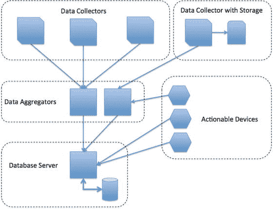
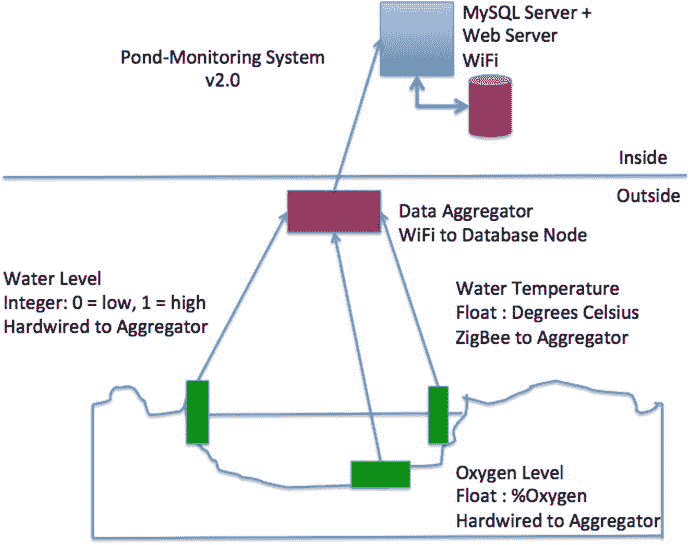

# 3.IOT 数据是如何存储的

Electronic supplementary material The online version of this chapter (doi:[10.​1007/​978-1-4842-1293-6_​3](http://dx.doi.org/10.1007/978-1-4842-1293-6_3)) contains supplementary material, which is available to authorized users.

询问任何有成就的专业软件工程师、开发人员、架构师或项目负责人，他们都会告诉您，一个性能良好的解决方案的关键是从一个设计和测试良好的计划开始，该计划用于设计和实现项目的数据存储元素。虽然有许多其他方面对质量和成功同样重要，但数据存储元素无疑是成功的主要竞争者之一。

IOT 解决方案也是如此。这超出了最初的数据存储位置问题。为了取得成功，开发解决方案的计划还必须考虑存储什么，更重要的是，如何存储。

我见过许多业余爱好者用各种方式存储数据的解决方案。一些(如果不是大多数)解决方案运行良好，并且几乎没有与数据相关的问题，也就是说，直到出现问题，例如需要修改数据、恢复数据或添加功能来存储其他数据。在这些情况下，很快就会发现数据存储组件无法胜任任务。

有时结果是需要改变数据的存储方式，使其与软件的早期版本不兼容。其他时候，它需要重新设计，比应该需要的甚至预期的要多得多，导致项目延期完成。这些弊病的根本原因通常是数据存储组件设计不良或设计不足。

例如，如果一个解决方案将数据作为文本存储在一个文件中(比如日志),会有什么影响。当然，数据就在那里，您可以很容易地编写一个程序来读取它，但是该解决方案不能扩展到数据变得非常大(数千甚至数百万行)的情况。此外，将数据存储在文件中意味着每一段数据都必须转换为字符串，这需要在执行任何数学运算之前转换回其原始类型。也许更糟的是，没有简单的方法来对数据执行任何类型的特别查询。也就是说，要执行查询，您必须增加用于读取数据的程序代码，编写专门的代码来检查数据。

在这种情况下，需要更多地考虑如何使用数据以及如何存储数据。在本章中，您将更详细地研究这些主题。

Note

这些例子非常简单，目的是为了让 [2](#Fn2) 更容易理解。Arduino IDE 和程序的简要概述在前一章中已经介绍过。

让我们首先回顾一下 IOT 解决方案，特别是分布式 IOT 解决方案，是如何由网络架构中的几种类型的节点形成的。

## 分布式 IOT

IOT 解决方案有多种设计和组装方式。一些解决方案使用单个组件设计，将所有硬件装在一个盒子里。虽然这种设计理念似乎在早期的 IOT 解决方案中很常见，但还有另一种设计理念可以提供比单一硬件解决方案更多的通用性、可扩展性和功能。

这种理念(在某种程度上)是从传感器网络借鉴来的，在传感器网络中，解决方案由多个分布式组件组成。在分布式解决方案中，组件使用一个或多个网络协议相互通信。在前一章中，我们讨论了如何收集数据并在网络中的节点间传递，您已经看到了这一点。

在本节中，我们将讨论分布式 IOT 解决方案。这些解决方案由一个或多个数据收集器和一个或多个传感器组成，使用通信方法或协议来传输数据。如上所述，通信方法可以使用微控制器(例如 Arduino)、嵌入式系统等设备，甚至是 Raspberry Pi 等小尺寸计算机。

通常，数据收集器(在传感器网络中称为传感器节点)是为无人值守操作而设计的；它们有时安装在移动物体上或有线通信不切实际的地方。在这些情况下，数据采集器可以被设计成在不受电源(使用电池或太阳能)或通信源(使用无线机制)限制的情况下工作。数据收集器的接收器可以是处理数据和存储数据的节点(数据聚合器节点)或单个数据库服务器。

虽然您已经在第 1 章中看到了每种类型节点的概述，但本节将详细介绍如何使用每个节点组成网络来收集、传输、增加和存储数据。正如您将看到的，我划分了一些类别来进一步定义节点的类型。

图 [3-1](#Fig1) 显示了每种类型的节点将如何在一个虚构的 IOT 解决方案中使用。我们将在下面的小节中更详细地讨论每一个。

图 3-1。

IOT distributed network nodes

在本例中，顶部的几个数据收集器节点将数据无线发送到中间的数据聚合器节点(有时称为数据节点)。数据节点收集数据并将其保存到安全数字卡中，然后通过有线计算机网络与数据库服务器通信以存储数据。将数据存储在中间数据聚合器节点上可以确保在数据库服务器出现故障或网络中断时不会丢失任何数据。

### 数据收集器

网络的最低层(或叶层)是数据收集器。它具有至少一个传感器和通信机制，通常是无线协议。这些节点不以任何方式存储或处理捕获的数据，它们只是将数据传递给网络中的另一个节点。

### 带存储器的数据收集器

下一类节点是存储数据的数据收集器节点。虽然这些节点可以将数据发送到另一个节点，但通常它们是将数据保存到数据卡等存储机制的设备，通过与台式机或服务器计算机的链接保存到数据库，或者直接保存到 LCD 屏幕、面板仪表或 LED 指示灯等视觉输出设备。

数据节点需要的设备不仅仅是将数据传递给另一个节点。他们需要能够记录或展示数据。这是微控制器的一个很好的用途，你会在后面的章节中看到。数据节点可用于形成自主或无人值守的传感器网络，记录数据供以后存档。

例如，考虑一个鱼或花园池塘。有许多商业池塘监控系统采用具有多个传感器的独立传感器设备，这些传感器向数据节点发送数据；用户可以访问数据节点并在计算机上读取用于分析的数据。

### 可操作装置

可动作设备是类似于数据收集器的另一个节点，并且实际上可以具有数据收集特征。然而，与仅观察和发送数据的数据收集器不同，可操作设备可以直接控制或被给予命令来执行。例如，具有平移和倾斜功能的摄像机可以产生大范围的视频流或静态照片，并接收平移和倾斜功能的命令。

通常，可动作设备需要网络中的另一个节点来接收和发送命令。这可能是一个面向前方(如在互联网中)的计算机或微控制器或远程安装的控制面板，如平板电脑。

### 数据聚合器

另一种类型的节点是聚合节点。这些节点通常使用通信设备和记录设备(或网关)而没有传感器。它们用于从一个或多个数据收集器或其他数据聚合器节点收集数据。在到目前为止讨论的例子中，监控系统将具有一个或多个聚集器节点来从传感器读取数据。

可以使用数据聚合器来扩充数据，方法是添加对数据进行分类的逻辑、添加日期和时间信息，甚至在保存数据之前对数据执行转换。

数据聚合器还可以用于在数据发送到数据库服务器之前存储数据的临时副本。如果网络在一个或多个节点甚至所采用的通信协议中遇到故障，这允许一些小的可恢复性或连续的数据收集。

### 数据库服务器

数据库服务器节点顾名思义就是一台托管数据库服务器的计算机，该服务器可用于保存和检索网络中其余节点的数据。虽然有些解决方案使用专用的数据库服务器(我设计的网络使用这种服务器)，但有些支持可访问互联网的功能(如网站或控制面板)的解决方案会将数据库服务器与应用放在同一台机器上(例如 web 服务器)。

但是，这通常被认为是一个潜在的漏洞。也就是说，如果 web 服务器受损，数据库服务器受损的可能性相当大。如果可能，最好将数据库服务器放在单独的节点上。如果解决方案与其他网络或互联网隔离，这种脆弱性就会减少。

现在您已经知道了分布式 IOT 解决方案由哪些节点组成，让我们看看如何在整个网络中存储数据。我最后重点介绍数据库服务器选项，但首先介绍几个备选方案，因为根据解决方案的需要，可能需要一些本地存储。例如，在本地存储对数据采取的操作的副本可能有助于诊断问题。

Note

由于收集的大多数数据是传感器数据，以下存储选项使用传感器数据来说明概念。

## 本地设备上存储

根据数据代表的内容，在本地设备(如 SD 卡、硬盘、电子存储器等)上存储数据可能会很复杂。例如，传感器数据可以有几种形式。传感器可以产生由浮点数或整数组成的数字数据。一些传感器产生更复杂的信息，这些信息被组合在一起，可能包含多种形式的数据。知道如何解释读取的值通常是使用传感器最困难的部分。事实上，您可以在许多传感器节点示例中看到这一点。例如，温度传感器产生的值必须转换成刻度才有意义。

虽然可以将所有数据存储为文本，但如果您希望在另一个应用中使用数据，或者在电子表格或统计应用中使用数据，您可能需要考虑以二进制形式或易于转换的文本形式存储数据。例如，大多数电子表格应用可以很容易地将文本字符串如`123.45`转换成浮点数，但是它们可能无法将`12E236`转换成浮点数。另一方面，如果您计划为 Arduino 草图或 Raspberry Pi Python 脚本编写额外的代码来处理数据，您可能希望以二进制形式存储数据，以避免必须编写成本高昂(并且可能很慢)的转换例程。

但这只是问题的一部分。你在哪里存储数据是一个更大的问题。您希望以您需要的形式存储数据，但也希望将数据存储在一个位置(在设备上)，您可以从该位置检索数据，并且在主机重新启动时不会被擦除。例如，将数据存储在 Arduino 的主内存中并不是一个好主意。它不仅消耗宝贵的程序空间，而且是易失性的，当 Arduino 断电时会被擦除。

以下部分研究了本地存储数据的几种选择。我从 Raspberry Pi 和 Arduino 的例子开始。然而，相似的平台提供相同的(如果不是相似的话)选项。

### 树莓码头上的本地存储

Raspberry Pi 为本地存储提供了许多选项。您可以轻松地创建一个文件，并将数据存储在根分区或 SD 卡上的主目录中。这是非易失性的，不会影响 Raspberry Pi 操作系统的运行。唯一的缺点是，如果数据显著增长，它可能会导致磁盘空间过少。但是数据必须增长到接近 2GB(对于 2GB 的 SD 卡)才会威胁到操作系统的稳定性(尽管这种情况可能发生)。

也有可能你有一个可移动的驱动器，如 USB 拇指驱动器，甚至 USB 硬盘驱动器连接。一旦安装了设备和驱动器分区，您就可以从 Raspberry Pi 读取和写入文件。当您发现如何使用 Raspberry Pi 构建数据库服务器时，您将在第 5 章中看到这一点。

因为 Raspberry Pi 实际上是一台个人电脑，它具有创建、读取和写入文件的能力。虽然可以使用通过 GPIO 头连接的 EEPROM，但考虑到编程简单和使用文件方便，几乎不需要其他形式的存储。

Raspberry Pi 可以用于许多编程语言。Python 是最流行的语言之一。在 Python 中处理文件很容易，并且是默认库所固有的。这意味着您不需要添加任何东西来使用文件。

以下示例展示了使用 Python 处理文件的简易性。你会注意到，文件放在哪里并不重要——是放在 SD 卡上还是 USB 驱动器上。您只需要知道您想要存储数据的位置(文件夹)的路径，并将其传递给`open()`方法。

Tip

在线 Python 文档详细解释了读写文件( [`http://docs.python.org/2/tutorial/inputoutput.html#reading-and-writing-files`](http://docs.python.org/2/tutorial/inputoutput.html#reading-and-writing-files) )。

#### 将数据写入文件

这个例子展示了用 Python 在 Raspberry Pi 上使用文件是多么容易。我将演示如何从登录用户的主目录中读取和写入文件。这不需要任何额外的硬件或软件库。因此，您可以在任何 Raspberry Pi(或任何兼容 Linux 的系统)上执行这个示例。在本例中，您将访问的文件就像一个日志。也就是说，您总是将新数据写到文件的末尾。

首先创建一个包含 Python 命令的文件。如果您不了解 Python，不要担心，因为这些命令很容易理解，并且在大多数情况下使用起来很直观。如果你曾经写过一个程序来读取文件(或者一个脚本或者一个命令/批处理文件)，这段代码看起来会很熟悉。

如果您没有使用过 Raspberry Pi，但是有一台运行 Mac、Linux 或 Windows 的计算机，您也可以在那里执行这个示例。只需记住将您想要读取和写入的文件的路径改为适合您的系统的路径。

首先打开电源并登录到您的树莓 Pi。然后用下面的命令(或类似的命令)在您的主目录或您有读写权限的地方打开一个新文件。你可以使用任何你想要的编辑器。清单 [3-1](#FPar5) 显示了这个例子的代码。

`nano log_file_example.py`

Tip

用扩展名`.py`命名该文件，以表明它是一个 Python 脚本。在文件中输入清单 [3-1](#FPar5) 中的代码。

Listing 3-1.Log File Example (Raspberry Pi)

`from __future__ import print_function`

`import datetime   # date and time library`

`# We begin by creating the file and writing some data.`

`log_file = open("log.txt", "a+")`

`for i in range(0,10):`

`log_file.write("%d,%s\n" % (i, datetime.datetime.now()))`

`log_file.close()`

`# Now, we open the file and read the contents printing out`

`# those rows that have values in the first column > 5`

`log_file = open("log.txt", "r")`

`rows = log_file.readlines();`

`for row in rows:`

`columns = row.split(",")`

`if (int(columns[0]) > 5):`

`print(">", row, end="")`

`log_file.close()`

在本例中，您首先导入`datetime`。您使用`datetime`来获取当前的日期和时间。接下来，打开文件(注意，因为没有指定路径，所以使用的是当前目录)，向文件中写入十行，然后关闭文件。

注意`open()`方法。它需要两个参数——文件路径和名称以及打开文件的模式。您使用`"a+"`添加到文件中(`a`)，如果文件不存在(`+`)则创建该文件。其他值包括用于读取的`r`和用于写入的`w`。其中一些可以合并。例如，`"rw+"`创建一个不存在的文件，并允许读写数据。

Note

使用写入模式会截断文件。对于大多数需要存储传感器样本的情况，可以使用追加模式。

接下来，您关闭文件，然后重新打开它进行阅读。这演示了如何读取一个文件并在其中搜索数据。在这种情况下，您读取所有的行，然后对每一行划分(使用`split()`函数)成列。请注意，在写入数据的行中，各列用逗号分隔。

在这种情况下，您将查找第一列大于 5 的任何行。由于该文件是一个文本文件，因此读取的每一行都是一个字符串，所以使用`int()`函数将第一列转换为一个整数。一旦你找到这一行，你就把它打印出来。

在这一点上，我应该提到，阅读文件需要对它的布局(组成)有深入的了解，包括列数、数据类型等等。没有这些知识，你就不能编写一个可靠地读取数据的程序。

如果您正在跟进，请继续运行该脚本。要执行该文件，请使用以下命令:

`python ./log_file_example.py`

如果出现错误，请检查代码并更正任何语法错误。如果打开文件时遇到问题(运行脚本时出现 I/O 错误)，请尝试检查您正在使用的文件夹的权限。尝试多次运行该脚本，然后显示文件的内容。清单 [3-2](#FPar7) 显示了连续运行三次的完整命令序列。

Listing 3-2.Log File Example Output (Raspberry Pi)

`$ python ./log_file_example.py`

`> 6,2015-10-14 20:42:33.063794`

`> 7,2015-10-14 20:42:33.063799`

`> 8,2015-10-14 20:42:33.063804`

`> 9,2015-10-14 20:42:33.063808`

`$ python ./log_file_example.py`

`> 6,2015-10-14 20:42:33.063794`

`> 7,2015-10-14 20:42:33.063799`

`> 8,2015-10-14 20:42:33.063804`

`> 9,2015-10-14 20:42:33.063808`

`> 6,2015-10-14 20:42:38.128724`

`> 7,2015-10-14 20:42:38.128729`

`> 8,2015-10-14 20:42:38.128734`

`> 9,2015-10-14 20:42:38.128739`

`$ python ./log_file_example.py`

`> 6,2015-10-14 20:42:33.063794`

`> 7,2015-10-14 20:42:33.063799`

`> 8,2015-10-14 20:42:33.063804`

`> 9,2015-10-14 20:42:33.063808`

`> 6,2015-10-14 20:42:38.128724`

`> 7,2015-10-14 20:42:38.128729`

`> 8,2015-10-14 20:42:38.128734`

`> 9,2015-10-14 20:42:38.128739`

`> 6,2015-10-14 20:42:39.262215`

`> 7,2015-10-14 20:42:39.262220`

`> 8,2015-10-14 20:42:39.262225`

`> 9,2015-10-14 20:42:39.262230`

有没有得到类似的结果？如果没有，请更正任何错误，然后重试，直到成功为止。请注意，我第一次运行该脚本时得到了三行，接下来是六行，然后是九行。这是因为脚本的第一部分将数据附加到文件的末尾。如果您想重新开始，只需删除创建的文件。

从这个简单的例子中可以看出，使用 Python 读写日志文件很容易。

### Arduino 上的本地存储

虽然 Arduino 确实没有板载存储设备，但有两种方法可以在 Arduino 上本地存储数据。您可以将数据存储在一种特殊形式的非易失性存储器中，或者通过特殊的 SD 卡盾或以太网盾(大多数以太网盾都有内置的 SD 卡驱动器)托管在 SD 卡上。

Note

如果你真的很有创造力(或者无法抗拒挑战)，你可以使用一些通信协议向其他设备发送数据。例如，您可以使用串行接口将数据写入串行设备。

以下部分将更详细地讨论每个选项。后面的小节介绍了一些小项目，您可以用它们来学习如何使用这些设备来存储数据。

#### 非易失存储器

Arduino 最常见的非易失性存储器是电可擦除可编程只读存储器(EEPROM，读作“e-e-prom”或“double-e prom”)。EEPROMs 被封装成芯片(集成电路)。顾名思义，数据可以写入芯片，即使上电后也是可读的，但可以被擦除或覆盖。

大多数 Arduino 板都有一个小的 EEPROM，用来存储草图，并在上电时读取。如果你曾经想知道 Arduino 是如何做到这一点的，现在你知道了。如果愿意，您可以写入该内存中未使用的部分，但是可用的内存量很小(512KB)。您也可以使用 EEPROM，并通过 I2C 协议将其直接连接到 Arduino，以克服这一限制。

Arduino IDE 中包含一个特殊的库，支持对 EEPROM 的读写。由于可用的存储器数量有限，将数据存储在 EEPROM 存储器中对于大多数数据节点来说并不理想。如果存储的数据很大或者每个样本有许多数据项，则可能会超出可用的内存。

您还会遇到从 EEPROM 获取数据以用于其它应用的问题。在这种情况下，您不仅要构建写入数据的方法，还要构建读取数据并将其导出到其他介质(本地或远程)的方法。

这并不是说你不应该使用 EEPROM 来存储数据。几个可能的原因证明了在 EEPROM 中存储数据的合理性。例如，当节点脱机时，可以使用 EEPROM 临时存储数据。事实上，您可以构建草图来检测节点何时离线，并在那时切换到 EEPROM。这样，基于 Arduino 的数据节点可以继续记录传感器数据。一旦节点重新联机，您可以编写草图将 EEPROM 的内容转储到另一个节点(远程存储)。

如何在 Arduino 上使用 EEPROM 的详细示例超出了本书的范围。但是我想讨论这个选项，因为它是 Arduino 的一个可行的替代方案，并且少量的数据是很方便的。然而，我在我的书《使用 Arduino 和 Raspberry Pi 开始传感器网络》的第 5 章中详细描述了这个过程(Apress，2014)。

#### sd 卡

您还可以在 SD 卡上存储(和检索)数据。Arduino IDE 有一个用于与 SD 驱动器交互的库。在这种情况下，您可以使用库通过 SD shield 或以太网 shield 访问 SD 驱动器。

在 SD 卡上存储数据是通过文件完成的，在概念上类似于前面的例子。您打开一个文件，以最适合下一阶段数据分析的格式将数据写入其中。Arduino IDE 和其他地方的示例演示了如何为 Arduino 创建 web 服务器界面，以显示 SD 卡上可用文件的列表。

在数据节点被设计为不与其他节点连接的远程单元的情况下，您可以选择将数据存储到 SD 卡，或者在数据节点断开连接或数据聚合器节点关闭时，您可以将它用作备份日志记录设备。由于该卡可在其他设备上移动和读取，当您想要使用数据时，可以在另一个设备上读取它。

使用 SD 卡意味着您可以将数据从传感器节点移动到计算机，只需从 Arduino 上拔下 SD 卡，然后将其插入计算机中的 SD 读卡器即可。让我们看看如何在 Arduino 上读写 SD 卡的数据。清单 [3-3](#FPar10) 展示了日志文件概念的完整示例。你需要一个格式化为 FAT 分区的 SD 卡。

Storing Date And Time With Samples

Arduino 没有机载实时时钟(RTC)。如果您想在本地存储数据，您必须存储带有大致日期和时间戳的数据，或者使用 RTC 模块读取准确的日期/时间值。幸运的是，有 RTC 模块可以和 Arduino 一起使用。

Listing 3-3.Log File Example (Arduino)

`/**`

`Example Arduino SD card log file.`

`This project demonstrates how to save data to a`

`microSD card as a log file and read it.`

`*/`

`#include <SPI.h>`

`#include <SD.h>`

`#include <String.h>`

`// Pin assignment for Arduino Ethernet shield`

`#define SD_PIN 4`

`// Pin assignment for Sparkfun microSD shield`

`//#define SD_PIN 8`

`// Pin assignment for Adafruit Data Logging shield`

`//#define SD_PIN 10`

`File log_file;`

`void setup() {`

`char c = ' '`

`char number[4];`

`int i = 0;`

`int value = 0;`

`String text_string;`

`Serial.begin(115200);`

`while (!Serial); // wait for serial to load`

`Serial.print("Initializing SD card...");`

`if (!SD.begin(SD_PIN)) {`

`Serial.println("ERROR!");`

`return;`

`}`

`Serial.println("done.");`

`// Begin writing rows to the file`

`log_file = SD.open("log.txt", FILE_WRITE);`

`if (log_file) {`

`for (int i=0; i < 10; i++) {`

`text_string = String(i);`

`text_string += ", Example row: ";`

`text_string += String(i+1);`

`log_file.println(text_string);`

`}`

`log_file.close();`

`} else {`

`Serial.println("Cannot open file for writing.");`

`}`

`// Begin reading rows from the file`

`log_file = SD.open("log.txt");`

`if (log_file) {`

`// Read one row at a time.`

`while (log_file.available()) {`

`text_string = String("");`

`// Read first column`

`i = 0;`

`while ((c != ',') && (i < 4)) {`

`c = log_file.read();`

`text_string += c;`

`if (c != ',') {`

`number[i] = c;`

`}`

`i++;`

`}`

`number[i] = '\0'`

`value = atoi(number);`

`// Read second column`

`c = ' '`

`while (c != '\n') {`

`c = log_file.read();`

`text_string += c;`

`}`

`// If value > 5, print the row`

`if (value > 5) {`

`Serial.print("> ");`

`Serial.print(text_string);`

`}`

`}`

`// close the file:`

`log_file.close();`

`} else {`

`// if the file didn't open, print an error:`

`Serial.println("Cannot open file for reading");`

`}`

`}`

`void loop() {`

`// do nothing`

`}`

Note

我省略了日期和时间的书写。有一种方法可以做到这一点，但它需要更多的代码，我想把精力集中在文件操作上。要了解如何在 Arduino 上使用`DateTime`库，请参见 [`http://playground.arduino.cc/Code/DateTime`](http://playground.arduino.cc/Code/DateTime) 。

请注意，这里的代码比 Raspberry Pi 示例多得多。这是因为 Arduino 代码库没有 Python 那样的高级原语。于是，我们不得不自己做很多底层的操作。

为了简单起见，我将代码放在`setup()`方法中，这样它只运行一次。`loop()`方法中的回调代码重复运行，直到 Arduino 断电(或者您启动低级代码来暂停执行或重启)。如果您在 IOT 解决方案中使用这个例子，启动 SD 卡的代码将保留在`setup()`方法中，甚至可能是打开文件的代码，但是写文件的代码将被移到`loop()`方法中，以记录从传感器或其他数据收集器读取的数据。

代码示例从一些变量开始，这些变量用于选择与 SD 卡通信的 pin。我包括了几个受欢迎的选项。查看硬件文档，确保指定了正确的 pin。

接下来，您将看到打开文件并写入几行的代码。在本例中，我简单地使用计数器的值编写了一个简单的文本字符串，后跟一些简短的文本。正如我提到的，我在这个例子中没有记录日期和时间信息，因为 Arduino 不包括 RTC(尽管较新的电路板可能包括 RTC)。请注意，我打开了文件，写入了行，然后关闭了文件。

接下来是从文件中读取行的代码块。与 Raspberry Pi 示例一样，我们必须自己读取行并拆分列。但是，在这种情况下，我们必须一次读一个字符。因此，我使用一个循环来完成这项工作，并在定位到逗号时终止。循环的第二部分从该行中读取剩余的文本，直到找到换行符。

然后，我检查第一列的值(在将其转换为整数之后)，如果大于 5，我将该行输出到串行监视器。让我们看看这段代码的运行情况。清单 [3-4](#FPar12) 显示了在串行监视器中看到的代码输出。

Listing 3-4.Log File Example Output (Arduino)

`Initializing SD card...done.`

`> 6, Example row: 7`

`> 7, Example row: 8`

`> 8, Example row: 9`

`> 9, Example row: 10`

`Initializing SD card...done.`

`> 6, Example row: 7`

`> 7, Example row: 8`

`> 8, Example row: 9`

`> 9, Example row: 10`

`> 6, Example row: 7`

`> 7, Example row: 8`

`> 8, Example row: 9`

`> 9, Example row: 10`

`Initializing SD card...done.`

`> 6, Example row: 7`

`> 7, Example row: 8`

`> 8, Example row: 9`

`> 9, Example row: 10`

`> 6, Example row: 7`

`> 7, Example row: 8`

`> 8, Example row: 9`

`> 9, Example row: 10`

`> 6, Example row: 7`

`> 7, Example row: 8`

`> 8, Example row: 9`

`> 9, Example row: 10`

如您所见，输出类似于 Raspberry Pi 示例。显然，两者都可以用来在本地文件中存储数据，但是 Arduino 需要做更多的工作。幸运的是，Arduino IDE 包括一个设计良好的 SD 卡库。

事实上，SD 卡库中还有许多其他功能可以用来处理文件。例如，您可以列出卡上的文件，创建文件夹，甚至截断或删除文件的内容。您可能会发现这段代码在处理前面的代码时很有用。下面显示了截断一个文件是多么容易。如果您想使用它，请在文件第一次打开之前将其放在代码中。

`if (SD.remove("log.txt")) {`

`Serial.println("file removed");`

`}`

Tip

有关在 Arduino 上使用 SD 卡的更多信息，请参阅 Arduino 在线参考指南( [`http://arduino.cc/en/Reference/SDCardNotes`](http://arduino.cc/en/Reference/SDCardNotes) `)`)。

现在，您已经看到了在数据收集器节点上本地存储数据的一些选项，下一节将讨论如何将数据发送到数据聚合器进行本地或远程存储。在这种情况下，远程存储通常是数据库服务器。

## 将责任推卸给聚合者

回想一下，数据聚合器是一个特殊的节点，用于从多个来源(数据收集器或传感器)接收信息，并在本地或远程存储结果。源数据可以来源于节点本身上的多个传感器，但更常见的是，数据聚集器从多个数据收集器节点接收信息，这些数据收集器节点不直接连接到聚集节点(它们可以通过诸如 XBee 模块提供的低功率、低开销的通信协议连接)。

What’S An Xbee?

XBee 是 Digi International 的品牌名称，代表小型、独立、模块化、高性价比的组件，使用射频(RF)在 XBee 模块之间交换数据。XBee 模块在 2.4GHz 或远程 900MHz 上传输，并有自己的网络协议(ZigBee)。

虽然 XBee 不是一个微控制器，但它的处理能力有限，可以用来控制模块。其中一个功能，睡眠模式，可以帮助延长电池供电(或太阳能供电)传感器节点的电池寿命。您还可以指示 XBee 模块监控其数据引脚，并将读取的数据传输到另一个 XBee 模块。因此，您可以使用 XBee 模块将数据从一个或多个传感器发送到数据聚合器节点。

在一些 IOT 解决方案中，传感器由其他节点托管并放置在远程位置。数据聚集器节点通过有线或无线连接连接到数据收集器节点。例如，您可能在一个位置将一个传感器托管在低功耗 Arduino 上，而在另一个位置将另一个传感器托管在 Raspberry Pi 上，这两个传感器都使用 XBee 模块连接到您的数据聚合器。除了所选网络介质的限制之外，您可以让几十个节点向一个或多个数据聚合器节点提供传感器数据。

使用数据聚合器节点有几个优点。如果您使用无线技术，如带有 XBee 模块的 ZigBee，数据聚合器节点可以允许您通过将数据聚合器节点放置在离传感器最近的位置来扩展网络的范围。然后，数据聚合器节点可以通过更可靠的介质将数据传输到另一个节点，例如数据库服务器。

例如，您可能希望将数据聚集器节点放置在有电源和以太网连接的外屋中，以从位于各种其他建筑物中的远程数据收集器节点收集数据。

Note

在这种情况下，我指的是距离传感器节点最近的点，该点仍在无线传输介质(如 XBee 模块上使用的 ZigBee)的范围内。

数据聚合器节点还允许您将处理一组传感器的逻辑移动到一个更强大的节点。例如，如果您使用需要代码来处理值的传感器，则可以使用数据聚合器节点来接收来自这些传感器的原始数据，存储这些数据，并在以后计算这些值。

这不仅确保了您只在一个位置拥有代码，而且还允许您为远程传感器使用不太复杂(功能不太强大)的主机。也就是说，您可以为传感器使用较便宜或较旧的 Arduino 板，为数据聚合器节点使用功能更强大的 Arduino 板。这样做还有一个额外的好处，就是如果一个远程传感器损坏了，更换起来并不昂贵。

还记得，您必须决定要将传感器数据存储在哪里。数据聚合器节点可以将数据本地存储在可移动介质或机载存储设备上(本地存储)，也可以将数据传输到另一个节点进行存储(远程存储)。选择使用哪一个通常基于数据将如何被消费或查看。

例如，如果您只想存储从传感器读取的最后一个值，您可能需要考虑某种形式的可视化显示或远程访问机制。在这种情况下，使用本地存储，只存储最新的值，可能更经济，也更简单。

另一方面，如果您需要记录一段时间内的数据值以供以后处理，您应该考虑将数据存储在另一个节点上，以便可以在不影响传感器网络的情况下访问数据。也就是说，您可以将数据存储在更强大的系统上(比如个人计算机、服务器或基于云的服务)，并进一步降低聚合节点发生故障时丢失数据的风险。

本地存储的性质是使用本地存储数据聚合器节点的一个限制因素。也就是说，如果您想在以后处理数据，您可以选择一种介质，允许您检索数据并将其移动到另一台计算机上。

这并不意味着本地存储数据聚合器是一个无用的概念。让我们考虑这样一种情况，您想要监控几个附属建筑的温度。您没有将数据用于任何分析，而只是希望能够在方便时(或需要时)读取这些值。

一个可能的解决方案是设计带有可视化显示的本地存储数据聚合器节点。例如，您可以使用 LCD 来显示传感器数据。当然，这意味着数据聚合器节点必须在一个您可以轻松到达的位置。

但是，让我们考虑这样一种情况，您的数据聚合器节点也位于远程位置。也许它也在另一个外屋，但是你大部分时间都在不同的地方度过。在这种情况下，远程访问解决方案是最好的。

这种数据聚合器节点的设计将需要在本地存储最新的值，比如在存储器或 EEPROM 中，并且当客户端连接时，显示数据。对于本地存储数据聚合器节点来说，这是一个简单而优雅的解决方案。

但是，将数据从数据收集器传递到数据库服务器更可靠。正如您将在[第 5 章](5.html)中看到的，您可以使用 Raspberry Pi 或类似的低成本板来构建数据库服务器，并将其部署在您的 IOT 解决方案中。

然后，数据聚合器节点需要一个名为连接器的库，以允许您编写程序(脚本、草图)来连接到数据库服务器并发送数据。在本书中，我重点介绍了 MySQL 数据库服务器。在 Raspberry Pi 的例子中，我将演示的数据库连接器称为 Connector/Python，可以从 Oracle ( [`http://dev.mysql.com/downloads/connector/python/`](http://dev.mysql.com/downloads/connector/python/) )获得。我还将讨论 Arduino 的一个数据库连接器，名为 Connector/Arduino，它是我创建的 [4](#Fn4) ，可以在 GitHub ( [`https://github.com/ChuckBell/MySQL_Connector_Arduino`](https://github.com/ChuckBell/MySQL_Connector_Arduino) )上获得，也可以通过 Arduino IDE 中的库管理器获得。因此，连接器形成了到 MySQL 服务器的通信路径。

即使使用了连接器，您也可以在解决方案中使用数据库服务器做很多事情。数据库服务器不仅提供了健壮的存储机制，还可以用来从数据聚合器中卸载一些数据处理步骤。我讨论了在您的 IOT 解决方案中使用数据库服务器节点时需要考虑的一些问题。

## 数据库存储

数据库选项代表一种更稳定、更易于扩展、更易于查询的存储选项。事实上，这就是本书的全部内容——发现如何在您的 IOT 解决方案中最好地使用数据库服务器！

在本节中，我们将探讨在您的 IOT 解决方案中使用数据库服务器的一些好处、技术和注意事项。正如您将看到的，当您使用数据库服务器时，有许多功能可供您使用。我将在[第 5 章](5.html)中给出这些主题的高层次概述和更深入的实际操作解释。让我们从讨论为什么在您的 IOT 解决方案中使用数据库服务器开始。

Tip

虽然对数据库设计的深入、全面的讨论超出了本书的范围，但是下面的文本从一个稍微不同的角度来看待这个主题:如何最好地设计数据库以便于存储和检索。因此，我假设没有数据库设计的先验知识。如果您有数据库设计经验，您可能希望浏览这一部分。

数据库服务器提供了存储和检索数据的结构化方式。与数据库服务器的交互需要使用一组特殊的命令，或者更准确地说，需要使用一种表示存储和检索的特殊语言。这种语言被称为结构化查询语言(SQL)。大多数数据库服务器的大多数命令都使用 SQL 的形式。虽然不同的数据库服务器之间存在一些差异，但是语法和核心 SQL 命令是相似的。

在本书中，我们使用 MySQL 数据库系统作为数据库服务器。MySQL [6](#Fn6) 是开发人员最受欢迎的选择，因为它以轻量级的形式提供了大型数据库系统的特性，可以在几乎任何消费类计算机硬件上运行。MySQL 也很容易使用，它的流行已经产生了许多学习和使用该系统的在线和印刷资源。

### 利益

如上所述，在您的 IOT 解决方案中使用数据库服务器有很多优点。数据库服务器不仅允许结构化的、健壮的数据存储，而且还提供了强大的数据检索机制。

考虑一个将数据存储在文件中的解决方案。正如您在前面几节中看到的，读取文件和查找信息需要解析(分离数据元素)数据，然后比较数据以符合所需的标准。问题是每次你想进行搜索时，你都需要修改你的程序或脚本。

这听起来不算太糟糕，但是考虑到你可能需要随时执行搜索(查询)的可能性。此外，请考虑您可能希望无需重写代码就能做到这一点，或者您可能希望允许您的用户执行查询。显然，使用文件或类似的存储机制不容易允许这种行为。

这是使用数据库服务器最有益的方面之一。您可以在任何时候(特别地)执行查询，并且您不需要特殊的程序或者需要重写任何东西来使用它。我应该注意到，有些解决方案将查询硬编码到代码中，有些人认为这与访问文件是一回事。但事实并非如此。

在基于文件的解决方案中，即使您使用编程原语，您仍然必须编写代码来执行查询，而在数据库解决方案中，您只需要替换查询语句本身。例如，考虑清单 [3-1](#FPar5) 中的 Raspberry Pi 文件示例。执行查询所需的代码(只选择第一列的值大于 5 的行)有几行长 [7](#Fn7) ，不仅需要选择匹配的行，还需要一次读取一个字符的列。

现在考虑下面的 SQL 语句。不要担心命令的细节。仅考虑我们可以将查询表示为如下的单个语句:

`SELECT * FROM db1.table1 WHERE col1 > 5;`

请注意，标准已被移动到数据库服务器。也就是说，代码不需要读取、解释和测试列的值。相反，该逻辑是在数据库服务器上执行的。事实上，数据库服务器已经过优化，能够以最有效的方式执行这样的查询——这在基于文件的解决方案中需要做大量的工作(但也不是闻所未闻)。出于好奇，执行和检索行的代码如下:

`cur.execute("SELECT * FROM db1.table1 WHERE col1 > 5")`

`rows = cur.fetchall()`

`for row in rows:`

`print ">", row`

虽然这是一个微不足道的例子，但这一点仍然有效。具体来说，数据库服务器是一个强大的搜索工具。这不仅允许您简化代码，还允许在构造查询时有更大的表达能力。

例如，您可以构造执行复杂数学比较、文本比较(甚至通配符匹配)和日期比较的查询。例如，您可以使用日期操作来选择从执行时间起超过 N 天的行或在特定年、月、日或小时记录的行。显然，这比您自己编写的代码强大得多！

使用数据库服务器的另一个好处是，您可以按逻辑方式对数据进行分组。数据库服务器允许您创建任意数量的数据库来存储数据。通常，您希望为每个 IOT 解决方案创建一个单独的数据库。这使得在逻辑层次上处理数据更加容易，这样一个解决方案的数据就不会与另一个解决方案的数据混杂在一起。因此，一台数据库服务器可以支持许多 IOT 解决方案。

### 技术

在您的解决方案中使用数据库服务器需要使用一些与其他存储解决方案不同的技术。您已经看到，基于文件的系统容易受到文件布局变化的影响(如果文件布局发生变化，那么代码也必须发生变化)；对于数据库来说，情况并非如此。

例如，如果您需要向表中添加一列，您不必重写代码来读取数据。事实上，可以在不影响代码的情况下对数据库进行许多更改。虽然某些更改可能会影响 SQL 语句，但与基于文件的解决方案相比，您在如何存储数据方面有很大的自由度。

因此，开发中最大的变化是如何使用数据库服务器，而不是代码本身。也就是说，代码开发可以独立于数据库开发进行。您可以独立于代码开发数据库、其组件和 SQL 语句。事实上，在开发任何其他节点之前，您可以创建一个工作的、经过测试的数据库组件！

这看起来比基于文件的解决方案的代码要多，但实际上并不是这样，原因有二。首先，您可以用测试数据单独测试您的 SQL 语句。这意味着您不需要启动并运行整个 IOT 解决方案，这使得开发更加容易。其次，相关的是，您可以重复执行 SQL 语句以确保获得正确的数据，这使得从代码中分离数据更加容易，从而使解决方案更易于维护。也就是说，如果有什么变化，您可以简单地更改 SQL 语句，而不是重写代码。

但这并不意味着您不需要花时间来设计和测试数据库设计。相反，为了获得这些好处，您的数据库应该设计得很好。如果数据本身或您对数据的使用很复杂，数据库设计可能会很复杂。幸运的是，对于大多数 IOT 解决方案来说，这不是问题。

最后，使用数据库服务器允许您快速设置测试数据，操作它，并刷新它。同样，这在其他存储解决方案中也是可能的，但在数据库服务器中要容易得多。因此，设置测试数据的技术允许您确保您的查询准确地返回您期望的结果。这是因为您知道输入(样本数据)，并且可以轻松地手动确定结果应该是什么。

毕竟，在基于文件或基于内存的存储解决方案上使用数据库服务器改变了您开发解决方案的方式，通过在应用之外测试 SQL 语句或部署和执行网络节点，使处理数据变得更加容易。

### 考虑

由于您正在阅读这本书，您很可能确信或者几乎确信您想要在您的 IOT 解决方案中使用数据库服务器。但是，您可能想知道在您的解决方案中使用数据库服务器会有什么后果或限制。

也许最重要的考虑是您需要一个平台来托管数据库服务器。如果您的解决方案使用计算机，您就拥有了所需的一切。MySQL 运行在商用硬件上，对于像 IOT 这样的小型解决方案，即使是最基本的计算机也绰绰有余。

然而，如果你没有电脑呢？在这种情况下，您需要添加硬件来托管数据库服务器。幸运的是，MySQL 可以在大多数低成本的计算机主板上运行，如 Raspberry Pi、Beaglebone Black、pcDuino，甚至最新的英特尔 IOT 主板。虽然这意味着网络中的另一个节点，但是您已经看到这个节点非常适合这个计划(一个数据库节点)。我在第五章中给出了一个关于构建 MySQL 数据库节点的完整教程。

除了添加一个新节点之外，还需要考虑在代码中使用 SQL。为此，我们使用一个连接器通过以太网连接到 MySQL 服务器，向服务器发送查询以供执行，然后检索并处理结果。如果你不知道 SQL，你将不得不学习如何形成查询。然而，正如你将在[第 5 章](5.html)和[第 6 章](6.html)中看到的，SQL 语句并不难学习和使用。

另一个需要考虑的问题是，在数据库服务器中存储数据需要一个好的设计，仅限于数据库服务器的术语和特性。更具体地说，您必须形成表的布局，包括从一长串可用类型中选择正确的数据类型。

这个过程的一部分(称为数据库设计)涉及到查询本身的设计，或者更具体地说，涉及到设计查询以使它们准确地返回您想要的结果。因此，应该在数据库服务器上测试查询(或者通过客户端连接，正如您将在第 5 章中看到的那样)以确保您的 SQL 语句是正确的，并且在出现异常数据时不会出现意外。正如您在上一节中看到的，这样做的好处是更容易开发处理数据的解决方案层。

当你设计你的桌子时，你应该记住一些事情。首先，考虑存储样本需要什么数据类型。您不仅要考虑每个样本包含多少个值，还要考虑它们的格式(数据类型)。可用的基本数据类型包括整数、浮点、双精度、字符和布尔。还有许多其他的，包括用于日期和时间的几个，以及用于存储大数据块(如图像)的二进制大对象(blob)，大文本(与 blob 相同，但不解释为二进制)等等。

您还可以考虑添加一些列，比如时间戳字段、数据收集器节点的地址、参考电压等等。写下所有这些，并考虑每个的数据类型。

Tip

有关所有数据类型( [`http://dev.mysql.com/doc/refman/5.7/en/`](http://dev.mysql.com/doc/refman/5.7/en/) )的完整列表和讨论，请参见在线 MySQL 参考手册。

数据库设计可能要考虑的是数据库所需的物理存储。如果您的 IOT 解决方案使用没有任何物理存储的节点，您应该添加一个。物理存储不仅意味着数据不易受到节点故障的影响(比如内存被擦除)，而且它还允许您使用具有大存储容量的介质。虽然您可以使用安全的数字存储卡，但最好使用固态或更旧的磁盘。

数据的维护是另一个考虑因素，但可能没有提到的其他因素那么重要。更具体地说，即使是基于文件的解决方案也需要维护，或者至少需要执行维护(如备份和恢复)的工具。对于基于文件的解决方案，这可能只是复制文件的问题。对于数据库解决方案，备份和恢复稍微复杂一些。

幸运的是，您可以使用 mysqlpump [8](#Fn8) (或更老的 mysqldump [9](#Fn9) )或 MySQL 实用程序 [10](#Fn10) 来对数据进行逻辑备份。也就是说，这些实用程序生成一个 SQL 命令文件，您可以重放这些命令来创建和存储数据。对于物理备份(在字节级别)，您必须使用商业应用(如 MySQL Enterprise Backup)来备份和恢复数据。

最后，如果从网络外部可以看到数据库服务器节点，安全性也是一个需要考虑的问题。在这种情况下，您必须小心确保不仅平台访问(例如，Raspberry Pi)是安全的，而且所有的数据库安全性都经过适当的设计，以便访问数据库服务器的用户仅具有足够的权限来执行对解决方案的查询，仅此而已。换句话说，您需要在设计解决方案时考虑安全性。

既然您已经研究了数据库节点，那么让我们看看设计和实现分布式 IOT 网络的一些最佳实践。

## 分布式 IOT 网络最佳实践

如果您的 IOT 解决方案需要部署在数据收集器物理上分离的分散区域，或者您希望使用低成本的商用硬件来开发您的解决方案，您可能需要使用分布式节点网络来设计您的 IOT 解决方案。

本节分析了规划网络时的一些重要注意事项。我讨论了网络中节点的放置以及数据存储的设计考虑。这些最佳实践中的大多数都是以数据为中心的，这是有充分理由的——如果没有可访问的数据，解决方案就毫无用处。

### 节点布局

规划解决方案时，您应该考虑要收集哪些数据。此外，您应该考虑在哪里以及如何收集数据。这包括传感器需要放置的位置以及产生的数据。

放置带有传感器(数据收集器)的节点可能是一个简单的选择——它们需要靠近它们正在观察的东西。如果数据采集器在室外，它们可能需要防风雨的外壳。即使在内部，你也可能需要保护硬件，以避免意外篡改(如小手指或爱管闲事、好奇的朋友 [11](#Fn11) )。事实上，我建议为每个节点使用合适的机箱。

然而，将数据聚合器放在哪里可能更成问题。这通常由所选择的通信机制决定。回想一下，如果您使用 ZigBee 或蓝牙等低开销机制，您可能会被限制在一定的范围内。因此，数据聚合器需要足够近才能与数据收集器通信。

此外，数据聚合器节点最好放置在可以通过 WiFi 或以太网与数据库服务器或可视化应用(可能是托管 web 服务器或云网关的另一个节点)通信的位置。因此，根据您拥有的数据收集器的数量以及它们与可以放置数据聚集器的位置的物理距离，您可能需要使用多个数据聚集器。如果所有的数据收集器都位于您的低成本通信机制的范围内，您也许能够使用单个数据聚合器。

也许规模较小的是数据聚集器硬件的能力。如果您选择一个可以支持有限数量连接的平台，那么您就会受到数据聚合器可以支持的数据采集器数量的限制。同样，您可能需要不止一个数据聚合器来支持所有的数据收集器。

另一种要考虑节点放置的节点类型是可操作设备。如果设备产生数据，您可能需要将其连接到数据聚合器。但是，如果该设备具有被编程或运行脚本的能力，您可以对其进行编程，以将数据直接写入数据库服务器。

最后，放置数据库节点不太重要，因为它将使用 WiFi 或以太网。因此，它只需要在同一个网络上(或者可以从数据聚合器使用的网络上访问)。

### 数据存储

在考虑您的数据存储时，您应该考虑数据看起来像什么，也就是说，传感器产生什么数据来包括数据类型以及如何使用数据。

例如，如果传感器数据是一个数值范围内的数字，比如-5.0 到+5.0，该数值可能没有太大意义。例如，当值更接近-5.0 与+5.0 时，这意味着什么？您应该总是存储原始值，但是您可能希望存储一个代表值。在这种情况下，可能有几个确定定性值的阈值。考虑以下虚拟传感器范围的阈值。在这种情况下，该值是电压读数。

*   `-5.0`:错误，无信号
*   `-4.9`到`-2.0`:低
*   `-2.0`到`0.0`:好，递减
*   `0.0`到+ `2.0`:好，增加
*   `+2.0`到+ `4.9`:高
*   `+5.0`:错误，无信号

注意有两种错误情况。我以前在其他传感器中见过这种情况，这取决于传感器如何供电或发送信号。虽然看到这样的值并不罕见，但您不太可能遇到有多个错误读数的传感器(但我见过一些)。

还要注意，有四个不同的阈值告诉我们这些值的含义。例如，如果读取的值是+3.3，我们知道该数据可以解释为“高”因此，我们可以在一列中存储原始值，在另一列中存储类别。例如，我们可以有一个浮点字段(列)和另一个值为(低、减少、增加、高和错误)的文本列。我们将使用数据聚合器或数据库服务器来分配这些值。我在第五章中给你展示了一个这样的例子。

这些信息对于规划您的数据聚合器代码至关重要。你需要理解数据的含义，以及如何最好地解读它。事实上，我建议将它记录在你的代码和笔记本中。如果您更换传感器或发现需要调整阈值，这些信息将非常重要。

例如，如果需要将增加或减少的阈值调整到更高或更低的值，则可能需要修改接近原始阈值的读取值。如果您没有存储原始值，您将无法调整您已经存储的数据。

除了如何解释数据，您还应该考虑数据如何在您的网络中流动。我喜欢画一张图，显示每种类型的数据来自哪里，以及它们是如何在网络中传输的。图 [3-2](#Fig2) 显示了一个数据流程图的例子。您可以使用任何想要的形式——从写在日志中的简单列表到用结构化设计语言(如统一建模语言(UML ))编写的图形图片。 [12](#Fn12)

图 3-2。

Data flow chart

这个例子是一个池塘监控系统。我展示了以原始形式收集的数据，以及应该如何解释这些数据。这有助于我设计一个数据库来存储数据，并决定在哪里放置任何可能有助于解释数据的代码或功能。

例如，水位检测使用传感器所在的 Arduino 上产生的声音。这允许我在水位下降时听到警告(传感器被触发)。因为我每天在上下班的路上都会经过池塘，所以这是在用户界面中使用多种提示的一个很好的例子。在这种情况下，用户界面是一个网页，信号发生器在 Arduino 上。

我还包括沟通机制。正如您所看到的，两个数据收集器被硬连线到数据聚合器，因此通过有线连接(在这种情况下是 I2C)传递收集的数据。另一个数据收集器使用 XBee (ZigBee 协议),因为水温传感器距离数据聚合器太远(数据聚合器必须靠近房屋才能通过 WiFi 将数据传输到数据库服务器)。最后，请注意，我使用数据库服务器节点来托管 web 服务器，以便通过 web 页面呈现数据。

我建议使用这样的图来帮助您规划您的 IOT 网络，甚至是您的解决方案的功能。你真的不能有太多的设计文档。

### 陈述

当您规划包含允许用户查看数据或控制可操作设备的功能的 IOT 解决方案时，您还有另一个层面的放置要考虑。

如果设备是平板电脑或电脑，这可能相当简单。在这种情况下，您只需将其连接到与数据库服务器和可操作设备相同的网络。但是，如果演示特性支持云，您可能需要一个中间节点来将您的内部节点与云隔离开来。这可能是放置在内部防火墙之外的设备，它与数据库服务器通信并将数据传输到云服务。

简而言之，一定要考虑如何将数据库中的数据呈现给用户，这样您就不会以一个设计良好的数据收集机制而告终，因为它缺少可视化功能。虽然这听起来显而易见，但有时专注于节点放置、数据收集和数据库设计可能会影响数据的显示方式。

## 摘要

为您的 IOT 解决方案选择数据存储方式有多种选择。您可以选择将数据存储在云中，不在任何节点上本地存储任何数据。您可以选择将数据存储在本地文件或内存中，构建自己的存储和检索机制。或者，您可以选择使用专用于高效存储和检索 IOT 数据的数据库服务器。

当然，对于本书来说，假设您已经选择或将选择使用数据库服务器来存储您的数据。虽然您仍然可以选择在某些节点上缓存甚至本地保存一份副本，但最终数据库服务器会成为数据的焦点。

在本章中，您研究了一些可用于存储数据的方法。您已经看到了如何在 Arduino 和 Raspberry Pi 上读写文件数据的示例。我还讨论了在您的 IOT 解决方案中部署数据库服务器的好处、注意事项和建议。最后，我讨论了为您的 IOT 解决方案设计节点网络的一些最佳实践。

在下一章中，您将探索转换数据的细节，从处理数据类型到规范化数据，甚至讨论如何处理寻址和聚合。这个讨论将帮助您了解使用 MySQL 数据库系统的更详细的细节。

Footnotes [1](#Fn1_source)

听起来熟悉吗？我在太多的应用中遇到过这种情况。虽然这并不总是可能的，但是一个好的数据存储设计应该是可扩展的。

  [2](#Fn2_source)

有时为了更容易阅读的代码而牺牲效率或首选技术。

  [3](#Fn3_source)

除了新的 Arduino Yún，它有一个 SD 驱动器和用于连接外部设备的 USB 端口。Yún 和更新的主板肯定会改变 Arduino 世界的游戏规则。

  [4](#Fn4_source)

正式归甲骨文所有，但由我独家支持。

  [5](#Fn5_source)

[T2`https://en.wikipedia.org/wiki/SQL`](https://en.wikipedia.org/wiki/SQL)

  [6](#Fn6_source)

[T2`http://dev.mysql.com/`](http://dev.mysql.com/)

  [7](#Fn7_source)

Arduino 示例的代码行数是它的三倍！

  [8](#Fn8_source)

mysqlpump 在服务器版本 5.7.8 及更新版本中可用( [`http://dev.mysql.com/doc/refman/5.7/en/mysqlpump.html`](http://dev.mysql.com/doc/refman/5.7/en/mysqlpump.html) )。

  [9](#Fn9_source)

mysqldump 在服务器 5.6 及更早版本中可用( [`http://dev.mysql.com/doc/refman/5.7/en/mysqldump.html`](http://dev.mysql.com/doc/refman/5.7/en/mysqldump.html) )。

  [10](#Fn10_source)

使用 mysqldbexport 和 mysqldbimport ( [`http://dev.mysql.com/doc/mysql-utilities/1.6/en/mysqldbexport.html`](http://dev.mysql.com/doc/mysql-utilities/1.6/en/mysqldbexport.html) )。

  [11](#Fn11_source)

我有更多的实验被一句不经意的“嘿，这是什么？”询问通常涉及设备的误操作或重新定位。

  [12](#Fn12_source)

[T2`http://uml.org`](http://uml.org/)