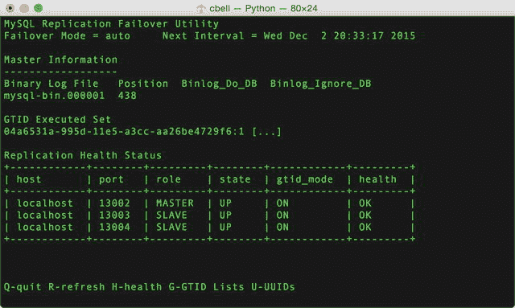
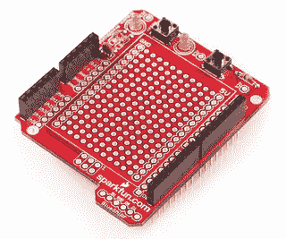
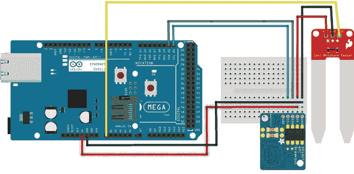

# 8.高可用性技术演示

Electronic supplementary material The online version of this chapter (doi:[10.​1007/​978-1-4842-1293-6_​8](http://dx.doi.org/10.1007/978-1-4842-1293-6_8)) contains supplementary material, which is available to authorized users.

了解什么是高可用性以及实现更高级别的可靠性的一些关键目标，将有助于您设计具有更高可靠性的 IOT 解决方案。正如您在前一章中了解到的，要实现这些目标需要做一些工作，但是如果您的解决方案扩展到一组离散的节点之外，那么适度的工作是值得的。

然而，了解这些概念只是解决方案的一部分。你还需要看一些例子，看看这些技术是如何体现的。例如，如何检测数据收集器节点故障并从中恢复，以及如何设置 MySQL 复制以在主节点出现故障时切换到新的主节点？此外，应用程序如何知道这已经发生了？

我们将使用示例项目来探索这些主题以及更多内容，这些示例项目展示了代码中的技术。有些例子是用 Python 写的，因为它们更有可能在低成本的计算机主板上实现，甚至在个人或服务器计算机上实现。其他例子是为 Arduino 编写的，但也可以适用于其他微控制器板。

Tip

本章中的示例介绍了一些技巧，而不是完整的解决方案。它们更像是成功的秘诀，而不是如何做的示范。尽管如此，本节中的示例是您可以在自己的解决方案中使用的高级技术。

在我们进入代码示例之前，让我们来探索一下让您的数据库服务器更加可靠的主要工具:MySQL 复制。

## `MySQL Replication Techniques`

回想一下，MySQL 复制是一种机制，它允许您将一台服务器指定为主服务器，将一台或多台服务器指定为从服务器，从服务器接收对主服务器所做的所有更改的副本。这允许您将数据从一台服务器复制到许多其他服务器。在前一章中，您了解了如何设置 MySQL 复制，以便在主服务器出现故障时进行热备用或备份和手动恢复。

虽然 MySQL 复制很容易设置 [1](#Fn1) 并且管理小型复制拓扑通常不是负担，只需要很少的干预，但管理大型复制拓扑并解决可能出现的问题(无论是有意还是无意的)可能更具挑战性。

Note

本章中的复制示例需要 MySQL server 版本 5.6.5 或更高版本。

使用 MySQL 复制的经验将有助于克服您在这个过程中可能遇到的许多正常需求。事实上，快速阅读在线 MySQL 参考手册中的复制部分会有很大帮助。但是，可能会发生一些在文档中不太明显的事情(但是有描述，只是没有被强调)。我将使用本节中的示例介绍这些主题，从故障转移和切换开始。

您还将研究大量高级 MySQL 复制技术、最佳实践，甚至是一些如何在您的 IOT 解决方案中利用 MySQL 复制的示例。让我们从收集一些关键技术开始，以充分利用 MySQL 复制；首先是一个关键的数据库概念，称为事务处理。

### 交易处理

事务是对数据库的一组操作，您希望使其原子化。也就是说，如果其中一个失败，您希望自事务开始以来的所有更改都被撤销(恢复)。典型的例子是把钱从一个银行账户转移到另一个账户。这需要从第一个账户中扣除金额，并将其添加到第二个账户中——这一行为需要两步。如果其中任何一个失败，这些变化都不会发生；否则，你已经得到了未分配或未转账的资金！

我们用特殊的`START TRANSACTION`或`BEGIN`语句开始一个事务。如果所有语句都成功，我们将发出一个`COMMIT`语句来完成操作，并指示数据库服务器永久地写入更改。如果我们想要恢复更改，我们可以发出一个`ROLLBACK`语句来撤销所有的更改。

使用 InnoDB 存储引擎时，MySQL 支持事务。这个引擎是 MySQL 中默认的存储引擎，所以事务是默认启用的。

清单 [8-1](#FPar3) 展示了一个这样的例子。我们从一个只包含两列的测试表开始——一个自动递增列和一个整数列。观察如何使用事务来保存数据。

Listing 8-1.Demonstration of Transaction Processing in MySQL

`mysql> USE test;`

`Database changed`

`mysql> CREATE TABLE test_trans(id INT AUTO_INCREMENT PRIMARY KEY, value INT);`

`Query OK, 0 rows affected (0.07 sec)`

`mysql> INSERT INTO test_trans VALUES (NULL,1), (NULL,2), (NULL,3);`

`Query OK, 3 rows affected (0.03 sec)`

`Records: 3  Duplicates: 0  Warnings: 0`

`mysql> BEGIN;`

`Query OK, 0 rows affected (0.00 sec)`

`mysql> INSERT INTO test_trans VALUE (NULL,4);`

`Query OK, 1 row affected (0.00 sec)`

`mysql> SELECT * FROM test_trans;`

`+----+-------+`

`| id | value |`

`+----+-------+`

`|  1 |     1 |`

`|  2 |     2 |`

`|  3 |     3 |`

`|  4 |     4 |`

`+----+-------+`

`4 rows in set (0.00 sec)`

`mysql> DELETE FROM test_trans;`

`Query OK, 4 rows affected (0.00 sec)`

`mysql> SELECT * FROM test_trans;`

`Empty set (0.00 sec)`

`mysql> ROLLBACK;`

`Query OK, 0 rows affected (0.00 sec)`

`mysql> SELECT * FROM test_trans;`

`+----+-------+`

`| id | value |`

`+----+-------+`

`|  1 |     1 |`

`|  2 |     2 |`

`|  3 |     3 |`

`+----+-------+`

`3 rows in set (0.01 sec)`

`mysql> BEGIN;`

`Query OK, 0 rows affected (0.00 sec)`

`mysql> INSERT INTO test_trans VALUES (NULL,4), (NULL,5);`

`Query OK, 2 rows affected (0.00 sec)`

`Records: 2  Duplicates: 0  Warnings: 0`

`mysql> DELETE FROM test_trans WHERE id <= 2;`

`Query OK, 2 rows affected (0.01 sec)`

`mysql> SELECT * FROM test_trans;`

`+----+-------+`

`| id | value |`

`+----+-------+`

`|  3 |     3 |`

`|  5 |     4 |`

`|  6 |     5 |`

`+----+-------+`

`3 rows in set (0.00 sec)`

`mysql> COMMIT;`

`Query OK, 0 rows affected (0.01 sec)`

`mysql> SELECT * FROM test_trans;`

`+----+-------+`

`| id | value |`

`+----+-------+`

`|  3 |     3 |`

`|  5 |     4 |`

`|  6 |     5 |`

`+----+-------+`

`3 rows in set (0.00 sec)`

注意，我们从插入几行没有事务开始。在这种情况下，MySQL 服务器被设置为自动提交这些语句。这被称为自动提交，可以用`autocommit`选项来控制。接下来，我们启动一个执行大量语句的事务，然后回滚操作并检查结果。最后，您可以看到一个如何提交的示例。

事务处理可能不明显的一点是这些变化如何影响其他连接。例如，在前面的演示中，如果另一个连接在提交事务之前查询数据，会发生什么情况？该连接将看到原始的、未被更改的数据，因为它还没有被提交。有趣的是，当前连接会在提交之前看到更改，因为更改是该会话的本地更改。你可以在交易中间的`SELECT`中看到。

事务是在解决方案中使用的一种优秀的高级技术，尤其是在为数据开发复杂的多步语句时。此外，事务是更高级的复制功能(如全局事务标识符)中使用的一个关键概念。

### 具有全局事务标识符的高级复制

回想一下第 7 章中的[，您发现了如何使用一种机制来设置复制，这种机制需要从主服务器识别二进制日志文件和位置，然后使用`CHANGE MASTER TO`语句在从服务器上指定该信息。这被称为二进制日志文件和位置复制。但是，有一种更新、更好的方法可以提高性能，并使自动故障转移和更容易的切换成为可能。所需的特性称为使用全局事务标识符(GTID)的复制或基于 GTID 的复制。](7.html)

GTIDs 使服务器能够为每个事件集或组分配一个唯一的标识符，从而可以知道每个从服务器上应用了哪些事件。也就是说，当启用 GTIDs 时，MySQL 服务器的复制组件会将一个特殊事件注入到二进制日志中，该日志包含一个对每个服务器都是唯一的全局唯一标识符和一个事务开始时的序列号。通过这种方式，MySQL 复制可以检测哪些事件与每个事务相关联，甚至可以检测事务是从哪个服务器发送的。最重要的是，复制协议现在可以确定从设备上缺少哪些事务，这样当从设备连接时，只有那些尚未应用到从设备的事务才会被发送。

现在让我们看看如何使用 GTIDs 设置一个主机和几个从机。如果您的服务器上已经有数据，您应该在打开 GTIDs 之前同步所有服务器上的数据。然而，在我们打开 GTIDs 之前，您应该在主服务器上创建一个用户，从服务器可以使用它来连接。该用户必须拥有所有数据库的`REPLICATION SLAVE`权限。为用户分配一个密码也是一个很好的做法。以下语句显示了如何设置复制用户帐户并授予适当的权限:

`CREATE USER 'rpl'@'localhost' IDENTIFIED BY 'rpl'`

`GRANT REPLICATION SLAVE ON *.* TO 'rpl'@'localhost'`

现在我们准备设置服务器来使用 GTIDs。为此，您必须为主服务器指定以下选项。您可以将它们放在`my.cnf`文件中，或者将它们指定为启动命令。

`[mysqld]`

`gtid-mode=ON`

`enforce-gtid-consistency`

在这里，我们打开 GTIDs，然后添加一个额外的选项来加强跨服务器的一致性。如果您计划切换主角色或计划设置故障转移，您将需要使用此选项。

在从机上，我们还需要在`my.cnf`文件中指定以下选项或指定为启动命令。拓扑中的所有服务器都需要这些选项。此外，从机可以配置为使用一个表来存储主机信息。您可以在每个从属服务器的以下示例配置文件中看到这些选项:

`[mysqld]`

`gtid-mode=ON`

`enforce-gtid-consistency`

`master-info-repository=TABLE`

`report-host=` `slave1`

`report-port=13002`

Note

如果您计划将您的主服务器用作从服务器，您应该使用为从服务器指定的选项。

一旦所有服务器都重新启动，并且您确认没有错误，您就可以开始配置复制。回想一下[第 7 章](7.html)，我们对每个从机发出`CHANGE MASTER TO`和`START SLAVE`语句。下面是这些语句的一个示例:

`CHANGE MASTER TO MASTER_HOST='master', MASTER_PORT=13001, MASTER_USER='rpl', MASTER_PASSWORD='secret', MASTER_AUTO_POSITION = 1;`

`START SLAVE;`

注意这里我们不再需要指定主二进制日志文件和位置。相反，我们只是指示从机使用 GTIDs 提供的自动定位特性。您可以使用`SHOW SLAVE STATUS`检查从属服务器上的复制状态。您应该看不到任何错误。关于 GTIDs 的更多信息，请参见在线 MySQL 参考手册 [`http://dev.mysql.com/doc/refman/5.7/en/replication-gtids.html`](http://dev.mysql.com/doc/refman/5.7/en/replication-gtids.html) 。

Tip

使用`\G`选项查看数值的垂直列表，而不是表格输出。它使得宽行更容易阅读，在这种情况下，输出也更容易被普通人阅读。

既然您已经理解并能够使用 GTIDs，那么您可以开始使用一些高级的复制概念，比如故障转移。

Testing Replication With Mysql Utilities

在接下来的小节中，我将介绍几个使用复制的概念和例子。要运行这些示例，特别是伸缩和故障转移示例，您需要设置一个主服务器和两个或三个从服务器的复制拓扑。以下是您可以在自己的系统上设置测试复制拓扑的步骤。每个步骤和示例的文档都包含在在线 MySQL 实用程序文档( [`http://dev.mysql.com/doc/mysql-utilities/1.6/en/`](http://dev.mysql.com/doc/mysql-utilities/1.6/en/) )中。

Clone a running (installed) MySQL server with `mysqlreplicate`. Make at least three or four clones assigning the correct port, server ID, database director, and so on (change all occurrences of `13001` in the command). `mysqlserverclone --server=root:secret@localhost:3306 --new-data=/tmp/13001` `--new-port=13001 --new-id=1 --root-password=root --del --mysqld="--log_bin=mysql-bin` `--gtid-mode=on --enforce-gtid-consistency --master-info-repository=table` `--report-host=localhost --report-port=13001"`   Set up the replication user on each server. Use the `mysql` client to connect to each server in turn and run the following SQL statements: `SET @@sql_log_bin=0;` `CREATE USER 'rpl'@'localhost' IDENTIFIED BY 'rpl'` `GRANT REPLICATION SLAVE ON *.* TO 'rpl'@'localhost'` `SET @@sql_log_bin=1;`   Once all servers are cloned, set up replication with `mysqlreplication`. Here I use the server on port 13001 as the master. Run this command once for each slave (change the slave port accordingly). `mysqlreplicate --master=root:root@localhost:13001 --slave=root:root@localhost:13002` `--rpl-user=rpl:rpl`   To see the topology, use `mysqlrplshow` using the server and the discover slaves login option. `mysqlrplshow --master=root:root@localhost:13001 --disco=root:root`  

这难道不比手动操作简单得多吗？我在这本书的源代码中包含了一个名为`setup_topology.txt`的文件，它演示了可以用 MySQL 实用程序创建拓扑的命令。只需更改选项以匹配您的系统。

#### `Switchover`

有时需要将主设备的角色从原来的主设备切换到其中一个从设备。您可能需要这样做，以便在主服务器上执行维护，从数据丢失中恢复，以及执行需要停止复制一段时间的其他事件。不要强迫您的解决方案完全停止，您可以简单地临时切换主服务器角色，然后在主服务器重新联机时再切换回来。

接下来是使用 MySQL 实用程序执行切换的演示。回想一下，MySQL 实用程序由一组 Python 脚本和库组成，旨在帮助自动化服务器维护。许多实用程序旨在帮助设置和管理复制。清单 [8-2](#FPar7) 显示了`mysqlrpladmin`实用程序的执行，以执行从主设备到其中一个从设备的切换。输出显示了所采取的所有步骤。如果您是手动完成的，那么您将不得不自己在每个从服务器上完成每项操作，然后再在主服务器上完成。

Listing 8-2.Switchover Using mysqlrpladmin

`$ mysqlrpladmin switchover --demote-master --master=root:secret@localhost:13001 --new-master=root:secret@localhost:13002 --discover-slaves=root:secret`

`# Discovering slaves for master at localhost:13001`

`# Discovering slave at localhost:13002`

`# Found slave: localhost:13002`

`# Discovering slave at localhost:13003`

`# Found slave: localhost:13003`

`# Discovering slave at localhost:13004`

`# Found slave: localhost:13004`

`# Checking privileges.`

`# Performing switchover from master at localhost:13001 to slave at localhost:13002.`

`# Checking candidate slave prerequisites.`

`# Checking slaves configuration to master.`

`# Waiting for slaves to catch up to old master.`

`# Stopping slaves.`

`# Performing STOP on all slaves.`

`# Demoting old master to be a slave to the new master.`

`# Switching slaves to new master.`

`# Starting all slaves.`

`# Performing START on all slaves.`

`# Checking slaves for errors.`

`# Switchover complete.`

`#`

`# Replication Topology Health:`

`+------------+--------+---------+--------+------------+---------+`

`| host       | port   | role    | state  | gtid_mode  | health  |`

`+------------+--------+---------+--------+------------+---------+`

`| localhost  | 13002  | MASTER  | UP     | ON         | OK      |`

`| localhost  | 13001  | SLAVE   | UP     | ON         | OK      |`

`| localhost  | 13003  | SLAVE   | UP     | ON         | OK      |`

`| localhost  | 13004  | SLAVE   | UP     | ON         | OK      |`

`+------------+--------+---------+--------+------------+---------+`

`# ...done.`

为了执行切换，我指定了原始主服务器(回调切换需要运行良好的主服务器)、新的主服务器以及每个从服务器的登录名和密码(称为发现)。我指定的将主服务器保留为从服务器的选项在这里很有意思。在新的主设备接管后,`demote-master`选项将主设备作为拓扑的从设备返回。这里需要注意的是，这是不可能的，除非你像设置从设备一样设置主设备(用`report-host`、`report-port`和`master-into-repository`)。您可以在清单的末尾看到结果，实用程序打印出新拓扑的健康报告。在这里，您可以看到原来的主机(在端口 13001 上)现在是从机。

#### `Failover`

故障转移是指主服务器以某种方式出现故障，您需要自动重新配置拓扑来恢复主服务器角色的情况。在使用 GTIDs 之前，自动故障转移在最好的情况下也是有问题的，并且除了最简单的情况之外，对于所有情况都是不可靠的。

为了使用 GTIDs 执行故障转移，我们选择最好的从设备(丢失事件最少的设备，以及与主设备最匹配的硬件)，并使其成为所有其他从设备的从设备(也称为从设备提升)。我们称这个从设备为候选从设备。GTID 机制将确保只应用那些没有在候选从设备上执行的事件。通过这种方式，候选从模块成为最新的，因此成为主模块的替代。

同样，您可以使用 MySQL 实用程序来监视主服务器，并自动将其中一个从服务器提升为新的主服务器。`mysqlfailover`命令行工具通过执行先前的事件序列来执行自动故障转移，并负责将剩余的从设备重定向到新的主设备。图 [8-1](#Fig1) 到 [8-3](#Fig3) 显示了该实用程序的一系列截图。第一个显示了监控模式下的实用程序。

图 8-3。

Automatic failover with mysqlfailover (after failover)

图 8-2。

Automatic failover with mysqlfailover (fault detected)

图 8-1。

Automatic failover with mysqlfailover (before failover)

请注意，该实用程序显示了许多统计信息，包括拓扑中所有服务器的当前健康报告。该实用程序通过以指定的时间间隔检查主服务器的状态来工作。在这个例子中，我使用了 30 秒的间隔。为了模拟主进程失败，我终止了主进程。图 [8-2](#Fig2) 显示实用程序检测到故障并执行自动故障转移。

当故障转移完成时，实用程序返回到其监控模式，如图 [8-3](#Fig3) 所示。自动故障转移真的很简单！是的，如果安装了 Python 2.6 或更高版本以及 Connector/Python，您可以在低成本计算机上运行该实用程序。

请注意，在前面的屏幕截图中，该实用程序是作为控制台运行的。如果您需要将其作为后台进程运行，有一个配套的实用程序允许您将其作为进程或守护程序运行(仅适用于非 Windows 平台)。要了解更多关于`mysqlfailover`及其配套守护进程的信息，包括所有可用的命令和更多使用示例，请参见位于 [`http://dev.mysql.com/doc/mysql-utilities/1.6/en/utils-task-autofailover.html`](http://dev.mysql.com/doc/mysql-utilities/1.6/en/utils-task-autofailover.html) 的 MySQL 实用程序在线手册。

### 复制和数据库维护技巧

如上所述，对于较小的拓扑结构，MySQL 复制相对容易设置和维护。对于 IOT 解决方案，您不太可能遇到有许多服务器的复制拓扑(但您可能会遇到)。回想一下，如果出现问题，MySQL 复制可能需要做一些工作。在这一节中，我将重点介绍一些可能出错的常见情况，并介绍防止出错和从错误中恢复的方法。

#### `Avoiding` `Errant Transactions`

也许新管理员在 MySQL 复制中最常犯的错误是引入错误的事务。错误事务是那些仅适用于一台服务器的语句(或事务),在另一台服务器上执行时无效，或者在执行时导致复制错误。错误的事务通常是由于在主服务器上运行了一个或多个不应被复制的 SQL 语句。对于 GTIDs，当在从设备上执行相同的操作，并且该从设备后来成为主设备或者离开并重新加入拓扑时，可能会发生错误的事务。

例如，如果您在主服务器上执行任何 SQL 命令来创建、更新或删除从服务器上不存在的任何内容，您可能会遇到严重到足以停止从服务器上的复制的错误。回想一下，一旦复制开始，每个 SQL 语句都被写入二进制日志，然后传输到从属服务器。因此，在启用二进制日志记录的情况下，我们在主服务器上执行语句时必须小心。

幸运的是，有一种方法可以省略记录到二进制日志中的语句。有一个名为`sql_log_bin`的特殊变量，您可以为当前会话(登录用户)关闭它，它不会影响任何其他连接。只需关闭二进制日志，执行语句，然后再次打开它。以下代码显示了如何使用此技术将复制用户帐户添加到已启用二进制日志的服务器中:

`SET @@sql_log_bin=0;`

`CREATE USER 'rpl'@'localhost' IDENTIFIED BY 'rpl'`

`GRANT REPLICATION SLAVE ON *.* TO 'rpl'@'localhost'`

`SET @@sql_log_bin=1;`

如果在复制服务器上执行维护时使用这种技术，您可以避免错误的事务，从而避免解决从属错误的许多不必要的麻烦。

#### `Resolving` `Slave Errors`

当您在从机上遇到错误时，您将在`SHOW SLAVE STATUS`输出中看到错误。如果错误是由错误的事务引起的，您必须指示主服务器跳过这些事务，这对于二进制日志文件和基于位置的复制来说很容易，但是对于启用 GTID 的服务器来说可能有点棘手。召回错误的事务通常是主设备的二进制日志中的某个事件，该事件在从设备上运行时不适用或产生错误。

对于二进制日志文件和基于位置的复制，您可以指示从属服务器跳过一些不适用于从属服务器的事件。但是首先，您应该执行以下步骤来诊断问题。此时，从机因出错而停止。

Determine the error and look up the error in the reference manual. Sometimes the error is well known or has a predictable solution.   Determine the event or events causing a problem. A look at the output of `SHOW SLAVE STATUS` will tell you the binary log file and position of the event. You can use that on the master to see the event with the `SHOW BINLOG EVENTS` statement. If the event cannot be run (wrong tables, and so on), you must skip the event. If you are not sure, start the slave again and check for errors.   If you must skip the events, issue the following statements to skip and start the slave. The following statement skips the next two events: `mysql> SET GLOBAL sql_slave_skip_counter = 2` `mysql> START SLAVE;`   If this does not solve the problem, you may need to skip more events. However, if you cannot find a restarting point, you may need to do more intensive diagnosis or restore the slave from the latest backup and restart replication.[2](#Fn2)  

对于支持 GTID 的复制，事情就没那么简单了。这里，我们需要识别从属服务器上的错误事务。您可以在从机的`SHOW BINLOG EVENTS`输出中看到这些。一旦有了 GTID，就可以使用下面的语句在主服务器上的二进制日志中创建一个空事务。这将有效地告诉主设备该事件已经发生，即使它没有在主设备或该事件被传送到的任何从设备上执行。

错误的事务在 GTID 复制中更常见，因为从属服务器都在自己的二进制日志中记录更改。另外，当从设备连接到主设备时，它会与主设备交换 GTIDs 列表。如果名单不一致，就会出现错误的交易。您可以通过发出以下语句来确定是否存在错误的事务。我们从识别母版上的 UUID 开始。

`mysql> SHOW VARIABLES LIKE "%uuid%";`

`+---------------+--------------------------------------+`

`| Variable_name | Value                                |`

`+---------------+--------------------------------------+`

`| server_uuid   | 0f5ae7a2-9968-11e5-8990-08fdde5e3c13 |`

`+---------------+--------------------------------------+`

`1 row in set, 1 warning (0.00 sec)`

然后，在从属服务器上，运行`SHOW SLAVE STATUS`并检查`executed_gtid_set`的结果，如下所示:

`Executed_Gtid_Set: 0f5ae7a2-9968-11e5-8990-08fdde5e3c13:1,`

`130a0dec-9968-11e5-9766-aa87a4a44672:1`

从模块上的错误事务是那些没有从主模块的 UUID 开始的 GTIDs。从这个列表中，我们看到有一个 GTID，130 A0 dec-9968-11e 5-9766-aa 87 a4 a 44672:1，它是错误的(不在主设备上，也不是源自主设备)。要跳过这一步，我们需要欺骗主节点忽略该事务。让我们看看这些陈述，然后讨论它们的用法。清单 [8-3](#FPar8) 显示了创建一个空事务来忽略(跳过)一个错误事务的过程。

Listing 8-3.Skipping Errant Transactions with GTIDs

`mysql> SET GTID_NEXT='dd365ccc-9898-11e5-872d-172ea4aa6911:1'`

`Query OK, 0 rows affected (0.00 sec)`

`mysql> BEGIN;`

`Query OK, 0 rows affected (0.00 sec)`

`mysql> COMMIT;`

`Query OK, 0 rows affected (0.01 sec)`

`mysql> SET GTID_NEXT='AUTOMATIC'`

`Query OK, 0 rows affected (0.00 sec)`

`mysql> FLUSH LOGS;`

`Query OK, 0 rows affected (0.08 sec)`

`mysql> SHOW BINARY LOGS;`

`+------------------+-----------+`

`| Log_name         | File_size |`

`+------------------+-----------+`

`| mysql-bin.000001 |      1091 |`

`| mysql-bin.000002 |       314 |`

`+------------------+-----------+`

`2 rows in set (0.00 sec)`

`mysql> PURGE BINARY LOGS TO 'mysql-bin.000002'`

`Query OK, 0 rows affected (0.04 sec)`

哇哦！这是一个复杂的过程。我们首先在主服务器上设置下一个 GTID，然后开始并提交一个事务(一个空事务)。然后，我们将 GTID 编号恢复为自动，并刷新日志。我们这样做是为了清除旧日志。您可以在`SHOW BINARY LOGS`的输出中看到，我们可以清除旧的二进制日志文件。一旦这个过程完成，我们就可以重新启动从属服务器。

有关此过程的更多信息，请参见在线 MySQL 参考手册 [`http://dev.mysql.com/doc/refman/5.7/en/replication-gtids-failover.html#replication-gtids-failover-empty`](http://dev.mysql.com/doc/refman/5.7/en/replication-gtids-failover.html#replication-gtids-failover-empty) 。

#### `Starting Replication with Existing Data`

第 7 章中关于复制的讨论假设您从一张白纸开始复制。但是，如果主服务器上已经有数据，那么在主服务器上启动二进制日志之前，需要备份主服务器上的数据，并在从服务器上恢复它。

但是，如果您已经有一个主服务器和一个从服务器在运行，并且已经运行了一段时间，但是您想要添加另一个从服务器，该怎么办呢？您可以使用最初在设置从属服务器时所做的备份(如果您这样做的话)，但是新的从属服务器必须读取自备份以来发生的所有更改。

您也可以备份主服务器，但是您必须暂停写入二进制日志才能这样做。 [3](#Fn3) 更好的方法是暂时停止现有的从站，等待它读取并应用其中继日志中的事件(使用`SHOW SLAVE STATUS`语句查看当前状态)。您需要查看的列在这里用实际复制从属服务器的摘录突出显示:

`Slave_IO_State: Waiting for master to send event`

`...`

`Slave_SQL_Running_State: Slave has read all relay log; waiting for more updates`

在这里，您可以看到从机已经从主机(`slave_io_state`)读取了所有事件，并且从机已经处理了其中继日志(`slave_sql_running_state`)中的所有事件。

如果您使用二进制日志文件和基于位置的复制，您将需要记录当前主二进制日志文件和位置，如`SHOW SLAVE STATUS`输出所示。如果您使用 GTIDs，您不需要这些信息。

一旦从属服务器停止并且执行了所有中继日志事件，您就可以进行备份，重新启动原始从属服务器，然后在新从属服务器上恢复数据，最后在新从属服务器上开始复制。

### 示例:缩放应用程序

扩展关乎性能。读取扩展是指使用额外的服务器来指导读取操作(`SELECT`语句)，这样就不会有一个服务器承担处理大量读取请求的负担。还有分片扩展，理想情况下，在几个服务器之间划分(分区)数据，以便它们拥有相同的数据量。要访问碎片，您必须使用一种算法(通常是一个简单的散列函数)或专用于每个碎片的一系列值。可以想象，将查询路由到正确的碎片是一个挑战。幸运的是，大多数 IOT 解决方案不需要使用分片来提高性能。相反，一些 IOT 解决方案更有可能受益于读取扩展。

MySQL 的读扩展使用一种复制拓扑，将所有写操作(`CREATE`、`INSERT`、`UPDATE`、`DELETE`等)发送到主服务器，并将所有读操作发送到其中一个从服务器。您需要的从机数量很大程度上取决于您的应用程序读取数据的频率。

虽然设置读取扩展并不比设置复制更困难(您不需要做任何特殊的事情)，但是编写应用程序来扩展读取是一个挑战。更具体地说，知道向哪个服务器发送客户机(应用程序)可以是一种简单的循环或队列机制，或者您可以实现复杂的负载平衡来将读取定向到最少使用的服务器。

对于需要适度提升读取性能的解决方案，您可能只需要一个简单的服务器选择机制。更大、更复杂的解决方案可能需要构建自己的负载平衡器或使用第三方负载平衡器。 [4](#Fn4) 即使如此，负载平衡机制也可能完全依赖于应用程序，甚至在某些情况下依赖于访问方法(想想查询类型)。

对于业余爱好者和爱好者的 IOT 解决方案，甚至中小型商业 IOT 解决方案，简单的服务器选择机制是绰绰有余。如果性能开始下降，您只需添加另一台服务器并分散读取。

您可能想知道在哪里或者如何设置读取比例。一种可能的实现是使用低成本计算机板的拓扑结构。另一个是云服务，它提供可以动态创建和销毁的 MySQL 实例。幸运的是，MySQL 在云中的工作方式与它在任何其他设备上的工作方式相同——您获得的云服务器只是一个虚拟化的服务器，而不是真正的硬件。

现在，您已经了解了什么是读取伸缩以及如何使用它来提高性能，让我们来看一个简单的服务器选择代码示例，您可以使用它在几个服务器之间传播读取。让我们从设计开始。

#### `Overview of the` `Design`

我没有设计一个代码解决方案，而是给出了一个可以用来在 MySQL 中实现持久性组件的解决方案。也就是说，我们可以使用数据库服务器作为看门人，以帮助确保两个客户端不会选择同一个从服务器。它可能不是最有效的机制，也不是一个通用的负载平衡器(但它模拟了一个基本的负载平衡器)，它提供了一种机制，允许您在每次添加新服务器时无需修改代码就可以使用它。事实上，它会从可用服务器列表中自动选择一个服务器，您甚至不必创建和管理配置文件。 [5](#Fn5)

关键概念是复制本身的一个特性。我们将在主服务器上使用`SHOW SLAVE HOSTS`语句来获取从服务器的列表。回想一下，我们要求所有从机使用`--report-host`和`--report-port`选项来获取出现在列表中的数据。然后，我们使用循环机制来选择列表中的下一个服务器。

另一个关键概念是使用数据库服务器来存储上次使用的服务器 ID。我们创建一个简单的数据库和一个只有一行的表，如下所示。注意，我们存储了服务器 ID、主机名和端口。

`CREATE DATABASE read_scaling;`

`CREATE TABLE read_scaling.current_slave(server_id INT, host CHAR(30), port INT);`

`INSERT INTO `read_scaling`.`current_slave` VALUES (0,NULL,0);`

请注意`INSERT`语句。您将需要插入一个起始行，因为代码被设计为只更新单行，使它变得很小并且易于使用。但是，您可能对表中的那一行感到疑惑。使用过具有多个客户端的应用程序的精明读者可能想知道如何防止两个或更多的客户端同时冲突和更新行(或不按顺序)。这就是数据库的力量帮助我们的地方。

在计算机编程行话中，我们称程序中必须执行的部分为临界区。在这种情况下，它类似于这方面的交易。MySQL 提供了一个名为`LOCK TABLES`的 SQL 语句，我们可以用它来锁定表，更新它，然后释放锁。通过这种方式，我们确保一次只有一个客户端可以更新该表，因为`WRITE`锁阻止所有其他连接读取或写入该表。下面显示了我们将在代码中使用的 SQL 语句:

`LOCK TABLES read_scaling.current_slave WRITE;`

`UPDATE read_scaling.current_slave SET server_id=2,host='test123',port=13001;`

`UNLOCK TABLES;`

但是，等等，数据怎么办——它不会被复制到从属服务器吗？事实上，会的。虽然这真的没有关系，因为我们不会从从属服务器读取数据，但是有一个很好的理由允许复制这些数据。想想看，如果船长倒下了会发生什么。如果您没有复制数据，那么在配置新的主服务器时，您将会丢失数据；你必须重新设置它。但是鉴于它的简单性，这并不是一个真正的问题。所以，允许它复制是没问题的。

What I Don’t Want Certain Data Replicated?

有时可能有您不想复制的数据。在这种情况下，您可以使用 MySQL 内置的复制过滤器来告诉服务器不要复制某些数据。主服务器(二进制日志选项)和从服务器(复制选项)上都有过滤器。它们可以是包容性的，也可以是排他性的。

在主服务器上设置过滤器可以确保与过滤器匹配的数据不会保存在二进制日志中，因此不会传输到从服务器。在从机上设置过滤器可确保数据在传输过程中被从机丢弃。请这样想，如果您希望某些数据永远不被复制，请使用主过滤器。如果您希望一个或多个从属服务器而不是所有服务器都不获取数据，请使用从属过滤器。

二进制日志过滤器包括`--binlog-do-db`和`--binlog-ignore-db`。复制过滤器包括`--replicate-do-db`、`--replicate-ignore-db`、`--replicate-do-table`和`--replicate-ignore-table`。请参阅在线 MySQL 参考手册，了解有关设置和维护过滤器的更多信息，以及使用过滤器的陷阱( [`http://dev.mysql.com/doc/refman/5.7/en/replication-options-binary-log.html`](http://dev.mysql.com/doc/refman/5.7/en/replication-options-binary-log.html) )和( [`http://dev.mysql.com/doc/refman/5.7/en/replication-options-slave.html`](http://dev.mysql.com/doc/refman/5.7/en/replication-options-slave.html) )。

最后，代码将被编写为一个类，您可以将它放入您的库中，并包含在您想要的任何客户端代码中。出于演示代码的目的，我将包含测试代码，但是您可以删除它并在库中使用该类。这个类被命名为`select_read_server`，是用 Python 编写的，但也可以很容易地用您选择的任何语言编写。

#### `Write the Code`

该类只需要一个名为`get_next_server()`的公共方法，该方法返回服务器 ID、主机和端口的字典。需要许多 helper 方法，这些方法将是私有的(名称中以下划线字符开头)。

我们需要一种方法来连接到主机，并检索所有从机的列表，并将该信息存储在内存中。我们将这种方法命名为`_get_server_list()`。接下来，我们需要一个方法来记录所选从属服务器的服务器 ID，以便任何其他客户机都可以读取它。我们将这种方法命名为`_set_server_id()`。回想一下，我们将使用数据库来存储所选择的服务器 ID，并将使用锁定来防止其他客户机中断对表的更新。因此，`_set_server_id()`必须执行前面描述的锁定机制。我们还需要一个从表中读取服务器 ID 的方法。我们将这种方法命名为`_get_current_server_id()`。最后，我们包含了一个简单的循环来演示如何使用该类为下一个从机检索信息。清单 [8-4](#FPar10) 显示了完整的代码。

Listing 8-4.Simple Read Scaling Server Selector

`# Demonstration of a simple round robin read scaling slave selector`

`#`

`# Use this class in your own application to choose the next slave`

`# in the topology.`

`#`

`# Note: you must have a database and table setup on the master as`

`# follows:`

`#`

`# CREATE DATABASE read_scaling;`

`# CREATE TABLE read_scaling.current_slave(server_id INT, host CHAR(30), port INT);`

`#`

`# Note: You must also have a replication topology of a master and at least`

`#       two slaves for the demo output to be meaningful. In fact, running this`

`#       on a master with no slaves will result in an error.`

`#`

`from __future__ import print_function`

`import mysql.connector as mysql`

`import operator`

`import sys`

`import` `time`

`LOCK_TABLE = "LOCK TABLES read_scaling.current_slave WRITE"`

`SET_SERVER = "UPDATE read_scaling.current_slave SET server_id={0},host='{1}',port={2}"`

`UNLOCK_TABLE = "UNLOCK TABLES"`

`GET_CURRENT_SERVER = "SELECT server_id FROM read_scaling.current_slave"`

`master = {`

`'user': 'root',`

`'password': 'root',`

`'host': 'localhost',`

`'port': 13001,`

`}`

`class select_read_server(object):`

`def __init__(self):`

`self.servers = []`

`self.cur_server_id = -1;`

`# Get the list of servers from the master and save the host,`

`# port, and server id.`

`def _get_server_list(self):`

`conn = mysql.connect(**master)`

`cur = conn.cursor()`

`cur.execute("SHOW SLAVE HOSTS")`

`# Save only the id, host, and port`

`for row in cur.fetchall():`

`server = {`

`'id': row[0],`

`'host': row[1],`

`'port': row[2],`

`}`

`self.servers.append(server)`

`# order the servers by server_id`

`cur.close()`

`conn.close()`

`self.servers.sort(key=operator.itemgetter('id'))`

`# Set the server in the database`

`def _set_server(self, id, host, port):`

`self.cur_server_id = id`

`conn = mysql.connect(**master)`

`cur = conn.cursor()`

`cur.execute(LOCK_TABLE)`

`query = SET_SERVER.format(id, host, port)`

`cur.execute(query)`

`print(">", query)`

`cur.execute(UNLOCK_TABLE)`

`cur.close()`

`conn.close()`

`# Get the current server id from the database`

`def _get_current_server_id(self):`

`# if first time, skip`

`if self.cur_server_id == -1: return`

`conn = mysql.connect(**master)`

`cur = conn.cursor()`

`cur.execute(GET_CURRENT_SERVER)`

`self.cur_server_id = cur.fetchall()[0][0]`

`cur.close()`

`conn.close()`

`# Get the next server in the list based on server id.`

`def get_next_server(self):`

`self.servers = []`

`self._get_server_list()   # update the server list`

`if not self.servers:`

`raise RuntimeError("You must have slaves connected to use this code.")`

`self._get_current_server_id()  # get current server in the database`

`for server in self.servers:`

`if server["id"] > self.cur_server_id:`

`# store the current server_id`

`self._set_server(server["id"], server["host"], server["port"])`

`return server`

`# if we get here, we've looped through all rows so choose first one`

`server = self.servers[0]`

`self._set_server(server["id"], server["host"], server["port"])`

`# return the current server information`

`return server`

`# instantiate the class - only need this once.`

`read_server_selector = select_read_server();`

`# demonstrate how to retrieve the next server and round robin selection`

`for i in range(0,10):`

`print(i, "next read server =", read_server_selector.get_next_server())`

`sys.stdout.flush()`

`time.sleep(1)`

注意，我们有主设备的连接信息，我们用它来获取从设备的信息。另外，请注意，每次请求下一个服务器时，我们都会得到这个列表。通过这种方式，代码将保持列表更新，这样，如果添加或删除了服务器(并且被主服务器删除)，连接列表将自动更新。

然而，`SHOW SLAVE HOSTS`语句的输出是无序的，可能不会按照服务器 ID 的顺序出现。因此，我添加了一个排序方法来确保循环机制按照升序遍历服务器 id。

Tip

如果从属主机意外断开连接，从属主机视图可能需要几秒钟才能更新。因此，如果您计划在生产环境中使用这段代码，您可能需要考虑添加代码来检查从属服务器是否仍然连接。

#### `Test the Sketch`

现在让我们测试代码。要在您的系统上运行它，您只需更改主信息以匹配您的设置，并使用`python`命令执行代码。清单 [8-5](#FPar12) 显示了一个运行示例。我添加了代码来打印该类的结果，并打印用于更新该表的 SQL 语句，以便您可以看到它确实选择了列表中的下一个服务器，并从列表中的第一个服务器 ID 开始重复循环。

Listing 8-5.Testing the Read Scaling Selector

`$ python ./read_scaling_demo.py`

`> UPDATE read_scaling.current_slave SET server_id=2,host='localhost',port=13002`

`0 next read server = {'host': u'localhost', 'id': 2, 'port': 13002}`

`> UPDATE read_scaling.current_slave SET server_id=3,host='localhost',port=13003`

`1 next read server = {'host': u'localhost', 'id': 3, 'port': 13003}`

`> UPDATE read_scaling.current_slave SET server_id=4,host='localhost',port=13004`

`2 next read server = {'host': u'localhost', 'id': 4, 'port': 13004}`

`> UPDATE read_scaling.current_slave SET server_id=2,host='localhost',port=13002`

`3 next read server = {'host': u'localhost', 'id': 2, 'port': 13002}`

`> UPDATE read_scaling.current_slave SET server_id=3,host='localhost',port=13003`

`4 next read server = {'host': u'localhost', 'id': 3, 'port': 13003}`

`> UPDATE read_scaling.current_slave SET server_id=4,host='localhost',port=13004`

`5 next read server = {'host': u'localhost', 'id': 4, 'port': 13004}`

`> UPDATE read_scaling.current_slave SET server_id=2,host='localhost',port=13002`

`6 next read server = {'host': u'localhost', 'id': 2, 'port': 13002}`

`> UPDATE read_scaling.current_slave SET server_id=3,host='localhost',port=13003`

`7 next read server = {'host': u'localhost', 'id': 3, 'port': 13003}`

`> UPDATE read_scaling.current_slave SET server_id=4,host='localhost',port=13004`

`8 next read server = {'host': u'localhost', 'id': 4, 'port': 13004}`

`> UPDATE read_scaling.current_slave SET server_id=2,host='localhost',port=13002`

`9 next read server = {'host': u'localhost', 'id': 2, 'port': 13002}`

注意，我们调用方法十次来获取下一个服务器。还要注意，代码在循环选择中成功地遍历从属服务器，用每个新选择更新数据库。酷吧。

## `High Availability IOT Nodes`

您已经看到了许多使用 MySQL 复制的技术，您可以利用这些技术在您的 IOT 解决方案中实现高可用性(可靠性)。但是这些包括数据库可用性，而不是 IOT 节点的底层硬件。本节分析了如何在 IOT 节点中实现高可用性的两个示例。

您将看到一个示例，展示如何对数据收集器故障进行冗余和自动恢复，以及一个数据聚合器，它可以在与数据库的连接失败时缓存数据。这些示例使用 Arduino 微控制器，但是这些概念可以应用于其他微控制器，因此您应该能够在自己的解决方案中复制这些概念。

### 示例:冗余数据采集器

如果你在越来越复杂的 IOT 解决方案中使用微控制器足够长的时间，你最终会遇到的一件事是，有时微控制器会变得不可靠 [6](#Fn6) 或完全失控。 [7](#Fn7) 这可能是因为电源故障、不干净的电源、篡改、糟糕的编程、内存损坏，或者只是普通的命运。我有过似乎永远运行的微控制器，也有过几天就变得可疑的微控制器。无论是哪种情况，微控制器都有可能偶尔出现故障。

解决这一问题并确保我们的解决方案更加可靠(在一定程度上具有高可用性)的一个方法是在我们的硬件中构建冗余。我们可以使用两个微控制器的主/从设置来实现这一点。两个微控制器将具有相同类型的传感器(如果不是相同的传感器[【8】](#Fn8))，但是只有主控制器将数据写入数据库。此外，我们希望使数据收集器冗余，并自动故障转移到从收集器，这样，如果主收集器出现故障，从收集器就会接管，我们不会丢失任何重要的数据。

是的，我们正在讨论创建一个简单的复制协议，供主设备和从设备进行通信。让我们考虑一下我们将如何做这件事。

#### `Overview of the` `Design`

有许多方法可以在主机和从机之间实现简单的协议。在这种情况下，我们将保持简单，使用心跳的概念。这是一条简单的消息，由一台服务器发送，并在另一台服务器上得到确认。这个想法是，如果心跳在一段时间后失败或丢失，第二个服务器可以假设第一个服务器已经失败或变得不可靠，变得可疑，或完全失控。

幸运的是，我们可以通过 Arduino 内置的功能做到这一点:带有有线协议的 I2C 接口总线。I2C 总线使用两个引脚或导线(有时称为双线):串行数据线(引脚 4 上的 SDA)和串行时钟线(引脚 5 上的 SCL)。该接口允许多个设备在启动时通过注册设备号进行连接。事实上，包括传感器在内的大量设备都使用 I2C 接口。

Caution

如果您使用的是 Uno、Leonardo 或具有较新接头布局的类似电路板，SDA 和 SCL 引脚位于引脚 13 (D2 和 D3)上方。类似地，像 Mega 或 Due 这样的较大电路板的 I2C 接口位于不同的位置(D20 和 D21)。请务必检查您的电路板的页眉布局；否则，您可能会面临令人沮丧的调试会话。 [9](#Fn9)

在 I2C 总线上，一个设备被指定为写设备，另一个被指定为读设备。因此，该代码将主机作为写入方，将从机作为读取方，从主机向从机传递简单的消息。我们将使用这个配置来构建一个简单的心跳算法，通过这个算法，主机以特定的时间间隔发送一条短消息。这有时被称为脉冲来完成比喻。

因此，当心跳在一个脉冲跨度内没有出现时，我们可以检测到主机何时不再通信。这可以通过在一定时间内没有脉搏或心跳消息来检测。我们可以使用该事件来触发故障转移到从机进行数据收集。更具体地说，在宣布主设备死亡之前，从设备上使用超时来等待一定的时间。如果主服务器在预定时间后没有发送消息，从服务器将接管并开始读取数据，并将数据保存到数据库服务器。因此，我们可以使用冗余数据收集器创建一个简单的自动故障转移。

#### `Assemble the` `Hardware`

本例的硬件需要两块 Arduino 板通过 I2C 总线连接在一起。我们给每个都增加了一个 LED，用于可视确认发送和接收的信息。我在主设备上使用红色 LED，在从设备上使用绿色 LED，但是使用你手头上的任何东西——颜色并不重要。图 [8-4](#Fig4) 显示了如何连接硬件。

图 8-4。

Redundant data collector (master/slave) Tip

如果您想用单个电源为 Arduino 板供电，可以将一个 Arduino 上的 5V 引脚连接到另一个 Arduino 上的 VIN 引脚。但是，这不能保护您免受电源问题的影响，所以我不建议将其用于生产。

请注意，图中显示了添加的传感器。这是为了说明的目的；您不需要它来执行示例代码。

Standard Headers And Wiring

现在你应该想知道如何让这些电线留在引脚头。Arduino 板的标准接头非常适合原型制作，但不太适合最终解决方案的安装。幸运的是，你可以买到不带接头的 Arduino 板，事实上，一些克隆的 Arduino 板设计有特殊的布局，使它们易于与试验板或硬连线电路一起使用。或者，您可以使用原型屏蔽来构建您的电路。下图描述了两个替代 Arduino 板和一个原型屏蔽，您可以在永久性解决方案中使用，例如将电线焊接到板上。

图片由 sparkfun.com 提供。

#### `Write the Sketch`

示例代码经过了简化，使其更易于实验。更具体地说，我没有包含任何用于读取传感器或写入数据库的代码。我已经为您添加这些元素的位置留下了注释。回想一下，在开发复杂的解决方案时，我们总是希望从这样的框架代码开始。如果您将所有内容都集中在一个代码文件中，而某个部分不工作，您可能不容易发现哪个部分导致了问题(或者即使多个部分都失败了)。

我还使用了一个叫做条件编译的编程技巧。这允许我拥有可以以一种方式使用(编译)但如果以另一种方式使用(编译)就会被丢弃的代码段。在这种情况下，我需要一个源文件，但是有条件地使用主文件的一些部分和从文件的其他部分。

为了将部分标记为有条件的，我们使用`#if defined`子句和其相反的`#if not defined`子句以及一个`#define`来确定在我们编译和上传时包含哪些代码。因此，在下面的代码中，您将看到一个`#define SLAVE`,您可以注释掉它并使代码为主服务器编译。再次，离开`#define SLAVE`，代码被编译为从代码；注释掉它，你就得到了大师。

与其一次把所有的代码都扔给你，不如让我们仔细检查每一部分，从每个主模块和从模块的`setup()`代码开始讨论需要做什么。

主机和从机通信所需的代码来自线库。主机和从机都必须使用`wire.begin()`启动有线协议，但是从机需要注册设备号并提供一个回调(一个在事件触发时调用的特殊方法，在这种情况下是从主机接收的消息)。主机和从机都需要为 LED 设置一个引脚，并启动串行类。因此，`setup()`代码使用了前面讨论过的条件编译。代码如下所示。请注意，从模块的代码比主模块做得更多，我们有一个不在条件编译块中的部分。该代码针对主机或从机进行编译。

`void setup() {`

`#if defined SLAVE`

`Wire.begin(address);            // join i2c bus`

`Wire.onReceive(getHeartbeat);   // register the heartbeat code`

`startTime = millis();           // initiate timer`

`elapsedTime = 0;`

`#else`

`Wire.begin();`

`#endif`

`pinMode(13, OUTPUT);            // turn on onboard LED (pin 13)`

`Serial.begin(115200);`

`// TODO: Add any database initialization code here`

`}`

那么，对从机回调是什么？在这里，我们只是收到了来自主人的信息。完成这项工作的代码如下所示，非常简单明了。注意，我们从主机中读取字符，并将它们打印到串行监视器上。我们真的不在乎主人发出什么信息，只要它发出点什么就好。还要注意的是，我们设置了一个计时器，每当主人发送一条消息，计时器就会重新开始计时。

`void getHeartbeat(int chars) {`

`char ch;`

`while (Wire.available()) {`

`ch = Wire.read();`

`}`

`Serial.println("Master is ok.");`

`// Reset timer since master is Ok`

`startTime = millis();`

`elapsedTime = 0;`

`blink();  // visual feedback`

`}`

在主机上，我们用下面的代码发送消息。如你所见，我们只是写了一条简单的短信。然而，我们不能在 I2C 公共汽车上广播消息；它必须被定向到特定的设备。这里我们使用一个简单的变量`address`来设置地址。由于代码来自同一个文件，我们确保主模块和从模块用相同的值编译。

`void sendHeartbeat() {`

`Wire.beginTransmission(address);`

`Wire.write("hello!");`

`Wire.endTransmission();`

`blink();  // visual feedback`

`}`

在这一点上，我应该注意，我们不希望主设备中包含专门针对从设备的代码(这只会浪费宝贵的内存)，所以您会看到特定于从设备的代码周围有条件编译块。

那么，奴隶怎么知道主人死了呢？我们使用由`elapsedTime`、`startTime`和`maxTime`变量指定的超时代码。也就是说，我们用`millis()` [10](#Fn10) 记录 Arduino 每次通过我们的循环所用的毫秒数，这样，如果经过的时间超过设置的最大时间，我们就宣布主设备死亡。在这种情况下，我们编写草图(代码),让从机执行与主机相同的代码来读取传感器并将数据保存到数据库。

现在剩下的是与串行监视器通信、定时器到期和 LED 闪烁的细节——所有这些都应该是熟悉的。在任何情况下，清单 [8-6](#FPar16) 显示了带有自动故障转移的冗余数据收集器的完整代码。

Listing 8-6.Redundant Data Collector with Failover

`/**`

`Example Arduino redundant data collector`

`This project demonstrates how to create a data`

`collector master/slave for redundancy. If the master`

`fails, the slave will take over.`

`The sketch has both the master and slave code with the`

`default the slave role. To use the sketch as a master,`

`comment out the #define SLAVE.`

`*/`

`#include <Wire.h>`

`// TODO: Add MySQL Connector/Arduino include, variables here`

`#define SLAVE`

`int address = 8;                // Address on I2C bus`

`// Blink the LED on pin 13`

`void blink() {`

`digitalWrite(13, HIGH);`

`delay(1000);`

`digitalWrite(13, LOW);`

`}`

`// Record data to database`

`// Stubbed method for writing data`

`void recordData() {`

`// TODO: Complete this code for your sensor read and the write to MySQL.`

`}`

`#if defined SLAVE`

`unsigned long startTime;        // start of simple timer`

`unsigned long elapsedTime;      // number of milliseconds elapsed`

`unsigned long maxTime = 10000;  // timeout value (10 seconds)`

`// Get the heartbeat message from the master`

`void getHeartbeat(int chars) {`

`char ch;`

`while (Wire.available()) {`

`ch = Wire.read();`

`}`

`Serial.println("Master is ok.");`

`// Reset timer since master is Ok`

`startTime = millis();`

`elapsedTime = 0;`

`blink();  // visual feedback`

`}`

`#else`

`// Send the heartbeat pulse`

`void sendHeartbeat() {`

`Wire.beginTransmission(address);`

`Wire.write("hello!");`

`Wire.endTransmission();`

`blink();  // visual feedback`

`}`

`#endif`

`void setup() {`

`#if defined SLAVE`

`Wire.begin(address);            // join i2c bus`

`Wire.onReceive(getHeartbeat);   // register the heartbeat code`

`startTime = millis();           // initiate timer`

`elapsedTime = 0;`

`#else`

`Wire.begin();`

`#endif`

`pinMode(13, OUTPUT);            // turn on onboard LED (pin 13)`

`Serial.begin(115200);`

`// TODO: Add any database initialization code here`

`}`

`void loop() {`

`#if defined SLAVE`

`Serial.println("looping...");`

`// Check timeout`

`elapsedTime += millis() - startTime;`

`Serial.println(elapsedTime);`

`if (elapsedTime > maxTime) {`

`// Master is dead. Read and save the sensor data!`

`Serial.println("Master has died! Oh, my...");`

`// OPTIONAL: reset master timer to try again.`

`startTime = millis();`

`elapsedTime = 0;`

`// Record data since master is dead.`

`recordData();`

`}`

`#else`

`recordData(); // read and save data`

`Serial.print("Sending heartbeat...");`

`sendHeartbeat();`

`Serial.println("done.");`

`#endif`

`delay(3000);  // wait 3 seconds`

`}`

不要被这些代码弄得不知所措。我知道它相当复杂，甚至可能更复杂，因为它使用了条件编译，但是它让我们不用有两个项目，而不是一个。鉴于主服务器和从服务器需要相同的代码来与 MySQL 服务器和传感器通信，我们可以编写一次代码，省去调试和维护重复代码的麻烦。

在尝试自己运行之前，请花些时间通读这段代码。在继续运行代码之前，再次检查和三次检查您的连接也是一个好主意，这可能有点棘手，所以请仔细阅读下一节。

#### `Test the Sketch`

测试草图可能有点吓人，所以让我们来看看我们需要做什么。首先要把草图编好，上传给师傅。我们简单注释掉`#define`，选择正确的板卡和端口，然后上传草图。接下来，我们从`#define`中删除注释，为从机选择正确的板卡和端口，然后编译并上传。

我所做的(我强烈建议这样做)是通过两个 USB 接口将主机和从机连接到你的电脑上。这将使设置实验变得容易得多。事实上，您可以通过在 Arduino IDE 中设置端口并启动串行监视器来在两者之间进行切换。但是，请注意，当串行监视器连接时，Arduino 会强制 Arduino 复位。这对于测试来说没问题，但是要知道这意味着可能需要几秒钟才能看到主/从代码工作。

当通过串行监视器连接到主机时，您应该看到类似于图 [8-5](#Fig5) 所示的输出。虽然它并不有趣，但它可以帮助你确定你的主人是否在发送信息。别忘了我们还连接了一个 LED，这样你就可以看到 LED，它会随着你看到的每条信息反馈而闪烁。

图 8-5。

Sample debugging output (master)

接下来，当您连接到从服务器时，您应该看到描述从服务器是否已经接收到消息(心跳)的消息，以及经过时间的计数器。如果主服务器失败，您还会看到一条消息。图 [8-6](#Fig6) 显示了从机的样本输出。

图 8-6。

Sample debugging output (slave)

遇到问题不要绝望，不要放弃。回去检查你的线路，确保所有线路都正确。一旦你认为这不成问题，再次编译并上传草图，确保你为每个主机和从机使用正确的电路板和端口。将从(或主)草图上传到两块板上很容易做到。在这种情况下，拥有两个独立的草图可能更容易，如果你在保持`#define`直线上有问题，你可以这样做。

您还应该考虑上传主草图并让它运行，同时上传从草图，然后连接到从草图的串行监视器输出。我发现这有时有助于保持事情正常。毕竟，大多数棘手的代码都在从机上。

最后，确保主板和从板之间没有电源问题或类似的电源不兼容问题。我用莱昂纳多和一个旧得多的电路板进行了测试，一切正常。然而，我发现有些板，尤其是克隆板，在一些 I2C 设备上并不总是能正常工作，因为我们使用从设备作为 I2C 设备，这可能是一个问题来源。

Tip

确保你有注释掉的`#define`来为大师编译草图。

一旦你开始看到正确的输出，庆祝它的工作！这张草图(无论多小)实现了复杂的心跳和自动故障转移，这是其他具有更强大硬件的解决方案可能无法实现的。然而，正如你所看到的，只要有一点点聪明才智，你就可以用像 Arduino 这样的微控制器这样的简单硬件做出惊人的事情。

现在真正的考验开始了。从笔记本电脑上拔下主设备和从设备的插头，并给它们通电。我会先给主机加电，然后给从机加电。主设备上的 LED 是否闪烁，然后从设备上的 LED 闪烁？只要这些 led 在闪烁，就表示正在发送和接收主心跳。现在你明白我为什么要添加 led 灯了吧——在没有电脑的情况下测试解决方案。如果您没有看到这种情况，请尝试重置或关闭主板，然后再次打开。我发现有时 I2C 总线不太对劲，重启似乎有所帮助。

一旦您对一切正常感到满意，您就可以添加代码来读取传感器并将数据写入 MySQL 数据库，然后在您的 IOT 解决方案中部署带有故障转移的冗余数据收集器。请记住，较小的主板可能没有支持多个大型库所需的内存，因此您可能需要为自己的解决方案使用较大的 Arduino 主板。只要记得找到 SDA 和 SCL 引脚，并正确布线。

现在让我们看看在向数据库写入数据时如何处理错误。

### 示例:容错数据收集器

使用 MySQL 实现容错并不太困难，正如您所看到的，可以使用 MySQL 复制来实现冗余、恢复、可伸缩性，并最终实现数据库组件的高可用性。然而，在将数据写入数据库的典型基于微控制器的节点上实现容错可能有点困难。

在这一节中，我将展示一个您可以自己构建的项目。该项目是一个简单的植物土壤湿度数据收集器，具有故障检测和恢复功能，可将数据写入数据库。您已经在本书的前面看到了这样一个项目，但是这一次我们添加了故障检测和恢复机制，正如您将看到的那样，这会增加代码的复杂性，甚至需要额外的硬件！

如果考虑数据收集器节点的最基本功能，它应该从一个或多个传感器读取数据，然后将数据传递给数据节点或数据库，甚至将数据本地存储到文件中。那么，我们可以检测出哪些可能的故障呢？显然，编写代码来检测节点本身是否失效是不可行的(至少在没有冗余节点的情况下是不可行的)。因此，我们只考虑数据收集器可以恢复的那些故障:读取传感器失败和存储数据失败。

对于这个项目，我们只关注其中一个错误，特别是到数据库服务器的连接。在这种情况下，我们担心节点在网络上变得孤立，数据库服务器停止运行，或者从数据收集器到数据库的通信出现任何其他形式的中断。我选择这个特殊的错误来演示所需的额外复杂性。正如您将看到的，这并不简单，但也不复杂——只需要一点点工作。

让我们从设计的简要描述开始，然后是所需组件(硬件)的列表。

#### `Overview of the` `Design`

目标是使节点对数据库连接具有容错能力。更具体地说，如果数据库变得不可访问，我们希望将数据本地存储(缓存数据)到 SD 卡，然后，一旦数据库可访问，将缓存的数据保存到数据库。

该数据库是一个简单的事务，它有一个表，设计用来只捕获土壤湿度传感器值和数据以及读取(存储)该值的时间。下面显示了为此项目创建示例数据库所需的 SQL 语句:

`CREATE DATABASE `plant_moisture`;`

`CREATE TABLE `plant_moisture`.`plants` (`

``id` int(11) NOT NULL AUTO_INCREMENT,`

``moisture_raw` int(11) DEFAULT NULL,`

``date_saved` timestamp NOT NULL DEFAULT CURRENT_TIMESTAMP ON UPDATE CURRENT_TIMESTAMP,`

`PRIMARY KEY (`id`)`

`) ENGINE=InnoDB AUTO_INCREMENT=257 DEFAULT CHARSET=latin1;`

请注意，我们创建了一个简单的表，其中包含一个自动递增列、一个土壤湿度列和一个日期存储列。为了简单起见，我放弃了对土壤湿度的更复杂的注释，但是可以随意添加该列和触发器作为练习。

#### `Assemble the` `Hardware`

该项目的硬件将是一个 Arduino、一个土壤湿度传感器、一个以太网屏蔽和一个实时时钟模块。图 [8-7](#Fig7) 显示了如何连接所有设备。

图 8-7。

Arduino Mega with Ethernet shield, RTC module, and moisture sensor

但是等等！为什么我们要使用 Arduino Mega？这是我们看到资源密集型故障检测和恢复的一次机会。回想一下 Arduino Uno 和类似的小型主板的内存是有限的。我们正在添加一系列库:用于连接 MySQL 服务器的连接器/Arduino、用于缓存数据的 SD 卡以及用于读取日期和时间的 RTC 模块。还记得连接器/Arduino 需要几个其他的库。这一点，加上检测故障并从中恢复的代码，我们将很容易超过一个 Uno 板的内存。因此，我们使用 Mega 板，它有足够的内存。正如您将在自己的项目中发现的那样(即使不是现在，也是很快)，为 Arduino 编写复杂的代码通常需要升级到更大的电路板。

您可能还想知道 RTC 模块。回想一下，我们的数据库有一个时间戳列，用于存储数据和样本存储的时间。还记得数据库服务器会为您填充这个值。但是，如果我们检测到故障，并且过了一段时间(可能是几个小时)后才能重新连接到数据库服务器，则存储的日期值将是不正确的—数据库服务器将使用写入数据库的日期和时间，而不是获取样本的时间。因此，我们需要 RTC 模块获取当前的日期和时间，并连同存储的值一起存储在缓存中。正如您所看到的，缓存数据不仅仅是一个简单的写后读事件！

因为有很多联系，所以让我们检查一下。首先，土壤湿度传感器连接 5V 电源和来自 Arduino 的接地。我还将传感器的信号(数据)线连接到 Arduino 上的模拟引脚 0。到目前为止，我们很好。然而，RTC 的接线与前面例子中的不同。这是因为 SDA 和 SCL 的引脚在 Mega 上的不同位置。在这种情况下，它们分别位于引脚 20 和 21。因此，我们将相应的 RTC 模块 SDA 和 SCL 连接到引脚 20 和 21，然后从 Arduino 获得 5V 电压和接地。我在图中使用试验板，使电源和接地连接更容易。

Why Not Use A Low-Cost Computer Board?

展示这个项目的目的之一是演示如何用一个小型微控制器实现一些相当复杂的功能。虽然 Arduino Mega 比 Raspberry Pi 贵一点，但学习如何在最底层实现故障检测和恢复将有助于您在更强大的主板上实现类似甚至更复杂的机制。事实上，您可以在 Raspberry Pi 上使用 Connector/Python 来实现这个项目，并实现相同级别的冗余。我鼓励你把这作为一个挑战来探索。

现在让我们看看我们的草图所需的代码。

#### `Write the Sketch`

草图(代码)有几个部分。我们知道我们将编写一个数据收集器来读取来自传感器的样本，并将数据写入数据库。此外，如果连接不可行，我们将把数据保存到本地文件。当数据库连接重新建立时，我们必须读取写入文件的数据，并将其插入数据库。在我们进入代码之前，我们应该考虑设计目标并确定关键需求。我发现把它们写下来会有帮助，即使它们在你的脑海中已经很清楚了。事实上，我发现列出需求可以帮助您以更有组织的方式计划和实现代码。我在这里列出了主要要求:

*   所有收集的数据都应保存到数据库中。
*   应该测试数据库连接，以确保服务器已连接。
*   如果数据库无法连接，数据应该存储到本地文件中。
*   保存到本地文件的数据应写入板载 SD 卡。
*   当数据库已连接且本地文件中有数据时，读取数据并将其插入数据库。
*   缓存数据应该存储样本收集的正确日期和时间。

让我们检查每一个需求，并确定每个需求的代码应该是什么。但是首先，让我们考虑一个可以用来封装该机制的高级算法。以下是对`loop()`方法的高级概述，即驱动草图的“主”程序。我们将在本节的后面看到清单 [8-7](#FPar19) 中的设置。我发现编写这样的算法有助于组织你的草图。它不仅有助于识别所需的主要方法，而且通过将代码保持在一个较高的水平，它为`loop()`方法中的代码提供了一个易于阅读的模板，并且可以帮助验证在代码中识别了需求。

`read_sample()`

`if <database connection fails> then`

`cache_data()  // save data to the file`

`else`

`dump_cache()  // read data from file and insert into database`

`write_data()  // save current sample`

`end if`

因此，现在我们看到，我们将需要三个主要方法以及一些手段来检测数据库连接是否失败。让我们从阅读示例开始，逐一讨论这些问题。由于我们使用模拟传感器，我们可以用`analogRead()`方法读取传感器，如下所示:

`value = analogRead(sensorPin);`

接下来，让我们考虑检测数据库连接何时失败的需求。一种方法是使用 Connector/Arduino 库中的`connected()`方法，但是这只会告诉你之前打开的连接是否仍然打开。应该注意的是，即使数据库服务器离线，也需要一些时间让`connected()`方法返回 false(连接丢失)。

一个更好的机制是每次通过循环尝试一个`connect()`，然后在数据保存后尝试`close()`。如果服务器不可达，那么`connect()`方法会更快地返回。现在，当我们使用`connected()`方法时，它立即返回数据库服务器没有连接。下面显示了如何在代码中设置这一点的摘录:

`// Attempt to connect to the database server`

`if (!conn.connected()) {`

`if (conn.connect(server_addr, 3306, user, password)) {`

`...`

`}`

`}`

`...`

`conn.close();`

您已经看到了如何将数据写入 SD 卡上的文件的示例。回想一下，它需要 SD 库和代码来打开文件，写入数据，然后关闭文件。唯一棘手的部分是，我们必须获取日期和时间字符串，并将其写入文件，保存采样时间。您已经看到了如何从 RTC 中读取日期和时间，因此对这些代码也很熟悉。

您还看到了如何从文件中读取数据，但不是以将数据插入数据库的方式。但是从机械上来说，这个 insert 与前面展示的 write `_data()`方法原语是一样的。因此，我们可以重用这个方法(编写一次，在多个地方使用)。下面显示了该方法的代码:

`bool write_data(int val, const char *dateStr) {`

`String queryStr = String("INSERT INTO plant_moisture.plants VALUES (NULL,");`

`queryStr += String(val);`

`queryStr += ",";`

`if (dateStr != "NULL") queryStr += "'";  // quote string for values`

`queryStr += dateStr;`

`if (dateStr != "NULL") queryStr += "'";  // quote string for values`

`queryStr += ")";`

`// write the data here`

`Serial.println(queryStr);`

`// Create an instance of the cursor passing in the connection`

`MySQL_Cursor *cur = new MySQL_Cursor(&conn);`

`cur->execute(queryStr.c_str());`

`delete cur;`

`}`

注意这里我写了代码来检测传递的日期字符串是否是`NULL`(一个字符串，不是 null 概念，甚至不是 0 或\0 终止符)。如果字符串不是`NULL`，那么这个字符串就是一个日期和时间值，我们必须在产生的`INSERT`语句中用引号将它括起来。

就这样。我们涵盖了高级算法中的所有方法。我们只需要实现 RTC、SD 卡和 MySQL 连接器/Arduino 所需的启动代码。清单 [8-7](#FPar19) 显示了这个草图的完整代码。

Listing 8-7.Fault-Tolerant Data Collector

`/**`

`Example Arduino fault tolerant data collector`

`This project demonstrates how to save data to a`

`microSD card as a cache should the node fail to`

`save data to a MySQL database server.`

`*/`

`#include <Wire.h>`

`#include <SD.h>`

`#include <SPI.h>`

`#include <Ethernet.h>`

`#include <MySQL_Connection.h>`

`#include <MySQL_Cursor.h>`

`#include "RTClib.h"`

`// Pin assignment for Arduino Ethernet` `shield`

`#define SD_PIN 4`

`// Pin assignment for Sparkfun microSD shield`

`//#define SD_PIN 8`

`// Pin assignment for Adafruit Data Logging shield`

`//#define SD_PIN 10`

`#define LOGFILE "cache.txt"        // name of log file for caching data`

`int sensorPin = 0;                 // Pin for reading the sensor`

`RTC_DS1307 rtc;                    // real time clock`

`byte mac_addr[] = { 0xDE, 0xAD, 0xBE, 0xEF, 0xFE, 0xED };`

`IPAddress server_addr(10,0,1,8);   // Supply the IP of the MySQL *server* here`

`char user[] = "root";              // can be anything but the user must have`

`char password[] = "secret";        // access rights to connect (host must permit it)`

`EthernetClient client;`

`MySQL_Connection conn((Client *)&client);`

`// Get the date and time from the RTC`

`String get_datetime() {`

`DateTime now = rtc.now();`

`String dateStr = String(now.year());`

`dateStr += "-";`

`dateStr += now.month();`

`dateStr += "-";`

`dateStr += now.day();`

`dateStr += " ";`

`dateStr += String(now.hour());`

`dateStr += ":";`

`dateStr += String(now.minute());`

`dateStr += ":";`

`dateStr += String(now.second());`

`return dateStr;`

`}`

`// Save the data to the SD card for later processing`

`// Note: What happens when the disk is full?`

`bool cache_data(int value) {`

`File log_file;`

`String row = String(value);`

`log_file = SD.open(LOGFILE, FILE_WRITE);`

`if (log_file) {`

`// Get datetime`

`row += ",";`

`row += get_datetime();`

`// Save data to the file`

`log_file.println(row);`

`log_file.close();`

`Serial.println("Data cached to log file.");`

`return true;`

`}`

`Serial.println("ERROR: Cannot open file for writing.");`

`return false;`

`}`

`// Save the data to the database`

`bool write_data(int val, const char *dateStr) {`

`String queryStr = String("INSERT INTO plant_moisture.plants VALUES (NULL,");`

`queryStr += String(val);`

`queryStr += ",";`

`if (dateStr != "NULL") queryStr += "'";  // quote string for values`

`queryStr += dateStr;`

`if (dateStr != "NULL") queryStr += "'";  // quote string for values`

`queryStr += ")";`

`// write the data here`

`Serial.println(queryStr);`

`// Create an instance of the cursor passing in the connection`

`MySQL_Cursor *cur = new MySQL_Cursor(&conn);`

`cur->execute(queryStr.c_str());`

`delete cur;`

`}`

`// Read the cache file on disk and write rows found to the database`

`bool dump_cache() {`

`File log_file;`

`char char_read;`

`char buffer[128];`

`int i = 0;`

`int comma_pos = 0;`

`int val = 0;`

`// if no file, no cache!`

`if (!SD.exists(LOGFILE)) return true;`

`log_file = SD.open(LOGFILE);`

`if (log_file) {`

`// Read one row at a time.`

`while (log_file.available()) {`

`char_read = log_file.read();`

`if (char_read != '\n') {`

`// look for fist value`

`if (char_read == ',') {`

`buffer[i] = '\0'`

`val = atoi(buffer);`

`i = 0;`

`} else {`

`buffer[i] = char_read;`

`i++;`

`}`

`} else {`

`buffer[i] = '\0'`

`i = 0;`

`// Write the row to the database`

`write_data(val, buffer);`

`}`

`}`

`// close the file:`

`log_file.close();`

`// Now remove the file`

`if (SD.remove(LOGFILE)) {`

`Serial.println("Cache emptied. File removed.");`

`}`

`return true;`

`}`

`// if the file didn't open, print an error:`

`Serial.println("ERROR: Cannot open file for reading");`

`return false;`

`}`

`void setup() {`

`Serial.begin(115200);`

`while (!Serial); // wait for serial to load`

`// Turn on the SPI for the SD card (Arduino Ethernet)`

`// Note: required for Arduino Mega!`

`pinMode(10,OUTPUT);`

`digitalWrite(10,HIGH);`

`// Start the RTC`

`rtc.begin();`

`if (!rtc.begin()) {`

`Serial.println("Couldn't find the RTC module.");`

`while (1);`

`}`

`if (! rtc.isrunning()) {`

`Serial.println("The RTC module is not working.");`

`} else {`

`// Comment out this line after the first run, it is only needed for setting`

`// the date and time for the first time.`

`rtc.adjust(DateTime(F(__DATE__), F(__TIME__)));`

`}`

`// Setup the SD card`

`Serial.print("Initializing SD card...");`

`if (!SD.begin(SD_PIN)) {`

`Serial.println("ERROR: Cannot initialize SD card");`

`return;`

`}`

`Serial.println("SD card is ready.");`

`// Now remove the file`

`if (SD.remove(LOGFILE)) {`

`Serial.println("Cache emptied. File removed.");`

`}`

`// Setup the network connection`

`Ethernet.begin(mac_addr);`

`delay(1000);`

`// Test the connection`

`Serial.println("Testing connection...");`

`if (conn.connect(server_addr, 3306, user, password)) {`

`delay(1000);`

`Serial.println("Success!");`

`conn.close();`

`} else {`

`Serial.println("ERROR: Connection failed.");`

`}`

`}`

`void loop() {`

`int value;`

`// Read the sensor`

`value = analogRead(sensorPin);`

`// Attempt to connect to the database server`

`if (!conn.connected()) {`

`if (conn.connect(server_addr, 3306, user, password)) {`

`delay(1000);`

`dump_cache();  // read any rows stored in the cache file`

`}`

`}`

`// Save the data to the database if connected`

`if (conn.connected()) {`

`Serial.println("Writing data");`

`write_data(value, "NULL");`

`} else {`

`// Database unreachable, save data to the cache file`

`cache_data(value);`

`}`

`conn.close();`

`delay(2000);       // wait for it...`

`}`

我想提醒大家注意这段代码中的两件事。首先，注意最后一个`delay()`方法。使用此方法设置您希望草图等待采样的时间。因为我们只是在测试草图，所以您可以保持这个时间很短(2 秒)，但是如果您为自己的数据收集器实现了这个代码或一个派生代码，您可能想要更长的时间。其次，注意我添加了许多信息性消息。有些人可能会认为我添加了太多，实际上，如果您将它们删除，会节省一些空间，但是我将它们放在那里，以便我可以看到草图是如何运行的(更准确地说，当数据被缓存、从缓存中读取并写入数据库时)。让我们看看它的行动。

#### `Test` `the Sketch`

现在让我们编译代码并上传到 Arduino Mega。编译代码时，您会注意到它消耗了 36KB 以上的程序存储空间。虽然编译器可能会显示类似下面的内容，并指示您有足够的可用空间，但如果您试图为较小的 Arduino 编译此内容，您将会得到一个错误，指出程序太大。

`Sketch uses 36,370 bytes (14%) of program storage space. Maximum is 253,952 bytes.`

`Global variables use 2,219 bytes (27%) of dynamic memory, leaving 5,973 bytes for local variables. Maximum is 8,192 bytes.`

一旦代码正确编译，并且您已经设置了示例数据库，那么继续运行它一段时间。过一会儿，您可以通过断开以太网电缆来模拟数据库故障。让我们看看会发生什么。

如果您打开串行监视器，您将看到我在整个代码中散布的信息消息的输出。清单 [8-8](#FPar20) 显示了一次运行的摘录。请注意，样本值是相同的。回想一下，我将延迟设置为仅两秒钟，因此样本值不会有太大的变化。在现实世界的实现中，对于受控气候中的植物，您可能希望每小时检查一次土壤湿度，甚至每隔几个小时检查一次。

Listing 8-8.Debug Statements from Fault-Tolerant Data Collector

`Connected to server version 5.7.8-rc-log`

`Writing data`

`INSERT INTO plant_moisture.plants VALUES (NULL,456,NULL)`

`Disconnected.`

`Connected to server version 5.7.8-rc-log`

`Writing data`

`INSERT INTO plant_moisture.plants VALUES (NULL,456,NULL)`

`Disconnected.`

`Data cached to log file.`

`Data cached to log file.`

`Data cached to log file.`

`Connected to server version 5.7.8-rc-log`

`INSERT INTO plant_moisture.plants VALUES (NULL,456,'2015-11-27 15:9:8')`

`INSERT INTO plant_moisture.plants VALUES (NULL,457,'2015-11-27 15:9:21')`

`INSERT INTO plant_moisture.plants VALUES (NULL,455,'2015-11-27 15:9:34')`

`Cache emptied. File removed.`

`Writing data`

`INSERT INTO plant_moisture.plants VALUES (NULL,456,NULL)`

`Disconnected.`

注意，当我断开以太网电缆时，代码将数据保存到缓存文件中。但是后来当我重新连接电缆时，数据被从缓存中读取并插入到数据库中。再次注意这三个陈述。您看到日期和时间值被保留了吗？回想一下这些数据被保存到文件中。但是请注意，其他的`INSERT`语句使用`NULL`来通知数据库使用数据保存时的当前日期和时间。很棒，对吧？

#### `Check the` `Requirements`

我们是如何满足需求的？我喜欢检查需求，因为一旦代码完成并工作，我就对照代码来编写它们。实际上，我在每个阶段都检查需求，但是在草图运行一段时间后检查它们将帮助你检查数据以确保数据被正确保存。让我们仔细检查每个需求(用内嵌的数字标注)。

从测试中，我们看到所有的数据都被保存了(1)。我们做了一个测试，并捕获到数据库服务器的通信丢失(2)。连接断开时，数据会缓存到 SD 卡上的文件中(3) (4)。当重新连接时，任何缓存的数据都被写入数据库(5)，并且缓存数据的样本收集日期和时间被保留(6)。

这就是您的第一个带恢复功能的容错数据收集器。虽然我在这个例子中使用了以太网，它通常更可靠，但是您可以修改这个代码来使用其他形式的通信，从而保护您的数据收集不会因为通信机制故障而丢失。

使用这样的技术以及 MySQL 复制冗余，您可以为您的 IOT 解决方案实现令人印象深刻的高可用性。我鼓励您继续为平台(如 Raspberry Pi、Edison 和其他单个计算机主板)上的其他节点探索这样的代码。你会发现这些主板有足够的内存来构建更复杂的容错机制。

## `Summary`

高可用性就是可靠性。解决方案越可靠，高可用性级别就越高。因此，高可用性的概念并不难，但实现起来可能有点困难。幸运的是，MySQL 提供了许多高可用性特性；其中最主要的是 MySQL 复制。

在本章中，您学习了更多关于 MySQL 复制的知识，包括一些在 IOT 解决方案中设置和使用复制的有用提示和技术。您还看到了一些高可用性概念的示例，包括 Python 的简单循环读取扩展解决方案、用于构建具有故障转移功能的冗余数据收集器的硬件，以及如何为数据收集器内置容错功能，以便在数据收集器与数据库之间的通信路径出现故障时不会丢失数据。

如您所知，IOT 解决方案不仅可以实现一定程度的高可用性；你可以从 IOT 网络的最低层到最高层这样做。从硬件到数据库到软件应用程序，所有这些都可以变得更加可靠，并最终达到高可用性。

Footnotes [1](#Fn1_source)

正如您将看到的，MySQL 实用程序使之变得更加简单。

  [2](#Fn2_source)

有时，这是在遇到致命错误或数据损坏后使从属服务器重新联机的最简单、最快的方法。因此，一定要定期备份。

  [3](#Fn3_source)

还有其他招数，但这是最安全的办法。

  [4](#Fn4_source)

Oracle 还没有针对 MySQL 读取扩展的负载平衡器。但是它在 MySQL 路由器产品中有一个连接路由器功能。

  [5](#Fn5_source)

这并不是说配置文件有什么问题，但是如果您曾经遇到过这样的安装，其中有多个配置文件分散在解决方案的几个部分中，那么您会逐渐意识到不需要它们。

  [6](#Fn6_source)

不要和 hinky 混淆，后者更糟。

  [7](#Fn7_source)

对反常行为的高度技术性描述。

  [8](#Fn8_source)

不推荐，但是我在实验中看到过效果很好。我会使用重复的传感器。

  [9](#Fn9_source)

你能猜到我是怎么知道的吗？没错。我准备双向射击我的列奥纳多，直到我记得针布局是不同的。使用足够多的 Arduino 板，你会发现你也想这样做！

  [10](#Fn10_source)

这是一个基本的测量时间的方法，虽然有点不准确，但没有实时时钟，但作为一个粗略的计时器已经足够了。