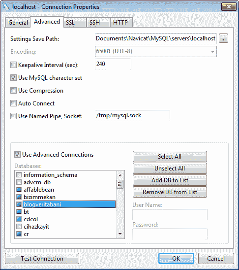

# 一、开始

本章旨在介绍具有**图形用户界面**（**GUI**）的 Navicat 数据库管理工具，并描述如何为已安装的 MySQL服务器设置不同类型的连接和基本设置，以实现高级配置，如 SSH。在本章中，您将了解以下内容：

*   不同版本的 Navicat，对什么和谁有好处
*   设置到 MySQL 服务器的基本连接
*   设置高级连接，如 SSH 或 HTTP 隧道

# 输入 Navicat

**Navicat**不仅是一款功能强大、复杂且易于使用的带有 GUI 的数据库管理工具，也是开发数据库驱动应用程序的开发人员非常有用的助手。它适用于 Windows、Mac 和 Linux。

用于**MySQL**的**Navicat****是 Navicat 家族中第一个具有高级功能的成员，允许您导入/导出数据、备份或将整个数据库传输到另一台服务器，并在 GUI 中设计具有点击和拖放功能的查询。**

**Navicat****Premium**是该家族的终极成员，是一款集多功能于一体的数据库管理和迁移工具，结合了所有 Navicat 版本，使用户能够在单个应用程序中同时连接 MySQL、SQL Server、SQLite、Oracle 和 PostgreSQL 数据库，使多品牌数据库的数据库管理大大简化。

虽然 MySQL 以外的数据库不在本书的范围内，但您可能希望从 Packt 中查看其他标题，例如 Oracle 数据库（[www.packtpub.com/books/Oracle-database](http://www.packtpub.com/books/oracle-database)和 Microsoft SQL Server（[www.packtpub.com/books/Microsoft-SQL-Server](http://www.packtpub.com/books/microsoft-sql-server)上的标题）。

Navicat 不是免费产品，但您可以从 PremiumSoft 网站轻松获得 30 天的评估，PremiumSoft 是一家创建该产品并将其推向市场的公司。

在本书中，示例将使用 Navicat Premium 10.0.9 版进行展示，尽管您可以按照每个示例进行操作，并使用 Navicat for MySQL 10.0.9 进行练习。即使您有一个版本的 Navicat，它的版本与 v.8.0 一样古老，您也应该能够跟上这本书的大部分示例。

要下载 Navicat，您可以访问[www.Navicat.com/download/download.html](http://www.navicat.com/download/download.html)并获取 Navicat for MySQL 或 Navicat Premium。撰写本文时，最新的版本是 10.0.9。

# 建立与数据库的连接

在这一点上，我假设您已经安装、设置并运行了 MySQL 服务器以及 Navicat，这样我们就可以马上用 Navicat 解决问题。

要在 Windows 7 及更早版本中启动 Navicat，请转到**开始菜单****所有程序****PremiumSoft**并单击您在电脑上安装的 Navicat 版本。

如果你使用的是 Mac 电脑，Navicat 应该放在你的`Applications`文件夹中，除非你把它从安装程序窗口拖放到别处。

要定义新连接，请转到**文件**菜单或**连接**按钮，这是 Navicat 主工具栏（或我们可能称之为功能区）中的第一个图标，然后选择**文件****新连接****MySQL**要打开名为**MySQL-新连接**的连接配置文件窗口，我们可以在其中指定要建立的连接的设置。

您可以参考以下屏幕截图：

正如您在屏幕截图的第二部分所看到的，**MySQL-新连接**窗口是您可以指定定义连接的设置的地方。它有五个标签；第一个是设置基本连接属性的地方，在大多数情况下，这就足够了，如下所示：

*   **连接名称**：完全由您决定，您可以输入任何名称来描述您的连接。
*   **主机名/IP 地址**：非常直观，可以输入数据库服务器的域名或 IP 地址。
*   **端口**：此字段包含 MySQL 服务器的 TCP/IP 端口号，大多数情况下为`3306`。
*   **用户名**：此字段包括数据库用户名（我在这里使用`root`，它是我新安装的本地服务器的默认管理员用户）。
*   **密码**：此字段包括上述输入用户名的密码。在新安装的 MySQL 中，`root`带有一个空白密码，因此，如果这是您第一次连接到刚安装的数据库服务器，您可能希望在此时将此密码保留为空白，因为我将在一章末尾指导您如何修改所有这些设置。

如果要连接到远程 MySQL 服务器，必须确保为要使用的用户名授予远程访问权限。在某些情况下，MySQL 服务提供商不提供对服务器的远程直接访问，通过**安全****外壳**（**SSH**）或 HTTP 隧道连接可能是另一种解决方案。我们将在下面的章节中分别了解如何设置这些类型的连接。

## 通过安全外壳（SSH）连接

SSH 是一种命令行工具，用于以安全的方式通过网络登录到服务器或另一台计算机，以便在远程计算机上运行命令或传输数据。为了提高安全性，SSH 通过使用密码或公钥/私钥对（也称为公钥）提供了强大的身份验证机制。

要通过 SSH 建立与 MySQL 服务器的连接，请首先输入上一节所述的基本连接设置，然后转到连接设置窗口中的**SSH**选项卡，单击标有**使用 SSH 隧道**的复选框，然后输入以下信息：

*   **主机名/IP 地址**：此字段包括 SSH 服务器的地址或 IP。
*   **端口**：此字段包含 SSH 服务器的端口号（默认为`22`。
*   **用户名**：此字段包括 SSH 服务器的用户，通常是 UNIX 机器，而不是数据库的用户名。
*   **认证方式**：此字段允许您选择**密码**认证和**公钥**认证，以适用者为准。
*   **密码**（如果适用）：此字段包括 SSH 用户的密码（不是数据库）。
*   **私钥**（如果适用）：如果选择**公钥**认证，则出现此字段，您需要通过点击小矩形按钮指定私钥文件的路径。
*   **密码短语**（如适用）：此字段在**公钥**认证的情况下也会显示，并与**私钥**一起使用。它基本上类似于密码，但它适用于您的密钥，而不是帐户。

## 通过 HTTP 隧道连接

在某些情况下，不可能通过 HTTP 以外的任何协议连接到服务器，尤其是当一方位于防火墙后面时。例如，一些公司希望限制其用户的互联网访问，使他们只能浏览网页，而不做其他事情；没有 FTP，没有即时消息等等。这就是 HTTP 隧道的用武之地。它允许您通过端口`80`（HTTP 默认值）而不是`3306`或任何其他端口连接到服务器（在本例中为 MySQL）。

要设置 HTTP 连接，请执行以下步骤：

1.  将 Navicat 安装程序附带的 HTTP 隧道脚本上载到 MySQL 服务器所在的 web 服务器。这是一个名为`ntunnel_mysql.php`的文件。
2.  进入 Navicat 的**MySQL-新连接**窗口中名为**HTTP**的页签。
3.  启用复选框**使用 HTTP 隧道**。
4.  输入上传隧道脚本的 URL（例如，[http://www.ozar.net/mysql/ntunnel_mysql.php](http://www.ozar.net/mysql/ntunnel_mysql.php) ）。
5.  如果您知道您上传脚本的 web 服务器安装了 ModSecurity，您可以使用 base64 选项检查**编码传出查询。**
6.  If the tunneling script is on a password protected server or your internet connection is over a proxy, you can provide the required authentication details under the **Authentication** or **Proxy** tab.

    ### 注

    请注意，HTTP 隧道选项卡和 SSH 隧道选项卡不能同时使用。你需要选择其中一个。

# 设置安全套接字层（SSL）

**安全****套接字****层**（**SSL**）是在服务器和客户端之间建立加密链接的安全协议，确保双方之间所有数据传输的隐私性和完整性。

要在 Navicat 中使用 SSL，您需要具有 SSL 证书；您可以从[www.OpenSSL.org](http://www.openssl.org)获得一个免费的解决方案，如 OpenSSL并安装在您的本地服务器上，为您的 MySQL 服务器配置 SSL 并为其设置服务器端证书。最后，您可以设置客户端证书，然后可以从 SSL 服务器获取该证书。Navicat 手册中解释了如何安装和设置 OpenSSL for MySQL 以及 Navicat 的证书的完整说明。

## 高级设置

Navicat 提供了一个设置高级数据库属性的选项，您可以通过点击**MySQL-新连接**窗口中的**高级**选项卡进行控制。

第一个标记为**设置保存路径**的字段允许您将设置保存在您指定的本地驱动器位置。您可以调整一些其他设置，例如覆盖字符编码、到数据库服务器的 ping 间隔、自动连接、使用套接字文件，即`mysql.sock`，等等。

这里最有用的功能是能够在 Navicat 主窗口的左窗格中隐藏和显示某些数据库，其中所有连接配置文件和属于它们的数据库都列在树视图中。选中**使用高级连接**复选框后，此功能立即激活。

名为**Databases**的列表框变为活动状态，列表中的每个项目旁边都有一个稍小的复选框。您高亮显示其复选框的数据库将是下次打开连接时显示的数据库。还可以为每个数据库单独指定用户名和密码。对于给定数据库，如果您有多个具有不同权限的帐户，这一点尤其有用。

您还可以使用右侧的按钮向列表中添加或删除项目。

### 测试并保存您的设置

现在我们已经完成了连接的配置，我们需要做的就是测试连接并点击**确定**。我们可以随时通过右击左窗格中列出的连接配置文件名称并选择**连接属性来修改这些设置。。。**返回我们的连接配置文件窗口。

# 总结

在本章中，我们已经为本书的其余部分奠定了基础，通过学习如何以各种方式从 Navicat 内部建立到 MySQL 服务器的连接，从使用简单的常规参数到安全配置，如 SSH 或 HTTP 隧道，以克服有限的 Internet 访问情况。

在下一章中，我们将开始使用数据库，我将逐步指导您使用 Navicat 复杂但易于使用和上瘾的工具处理数据库对象，如表、视图、函数、过程和设计查询。乐趣才刚刚开始。