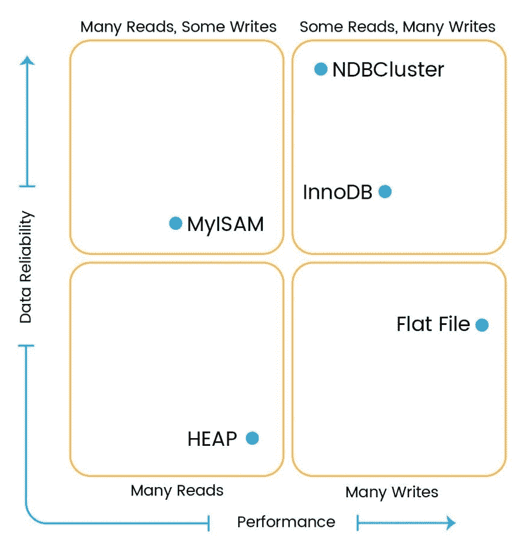

# MYSQL 8 简介

MySQL 是一个著名的开源结构化数据库，因为它的性能、易用性和可靠性。这是关系数据库最常见的 web 应用程序选择。在当前市场上，数千个基于 web 的应用程序依赖 MySQL，包括 Facebook、Twitter 和 Wikipedia 等大型行业。它还被证明是基于**软件即服务**（**SaaS**的应用程序的数据库选择，如 Twitter、YouTube、SugarCRM、Supply Dynamics、Workday、RightNow、Omniture、Zimbra 等。我们将在本章后面的*MySQL*用例部分详细讨论这一点。MySQL 是由一家瑞典公司 MySQL AB 开发的，现在它由 Oracle 公司分发和支持。MySQL 承载着宝贵的历史。

MySQL 不断改进，以成为企业级数据库管理系统。MySQL 8 有望成为游戏规则的改变者，因为今天我们正处于数字化时代。MySQL 8 都经过了调整，以服务于许多以前版本中难以实现的新用例。产生大量数据的一些用例包括社交网络、电子商务、银行/信用卡交易、电子邮件、存储在云上的数据等等。分析所有这些结构化、非结构化或半结构化的普遍数据有助于发现隐藏的模式、市场趋势、相关性和个人偏好。

"There is so much for each of us" 
                                                                                                       - James Truslow Adams

在概述 MySQL 之后，让我们深入了解 MySQL 8 的新特性、优点、用例以及 MySQL 8 的一些限制。这将是令人兴奋的，让我们做好准备。

# MySQL 概述

**结构化查询语言**（**SQL**）用于**关系数据库管理系统**（**RDBMS**中的数据操作、检索、插入、更新和删除。为了使它更简单，SQL 告诉数据库要做什么以及它需要什么。SQL 是所有 RDBMS 系统（如 MySQL、MS Access、MS SQL、Oracle、Postgres 等）都使用的标准语言。

RDBMS is the basis for SQL and for all modern database systems such as MS SQL Server, IBM DB2, Oracle, MySQL, and Microsoft Access.

SQL 允许用户从 MySQL 访问数据，并定义和操作数据。要嵌入到其他语言中，可以利用 SQL 模块、库和预编译器，它们可以帮助您创建/删除数据库和表，允许用户在数据库中创建视图、存储过程、函数等。它可以执行各种其他操作，例如允许用户设置对表、过程和视图的权限。

# MySQL 作为关系数据库管理系统

关系数据库中的数据以有组织的格式存储，因此可以轻松检索信息。数据将存储在由行和列组成的不同表中。但是，也可以在不同的表之间建立关系，这些表可以有效地存储大量数据并有效地检索所选数据。这为数据库操作提供了极大的速度和灵活性。

作为一个关系数据库，MySQL 能够通过提供主键、外键和索引与不同的表建立关系，例如一对多、多对一和一对一。它还可以在表之间执行联接，以检索精确的信息，例如内部联接和外部联接。

SQL 被用作与 MySQL 中的关系数据交互的接口。SQL 是一种**美国国家标准协会**（**ANSI**）标准语言，我们可以对创建、删除、更新和检索等数据进行操作。

# MySQL8 的许可证要求

许多行业更喜欢开源技术，因为该技术具有灵活性和成本节约的特点，而 MySQL 则通过成为 web 应用程序最流行的关系数据库而在市场上占有一席之地。开源意味着您可以查看 MySQL 的源代码，并根据您的需要进行定制，而无需支付任何费用。您可以从其站点下载源文件或二进制文件，并相应地使用它们。

MySQL 服务器包含在**通用公共许可证**（**GNU**中），这意味着我们可以自由地将其用于 web 应用程序，研究其源代码，并根据需要进行修改。它还具有企业版以及高级功能。许多企业仍然从 MySQL 购买支持合同，以便在各种问题上获得帮助。

# 可靠性和可扩展性

MySQL 具有很高的可靠性，可以很好地运行，而无需因瓶颈或其他速度减慢而进行大量故障排除。它还集成了许多性能增强机制，如索引支持、加载实用程序和内存缓存。MySQL 使用 InnoDB 作为存储引擎，提供高效的 ACID 兼容事务功能，确保高性能和可扩展性。为了处理快速增长的数据库，MySQL 复制和集群有助于扩展数据库。

# 平台兼容性

MySQL 具有很好的跨平台可用性，因此更受欢迎。它可以灵活地在诸如 RedHat、Fedora、Ubuntu、Debian、Solaris、Microsoft Windows 和 Apple macOS 等主要平台上运行。它还提供了应用程序编程接口 AUTYT1（PARTT2，Apple OutT3），用于与各种编程语言如 C、C++、C 语言、PHP、java、Ruby、Python 和 Perl 互连。

# 释放

以下是迄今为止 MySQL 的主要版本列表：

*   5.0 版 GA 于 2005 年 10 月 19 日发布
*   5.1 版 GA 于 2008 年 11 月 14 日发布
*   版本 5.5 GA 于 2010 年 12 月 3 日发布
*   版本 5.6 GA 于 2013 年 2 月 5 日发布
*   5.7 版 GA 于 2015 年 10 月 21 日发布

现在是发布主要版本 MySQL 8 的时候了。MySQL 8 于 2016 年 9 月 12 日发布，目前仍处于开发里程碑模式。

# MySQL 的核心功能

让我们回顾一下 MySQL 的一些核心特性。随着我们的进步，我们将在本书中详细讨论各种特征

# 结构化数据库

结构化数据库是许多企业使用了 40 多年的传统数据库。然而，在现代世界，数据量越来越大，一个共同的需求已经取代了它——数据分析。随着数字数据的数量和速度日益增长，结构化数据库的分析变得越来越困难；我们需要找到一种方法，以有效和高效的方式实现这些需求。在开源世界中用作结构化数据库的最常见的数据库是 MySQL。

许多组织使用结构化数据库，通过格式化存储库以有组织的方式存储数据。基本上，结构化数据库中的数据具有固定字段和预定义的数据长度，并定义要存储的数据类型，如数字、日期、时间、地址、货币等。简言之，在插入数据之前已经定义了结构，这就更清楚地了解了哪些数据可以驻留在其中。使用结构化数据库的关键优势在于数据易于存储、查询和分析。

非结构化数据库与此相反；它没有可识别的内部结构。它可以有大量无组织的团块或各种物体。结构化数据的来源主要是机器生成的，这意味着信息是从机器生成的，不需要人工干预，而非结构化数据是人工生成的数据。组织使用结构化数据库进行数据处理，如 ATM 交易、航空公司预订、库存系统等。同样，一些组织使用非结构化数据，如电子邮件、多媒体内容、字处理文档、网页、业务文档等。

# 数据库存储引擎和类型

现在让我们来看一下不同 MySQL 存储引擎的概述。这是一个重要的部分，简要介绍了不同的数据库存储引擎；我们将在[第 6 章](06.html)、*MySQL 8 存储引擎*中对此进行详细讨论。MySQL 将数据作为子目录存储在数据库中。在每个数据库中，数据都存储为表。当您创建一个表时，MySQL 将表定义以与表名*相同的名称存储在`.frm`中。*您可以使用`SHOW TABLE STATUS`命令显示您的表格信息：

```sql
mysql> SHOW TABLE STATUS LIKE 'admin_user' \G;
*************************** 1\. row ***************************
 Name: admin_user
 Engine: InnoDB
 Version: 10
 Row_format: Dynamic
 Rows: 2
 Avg_row_length: 8192
 Data_length: 16384
 Max_data_length: 0
 Index_length: 16384
 Data_free: 0
 Auto_increment: 3
 Create_time: 2017-06-19 14:46:49
 Update_time: 2017-06-19 15:15:08
 Check_time: NULL
 Collation: utf8_general_ci
 Checksum: NULL
 Create_options:
 Comment: Admin User Table
1 row in set (0.00 sec)
```

此命令显示这是一个列名称为`Engine`的`InnoDB`表。还有一些附加信息可供参考，以用于其他目的，如行数、索引长度等。

存储引擎是处理不同表类型的 SQL 操作的方法。每个存储引擎都有自己的优缺点。了解每个存储引擎的功能并为您的表选择最合适的存储引擎以最大限度地提高数据库的性能非常重要。`InnoDB`是我们在 MySQL 8 中创建新表时的默认存储引擎。

MySQL 服务器使用即插即用存储引擎架构。您可以通过`SHOW ENGINES`命令从 MySQL 服务器加载所需的存储引擎，卸载不必要的存储引擎，如下所示：

```sql
mysql> SHOW ENGINES \G;
*************************** 1\. row ***************************
 Engine: InnoDB
 Support: YES
 Comment: Supports transactions, row-level locking, and foreign keys
Transactions: YES
 XA: YES
 Savepoints: YES
*************************** 2\. row ***************************
 Engine: MRG_MYISAM
 Support: YES
 Comment: Collection of identical MyISAM tables
Transactions: NO
 XA: NO
 Savepoints: NO
*************************** 3\. row ***************************
 Engine: MEMORY
 Support: YES
 Comment: Hash based, stored in memory, useful for temporary tables
Transactions: NO
 XA: NO
 Savepoints: NO
*************************** 4\. row ***************************
 Engine: BLACKHOLE
 Support: YES
 Comment: /dev/null storage engine (anything you write to it disappears)
Transactions: NO
 XA: NO
 Savepoints: NO
*************************** 5\. row ***************************
 Engine: MyISAM
 Support: DEFAULT
 Comment: MyISAM storage engine
Transactions: NO
 XA: NO
 Savepoints: NO
*************************** 6\. row ***************************
 Engine: CSV
 Support: YES
 Comment: CSV storage engine
Transactions: NO
 XA: NO
 Savepoints: NO
*************************** 7\. row ***************************
 Engine: ARCHIVE
 Support: YES
 Comment: Archive storage engine
Transactions: NO
 XA: NO
 Savepoints: NO
*************************** 8\. row ***************************
 Engine: PERFORMANCE_SCHEMA
 Support: YES
 Comment: Performance Schema
Transactions: NO
 XA: NO
 Savepoints: NO
*************************** 9\. row ***************************
 Engine: FEDERATED
 Support: NO
 Comment: Federated MySQL storage engine
Transactions: NULL
 XA: NULL
 Savepoints: NULL
9 rows in set (0.00 sec)
```

# InnoDB 概述

`InnoDB`是在所有其他可用存储引擎中广泛使用的默认存储引擎。2008 年，它与 MySQL 5.1 一起作为插件发布。MySQL 5.5 及更高版本将`InnoDB`作为默认存储引擎。它已于 2005 年 10 月由甲骨文公司从芬兰的 Innobase Oy 公司接管。

InnoDB 表支持与 ACID 兼容的提交、回滚和崩溃恢复功能，以保护用户数据。它还支持行级锁定，这有助于提高并发性和性能。它将数据存储在聚集索引中，以减少基于主键的所有 SQL select 查询的 I/O 操作。它还支持`FOREIGN KEY`约束，允许数据库具有更好的数据完整性。InnoDB 表的最大大小可以扩展到 64 TB，这应该足以满足许多实际使用情况。

# MyISAM 概述

`MyISAM`是 5.5.1 之前 MySQL 的默认存储引擎。`MyISAM`存储引擎表不支持与`InnoDB`相反的 ACID 兼容。`MyISAM`表只支持表级锁定，因此`MyISAM`表不是事务安全的；但是，它们针对压缩和速度进行了优化。当您需要以最少的事务数据进行主要读取操作时，通常会使用它。`MyISAM`表的最大大小可以增加到 256 TB，这有助于数据分析等用例。`MyISAM`支持全文索引，有助于复杂的搜索操作。使用全文索引，我们可以索引存储在`BLOB`和`TEXT`数据类型中的数据。

# 内存概述

内存存储引擎通常称为堆存储引擎。它用于极其快速地访问数据。此存储引擎将数据存储在 RAM 中，因此不需要进行 I/O 操作。由于它将数据存储在 RAM 中，服务器重新启动时所有数据都会丢失。此表主要用于临时表或查找表。此引擎支持表级锁定，这限制了高写入并发性。

有关内存表的重要注意事项如下：

*   因为内存表在 RAM 中存储数据，RAM 的存储容量非常有限；如果您试图将太多数据写入内存表，它将开始将数据交换到磁盘中，然后您将失去内存存储引擎的好处
*   这些表不支持`TEXT`和`BLOB`数据类型，甚至不需要，因为它的存储容量有限
*   此存储引擎可用于缓存结果；例如，查找表或邮政编码和州名
*   内存表支持 B 树索引和哈希索引

# 档案概述

此存储引擎用于存储大量历史数据，无需任何索引。存档表没有任何存储限制。归档存储引擎针对高插入操作进行了优化，还支持行级锁定。这些表以压缩的小格式存储数据。存档引擎不支持`DELETE`或`UPDATE`操作；仅允许`INSERT`、`REPLACE`和`SELECT`操作。

# 黑洞作为存储引擎的概述

此存储引擎接受数据，但不存储数据。它在每次`INSERT`之后丢弃数据，而不是存储数据。

现在，这个存储引擎的用途是什么；为什么会有人用它？为什么我们要运行一个不向表中插入任何内容的`INSERT`查询？

此引擎对于使用大量服务器进行复制非常有用。一个`BLACKHOLE`存储引擎充当主服务器和从服务器之间的过滤服务器，不存储任何数据，只应用`replicate-do-*`和`replicate-ignore-*`规则并写入`binlogs`。这些`binlogs`用于在从属服务器中执行复制。我们将在[第 8 章](08.html)*MySQL 8*中的复制中详细讨论这一点。

# CSV 概述

**逗号分隔值**（**CSV**引擎使用逗号分隔值格式将数据存储在`.csv`文件类型中。该引擎从数据库中提取数据，并将其复制到数据库外的`.csv`。如果您从电子表格创建 CSV 文件并将其复制到 MYSQL 数据文件夹服务器，它可以使用 select 查询读取数据。同样，如果在表中写入数据，外部程序可以从 CSV 文件中读取数据。此存储引擎用于软件或应用程序之间的数据交换。CSV 表不支持索引和分区。CSV 存储引擎中的所有列都需要使用`NOT NULL`属性定义，以避免在创建表时出错。

# 合并概述

该存储引擎也称为`MRG_MyISAM`存储引擎。此存储引擎合并一个`MyISAM`表，并将其创建为引用到单个视图。对于合并表，所有列都按相同顺序列出。这些表适用于数据仓库环境。

该表通常用于管理与日志相关的表。您可以在单独的`MyISAM`表中创建不同月份的日志，并使用合并存储引擎合并这些表。

`MyISAM`表对操作系统有存储限制，但`MyISAM`（合并）表的集合没有存储限制。因此，使用合并表可以将数据拆分为多个`MyISAM`表，这有助于克服存储限制。

合并表不支持分区。此外，您不能将合并表或合并表的任何基础`MyISAM`表划分到不同的分区中。

# 联邦数据库概述

此存储引擎允许您在多个物理服务器上创建单个数据库。它打开到另一台服务器的客户端连接，并对那里的表执行查询，根据需要检索和发送行。它最初是作为一种支持许多企业级专有数据库服务器（如 Microsoft SQL Server 和 Oracle）的竞争性功能进行销售的，但至少可以说，这是一种延伸。虽然它似乎能够实现很多灵活性和巧妙的技巧，但事实证明它是许多问题的根源，并且在默认情况下被禁用。MySQL 中默认禁用此存储引擎；要启用它，需要使用联邦选项启动 MySQL 服务器二进制文件。

# NDB 集群概览

NDB 集群（也称为**NDB**是一个内存存储引擎，提供高可用性和数据持久性功能。

NDB 群集存储引擎可以配置一系列故障切换和负载平衡选项，但最容易从群集级别的存储引擎开始。NDB cluster 使用 NDB 存储引擎，该引擎包含一组完整的数据，该数据仅依赖于集群中可用的其他数据集。

NDB 集群的集群部分独立于 MySQL 服务器进行配置。在 NDB 集群中，集群的每个部分都被视为一个节点。

每个存储引擎都有其自身的优势和可用性，如下所示：

*   **搜索引擎**：NDBCluster
*   **交易****数据**：`InnoDB`
*   **会话数据**：`MyISAM`或 NDBCluster
*   **局部计算**：内存
*   **字典**：`MyISAM`

下图将帮助您了解需要使用哪个存储引擎来满足您的需求：



现在您对各种存储引擎以及不同的用例有了更好的了解，这将帮助您根据需要做出决策。

是时候继续我们的下一个主题了，在这里我们将看到 MySQL 8 中提供的令人愉快的新特性。

# MySQL 8 中的改进功能

MySQL 数据库开发团队最近宣布其主要版本为 MySQL 8**开发里程碑版本**（**DMR**。它包含了重要的更新和对急需的问题的修复。

你可能想知道为什么现在是 5.7 点 8 分！中间版本，即 6 和 7，是否遗漏了？当然不是！实际上，6.0 作为转换到更频繁、更及时的版本的一部分被保留下来，而 7.0 用于 MySQL 的集群版本。

让我们看看最新版本中引入的一些令人兴奋的功能，如下图所示：


现在是详细了解 MySQL 8 特性的时候了，这让我们对 MySQL 进行重大版本升级的原因感到兴奋和信服。

# 事务数据字典

在上一版本之前，MySQL 数据字典存储在不同的元数据文件和非事务表中，但从这个版本开始，它将有一个事务数据字典来存储有关数据库的信息。不再有`.frm`、`.trg`或`.par`文件。所有信息都将存储在数据库中，从而消除了执行繁重文件操作的成本。文件系统元数据存储存在许多问题，如文件系统的漏洞、过度的文件操作、难以处理崩溃恢复故障或复制；添加新的与功能相关的元数据也很困难。现在，此升级通过以集中方式存储信息使其变得简单，并将提高性能，因为此数据字典对象可以缓存在内存中，类似于其他数据库对象。

此数据字典将包含 SQL 查询执行所需的数据，如目录信息、字符集、排序规则、列类型、索引、数据库信息、表、存储过程、函数和触发器等。

# 角色

在 MySQL 8 中，特权模块通过引入角色得到了改进，这意味着权限的集合。现在，我们可以创建具有多种权限的角色，并将它们分配给多个用户。

以前版本的问题是，我们无法为一组用户定义通用权限，并且每个用户都有各自的权限。假设已有 1000 个用户具有公共权限，并且您希望删除这 1000 个用户的写入权限，那么在以前的版本中您会怎么做？您必须采取耗时的方法来更新每个用户，对吗？啊！这是一项很长很长的任务。

现在有了 MySQL 8，就可以轻松地更新权限的任何更改。角色将定义所有必需的权限，此角色将分配给这 1000 个用户。我们只需要对角色进行任何权限更改，所有用户将自动继承各自的权限。

可以从用户帐户创建、删除、授予或撤消权限、授予或撤消角色，并可以指定当前会话中的默认角色。

# InnoDB 自动增量

MySQL 8 更改了自动递增计数器值存储机制。以前，它存储在内存中，在服务器重新启动或服务器崩溃期间很难管理内存。但是，现在，每当值发生更改时，自动增量计数器值就会写入重做日志，并且在每个检查点，它都会保存在系统表中，这使得它在服务器重新启动期间保持不变。

对于以前的版本，自动增量值的更新可能会导致重复输入错误。假设如果您在序列中段更新了 AutoDebug 的值，其值大于当前最大值，但随后的插入操作无法识别未使用的值，这可能导致重复条目问题。通过保持自动增量值可以防止这种情况，因此后续的插入操作可以获得新值并正确分配它。

如果服务器重新启动，自动增量值将丢失，因为它存储在内存中，`InnoDB`需要执行查询以找出最大使用值。这一点已经改变，因为较新的版本能够在服务器重启期间保持其价值。在服务器重启期间，`InnoDB`使用数据字典表中存储的最大值初始化内存中的计数器值。如果服务器崩溃，`InnoDB`初始化大于数据字典表和重做日志的自动递增计数器值。

# 不可见索引

MySQL 8 为您提供了使索引不可见的功能。优化器不能使用这些类型的索引。如果您想在没有索引的情况下测试查询性能，可以使用此功能通过使它们不可见而不是删除并重新添加索引来实现。当索引应该被删除并在大型数据集上重新创建时，这是一个方便的特性。

默认情况下，所有索引都可见。为了使它们不可见或可见，分别使用了`INVISIBLE`和`VISIBLE`关键字，如下代码段所述：

```sql
ALTER TABLE table1 ALTER INDEX ix_table1_col1 INVISIBLE;
ALTER TABLE table1 ALTER INDEX ix_table1_col1 VISIBLE;
```

# 改进降序指标

5.7 版中也存在降序索引，但它们的扫描顺序相反，这造成了性能障碍。为了提高性能，MySQL 8 对此进行了优化，并按正向顺序扫描递减索引，这大大提高了性能。当最有效的扫描顺序对某些列具有升序，而对其他列具有降序时，它还会为优化器带来多个列索引。

# SET 持久化变量

服务器运行时，可以全局动态配置服务器变量。我们可以使用`SET GLOBAL`设置许多系统变量：

```sql
SET GLOBAL max_connections = 1000;
```

但是，这些设置将在服务器重新启动后丢失。为了避免这种情况，MySQL 8 引入了`SET PERSIST`变体，它在服务器重启时保留变量：

```sql
SET PERSIST max_connections = 1000; 
```

# 扩展的地理信息系统支持

在上一版本之前，它只支持一个坐标系，一个没有参照地球上某个位置的无单元二维位置。现在 MySQL 8 增加了对具有地理参考椭球体和 2D 投影的**空间参考系统**（**SRS**）的支持。SRS 帮助为一个位置分配坐标，并在这些坐标集之间建立关系。该空间数据可以作为`ST_SPATIAL_REFERENCE_SYSTEMS`表在数据字典存储中进行管理。

# 默认字符集

默认字符集已从`latin1`更改为`UTF8`。`UTF8`是最主要的字符集，尽管在之前的 MySQL 版本中它不是默认的字符集。除了字符集默认值外，排序规则已从`latin1_swedish_ci`更改为`utf8mb4_800_ci_ai`。随着这些变化被全球接受，字符集和排序规则现在基于`UTF8`；一个常见的原因是`UTF8`支持大约 21 种不同的语言，这使得系统提供多语言支持。

# 扩展位操作

在 MySQL 5.7 中，逐位操作和函数仅适用于`BIGINT`（64 位整数）数据类型。我们需要将`BIGINT`作为参数传递，它会将结果返回为`BIGINT`。简言之，它的最大范围可达 64 位以执行操作。用户需要对`BIGINT`数据类型进行转换，以防在其他数据类型上执行转换。这种类型转换对于大于 64 位的数据类型是不可行的，因为它会截断实际值，从而导致不准确。

MySQL 8 通过支持其他二进制数据类型，如`Binary`、`VarBinary`和`BLOB`，改进了逐位操作。这使得对大于 64 位的数据执行逐位操作成为可能。不再需要打字了！这允许获取参数并返回大于 64 位的结果。

# InnoDB Memcached

`InnoDB`memcached 插件现在可以执行多个 get 操作，这将真正有助于提高读取性能。现在，可以在单个 memcached 查询中获取多个键值对。频繁的通信流量也被最小化，因为我们可以在一次拍摄中获得多个数据。

`InnoDB`Memcached 插件也支持范围查询。它通过指定特定范围并检索该范围内的值来简化范围搜索。

# NOWAIT 和 SKIP 已锁定

当您试图访问的其他事务锁定了行时，您需要等待该事务释放同一行上的锁，以便可以相应地访问它。为了避免等待其他事务，`InnoDB`增加了对`NOWAIT`和`SKIP LOCKED`选项的支持。如果请求的行被锁定而不是进入等待模式，`NOWAIT`将立即返回错误，`SKIP LOCKED`将跳过锁定的行，并且从不等待获取行锁定。因此，ORT T5 将不考虑结果集中的锁定行：

```sql
SELECT * FROM table1 WHERE id = 5 FOR UPDATE NOWAIT;
SELECT * FROM table1 FOR UPDATE SKIP LOCKED;
```

# JSON

在 MySQL 5.7 中实现了 JSON 支持；这是公认的特征。在 MySQL 8 中，它添加了各种函数，允许我们以 JSON 数据格式获取数据集结果、虚拟列，以及 15 个 SQL 函数，允许您在服务器端搜索和使用 JSON 数据。在 MySQL8 中，添加了额外的聚合函数，可以在 JSON 对象/数组中使用，以进一步优化的方式表示加载的数据。以下是 MySQL8 中引入的两个 JSON 聚合函数：

*   `JSON_OBJECTAGG()`
*   `JSON_ARRAYAGG()`

# 云

在 MySQL 8 中引入了一个新选项`innodb_dedicated_server`，这将有助于服务器的垂直扩展。它实际上会自动检测分配给虚拟服务器的内存，并适当地设置 MySQL 8，而无需更改配置文件。考虑到虚拟化和云技术的采用，这些功能将非常方便。事实上，使用此配置，您甚至可能不需要获得服务器的 shell 访问权限来编辑配置文件。您可以通过新的`SET PERSIST`功能来实现这一点，该功能可以从 MySQL 命令行本身设置相关配置，这可以进一步增强安全性，因为您几乎不需要服务器的 shell 访问。

# 资源管理

MySQL 8 提供了一个出色的资源管理功能，允许您将资源分配给服务器上运行的线程，这些线程将根据为组配置的资源执行。目前，CPU 时间是可以为组配置的资源。有了它，您可以通过 MySQL 本身中的虚拟资源管理来调整工作负载。MySQL 将在启动时确定可用虚拟 CPU 的数量，然后具有适当权限的用户可以将虚拟 CPU 映射到资源组，并将线程管理与这些组对齐。

我们希望在 MySQL 8 可供一般使用时看到更多的特性。现在让我们看看使用 MySQL 8 的好处。

# 使用 MySQL 8 的好处

无论您是开发人员还是企业，与其他相关产品相比，您显然会选择能够提供良好效益和结果的产品。MySQL 作为这个竞争激烈的市场的首选，提供了许多优势。它有各种强大的功能，使它成为一个更全面的数据库。现在让我们来看一下使用 MySQL 的一些好处。

# 安全

首先想到的是保护数据，因为现在数据变得非常宝贵，如果不履行法律义务，可能会影响业务连续性；事实上，它可以是如此糟糕，它可以关闭您的业务在任何时候。MySQL 是 Facebook、Twitter 和 Wikipedia 等许多知名企业使用的最安全、最可靠的数据库管理系统。它确实提供了一个很好的安全层，保护敏感信息免受入侵者的攻击。MySQL 提供了访问控制管理，因此从用户处授予和撤销所需的访问是很容易的。还可以使用可为用户授予或撤销的权限列表来定义角色。所有用户密码都使用特定于插件的算法以加密格式存储。

# 可伸缩性

由于技术在许多方面的广泛应用，数据量与日俱增。正因为如此，平均负荷将超过屋顶。在某些情况下，数据不能超过某个限制或用户数量不会超出范围是不可预测的。可伸缩数据库将是一个更好的解决方案，这样，在任何时候，我们都可以满足意外的扩展需求。MySQL 是一个有价值的数据库系统，因为它的可扩展性，可以水平和垂直扩展；在数据方面，将数据库和应用程序查询负载分布到多个 MySQL 服务器是非常可行的。向 MySQL 集群添加马力来处理负载非常容易。

# 一个开源的关系数据库管理系统

MySQL 是一个开源的数据库管理系统，它使调试、升级和增强功能变得又快又容易。您可以查看源代码并进行相应的更改，然后以自己的方式使用它。您也可以发布 MySQL 的扩展版本，但您需要拥有该版本的许可证。

# 高性能

MySQL 以最佳速度提供高速事务处理。它可以缓存结果，从而提高读取性能。复制和集群使系统具有更高的并发性和管理繁重工作负载的可扩展性。数据库索引还可以提高`SELECT`查询语句对大量数据的性能。为了提高性能，MySQL 8 在性能模式中包含了索引，以加快数据检索

# 高可用性

今天，在竞争性营销的世界中，一个组织的关键点是建立和运行他们的系统。任何故障或停机直接影响业务和收入；因此，高可用性是一个不容忽视的因素。MySQL 非常可靠，并且使用集群和复制配置具有恒定的可用性。群集服务器可立即处理故障并管理故障转移部分，以使您的系统几乎始终可用。如果一台服务器停机，它会将用户的请求重定向到另一个节点，并执行请求的操作。

# 跨平台能力

MySQL 提供了跨平台的灵活性，可以在各种平台上运行，如 Windows、Linux、Solaris、OS2 等。它对所有主要语言都有很大的 API 支持，这使得它非常容易与 PHP、C++、Perl、Python、java 等语言集成。它也是全球用于 web 应用程序的**Linux Apache MySQL PHP**（**LAMP**服务器的一部分。

现在是时候把手弄脏了，看看 MySQL 8；让我们从在 Linux 平台上安装 MySQL 8 开始。我们更喜欢 Linux 操作系统上的 MySQL 8，因为这在许多组织中都是常见的用例。我们将在[第 2 章](02.html)*安装和升级 MySQL 8*中讨论更多安装。您可以在 MySQL 支持的其他平台上使用它，如 Windows、Solaris、HP-UNIX 等。Linux 提供了多种安装 MySQL 服务器的方法，如下所示：

*   `RPM`包装
*   `YUM`仓库
*   `APT`仓库
*   `SLES`仓库
*   `Debian`包装
*   `TAR`包装
*   从源代码编译和安装

# MySQL 8 的局限性

硬币有两面；类似地，同时使用 MySQL 8 的好处也有一些限制。现在让我们来看看 MySQL 8 的几个方面。

# 表或数据库的数量

数据库或表的数量不是 MySQL 8 的限制；但是，操作系统文件限制可能是 MySQL 8 的限制。存储引擎`InnoDB`允许扩展到 40 亿个表作为其峰值数量。

# 表大小

您可能会达到最大表大小限制，这不受 MySQL 8 的限制；然而，这可能是因为操作系统文件系统的限制。

# 加入

在单个联接中，可以使用 61 个表，这些表可以被引用。它也适用于视图定义中引用的表。作为子查询和视图一部分的联接也被认为是限制的一部分。

# Windows 平台

在 Windows 平台上使用 MySQL 8 时，有一些限制：

*   **内存**：32 位架构限制一个进程只能使用 2GB 的 RAM。
*   **端口**：如果您有大量并发，您可能会遇到 Windows 平台的限制，即总共有 4000 个端口可用于客户端连接。
*   **区分大小写**：Windows 平台不区分大小写，因此需要特意管理表和数据库以区分大小写。
*   **管道**：`|`，一般称为管道标志，在 Windows 中不完全支持。在执行数据库管理活动时，您可能会在一些场景中遇到它们。
*   **路径名分隔符**：MySQL 8 转义字符为`\`，是 Windows 的路径名分隔符。因此，在使用路径分隔符时，可以将双斜杠作为“\\”作为路径名分隔符的替代。

# 表列计数

MySQL 8 中每个表的表列限制为 4096 列。它可能会根据列计数限制的其他几个因素而有所不同，如下一节所述。

# 行大小

MySQL 表的行数限制为 65535 字节，尽管像`InnoDB`这样的存储引擎能够支持较大的块。

# InnoDB 存储引擎

`InnoDB`存储引擎的局限性我们将更具体地讨论，因为`InnoDB`现在使用 MySQL 8 将发挥重要作用。

# InnoDB 存储引擎的局限性

我们将快速浏览一下`InnoDB`存储引擎的一些限制：

*   一个表支持的索引数最多为 64
*   对于使用压缩或动态行格式的表；3072 是索引键前缀长度限制
*   对于使用紧凑或冗余行格式的表；767 是索引键前缀长度限制
*   表中的总列数（包括虚拟生成的列）最多限制为 1017
*   16 列是多列索引允许的最大值
*   组合的`InnoDB`日志文件大小不能超过 512 GB
*   `InnoDB`支持的最大表大小为 256 TB
*   使用 unix 套接字连接时不支持 AdminAPI
*   在`InnoDB`集群中格式化结果时，多字节字符可能会给您提供不可靠的对齐列

# 限制

现在我们将快速浏览一下`InnoDB`存储引擎的一些限制：

*   `Delete from tablename`：它实际上并没有删除整个表，而是一行一行地删除表中的每一行。
*   `Show table status`：不会一直为您提供准确的数据；它提供了估计数。
*   计数行时，`count(*)`提供的行数不准确，因为并发；它将只计算当前可用事务可见的那些计数。
*   如果执行了多个`analyze table`查询，则会阻止后面的一个查询，直到第一个查询完成。
*   `InnoDB`在与`auto_increment`列关联的末尾索引上保持独占锁。
*   在`auto_increment`整数超出该值的情况下；以下插入操作将向我们显示重复的密钥错误。
*   级联的外键无法激活触发器。
*   MySQL 保留了几个`InnoDB`用于内部目的的列名。以下是一些这样的列名：
    *   `DB_ROW_ID`
    *   `DB_TRX_ID`
    *   `DB_ROLL_PTR`
    *   `DB_MIX_ID`

在使用此类保留列名的情况下，我们可能会遇到以下示例中显示的输出：

```sql
 mysql> CREATE TABLE chintan (c1 INT, db_row_id INT) 
         ENGINE=INNODB;
        ERROR 1166 (42000): Incorrect column name 'db_row_id'
```

*   `InnoDB`锁在事务中止或提交后立即释放，该事务由事务持有。
*   不支持添加表锁，因为锁对`commit`和`unlock tables`是隐式的

# 数据字典

让我们看一下 data dictionary 的几个已知限制：

*   仅复制文件不支持用于备份和还原的单个`MyISAM`表。
*   MySQL 8 不支持为数据库手动创建目录。例如，使用`mkdir`对 MySQL 服务器数据字典没有影响。
*   `DDL`操作将花费比预期更多的时间，因为这些操作将写入存储、撤消日志和重做，而不是我们在 MySQL 早期版本中看到的`.frm`文件。

# MySQL8 中组复制的局限性

现在是讨论 MySQL 8 中组复制的一些限制的时候了：

*   **大型事务**：导致 GTID 内容的事务如果太大，则无法在组的其他成员之间复制。建议使用大约 5 秒钟内无法复制的较小数据块对组成员进行复制，以避免失败。
*   **组中的群集**：如果您尝试从现有的组复制设置创建群集，将导致错误，因为实例已经是复制组的一部分。目前只有在 MySQL 的向导模式下才会注意到这一点；该问题的另一种解决方案是禁用向导模式。
*   **可序列化隔离级别**：使用多主组时不支持可序列化隔离级别，默认配置。
*   **DDL 和 DML 操作**：当使用多主组模式时，不支持对同一数据对象但在不同服务器上同时执行 DDL 和 DML 操作。
*   **复制校验和**：目前 MySQL 的设计限制造成了复制事件校验和的限制。

# 分区的局限性

在本节中，我们将讨论分区的局限性。

# 构造禁止

以下是分区表达式中不允许的构造：

*   声明变量
*   用户变量
*   存储过程
*   存储函数
*   自定义项
*   插件

# 操作员

在分区表达式中有一些运算符是不允许的，例如`<<`、`>>`、`|`、`&`、`~`和`^`。诸如`+`、`-`和`*`等算术运算符的结果必须具有整数值或`NULL`。

# 桌子

以下是一些特定的领域，它们向我们展示了表分区的局限性：

*   MySQL 8 对一个表支持的最大分区数是 8192。此限制还考虑子分区。
*   分区表不支持全文索引和搜索。
*   不能对临时表进行分区。
*   无法对日志表进行分区。
*   分区`InnoDB`存储引擎不支持外键。
*   分区键的数据类型应该是整数列，也可以是整数的表达式。表达式或列值可以是`NULL`；但是，不支持包含`ENUM`的表达式。
*   升级已被`KEY`分区的分区表必须重新加载，这在`InnoDB`存储引擎之外是正确的。

到目前为止，我们已经讨论了 MySQL 的概述、特性、优点和一些限制。现在让我们浏览一下 MySQL 的精彩用例。

# MySQL 的用例

MySQL 有很多优势，因为它在全球的许多行业和各种用例中都有自己的立足点。MySQL 的重要性不仅仅取决于您拥有多少数据，更重要的是您将如何处理这些数据。数据可以从不可预测的来源获取和分析，并可用于解决许多问题。

现在让我们看看在 MySQL 的帮助下，在著名场景中具有现实重要性的用例：


上图帮助我们了解 MySQL 服务于各个行业的位置。虽然 MySQL 在商业决策中扮演着重要角色的行业并不多，但现在让我们来讨论几个行业。

# 社会化媒体

社交媒体内容是信息，诸如浏览、喜欢、人口统计、共享、关注、独特访客、评论和下载等活动也是信息。归根结底，重要的是你与社交媒体相关的努力如何为业务做出贡献。

一个显著的例子是 Facebook，MySQL 在那里被广泛使用。在 MySQL 之上，数 PB 的数据被用来提供喜欢、共享和评论。Facebook 在 MySQL`InnoDB`存储引擎的基础上开发了`RocksDB`存储引擎，它利用了 InnoDB 存储引擎的许多优势，因为 Facebook 希望主要关注存储优化。尽管目前 MySQL 仍主要用于其他常见应用程序。

# 政府

MySQL 时代也在政府中扮演着重要角色；政府机构一直在广泛使用 MySQL，因为它带来了丰厚的投资回报和促进开源。事实上，政府部门正在全球范围内实施大量 MySQL 的实现。

这可能会让你感到惊讶；美国海军使用 MySQL 进行关键的飞行计划活动。有各种各样的活动，例如天气状况、飞行计划、燃油效率、航班维护等，都在 MySQL 数据库的帮助下进行跟踪。毫无疑问，它需要全天候全冗余运行；MySQL 能够在全球范围内为美国海军飞机提供服务。

# 媒体和娱乐

YouTube 也是 MySQL 的主要用户之一。只要你在 YouTube 上观看视频，它就会使用 MySQL 从关系数据库或 blob 存储中获取数据。YouTube 也使用 Vitess；一个由 YouTube 发布到前端 MySQL 的项目。Vitess 有助于进行大量优化，并充当代理，使用 MySQL 为每个数据库请求提供服务。MySQL 副本在 YouTube 的实现中大量使用；利用 MySQL 缓存是 YouTube 的另一个重要因素。

# 欺诈检测

当涉及到安全性、欺诈检测或法规遵从性时，如果您的解决方案能够帮助您在问题发生之前识别和预防问题，那么它将成为业务的最佳选择。大多数情况下，欺诈检测发生在欺诈发生后很长一段时间内，此时您可能已经遭受了损失。接下来的步骤显然是将欺诈的影响降到最低，并改进有助于防止欺诈再次发生的领域。

许多参与任何类型交易处理或索赔的公司广泛使用欺诈检测技术。MySQL 帮助实时分析交易、索赔等，以及趋势或异常行为，以防止欺诈活动。

PayPal 就是这样一个使用 MySQL 构建欺诈检测系统的用例。贝宝拥有超过 1 亿的活跃用户，分布在美国、日本和欧洲的数据中心。这种用例的高可用性和性能是一个关键标准，MySQL 能够如期交付。

# 业务映射

Netflix 拥有数百万用户；它使用 MySQL 来运行其计费系统。MySQL 上 Netflix 的核心计费系统是任何业务的重要支柱。自二十年前成立以来，Netflix 已经有数十亿行数据同时更新，并包含大量数据。法规遵从性是关键因素之一，同时也是以最少的停机时间从 Oracle 迁移过来的关键因素之一；这两个目标都是通过 MySQL 实现的，每隔一天都会有巨大的扩展。

# 电子商务

优步是 MySQL 的其他知名客户之一。优步在全球范围内发展迅猛，可扩展性、高可用性和投资回报率是需要制定的几个重要标准。Uber 使用 MySQL 作为其已知私家车运输服务的主要数据库。Uber 大量使用无模式数据库架构作为其后端，作为 MySQL 上的一个层。

有许多真实世界的 MySQL 用例已经改变了人类、技术、预测、健康、科学和研究、法律和秩序、体育、电子商务、电力和能源、金融交易、机器人等。MySQL 是我们日常生活中不可或缺的一部分，这并不总是显而易见的，但的确，它在我们做的事情中在很多方面都扮演着重要的角色。

# 总结

在本章中，我们首先概述了 MySQL 以及 MySQL 数据库的主要功能，并探讨了 MySQL 8 中新增的功能。在此之后，我们深入研究了 MySQL 8 令人兴奋的新特性，以及在业务应用程序中使用 MySQL 的好处。我们了解 MySQL 8 当前的限制和限制，这对我们执行实现非常重要。最后，我们浏览了一些真实世界中令人印象深刻的用例，它们在我们的日常工作中扮演着重要角色，它们都使用 MySQL 作为数据库。

在下一章中，我们将学习在不同平台上安装 MySQL 8 的详细步骤。本章还介绍了从 MySQL 8 升级或降级的方法，我们将详细讨论这些方法。