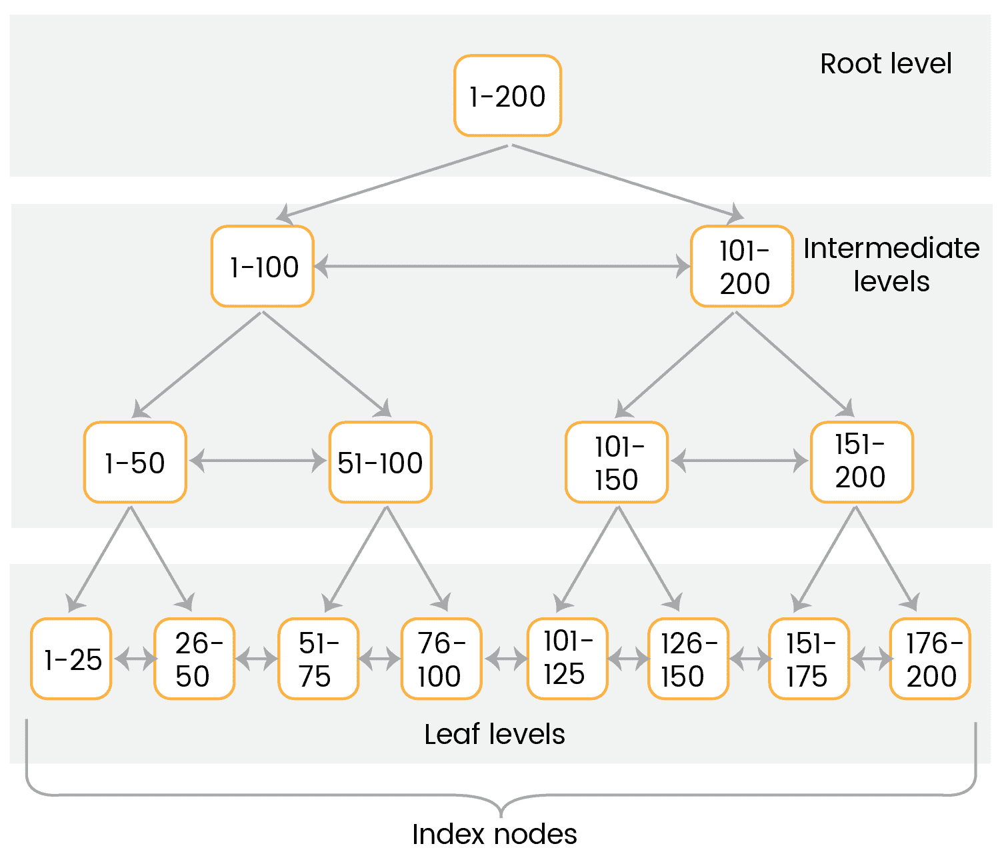
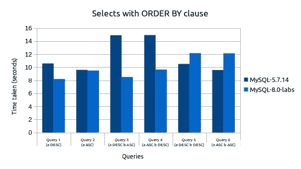

# MySQL 8 中的索引

在上一章中，我们学习了存储引擎。现在，我们知道有哪些类型的存储引擎可用，以及根据我们的需求使用哪些存储引擎。上一章还详细介绍了`InnoDB`存储引擎以及其他存储引擎信息。它还通过一个实际的例子描述了如何定义一个定制的存储引擎。现在是时候了解 MySQL 8 的另一个重要功能了，那就是索引。我们将介绍不同类型的索引及其功能，这将鼓励您使用索引，并为您提供如何使用索引的指导。因此，您的索引之旅已经开始！走吧。

本章将介绍以下主题：

*   索引综述
*   列级索引
*   B 树索引
*   散列索引
*   索引扩展
*   对索引使用优化器
*   不可见和递减索引

# 索引综述

在表上定义索引是提高`SELECT`操作性能的最佳方法。索引就像表行的指针，允许查询根据`WHERE`条件快速指向匹配行。MySQL 8 允许您在所有数据类型上创建索引。虽然索引在查询中提供了良好的性能，但建议以正确的方式定义索引，因为不必要的索引会浪费空间和时间（MySQL 8 需要找到最适合使用的索引）。除此之外，索引还增加了`INSERT`、`UPDATE`和`DELETE`操作的成本，因为在这些操作期间，MySQL 8 将更新每个索引。

如前所述，索引是一种提高操作速度的数据结构。根据结构，索引分为两种主要形式：聚集索引和非聚集索引：

*   **聚集索引**：聚集索引定义数据在表中物理存储的顺序。因此，每个表只允许一个聚集索引。当以顺序方式检索数据时，无论是以相同的顺序还是以相反的顺序，它都会大大提高检索速度。当选择一系列项目时，聚集索引还提供了更好的性能。主键定义为聚集索引。
*   **非聚集索引**：非聚集索引不定义数据的物理存储顺序。这意味着非聚集索引存储在一个位置，数据存储在另一个位置。因此，每个表允许有多个非聚集索引。它指的是非主键。

正如我们所知，主键表示一列或一组列，最广泛地用于从表中获取记录。主键有一个与其关联的索引，用于快速查询性能。它提供了相对更快的性能，因为主键不允许`NULL`值，所以不需要检查`NULL`值。如果表中没有一列或一组列定义为主键，建议您定义一个自动递增字段作为主键，以提高性能。另一方面，如果您的表包含许多列，并且需要使用多个列的组合执行查询，则建议将使用频率较低的数据传输到单独的表中。将所有单独的表与主键和外键引用关联，这将帮助您管理数据，查询检索为您提供了良好的性能。

# MySQL 8 中索引的使用

索引主要用于查找特定值的行，而无需迭代整个表。如果没有定义索引，那么 MySQL 8 将从第一行开始搜索，然后读取整个表，这将导致代价高昂的操作。MySQL 8 使用索引进行以下操作：

*   在索引的最左侧前缀上进行排序或分组时，对表进行排序或分组。这意味着，如果为`DESC`子句定义了所有键，则按相反顺序考虑键，如果所有键后面都跟有`ASC`，则按向前顺序考虑键。
*   查找其值与`WHERE`子句匹配的行。
*   对于多个列索引，可以使用索引最左边的任何前缀来查找行。本章后面部分将通过一个详细的示例介绍此主题。
*   如果 MySQL 必须从多个选项中选择一个索引，那么它将选择具有最小行集的索引。
*   有时，查询会进行优化，以便在不引用行的情况下获取值。例如，如果查询只使用索引中包含的列，MySQL 8 将从索引树中获取所选值：

```sql
 SELECT key_part3 FROM table_name WHERE key_part1=10;
```

*   在执行连接时，如果列的类型和大小相同，MySQL 8 将以更有效的方式使用索引。例如，`VARCHAR (15)`和`CHAR(15)`将被视为相同，但`VARCHAR(10)`和`CHAR(15)`将不被视为相同。
*   在`MIN ()`和`MAX ()`函数的情况下，如果您使用了部分索引列，那么优化器将检查索引列的所有其他部分是否在`WHERE`条件下可用。如果提到它们，那么 MySQL 8 将对`MIN ()`和`MAX ()`函数执行单个查找，并用常量替换它们。例如：

```sql
 SELECT MIN(key_part2), MAX(key_part2) FROM tble_name WHERE 
          key_part1=10;
```

# 与索引相关的 SQL 命令

MySQL 8 提供了两个与索引相关的主要命令。我们将在以下部分中讨论这些命令。

# 创建索引命令

以下命令使用户能够将索引添加到现有表中。此命令还与`CREATE TABLE`和`ALTER TABLE`一起用于创建索引：

```sql
CREATE [UNIQUE|FULLTEXT|SPATIAL] INDEX index_name
 [index_type]
 ON tbl_name (index_col_name,...)
 [index_option]
 [algorithm_option | lock_option] ...
index_col_name:
 col_name [(length)] [ASC | DESC]
index_option:
 KEY_BLOCK_SIZE [=] value
 | index_type
 | WITH PARSER parser_name
 | COMMENT 'string'
 | {VISIBLE | INVISIBLE}
index_type:
 USING {BTREE | HASH}
algorithm_option:
 ALGORITHM [=] {DEFAULT|INPLACE|COPY}
lock_option:
 LOCK [=] {DEFAULT|NONE|SHARED|EXCLUSIVE}
```

使用 StryT0}语法，用户能够指定索引前缀长度，它只考虑字符串值中指定的字符数。在定义时，前缀考虑以下几点：

*   前缀对于`CHAR`、`VARCHAR`、`BINARY`和`VARBINARY`列索引是可选的
*   对于`BLOB `和`TEXT `列索引，必须指定前缀
*   MySQL 8 将前缀视为非二进制字符串类型的若干字符（Apple T0T，{ To.T1，，To.T2）和二进制类型的字节数（Po.T3，{）
*   空间列不允许使用前缀

本章后面的*列索引*部分中描述了前缀选项的详细示例。`UNIQUE`索引是一个约束，表示索引中的所有值都是唯一的。如果您试图添加已经存在的值，那么 MySQL 8 将显示一个错误。具有`UNIQUE`索引的所有类型的存储引擎都允许多个空值。如果使用`NULL`值时使用前缀，请确保列值在前缀中是唯一的。如果索引前缀超过其大小，MySQL 8 将按如下方式处理索引：

*   **对于非唯一索引**：如果启用了严格 SQL 模式，则 MySQL 8 会抛出错误；如果禁用严格模式，则索引长度会减少到最大列数据类型大小，并会产生警告。
*   **对于唯一索引**：在这种情况下，MySQL 8 不管 SQL 模式如何都会产生错误，因为它可能会破坏列的唯一性。这意味着您定义了一个长度为 25 的列，并尝试在前缀长度为 27 的同一列上定义索引；然后 MySQL 8 抛出一个错误。

# 空间索引特征

MySQL 8 遵循以下空间索引特征规则：

*   仅适用于`InnoDB`和`MyISAM`存储发动机；如果您试图将其用于其他存储引擎，那么 MySQL 8 将给出一个错误。
*   索引列不允许使用`NULL`值。
*   此列不允许使用前缀属性。索引将考虑全宽。

# 非空间索引特征

MySQL 8 对于非空间索引特性遵循以下规则：

*   在`InnoDB`、`MyISAM`和`MEMORY`存储引擎的情况下，索引列允许有`NULL`值。
*   如果列前缀存在于非空间索引下，则必须在每个空间列的情况下指定列前缀长度。前缀长度将以字节为单位考虑。
*   除`ARCHIVE`外，所有支持空间列的存储引擎都支持。
*   此索引允许使用`NULL`值，除非定义为`PRIMARY`键。
*   对于`InnoDB`表，如果启用了`innodb_stats_persistent`设置，则在该表上创建索引后运行`ANALYZE TABLE`语句。
*   索引类型将取决于存储引擎；目前，使用的是 B-树。
*   只有在使用`InnoDB`和`MyISAM`表定义的`BLOB`或`TEXT`列上才允许使用非空间索引。

`index_col_name`属性的默认值为升序，具有该属性的`HASH`索引不允许使用`ASC`或`DESC`值。MySQL 8 为`index_option`提供以下任意值：

*   `KEY_BLOCK_SIZE [=]`值：此参数定义索引键块的大小，以字节为单位。它是一个可选参数，其值被视为提示。如果需要，MySQL 8 可以使用不同的大小。如果该参数是在单个索引级别定义的，那么它将覆盖表级别的`KEY_BLOCK_SIZE`值。`InnoDB`发动机在索引级别不支持此参数；它只允许在表级别执行。

*   `index_type`：MySQL 8 允许用户在创建索引时定义索引类型。例如：

```sql
 create table employee (id int(11) not null,name varchar(50));
 CREATE INDEX emp_name_index ON employee (name) USING BTREE;
```

请参阅下表以查找与存储引擎相关的允许索引类型。在定义多个类型的情况下，将第一索引类型视为默认类型。如果此表中未提及任何存储引擎，则表示该引擎不支持索引类型：

| **存储引擎** | **允许指标类型** |
| --- | --- |
| `InnoDB` | `BTREE` |
| `MyISAM` | `BTREE` |
| `MEMORY`/`HEAP` | `HASH`、`BTREE` |
| `NDB` | `HASH`、`BTREE` |

Reference: [https://dev.mysql.com/doc/refman/8.0/en/create-index.html](https://dev.mysql.com/doc/refman/8.0/en/create-index.html)

如果尝试定义存储引擎不支持的索引类型，那么 MySQL 8 将将其视为支持的索引类型，而不影响查询结果。请参阅下表，了解有关基于存储类型的索引特性的更多信息：

| **存储引擎** | **指标类型** | **指标等级** | **存储空值** | **允许多个空值** | **为空扫描类型** | **不是空扫描类型** |
| `InnoDB` | `BTREE` | 主键 | 不 | 不 | 不适用 | 不适用 |
| 唯一的 | 对 | 对 | 指数 | 指数 |
| 钥匙 | 对 | 对 | 指数 | 指数 |
| 不适用 | `FULLTEXT` | 对 | 对 | 桌子 | 桌子 |
| 不适用 | 空间的 | 不 | 不 | 不适用 | 不适用 |
| `MyISAM` | `BTREE` | 主键 | 不 | 不 | 不适用 | 不适用 |
| 唯一的 | 对 | 对 | 指数 | 指数 |
| 钥匙 | 对 | 对 | 指数 | 指数 |
| 不适用 | `FULLTEXT` | 对 | 对 | 桌子 | 桌子 |
| 不适用 | 空间的 | 不 | 不 | 不适用 | 不适用 |
| `MEMORY` | `HASH` | 主键 | 不 | 不 | 不适用 | 不适用 |
| 唯一的 | 对 | 对 | 指数 | 指数 |
| 钥匙 | 对 | 对 | 指数 | 指数 |
| `BTREE` | 主要的，重要的 | 不 | 不 | 不适用 | 不适用 |
| 唯一的 | 对 | 对 | 指数 | 指数 |
| 钥匙 | 对 | 对 | 指数 | 指数 |

Reference: [https://dev.mysql.com/doc/refman/8.0/en/create-index.html](https://dev.mysql.com/doc/refman/8.0/en/create-index.html)

*   `WITH PARSER parser_name`：此选项仅对`InnoDB`和`MyISAM`存储引擎支持的`FULLTEXT`索引有效。如果`FULLTEXT`索引和搜索操作需要特殊处理，那么 MySQL 8 将使用带有索引的解析器插件
*   `COMMENT 'string'`：此属性为可选属性，允许最多 1024 个字符的注释。此选项还支持默认值为 50 的`MERGE_THRESHOLD`参数。请考虑下面的命令来定义{ Ty2 T2}：

```sql
 CREATE INDEX name_index ON employee(name) COMMENT 
          'MERGE_THRESHOLD=40'; 
```

如果索引的页面完整百分比小于`MERGE_THRESHOLD`值，则`InnoDB`存储引擎将索引页面与相邻的索引页面合并

*   `VISIBLE`、`INVISIBLE`：此参数定义指标可见性。默认情况下，所有索引都是可见的。在优化过程中，优化器不会使用不可见的索引

当您尝试使用该表进行读写操作，同时修改其索引时，`ALGORITHM`**和`LOCK`属性将产生影响。**

 **# 删除索引命令

下面的命令从表中删除索引。我们也可以将此语句映射为`ALTER TABLE`以从表中删除索引：

```sql
DROP INDEX index_name ON tbl_name
 [algorithm_option | lock_option]...
algorithm_option:
 ALGORITHM [=] {DEFAULT|INPLACE|COPY}
lock_option:
 LOCK [=] {DEFAULT|NONE|SHARED|EXCLUSIVE}
```

在该命令中，只有两个选项可用：算法和锁。这两个选项在并发访问索引和工作时都很有用，类似于`CREATE INDEX`命令。例如，要删除雇员表的索引，请执行以下命令：

```sql
DROP INDEX name_index ON employee;
```

# 空间索引的创建与优化

MySQL 8 允许您使用前面主题中提到的相同语法在`InnoDB`和`MyISAM`存储引擎上创建空间索引。标准命令中唯一的变化是在创建索引时使用关键字**spatial**。定义空间索引时，请确保将该列声明为`NOT NULL`。以下代码演示了在表上创建空间索引的方法：

```sql
CREATE TABLE geom_data (data GEOMETRY NOT NULL, SPATIAL INDEX(data));
```

默认情况下，空间索引创建 R 树索引。从 MySQL 8.0.3 开始，优化器检查索引列的**空间参考标识符**（**SRID**属性，找到**空间参考系**（**SRS**进行比较，并根据 SRS 进行计算。为了进行比较，空间索引中的每一列都必须受 SRID 限制。这意味着每个列定义必须包含一个 SRID 属性，并且所有列值必须具有相同的 SRID。空间索引基于 SRID 执行以下两个操作：

*   如果列被限制为一个**笛卡尔 SRID**，那么它将启用笛卡尔边界框计算
*   如果该列限制为**地理 SRID**，则启用地理边界框计算

如上所述，MySQL 8 将忽略一个没有 SRID 属性的列上的`SPATIAL INDEX`，但 MySQL 仍然按照如下方式管理这些索引：

*   当使用`INSERT`、`UPDATE`或`DELETE`命令修改表时，这些类型的索引会更新。
*   这些索引将在转储备份中考虑，并使用向后兼容性进行恢复。如前一点所述，优化器不使用没有 SRID 限制列的空间索引，因此在这种情况下，必须修改所有这些列。要修改它们，请执行以下步骤：
    1.  使用以下命令检查`ST_SRID`相同的列的所有值：

        ```sql
        SELECT DISTINCT ST_SRID(column_name) FROM table_name;
        ```

        如果查询返回多行，则表示该列包含混合 SRID。如果是，请为相同的 SRID 值更改列的内容。
    2.  为列定义显式 SRID。
    3.  重新创建`SPATIAL INDEX`。

# InnoDB 和 MyISAM 索引统计信息集合

MySQL 8 将考虑基于值组的表统计，它只不过是一组具有相同前缀值的行。存储引擎收集与表相关的统计信息，优化器使用这些信息。从优化的角度来看，组大小的平均值是一个重要的统计数据。如果组大小的平均值增加，则该指数没有意义。因此，最好为每个索引指定少量行。这可以通过表基数来实现，表基数只不过是一组值。对于`InnoDB`和`MyISAM`表，MySQL 8 通过`myisam_stats_method`和`innodb_stats_method`系统变量提供对统计数据的控制。以下是这些变量的可能值：

*   `nulls_ignored`：表示忽略`NULL`值
*   `nulls_equal`：表示所有`NULL`值相同
*   `nulls_unequal`：表示所有`NULL`值不一致

`innodb_stats_method`系统变量具有全局值，`myisam_stats_method`系统变量具有全局值和会话值。当我们设置变量的全局值时，它将影响从相应存储引擎收集表的统计信息。在会话值统计的情况下，集合仅对当前客户端连接可用。这意味着您必须在不影响其他客户端的情况下为同一表上的其他客户端重新生成表的统计信息，并且需要在会话值中设置它。要重新生成`MyISAM`统计信息，请使用以下任一方法：

*   执行`myisamchk --stats_method=method_name --analyze`命令
*   对表进行更改，使其统计信息过期，然后设置`myisam_stats_method`并发出`ANALYZE TABLE`语句

在使用这两个变量之前，必须考虑以下几点：

*   这些变量仅适用于`InnoDB`和`MyISAM`表。对于其他存储引擎，只有一种方法可用于收集表统计信息，它与`nulls_equal`方法非常接近。
*   MySQL 8 提供了一种显式生成表统计信息的方法，但情况并非总是如此。有时，如果需要，MySQL 8 也可以自动生成统计信息。例如，在任何操作的情况下，如果一些 SQL 语句修改了表数据，那么 MySQL 8 将自动收集统计数据。考虑大容量插入或删除操作。
*   我们不能说使用了哪种方法来生成表的统计信息。

# 列级索引

MySQL 8 允许您在单列和多列上创建索引。每个表的最大索引数和最大索引长度取决于存储引擎。大多数情况下，所有存储引擎都允许每个表至少有 16 个索引，总索引长度至少为 256 字节，但大多数存储引擎允许更高的限制。

# 列索引

这是定义仅涉及单个列的索引的最常用方法。MySQL 8 在数据结构中存储列值的副本，以便快速访问行。MySQL 8 使用**B-Tree**数据结构来快速访问值。B-树的执行将基于`=`、`<`、`>`、`BETWEEN`、`IN`等在`where`条件中定义的运算符。您可以在下一个主题中获得关于 B 树数据结构及其执行的详细信息。我们将在接下来的章节中讨论列索引的特性。

# 索引前缀

此选项允许用户在字符串的情况下指定用于索引的字符数。MySQL 8 在索引创建中提供了选项`column_name(N)`，用于指定一些字符。索引只首选指定的字符，这将使索引文件更小。因此，在`BLOB`和`TEXT`列时，必须指定前缀长度以获得更好的性能。考虑下面的示例，在 AutoT3E.Type 上创建具有前缀长度的索引：

```sql
CREATE TABLE person (personal_data TEXT, INDEX(personal_data (8)));
```

此命令通过考虑前八个字符在`personal_data`列上创建索引。前缀长度因存储引擎而异。`InnoDB`存储引擎允许`REDUNDANT`或`COMPACT`行格式的前缀长度最多为 767 字节，而在`DYNAMIC`或`COMPRESSED`行格式的情况下，它最多允许 3072 字节。对于`MyISAM`存储引擎，前缀最多可定义 1000 字节。

Prefix length will be measured in bytes for binary string types, such as `BINARY`, `VARBINARY`, and `BLOB`, while in the case of non-binary string types, it will be considered as a number of characters.

# 全文索引

顾名思义，`FULLTEXT`索引只允许`CHAR`、`VARCHAR`和`TEXT`列。该索引由`InnoDB`和`MyISAM`存储引擎支持。在这种类型中，索引将在整个列上进行，而不是在前缀长度上进行。MySQL 8 在查询执行的优化阶段评估全文表达式。在进行评估之前，优化会在制定执行计划的过程中评估全文表达式。因此，全文的`EXPLAIN`查询比非全文查询慢。全文查询在以下情况下很有用：

*   当`FULLTEXT`查询返回文档 ID 或文档 ID 和搜索排名时
*   当`FULLTEXT`查询按降序对匹配的行进行排序，并使用`LIMIT`子句获取*N*行数时，只应用一个降序的`ORDER BY`子句，不要在其中使用`WHERE`子句进行优化
*   当`FULLTEXT`查询从没有任何附加`WHERE`子句的行中获取`COUNT(*)`值时，将`WHERE`子句应用为`WHERE MATCH(text)``AGAINST ('other_text')`，不使用任何`>`0 比较运算符

# 空间索引

MySQL 8 允许您创建空间数据类型的索引。`InnoDB`和`MyISAM`存储引擎支持空间数据的 R 树，而其他存储引擎使用 B 树。从 MySQL 5.7 开始，`MyISAM`和`InnoDB`数据库引擎支持空间索引。

# 内存存储引擎中的索引

内存存储引擎支持`HASH`索引和 B 树索引，但`HASH`索引默认为`MEMORY`存储引擎设置。

# 多列索引

MySQL 8 允许您在单个索引创建中使用多个列，也称为**复合索引**。它允许复合索引中最多有 16 列。在使用复合索引时，请确保遵循索引创建过程中提到的相同列顺序。多列索引包含通过连接索引列的值而生成的值。请考虑下面的示例以了解多个列索引：

```sql
CREATE TABLE Employee (
id INT NOT NULL,
lastname varchar(50) not null,
firstname varchar(50) not null,
PRIMARY KEY (id),
INDEX name (lastname, firstname)
);
```

如上所述，我们使用两列`lastname`和`firstname`定义了复合索引。以下查询使用名称索引：

```sql
SELECT * FROM Employee WHERE lastname='Shah';
SELECT * FROM Employee WHERE lastname ='Shah' AND firstname ='Mona';
SELECT * FROM Employee WHERE lastname ='Shah' AND (firstname ='Michael' OR firstname ='Mona');
SELECT * FROM Employee WHERE lastname ='Shah' AND firstname >='M' AND firstname < 'N';
```

在前面的所有查询中，我们都可以看到，列的顺序是在`WHERE`条件下维护的，类似于索引声明的顺序。当我们在`WHERE`子句中只定义`lastname`列时，索引也可以工作，因为它是索引中定义的最左边的列。现在，有一些查询无法使用复合索引：

```sql
SELECT * FROM Employee WHERE firstname='Mona';
SELECT * FROM Employee WHERE lastname='Shah' OR firstname='Mona';
```

请记住，对于多列索引，优化器可以使用索引最左边的任何前缀来搜索行。例如，如果索引是按顺序在三列上定义的，`column1`、`column2`和`column3`，那么您可以通过在`WHERE`子句中定义它，在（`column1`、`column2`、`column3`、（`column1`、（`column1`、`column2`上使用索引功能。

# B-树索引

B 树索引的主要目的是减少物理读取操作的数量。B 树索引是通过对搜索键上的数据进行排序并维护分层搜索数据结构来创建的，这有助于搜索正确的数据条目页面。`InnoDB`和`MyISAM`存储引擎默认使用 B 树索引。B-树设法保持从所有叶节点到根节点的相等距离。此索引加快了数据访问速度，因为无需扫描整个数据即可获得所需的输出。相反，它从根节点开始。根节点持有子节点的指针，存储引擎跟随这些指针查找下一条路径。它通过考虑节点页面中的值来找到正确的路径。节点页面定义子节点中值的上限和下限。在搜索过程结束时，存储引擎要么成功到达一个叶页，要么断定没有与搜索相关的值。请记住，叶页面指向索引数据，而不是其他页面。现在，让我们参考一个图来更详细地了解 B 树索引：



如前所述，当对索引列执行查询时，MySQL 8 查询引擎从根节点开始，并通过中间节点到达叶节点。让我们举一个例子，您希望在索引列中找到值 89。在这种情况下，查询引擎引用根节点以获取中间页引用。因此，它将指向**1-100**。然后确定下一个中间级别，并指向值**51-100**。然后查询引擎进入第三页，即下一个中间层**76-100**。从那里，它将找到值 89 的叶节点。叶节点包含整行或指向该行的指针，具体取决于索引是聚集的还是非聚集的。现在，让我们通过考虑下表来了解 B 树索引如何在 select 查询上工作：

```sql
CREATE TABLE Employee (
 lastname varchar(50) not null,
 firstname varchar(50) not null,
 dob date not null,
 gender char(1) not null,
 key(lastname, firstname, dob)
 );
```

根据表格定义，索引将包含三列组合的值`firstname`、`lastname`和`dob`。它将按照前面给出的顺序对值进行排序；这意味着，如果一些员工有相似的名字，那么他们将按出生日期排序。考虑以下类型的查询，这些查询将受益于 B-树索引：

*   **匹配值的范围**：查找姓氏为 Patel 和 Gupta 的员工。
*   **匹配完整值**：查找名为 Mohan Patel 且出生于 1981 年 11 月 28 日的员工。
*   **匹配最左侧前缀**：查找所有姓氏员工。它们只使用索引中的第一列。
*   **匹配列前缀**：查找姓氏以 M 开头的员工，只使用索引中的第一列。
*   **将一部分与另一列**的范围精确匹配：查找姓氏为 Patel、名字以 A 开头的员工。

以下是 B-Tree 不可用的查询：

*   **不要在范围条件**之后使用任何条件：例如，您已经将`WHERE`条件`lastname='Patel'`和`firstname`像`‘A%'`和`dob=' 28/11/1981'`一样放置。这里，索引只考虑前两列，因为`LIKE`是范围条件。
*   **不要跳过索引**中定义的任何一列：这意味着您不允许使用`lastname`和`dob`查找`WHERE`条件中缺少`firstname`的员工。
*   **查找不会从索引列**的最左侧开始：例如，如果您找到`firstname`为`Mohan`且`dob`在某个日期的员工，则索引将不起作用。在此查询中，定义的列不是索引中最左侧的列。同样，如果您找到的员工的`lastname`以某物结尾，则索引不起作用。

# 散列索引

通过执行多层次的完整树遍历，很难从大型数据库中找到单个值。为了解决这个问题，MySQL 提供了另一种索引类型，称为**散列索引**。该索引创建一个哈希表而不是树，与 B 树索引相比，树的结构非常扁平。哈希主要使用哈希函数来生成数据的地址。与哈希相关的两个重要术语是：

*   **哈希函数**：映射函数，用于将搜索键映射到实际记录存储的地址。
*   **Bucket**：Bucket 是散列索引存储数据的存储单元。bucket 表示一个完整的磁盘块，它将存储一条或多条记录。

除了散列机制之外，散列索引还具有一些特殊特性，如下所述：

*   整个键用于搜索该行。而在 B-树的情况下，只使用键的最左边前缀来查找行。
*   优化器不会使用哈希索引来加速`ORDER BY`操作。换句话说，这个索引永远不会用于查找下一个条目。
*   散列索引通过使用`=`或`<=>`运算符用于相等比较。它永远不会使用将返回一系列值的比较运算符。例如，`<`（小于）运算符。
*   范围优化器实际上无法测量两个值之间有多少行可用。而且，如果我们使用散列索引的`MEMORY`表而不是`InnoDB`或`MyISAM`，那么它也可能会影响查询。

# 索引扩展

索引扩展是 MySQL 8 通过附加主键来扩展辅助索引的特性。如果需要，`InnoDB`引擎会自动扩展二级索引。为了控制索引扩展的行为，MySQL 8 在`optimizer_switch`系统变量中定义了`use_index_extensions`标志。默认情况下，此选项处于启用状态，但允许用户在运行时使用以下命令对其进行更改：

```sql
SET optimizer_switch = 'use_index_extensions=off';
```

让我们看一个例子来详细了解索引扩展。让我们创建一个表并插入以下值：

```sql
CREATE TABLE table1 (
 c1 INT NOT NULL DEFAULT 0,
 c2 INT NOT NULL DEFAULT 0,
 d1 DATE DEFAULT NULL,
 PRIMARY KEY (c1, c2),
 INDEX key1 (d1)
) ENGINE = InnoDB;

--Insert values into table
INSERT INTO table1 VALUES
(1, 1, '1990-01-01'), (1, 2, '1991-01-01'),
(1, 3, '1992-01-01'), (1, 4, '1993-01-01'),
(1, 5, '1994-01-01'), (2, 1, '1990-01-01'),
(2, 2, '1991-01-01'), (2, 3, '1992-01-01'),
(2, 4, '1993-01-01'), (2, 5, '1994-01-01'),
(3, 1, '1990-01-01'), (3, 2, '1991-01-01'),
(3, 3, '1992-01-01'), (3, 4, '1993-01-01'),
(3, 5, '1994-01-01'), (4, 1, '1990-01-01'),
(4, 2, '1991-01-01'), (4, 3, '1992-01-01'),
(4, 4, '1993-01-01'), (4, 5, '1994-01-01'),
(5, 1, '1990-01-01'), (5, 2, '1991-01-01'),
(5, 3, '1992-01-01'), (5, 4, '1993-01-01'),
(5, 5, '1994-01-01');
```

此表在`c1`、`c2`列上有一个主键，在`d1`列上有一个辅助索引`key_d1`。现在，为了理解扩展效果，首先关闭它，然后使用 explain 命令执行以下 select 查询：

```sql
--Index extension is set as off
SET optimizer_switch = 'use_index_extensions=off';

--Execute select query with explain
EXPLAIN SELECT COUNT(*) FROM table1 WHERE c1 = 3 AND d1 = '1992-01-01';

--Output of explain query
*************************** 1\. row ***************************
 id: 1
 select_type: SIMPLE
 table: table1
 type: ref
possible_keys: PRIMARY,key1
 key: PRIMARY
 key_len: 4
 ref: const
 rows: 5
 Extra: Using where
```

同样，我们现在将打开扩展并再次执行解释计划查询，以检查效果，使用以下代码：

```sql
--Index extension is set as on
SET optimizer_switch = 'use_index_extensions=on';

--Execute select query with explain
EXPLAIN SELECT COUNT(*) FROM table1 WHERE c1 = 3 AND d1 = '1992-01-01';

--Output of explain query
*************************** 1\. row ***************************
 id: 1
 select_type: SIMPLE
 table: table1
 type: ref
possible_keys: PRIMARY,key1
 key: key1
 key_len: 8
 ref: const,const
 rows: 1
 Extra: Using index
```

现在，我们将检查这两种方法之间的差异：

*   `key_len`值从 4 字节变为 8 字节，这表明键查找同时使用列 d1 和 c1，而不仅仅是 d1。
*   `ref`值从`(const)`变为`(const, const)`，表示键查找使用两个键部分，而不是一个键部分。
*   `rows`计数从 5 变为 1，这表明`InnoDB`需要比第一种方法更少的行来生成结果。
*   `Extra`值从**使用其中**变为**使用索引**。它表示可以仅使用索引来读取行，而无需查阅数据行中的任何其他列。

# 对索引使用优化器

MySQL 8 允许您在生成的列上创建索引。生成的列是根据列定义中包含的表达式计算其值的列。考虑下面的示例，在这里我们定义了一个生成的列，即，Tyt0}，并在该列上创建了一个索引：

```sql
CREATE TABLE t1 (c1 INT, c2 INT AS (c1 + 1) STORED, INDEX (c2));
```

基于表的先前定义，优化器将考虑执行计划中生成的列的索引。此外，如果我们在查询中使用`WHERE`、`GROUP BY`或`ORDER BY`子句指定相同的表达式，那么优化器将使用生成列的索引。例如，如果我们执行以下查询，那么优化器将使用在生成的列上定义的索引：

```sql
SELECT * FROM t1 WHERE c1 + 1 > 100;
```

这里，优化器将识别表达式与列`c2`的定义相同。我们可以使用`EXPLAIN`命令进行检查，如下所示：

```sql
mysql> explain SELECT * FROM t1 WHERE c1 + 1 > 100;
*************************** 1\. row ***************************
 id: 1
 select_type: SIMPLE
 table: t1
 partitions: NULL
 type: range
 possible_keys: c2
 key: c2
 key_len: 5
 ref: NULL
 rows: 1
 filtered: 100.00
 Extra: Using index condition
```

生成的列索引有一些限制：

*   查询表达式必须与生成的列定义完全匹配。例如，如果我们在列定义中将表达式定义为`c1+1`，那么在查询中使用相同的表达式，而不是应用`1+c1`。
*   如果在生成的列定义中使用 JSON 字符串，请使用`JSON_UNQUOTE()`从值中删除额外的引号。例如，不要使用以下列定义：

```sql
 name TEXTAS(JSON_EXTRACT(emp,'$.name'))STORED
```

*   我们将使用以下代码代替前面的代码：

```sql
 name TEXTAS(JSON_UNQUOTE(JSON_EXTRACT(emp,'$.name')))STORED
```

*   优化适用于以下运营商：`=`、`<`、`<=`、`>`、`>=`、`BETWEEN`和`IN()`。
*   不要在生成的列表达式中仅使用其他列的引用。也就是说，不要使用以下代码：

```sql
 c2 INT AS (c1) STORED in column definition.
```

*   如果优化器尝试使用错误的索引，请使用索引提示，这将禁用它并强制优化器使用其他选项

# 不可见和递减索引

**不可见索引**是一项特殊功能，它会将索引标记为优化器不可用。MySQL 8 将维护不可见索引，并在修改数据时使其保持最新。这将应用于主键以外的索引。我们知道，索引在默认情况下是可见的；我们必须在创建时显式地使它们不可见，或者使用`alter`命令。MySQL 8 提供了`VISIBLE`和`INVISIBLE`关键字来保持索引的可见性。降序索引是按降序存储键值的方法。降序索引更有效，因为它可以按正向顺序扫描。让我们通过示例详细了解这些索引。

# 无形指数

如前所述，优化器不使用不可见索引。那么这个索引有什么用呢？这个问题出现在我们的脑海里，对吗？我们将向您解释一些不可见索引的用例：

*   当定义了许多索引，但您不确定哪个索引未被使用时。在这种情况下，可以使索引不可见并检查性能影响。如果它有影响，那么您可以立即使该索引可见。
*   只有一个查询使用索引的特殊情况。在这种情况下，不可见索引是一个很好的解决方案。

在下面的示例中，我们将使用`CREATE TABLE`、`CREATE INDEX`或`ALTER TABLE`命令创建一个不可见索引：

```sql
CREATE TABLE `employee` (
 `id` int(11) NOT NULL AUTO_INCREMENT,
 `department_id` int(11),
 `salary` int(11),
 PRIMARY KEY (`id`)
 ) ENGINE=InnoDB;

CREATE INDEX idx1 ON employee (department_id) INVISIBLE;
ALTER TABLE employee ADD INDEX idx2 (salary) INVISIBLE;
```

要更改索引的可见性，请使用以下命令：

```sql
 ALTER TABLE employee ALTER INDEX idx1 VISIBLE;
 ALTER TABLE employee ALTER INDEX idx1 INVISIBLE;
```

要获取有关索引的信息，请按以下方式执行`INFORMATION_SCHEMA.STATISTICStable`或`SHOW INDEX`命令：

```sql
mysql>SELECT * FROM information_schema.statistics WHERE is_visible='NO';
*************************** 1\. row ***************************
TABLE_CATALOG: def
TABLE_SCHEMA: db1
TABLE_NAME: employee
NON_UNIQUE: 1
INDEX_SCHEMA: db1
INDEX_NAME: idx1
SEQ_IN_INDEX: 1 
COLUMN_NAME: department_id
COLLATION: A 
CARDINALITY: 0 
SUB_PART: NULL 
PACKED: NULL 
NULLABLE: YES
INDEX_TYPE: BTREE 
COMMENT: 
INDEX_COMMENT: 
IS_VISIBLE: NO

mysql>SELECT INDEX_NAME, IS_VISIBLE FROM INFORMATION_SCHEMA.STATISTICS
 -> WHERE TABLE_SCHEMA = 'db1' AND TABLE_NAME = 'employee';
+------------+------------+
| INDEX_NAME | IS_VISIBLE |
+------------+------------+
| idx1 | NO |
| idx2 | NO |
| PRIMARY | YES |
+------------+------------+

mysql> SHOW INDEXES FROM employee;
*************************** 1\. row ***************************
Table:employee
Non_unique:1
Key_name:idx1
Seq_in_index:1
Column_name: department_id
Collation:A
Cardinality:0
Sub_part: NULL
Packed: NULL
Null:YES
Index_type: BTREE
Comment:
Index_comment:
Visible: NO
```

MySQL 8 在`optimizer_switch`系统变量中提供`use_invisible_indexes`标志，用于控制查询优化器使用的不可见索引。如果此标志处于启用状态，则优化器在执行计划构造中使用不可见索引，而如果此标志处于禁用状态，则优化器将忽略不可见索引。如果您在`NOT NULL`列上定义了`UNIQUE`索引，MySQL 8 提供了一种使用隐式主键的工具。一旦您在这个字段上定义了索引，MySQL 8 就不允许您将其设置为不可见。为了理解这个场景，让我们以下表为例。让我们尝试执行以下命令以使`idx1`索引不可见：

```sql
CREATE TABLE table2 (
 field1 INT NOT NULL,
 field2 INT NOT NULL,
 UNIQUE idx1 (field1)
) ENGINE = InnoDB;
```

服务器现在将给出一个错误，如以下命令所示：

```sql
mysql> ALTER TABLE table2 ALTER INDEX idx1 INVISIBLE;
ERROR 3522 (HY000): A primary key index cannot be invisible
```

现在，让我们使用以下命令将主键添加到表中：

```sql
ALTER TABLE table2 ADD PRIMARY KEY (field2);
```

现在，我们将尝试使`idex1`隐形。这一次，服务器允许它，如以下命令所示：

```sql
mysql> ALTER TABLE table2 ALTER INDEX idx1 INVISIBLE;
Query OK, 0 rows affected (0.06 sec)
Records: 0 Duplicates: 0 Warnings: 0
```

# 递减指数

降序索引是按降序存储键值的索引。此索引按正向顺序扫描，与其他索引相比，它提供了更好的性能。降序索引允许用户以升序和降序的组合定义多列索引。实践知识总是比理论知识容易理解，对吗？因此，让我们看看一些例子来详细了解降序索引。首先，创建具有以下定义的表：

```sql
CREATE TABLE t1 (
 a INT, b INT,
 INDEX idx1 (a ASC, b ASC),
 INDEX idx2 (a ASC, b DESC),
 INDEX idx3 (a DESC, b ASC),
 INDEX idx4 (a DESC, b DESC)
);
```

根据表定义，MySQL 8 将创建四个不同的索引，因此优化器将对每个`ORDER BY`子句执行正向索引扫描。考虑下面的不同版本的{ ToRt1}子句：

```sql
ORDER BY a ASC, b ASC -- optimizer can use idx1
ORDER BY a DESC, b DESC -- optimizer can use idx4
ORDER BY a ASC, b DESC -- optimizer can use idx2
ORDER BY a DESC, b ASC -- optimizer can use idx3
```

现在，让我们看一下同一个表定义的第二个场景，它将描述与 MySQL 5.7.14 版本相比降级索引的性能影响。考虑下面的选择查询来衡量性能：

```sql
Query 1: SELECT * FROM t1 ORDER BY a DESC;
Query 2: SELECT * FROM t1 ORDER BY a ASC;
Query 3: SELECT * FROM t1 ORDER BY a DESC, b ASC;
Query 4: SELECT * FROM t1 ORDER BY a ASC, b DESC;
Query 5: SELECT * FROM t1 ORDER BY a DESC, b DESC;
Query 6: SELECT * FROM t1 ORDER BY a ASC, b ASC;
```

关于前面提到的查询，MySQL 8 提供了 1000 万行的以下统计图：



Reference:[ https://mysqlserverteam.com/mysql-8-0-labs-descending-indexes-in-mysql/](https://mysqlserverteam.com/mysql-8-0-labs-descending-indexes-in-mysql/)

在使用降序索引时，您应该记住以下几点：

*   升序索引支持的所有数据类型也支持降序索引。
*   `BTREE`支持降序索引，但`HASH`、`FULLTEXT`和`SPATIAL`索引不支持降序索引。如果您尝试为`HASH`、`FULLTEXT`和`SPATIAL`索引显式使用`ASC`和`DESC`关键字，那么 MySQL 8 将生成一个错误。
*   降序索引只支持`InnoDB`存储引擎，但`InnoDB`SQL 解析器不使用降序索引。如果主键包含降序索引，则辅助索引不支持更改缓冲。
*   `DISTINCT`可以使用任何索引，包括降序键，但`MIN ()`/`MAX ()`不使用降序键部分。
*   非生成列和生成列都允许使用降序索引。

# 总结

当你意识到它的工作原理时，一切都变得非常有趣，对吗？我们希望您在本章中找到了与索引相同的内容。我们已经介绍了非常有用的信息，这些信息将帮助您在正确的列上定义索引，以获得更好的性能。除此之外，我们还描述了各种类型的索引及其存储结构。

在下一章中，我们将向您提供有关复制的信息。我们将详细解释复制的配置和实现。**