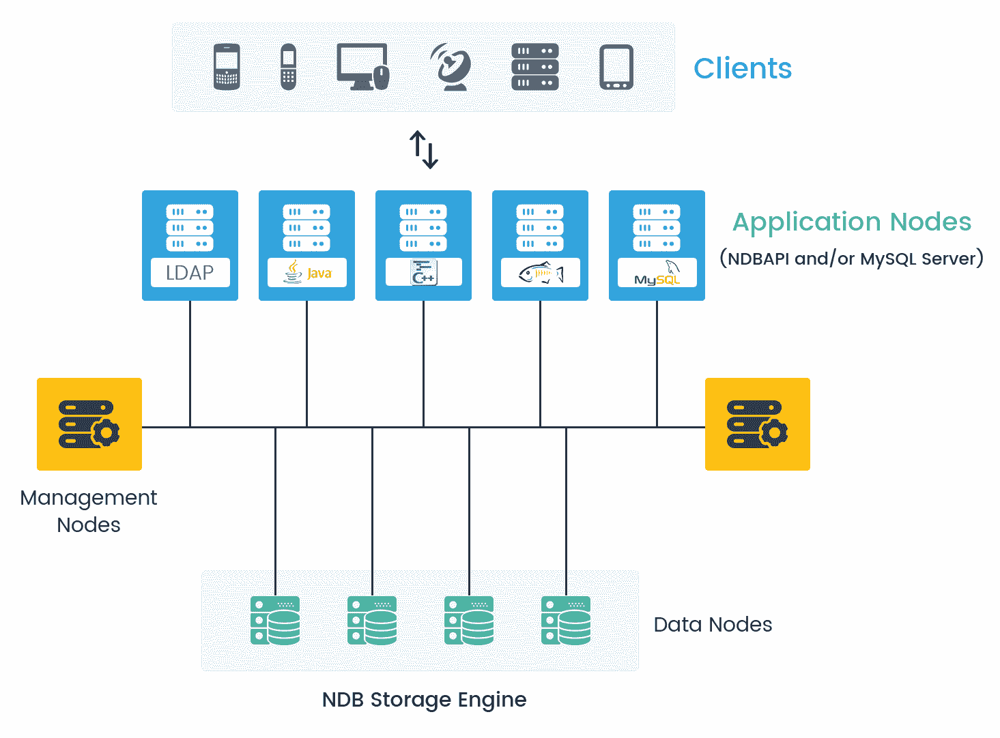
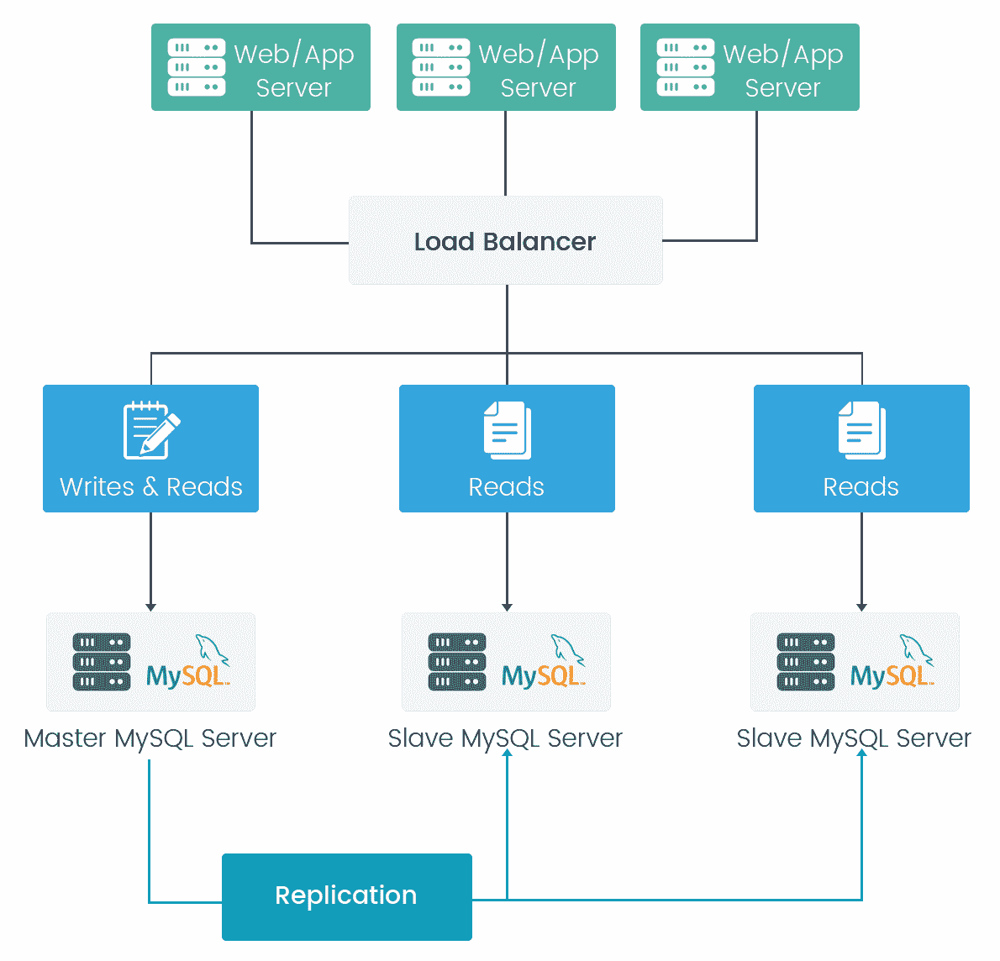

# MySQL 8–可扩展性和高可用性

在本章中，我们将介绍 MySQL 8 可扩展性和高可用性的以下重要主题：

*   MySQL 8 中的可扩展性和高可用性概述
*   扩展 MySQL 8
*   扩展 MySQL 8 的挑战
*   实现高可用性

在继续讨论细节之前，让我们先概述一下 MySQL 8 中的可伸缩性和高可用性

# MySQL 8 中的可扩展性和高可用性概述

在任何类型的应用程序中，无论是移动应用程序、门户网站、网站、社交应用程序、电子商务应用程序、企业应用程序还是云应用程序，数据都是业务的核心部分。数据可用性被认为是任何企业或组织最关心的问题。数据丢失或应用程序的任何停机都可能导致严重的金钱损失，并影响公司在市场上的信誉。

如果我们考虑一个在线购物网站的例子，它在一个特定的区域有良好的覆盖市场，客户和良好的商业信誉。如果该业务面临数据丢失或任何应用程序服务器或数据库服务器停机的问题，它将影响整个业务。许多客户将对企业失去信心，企业也将在财务和信贷方面遭受损失。

没有单一的公式可以提供解决方案。不同的企业有自己的应用程序需求、业务需求、不同的流程、位于不同位置的不同基础架构以及运营能力。在这些情况下，技术在实现高可用性方面起着重要作用。

根据可扩展性和高可用性的要求，MySQL 可以用于各种应用，并且根据需要，它能够克服故障，包括 MySQL 故障、操作系统故障或任何可能影响可用性的计划维护活动。简单来说就是可伸缩性，它能够在 MySQL 服务器之间分配数据库负载和应用程序查询。

选择正确的高可用性解决方案时，重要的属性取决于系统在多大程度上可以称为高可用性，因为这些需求因系统而异。对于较小的应用程序，用户负载预计不会很高，设置复制或群集环境可能会导致非常高的成本。在这种情况下，提供 MySQL 的正确配置也足以减少应用程序负载。

以下各节简要介绍 MySQL 8 支持的高可用性主要解决方案。

# MySQL 复制

MySQL 复制允许将来自一台服务器的数据复制到多台 MySQL 服务器上。MySQL 复制提供主从式设计，因此组中的一个服务器充当主服务器，从应用程序执行写入操作，然后主服务器将数据复制到多个从属服务器。复制是一个成熟的高可用性解决方案，Facebook、Twitter 等社交巨头都在使用它。

# MySQL 集群

这是另一个流行的 MySQL 高可用性解决方案。群集允许通过自动共享将数据复制到多个 MySQL 服务器。它是为更好的可用性和吞吐量而设计的。

# Oracle MySQL 云服务

Oracle MySQL 云服务提供了一种有效的方法，可以帮助构建安全、经济高效的 MySQL 数据库，作为现代世界中使用的应用程序的服务。与内部部署相比，它具有可扩展性和经济高效性，管理服务的资源利用率更低

# 使用 Solaris 集群的 MySQL

MySQL 数据服务提供的 sun Solaris 群集为 MySQL 服务的有序启动和关闭、故障监视和自动故障切换提供了一种机制。以下 MySQL 组件受 sun cluster HA 针对 MySQL 数据服务的保护。

使用第三方解决方案还有一些其他选择。用于实现高可用性数据库服务的每种体系结构都因其提供的正常运行时间级别而有所不同。这些体系结构可分为三大类：

*   数据复制
*   集群化和虚拟化系统
*   地理复制群集

根据问题的最佳答案，您可以为您的应用程序选择合适的选项，并提供最佳成本和高可用性的解决方案。这个讨论让我们对 MySQL 8 的高可用性有了一个大致的了解。

# 扩展 MySQL 8

可伸缩性是指能够跨各种 MySQL 实例分配任何应用程序查询的负载。在某些情况下，数据不能超过某个限制或用户数量不会超出范围是不可预测的。可伸缩数据库将是一个更好的解决方案，以便在任何时候，我们都可以满足意外的规模需求。MySQL 是一个有价值的数据库系统，因为它的可扩展性，可以水平和垂直扩展；就数据而言，跨各种 MySQL 实例分布客户端查询是非常可行的。向 MySQL 集群添加马力来处理负载非常容易。

实现**高可用性**（**HA**和可扩展性的要求可能因系统而异。为了实现这些功能，每个系统都需要不同的配置。当我们考虑在 MySQL 中进行缩放以及在 MySQL 中执行缩放操作时，会想到许多问题：

*   为什么需要缩放？
*   MySQL 中扩展的优势是什么？
*   当我们在 MySQL 中执行伸缩时，我们需要考虑哪些要点？
*   缩放将如何工作？
*   它对数据安全吗？它是否提供数据安全的保证？
*   再加上更多。。。

让我们用一个实时的例子来理解为什么我们需要在 MySQL 中缩放。我们有一个在线电子商务网站，覆盖了一个小市场，用户有限，网站点击率有限，只有一个数据库服务器。业务发展良好；业务的性能在不断提高，用户数量也在不断增加，使用我们的单一数据库服务器，所有请求和性能都无法随时扩展。这可能会导致服务器崩溃，企业可能会面临利润和市场信用方面的损失。为了避免这种情况，可伸缩性将发挥重要作用。如果客户的任何请求由于任何原因而失败，或者如果节点出现故障，则另一个节点将迅速处理该请求并向客户提供适当的响应。

为了不断提高数据库响应时间的性能和提高产品的生产效率，需要进行扩展。它将在数据可伸缩性、性能和更好的结果方面帮助最终产品。集群和复制都是 MySQL 中的关键功能，可用于扩展。

# 使用集群进行扩展

基本群集体系结构分为四个不同的层：

*   客户端节点
*   应用程序节点
*   管理节点
*   数据节点

如下图所示：

# 客户端节点

客户机节点是终端用户或应用程序，它从不同的设备（如计算机、手机、平板电脑等）发送关于读取数据或写入数据的任何查询请求。

# 应用程序节点

应用程序节点旨在提供应用程序逻辑与 MySQL 中包含数据的节点之间的桥梁。应用程序可以通过 SQL 访问存储在 MySQL 集群中的数据，使用 SQL 的功能使用一个或多个 MySQL 服务器。在这个应用程序中，我们有多种技术可以从中连接到 MySQL 服务器。我们使用标准的 MySQL 连接器连接 MySQL 服务器，这使我们能够连接多种访问技术。

作为另一种选择，我们有 NDB API；高性能接口，可用于控制实时用户体验并提供更好的吞吐量。在 MySQL 中，我们有 NDB API，它在 NoSQL 接口上增加了一个层，该层包含直接访问集群的功能。应用程序节点可以从所有数据节点获取数据，因此故障的唯一原因可能是应用程序服务不可用，因为应用程序可以使用所有数据节点执行数据操作。

# 管理节点

管理节点与节点管理一起在其集群中的节点之间发布相关集群信息，这一点非常重要。当所有节点都希望加入 MySQL 集群时，以及当需要重新配置系统时，用于管理的节点在启动时工作。可以停止管理节点并重新启动所有服务，而不会损坏或影响数据和应用程序节点的正在进行的操作、执行或处理。

# 数据节点

数据节点存储数据。表在数据节点之间共享，这也有助于处理负载平衡、复制和高可用性故障切换。

数据节点是 MySQL 集群解决方案的主要节点。它提供以下功能和好处：

# 基于磁盘和内存数据的数据存储和管理

在无共享场景中，数据存储在至少一个副本中，而不使用共享磁盘空间。MySQL 创建数据库的一个副本，该副本执行同步复制过程。如果任何数据节点由于任何特定原因发生故障，复制的数据将处理该节点并提供相应的输出。它执行节点的同步复制，因此它包含与主节点数据相同的数据

我们可以根据需要将数据存储在内存中或部分存储在磁盘上。建议将经常更改的数据存储在内存中。内存中的数据通过本地磁盘和坐标进行例行检查，以将数据更新到其余的数据节点。

# 自动和用户定义的表分区或表分片

MySQL 集群提供了低延迟、高吞吐量、可扩展性和高可用性。它采用水平缩放和自动分片，通过不同的 NoSQL 查询为重载读/写操作提供服务。NDB 集群是一组不同的节点，其中每个任务都在自己的处理器上运行。

# 数据节点之间的同步数据复制

当我们为数据节点进行数据复制时，它遵循同步复制，因此在任何时候，所有节点数据都将处于同步状态。如果任何节点因任何原因失败，其他节点都有相同的数据，因此能够为查询提供数据。因此，MySQL 提供了一个完美的解决方案，无需任何数据响应停机时间。

# 数据检索和事务

MySQL 支持可以映射的每个事务，因为它在主服务器上提交，并在从服务器上应用。此方法不引用`binlog`文件或`binlog`文件中的相关位置。`GTID`复制完全基于事务工作；识别主服务器和从服务器是否同步变得非常容易。

# 自动故障转移

如果任何数据节点因任何原因失败，其他节点将承担责任并对请求做出响应。在任何节点出现停机或故障的关键情况下，数据库的复制都非常有用。

# 故障后自动重新同步进行自我修复

如果任何节点出现故障，它将自动启动，并再次执行与其余节点（活动节点）的数据同步，并复制节点中所有最近的数据。在这种情况下，它可以自我修复失败。

# 在 MySQL 8 中使用 memcached 进行扩展

在 MySQL 8 中，使用 memcached 是实现可伸缩性的方法之一。Memcached 是一种简单且高度可扩展的解决方案，用于在内存可用时将数据以键和值的形式存储在缓存中。Memcached 通常用于快速访问数据。存储在内存中的数据没有用于获取数据的 I/O 操作。

由于所有信息都存储在内存中，因此与每次从磁盘加载数据相比，数据的访问速度要快得多，从而在数据库服务器上获得更好的查询执行时间。该插件还具有序列化功能，可以将二进制文件、代码块或任何其他对象转换为可存储的字符串，并提供检索此类对象的简单方法。指定内存分配时，它不应大于服务器的可用物理内存。

如果指定的值太大，则分配给 memcached 的某些内存将使用交换空间，而不是物理内存。这可能会导致存储和检索值时出现延迟，因为数据会交换到磁盘，而不是直接存储在内存中：

上图描述了 memcached 体系结构，它显示了从 memcached 到客户端或最终用户的数据流，或来自应用程序的数据请求。

memcached 中的数据永远不会存储在数据库中。它总是在内存中可用。如果其中一个 memcached 服务器出现故障，数据将从数据库中提取，因此不会影响最终用户的数据检索，也不会对应用程序的性能产生重大影响。当我们使用 memcached 服务器时，唯一需要记住的是，与任何重要信息（例如金融交易）相关的数据不应放在 memcached 中。在这种情况下，如果 memcached 中出现故障，则可能无法检索数据。在 memcached 服务器中，数据完整性不健康，因为它存储在内存中，所以在发生故障时，最好不要将重要的数据保存在 memcached 中。配置 memcached 服务器时，内存大小是关键因素。如果存在不正确的配置，则可能会出现糟糕的情况。

通过这种方式，我们可以使用 memcached 扩展 MySQL 服务器，以增加数据响应时间，并提供更快的性能。作为缓存组的一部分，它将减少 MySQL 服务器和多台服务器上的负载，并为多种语言提供接口。建议在有大量读取操作时理想地使用。

# NoSQL API

MySQL 集群提供了多种帮助访问数据存储的方法。最通用的方法之一是利用 SQL；然而，在现实世界中，我们也可以依赖于本机 API，它允许从数据库中获取数据，而不会影响性能，也不会通过开发转换 SQL 的应用程序增加复杂性。

# 使用复制进行扩展

复制是对 MySQL 数据库的复制。MySQL 提供了一种不同的复制方法。MySQL 具有复制功能，可提供扩展解决方案、数据安全性、远程数据分发和更多好处。我们已经在[第 8 章](08.html)、*MySQL 8*中详细讨论了这一点。下图说明了 MySQL 中复制的基本架构：

复制是 MySQL 最好的特性之一。它只需将数据的副本创建到新服务器或另一台物理机器，这台机器将从主服务器导入数据。无论何时需要数据，它都将填充准确的结果。它遵循主复制和从复制的方法。主数据库是应用程序的实际数据库，从数据库由 MySQL 在另一个物理服务器的数据库服务器中创建，其中包含来自主服务器的复制数据。我们可以为特定操作配置从数据库，例如当查询涉及从数据库读取数据时；我们可以在从属服务器上执行此操作。在这种情况下，主数据的负载将比以前少。假设我们有 40%的写数据查询和 60%的读数据查询；在这种情况下，如果只有一台服务器，它将处理与读写操作相关的所有操作。但是，正如前一幅图中所定义的，我们已经在两个不同的服务器中复制了数据库，并且在从属服务器上执行读取操作，因此我们可以使用其中一个从属服务器来执行复杂的读取查询。这使得在 MySQL 8 上生成数据分析报告成为可能，因为执行复杂的读取查询不会影响整体应用程序性能。

在标准 MySQL 复制中，主服务器创建二进制日志文件并维护日志文件的索引，以维护和跟踪日志循环。二进制日志文件用于记录更新，并发送到从属服务器。当从属服务器连接到主数据库服务器时，它会考虑它在日志文件中读取的最后一个位置，然后从属服务器会接收自那时以来发生的任何更新。从机随后阻塞并等待主机通知其进一步更新。

我们心中的问题是，为什么我们需要复制？或者，复制的目的是什么？如果复制需要另一个数据库服务器、复杂性和其他配置，则会增加维护和监视时间。尽管如此，我们在业务和数据库管理方面还有许多额外的好处。

# 单服务器依赖性

在任何情况下，如果主数据库服务器出现故障，我们可以轻松地将数据库连接切换到复制的从属服务器，以在关键情况下提供稳定性。这包括是否存在网络故障、服务器故障、硬件问题以及更多故障原因。

# 表演

性能是数据库中的主要部分。当我们在多个服务器上拥有分布式数据库时，我们可以将不同的应用程序连接到不同的数据库服务器以提高性能。此功能缩短了查询的响应时间。

# 备份和恢复

复制有助于备份主数据库。它比将数据库存储在磁盘上更有效。用户可以使用复制的数据库作为备份，而不是挖掘备份文件，将数据库存储在主数据库中。当需要恢复主服务器的数据时，用户可以轻松地从从属服务器获取数据，而无需处理备份文件并查找上次更新和其他操作。

# 负荷分配

通过使用数据库的复制负载，可以减少查询执行；我们可以在数据库上拆分读写操作。如果我们在主数据库中执行写操作，在从数据库中执行读操作，这将提高应用程序的响应时间。我们可以在 MySQL 中创建负载平衡的环境，这些环境共享对数据库服务器的所有请求的负载。负载平衡器然后进一步向数据库发送请求，该数据库可以以更好的吞吐量处理每个事务。

# 异步数据复制

异步数据复制意味着数据从一台机器复制到另一台机器，并产生延迟。此延迟基于网络带宽、资源可用性或管理员在配置中设置的时间间隔。正确的配置和时间设置可提供准确的响应结果。它基于网络管理员的配置。同步数据复制意味着数据同时提交到一台或多台计算机。

# 地理数据分布

通过组复制，可以将主机的数据复制到驻留在远程位置的从属服务器，并在不影响主机操作的情况下为单独的客户端组执行读取操作。

# GTID 复制

**全局事务标识符**（**GTID**使用基于事务的数据复制，而不是基于二进制日志文件的复制。除非在主服务器上运行和提交的事务存在于所有从服务器上，否则 GTID 将不考虑在一致状态下的复制。

在 MySQL 8 中，复制可以在异步模式或半同步模式下完成。在异步模式下，写入操作将立即在主服务器上执行，而从服务器中的复制将根据配置定期执行。

在复制的半同步模式中，如果在主服务器和至少一个从服务器上启用了半同步配置，主节点上的事务在获得事务超时之前等待，直到半同步启用的节点确认已收到所需的数据或更新。在超时时，主节点再次查找半同步从节点并执行复制。

MySQL 8 提供了一种新的复制方法 GTID，其中创建了一个唯一标识符，并与主服务器上保存或提交的每个事务相连接。这些标识符的唯一性存在于创建它的服务器中的所有服务器中，也存在于复制的服务器中。GTID 在所有事务之间具有一对一映射。在开始创建新的从属服务器或故障切换到新的 MySQL 主服务器时，不需要引用文件中某个位置的日志文件概念。您可以对 GTID 使用基于行或基于语句的复制。

使用全局事务 ID 主要有两大好处：

*   **在故障切换期间，将主服务器更改为与从服务器连接很容易**：GTID 在复制组中的所有服务器中都是唯一的。从属服务器记住来自旧主服务器的最后一个事件的全局事务 ID。这意味着可以很容易地确定在新的 MySQL 主机上重新初始化复制的位置，因为全局事务 ID 在整个复制层次结构中都是已知的。
*   **从机状态提供了一种碰撞安全方法**：从机在`mysql.gtid_slave_pos`系统表中保存当前位置信息。如果此表使用的是事务存储引擎（如默认设置为`InnoDB`），则会在同一事务中进行进一步更新。

GTIDs 是在主服务器上创建并与提交的每个事务（插入和更新操作）关联的唯一密钥。密钥不仅对于主服务器是唯一的，而且对于复制中的所有服务器也是唯一的。

# ZFS 复制

ZFS 文件系统能够提供服务器文件的快照，例如文件系统内容，将快照传输到另一台计算机，并提取快照以在不同的服务器上重新创建文件系统。用户可以随时创建快照，并且可以根据需要创建任意数量的快照。通过不断创建、传输和恢复快照，它可以以类似于 DRBD 的方式在一台或多台机器之间提供同步。

我们已经看到了使用不同技术在 MySQL 中扩展数据库的所有可能方法。根据业务需要和灵活性，我们可以使用数据库备份进行扩展。扩展不是一项容易的任务，但在 MySQL 8 中它是可能的，只要对业务需求和 MySQL 8 提供的配置有适当的了解和理解。对于数据库扩展，我们必须正确理解数据库的整个工作流程和通信方法。

# 扩展 MySQL 8 的挑战

在前面的主题中，我们已经了解了缩放的工作原理以及缩放的优势和目的。当我们开始在 MySQL 8 中进行扩展时，我们将面临什么类型的挑战，以及在扩展过程中需要记住哪些步骤？我们必须考虑，如果我们正在进行扩展，主服务器出现故障，达到限制，读写操作无法处理应用程序的请求，或者在重新构建数据库平台时。扩展不是一项容易的任务；它需要确保能够毫无困难地处理不断增加的交易。在执行扩展时，我们需要记住许多点，例如主服务器和从服务器中的写入和读取操作限制。数据库负载平衡是帮助减少事务流量的方法之一，但它同样需要完善，并且需要正确理解负载平衡配置。以下是我们在执行扩展时面临的主要挑战。

# 业务类型和灵活性

这是执行缩放时需要记住的第一点。业务类型或业务行为是核心部分；如果业务是电子商务，我们已经知道电子商务业务具有许多功能和有关客户的非常关键的数据，例如产品详细信息、业务垄断、优惠和折扣。主要内容是客户详细信息和付款信息，如信用卡详细信息、借记卡详细信息和客户反馈。

在本例中，当我们在 MySQL 8 中进行扩展时，需要记住所有参数，例如数据库备份、安全性、数据库的角色/权限以及扩展的向后兼容性。通过集群进行缩放时，所有数据节点都需要位于同一页面上。如果应用程序是使用多种技术开发的，并且我们对每个堆栈执行缩放，那么我们可以使用不同的数据节点；在这种情况下，数据库同步是在扩展时需要在配置中确保的最重要的事情之一。在我们设计伸缩性之前，还应该明确哪些类型的数据应该驻留在 memcached 和磁盘中的缓存内存中。

应用程序的行为从共享数据节点访问数据。如果我们有一个电子商务站点，并且我们为该站点执行分片，并且在某个级别上，由于任何原因使用另一个分片服务器的数据的客户端无法使用该数据，那么此时将需要跨节点事务。它完全基于业务行为，并取决于业务在接受有关数据库扩展的更改时的灵活性。

# 了解服务器工作负载

MySQL 8 中提供了许多选项和操作，用于设置灵活性、可扩展性和性能改进。许多人在执行此类活动时会遇到问题，因为他们没有足够的理解或知识来处理各种技术堆栈和配置选项选择，这些技术堆栈和配置选项可以提高可伸缩性、性能、安全性，以及应用程序和部署活动的灵活性。这些配置选项包括集群、复制、分片、memcached、存储引擎等，可以很好地设计这些选项来处理应用程序的整个工作负载。数据库工作负载和业务行为有助于决定 MySQL 配置。

# 读写操作限制

如果达到读写限制并且主数据库服务器上的事务增加，会发生什么情况。MySQL 的容量有限；例如，如果许多客户在读写操作运行的同时访问该站点，并且服务器或节点未同步，则此时会给最终用户造成混淆或误解。或者，在电子商务网站中，如果一个客户正在购买该产品，而该产品是最后一个库存产品，同时另一个客户搜索同一产品，但该产品仍然可用，在这种情况下，就数据库的读写操作而言，这两个操作并不同步。

最后，其他客户可能会购买相同的产品，而我们在仓库中没有。这会影响库存计算，客户对采购周期的流程有疑问。在这种情况下，我们将失去客户对业务的信任，业务的信用也将受到影响。

另一种方法是进行数据库分片。切分可以简单地表述为在多个服务器中对数据库进行分区。分片有助于减少单个数据库或主数据库上的负载。如果我们有地理上分片的数据库，对于不同的国家或地区，我们有不同的数据库服务器，我们可以解决 MySQL 服务器上读写操作的限制问题。但同样，我们用于分片的技术也决定了数据库的性能。我们已经在 MySQL 8 中的[第 9 章](09.html)和*分区中详细了解了这一点。*

# 维修

虽然我们已经在 MySQL 8 中执行了扩展，但我们必须知道如何管理主服务器和从服务器，以及在执行扩展时需要哪些配置。当服务器处于关键阶段时，需要注意哪些步骤？在对数据库服务器进行分片、群集或复制时，需要执行哪些步骤？

缩放是可能的，但这不是一个简单的操作。如果我们想执行伸缩，我们应该知道数据库可以处理更多事务而不会出现任何问题。我们应该知道要进行的适当配置，以克服主服务器上用于写和读操作的默认限制。一旦完成，我们需要执行类似的步骤来配置从属数据库服务器，它应该只有对最终用户可用的读取操作，并且应该始终与主数据库同步。

如果我们有多台服务器，那么服务器的维护也会成为一项昂贵的开销。所有的服务器都需要在同一个页面上，配置要恰当，服务器的成本也会影响业务。如果此时数据数量不断增加，则还需要以适当的方式管理服务器空间。

# 主服务器故障

如果主服务器出现故障，并且客户当时无法获得数据，最终用户将感到沮丧，业务将在市场信用和失去客户方面受到阻碍。这家公司将不得不蒙受损失。

# 同步

无论是通过集群还是复制执行扩展，在这两种情况下，我们都需要确保同步。所有从属服务器应具有与主服务器相同的数据库。如果在主服务器上执行写操作，在从服务器上执行读操作，则此时需要同步所有数据。所有结果都应该是相同的，如果任何服务器在数据未同步时停机，则会造成数据丢失问题。

# 数据库安全

如果我们有不同的服务器并且执行了分片，我们如何保护数据库？如果我们在不同的位置有不同的数据库服务器，并且当时对数据库的访问不限于特定的用户，那么很有可能出现数据泄漏问题。我们必须完全了解数据库服务器的 IP 配置方面的数据访问点，为执行各种活动的数据库用户提供适当的角色和权限。哪些 IP 具有访问权限，哪些 IP 需要限制来自服务器的数据事务？当我们在数据库上执行跨节点事务时，应提供准确的数据；它不应授予从服务器访问受限数据的权限。

# 跨节点事务

当我们在进行缩放后有多个节点，并且一个节点需要另一个节点数据作为输入的一部分时，需要跨节点事务。例如，如果我们在不同的位置有不同的节点，并且我们当时所有位置都有一个单一的库存，对于该数据节点中当时不可用的任何产品的一个用户请求必须根据用户的请求与其他数据节点通信以获取产品信息。

# 成长团队促进发展

虽然应用程序可能会有积极的响应，并且它的持续成功会增加业务团队，但还需要扩展数据库管理员。在 MySQL 8 中执行共享、扩展或复制时，我们需要具有适当知识和经验的适当团队成员来处理数据库服务器的持续扩展和管理。它不仅限于数据库服务器的设置；我们还需要关注服务器的维护，同时还要关注服务器的活动。

# 管理变更请求

当我们对任何数据库结构进行了更改，并且已经执行了扩展或复制时，需要在更改请求中处理一些事情，或者如果我们添加了一个新特性或功能的增强，则需要处理一些事情。这包括更新共享密钥、使用节点复制修改数据分发、更新查询以考虑复制延迟以避免使用正在进行的碎片管理过时数据、数据平衡、，并确保数据在新的更新中可用。

# 放大和缩小

放大描述了最大化单个 MySQL 节点可以处理的容量的过程。扩展过程可能涉及优化数据库软件和选择正确的存储引擎，如前面在[第 6 章](06.html)、*MySQL 8 存储引擎、*中所述，并选择适当的硬件。对节点的扩展有一定的限制，这些限制是由数据大小、架构复杂性、CPU 周期、系统内存和磁盘 IO 操作的组合决定的。由于需要处理越来越庞大的数据集，向外扩展受到了广泛关注，但必须记住，扩展得越好，需要的向外扩展节点就越少，因此我们在硬件上的花费就越少。

横向扩展可用于提供涵盖多个不同用例的解决方案。一些最常见的方法是通过使用复制来增加读取容量，或者使用数据库分片来增加总数据库大小和总事务吞吐量。

所有这些都是在扩展 MySQL 8 时面临的关键挑战。在 MySQL 8 中执行数据库扩展时，需要考虑这些挑战。一个错误就可以使一家企业陷入我们都不愿意陷入的境地。扩展是提高数据库性能的更好方法。

# 实现高可用性

高可用性是指持久的系统，能够在响应所需数据或来自任何移动、门户网站、网站、社交、电子商务、企业、，数据可用性被认为是任何企业或组织最关心的问题。任何与停机有关的问题都可能会对企业信用造成影响，在某些情况下，企业必须遭受财务损失。

例如，如果我们有一个带有单个数据库服务器的电子商务应用程序，如果该服务器因硬件故障、网络问题、病毒或操作系统问题等原因停机，它也会影响数据。一个电子商务应用程序可能同时有大量的客户点击，任何服务器未能响应用户请求都会影响用户；他们将搜索购买商品的其他选项。

MySQL 8 能够为应用程序提供后端，以帮助实现高可用性并准备一个完全可扩展的系统。在基础设施的一部分发生故障时，系统保持连接持久性的能力，以及系统从此类故障中恢复的能力被视为高可用性。系统故障可能由系统某个部分的维护活动（如硬件或软件升级）或已安装软件的故障引起。

# 高可用性的目的

实现 HA 和可伸缩性的要求可能因系统而异。为了实现这些功能，每个系统都需要不同的配置。MySQL 8 还支持不同的方法，例如跨多个 MySQL 服务器复制数据，或者根据地理位置准备多个数据中心，并为来自距离客户端位置最近的数据中心的客户端请求提供服务。这些解决方案可用于实现 MySQL 的最高正常运行时间。

今天，在竞争性营销的世界中，一个组织的关键点是建立和运行他们的系统。任何故障或停机都会直接影响业务和收入。因此，高可用性是一个不容忽视的因素。MySQL 非常可靠，并且使用集群和复制配置具有恒定的可用性。群集服务器可立即处理故障并管理故障转移部分，以使您的系统几乎始终可用。如果一台服务器停机，它会将用户的请求重定向到另一个节点，并执行请求的操作。

# 数据可用性

数据在任何情况下都是可用的。在任何应用程序中，数据都是核心部分，它实际上是应用程序所有者的财富。如果我们有一个医疗保健系统，在对任何患者进行体检时，由于服务器停机或任何其他原因，他们的数据不可用，这可能会阻碍医生的进一步处理，在这种情况下会影响患者的生命。

# 数据安全

首先想到的是保护数据，因为如今数据已经变得非常宝贵，如果不履行法律义务，它可能会影响业务连续性；事实上，它可以是如此糟糕，它可以关闭您的业务在任何时候。MySQL 是最安全、最可靠的数据库管理系统，被许多知名企业使用，如 Facebook、Twitter 和 Wikipedia。它确实提供了一个很好的安全层，保护敏感信息免受入侵者的攻击。MySQL 提供了访问控制管理，因此可以轻松地授予和撤销用户所需的访问权限。还可以使用可为用户授予或撤销的权限列表来定义角色。所有用户密码都使用特定于插件的算法以加密格式存储。

# 数据同步

虽然我们只有一台数据库服务器，但如果它因任何原因停机，我们将丢失整个数据库，并且如果到目前为止我们有可用的数据库备份，我们可以将数据库恢复到当天，但在这种情况下，所有当前事务也将丢失。最后一个事务数据届时将不可用。

# 数据备份

当一个企业有一个单一数据库服务器执行所有任务的任何基于服务器的应用程序时，应该在计划中备份到最后一个事务的数据库。在执行高可用性时，请在体系结构中包括备份和恢复操作的所有场景。

# 竞争市场

市场上有许多具有相同业务性质的竞争对手。在这种情况下，如果某个企业对最终用户的数据可用性存在问题，那么客户可能不会继续该业务，而是转向另一个提供商。它是业务连续性的一个组成部分。

# 表演

就数据操作的性能而言，高可用性也很重要。如果我们只有一台服务器，并且所有操作都只在该服务器上执行，那么它将在某个阶段达到极限，此时服务器容量将耗尽。因此，在这种情况下，如果我们实现了高可用性体系结构，它将提供一种方法来加载事务的平衡和数据操作的性能。复制和集群支持更好的并发性并管理工作负载。

# 系统中的更新

虽然任何在线站点或应用程序都需要更新，或者计划发布任何新的生产版本，但它直接影响最终用户。如果应用程序当时只有有限的用户，我们可以在发布前通过应用程序内的电子邮件或消息管理有关所有最终用户的更新。但是在单个应用程序中有大量用户的情况下，此时会影响业务。它将同时停止所有用户，因此正在运行的事务将受到影响。

# 选择解决方案

同样，我们必须考虑为可用性选择正确的解决方案。在规划 MySQL 的高可用性时，需要记住很多事情。实现 HA 和可伸缩性的要求可能因系统而异。为了实现这些功能，每个系统都需要不同的配置。

这些解决方案可用于实现 MySQL 在以下方面的最高正常运行时间：

*   所需的可用性级别
*   正在部署的应用程序的类型
*   在您自己的环境中接受的最佳实践

在 MySQL 中，复制和集群是实现高可用性的最佳选择。所有应用程序都有自己的体系结构，当我们选择任何技术来实现 MySQL 8 的高可用性时，都需要考虑它们的业务性质。

# 高可用性的优势

以下是我们在 MySQL 中执行高可用性时的优势：

*   MySQL 非常可靠，并且使用集群和复制配置具有恒定的可用性。
*   群集服务器可立即处理故障并管理故障转移部分，以使您的系统几乎始终可用。如果一台服务器宕机，它会将用户的请求重定向到另一个节点，并执行请求的操作。
*   系统在部分基础设施发生故障时保持连接持久性的能力，以及系统从此类故障中恢复的能力被视为高可用性。
*   MySQL 8 还支持不同的方法，例如跨多个 MySQL 服务器复制数据，或者根据地理位置准备多个数据中心，并为来自离客户端位置最近的数据中心的客户端请求提供服务。
*   MySQL 以最佳速度提供高速事务处理。它可以缓存结果，从而提高读取性能。
*   复制和集群支持更好的并发性并管理工作负载。组复制基本上负责在组复制中的大多数成员确认已同时收到事务后提交事务。如果写入的总数不超过复制组中成员的容量，这有助于创建更好的吞吐量。
*   群集允许通过自动共享将数据复制到多个 MySQL 服务器。它是为更好的可用性和吞吐量而设计的。
*   Memcached 删除 SQL 层并直接访问 InnoDB 数据库表。因此，像 SQL 解析这样的开销操作将不再执行，这将真正影响性能。
*   Memcached with MySQL 还提供了一种使内存中的数据持久化的方法，这样我们就可以在不丢失数据的情况下将其用于各种数据类型。
*   memcachedapi 有不同的编程语言，如 Perl、Python、Java、PHP、C 和 Ruby。在 memcachedapi 的帮助下，应用程序可以与 Memcached 接口交互以存储和检索信息。

# 总结

在本章中，我们首先概述了 MySQL 8 中的可伸缩性和高可用性，其中涵盖了各种可伸缩性需求、优势、方法以及在设计 MySQL 8 时需要注意的要点。我们还讨论了在执行可伸缩性时通常遇到的缺点，以及如何使用适当的解决方案克服挑战。我们已经了解了 MySQL 8 中的扩展以及在扩展 MySQL 8 时遇到的问题。我们还了解了在 MySQL 8 中实现高可用性的多种方法。

 *在下一章中，我们将学习如何维护 MySQL 8 的安全性。我们将了解影响安全性的一般因素、核心 MySQL 8 文件的安全性、访问控制以及数据库系统本身的安全性。我们还将学习安全插件的细节，并深入了解关系数据库的数据库安全性。*