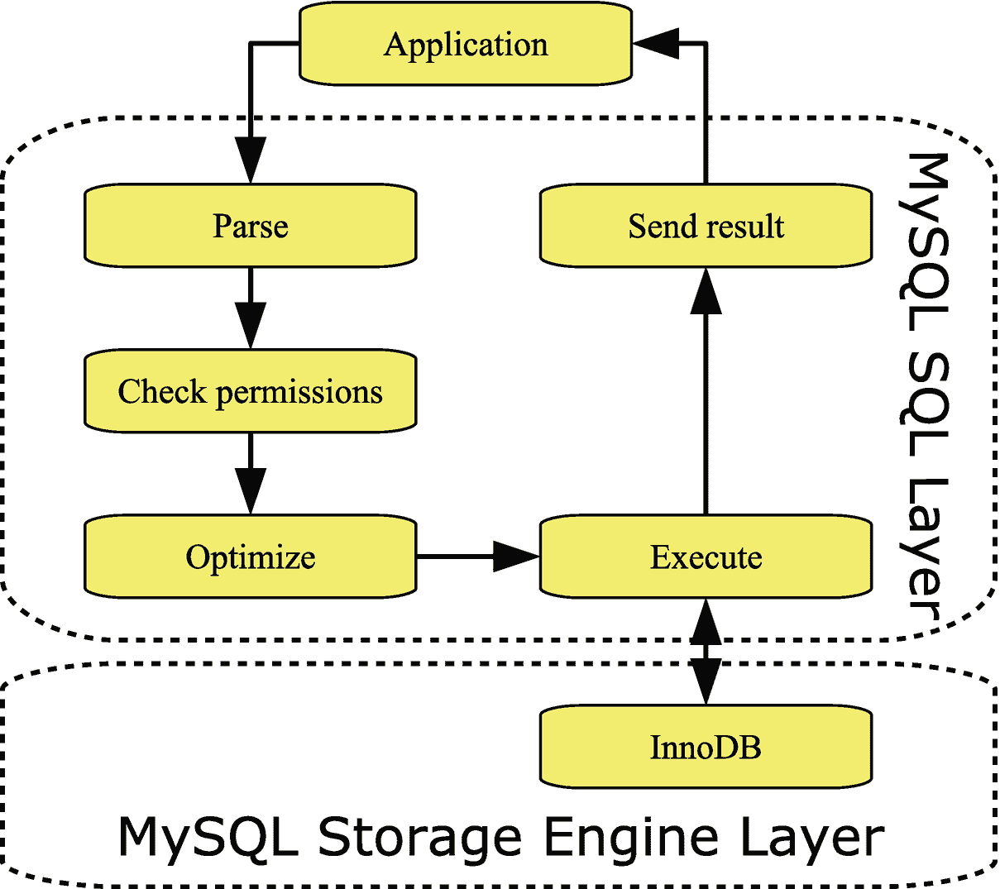

# 一、MySQL 性能调优

欢迎来到 MySQL 性能调优的世界。这是一个有时似乎被黑魔法和运气主宰的世界，但希望这本书可以帮助你以一种结构化的方式有条不紊地工作，以达到更好的表现。

本章通过讨论整个堆栈以及监控和基于数据采取行动的重要性，向您介绍了 MySQL 性能调优。因为这本书主要是关于使用查询，所以在结束本章之前回顾一下查询的生命周期。

Tip

如果您需要一个测试实例，无论是在阅读本书时还是在工作中解决问题时，云都可以成为您的朋友。它允许您快速启动一个测试实例。如果你只是需要一个小的实例，例如，探索本书中的例子，你甚至可以使用免费的实例，例如通过甲骨文云的免费层(仍然需要注册和信用卡): [`https://mysql.wisborg.dk/oracle_cloude_free_tier`](https://mysql.wisborg.dk/oracle_cloude_free_tier) 。

## 考虑整个堆栈

当您研究性能问题时，重要的是您要考虑系统的所有部分，从最终用户到应用再到 MySQL。当有人报告说应用很慢，而你知道 MySQL 是应用的核心部分，那么就很容易得出“MySQL 很慢”的结论。然而，这将排除性能不佳的大量潜在原因。

当应用需要查询的结果或者需要在 MySQL 中存储数据时，它通过网络向 MySQL 发送请求，为了执行请求，MySQL 与操作系统进行交互，并使用内存和磁盘等主机资源。一旦请求的结果准备好了，就会通过网络传回给应用。如图 [1-1](#Fig1) 所示。

图 1-1

围绕 MySQL 的堆栈

金字塔是一个非常简化的图形，它忽略了应用之外的一切，而应用可能会与用户通信并使用自己的资源。通过网络通信还涉及主机和操作系统。

为了说明这些层如何交互，考虑一个真实世界的例子。一个 MySQL 用户报告了 MySQL 遇到暂时停止的问题。使用 Linux 上的`perf`工具进行的一项调查显示，出现停顿是因为内存碎片过多，这主要是由 I/O 缓存引起的。当您通过网络提交数据时，Linux 请求一块连续的内存(使用`kmalloc`)，但是由于严重的内存碎片，Linux 必须首先对内存进行碎片整理(压缩)。当这种压缩发生时，包括 MySQL 在内的所有东西都停止了，而且在最糟糕的情况下，这需要一分钟(服务器有大量内存可用于 I/O 缓存)，这导致了严重的影响。在这种情况下，将 MySQL 配置更改为使用直接 I/O 解决了这个问题。虽然这是一个极端的情况，但是值得记住的是，交互可能会导致令人惊讶的拥塞点。

一个更简单的真实例子是一个使用框架生成查询的应用。框架中有一个 bug，这意味着针对大型表的查询省略了一个`WHERE`子句。这意味着一连串的问题，包括应用重试查询，并在几秒钟内完成 50 个查询副本(因为数据最终被读入缓冲池，使得最后一个查询的执行速度比第一个查询快得多)，以及将大量数据发送回应用，导致网络过载和应用耗尽内存。

这本书主要关注 MySQL 和影响查询的方面，但是不要忘记系统的其他部分。这包括当你监控你的系统。

## 监控

如果你从这本书里只带走了一样东西，那么就让它成为监控对于保持一个健康的系统是至关重要的。你所做的一切都应该围绕着监控。在某些情况下，通过专用监控解决方案进行监控可以提供您需要的所有数据，而在其他情况下，您需要进行特别的观察。

您的监控应该使用几个信息源。这些包括但不限于

*   性能模式包括从低级互斥到查询和事务度量的信息。这是查询性能调优的最重要的信息来源。`sys`模式提供了一个方便的接口，特别是对于特定的查询。

*   信息模式，包括模式信息、InnoDB 统计信息等等。

*   `SHOW`语句，例如，包括来自 InnoDB 的信息以及详细的引擎统计数据。

*   慢速查询日志，可以记录符合特定条件的查询，例如耗时超过预定义的阈值。

*   返回查询执行计划的`EXPLAIN`语句。这是一个非常有价值的工具，可以用来研究为什么一个查询由于缺少索引、查询以次优的方式编写或者 MySQL 选择了次优的方式来执行查询而表现不佳。在调查特定的查询时，`EXPLAIN`语句通常以特别的方式使用。

*   操作系统指标，如磁盘利用率、内存利用率和网络利用率。不要忘记一些简单的指标，如可用存储量，因为存储空间不足会导致停机。

这些信息来源在本书中都有讨论和使用。

当您在整个性能调优过程中使用监控时，您可以验证问题是什么，找到原因，并证明您已经解决了问题。在处理解决方案时，了解查询的生命周期也很有用。

## 查询的生命周期

当您执行一个查询时，在查询结果返回到应用或客户端之前，它会经历几个步骤。每一步都需要时间，并且本身可能是由几个子部分组成的复杂操作。

在图 [1-2](#Fig2) 中可以看到查询生命周期的简化概述。在实践中，涉及到更多的步骤，如果你安装插件，如查询重写器，它会添加自己的步骤。然而，该图确实涵盖了基本步骤，其中几个步骤将在后面更详细地介绍。

图 1-2

基本查询生命周期

MySQL 服务器可以分为两层。例如，SQL 层处理连接并为执行准备语句。实际数据是由存储引擎存储的，这些存储引擎是作为插件实现的，这使得实现不同的数据处理方式变得相对容易。主要的存储引擎——也是本书将考虑的唯一一个——是 InnoDB，它是完全事务性的，对高并发性工作负载有很好的支持。另一个存储引擎的例子是 NDBCluster，它也是事务性的，是 MySQL NDB 集群的一部分。

当应用需要执行一个查询时，首先要做的是创建一个连接(图中没有包括这个连接，因为这个连接可以被重用来执行更多的查询)。当查询到达时，MySQL 解析它。这包括将查询拆分成标记，因此查询类型是已知的，并且存在查询所需的表和列的列表。在下一步检查用户是否有执行查询的必要权限时，需要这个列表。

此时，查询已经到了决定如何执行查询的重要步骤。这是优化器的工作，包括重写查询以及确定访问表的顺序和使用哪些索引。

实际的执行步骤包括从存储引擎层请求数据。存储引擎本身可能很复杂。对于 InnoDB，它包括一个缓冲池，用于缓存数据和索引、重做和撤消日志、其他缓冲区以及表空间文件。如果查询返回行，这些行将通过 SQL 层从存储引擎发送回应用。

在查询调优中，最重要的步骤是优化器和执行步骤，包括存储引擎。本书中的大部分信息都与这三个部分直接或间接相关。

## 摘要

本章只触及了性能调优的皮毛，并为您准备了本书其余部分的旅程。关键要点是，您需要考虑从最终用户到主机和操作系统的底层细节的整个体系，并且在性能调优中，监控是绝对必要的。执行查询包括几个步骤，其中优化器和执行步骤是您将在本书中学到最多的。

下一章将更仔细地研究一种对解决性能问题有用的方法。