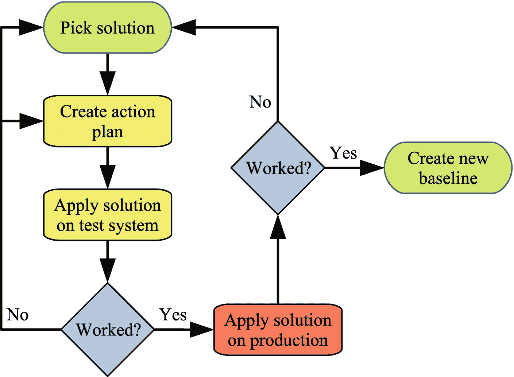

# 2.查询调优方法

解决问题有几种方法。在极端情况下，你可以一头扎进去，尝试做一些改变。虽然这看起来像是节省时间，但更多的时候，它只会导致沮丧，即使当改变看起来起作用时，您也不能确定您是否真正解决了根本问题，或者问题只是暂时变好了。

相反，建议从方法上进行工作，通过分析和使用监控来确认变更的效果。本章将向您介绍一种在解决 MySQL 问题时非常有用的方法，重点是性能调优。首先介绍该方法中的步骤。然后，本章的其余部分将更详细地讨论每个步骤，以及为什么花尽可能多的时间积极工作是重要的。

Note

此处描述的方法基于 Oracle 技术支持中用于解决客户报告的问题的方法。

## 概观

MySQL 性能调优可以被视为一个永无止境的过程，在这个过程中，随着时间的推移，使用迭代方法来逐步提高性能。显然，有时会出现像查询这样的特定问题，需要半个小时才能完成，但是一定要记住，性能不是二元状态，因此有必要知道什么是足够好的性能。否则，你将永远无法完成哪怕一项任务。

图 [2-1](#Fig1) 显示了如何描述性能调整生命周期的示例。循环从左上角开始，由四个阶段组成，其中第一个阶段是验证问题。

图 2-1

性能调整生命周期

当您遇到性能问题时，第一阶段是验证问题是什么，包括收集问题的证据，并定义认为问题得到解决的要求是什么。

第二阶段是确定性能问题的原因，第三阶段是确定解决方案。最后，在第四阶段，您实施解决方案。解决方案的实施应包括验证更改的效果。

Tip

这种循环既适用于危机期间的救火工作，也适用于积极主动的工作。

然后，您就可以从头开始了，要么进行第二次迭代来进一步提高您刚才看到的问题的性能，要么您可能需要处理第二个问题。也有可能在两个周期之间会有一段很长的时间。

## 验证问题

在你试图确定问题的原因和解决方案之前，重要的是你要清楚你要解决的是什么问题。仅仅说“MySQL 很慢”是不够的——这是什么意思？一个具体的问题可能是“前端网页的第二部分中使用的查询需要 5 秒钟”或者“MySQL 每秒只能支持 5000 个事务”你越具体，解决问题的机会就越大。

问题的定义还应该包括验证问题是什么。问题最初看起来是什么和真正的问题是什么是有区别的。验证问题可能很简单，只需执行一个查询并观察查询是否真的像声称的那样耗时，或者可能涉及到检查您的监控。

准备工作还应该包括从您的监控中收集基线，或者运行说明问题的数据收集。没有基线，您可能无法在故障诊断结束时证明您已经解决了问题。

最后，您需要决定性能调优的目标是什么。引用斯蒂芬·R·科维

> *的*高效人士的 7 个习惯*从心里的目的开始。*

慢速查询运行速度的最低可接受目标是什么，或者所需的最小事务吞吐量是多少？这将确保你在做出改变时知道目标是否已经达到。

当问题得到明确定义和验证后，您可以开始分析问题并确定原因。

## 确定原因

第二阶段是确定性能不佳的原因。确保你思想开放，考虑整个问题，这样你就不会在某个方面看不到自己，而这个方面与问题没有任何关系。

当你认为你知道原因时，你还需要论证为什么那是原因。您可能有一个`EXPLAIN`语句的输出，清楚地显示查询执行了全表扫描，因此这可能是原因，或者您可能有一个图形显示 InnoDB 重做日志已满 75%,因此您可能有一个异步刷新，导致临时性能问题。

找到原因通常是调查中最困难的部分。一旦知道了原因，你就可以决定一个解决方案。

## 确定解决方案

为您调查的问题确定解决方案需要两个步骤。第一步是找到可能的解决方案；第二，你必须选择实现哪一个。

当你寻找可能的解决方案时，做一次头脑风暴会很有用，在头脑风暴中你可以写下你能想到的所有想法。重要的是，你不要强迫自己只考虑一个狭窄的领域，这个领域的根本原因可能经常在不同的领域找到解决方案。一个例子是上一章提到的由于内存碎片造成的延迟，解决方案是改变 MySQL 的配置，使用直接 I/O 来减少操作系统 I/O 缓存的使用。您还应该记住短期解决方案和长期解决方案，因为如果需要重新启动或升级 MySQL、更换硬件或类似的事情，并不总是能够立即实现完整的解决方案。

Tip

一个有时不受重视的解决方案是升级 MySQL 或操作系统以获得新功能。但是，您当然需要进行仔细的测试，以验证您的应用在新版本中运行良好，特别要注意优化器是否有任何导致查询性能下降的更改。

确定解决方案的第二部分是选择最有效的候选解决方案。为了做到这一点，你必须为每一个解决方案辩护，为什么它有效，利弊是什么。在这一步中，重要的是对自己诚实，并仔细考虑可能的副作用。

一旦你对所有可能的解决方案有了很好的理解，你就可以选择哪一个来进行。您也可以选择一个解决方案作为临时缓解措施，同时开发一个更可靠的解决方案。无论哪种情况，下一阶段都是实现解决方案。

## 实施解决方案

您通过一系列步骤来实现解决方案，在这些步骤中，您定义行动计划、测试行动计划、优化行动计划等等，直到您最终将解决方案应用到您的生产系统。重要的是不要仓促行事，因为这是发现解决方案问题的最后机会。在某些情况下，测试还可能表明您需要放弃该解决方案，并返回到前一阶段，选择一个不同的解决方案。图 [2-2](#Fig2) 说明了实施解决方案的工作流程。

图 2-2

实施解决方案的工作流程

你选择了解决方案，并为其制定了行动计划。在这里，非常具体是很重要的，这样您就可以确保您测试的行动计划也是您最终在生产系统上应用的计划。写下将要使用的确切命令和语句会很有用，这样您就可以复制和粘贴它们，或者将它们收集到脚本中，这样它们就可以自动应用。

然后，您需要在测试系统上测试行动计划。重要的是，它尽可能地反映生产情况。测试系统上的数据必须代表您的生产数据。实现这一点的一种方法是复制生产数据，还可以选择使用数据屏蔽来避免将个人详细信息和信用卡信息等敏感信息复制到生产系统之外。

Tip

MySQL 企业版订阅(付费订阅)包含一个数据屏蔽特性: [`www.mysql.com/products/enterprise/masking.html`](http://www.mysql.com/products/enterprise/masking.html) 。

测试应该验证解决方案解决了问题，并且没有意外的副作用。需要什么样的测试取决于您试图解决的问题和建议的解决方案。如果您有一个缓慢的查询，它涉及到在实现解决方案之后测试查询的性能。如果修改一个或多个表上的索引，还必须验证这会如何影响其他查询。在实现解决方案之后，您可能还需要对系统进行基准测试。在所有情况下，您都需要与您在问题验证期间收集的基线进行比较。

第一次尝试可能不像预期的那样成功。通常，只需要对行动计划进行一些改进，其他时候，您可能必须完全放弃提议的解决方案，并返回到上一阶段，选择另一个解决方案。如果建议的解决方案部分解决了问题，您也可以选择将它应用到生产系统中，并从头开始评估如何继续改进性能。

当您对测试显示解决方案有效感到满意时，您可以将它应用到试运行系统，如果一切仍然有效，还可以应用到生产系统。一旦你这样做了，你需要再次验证它的工作。无论您在建立一个代表生产系统的测试系统时有多小心，由于这样或那样的原因，解决方案都有可能在生产中不能完全按照预期工作。本书作者遇到的一种可能性是，本质上随机的索引统计是不同的，因此在生产系统上应用解决方案时，更新索引统计的`ANALYZE TABLE`语句是必要的。

如果该解决方案有效，您应该收集一个新的基线，用于将来的监控和优化。如果该解决方案证明不起作用，您需要决定如何继续，要么回滚更改并寻找新的解决方案，要么进行新一轮的故障排除并确定该解决方案不起作用的原因并应用第二个解决方案。

## 主动工作

性能调优是一个永无止境的过程。如果你有一个基本上健康的系统，大部分的工作将是积极主动的，在你工作的地方预防紧急情况，在那里紧急程度相对较低。这不会给你的工作带来很多关注，但会让你的日常生活压力更小，用户会更开心。

Note

这个讨论在某种程度上是基于斯蒂芬·R·科维的《高效能人士的 7 个习惯》中的习惯 3“把重要的事情放在第一位”。

图 [2-3](#Fig3) 展示了如何将你的任务按照紧急程度和重要性进行分类。紧急任务通常会引起其他人的注意，而其他任务可能很重要，但只有在没有及时完成的情况下才会显现出来，所以它们会突然变得紧急。

图 2-3

根据紧急程度和重要性对任务进行分类

最容易分类的任务是那些与危机相关的任务，如生产系统停机，公司收入损失，因为客户无法使用产品或进行购买。这些任务既紧迫又重要。在这些任务上花费大量时间可能会让你觉得自己很重要，但这也是一种非常有压力的工作方式。

处理性能问题最有效的方法是处理重要但不紧急的问题。这是预防危机发生的主动工作，包括监控、在问题变得明显之前进行改进等等。这一类的一个重要任务也是准备，所以你准备好处理危机。例如，这可能是建立一个备用系统，在发生危机时可以故障转移到该系统，或者建立快速启动替换实例的过程。这有助于缩短危机的持续时间，使其回到重要但不那么紧急的类别。你花在这一类任务上的时间越多，通常你就越成功。

最后两类包括不太重要的任务。紧急但不重要的任务包括你无法重新安排的会议、其他人推掉的任务以及感觉到的(但不是真实的)危机。不紧急和不重要的任务包括行政任务和检查电子邮件。当然，这些任务中的一些对于你保住工作可能是必需的，也是重要的，但是对于保持 MySQL 的良好运行却并不重要。虽然这些类别中总会有必须处理的任务，但是最大限度地减少在这里花费的时间是很重要的。

避免处理不重要的任务的一部分包括您理解任务的重要性，例如，通过定义何时性能足够好，这样您就不会过度优化查询或吞吐量。在实践中，如果不重要的任务引起了组织中其他人的注意(这些往往是紧急的任务)，当然很难将它们推后，但重要的是，你要尽可能地将工作转移到重要但不紧急的任务上，以避免危机任务在以后接手。

## 摘要

本章讨论了一种可以用来解决 MySQL 性能问题(以及其他类型的问题)的方法。)以及积极工作的重要性。

当报告一个问题时，您开始验证问题是什么，并确定什么被认为已经解决了它。对于本质上开放式的绩效问题，知道什么是足够好是很重要的，否则你将冒着永远无法停止执行危机管理并回到主动工作的风险。

一旦你有了一个清晰的问题描述，你就可以着手确定原因；而一旦明确了原因，你就可以确定你想做什么来解决问题。最后一个阶段是实施解决方案，如果您最初选择的解决方案不起作用或者有不可接受的副作用，您可能需要重新考虑潜在的解决方案。因此，在尽可能真实的环境中测试解决方案非常重要。

本章的最后一部分讨论了花尽可能多的时间做积极主动的工作的重要性，这可以防止危机的发生，并帮助你在危机发生时做好准备。这将帮助你有一份压力较小的工作，并以更健康的状态管理数据库。

正如本章所讨论的，在将您的解决方案部署到您的生产系统之前，测试它的影响是非常重要的。下一章将介绍基准测试，重点是 Sysbench 基准测试。