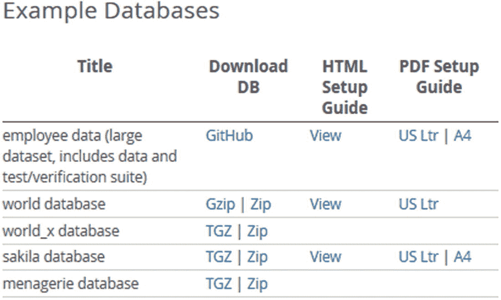
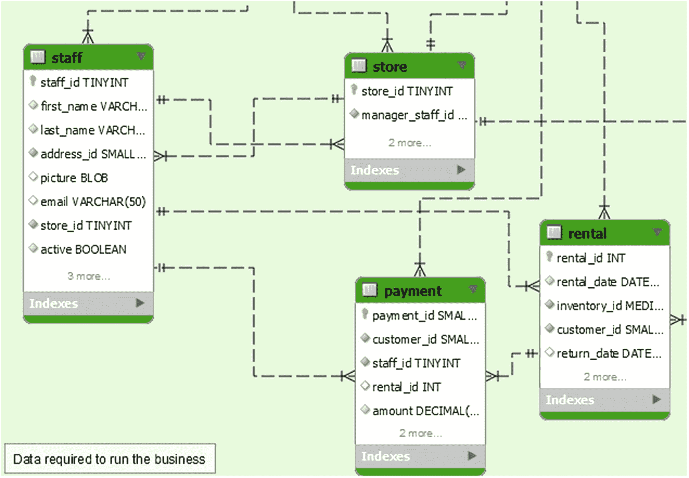
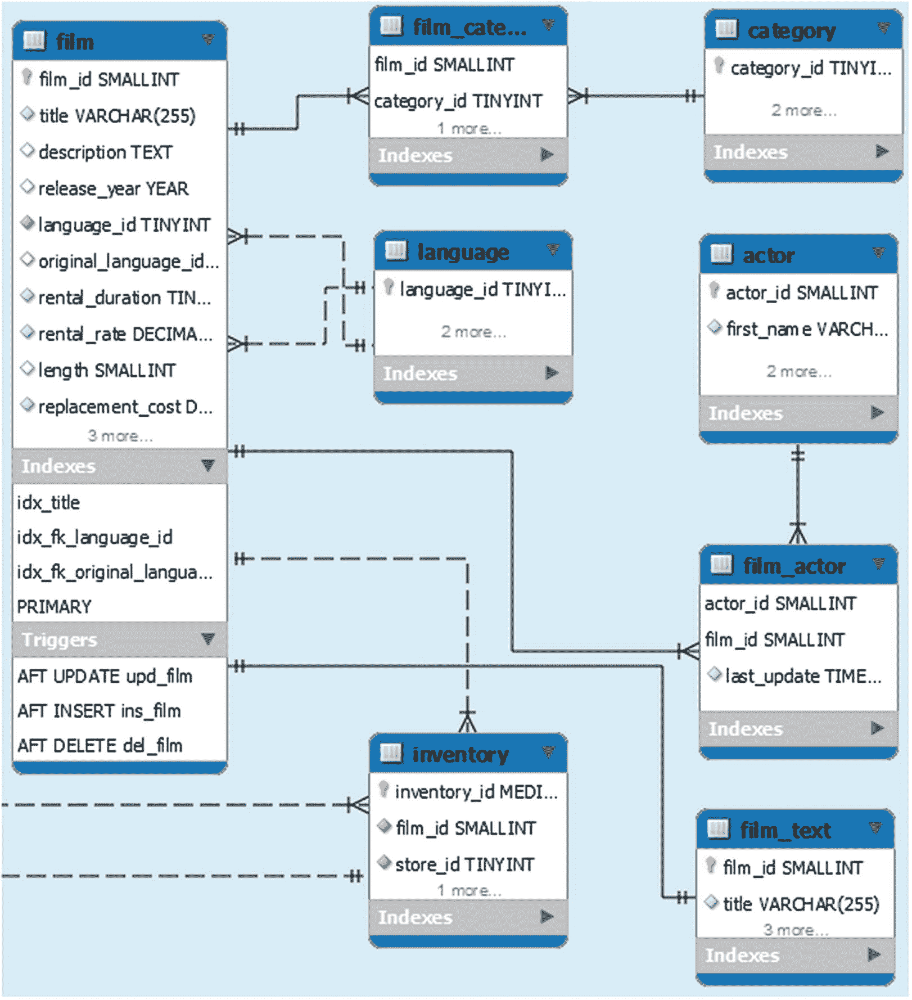
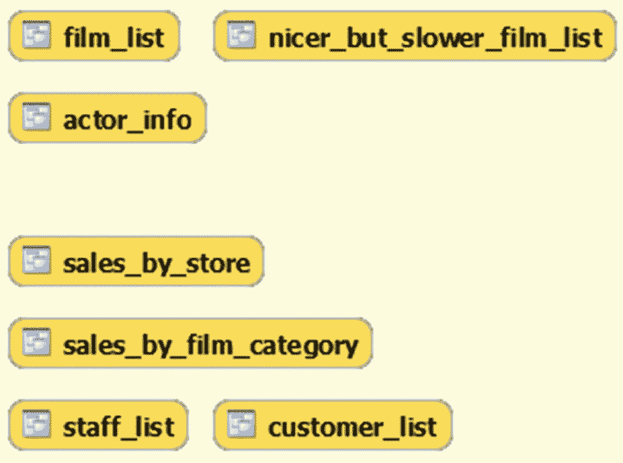
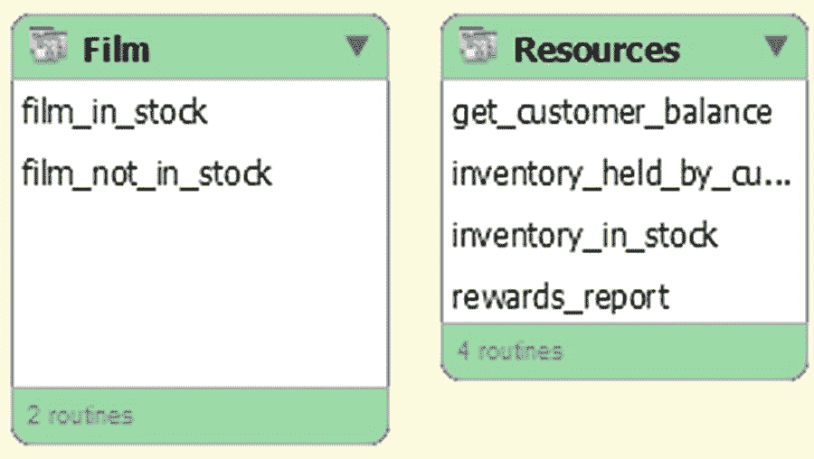

# 4.测试数据

测试是性能调优工作中非常重要的一部分，因为在将更改应用到生产系统之前，验证这些更改是否有效非常重要。验证您的更改的最佳数据与您的生产数据密切相关；然而，为了探索 MySQL 是如何工作的，使用一些通用的测试数据会更好。本章介绍了四个带有安装说明的标准数据集，以及其他一些可用的数据集。

Tip

在本书的剩余部分中，`world`、`world_x`和`sakila`数据库被用作测试数据。

但是，首先，您需要知道如何下载数据库。

## 下载示例数据库

本章详细讨论的示例数据库的共同点是，它们可以从 [`https://dev.mysql.com/doc/index-other.html`](https://dev.mysql.com/doc/index-other.html) 下载，或者有一个可以下载它们的链接。对于几个数据库，也有在线文档和 PDF 文件从这个页面链接。页面相关部分如图 [4-1](#Fig1) 所示。



图 4-1

包含示例数据库链接的表

员工数据(`employees`数据库)是从朱塞佩·马霞(也被称为 Data Charmer)的 GitHub 存储库下载的，而其他数据库是从甲骨文的 MySQL 网站下载的。与雇员数据一起下载的还包括一个`sakila`数据库的副本。对于雇员数据、`world`数据库和`sakila`数据库，也有可用的文档。

Note

如果您没有使用最新版本的数据，则在安装测试数据库时，您可能会看到关于不推荐使用的功能的警告。您可以忽略这些警告，但是，建议您获取最新版本的数据。

`menagerie`数据库是一个很小的两表数据库，总共不到 20 行，是为 MySQL 手册中的教程部分创建的。不再赘述。

## 世界数据库

`world`样本数据库是简单测试中最常用的数据库之一。它由三个有几百到几千行的表组成。这使它成为一个小数据集，这意味着它甚至可以很容易地用于小的测试实例。

### 计划

数据库由`city`、`country`和`countrylanguage`表组成。表格之间的关系如图 [4-2](#Fig2) 所示。


图 4-2

`world`数据库

`country`表包含关于 239 个国家的信息，并作为来自`city`和`countrylanguage`表的外键的父表。数据库中总共有 4079 个城市和 984 种国家和语言组合。

### 装置

下载的文件由一个名为`world.sql.gz`或`world.sql.zip`的文件组成，这取决于您选择的是 Gzip 还是 zip 链接。在这两种情况下，下载的档案包含一个文件`world.sql`。数据的安装非常简单，只需执行脚本即可。

如果您将 MySQL Shell 与 2020 年 1 月左右或之前的世界数据库副本一起使用，您将需要使用传统协议，因为 X 协议(默认)要求 UTF-8，而世界数据库使用拉丁 1。您使用`\source`命令从 MySQL Shell 加载数据:

```
MySQL [localhost ssl] SQL> \source world.sql

```

如果您使用传统的`mysql`命令行客户端，请使用`SOURCE`命令:

```
mysql> SOURCE world.sql

```

在这两种情况下，如果`world.sql`文件不在您启动 MySQL Shell 或`mysql`的目录中，请添加该文件的路径。

一个相关的数据库是`world_x`，它包含与`world`相同的数据，但是它的组织方式不同。

## 世界 x 数据库

MySQL 8 增加了对 MySQL Document Store 的支持，它支持以 JavaScript Object Notation (JSON)文档的形式存储和检索数据。`world_x`数据库将一些数据存储在 JSON 文档中，为您提供一个测试数据库，可以很容易地用于包含使用 JSON 的测试。

### 计划

`world_x`数据库包括与`world`数据库相同的三个表，尽管列略有不同，例如，`city`表包括 JSON 列`Info`和人口，而不是`Population`列，并且`country`表省略了几个列。取而代之的是`countryinfo`表，这是一个纯文档存储类型的表，其中的信息是从`country`表中删除的。模式图如图 [4-3](#Fig3) 所示。


图 4-3

`world_x`数据库

虽然`city`和`countryinfo`表中没有外键，但是可以分别使用`CountryCode`列和`doc->>'$.Code'`值将它们连接到`country`表。`countryinfo`表的`_id`列是一个存储生成列的例子，其中的值是从 JSON 文档的`doc`列中提取的。

### 装置

`world_x`数据库的安装与`world`数据库非常相似。你可以下载`world_x-db.tar.gz`或者`world_x-db.zip`文件并解压。提取的文件包括一个名为`world_x.sql`的文件和一个`README`文件。`world_x.sql`文件包括创建模式所需的所有语句。

由于`world_x`模式使用 UTF-8，您可以使用任何一种 MySQL 协议来安装它。例如，使用 MySQL Shell:

```
MySQL [localhost+ ssl] SQL> \source world_x.sql

```

如果`world_x.sql`文件不在当前目录中，则添加其路径。

`world`和`world_x`数据库非常简单，易于使用；然而，有时你会需要一些稍微复杂一点的东西，而`sakila`数据库可以提供这些东西。

## 萨基拉数据库

`sakila`数据库是一个真实的数据库，它包含一个电影租赁业务的模式，其中包含关于电影、库存、商店、员工和客户的信息。它添加了一个全文索引、一个空间索引、视图和存储程序，以提供一个使用 MySQL 特性的更完整的示例。数据库大小仍然非常适中，适合小型实例。

### 计划

`sakila`数据库由 16 个表、7 个视图、3 个存储过程、3 个存储函数和 6 个触发器组成。这些表可以分为三组，客户数据、业务和库存。为了简洁起见，图中没有包括所有的列，大多数索引也没有显示。图 [4-4](#Fig4) 显示了表格、视图和存储程序的完整概览。


图 4-4

`sakila`数据库概述

包含客户相关数据的表格(加上员工和商店的地址)位于左上角的区域。左下角的区域包含与业务相关的数据，右上角的区域包含关于电影和库存的信息。右下角用于视图和存储的程序。

Tip

您可以通过在 MySQL Workbench 中打开安装中包含的`sakila.mwb`文件来查看整个图表(尽管格式不同)。这也是一个很好的例子，说明如何在 MySQL Workbench 中使用增强的实体关系(EER)图来记录您的模式。

由于对象的数量相对较多，所以在讨论模式时，将它们分成五组(每个表组、视图和存储例程)。第一组是客户相关数据，表格如图 [4-5](#Fig5) 所示。


图 4-5

`sakila`数据库中包含客户数据的表格

有四个表包含与客户相关的数据。`customer`表是主表，地址信息存储在`address`、`city`和`country`表中。

客户和业务组之间存在外键，外键从业务组的`customer`表指向`store`表。业务组中的表还有四个外键指向`address`和`customer`表。业务群如图 [4-6](#Fig6) 所示。



图 4-6

`sakila`数据库中包含业务数据的表

业务表包含关于商店、员工、租金和付款的信息。`store`和`staff`表有两个方向的外键，员工属于一个商店，而商店的经理是员工的一部分。租金和付款由员工处理，因此与商店间接相关，付款是为了租金。

表的业务组是与其它组关系最密切的组。`staff`和`store`表有`address`表的外键，而`rental`和`payment`表引用客户。最后，`rental`表有一个外键指向库存组中的`inventory`表。库存组的示意图如图 [4-7](#Fig7) 所示。



图 4-7

`sakila`数据库中包含库存数据的表格

库存组中的主表是`film`表，它包含关于商店提供的电影的元数据。此外，还有一个带有标题和描述的`film_text`表，带有全文索引。

在`film`和`category`以及`actor`表之间存在多对多的关系。最后，在业务组中有一个从`inventory`表到`store`表的外键。

这涵盖了`sakila`数据库中的所有表格，但也有一些如图 [4-8](#Fig8) 所示的视图。



图 4-8

`sakila`数据库中的视图

这些视图可以像报告一样使用，并且可以分为两类。`film_list`、`nicer_but_slower_film_list`和`actor_info`视图与存储在数据库中的电影相关。第二类包含与`sales_by_store`、`sales_by_film_category`、`staff_list`和`customer_list`视图中的商店相关的信息。

为了完善数据库，还有如图 [4-9](#Fig9) 所示的存储函数和过程。



图 4-9

存储在`sakila`数据库中的程序

`film_in_stock()`和`film_not_in_stock()`过程返回一个结果集，该结果集由给定电影和商店的库存 id 组成，基于电影是否有库存。找到的库存条目总数作为 out 参数返回。`rewards_report()`程序根据上个月的最低花费生成一份报告。

`get_customer_balance()`函数返回给定客户在给定数据上的余额。剩下的两个函数检查一个库存 id 的状态，其中`inventory_held_by_customer()`返回当前租赁该商品的客户的客户 id(如果没有客户租赁该商品，则返回`NULL`)，如果您想检查给定的库存 id 是否有库存，可以使用`inventory_in_stock()`函数。

### 装置

下载的文件展开到一个包含三个文件的目录中，其中两个文件创建模式和数据，最后一个文件包含 MySQL Workbench 使用的格式的 ETL 图。

Note

本节和本书后面的例子使用了从 MySQL 主页下载的`sakila`数据库的副本。

这些文件是

*   `sakila-data.sql` **:** 填充表格所需的`INSERT`语句以及触发器定义。

*   `sakila-schema.sql` **:** 模式定义语句。

*   `sakila.mwb`**:**MySQL 工作台 ETL 图。这类似于图 [4-4](#Fig4) 所示，细节如图 [4-5](#Fig5) 至 [4-9](#Fig9) 所示。

通过首先获取`sakila-schema.sql`文件，然后获取`sakila-data.sql`文件来安装`sakila`数据库。例如，下面是使用 MySQL Shell:

```
MySQL [localhost+ ssl] SQL> \source sakila-schema.sql
MySQL [localhost+ ssl] SQL> \source sakila-data.sql

```

如果文件不在当前目录中，请添加文件的路径。

到目前为止，这三个数据集的共同点是它们包含的数据很少。虽然在许多情况下这是一个很好的特性，因为它使工作变得更容易，但是在某些情况下，您需要更多的数据来研究查询计划中的差异。`employees`数据库是一个具有更多数据的选项。

## 雇员数据库

`employees`数据库(在 MySQL 文档下载页面上称为雇员数据；GitHub 知识库的名字是`test_db`)最初是由王辅生和卡洛·扎尼奥洛创建的，是 MySQL 主页上链接的最大的测试数据集。对于非分区版本，数据文件的总大小约为 180 MiB，对于分区版本，约为 440 MiB。

### 计划

`employees`数据库由六个表和两个视图组成。您可以选择再安装两个视图、五个存储函数和两个存储过程。表格如图 [4-10](#Fig10) 所示。


图 4-10

`employees`数据库中的表格、视图和例程

可以选择让`salaries`和`titles`表按照`from_date`列的年份进行分区，如清单 [4-1](#PC5) 所示。

```
PARTITION BY RANGE  COLUMNS(from_date)
(PARTITION p01 VALUES LESS THAN ('1985-12-31') ENGINE = InnoDB,
 PARTITION p02 VALUES LESS THAN ('1986-12-31') ENGINE = InnoDB,
 PARTITION p03 VALUES LESS THAN ('1987-12-31') ENGINE = InnoDB,
 PARTITION p04 VALUES LESS THAN ('1988-12-31') ENGINE = InnoDB,
 PARTITION p05 VALUES LESS THAN ('1989-12-31') ENGINE = InnoDB,
 PARTITION p06 VALUES LESS THAN ('1990-12-31') ENGINE = InnoDB,
 PARTITION p07 VALUES LESS THAN ('1991-12-31') ENGINE = InnoDB,
 PARTITION p08 VALUES LESS THAN ('1992-12-31') ENGINE = InnoDB,
 PARTITION p09 VALUES LESS THAN ('1993-12-31') ENGINE = InnoDB,
 PARTITION p10 VALUES LESS THAN ('1994-12-31') ENGINE = InnoDB,
 PARTITION p11 VALUES LESS THAN ('1995-12-31') ENGINE = InnoDB,
 PARTITION p12 VALUES LESS THAN ('1996-12-31') ENGINE = InnoDB,
 PARTITION p13 VALUES LESS THAN ('1997-12-31') ENGINE = InnoDB,
 PARTITION p14 VALUES LESS THAN ('1998-12-31') ENGINE = InnoDB,
 PARTITION p15 VALUES LESS THAN ('1999-12-31') ENGINE = InnoDB,
 PARTITION p16 VALUES LESS THAN ('2000-12-31') ENGINE = InnoDB,
 PARTITION p17 VALUES LESS THAN ('2001-12-31') ENGINE = InnoDB,
 PARTITION p18 VALUES LESS THAN ('2002-12-31') ENGINE = InnoDB,
 PARTITION p19 VALUES LESS THAN (MAXVALUE) ENGINE = InnoDB)

Listing 4-1The optional partitioning of the salaries and titles tables

```

表 [4-1](#Tab1) 显示了`employees`数据库中表的行数和表空间文件的大小(请注意，当您加载数据时，大小可能会稍有变化)。该大小假定您加载了未分区的数据；分区表有点大。

表 4-1

`employees`数据库中每个表的大小

<colgroup><col class="tcol1 align-left"> <col class="tcol2 align-right"> <col class="tcol3 align-right"></colgroup> 
| 

桌子

 | 

行数

 | 

表空间大小

 |
| --- | --- | --- |
| `departments` | nine | 128 kiB |
| `dept_emp` | Three hundred and thirty-one thousand six hundred and three | 25600 千桶 |
| `dept_manager` | Twenty-four | 128 kiB |
| `employees` | Three hundred thousand and twenty-four | 22528 kiB |
| `salaries` | Two million eight hundred and forty-four thousand and forty-seven | 106496 kiB |
| `titles` | Four hundred and forty-three thousand three hundred and eight | 27648 kiB |

按照今天的标准，它仍然是一个相对较小的数据量，但是它足够大，您可以开始看到不同查询计划的一些性能差异。

图 [4-11](#Fig11) 总结了视图和程序。


图 4-11

`employees`数据库中的视图和例程

`dept_emp_latest_date`和`current_dept_emp`视图与表格一起安装，而其余的对象分别安装在`objects.sql`文件中。存储程序自带内置帮助，可通过使用`employees_usage()`功能或`employees_help()`程序获得。后者如清单 [4-2](#PC6) 所示。

```
mysql> CALL employees_help()\G
*************************** 1\. row ***************************
info:
    == USAGE ==
    ====================

    PROCEDURE show_departments()

        shows the departments with the manager and
        number of employees per department

    FUNCTION current_manager (dept_id)

        Shows who is the manager of a given departmennt

    FUNCTION emp_name (emp_id)

        Shows name and surname of a given employee

    FUNCTION emp_dept_id (emp_id)

        Shows the current department of given employee

1 row in set (0.00 sec)

Query OK, 0 rows affected (0.02 sec)

Listing 4-2The built-in help for the stored routines in the employees database

```

### 装置

您可以下载一个包含安装所需文件的 ZIP 文件，也可以在 [`https://github.com/datacharmer/test_db`](https://github.com/datacharmer/test_db) 克隆 GitHub 库。在撰写本文时，只有一个名为`master`的分支。如果你已经下载了 ZIP 文件，它会解压到一个名为`test_db-master`的目录中。

有几个文件。在 MySQL 8 中与安装`employees`数据库相关的两个是`employees.sql`和`employees_partitioned.sql`。区别在于`salaries`和`titles`表是否被分区。(还有针对 MySQL 5.1 的`employees_partitioned_5.1.sql`，其中不支持`employees_partitioned.sql`中使用的分区方案。)

通过使用`SOURCE`命令获取`.dump`文件来加载数据。在撰写本文时，MySQL Shell 不支持`SOURCE`命令，因此您需要使用遗留的`mysql`命令行客户端来导入数据。转到源文件所在的目录，根据您是否想要使用分区，选择`employees.sql`或`employees_partitioned.sql`文件，例如:

```
mysql> SOURCE employees.sql

```

导入需要一点时间，并通过显示花费的时间来完成:

```
+---------------------+
| data_load_time_diff |
+---------------------+
| 00:01:51            |
+---------------------+
1 row in set (0.44 sec)

```

或者，您可以通过获取`objects.sql`文件来加载一些额外的视图和存储的例程:

```
mysql> SOURCE objects.sql

```

除了这里讨论的数据集之外，还有其他一些选择来获取示例数据。

## 其他数据库

可能会发生这样的情况，您需要执行测试，这些测试需要的数据有一些需求是到目前为止所讨论的标准示例数据库无法满足的。幸运的是，还有其他选择。

Tip

不要忽视创建您自己的定制示例数据库的可能性，例如，通过对您的生产数据使用数据屏蔽。

如果你正在寻找一个非常大的真实世界的例子，那么你可以在 [`https://en.wikipedia.org/wiki/Wikipedia:Database_download`](https://en.wikipedia.org/wiki/Wikipedia:Database_download) 下载维基百科数据库。2019 年 9 月 20 日起的英文维基百科转储，bzip2 压缩 XML 格式，16.3 GiB。

如果您正在寻找 JSON 数据，那么一个选项是来自美国地质调查局(USGS)的地震信息，该信息以 GeoJSON 格式提供，可以下载过去一小时、一天、一周或一个月的地震信息，可以根据地震强度进行筛选。可以在 [`https://earthquake.usgs.gov/earthquakes/feed/v1.0/geojson.php`](https://earthquake.usgs.gov/earthquakes/feed/v1.0/geojson.php) 找到格式描述和提要链接。由于数据包含 GeoJSON 格式的地理信息，因此对于需要空间索引的测试非常有用。

前一章描述的基准工具也包括测试数据或者支持创建测试数据。这些数据也可能对您自己的测试有用。

如果您搜索互联网，还可以找到其他示例数据库。最后，要考虑的重要事情是数据对于您的测试是否有合适的大小，以及它是否使用了您需要的特性。

## 摘要

本章介绍了四个标准示例数据库和一些其他的测试数据示例。讨论的四个标准数据库是`world`、`world_x`、`sakila`和`employees`。这些都可以在 [`https://dev.mysql.com/doc/index-other.html`](https://dev.mysql.com/doc/index-other.html) 通过 MySQL 手册找到。除`employees`外，这些数据库用于本书中的示例，除非另有说明。

`world`和`world_x`数据库是最简单的，区别在于`world_x`使用 JSON 来存储一些信息，而`world`数据库是纯关系型的。这些数据库不包含太多的数据，但是由于它们的小尺寸和简单性，它们对于简单的测试和例子是有用的。特别是`world`数据库在本书中被广泛使用。

`sakila`数据库有一个更复杂的模式，包括不同的索引类型、视图和存储例程。这使得它更现实，并允许更复杂的测试。然而，数据的大小仍然足够小，甚至可以在小型 MySQL 实例上使用。它在本书中也被广泛使用。

`employees`数据库的模式在复杂性上介于`world`和`sakila`数据库之间，但是有更多的数据，这使得它更适合测试各种查询计划之间的差异。如果您需要在实例上生成一些负载，例如使用表扫描，这也很有用。本书中没有直接使用`employees`数据库，但是如果您想要重现一些需要加载的示例，那么这是四个标准测试数据库中最好的一个。

您不应该限制自己去考虑标准的测试数据库。您可以创建自己的数据库，使用基准工具创建一个，或者在互联网上查找可用的数据。维基百科的数据库和美国地质调查局(USGS)的地震数据都是可以下载的数据。

这就完成了 MySQL 查询性能调优的介绍。第二部分从性能模式开始，介绍了与诊断性能问题相关的常见信息源。