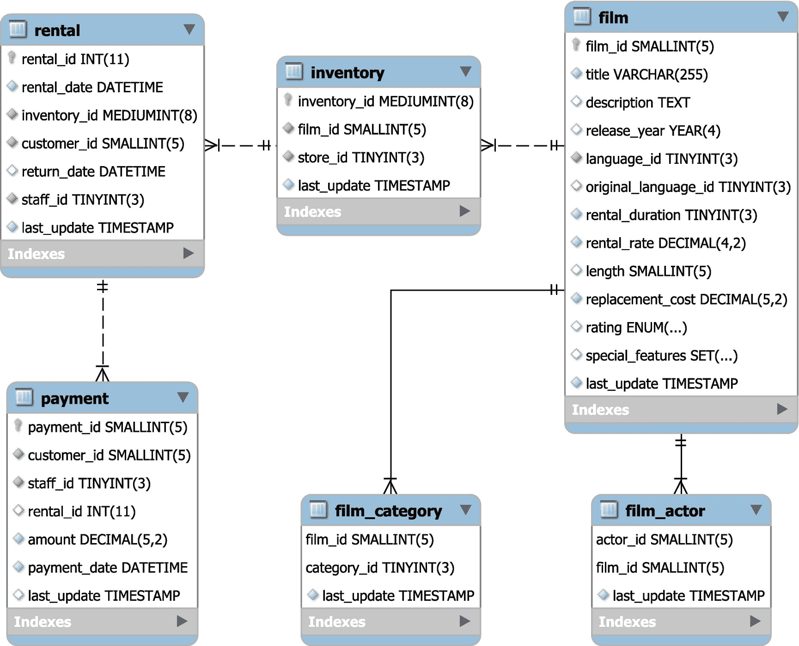

# 7.信息图式

当您需要优化查询时，通常需要关于模式、索引等的信息。在这种情况下，信息模式是一个很好的数据资源。本章介绍了信息模式以及它包含的视图的概述。在本书的其余部分，信息模式被多次使用。

## 什么是信息模式？

信息模式是几个关系数据库通用的模式，包括 MySQL，它是在 MySQL 5.0 中添加的。MySQL 基本上遵循 SQL:2003 标准的 *F021 基本信息模式*，进行了必要的修改以反映 MySQL 的独特特性，并添加了不属于该标准的其他视图。

Note

信息模式是虚拟的，因为其中没有存储任何数据。因此，本章将所有视图和表格都称为视图，即使`SHOW CREATE TABLE`将其显示为常规表格。这也符合将所有对象的表格类型设置为`SYSTEM VIEW`的`information_schema.TABLES`视图。

在 MySQL 5.5 中引入性能模式后，目标是通过信息模式使相对静态的数据(如模式信息)和属于性能模式的更不稳定的数据可用。也就是说，并不总是很清楚什么属于哪里，例如，索引统计相对不稳定，但也是模式信息的一部分。还有一些信息，比如 InnoDB 指标，由于历史原因，仍然存在于信息模式中。

因此，您可以将信息模式视为描述 MySQL 实例的数据集合。在带有关系数据字典的 MySQL 8 中，一些视图是底层数据字典表上的简单 SQL 视图。这意味着 MySQL 8 中许多信息模式查询的性能将大大优于您在旧版本中所体验到的。当查询不需要从存储引擎检索信息的架构数据时，尤其如此。

Caution

如果您仍在使用 MySQL 5.7 或更早的版本，那么在查询信息模式中的视图(如`TABLES`和`COLUMNS`视图)时要小心。如果它们包含数据的表还不在表定义缓存中，或者缓存不够大，无法容纳所有的表，那么它们可能需要很长时间。MySQL 服务器团队在博客中讨论了 MySQL 5.7 和 8 之间信息模式的性能差异的一个例子: [`https://mysqlserverteam.com/mysql-8-0-scaling-and-performance-of-information_schema/`](https://mysqlserverteam.com/mysql-8-0-scaling-and-performance-of-information_schema/) 。

## 特权

信息模式是一个虚拟数据库，对视图的访问与其他表略有不同。所有用户都将看到`information_schema`模式存在，并且他们将看到所有视图。但是，查询视图的结果取决于分配给帐户的权限。例如，一个除了全局`USAGE`权限之外没有其他权限的帐户在查询`information_schema.TABLES`视图时将只能看到信息模式视图。

有些视图需要额外的权限，在这种情况下，会返回一个`ER_SPECIFIC_ACCESS_DENIED_ERROR`(错误号 1227)错误，并描述缺少哪个权限。例如，`INNODB_METRICS`视图需要`PROCESS`权限，因此如果没有`PROCESS`权限的用户查询该视图，就会出现以下错误:

```sql
mysql> SELECT *
         FROM information_schema.INNODB_METRICS;
ERROR: 1227: Access denied; you need (at least one of) the PROCESS privilege(s) for this operation

```

现在，是时候看看在信息模式视图中可以找到什么样的信息了。

## 视图

信息模式中可用的数据范围从关于系统的高级信息到低级 InnoDB 指标。本节提供了这些视图的概述，但不会详细介绍，因为从性能调优的角度来看，最重要的视图将在后面章节的相关部分中讨论。

Note

一些插件将自己的视图添加到信息模式中。这里不考虑额外的插件视图。

### 系统信息

信息模式中最高级别的信息涉及整个 MySQL 实例。这包括诸如哪些字符集可用以及安装了哪些插件之类的信息。

表 [7-1](#Tab1) 总结了包含系统信息的视图。

表 7-1

包含系统信息的信息架构视图

<colgroup><col class="tcol1 align-left"> <col class="tcol2 align-left"></colgroup> 
| 

视图名称

 | 

描述

 |
| --- | --- |
| `CHARACTER_SETS` | 可用的字符集。 |
| `COLLATIONS` | 每个字符集可用的排序规则。这包括排序规则的 id，它在某些情况下(例如，在二进制日志中)用于唯一地指定排序规则和字符集。 |
| `COLLATION_CHARACTER_SET_APPLICABILITY` | 排序规则到字符集的映射(与`COLLATIONS`的前两列相同)。 |
| `ENGINES` | 已知的存储引擎以及它们是否已加载。 |
| `INNODB_FT_DEFAULT_STOPWORD` | 在 InnoDB 表上创建全文索引时使用的默认停用词列表。 |
| `KEYWORDS` | MySQL 中的关键字列表以及该关键字是否被保留。 |
| `PLUGINS` | MySQL 已知的插件，包括状态。 |
| `RESOURCE_GROUPS` | 线程用来完成其工作的资源组。资源组指定线程的优先级以及它可以使用的 CPU。 |
| `ST_SPATIAL_REFERENCE_SYSTEMS` | 空间参考系统列表，包括包含用于指定空间列参考系统的 id 的`SRS_ID`列。 |

与系统相关的视图主要作为参考视图，`RESOURCE_GROUPS`表略有不同，因为可以添加资源组，这将在第 [17 章](17.html)中讨论。

例如，`KEYWORDS`视图在测试升级时非常有用，因为您可以使用它来验证您的模式、表、列、例程或参数名称是否与新版本中的关键字匹配。如果是这种情况，您将需要更新应用以引用标识符，如果还没有这样做的话。要查找与关键字匹配的所有列名:

```sql
SELECT TABLE_SCHEMA, TABLE_NAME,
       COLUMN_NAME, RESERVED
  FROM information_schema.COLUMNS
       INNER JOIN information_schema.KEYWORDS
          ON KEYWORDS.WORD = COLUMNS.COLUMN_NAME
 WHERE TABLE_SCHEMA NOT IN ('mysql',
                            'information_schema',
                            'performance_schema',
                            'sys'
                           )
 ORDER BY TABLE_SCHEMA, TABLE_NAME, COLUMN_NAME;

```

该查询使用`COLUMNS`视图来查找除系统模式之外的所有列名(如果您在应用或脚本中使用它们，您可以选择包含它们)。`COLUMNS`视图是描述模式对象的几个视图之一。

### 模式信息

包含模式对象信息的视图是信息模式中最有用的视图。这些也是几个`SHOW`语句的来源。您可以使用视图来查找从存储例程的参数到数据库名称的所有信息。表 [7-2](#Tab2) 总结了包含模式信息的视图。

表 7-2

具有架构信息的信息架构视图

<colgroup><col class="tcol1 align-left"> <col class="tcol2 align-left"></colgroup> 
| 

视图名称

 | 

描述

 |
| --- | --- |
| `CHECK_CONSTRAINTS` | 该视图包含关于`CHECK`约束的信息，在 MySQL 8.0.16 和更高版本中可用。 |
| `COLUMN_STATISTICS` | 直方图的定义，包括统计数据。对于查询性能调优来说，这是一个非常有用的视图。 |
| `COLUMNS` | 列定义。 |
| `EVENTS` | 存储事件的定义。 |
| `FILES` | 关于 InnoDB 表空间文件的信息。 |
| `INNODB_COLUMNS` | InnoDB 表中列的元数据信息。 |
| `INNODB_DATAFILES` | 该视图将 InnoDB 表空间 id 链接到文件系统路径。 |
| `INNODB_FIELDS` | InnoDB 索引中包含的列的元数据。 |
| `INNODB_FOREIGN` | InnoDB 外键的元数据。 |
| `INNODB_FOREIGN_COLS` | 列出 InnoDB 外键的子列和父列。 |
| `INNODB_FT_BEING_DELETED` | 在针对在`innodb_ft_aux_table`选项中指定的 InnoDB 表的`OPTIMIZE TABLE`语句期间，`INNODB_FT_DELETED`视图的快照。 |
| `INNODB_FT_CONFIG` | 在`innodb_ft_aux_table`选项中指定的 InnoDB 表上全文索引的配置信息。 |
| `INNODB_FT_DELETED` | 从在`innodb_ft_aux_table`选项中指定的 InnoDB 表的全文索引中删除的行。出于性能原因，InnoDB 使用这个额外的列表来避免为每个 DML 语句更新索引本身。 |
| `INNODB_FT_INDEX_CACHE` | 在`innodb_ft_aux_table`选项中指定的 InnoDB 表的全文索引中新插入的行。出于性能原因，InnoDB 使用这个额外的列表来避免为每个 DML 语句更新索引本身。 |
| `INNODB_FT_INDEX_TABLE` | 在`innodb_ft_aux_table`选项中指定的 InnoDB 表的反向全文索引。 |
| `INNODB_INDEXES` | 关于 InnoDB 表上的索引的信息。这包括内部信息，如根页面的页码和合并阈值。 |
| `INNODB_TABLES` | InnoDB 表的元数据。 |
| `INNODB_TABLESPACES` | InnoDB 表空间的元数据。 |
| `INNODB_TABLESPACES_BRIEF` | 该视图将来自`INNODB_TABLESPACES`的`SPACE`、`NAME`、`FLAG`和`SPACE_TYPE`列与来自`INNODB_DATAFILES`的`PATH`列组合在一起，以提供 InnoDB 表空间的摘要。 |
| `INNODB_TABLESTATS` | InnoDB 表的表统计信息。其中一些统计数据与索引统计数据同时更新；其他的是持续维护的。 |
| `INNODB_TEMP_TABLE_INFO` | InnoDB 临时表的元数据(内部的和显式的)。 |
| `INNODB_VIRTUAL` | InnoDB 表上虚拟生成的列的内部元数据信息。 |
| `KEY_COLUMN_USAGE` | 关于主键、唯一键和外键的信息。 |
| `PARAMETERS` | 关于存储函数和存储过程的参数的信息。 |
| `PARTITIONS` | 关于表分区的信息。 |
| `REFERENTIAL_CONSTRAINTS` | 关于外键的信息。 |
| `ROUTINES` | 存储函数和存储过程的定义。 |
| `SCHEMATA` | 关于模式(数据库)的信息。(从技术上讲，Schemata 是模式复数形式的正确词汇，但现在大多数人都使用模式。) |
| `ST_GEOMETRY_COLUMNS` | 关于具有空间数据类型的列的信息。 |
| `STATISTICS` | 索引定义和统计。谈到查询性能调整，这是最有用的视图之一。 |
| `TABLE_CONSTRAINTS` | 主键、唯一键、外键和`CHECK`约束的概要。 |
| `TABLES` | 关于表和视图及其属性的信息。 |
| `TABLESPACES` | 此视图仅用于 NDB 集群表空间。 |
| `TRIGGERS` | 触发器定义。 |
| `VIEW_ROUTINE_USAGE` | 列出视图中使用的存储函数。该表是在 8.0.13 中添加的。 |
| `VIEW_TABLE_USAGE` | 列出视图引用的表。该视图是在 8.0.13 中添加的。 |
| `VIEWS` | 视图定义。 |

有几个视图是密切相关的，例如，列在模式中的表中，约束引用表和列。这意味着一些列名出现在几个视图中。与这些视图相关的最常用的列名是

*   `TABLE_NAME` **:** 用于不特定于 InnoDB 的视图中的表名。

*   `TABLE_SCHEMA` **:** 用于不特定于 InnoDB 的视图中的模式名。

*   `COLUMN_NAME` **:** 用于不特定于 InnoDB 的视图中的列名。

*   `SPACE` **:** 用于 InnoDB 特定视图中的表空间 id。

*   `TABLE_ID` **:** 用于特定于 InnoDB 的视图中，以唯一地标识表格。这也在 InnoDB 内部使用。

*   `NAME` **:** 特定于 InnoDB 的视图使用一个名为`NAME`的列来给出对象的名称，而不考虑对象的类型。

除了使用此列表中的名称之外，还有一些示例对这些列名进行了细微的修改，如在视图 KEY_COLUMN_USAGE 中，您可以找到外键描述中使用的列 REFERENCED_TABLE_SCHEMA、REFERENCED_TABLE_NAME 和 REFERENCED_COLUMN_NAME。例如，如果要使用 KEY_COLUMN_USAGE 视图来查找外键引用 sakila.film 表的表，可以使用如下查询:

```sql
mysql> SELECT TABLE_SCHEMA, TABLE_NAME
    FROM information_schema.KEY_COLUMN_USAGE

    WHERE REFERENCED_TABLE_SCHEMA = 'sakila'
        AND REFERENCED_TABLE_NAME = 'film';
+--------------+---------------+
| TABLE_SCHEMA | TABLE_NAME    |
+--------------+---------------+
| sakila       | film_actor    |
| sakila       | film_category |
| sakila       | inventory     |
+--------------+---------------+
3 rows in set (0.0078 sec)

```

这表明 film_actor、film_category 和 inventory 表都有外键，其中 film 表是父表。例如，如果您查看 film_actor 的表定义:

```sql
mysql> SHOW CREATE TABLE sakila.film_actor\G
*************************** 1\. row ***************************
       Table: film_actor
Create Table: CREATE TABLE `film_actor` (
  `actor_id` smallint(5) unsigned NOT NULL,
  `film_id` smallint(5) unsigned NOT NULL,
  `last_update` timestamp NOT NULL DEFAULT CURRENT_TIMESTAMP ON UPDATE CURRENT_TIMESTAMP,
  PRIMARY KEY (`actor_id`,`film_id`),
  KEY `idx_fk_film_id` (`film_id`),
  CONSTRAINT `fk_film_actor_actor` FOREIGN KEY (`actor_id`) REFERENCES `actor` (`actor_id`) ON DELETE RESTRICT ON UPDATE CASCADE,
  CONSTRAINT `fk_film_actor_film` FOREIGN KEY (`film_id`) REFERENCES `film` (`film_id`) ON DELETE RESTRICT ON UPDATE CASCADE
) ENGINE=InnoDB DEFAULT CHARSET=utf8
1 row in set (0.0097 sec)

```

`fk_film_actor_film`约束引用胶片表中的`film_id`列。您可以将此作为查找外键完整链的起点，方法是针对`KEY_COLUMN_USAGE`视图对查询中返回的每个表手动执行查询，或者创建一个递归公用表表达式(CTE)。这是留给读者的一个练习。

Tip

关于在递归公用表表达式中使用`KEY_COLUMN_USAGE`视图查找外键依赖链的示例，请参见 [`https://mysql.wisborg.dk/tracking-foreign-keys`](https://mysql.wisborg.dk/tracking-foreign-keys) 。

为了完整起见，通过外键依赖于`film`表的表的可视化表示可以在图 [7-1](#Fig1) 中找到。



图 7-1

来自`sakila.film`的外部密钥链的可视化表示

图表是使用 MySQL Workbench 的逆向工程特性创建的。

包含特定于 InnoDB 的信息的视图使用`SPACE`和`TABLE_ID`来标识表空间和表。每个表空间都有一个唯一的 id，其范围是为不同的表空间类型保留的。例如，数据字典表空间文件(`<datadir>/mysql.ibd`)的空间 id 为 4294967294，临时表空间的 id 为 4294967293，还原日志表空间从 4294967279 开始并递减，用户表空间从 1 开始。

包含 InnoDB 全文索引信息的视图很特殊，因为它们要求您用您想要获取信息的表的名称来设置`innodb_ft_aux_table`全局变量。例如，要获得`sakila.film_text`表的全文索引配置:

```sql
mysql> SET GLOBAL innodb_ft_aux_table = 'sakila/film_text';
Query OK, 0 rows affected (0.0685 sec)

mysql> SELECT *
         FROM information_schema.INNODB_FT_CONFIG;
+---------------------------+-------+
| KEY                       | VALUE |
+---------------------------+-------+
| optimize_checkpoint_limit | 180   |
| synced_doc_id             | 1002  |
| stopword_table_name       |       |
| use_stopword              | 1     |
+---------------------------+-------+
4 rows in set (0.0009 sec)

```

`INNODB_FT_CONFIG`视图中的值可能因您而异。

InnoDB 还包括带有与性能相关的信息的视图。这些将与其他一些与性能相关的表一起讨论。

### 性能信息

与性能相关的一组视图是您在性能调优工作中可能使用最多的视图，以及前一组视图中的`COLUMN_STATISTICS`和`STATISTICS`视图。带有性能相关信息的视图列于表 [7-3](#Tab3) 中。

表 7-3

具有性能相关信息的信息架构视图

<colgroup><col class="tcol1 align-left"> <col class="tcol2 align-left"></colgroup> 
| 

视图名称

 | 

描述

 |
| --- | --- |
| `INNODB_BUFFER_PAGE` | InnoDB 缓冲池中的页面列表，可用于确定当前缓存了哪些表和索引。**警告:**查询这个表的开销很大，特别是对于大型缓冲池和许多表和索引。它最适用于测试系统。 |
| `INNODB_BUFFER_PAGE_LRU` | 关于 InnoDB 缓冲池中页面的信息，以及它们在最近最少使用(LRU)列表中的排序方式。**警告:**查询这个表的开销很大，特别是对于大型缓冲池和许多表和索引。它最适用于测试系统。 |
| `INNODB_BUFFER_POOL_STATS` | 关于 InnoDB 缓冲池使用情况的统计信息。该信息类似于在`BUFFER POOL AND MEMORY`部分的`SHOW ENGINE INNODB STATUS`输出中可以找到的信息。这是最有用的观点之一。 |
| `INNODB_CACHED_INDEXES` | 每个索引在 InnoDB 缓冲池中缓存的索引页数的摘要。 |
| `INNODB_CMP``INNODB_CMP_RESET` | 与压缩的 InnoDB 表相关的操作的统计信息。 |
| `INNODB_CMP_PER_INDEX``INNODB_CMP_PER_INDEX_RESET` | 与`INNODB_CMP`相同，但按索引分组。 |
| `INNODB_CMPMEM``INNODB_CMPMEM_RESET` | 关于 InnoDB 缓冲池中压缩页面的统计信息。 |
| `INNODB_METRICS` | 类似于全局状态变量，但特定于 InnoDB。 |
| `INNODB_SESSION_TEMP_TABLESPACES` | 元数据包括 InnoDB 临时表空间文件的连接 id、文件路径和大小(在 MySQL 8.0.13 和更高版本中，每个会话都有自己的文件)。它可以用来将一个会话链接到一个表空间文件，如果您注意到一个文件变大了，这将非常有用。该视图是在 8.0.13 中添加的。 |
| `INNODB_TRX` | 关于 InnoDB 交易的信息。 |
| `OPTIMIZER_TRACE` | 当启用优化器跟踪时，可以从该视图中查询跟踪。 |
| `PROCESSLIST` | 同`SHOW PROCESSLIST`。 |
| `PROFILING` | 启用性能分析时，可以从该视图中查询性能分析统计信息。这已被否决，建议改用性能架构。 |

对于包含 InnoDB 压缩表信息的视图，以`_RESET`为后缀的表以增量形式返回自上次查询视图以来的操作和计时统计信息。

`INNODB_METRICS`视图包括类似于全局状态变量但特定于 InnoDB 的指标。度量被分组到子系统中(`SUBSYSTEM`列)，对于每个度量，在`COMMENT`列中有一个度量测量什么的描述。您可以使用全局系统变量启用、禁用和重置指标:

*   `innodb_monitor_disable` **:** 禁用一个或多个度量。

*   `innodb_monitor_enable` **:** 启用一个或多个指标。

*   `innodb_monitor_reset` **:** 重置一个或多个指标的计数器。

*   `innodb_monitor_reset_all` **:** 重置所有统计信息，包括一个或多个度量的计数器、最小值和最大值。

可以根据需要打开和关闭指标，当前状态在`STATUS`列中。您将指标的名称指定为`innodb_monitor_enable`或`innodb_monitor_disable`变量的值，并且可以使用`%`作为通配符。值`all`作为一个特殊值来影响所有指标。清单 [7-1](#PC5) 展示了一个启用和使用所有匹配`%cpu%`的指标的例子(恰好是`cpu`子系统中的指标)。计数器值取决于查询时的工作负载。

```sql
mysql> SET GLOBAL innodb_monitor_enable = '%cpu%';
Query OK, 0 rows affected (0.0005 sec)

mysql> SELECT NAME, COUNT, MIN_COUNT,
              MAX_COUNT, AVG_COUNT,
              STATUS, COMMENT
         FROM information_schema.INNODB_METRICS
        WHERE NAME LIKE '%cpu%'\G
*************************** 1\. row ***************************
     NAME: module_cpu
    COUNT: 0
MIN_COUNT: NULL
MAX_COUNT: NULL
AVG_COUNT: 0
   STATUS: enabled
  COMMENT: CPU counters reflecting current usage of CPU
*************************** 2\. row ***************************
     NAME: cpu_utime_abs
    COUNT: 51
MIN_COUNT: 0
MAX_COUNT: 51
AVG_COUNT: 0.4358974358974359
   STATUS: enabled
  COMMENT: Total CPU user time spent
*************************** 3\. row ***************************
     NAME: cpu_stime_abs
    COUNT: 7
MIN_COUNT: 0
MAX_COUNT: 7
AVG_COUNT: 0.05982905982905983
   STATUS: enabled
  COMMENT: Total CPU system time spent
*************************** 4\. row ***************************
     NAME: cpu_utime_pct
    COUNT: 6
MIN_COUNT: 0
MAX_COUNT: 6
AVG_COUNT: 0.05128205128205128
   STATUS: enabled
  COMMENT: Relative CPU user time spent
*************************** 5\. row ***************************
     NAME: cpu_stime_pct

    COUNT: 0
MIN_COUNT: 0
MAX_COUNT: 0
AVG_COUNT: 0
   STATUS: enabled
  COMMENT: Relative CPU system time spent
*************************** 6\. row ***************************
     NAME: cpu_n
    COUNT: 8
MIN_COUNT: 8
MAX_COUNT: 8
AVG_COUNT: 0.06837606837606838
   STATUS: enabled
  COMMENT: Number of cpus
6 rows in set (0.0011 sec)

mysql> SET GLOBAL innodb_monitor_disable = '%cpu%';
Query OK, 0 rows affected (0.0004 sec)

Listing 7-1Using the INNODB_METRICS view

```

首先，使用`innodb_monitor_enable`变量启用指标；然后检索这些值。除了显示的值，还有一组带`_RESET`后缀的列，当您设置`innodb_monitor_reset`(仅计数器)或`innodb_monitor_reset_all`系统变量时，这些列会被重置。最后，指标再次被禁用。

Caution

这些指标有不同的开销，因此建议您在生产中启用指标之前先测试您的工作负载。

InnoDB 指标也包含在`sys.metrics`视图中，还有全局状态变量和一些其他指标，以及检索指标的时间。

其余的信息模式视图包含关于特权的信息。

### 特权信息

MySQL 使用分配给帐户的特权来确定哪些帐户可以访问哪些模式、表和列。确定给定帐户特权的常用方法是使用`SHOW GRANTS`语句，但是信息模式还包括允许您查询特权的视图。

表 [7-4](#Tab4) 总结了信息模式权限视图。视图按照从全局权限到列权限的顺序排列。

表 7-4

具有特权信息的信息模式表

<colgroup><col class="tcol1 align-left"> <col class="tcol2 align-left"></colgroup> 
| 

表名

 | 

描述

 |
| --- | --- |
| `USER_PRIVILEGES` | 全球特权。 |
| `SCHEMA_PRIVILEGES` | 访问模式的权限。 |
| `TABLE_PRIVILEGES` | 访问表的特权。 |
| `COLUMN_PRIVILEGES` | 访问列的权限。 |

在所有视图中，帐户都被称为`GRANTEE`，其形式为`'username'@'hostname'`，引号始终存在。清单 [7-2](#PC6) 展示了一个检索`mysql.sys@localhost`账户的特权并将其与`SHOW GRANTS`语句的输出进行比较的例子。

```sql
mysql> SHOW GRANTS FOR 'mysql.sys'@'localhost'\G
*************************** 1\. row ***************************
Grants for mysql.sys@localhost: GRANT USAGE ON *.* TO `mysql.sys`@`localhost`
*************************** 2\. row ***************************
Grants for mysql.sys@localhost: GRANT TRIGGER ON `sys`.* TO `mysql.sys`@`localhost`
*************************** 3\. row ***************************
Grants for mysql.sys@localhost: GRANT SELECT ON `sys`.`sys_config` TO `mysql.sys`@`localhost`
3 rows in set (0.2837 sec)

mysql> SELECT *
         FROM information_schema.USER_PRIVILEGES
        WHERE GRANTEE = '''mysql.sys''@''localhost'''\G
*************************** 1\. row ***************************
       GRANTEE: 'mysql.sys'@'localhost'
 TABLE_CATALOG: def
PRIVILEGE_TYPE: USAGE
  IS_GRANTABLE: NO
1 row in set (0.0006 sec)

mysql> SELECT *
         FROM information_schema.SCHEMA_PRIVILEGES
        WHERE GRANTEE = '''mysql.sys''@''localhost'''\G
*************************** 1\. row ***************************
       GRANTEE: 'mysql.sys'@'localhost'
 TABLE_CATALOG: def
  TABLE_SCHEMA: sys
PRIVILEGE_TYPE: TRIGGER
  IS_GRANTABLE: NO
1 row in set (0.0005 sec)

mysql> SELECT *
         FROM information_schema.TABLE_PRIVILEGES
        WHERE GRANTEE = '''mysql.sys''@''localhost'''\G
*************************** 1\. row ***************************
       GRANTEE: 'mysql.sys'@'localhost'
 TABLE_CATALOG: def
  TABLE_SCHEMA: sys
    TABLE_NAME: sys_config
PRIVILEGE_TYPE: SELECT
  IS_GRANTABLE: NO
1 row in set (0.0005 sec)

mysql> SELECT *
         FROM information_schema.COLUMN_PRIVILEGES
        WHERE GRANTEE = '''mysql.sys''@''localhost'''\G
Empty set (0.0005 sec)

Listing 7-2Using the Information Schema privilege views

```

注意用户名和主机名的单引号是如何被双引号转义的。

虽然带有权限信息的视图不能直接用于性能调优，但是它们对于维护稳定的系统非常有用，因为您可以使用它们来轻松识别是否有任何帐户拥有不需要的权限。

Tip

最好的做法是限制帐户只拥有他们需要的特权，不要更多。这是保证系统安全的步骤之一。

关于信息模式要考虑的最后一个主题是如何缓存与索引统计相关的数据。

## 索引统计数据的缓存

理解索引统计相关视图(以及等效的`SHOW`语句)中的信息来自哪里是很重要的。大部分数据来自 MySQL 数据字典。在 MySQL 8 中，数据字典存储在 InnoDB 表中，因此视图只是数据字典之上的普通 SQL 视图。(例如，您可以尝试执行`SHOW CREATE VIEW information_schema.STATISTICS`来获得`STATISTICS`视图的定义。)

然而，索引统计信息本身仍然来自存储引擎层，因此查询这些信息的成本相对较高。为了提高性能，统计数据被缓存在数据字典中。您可以控制在 MySQL 刷新缓存之前允许统计数据存在多长时间。这是通过默认为 86400 秒(一天)的`information_schema_stats_expiry`变量完成的。如果将该值设置为 0，您将始终从存储引擎获得最新的可用值；这相当于 MySQL 5.7 的行为。该变量既可以在全局范围内设置，也可以在会话范围内设置，因此，如果您正在调查一个需要查看当前统计信息的问题，例如，如果优化程序没有使用您期望的索引，您可以将该变量设置为 0。

Tip

使用`information_schema_stats_expiry`变量来控制索引统计信息可以在数据字典中缓存多长时间。这只是为了显示，优化器总是使用最新的统计数据。例如，将`information_schema_stats_expiry`设置为 0 以禁用缓存，这在调查优化器使用错误索引的问题时非常有用。您可以根据需要在全局和会话范围内更改该值。

缓存会影响表 [7-5](#Tab5) 中列出的列。显示相同数据的`SHOW`语句也会受到影响。

表 7-5

受`information_schema_stats_expiry`影响的列

<colgroup><col class="tcol1 align-left"> <col class="tcol2 align-left"> <col class="tcol3 align-left"></colgroup> 
| 

视图名称

 | 

列名

 | 

描述

 |
| --- | --- | --- |
| `STATISTICS` | `CARDINALITY` | 同一行中的列的索引部分的唯一值的估计数。 |
| `TABLES` | `AUTO_INCREMENT` | 表的自动递增计数器的下一个值。 |
| `AVG_ROW_LENGTH` | 估计的数据长度除以估计的行数。 |
| `CHECKSUM` | 表校验和。InnoDB 不使用它，所以值是`NULL`。 |
| `CHECK_TIME` | 上次检查表格的时间(`CHECK TABLE`)。对于分区表，InnoDB 总是返回`NULL`。 |
| `CREATE_TIME` | 创建表的时间。 |
| `DATA_FREE` | 该表所属的表空间中空闲空间量的估计值。对于 InnoDB，这是完全自由的扩展区的大小减去安全余量。 |
| `DATA_LENGTH` | 行数据的估计大小。对于 InnoDB，它是聚集索引的大小，即聚集索引中的页数乘以页面大小。 |
| `INDEX_LENGTH` | 辅助索引的估计大小。对于 InnoDB，这是非聚集索引中的页面总数乘以页面大小。 |
| `MAX_DATA_LENGTH` | 数据长度的最大允许大小。InnoDB 不使用它，所以值是`NULL`。 |
| `TABLE_ROWS` | 估计的行数。对于 InnoDB 表，这来自主键或聚集索引的基数。 |
| `UPDATE_TIME` | 上次更新表空间文件的时间。对于 InnoDB 系统表空间中的表，该值为`NULL`。由于数据是异步写入表空间的，因此时间通常不会反映最后一条更改数据的语句的时间。 |

您可以通过对表执行`ANALYZE TABLE`来强制更新给定表的数据。

有时候，查询数据不会更新缓存的数据:

*   当缓存数据尚未过期时，也就是说，它在不到`information_schema_stats_expiry`秒之前被刷新

*   当`information_schema_stats_expiry`设置为 0 时

*   当 MySQL 或 InnoDB 以只读模式运行时，即当`read_only`、`super_read_only`、`transaction_read_only`或`innodb_read_only`模式之一被启用时。

*   当查询还包括来自性能模式的数据时

## 摘要

本章介绍了信息模式，首先讨论了什么是信息模式以及用户特权是如何工作的。本章的剩余部分介绍了标准视图和缓存的工作原理。信息模式视图可以根据它们包含的信息类型进行分组:系统、模式、性能和特权信息。

系统信息包括字符集和排序规则、资源组、关键字以及与空间数据相关的信息。这是使用参考手册的一种有用的替代方法。

模式信息是最大的一组视图，包括从模式数据到列、索引和约束的所有可用信息。这些视图以及包含度量和 InnoDB 缓冲池统计信息等信息的性能视图是性能调优中最常用的视图。与权限相关的视图不经常用于性能调优，但是它们对于帮助维护稳定的系统非常有用。

从信息模式视图中获取信息的一个常见快捷方式是使用一个`SHOW`语句。这些将在下一章讨论。