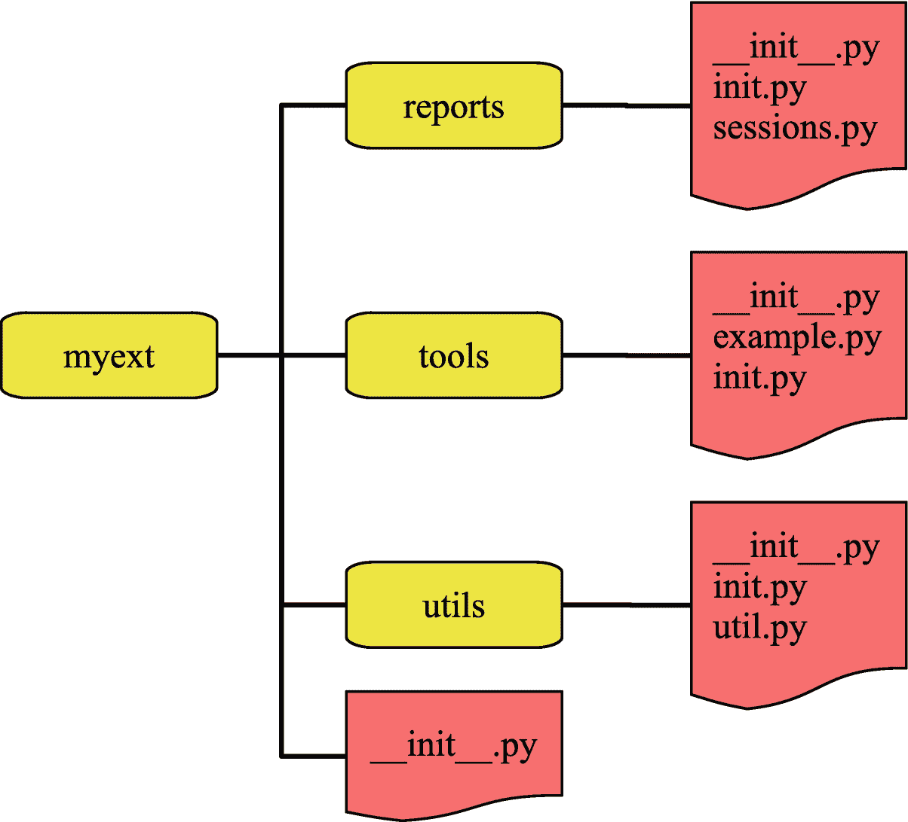

# 12.MySQL Shell

MySQL Shell 是第二代命令行客户端，与传统的`mysql`命令行客户端相比，它支持 X 协议以及 Python 和 JavaScript 语言。它还附带了几个实用程序，并且高度可扩展。这使得它不仅是日常任务的好工具，也是研究性能问题的好工具。

本章首先概述了 MySQL Shell 提供的功能，包括内置的帮助和丰富的提示。本章的第二部分介绍了如何通过使用外部代码模块、报告基础设施和插件来扩展 MySQL Shell 的功能。

## 概观

第一个正式发布的 MySQL Shell 版本是在 2017 年，所以它仍然是 MySQL 工具箱中非常新的工具。然而，它已经有了一大堆远远超过传统的`mysql`命令行客户端的功能。这些特性并不局限于使用 MySQL Shell 作为 MySQL InnoDB 集群解决方案的一部分所需的特性；还有几个特性对于日常数据库管理任务和性能优化非常有用。

MySQL Shell 相对于`mysql`命令行客户端的一个优势是，MySQL Shell 编辑器在 Linux 和 Microsoft Windows 上的行为是相同的，因此如果您在这两个平台上工作，您将获得一致的用户体验。这意味着 Ctrl+D 在 Linux、macOS 和 Microsoft Windows 上都存在 shell，Ctrl+W 删除前面的单词，依此类推。

Tip

查尔斯·贝尔(本书技术审稿人，MySQL 开发人员)撰写了《介绍 MySQL Shell*(Apress)一书，全面介绍了 MySQL Shell: [`www.apress.com/gp/book/9781484250822`](http://www.apress.com/gp/book/9781484250822) 。此外，本书的作者已经发表了几篇关于 MySQL Shell 的博客。 [`https://mysql.wisborg.dk/mysql-shell-blogs/`见](https://mysql.wisborg.dk/mysql-shell-blogs/)。*

这一节将介绍 MySQL Shell 的安装、调用以及一些基本特性。然而，不可能详细介绍 MySQL Shell 的所有特性。由于您正在使用 MySQL Shell，建议您通过 [`https://dev.mysql.com/doc/mysql-shell/en`](https://dev.mysql.com/doc/mysql-shell/en) 查阅在线手册以获取更多信息。

### 安装 MySQL Shell

MySQL Shell 的安装方式与其他 MySQL 产品相同(MySQL Enterprise Monitor 除外)。可以从 [`https://dev.mysql.com/downloads/shell/`](https://dev.mysql.com/downloads/shell/) 下载；它可用于 Microsoft Windows、Linux 和 macOS，并作为源代码提供。对于微软 Windows，也可以通过 MySQL Installer 安装。

如果您使用本机包格式和 MySQL Installer for Microsoft Windows 安装 MySQL Shell，除了名称之外，安装说明与 MySQL Workbench 相同。详情请见上一章。

您还可以在 Microsoft Windows 上使用 ZIP 归档文件，或者在 Linux 和 macOS 上使用 TAR 归档文件来安装 MySQL Shell。如果您选择该选项，您只需解压下载的文件，就大功告成了。

### 调用 MySQL Shell

MySQL Shell 使用安装目录的`bin`目录中的`mysqlsh`(或者微软 Windows 上的`mysqlsh.exe`)二进制文件调用。当您使用本地包安装 MySQL Shell 时，二进制文件将在您的`PATH`环境变量中，因此操作系统可以找到它，而无需您显式提供路径。

这意味着启动 MySQL Shell 最简单的方法就是执行`mysqlsh`:

```
shell> mysqlsh
MySQL Shell 8.0.18

Copyright (c) 2016, 2019, Oracle and/or its affiliates. All rights reserved.
Oracle is a registered trademark of Oracle Corporation and/or its affiliates.
Other names may be trademarks of their respective owners.

Type '\help' or '\?' for help; '\quit' to exit.
MySQL JS>

```

该提示看起来与输出中的不同，因为默认提示不能完全用纯文本表示。与`mysql`命令行不同，MySQL Shell 不要求存在连接，默认情况下不创建任何连接。

### 创建连接

有几种方法可以为 MySQL Shell 创建连接，包括从命令行和 MySQL Shell 内部。

如果您在调用`mysqlsh`时添加了任何与连接相关的参数，那么 MySQL Shell 将创建一个连接作为启动的一部分。任何未指定的连接选项都将使用其默认值。例如，要作为`root` MySQL 用户使用默认端口(以及 Linux 和 macOS 套接字)值连接到本地主机上的 MySQL 实例，只需指定`--user`参数:

```
shell> mysqlsh --user=root
Please provide the password for 'root@localhost': ********
Save password for 'root@localhost'? [Y]es/[N]o/Ne[v]er (default No): yes
MySQL Shell 8.0.18

Copyright (c) 2016, 2019, Oracle and/or its affiliates. All rights reserved.
Oracle is a registered trademark of Oracle Corporation and/or its affiliates.
Other names may be trademarks of their respective owners.

Type '\help' or '\?' for help; '\quit' to exit.
Creating a session to 'root@localhost'
Fetching schema names for autocompletion... Press ^C to stop.
Your MySQL connection id is 39581 (X protocol)
Server version: 8.0.18 MySQL Community Server - GPL
No default schema selected; type \use <schema> to set one.
MySQL  localhost:33060+ ssl  JS >

```

第一次连接时，会要求您输入该帐户的密码。如果 MySQL Shell 在路径中找到了`mysql_config_editor`命令，或者您在 Microsoft Windows 上，MySQL Shell 可以使用 Windows keyring 服务，MySQL Shell 将为您保存密码，因此您以后不需要输入密码。

或者，您可以使用 URI 来指定连接选项，例如:

```
shell> mysqlsh root@localhost:3306?schema=world

```

MySQL Shell 启动后，请注意提示符是如何变化的。MySQL Shell 有一个自适应的提示，它会根据您的连接状态而变化。默认提示包括您所连接的端口号。如果您连接到 MySQL Server 8，那么使用的默认端口是 33060，而不是端口 3306，因为当服务器支持 X 协议而不是传统的 MySQL 协议时，MySQL Shell 默认使用 X 协议。这就是端口号不是您所期望的原因。

您还可以在 MySQL Shell 中创建(或更改)连接。您甚至可以拥有多个连接，因此您可以同时处理两个或多个实例。创建会话有几种方法，包括表 [12-1](#Tab1) 中列出的方法。该表还包括如何设置和检索全局会话。*语言命令*栏显示根据使用的语言模式调用的命令或方法。

表 12-1

创建和使用连接的各种方法

<colgroup><col class="tcol1 align-left"> <col class="tcol2 align-left"> <col class="tcol3 align-left"></colgroup> 
| 

方法

 | 

语言命令

 | 

描述

 |
| --- | --- | --- |
| 全球会议 | **所有模式:**`\connect`(或简称`\c` | 创建全局会话(默认会话)。这相当于在`mysql`命令行客户端中的连接。 |
| 全体会议 | **JavaScript:**`mysqlx.getSession()`**Python:**`mysqlx.get_session()` | 返回会话，以便将其赋给变量。可用于使用 X 协议和经典协议的连接。 |
| 经典会话 | **JavaScript:**`mysql.getClassicSession()`**Python:**`mysql.get_classic_session()` | 类似于常规会话，但总是返回经典会话。 |
| 设置全局会话 | **JavaScript:**`shell.setSession()`**Python:**`shell.set_session()` | 从包含会话的变量设置全局会话。 |
| 获取全局会话 | **JavaScript:**`shell.getSession()`**Python:**`shell.get_session()` | 返回全局会话，因此可以将其赋给一个变量。 |
| 再连接 | **所有模式:**`\reconnect` | 使用与现有全局连接相同的参数重新连接。 |

创建会话的所有命令和方法都支持格式为`[scheme://][user[:password]@]<host[:port]|socket>[/schema][?option=value&option=value...]`的 URI。这些方法还支持在字典中提供选项。如果您不包括密码，并且 MySQL Shell 没有存储该帐户的密码，系统将提示您以交互方式输入密码(与传统的命令行客户端不同，MySQL Shell 可以在命令执行期间提示输入信息)。例如，作为`myuser`用户连接到`localhost`

```
MySQL JS> \connect myuser@localhost
Creating a session to 'myuser@localhost'
Please provide the password for 'myuser@localhost': *******

```

语言模式提到过几次。下一小节将介绍如何使用它。

### 语言模式

MySQL Shell 的一个最大的特点是，您不局限于执行 SQL 语句。您拥有 JavaScript 和 Python 的全部能力，当然还有 SQL 语句。这使得 MySQL Shell 在自动化任务方面非常强大。

您一次只能在一种语言模式下工作，尽管可以通过 JavaScript 和 Python 中的 API 执行查询。表 [12-2](#Tab2) 总结了如何从命令行和 MySQL Shell 中选择想要使用的语言模式。

表 12-2

选择 MySQL Shell 语言模式

<colgroup><col class="tcol1 align-left"> <col class="tcol2 align-left"> <col class="tcol3 align-left"></colgroup> 
| 

方式

 | 

命令行

 | 

MySQL Shell

 |
| --- | --- | --- |
| Java Script 语言 | `--js` | `\js` |
| 计算机编程语言 | `--py` | `\py` |
| 结构化查询语言 | `--sql` | `\sql` |

默认模式是 JavaScript。提示符反映了您所处的语言模式，因此您总是知道您使用的是哪种模式。

Tip

在 MySQL Shell 8.0.16 和更高版本中，您可以在 Python 和 JavaScript 模式下为命令添加前缀`\sql`，这使得 MySQL Shell 将命令作为 SQL 语句执行。

在列出如何创建连接时，需要注意的一点是，MySQL Shell(如 X DevAPI)试图保持该语言通常使用的命名约定。这意味着在 JavaScript 模式下，函数和方法使用 camel case(例如，`getSession()`)，而在 Python 模式下使用 snake case ( `get_session()`)。如果您使用内置帮助，帮助将反映您所处的语言模式的名称。

### 内置帮助

很难掌握 MySQL Shell 的所有特性以及如何使用它们。幸运的是，有一个广泛的内置帮助功能，让您不必每次都回到在线手册就可以获得关于这些功能的信息。

如果您使用`--help`参数执行`mysqlsh`，您将获得关于所有支持的命令行参数的信息。启动 shell 后，您还可以获得关于命令、对象和方法的帮助。使用所有语言模式下可用的`\h`、`\?`或`\help`命令获得最顶层的帮助。这里列出了命令和全局对象，以及如何获得进一步的帮助。

第二级帮助是针对命令和全局对象的。您可以使用其中一个帮助命令来指定全局对象的命令名，以获取有关该命令或对象的更多信息。例如:

```
mysql-js> \h \connect
NAME
      \connect - Connects the shell to a MySQL server and assigns the global session.

SYNTAX
      \connect [<TYPE>] <URI>

      \c [<TYPE>] <URI>

DESCRIPTION
...

```

最终级别的帮助是针对全局对象的功能。全局对象和全局对象的模块都有一个为对象或模块提供帮助的`help()`方法。`help()`方法也可以将模块或对象的方法名作为字符串，该字符串将返回该方法的帮助。一些例子是(输出被省略，因为它非常详细，建议您自己尝试命令以查看返回的帮助文本):

```
MySQL JS> \h shell

MySQL JS> shell.help()

MySQL JS> shell.help('reconnect')

MySQL JS> shell.reports.help()

MySQL JS> shell.reports.help('query')

```

前两个命令检索相同的帮助文本。熟悉帮助特性是值得的，因为它可以大大提高您使用 MySQL Shell 的效率。

帮助的上下文感知比检测全局对象是否存在以及方法名称是否遵循 JavaScript 或 Python 约定更进一步。考虑一个关于“选择”的帮助请求你的意思有几种可能。它可以是 X DevAPI 中的`select()`方法之一，或者您可以想到`SELECT` SQL 语句。如果您在 SQL 模式下请求帮助，MySQL Shell 会认为您指的是 SQL 语句。然而，在 Python 和 JavaScript 模式下，你会被问到你指的是哪一个:

```
MySQL Py> \h select
Found several entries matching select

The following topics were found at the SQL Syntax category:

- SQL Syntax/SELECT

The following topics were found at the X DevAPI category:

- mysqlx.Table.select
- mysqlx.TableSelect.select

For help on a specific topic use: \? <topic>

e.g.: \? SQL Syntax/SELECT

```

MySQL Shell 可以在 SQL 模式下为`SELECT`语句提供帮助而不考虑 X DevAPI 的原因是 X DevAPI 方法只能从 Python 和 JavaScript 中访问。另一方面,“select”的三种含义在 Python 和 JavaScript 模式中都有意义。

如前所述，存在几个全局对象。那些是什么？

### 内置全局对象

MySQL Shell 使用全局对象对特性进行分组。使 MySQL Shell 如此强大的许多功能都可以在全局对象中找到。正如您将在“插件”部分看到的，也可以添加您自己的全局对象。

内置的全局对象包括

*   `db` **:** 设置默认模式后，`db`保存默认模式的 X DevAPI 模式对象。X DevAPI 表对象可以作为`db`对象的属性找到(除非表或视图名称与现有属性相同)。会话对象也可以从`db`对象中获得。

*   `dba` **:** 用于管理 MySQL InnoDB 集群。

*   `mysql` **:** 用于使用经典 MySQL 协议连接到 MySQL。

*   `mysqlx` **:** 用于使用 MySQL X 协议会话。

*   `session` **:** 用于处理当前全局会话(连接到 MySQL 实例)。

*   `shell` **:** 各种通用方法和属性。

*   `util` **:** 升级检查器、导入 JSON 数据、将 CSV 文件中的数据导入关系表等各种实用程序。

MySQL Shell 的概述到此结束。接下来，您将了解关于提示以及如何定制它的更多信息。

## 提示

MySQL Shell 区别于传统命令行客户端的一个特性是丰富的提示，它不仅可以轻松查看您正在使用的主机和模式，还可以添加一些信息，例如您是否连接到生产实例、是否使用了 SSL 以及定制字段。

### 内置提示

MySQL Shell 安装附带了几个预定义的提示模板，您可以从中进行选择。默认情况下，使用提供连接信息并支持 256 种颜色的提示，但也有更简单的提示。

提示定义模板的位置取决于您安装 MySQL Shell 的方式。该位置的示例包括

*   **ZIP 和 TAR 归档:**归档中的`share/mysqlsh/prompt`目录。

*   **Oracle Linux 7 上的 RPM:**`/usr/share/mysqlsh/prompt/`

*   **微软 Windows 上的 MySQL 安装程序:** `C:\Program Files\MySQL\MySQL Shell 8.0\share\mysqlsh\prompt`

提示定义是 JSON 文件，MySQL Shell 8.0.18 中包含的定义是

*   `prompt_16.json` **:** 一个彩色提示限于使用 16/8 色 ANSI 颜色和属性。

*   `prompt_256.json` **:** 提示使用 256 种索引色。这是默认情况下使用的。

*   `prompt_256inv.json` **:** 和`prompt_256.json`一样，但是有一个“不可见”的背景色(只是和终端用的一样)和不同的前景色。

*   `prompt_256pl.json` **:** 与`prompt_256.json`相同，但带有额外的符号。这需要电力线修补字体，例如随电力线项目安装的字体。当您使用 SSL 连接到 MySQL 并使用“箭头”分隔符时，这将添加一个带有提示的挂锁。稍后显示了安装电力线字体的示例。

*   `prompt_256pl+aw.json` **:** 与`prompt_256pl.json`相同，但带有“令人敬畏的符号”这额外需要在电力线字体中包含牛逼的符号。稍后显示了安装 awesome 符号的示例。

*   `prompt_classic.json` **:** 这是一个非常基本的提示，只根据使用的模式显示`mysql-js>`、`mysql-py>`或`mysql-sql>`。

*   `prompt_dbl_256.json` **:** 两行版本的`prompt_256.json`提示。

*   `prompt_dbl_256pl.json` **:** 两行版本的`prompt_256pl.json`提示。

*   `prompt_dbl_256pl+aw.json` **:** 两行版本的`prompt_256pl+aw.json`提示。

*   `prompt_nocolor.json` **:** 给出了完整的提示信息，但是完全没有颜色。提示的一个例子是`MySQL [localhost+ ssl/world] JS>`。

如果您的 shell 窗口宽度有限，这种两行模板特别有用，因为它们将信息放在一行上，并允许您在下一行键入命令，而无需在命令前输入完整的提示符。

有两种方法可以指定您想要使用的提示。MySQL Shell 首先在用户的 MySQL Shell 目录中寻找文件`prompt.json`。默认位置取决于您的操作系统:

*   **Linux 和 MAC OS:**`~/.mysqlsh/prompt.json`——即在用户主目录的`.mysqlsh`目录下。

*   **微软 Windows:**`%AppData%\MySQL\mysqlsh\prompt.json`——即在用户主目录的`AppData\Roaming\MySQL\mysqlsh`目录下。

您可以通过设置`MYSQLSH_HOME`环境变量来更改目录。如果您喜欢不同于默认的提示，您可以将该定义复制到目录中，并将文件命名为`prompt.json`。

指定提示定义位置的另一种方法是设置`MYSQLSH_PROMPT_THEME`环境变量，例如，在 Microsoft Windows 上使用命令提示符:

```
C:\> set MYSQLSH_PROMPT_THEME=C:\Program Files\MySQL\MySQL Shell 8.0\share\mysqlsh\prompt\prompt_256inv.json

```

在 PowerShell 中，语法略有不同:

```
PS> $env:MYSQLSH_PROMPT_THEME = "C:\Program Files\MySQL\MySQL Shell 8.0\share\mysqlsh\prompt\prompt_256inv.json";

```

在 Linux 和 Unix 上:

```
shell$ export MYSQLSH_PROMPT_THEME=/usr/share/mysqlsh/prompt/prompt_256inv.json

```

如果您临时想要使用不同于您通常使用的提示，这将非常有用。

正如已经暗示的，大多数提示定义有几个部分。最简单的方法是看一个提示的例子，如图 [12-1](#Fig1) 所示的默认(`prompt_256.json`)提示。


图 12-1

默认的 MySQL Shell 提示符

提示符有几个部分。首先，它在红色背景上显示`PRODUCTION`，这是为了警告您已经连接到生产实例。一个实例是否被视为生产实例取决于您所连接的主机名是否包含在`PRODUCTION_SERVERS`环境变量中。第二个元素是没有任何特殊含义的`MySQL`字符串。

第三是你连接的主机和端口，是否使用 X 协议，是否使用 SSL。在这种情况下，端口号后面有一个+,表示 X 协议正在使用中。第四个元素是默认模式。

第五个也是最后一个元素(不算最后的`>`)是语言模式。根据您是否启用了 SQL、Python 或 JavaScript 模式，它将分别显示`SQL`、`Py`或`JS`。该元素的背景颜色也会随着语言的变化而变化。SQL 用橙色，Python 用蓝色，JavaScript 用黄色。

一般来说，您不会看到提示的所有元素，因为 MySQL Shell 只包含那些相关的元素。例如，只有当您设置了默认模式时，才会包括默认模式，并且只有当您连接到实例时，连接信息才会出现。

在使用 MySQL Shell 时，您可能会意识到需要对提示定义进行一些修改。让我们来看看如何做到这一点。

### 自定义提示定义

提示定义是 JSON 文件，您可以根据自己的喜好编辑定义。最好的方法是复制最接近您想要的模板，然后进行更改。

Tip

创建自己的提示定义的最佳帮助来源是与模板文件位于同一目录下的`README.prompt`文件。

与其详细阅读规范，不如看一下`prompt_256.json`模板并讨论它的一些部分。清单 [12-1](#PC11) 显示了文件的末尾是定义提示元素的地方。

```
  "segments": [
    {
      "classes": ["disconnected%host%", "%is_production%"]
    },
    {
      "text": " My",
      "bg": 254,
      "fg": 23
    },
    {
      "separator": "",
      "text": "SQL ",
      "bg": 254,
      "fg": 166
    },
    {
      "classes": ["disconnected%host%", "%ssl%host%session%"],
      "shrink": "truncate_on_dot",
      "bg": 237,
      "fg": 15,
      "weight": 10,
      "padding" : 1
    },
    {
      "classes": ["noschema%schema%", "schema"],
      "bg": 242,
      "fg": 15,
      "shrink": "ellipsize",
      "weight": -1,
      "padding" : 1
    },
    {
      "classes": ["%Mode%"],
      "text": "%Mode%",
      "padding" : 1
    }
  ]

Listing 12-1The definition of the elements of the prompt

```

这里有几件事值得注意。首先，请注意有一个类为`disconnected%host%`和`%is_production%`的对象。百分号中的名称是在同一个文件中定义的变量，或者来自 MySQL Shell 本身(它有主机和端口之类的变量)。例如，`is_production`被定义为

```
  "variables" : {
    "is_production": {
        "match" : {
            "pattern": "*;%host%;*",
            "value": ";%env:PRODUCTION_SERVERS%;"
        },
        "if_true" : "production",
        "if_false" : ""
    },

```

因此，如果主机包含在环境变量`PRODUCTION_SERVERS`中，它就被视为生产实例。

关于元素列表要注意的第二件事是，有一些特殊的字段，比如`shrink`，可以用来定义文本如何保持相对较短。例如，host 元素使用`truncate_on_dot`，因此如果完整主机名太长，则只显示主机名中第一个点之前的部分。或者，可以使用`ellipsize`在截断值后添加…。

第三，分别使用`bg`和`fg`元素定义背景色和前景色。这允许您根据自己的喜好完全自定义颜色提示。可以通过以下方式之一指定颜色:

*   **按名称:**有几种颜色是按名称来命名的:黑色、红色、绿色、黄色、蓝色、品红色、青色和白色。

*   **按索引:**0 到 255 之间的值(包括 0 和 255)，其中 0 表示黑色，63 表示浅蓝色，127 表示洋红色，193 表示黄色，255 表示白色。

*   **By RGB:** 使用#rrggbb 格式的值。这要求终端支持真彩色。

值得举例说明的一组内置变量在某种程度上依赖于您所连接的环境或 MySQL 实例。这些是

*   `%env:varname%` **:** 这使用了一个环境变量。确定您是否连接到生产服务器的方式就是使用环境变量的一个例子。

*   `%sysvar:varname%` **:** 这使用了来自 MySQL 的一个全局系统变量的值，也就是`SELECT @@global.varname`返回的值。

*   `%sessvar:varname%` **:** 与前面的类似，但使用了一个会话系统变量。

*   `%status:varname%` **:** 这个使用了 MySQL 中一个全局状态变量的值，也就是`SELECT VARIABLE_VALUE FROM performance_schema.global_status WHERE VARIABLE_NAME = 'varname'`返回的值。

*   `%status:varname%` **:** 类似于前面的，但是使用了一个会话状态变量。

例如，如果您想在提示中包含您所连接的实例的 MySQL 版本，您可以添加一个元素，如

```
    {
      "separator": "",
      "text": "%sysvar:version%",
      "bg": 250,
      "fg": 166
    },

```

我们鼓励你尝试定义，直到你找到最适合你的配色方案和元素。改进 Linux 上提示符的另一种方法是安装 Powerline 和 Awesome 字体。

### 电力线和可怕的字体

如果你觉得普通的 MySQL Shell 提示符太方了，并且你在 Linux 上使用 MySQL Shell，你可以考虑使用依赖于 Powerline 和牛逼字体的模板之一。默认情况下不会安装字体。

这个例子将向你展示如何最小化安装电力线字体 <sup>[1](#Fn1)</sup> 并使用 GitHub 上 gabrielelana 的 awesome-terminal-fonts 项目的补丁策略分支安装 Awesome 字体。<sup>2[2](#Fn2)T7】</sup>

Tip

另一个选项是 Fantasque Awesome 电力线字体( [`https://github.com/ztomer/fantasque_awesome_powerline`](https://github.com/ztomer/fantasque_awesome_powerline) )，包括电力线和 Awesome 字体。这些字体看起来与本例中安装的略有不同。选择你喜欢的。

您可以通过克隆 GitHub 存储库来安装 Awesome 字体，然后切换到 patching-strategy 分支。然后就是把需要的文件复制到 home 目录下的`.local/share/fonts/`，重新构建字体信息缓存文件。步骤如清单 [12-2](#PC14) 所示。该输出也可以在本书的 GitHub 资源库的`listing_12_2.txt`中找到，以便于复制命令。

```
shell$ git clone https://github.com/gabrielelana/awesome-terminal-fonts.git
Cloning into 'awesome-terminal-fonts'...
remote: Enumerating objects: 329, done.
remote: Total 329 (delta 0), reused 0 (delta 0), pack-reused 329
Receiving objects: 100% (329/329), 2.77 MiB | 941.00 KiB/s, done.
Resolving deltas: 100% (186/186), done.

shell$ cd awesome-terminal-fonts

shell$ git checkout patching-strategy
Branch patching-strategy set up to track remote branch patching-strategy from origin.
Switched to a new branch 'patching-strategy'

shell$ mkdir -p ~/.local/share/fonts/

shell$ cp patched/SourceCodePro+Powerline+Awesome+Regular.* ~/.local/share/fonts/

shell$ fc-cache -fv ~/.local/share/fonts/
/home/myuser/.local/share/fonts: caching, new cache contents: 1 fonts, 0 dirs
/usr/lib/fontconfig/cache: not cleaning unwritable cache directory
/home/myuser/.cache/fontconfig: cleaning cache directory
/home/myuser/.fontconfig: not cleaning non-existent cache directory
/usr/bin/fc-cache-64: succeeded

Listing 12-2Installing the Awesome fonts

```

这要求您已经安装了`git`。下一步是安装电力线字体，如清单 [12-3](#PC15) 所示。该输出也可以在本书的 GitHub 资源库的`listing_12_3.txt`中找到，以便于复制命令。

```
shell$ wget --directory-prefix="${HOME}/.local/share/fonts" https://github.com/powerline/powerline/raw/develop/font/PowerlineSymbols.otf
...
2019-08-25 14:38:41 (5.48 MB/s) - '/home/myuser/.local/share/fonts/PowerlineSymbols.otf' saved [2264/2264]

shell$ fc-cache -vf ~/.local/share/fonts/
/home/myuser/.local/share/fonts: caching, new cache contents: 2 fonts, 0 dirs
/usr/lib/fontconfig/cache: not cleaning unwritable cache directory
/home/myuser/.cache/fontconfig: cleaning cache directory
/home/myuser/.fontconfig: not cleaning non-existent cache directory
/usr/bin/fc-cache-64: succeeded

shell$ wget --directory-prefix="${HOME}/.config/fontconfig/conf.d" https://github.com/powerline/powerline/raw/develop/font/10-powerline-symbols.conf
...
2019-08-25 14:39:11 (3.61 MB/s) - '/home/myuser/.config/fontconfig/conf.d/10-powerline-symbols.conf' saved [2713/2713]

Listing 12-3Installing the Powerline font

```

这并不需要完全安装电力线字体，但是如果您只是想在 MySQL Shell 中使用电力线字体，这就足够了。两个`wget`命令下载字体和配置文件，`fc-cache`命令重建字体信息缓存文件。您需要重启 Linux 以使更改生效。

重启完成后，您可以复制一个`pl+aw`模板作为您的新提示，例如:

```
shell$ cp /usr/share/mysqlsh/prompt/prompt_dbl_256pl+aw.json ~/.mysqlsh/prompt.json

```

结果提示如图 [12-2](#Fig2) 所示。


图 12-2

双线电力线+牛逼字体提示

此示例还显示了当您更改语言模式并设置默认模式时，提示是如何变化的。关于对多模块的支持，这就是为什么 MySQL Shell 是如此强大的工具，所以下一节将讨论如何在 MySQL Shell 中使用外部模块。

## 使用外部模块

对 JavaScript 和 Python 的支持使得在 MySQL Shell 中执行任务变得很容易。您不仅可以使用核心功能，还可以导入标准模块和您自己的定制模块。这一节将从使用外部模块的基础开始(与内置的 MySQL Shell 模块相对)。下一节将介绍报告基础设施，之后将介绍插件。

Note

本书的讨论重点是 Python。如果你更喜欢 JavaScript，用法非常相似。一个主要的区别是 Python 使用 snake case(例如`import_table()`)，而 JavaScript 使用 camel case ( `importTable()`)。参见 [`https://dev.mysql.com/doc/mysql-shell/en/mysql-shell-code-execution.html`](https://dev.mysql.com/doc/mysql-shell/en/mysql-shell-code-execution.html) 了解 MySQL Shell 中代码执行的一般信息。

在 MySQL Shell 中使用 Python 模块的方式与使用交互式 Python 解释器的方式相同，例如:

```
mysql-py> import sys
mysql-py> print(sys.version)
3.7.4 (default, Sep 13 2019, 06:53:53) [MSC v.1900 64 bit (AMD64)]

mysql-py> import uuid
mysql-py> print(uuid.uuid1())
fd37319e-c70d-11e9-a265-b0359feab2bb

```

确切的输出取决于 MySQL Shell 的版本和您使用它的平台。

Note

MySQL Shell 8.0.17 和更早版本提供了 Python 2.7，而 MySQL Shell 8.0.18 和更高版本提供了 Python 3.7。

MySQL Shell 解释器允许您导入 Python 中包含的所有常用模块。如果您想要导入您自己的模块，您将需要调整搜索路径。您可以在交互式会话中直接执行此操作，例如:

```
mysql-py> sys.path.append('C:\MySQL\Shell\Python')

```

以这种方式修改路径对于模块的一次性使用来说很好；然而，如果你已经创建了一个你将经常使用的模块，这是不方便的。

当 MySQL Shell 启动时，它读取两个配置文件，一个用于 Python，一个用于 JavaScript。对于 Python，文件是`mysqlshrc.py`，对于 JavaScript 是`mysqlshrc.js`。MySQL Shell 在四个地方搜索文件。在 Microsoft Windows 上，路径按搜索顺序排列:

1.  `%PROGRAMDATA%\MySQL\mysqlsh\`

2.  `%MYSQLSH_HOME%\shared\mysqlsh\`

3.  `<mysqlsh binary path>\`

4.  `%APPDATA%\MySQL\mysqlsh\`

在 Linux 和 Unix 上:

1.  `/etc/mysql/mysqlsh/`

2.  `$MYSQLSH_HOME/shared/mysqlsh/`

3.  `<mysqlsh binary path>/`

4.  `$HOME/.mysqlsh/`

始终搜索所有四个路径，如果在多个位置找到文件，将执行每个文件。这意味着，如果文件影响相同的变量，则最后找到的文件优先。如果你做出对你个人有意义的改变，最好的地方是在第四个位置。步骤 4 中的路径可以用环境变量`MYSQLSH_USER_CONFIG_HOME`覆盖。

如果您添加想要定期使用的模块，您可以在`mysqlshrc.py`文件中修改搜索路径。这样，您可以像导入任何其他 Python 模块一样导入该模块。

Tip

支持外部模块的一个很好的例子是 Innotop 的 MySQL Shell 端口( [`https://github.com/lefred/mysql-shell-innotop`](https://github.com/lefred/mysql-shell-innotop) )。它也揭示了两个局限性。因为 Innotop 的报告部分是使用`curses`库实现的，所以它不能在 Microsoft Windows 上工作，并且因为实现使用 Python，所以它要求您在 Python 语言模式下执行 Innotop。本章后面讨论的报告基础设施和插件避免了这些限制。

举个简单的例子，考虑一个非常简单的模块，它有一个滚动虚拟骰子并返回 1 到 6 之间的值的函数:

```
import random

def dice():
    return random.randint(1, 6)

```

本书的 GitHub 资源库中的文件`example.py`也提供了这个例子。如果将文件保存到目录`C:\MySQL\Shell\Python`，将以下代码添加到`mysqlshrc.py`文件中(根据保存文件的位置调整`sys.path.append()`行中的路径):

```
import sys
sys.path.append('C:\MySQL\Shell\Python')

```

下一次启动 MySQL Shell 时，您可以使用该模块，例如(由于`dice()`函数返回一个随机值，您的输出会有所不同):

```
mysql-py> import example
mysql-py> example.dice()
5
mysql-py> example.dice()
3

```

这是扩展 MySQL Shell 最简单的方法。另一种方法是将报告添加到报告基础结构中。

## 报告基础设施

从 MySQL Shell 8.0.16 开始，有了一个报告基础设施，您可以使用内置报告和自己的定制报告。当您遇到性能问题时，这是使用 MySQL Shell 监控 MySQL 实例和收集信息的一种非常强大的方法。

Tip

由于报告基础设施仍然非常新，建议检查每个新版本的新内置报告。

本节将首先展示如何获得关于可用报告的帮助，然后讨论如何执行报告，最后讨论如何添加您自己的报告。

### 报告信息和帮助

MySQL Shell 的内置帮助也扩展到了报告，因此您可以很容易地获得如何使用报告的帮助。您可以使用不带任何参数的`\show`命令来获取可用报告的列表。如果您将报告名称作为参数与`--help`选项一起添加，您将获得该报告的详细帮助。清单 [12-4](#PC22) 展示了这两种用法的一个例子。

```
mysql-py> \show
Available reports: query, thread, threads.

mysql-py> \show query --help
NAME
      query - Executes the SQL statement given as arguments.

SYNTAX
      \show query [OPTIONS] [ARGS]
      \watch query [OPTIONS] [ARGS]

DESCRIPTION
      Options:

      --help, -h  Display this help and exit.

      --vertical, -E
                  Display records vertically.

      Arguments:

      This report accepts 1-* arguments.

Listing 12-4Obtaining a list of reports and help for the query report

```

`\show`命令的输出显示有三个报告可用。这些是从版本 8.0.18 开始的内置报告。第二个命令返回对`query`报告的帮助，显示它接受一个或多个参数，并有两个选项:`--help`用于返回帮助文本，`--vertical`或`-E`用于以垂直格式返回查询结果。

内置报告包括

*   **查询:**执行作为参数提供的查询。

*   **线程:**返回当前连接的信息。

*   **线程:**返回当前用户、前台线程或后台线程的所有连接信息。

您应该在帮助输出中注意到的另一件事是，它列出了执行报告的两种方法。您可以使用同样用于生成帮助的`\show`命令，也可以使用`\watch`命令。您可以使用常用的内置帮助来获得关于每个命令的更多帮助:

```
mysql-py> \h \show

mysql-py> \h \watch

```

帮助输出相当详细，所以这里省略了。相反，下一小节将讨论如何使用这两个命令。

### 执行报告

有两种不同的方法来执行报告。您可以要求只执行一次报告，也可以要求以固定的时间间隔反复执行报告。

有两个命令可用于执行报告:

*   **\显示:**执行一次报告。

*   **\watch:** 像 Linux 上的`watch`命令一样，按照规定的时间间隔执行报告。

这两个命令都可以在两种语言模式下使用。`\show`命令本身没有任何参数(但报告可能会添加特定于它的参数)。`\watch`命令有两个选项，指定何时以及如何输出报告。这些选项是

*   `--interval=float` **、** `-i float` **:** 每次执行报告之间等待的秒数。该值必须在 0.1–86400(一天)秒的范围内。默认值为 2 秒。

*   `--nocls` **:** 输出报告结果时不清空屏幕。这会将新结果附加到以前结果的下方，并允许您查看报告结果的历史记录，直到最早的结果滚动到视图之外。

当您用`\watch`命令执行一个报告时，您用 Ctrl+C 停止执行。

作为执行报告的一个示例，考虑您给出将被执行的查询的查询报告。如果希望结果以垂直格式返回，可以使用`--vertical`参数。清单 [12-5](#PC24) 显示了第一次执行报告的结果示例，使用`\show`命令从`sys.session`视图获取活动查询，然后使用`\watch`命令每 5 秒刷新一次，并且不清空屏幕。为了确保返回一些数据，例如，您可以在第二个连接中执行查询`SELECT SLEEP(60)`。

```
mysql-sql> \show query --vertical SELECT conn_id, current_statement AS stmt, statement_latency AS latency FROM sys.session WHERE command = 'Query' AND conn_id <> CONNECTION_ID()
*************************** 1\. row ***************************
conn_id: 34979
   stmt: SELECT SLEEP(60)
latency: 32.62 s

mysql-sql> \watch query --interval=5 --nocls --vertical SELECT conn_id, current_statement AS stmt, statement_latency AS latency FROM sys.session WHERE command = 'Query' AND conn_id <> CONNECTION_ID()
*************************** 1\. row ***************************
conn_id: 34979
   stmt: SELECT SLEEP(60)
latency: 43.02 s
*************************** 1\. row ***************************
conn_id: 34979
   stmt: SELECT SLEEP(60)
latency: 48.09 s
*************************** 1\. row ***************************
conn_id: 34979
   stmt: SELECT SLEEP(60)
latency: 53.15 s
*************************** 1\. row ***************************
conn_id: 34979
   stmt: SELECT SLEEP(60)
latency: 58.22 s
Report returned no data.

Listing 12-5Using the query report

```

如果您执行相同的命令，您的输出将取决于报告运行时其他线程中正在执行的语句。用于报告的查询添加了一个条件，即连接 id 必须不同于生成报告的连接的 id。带有查询报告的`\show`命令本身没有什么价值，因为您也可以执行查询。对于其他报告和在使用`\watch`命令之前检查查询更有用。

`\watch`命令更有趣，因为它允许您不断更新结果。在本例中，报告运行了五次才停止。前四次，有另一个连接执行查询，第五次报告不生成数据。请注意，在连续执行之间，查询的语句延迟增加了五秒以上。这是因为这 5 秒钟是 MySQL Shell 从显示一次迭代的结果到再次开始执行查询所等待的时间。因此，两次输出之间的总时间是间隔加上查询执行时间加上处理结果所需的时间。

报告基础结构不仅允许您使用内置报告。您也可以添加自己的报告。

### 添加您自己的报告

报告基础设施的真正强大之处在于它易于扩展，因此 MySQL 开发团队和您都可以添加更多的报告。虽然您可以使用对外部模块的支持来添加报告，就像使用 Innotop 一样，但是这种方法要求您自己实现报告基础结构，并且您必须使用模块的语言模式来执行报告。当您使用报告基础结构时，这一切都会为您处理，并且报告可用于所有语言模式。

Note

本节中的报告代码并不打算在 MySQL Shell 会话中执行(如果您照原样复制并粘贴它，将会导致错误，因为 MySQL Shell 在交互模式下使用块中的空行来退出该块)。相反，代码必须保存到调用 MySQL Shell 时加载的文件中。如何安装代码的说明在示例的最后。

讨论如何创建自己的报告的一个好方法是创建一个简单的报告，并讨论组成它的各个部分。清单 [12-6](#PC25) 显示了创建查询`sys.session`视图的报告所需的代码。代码也可以从本书的 GitHub 库中的文件`listing_12_6.py`中获得。将代码保存在哪里，以便它可以作为 MySQL Shell 中的报告使用，这将在后面讨论。

```
'''Defines the report "sessions" that queries the sys.x$session view
for active queries. There is support for specifying what to order by
and in which direction, and the maximum number of rows to include in
the result.'''

SORT_ALLOWED = {
    'thread': 'thd_id',
    'connection': 'conn_id',
    'user': 'user',
    'db': 'db',
    'latency': 'statement_latency',
    'memory': 'current_memory',
}

def sessions(session, args, options):
    '''Defines the report itself. The session argument is the MySQL
    Shell session object, args are unnamed arguments, and options
    are the named options.'''
    sys = session.get_schema('sys')
    session_view = sys.get_table('x$session')
    query = session_view.select(
        'thd_id', 'conn_id', 'user', 'db',
        'sys.format_statement(current_statement) AS statement',
        'sys.format_time(statement_latency) AS latency',
        'format_bytes(current_memory) AS memory')

    # Set what to sort the rows by (--sort)
    try:
        order_by = options['sort']
    except KeyError:
        order_by = 'latency'

    if order_by in ('latency', 'memory'):
        direction = 'DESC'
    else:
        direction = 'ASC'
    query.order_by('{0} {1}'.format(SORT_ALLOWED[order_by], direction))

    # If ordering by latency, ignore those statements with a NULL latency
    # (they are not active)
    if order_by == 'latency':
        query.where('statement_latency IS NOT NULL')

    # Set the maximum number of rows to retrieve is --limit is set.
    try:
        limit = options['limit']
    except KeyError:
        limit = 0
    if limit > 0:
        query.limit(limit)

    result = query.execute()
    report = [result.get_column_names()]
    for row in result.fetch_all():
        report.append(list(row))

    return {'report': report}

Listing 12-6Report querying the sys.session view

```

代码首先定义一个字典，其中包含对结果进行排序的支持值。这将在后面的代码中使用，既用于`sessions()`函数内部，也用于注册报告。`sessions()`函数是创建报告的地方。该函数有三个参数:

*   `session` **:** 这是一个 MySQL Shell `Session`对象(定义了与 MySQL 实例的连接)。

*   `args` **:** 传递给报表的未命名参数列表。这是用于查询报告的，您只需指定查询，而无需在查询前添加参数名称。

*   `options` **:** 为报表命名参数的字典。

会话报告使用命名选项，因此不使用`args`参数。

接下来的八行使用 X DevAPI 来定义基本查询。首先，从会话中获取`sys`模式的模式对象。然后从模式对象中获取`sessions`视图(使用`get_table()`来获取视图和表)。最后，创建一个 select 查询，其中的参数指定应该检索哪些列以及为这些列使用哪些别名。

接下来，处理`--sort`参数，它在`options`字典中作为`sort`键可用。如果键不存在，报告将退回到按延迟排序。如果根据等待时间或内存使用情况对输出进行排序，则排序顺序定义为降序；否则，排序顺序为升序。`order_by()`方法用于将排序信息添加到查询中。此外，当按延迟排序时，只包括延迟不为`NULL`的会话。

以类似的方式处理`--limit`参数，取值 0 表示所有匹配的会话。最后，执行查询。报告以列表形式生成，第一项是列标题，其余是结果中的行。报告返回一个字典，在`report`项中有报告列表。

此报告返回列表格式的结果。还有另外两种格式。总体而言，支持以下结果格式:

*   **列表类型:**结果以列表的形式返回，第一项是标题，其余的是按显示顺序排列的行。标题和行本身就是列表。

*   **报表类型:**结果是单个项目的列表。MySQL Shell 使用 YAML 来显示结果。

*   **打印类型:**结果直接打印到屏幕上。

剩下的就是登记报告了。这是使用清单 [12-7](#PC26) 中所示的`shell`对象的`register_report()`方法完成的(这也包含在文件`listing_12-6.py`中)。

```
# Make the report available in MySQL Shell.
shell.register_report(
    'sessions',
    'list',
    sessions,
    {
        'brief': 'Shows which sessions exist.',
        'details': ['You need the SELECT privilege on sys.session view and ' +
                    'the underlying tables and functions used by it.'],
        'options': [
            {
                'name': 'limit',
                'brief': 'The maximum number of rows to return.',
                'shortcut': 'l',
                'type': 'integer'
            },
            {
                'name': 'sort',
                'brief': 'The field to sort by.',
                'shortcut': 's',
                'type': 'string',
                'values': list(SORT_ALLOWED.keys())
            }
        ],
        'argc': '0'
    }
)

Listing 12-7Registering the sessions report

```

`register_report()`方法接受定义报告的四个参数，并提供由 MySQL Shell 的内置帮助特性返回的帮助信息。这些论点是

*   `name` **:** 报表的名称。您可以相对自由地选择名称，只要它是一个单词，并且对所有报表都是唯一的。

*   `type` **:** 结果格式:`'list'`、`'report'`或`'print'`。

*   `report` **:** 生成报告的函数的对象，这里是`sessions`。

*   `description` **:** 描述报表的可选参数。如果您提供了描述，您将使用下面描述的字典。

描述是最复杂的论点。它由带有以下关键字的字典组成(所有项目都是可选的):

*   `brief` **:** 报告的简短描述。

*   `details` **:** 作为字符串列表提供的报告的详细描述。

*   `options` **:** 将命名的自变量作为字典列表。

*   `argc` **:** 未命名的参数数量。您可以指定一个精确的数字(如本例所示)，一个星号(`*`)代表任意数量的参数，一个精确数字范围(如`'1-3'`)，或者一个最小数量的参数范围(`'3-*'`)。

`options`元素用于定义报告的命名参数。列表中的每个 dictionary 对象都必须包含参数的名称，并且支持几个可选参数来提供关于参数的更多信息。表 [12-3](#Tab3) 列出了字典键及其默认值和描述。需要使用`name`键；其余的是可选的。

表 12-3

用于定义报表参数的字典键

<colgroup><col class="tcol1 align-left"> <col class="tcol2 align-left"> <col class="tcol3 align-left"></colgroup> 
| 

钥匙

 | 

缺省值

 | 

描述

 |
| --- | --- | --- |
| `name` |   | 调用报告时使用双破折号(如`--sort`)的参数名称。 |
| `brief` |   | 参数的简短描述。 |
| `details` |   | 以字符串列表形式提供的参数的详细说明。 |
| `shortcut` |   | 可用于访问参数的单个字母数字字符。 |
| `type` | `string` | 参数类型。编写时支持的值有 string、bool、integer 和 float。当选择一个布尔值时，该参数作为默认设置为`False`的开关。 |
| `required` | `False` | 参数是否是强制的。 |
| `values` |   | 字符串参数的允许值。如果未提供值，则支持所有值。这就是示例中用来限制允许的排序选项的内容。 |

**导入报告的典型方式是将报告定义和注册码保存在用户配置路径下的**目录下的`init.d`中，在 Microsoft Windows 上默认为`%AppData%\MySQL\mysqlsh\`，在 Linux 和 Unix 上默认为`$HOME/.mysqlsh/`(与搜索配置文件的第四个路径相同)。当启动 MySQL Shell 时，所有文件扩展名为`.py`的脚本都将作为 Python 脚本执行(对于 JavaScript，则为`.js`)。

Tip

如果脚本中有错误，有关问题的信息将被记录到 MySQL Shell 日志中，该日志存储在用户配置路径中的文件`mysqlsh.log`中。

如果您将`listing_12_6.py`文件复制到这个目录并重启 MySQL Shell(确保您使用 MySQL X 端口连接——默认端口 33060 ),您可以使用清单 [12-8](#PC27) 中所示的会话报告。报告的结果会有所不同，因此如果您执行报告，您将不会看到相同的结果。

```
mysql-py> \show
Available reports: query, sessions, thread, threads.

mysql-py> \show sessions --help
NAME
      sessions - Shows which sessions exist.

SYNTAX
      \show sessions [OPTIONS]
      \watch sessions [OPTIONS]

DESCRIPTION
      You need the SELECT privilege on sys.session view and the underlying
      tables and functions used by it.

      Options:

      --help, -h  Display this help and exit.

      --vertical, -E
                  Display records vertically.

      --limit=integer, -l
                  The maximum number of rows to return.

      --sort=string, -s
                  The field to sort by. Allowed values: thread, connection,
                  user, db, latency, memory.

mysql-py> \show sessions --vertical
*************************** 1\. row ***************************
   thd_id: 81
  conn_id: 36
     user: mysqlx/worker
       db: NULL
statement: SELECT `thd_id`,`conn_id`,`use ... ER BY `statement_latency` DESC
  latency: 40.81 ms
   memory: 1.02 MiB

mysql-py> \js
Switching to JavaScript mode...

mysql-js> \show sessions --vertical
*************************** 1\. row ***************************
   thd_id: 81
  conn_id: 36
     user: mysqlx/worker
       db: NULL
statement: SELECT `thd_id`,`conn_id`,`use ... ER BY `statement_latency` DESC
  latency: 71.40 ms
   memory: 1.02 MiB

mysql-js> \sql
Switching to SQL mode... Commands end with ;

mysql-sql> \show sessions --vertical
*************************** 1\. row ***************************
   thd_id: 81
  conn_id: 36
     user: mysqlx/worker
       db: NULL
statement: SELECT `thd_id`,`conn_id`,`use ... ER BY `statement_latency` DESC
  latency: 44.80 ms
   memory: 1.02 MiB

Listing 12-8Using the sessions report

```

新的`sessions`报告以与内置报告相同的方式显示，并且您拥有与内置报告相同的特性，例如，支持在垂直输出中显示结果。支持垂直输出的原因是因为报告以列表形式返回结果，所以 MySQL Shell 处理格式。还要注意报告是如何在所有三种语言模式下使用的，即使它是用 Python 编写的。

还有一种导入报告的替代方法。您可以将报告作为插件的一部分，而不是将文件保存到`init.d`目录中。

## 插件

MySQL Shell 在 8.0.17 版本中增加了对插件的支持。一个插件由一个或多个代码模块组成，这些代码模块可以包括报告、实用程序或任何其他可能对您有用的东西，并且可以作为 Python 或 JavaScript 代码来执行。这是扩展 MySQL Shell 最强大的方法。代价是它也相对复杂，但好处是更容易共享和导入一个包的特性。插件的另一个好处是，不仅可以从任何语言模式执行报告；您的代码的其余部分也可以在 Python 和 JavaScript 中使用。

Tip

关于添加插件的所有细节，包括用于创建插件对象和注册它们的方法的参数描述，参见 [`https://dev.mysql.com/doc/mysql-shell/en/mysql-shell-plugins.html`](https://dev.mysql.com/doc/mysql-shell/en/mysql-shell-plugins.html) 。在 Mike Zinner(MySQL 开发经理，他的团队包括 MySQL Shell 开发人员)的 GitHub 存储库中也有一个值得研究的示例插件: [`https://github.com/mzinner/mysql-shell-ex`](https://github.com/mzinner/mysql-shell-ex) 。

您可以通过在用户配置路径下的`plugins`目录中添加一个带有插件名称的目录来创建一个插件，在 Microsoft Windows 上默认为`%AppData%\MySQL\mysqlsh\`，在 Linux 和 Unix 上默认为`$HOME/.mysqlsh/`(与搜索配置文件的第四个路径相同)。插件可以包含任意数量的文件和目录，但是所有的文件必须使用相同的编程语言。

Note

插件中的所有代码必须使用相同的编程语言。如果你需要同时使用 Python 和 JavaScript，你必须把代码分成两个不同的插件。

在本书的 GitHub 库的目录`Chapter_12/myext`中包含了一个名为`myext`的示例插件。它包括图 [12-3](#Fig3) 中描述的目录和文件。浅色(黄色)圆角矩形代表目录，深色(红色)文档形状是目录中的文件列表。

Note

示例插件非常简单，目的是演示插件基础设施是如何工作的。如果您在产品中使用插件，请确保在代码中添加适当的验证和错误处理。



图 12-3

`myext`插件的目录和文件

你可以像 Python 包和模块一样查看插件的结构。需要注意的两件重要事情是，每个目录中必须有一个`__init__.py`文件，并且当插件被导入时，只执行`init.py`文件(JavaScript 模块的`init.js`)。这意味着您必须在`init.py`文件中包含注册插件公共部分所必需的代码。在这个示例插件中，所有的`__init__.py`文件都是空的。

Note

插件不应该被交互地创建。确保将代码保存到文件中，最后重启 MySQL Shell 来导入插件。更多细节将在本节的剩余部分给出。

`reports`目录中的`sessions.py`文件与清单 [12-6](#PC25) 中生成的`sessions`报告相同，除了报告的注册在`reports/init.py`中完成，并且报告被重命名为`sessions_myext`以避免两个报告同名。

`utils`目录包括一个具有`get_columns()`功能的模块，该模块由`tools/example.py`中的`describe()`功能使用。`get_columns()`功能也在`utils/init.py`中注册为`util.get_columns()`。清单 [12-9](#PC28) 显示了来自`utils/util.py`的`get_columns()`函数。

```
'''Define utility functions for the plugin.'''

def get_columns(table):
    '''Create query against information_schema.COLUMNS to obtain
    meta data for the columns.'''
    session = table.get_session()
    i_s = session.get_schema("information_schema")
    i_s_columns = i_s.get_table("COLUMNS")

    query = i_s_columns.select(
        "COLUMN_NAME AS Field",
        "COLUMN_TYPE AS Type",
        "IS_NULLABLE AS `Null`",
        "COLUMN_KEY AS Key",
        "COLUMN_DEFAULT AS Default",
        "EXTRA AS Extra"
    )
    query = query.where("TABLE_SCHEMA = :schema AND TABLE_NAME = :table")
    query = query.order_by("ORDINAL_POSITION")

    query = query.bind("schema", table.schema.name)
    query = query.bind("table", table.name)

    result = query.execute()
    return result

Listing 12-9The get_columns() function from utils/util.py

```

该函数接受一个表对象，并使用 X DevAPI 来构造一个针对`information_schema.COLUMNS`视图的查询。请注意该函数是如何通过表对象获得会话和模式的。最后，返回执行查询的结果对象。

清单 [12-10](#PC29) 展示了如何注册`get_columns()`函数，因此它在`myext`插件中作为`util.get_columns()`可用。注册发生在`utils/init.py`。

```
'''Import the utilities into the plugin.'''
import mysqlsh
from myext.utils import util

shell = mysqlsh.globals.shell
# Get the global object (the myext plugin)
try:
    # See if myext has already been registered
    global_obj = mysqlsh.globals.myext
except AttributeError:
    # Register myext
    global_obj = shell.create_extension_object()
    description = {
        'brief': 'Various MySQL Shell extensions.',
        'details': [
            'More detailed help. To be added later.'
        ]
    }
    shell.register_global('myext', global_obj, description)

# Get the utils extension

try:
    plugin_obj = global_obj.utils
except IndexError:
    # The utils extension does not exist yet, so register it
    plugin_obj = shell.create_extension_object()
    description = {
        'brief': 'Utilities.',
        'details': ['Various utilities.']
    }
    shell.add_extension_object_member(global_obj, "util", plugin_obj,
                                      description)

definition = {
    'brief': 'Describe a table.',
    'details': ['Show information about the columns of a table.'],
    'parameters': [
        {
            'name': 'table',
            'type': 'object',
            'class': 'Table',
            'required': True,
            'brief': 'The table to get the columns for.',
            'details': ['A table object for the table.']
        }
    ]
}

try:
    shell.add_extension_object_member(plugin_obj, 'get_columns',
                                      util.get_columns, definition)
except SystemError as e:
    shell.log("ERROR", "Failed to register myext util.get_columns ({0})."
              .format(str(e).rstrip()))

Listing 12-10Registering the get_columns() function as util.get_columns()

```

第一个重要的观察是`mysqlsh`模块是导入的。`shell`和`session`对象都可以通过`mysqlsh`模块获得，所以在 MySQL Shell 中使用扩展时，这是一个重要的模块。还要注意`util`模块是如何导入的。总是需要使用从插件名称开始的完整路径来导入插件模块。

为了注册该功能，首先检查`mysqlsh.globals`中是否已经存在`myext`插件。如果没有，它是用`shell.create_extension_object()`创建的，并用`shell.register_global()`方法注册。这个舞蹈是必要的，因为有多个`init.py`文件，你不应该依赖它们的执行顺序。

接下来，使用`shell.create_extension_object()`和`shell.add_extension_object_member()`方法以类似的方式注册`utils`模块。如果你有一个大的插件，有可能会重复代码和执行很多类似的步骤，所以你可以考虑创建实用函数来避免重复。

最后，使用`shell.add_extension_object_member()`方法注册函数本身。因为`table`参数接受一个对象，所以可以指定所需的对象类型。

对于模块和函数的注册，不要求代码中的名称与注册的名称相同。`reports/init.py`中的报告注册包括一个更改名称的示例，如果您感兴趣的话。然而，在大多数情况下，保持名称不变是更好的方法，这样可以更容易地找到特性背后的代码。

`tools/example.py`文件添加了两个都已注册的函数。还有前面的`dice()`函数和使用`get_columns()`获取列信息的`describe()`函数。与`describe()`功能相关的部分代码如清单 [12-11](#PC30) 所示。

```
import mysqlsh
from myext.utils import util

def describe(schema_name, table_name):
    shell = mysqlsh.globals.shell
    session = shell.get_session()
    schema = session.get_schema(schema_name)
    table = schema.get_table(table_name)
    columns = util.get_columns(table)
    shell.dump_rows(columns)

Listing 12-11The describe() function in tools/example.py

```

需要注意的最重要的事情是，`shell`对象被作为`mysqlsh.globals.shell`获得，从那里可以获得`session`、`schema`和`table`对象。`shell.dump_rows()`方法用于生成结果的输出。该方法接受一个结果对象和可选的格式(默认为表格格式)。在输出结果的过程中，结果对象被消耗。

你现在已经准备好尝试这个插件了。你需要把整个`myext`目录复制到`plugins`目录，重启 MySQL Shell。清单 [12-12](#PC31) 显示了帮助内容中的全局对象。

Tip

如果 MySQL Shell 在导入插件时遇到错误，启动 MySQL Shell 时会生成类似`WARNING: Found errors loading plugins, for more details look at the log at: C:\Users\myuser\AppData\Roaming\MySQL\mysqlsh\mysqlsh.log`的一行。

```
mysql-py> \h
...
GLOBAL OBJECTS

The following modules and objects are ready for use when the shell starts:

 - dba     Used for InnoDB cluster administration.
 - myext   Various MySQL Shell extensions.
 - mysql   Support for connecting to MySQL servers using the classic MySQL
           protocol.
 - mysqlx  Used to work with X Protocol sessions using the MySQL X DevAPI.
 - session Represents the currently open MySQL session.
 - shell   Gives access to general purpose functions and properties.
 - util    Global object that groups miscellaneous tools like upgrade checker
           and JSON import.

For additional information on these global objects use: <object>.help()

Listing 12-12The global objects in the help content

```

注意`myext`插件是如何作为一个全局对象出现的。您可以像使用任何内置的全局对象一样使用`myext`插件。这包括获得插件子部分的帮助，如清单[12-13`myext.tools`的](#PC32)所示。

```
mysql-py> myext.tools.help()
NAME
      tools - Tools.

SYNTAX
      myext.tools

DESCRIPTION
      Various tools including describe() and dice().

FUNCTIONS
      describe(schema_name, table_name)
            Describe a table.

      dice()
            Roll a dice

      help([member])
            Provides help about this object and it's members

Listing 12-13Obtaining help for myext.tools

```

作为最后一个例子，考虑如何使用`describe()`和`get_columns()`方法。清单 [12-14](#PC33) 在 Python 语言模式下对`world.city`表使用了这两种方法。

```
mysql-py> myext.tools.describe('world', 'city')
+-------------+----------+------+-----+---------+----------------+
| Field       | Type     | Null | Key | Default | Extra          |
+-------------+----------+------+-----+---------+----------------+
| ID          | int(11)  | NO   | PRI | NULL    | auto_increment |
| Name        | char(35) | NO   |     |         |                |
| CountryCode | char(3)  | NO   | MUL |         |                |
| District    | char(20) | NO   |     |         |                |
| Population  | int(11)  | NO   |     | 0       |                |
+-------------+----------+------+-----+---------+----------------+
mysql-py> \use world
Default schema `world` accessible through db.

mysql-py> result = myext.util.get_columns(db.city)

mysql-py> shell.dump_rows(result, 'json/pretty')
{
    "Field": "ID",
    "Type": "int(11)",
    "Null": "NO",
    "Key": "PRI",
    "Default": null,
    "Extra": "auto_increment"
}
{
    "Field": "Name",
    "Type": "char(35)",
    "Null": "NO",
    "Key": "",
    "Default": "",
    "Extra": ""
}
{
    "Field": "CountryCode",
    "Type": "char(3)",
    "Null": "NO",
    "Key": "MUL",
    "Default": "",
    "Extra": ""
}
{
    "Field": "District",
    "Type": "char(20)",
    "Null": "NO",
    "Key": "",
    "Default": "",
    "Extra": ""
}
{
    "Field": "Population",
    "Type": "int(11)",
    "Null": "NO",
    "Key": "",
    "Default": "0",
    "Extra": ""
}
5

Listing 12-14Using the describe() and get_columns() methods

in Python

```

首先，使用`describe()`方法。模式和表使用它们的名称作为字符串提供，结果作为表打印出来。然后，当前模式被设置为`world`模式，这允许您将表作为`db`对象的属性进行访问。然后使用`shell.dump_rows()`方法将结果打印成漂亮的 JSON。

Tip

因为 MySQL Shell 会检测你是否交互使用了一个方法，如果你没有把`get_columns()`的结果赋给一个变量，MySQL Shell 会直接输出到控制台。

MySQL Shell 的讨论到此结束。如果您还没有利用它提供的特性，我们鼓励您开始使用它。

## 摘要

本章介绍了 MySQL Shell。它首先概述了如何安装和使用 MySQL Shell，包括使用连接；SQL、Python 和 JavaScript 语言模式；内置的帮助；和全局对象。本章的其余部分介绍了 MySQL Shell、报告和扩展 MySQL 的定制。

MySQL Shell 提示符不仅仅是一个静态标签。它根据连接和默认模式进行调整，您可以对其进行定制，以包含诸如您所连接的 MySQL 版本等信息，并且您可以更改所使用的主题。

MySQL Shell 的强大之处在于内置的复杂特性及其对创建复杂方法的支持。扩展特性的最简单方法是使用 JavaScript 或 Python 的外部模块。您还可以使用报告基础结构，包括创建自己的自定义报告。最后，MySQL Shell 8.0.17 和更高版本支持插件，您可以使用插件在全局对象中添加您的特性。报告基础设施和插件的优势在于，您添加的特性与语言无关。

除非另有说明，本书剩余部分中使用命令行界面的所有示例都是用 MySQL Shell 创建的。为了最小化所用的空间，提示符已经被替换为`mysql>`，除非语言模式很重要，在这种情况下，语言模式被包括在内，例如，`mysql-py>`表示 Python 模式。

关于性能转变工具的讨论到此结束。第四部分包括模式考虑和查询优化器，下一章讨论数据类型。

<aside aria-label="Footnotes" class="FootnoteSection" epub:type="footnotes">Footnotes [1](#Fn1_source)

[T2`https://powerline.readthedocs.io/en/latest/index.html`](https://powerline.readthedocs.io/en/latest/index.html)

  [2](#Fn2_source)

[T2`https://github.com/gabrielelana/awesome-terminal-fonts/tree/patching-strategy`](https://github.com/gabrielelana/awesome-terminal-fonts/tree/patching-strategy)

 </aside>