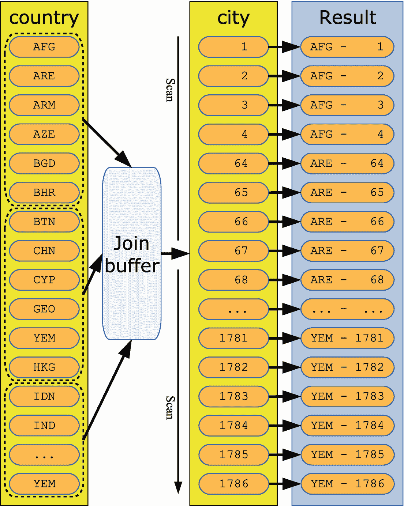

# 十七、查询优化器

当你提交一个查询给 MySQL 执行的时候，就不仅仅是读取数据并返回那么简单了。的确，对于从单个表中请求所有数据的简单查询，没有多少检索数据的选择。然而，大多数查询更复杂——有些复杂得多——并且完全按照编写的方式执行查询绝不是获得结果的最有效方式。在阅读索引时，您已经接触到了这种复杂性。您可以添加索引选择、连接顺序、用于执行连接的算法、各种连接优化等等。这就是优化器发挥作用的地方。

优化器的主要工作是准备执行查询，并确定最佳查询计划。第一阶段包括对查询进行转换，目的是使重写后的查询能够以比原始查询更低的成本执行。第二阶段包括计算执行查询的各种方式的成本，并确定最便宜的选项。

Note

重要的是要认识到，由于数据及其分布的变化，优化器所做的工作并不是精确的科学。优化器选择的转换和计算的成本在某种程度上都是基于估计的。通常这些估计足以得到一个好的查询计划，但是偶尔您将需要提供提示。如何配置优化器将在本章后面的“配置优化器”一节中讨论。

本章首先讨论转换和基于成本的优化。然后，本章继续讨论基本的连接算法，以及其他优化特性，如批量键访问。本章的最后一部分介绍了如何配置优化器以及如何使用资源组来区分查询的优先级。

## 转换

人们认为编写查询很自然的方式可能与在 MySQL 中执行查询的最佳方式不同。优化器知道可以使用几种转换来更改查询，同时仍然返回相同的结果，因此查询对 MySQL 来说变得更好。

当然，最重要的是原始查询和重写查询返回相同的结果。幸运的是，关系数据库基于数学集合论，所以许多转换可以使用标准的数学规则，确保两个版本的查询返回相同的结果(bar 实现错误)。

优化器执行的最简单的转换类型之一是常量传播。例如，考虑以下查询:

```sql
SELECT *
  FROM world.country
       INNER JOIN world.city
          ON city.CountryCode = country.Code
 WHERE city.CountryCode = 'AUS';

```

这个查询有两个条件:`city.CountryCode`列必须等于“AUS”，`city`表的`CountryCode`列必须等于`country`表的`Code`列。根据这两个条件，可以推导出`country.Code`列也必须等于“AUS”。优化器使用这些知识直接过滤 country 表。由于`Code`列是`country`表的主键，这意味着优化器知道只有一行符合条件，并且优化器可以将`country`表视为常量。实际上，查询最终会以来自`country`表的列值作为选择列表中的常量来执行，并使用`CountryCode = 'AUS'`扫描`city`表中的条目:

```sql
SELECT 'AUS' AS `Code`,
       'Australia' AS `Name`,
       'Oceania' AS `Continent`,
       'Australia and New Zealand' AS `Region`,
       7741220.00 AS `SurfaceArea`,
       1901 AS `IndepYear`,
       18886000 AS `Population`,
       79.8 AS `LifeExpectancy`,
       351182.00 AS `GNP`,
       392911.00 AS `GNPOld`,
       'Australia' AS `LocalName`,
       'Constitutional Monarchy, Federation' AS `GovernmentForm`,
       'Elisabeth II' AS `HeadOfState`,
       135 AS `Capital`,
       'AU' AS `Code2`,
       city.*
  FROM world.city
 WHERE CountryCode = 'AUS';

```

从性能角度来看，这是一个安全的转换。其他转换更复杂，并不总是能提高性能。因此，可以配置是否启用优化。配置是使用`optimizer_switch`选项和优化器提示完成的，在讨论优化和如何配置优化器时会讨论这些选项和提示。

一旦优化器决定了要做哪些转换，它就需要决定如何执行重写的查询，这将在下面讨论。

## 基于成本的优化

MySQL 使用基于成本的查询优化。这意味着优化器计算执行查询所需的各种操作的成本，然后结合这些部分成本来计算可能的查询计划的总查询成本，并选择最便宜的计划。本节介绍了估计查询计划成本的原则。

### 基础知识:单表选择

不管查询是什么，计算成本的原则都是相同的，但是显然查询越复杂，成本估算就变得越复杂。举个简单的例子，考虑一个在索引列上使用`WHERE`子句查询单个表的查询:

```sql
SELECT *
  FROM world.city
 WHERE CountryCode = 'IND';

```

从表定义中可以看出，`world.city`表在`CountryCode`列上有一个次要的非唯一索引:

```sql
mysql> SHOW CREATE TABLE world.city\G
**************************** 1\. row ****************************
       Table: city
Create Table: CREATE TABLE `city` (
  `ID` int(11) NOT NULL AUTO_INCREMENT,
  `Name` char(35) NOT NULL DEFAULT ",
  `CountryCode` char(3) NOT NULL DEFAULT ",
  `District` char(20) NOT NULL DEFAULT ",
  `Population` int(11) NOT NULL DEFAULT '0',
  PRIMARY KEY (`ID`),
  KEY `CountryCode` (`CountryCode`),
  CONSTRAINT `city_ibfk_1` FOREIGN KEY (`CountryCode`) REFERENCES `country` (`Code`)
) ENGINE=InnoDB AUTO_INCREMENT=4080 DEFAULT CHARSET=utf8mb4 COLLATE=utf8mb4_0900_ai_ci
1 row in set (0.0008 sec)

```

优化器可以选择两种方式来获取匹配的行。一种方法是使用`CountryCode`上的索引来查找索引中的匹配行，然后查找所请求的行值。另一种方法是进行全表扫描，检查每一行，以确定它是否满足过滤条件。

在这些访问方法中，哪种成本最低(最快)并不像看起来那样容易确定。这取决于几个因素:

*   该索引的选择性如何？通过二级索引读取一行包括首先在索引中找到该行，然后可能(参见下一项)执行主键查找以获得该行。这意味着使用辅助索引检查和检索行比直接读取行的开销更大，为了使索引访问总体上比表扫描更便宜，索引必须显著减少要检查的行数。索引的选择性越强，使用起来相对就越便宜。

*   **索引是覆盖索引吗？**如果索引包含查询所需的所有列，则可以跳过实际行的读取，这样更有利于使用索引。

*   **读取记录有多贵？**这同样取决于几个因素，例如索引和行数据是否已经在缓冲池中，如果没有，从磁盘读取记录的速度有多快。考虑到读取索引和读取聚集索引之间的切换，使用索引将需要更多的随机 I/O，因此定位记录所需的寻道时间变得非常重要。

MySQL 8 中的一个新特性是，优化器可以询问 InnoDB 查询所需的记录是否可以在缓冲池中找到，或者是否有必要从磁盘中读取。这可以极大地帮助改进查询计划。

读取记录所涉及的成本问题更加复杂，因为 MySQL 不知道硬件的性能特征。MySQL 8 默认假设从磁盘读取的开销是内存的四倍。这可以按照“配置优化器”一节中“引擎成本”中的讨论进行配置。

一旦在查询中引入第二个表，优化器还需要决定以何种顺序连接这些表。

### 表连接顺序

对于比单个 table `SELECT`语句更复杂的查询，优化器不仅需要考虑访问每个表的成本，还需要考虑每个表的包含顺序以及每个表使用哪个索引。

对于外部连接和直接连接，连接顺序是固定的，但是对于内部连接，优化器可以自由选择顺序，因此优化器必须计算每个组合的成本。可能的组合数量是 N！(阶乘),伸缩性很差。如果有五个表参与内部联接，优化器可以选择五个表作为第一个表，然后四个表作为第二个表，三个表作为第三个表，两个表作为第四个表，最后一个表作为最后一个表:

```sql
Combinations = 5 * 4 * 3 * 2 * 1 = 5! = 120

```

MySQL 支持连接多达 61 个表，在这种情况下，可能有 5.1E83 个组合来计算成本，这是成本过高的，并且可能比执行查询本身需要更长的时间。因此，默认情况下，优化器会根据对成本的部分评估来删除查询计划，因此只有最有希望的计划会得到完全评估。也可以告诉优化器在包含给定数量的表后停止评估成本。修剪和搜索深度分别用`optimizer_prune_level`和`optimizer_search_depth`选项配置，这将在“配置优化器”一节中讨论。

最佳连接顺序与表的大小以及过滤器在减少每个表中包含的行数方面的表现有关。

### 默认过滤效果

当连接两个或更多的表时，优化器需要知道每个表包含多少行，以便能够确定最佳的连接顺序。这绝不是一项微不足道的任务。

当使用索引时，当过滤器与其他表不相关时，优化器可以非常准确地估计有多少行将匹配索引。如果没有索引，直方图统计可用于获得良好的过滤估计。当被筛选的列没有统计信息时，困难就出现了。在这种情况下，优化器会依靠内置的默认估计。表 [17-1](#Tab1) 包括当没有可用的索引或直方图统计时使用的默认过滤效果的例子。

表 17-1

无统计条件下的默认过滤效果

<colgroup><col class="tcol1 align-left"> <col class="tcol2 align-left"> <col class="tcol3 align-left"></colgroup> 
| 

类型

 | 

过滤器%

 | 

注释/示例

 |
| --- | --- | --- |
| 全部 | One hundred | 这在按索引过滤或没有过滤条件时使用。 |
| 平等 | Ten | `Name = 'Sydney'` |
| 不相等 | Ninety | `Name <> 'Sydney'` |
| 不平等 | Thirty-three point three three | `Population > 4000000` |
| 在...之间 | Eleven point one one | `Population BETWEEN 1000000 AND 4000000` |
| 在…里 | `min(``#items * 10,``50``)` | `Name IN ('Sydney', 'Melbourne')` |

过滤效果基于 Selinger 等人的文章“关系数据库管理系统中的访问路径选择” <sup>[1](#Fn1)</sup> 您有时会看到不同的过滤值。一些例子包括

*   **已知不同的值:**这包括`enum`和位数据类型。考虑一下`world.country`表中的`Continent`列。这是一个有七个值的`enum`，所以优化器将估计像`Continent = 'Europe'`这样的`WHERE`子句的过滤效果为 1/7。

*   **少行:**如果一个表中少于十行，并且您添加了一个等式条件，那么过滤估计将是`1/number_of_rows`并且对于不相等的过滤估计也是类似的。

*   **过滤器组合:**如果在几个非索引列上组合过滤器，估计的过滤效果就是组合效果。例如，对于`world.city`表，由于`Name`上的等式，过滤器`Name = 'Sydney' AND Population > 3000000`估计会占用 10%的行，由于`Population`上的不等式，估计会占用 33%的行，因此组合的效果是`P(Equality on Name) * P(Inequality on Population) = 0.1 * 0.33 = 0.0333 = 3.33%`。

这个列表并不详尽，但它应该能让您很好地了解 MySQL 是如何得出过滤估计值的。默认的过滤效果显然不是很准确，特别是对于大型表，因为数据不遵循这样严格的规则。这就是为什么索引和直方图对于获得好的查询计划如此重要。

在确定查询计划的最后，有对单个部分和整个查询的成本估计。这些信息有助于理解优化器如何获得查询执行计划。

### 查询成本

如果您想检查优化器发现的成本，您将需要使用树-(包括`EXPLAIN ANALYZE`)或 JSON 格式的`EXPLAIN`输出、MySQL Workbench 可视化解释图或优化器跟踪。这些都在第 20 章[中有详细描述。](20.html)

举个简单的例子，考虑一个连接`world`样本数据库的`country`和`city`表的查询:

```sql
SELECT *
  FROM world.country
       INNER JOIN world.city
          ON CountryCode = Code;

```

图 [17-1](#Fig1) 显示了查询的直观解释图，包括`city`表的额外细节。


图 17-1

成本估算的直观解释

该图显示了优化器如何决定执行查询。如何阅读该图将在第 [20](20.html) 章中讨论。这里重要的部分是箭头所指的数字。这些是优化器为查询执行的各个部分所做的成本估计，成本越低越好。该示例显示，成本估计是为非常具体的任务计算的，例如读取数据、评估筛选条件等。在图的顶部，总查询成本估计为 1535.43。

Note

由于计算出的成本取决于索引统计等因素，而索引统计并不精确，因此随着时间的推移，成本会有所不同。这也意味着，如果您执行相同的查询，与本书中的示例相比，您可能会看到不同的成本估计。

在您执行了一个查询之后，您还可以从`Last_query_cost`状态变量中获得估计的成本。清单 [17-1](#PC7) 展示了对与图 [17-1](#Fig1) 中相同的查询这样做的例子。

```sql
mysql> SELECT *
         FROM world.country
              INNER JOIN world.city
                 ON CountryCode = Code;
...

mysql> SHOW SESSION STATUS LIKE 'Last_query_cost';
+-----------------+-------------+
| Variable_name   | Value       |
+-----------------+-------------+
| Last_query_cost | 1535.425669 |
+-----------------+-------------+
1 row in set (0.0013 sec)

Listing 17-1Obtaining the estimated query cost after executing a query

```

输出中已经删除了查询的结果，因为它对于本次讨论并不重要。关于`Last_query_cost`需要注意的一件重要事情是，它是估计成本，这就是为什么它在直观的解释图中显示与总成本相同的值。如果您想了解执行查询的实际成本，您需要使用`EXPLAIN ANALYZE`。

可视化解释图提到查询是使用一个嵌套循环执行的。这只是 MySQL 支持的连接算法之一。

## 连接算法

在 MySQL 中，连接是一个非常宽泛的概念——以至于你可以说一切都是连接。即使查询单个表也被认为是一个连接。也就是说，最有趣的连接是两个或多个表之间的连接。在本讨论中，表也可以是派生表。

当执行查询时，需要连接两个表，MySQL 支持三种不同的算法。这些算法是

*   嵌套循环

*   块嵌套循环

*   散列连接

Note

本节中显示的时间仅用于说明目的。您在系统上看到的计时会有所不同，彼此之间的计时也可能有所不同。

本节和下一节将引用几个优化器开关和优化器提示的名称。优化器开关指的是`optimizer_switch`配置选项，优化器提示指的是可以添加到查询中的`/*+ ... */`注释，用来告诉优化器您希望查询如何执行。这两个概念以及如何使用它们将在本章后面的“配置优化器”一节中进一步讨论。

### 嵌套循环

嵌套循环算法是 MySQL 中使用的最简单的算法。在 MySQL 5.6 之前，它也是唯一可用的算法。顾名思义，它的工作方式是嵌套循环，连接中的每个表一个循环。嵌套连接算法不仅非常简单；它也适用于索引查找。

考虑在查询亚洲国家和城市的`world.country`表中加入`world.city`表的查询。您可以按以下方式编写查询:

```sql
SELECT CountryCode, country.Name AS Country,
       city.Name AS City, city.District
  FROM world.country
       INNER JOIN world.city
             ON city.CountryCode = country.Code
 WHERE Continent = 'Asia';

```

它将使用嵌套循环来执行，对`country`表进行表扫描，其中应用了`WHERE`子句中的过滤器，然后对`city`表进行索引查找。在树表示法中，查询看起来像

```sql
-> Nested loop inner join
    -> Filter: (country.Continent = 'Asia')
        -> Table scan on country
    -> Index lookup on city using CountryCode
                       (CountryCode=country.`Code`)

```

也可以把这个写成伪代码。使用类似 Python 的语法，嵌套循环连接可以写成如下代码片段:

```sql
result = []
for country_row in country:
    if country_row.Continent == 'Asia':
        for city_row in city.CountryCode['country_row.Code']:
            result.append(join_rows(country_row, city_row))

```

伪代码中，`country`和`city`分别代表`country`和`city`表，`city.CountryCode`是城市表上的`CountryCode`索引，`country_row`和`city_row`代表单行。`join_rows()`函数用于表示将结果集中两行所需的列合并为一行的过程。

图 [17-2](#Fig2) 使用图表显示了相同的嵌套循环连接。为了简单起见，为了关注连接，只包括匹配行的主键值，即使所有行都是从`country`表中读取的。


图 17-2

嵌套循环联接的示例

该图显示，MySQL 扫描 country 表，直到找到与`WHERE`子句匹配的行。在图中，第一个匹配行是 AFG(代表阿富汗)。然后在城市表中找到`CountryCode = AFG`的所有行(`ID`等于 1、2、3 和 4)，每个组合用于在结果中形成一行。这种情况持续到国家代码等于 ARE(阿联酋)等，直到 YEM(也门人)。

在`country`表中和在`city`表的`CountryCode`索引中扫描行的确切顺序取决于索引定义以及优化器、执行器和存储引擎的内部结构。除非你有一个明确的`ORDER BY`子句，否则永远不要依赖于排序保持不变。

一般来说，一个连接可能比本例中的更复杂，因为可能有额外的过滤器。然而，这个概念仍然是一样的。

虽然简单通常是一个好的属性，但是嵌套循环连接有一些限制。它不能用于执行完整的外部联接，因为嵌套循环联接要求第一个表返回行，而完整的外部联接并不总是如此。解决方法是将完整的外部连接编写为左外部连接和右外部连接的联合。考虑一个查找所有国家和城市的查询，包括国家没有城市和城市没有国家的情况。可以写成一个完整的外部连接(在 MySQL 中无效):

```sql
SELECT *
  FROM world.country
       FULL OUTER JOIN world.city
               ON city.CountryCode = country.Code;

```

为了在 MySQL 中执行，可以使用`country LEFT JOIN city`和`country RIGHT JOIN city`的联合，比如

```sql
SELECT *
  FROM world.country
       LEFT OUTER JOIN world.city
               ON city.CountryCode = country.Code
 UNION
SELECT *
  FROM world.country
       RIGHT OUTER JOIN world.city
               ON city.CountryCode = country.Code;

```

另一个限制是嵌套循环连接对于不能使用索引的连接不是很有效。由于嵌套循环联接一次只能处理联接中第一个表的一行，因此有必要对第二个表的第一个表中的每一行进行全表扫描。这很快就会变得过于昂贵。考虑一下前面检查的查询，其中找到了亚洲的所有城市:

```sql
mysql> SELECT PS_CURRENT_THREAD_ID();
+------------------------+
| PS_CURRENT_THREAD_ID() |
+------------------------+
|                     30 |
+------------------------+
1 row in set (0.0017 sec)

SELECT CountryCode, country.Name AS Country,
       city.Name AS City, city.District
  FROM world.country
       INNER JOIN world.city
             ON city.CountryCode = country.Code
 WHERE Continent = 'Asia';

```

通过对 country 表(239 行)的表扫描和对 city 表的索引查找，总共将检查 2005 行(在第二个连接中执行此查询):

```sql
mysql> SELECT rows_examined, rows_sent,
              last_statement_latency AS latency
         FROM sys.session
        WHERE thd_id = 30\G
*************************** 1\. row ***************************
rows_examined: 2005
    rows_sent: 1766
      latency: 4.36 ms
1 row in set (0.0539 sec)

```

`thd_id`上的过滤器需要匹配执行查询的连接的性能模式线程 id(这可以通过 MySQL 8.0.16 和更高版本中的`PS_CURRENT_THREAD_ID()`函数找到)。2005 年检查的行来自对亚洲国家的`country`表中的 239 行进行全表扫描，然后读取`city`表中的 1766 行。

如果 MySQL 不能为连接使用索引，那么查询性能会发生巨大变化。您可以通过以下方式使用嵌套循环连接而不使用索引来执行查询(`NO_BNL(city)`注释是一个优化器提示):

```sql
SELECT /*+ NO_BNL(city) */
       CountryCode, country.Name AS Country,
       city.Name AS City, city.District
  FROM world.country IGNORE INDEX (Primary)
       INNER JOIN world.city IGNORE INDEX (CountryCode)
             ON city.CountryCode = country.Code
 WHERE Continent = 'Asia';

```

`IGNORE INDEX ()`子句是一个索引提示，告诉 MySQL 忽略括号中给出的索引。该版本查询的查询统计数据显示，现在检查了 200，000 多行，并且该查询的执行时间大约是以前的 10 倍(以与以前相同的方式执行该测试，其中查找亚洲城市的查询在一个连接中执行，下面针对`sys.session`的查询在另一个连接中执行，并且`thd_id = 30`被更改为使用第一个连接的线程 id):

```sql
mysql> SELECT rows_examined, rows_sent,
              last_statement_latency AS latency
         FROM sys.session
        WHERE thd_id = 30\G
**************************** 1\. row ****************************
rows_examined: 208268
    rows_sent: 1766
      latency: 44.83 ms

```

有 51 个国家有`Continent = 'Asia'`，这意味着有 51 个城市表的全表扫描。因为 city 表中有 4079 行，所以总共有 51 * 4079 + 239 = 208268 行必须检查。额外的 239 行来自对有 239 行的`country`表的扫描。

为什么有必要在示例中添加带有`NO_BNL(country,city)`的注释？BNL 主张块嵌套循环，这有助于改善没有索引的连接，注释禁用了这种优化。通常，您确实希望保持它的启用状态，这将在下面解释。

### 块嵌套循环

块嵌套循环算法是嵌套循环算法的扩展。它也被称为 BNL 算法。联接缓冲区用于收集尽可能多的行，并在第二个表的一次扫描中对它们进行比较，而不是一个接一个地提交第一个表中的行。与嵌套循环算法相比，这可以大大提高某些查询的性能。

如果考虑用作嵌套循环算法示例的同一个查询，但是禁用了索引(模拟两个没有索引的表)并且不允许哈希联接(在 8.0.18 和更高版本中)，则您有一个可以利用块嵌套循环算法的查询。该查询是

```sql
SELECT /*+ NO_HASH_JOIN(country,city) */
       CountryCode, country.Name AS Country,
       city.Name AS City, city.District
  FROM world.country IGNORE INDEX (Primary)
       INNER JOIN world.city IGNORE INDEX (CountryCode)
             ON city.CountryCode = country.Code
 WHERE Continent = 'Asia';

```

在 MySQL 8.0.17 和更早版本中，删除带有`NO_HASH_JOIN()`优化器提示的注释。

清单 [17-2](#PC18) 展示了一个使用类似 Python 的代码实现块嵌套循环算法的伪代码示例。

```sql
result = []
join_buffer = []
for country_row in country:
    if country_row.Continent == 'Asia':
        join_buffer.append(country_row.Code)

        if is_full(join_buffer):
            for city_row in city:
                CountryCode = city_row.CountryCode
                if CountryCode in join_buffer:
                    country_row = get_row(CountryCode)
                    result.append(
                        join_rows(country_row, city_row))
            join_buffer = []

if len(join_buffer) > 0:
    for city_row in city:
        CountryCode = city_row.CountryCode
        if CountryCode in join_buffer:
            country_row = get_row(CountryCode)
            result.append(join_rows(country_row, city_row))
    join_buffer = []

Listing 17-2Pseudo code representing a block nested loop join

```

`join_buffer`列表表示存储连接所需列的连接缓冲区。在伪代码中，用`required_columns()`函数提取列。对于用作示例的查询，只需要来自`country`表的`Code`列。这是一件值得注意的重要事情，稍后将进一步讨论。当连接缓冲区满时，在`city`表上执行表扫描；如果`city`表的`CountryCode`列与连接缓冲区中存储的`Code`值之一相匹配，则构建结果行。

图 [17-3](#Fig3) 显示了连接的示意图。为简单起见，即使对两个表都执行了全表扫描，也只包括连接所需行的主键值。



图 17-3

块嵌套循环联接的示例

该图显示了如何一起读取来自`country`表的行并将其存储在连接缓冲区中。每当连接缓冲区满时，就会对`city`表执行一次全表扫描，并逐步构建结果。在图中，一次有六行适合连接缓冲区。由于`Code`列每行仅需要 3 个字节，实际上，除了使用`join_buffer_size`的最小可能设置时，连接缓冲器将能够保存所有国家代码。

使用连接缓冲区缓冲几个国家代码对查询统计有什么影响？对于前面的示例，首先执行查询，在一个连接中查找亚洲城市:

```sql
SELECT /*+ NO_HASH_JOIN(country,city) */
       CountryCode, country.Name AS Country,
       city.Name AS City, city.District
  FROM world.country IGNORE INDEX (Primary)
       INNER JOIN world.city IGNORE INDEX (CountryCode)
             ON city.CountryCode = country.Code
 WHERE Continent = 'Asia';

```

然后在另一个连接中，查询`sys.session`以获得检查的行数和查询延迟(更改`thd_id = 30`以使用第一个连接的线程 id):

```sql
mysql> SELECT rows_examined, rows_sent,
              last_statement_latency AS latency
         FROM sys.session
        WHERE thd_id = 30\G
**************************** 1\. row ****************************
rows_examined: 4318
    rows_sent: 1766
      latency: 16.87 ms
1 row in set (0.0490 sec)

```

结果假定为`join_buffer_size`的默认值。统计数据显示，块嵌套循环的性能明显优于不使用索引的嵌套循环算法。相比之下，使用索引执行查询检查了 2005 行，花费了大约 4 毫秒，而使用没有索引的嵌套循环连接检查了 208268 行，花费了大约 45 毫秒。这看起来似乎是查询执行时间上的无关紧要的差异，但是`country`和`city`表都非常小。对于大型表，这种差异将非线性增长，可能意味着查询完成和似乎永远运行之间的差异。

关于块嵌套循环，有几点您应该知道，因为它有助于您最佳地使用它。这些要点包括

*   只有连接所需的列存储在连接缓冲区中。这意味着连接缓冲区需要的内存比最初预期的要少。

*   连接缓冲区的大小由`join_buffer_size`变量配置。`join_buffer_size`的值是缓冲区的最小大小！即使在所讨论的例子中少于 1 个 KiB 的国家代码值将被存储在连接缓冲器中，如果`join_buffer_size`被设置为 1 个 GiB，则 1 个 GiB 将被分配。为此，保持`join_buffer_size`的值较低，仅在需要时增加。“配置优化器”一节包含了如何为单个查询更改连接缓冲区大小的信息。

*   使用块嵌套循环算法为每个连接分配一个连接缓冲区。

*   每个连接缓冲区都是在整个查询期间分配的。

*   块嵌套循环算法可用于全表扫描、全索引扫描和范围扫描。

*   块嵌套循环算法永远不会用于常数表和第一个非常数表。这意味着，在使用块嵌套循环算法按唯一索引进行筛选后，需要在具有多行的两个表之间进行联接。

您可以通过设置`block_nested_loop`优化器开关来配置是否允许优化器选择块嵌套循环算法。默认设置是启用它。对于单个查询，您可以使用`BNL()`和`NO_BNL()`优化器提示来启用或禁用特定连接的块嵌套循环。

虽然块嵌套循环对于非索引连接来说是一个很大的改进，但是在大多数情况下，使用散列连接可能会做得更好。

### 散列连接

散列连接算法是 MySQL 最近新增的功能，在 MySQL 8.0.18 和更高版本中受支持。它标志着嵌套循环连接传统的重大突破，包括块嵌套循环变体。它对于没有索引的大型连接特别有用，但在某些情况下甚至优于索引连接。

MySQL 实现了经典内存哈希连接和磁盘 GRACE 哈希连接算法的混合。 <sup>[2](#Fn2)</sup> 如果有可能将所有的哈希都存储在内存中，那么就使用纯内存实现。连接缓冲区用于内存中部分，因此可用于散列的内存量受到`join_buffer_size`的限制。当连接不适合内存时，连接会溢出到磁盘，但是实际的连接操作仍然在内存中执行。

内存中散列连接算法由两个步骤组成:

1.  连接中的一个表被选为*构建表*。为连接所需的列计算散列，并将其加载到内存中。这被称为*构建阶段*。

2.  连接中的另一个表是*探针输入*。对于这个表，一次读取一行，并计算散列。然后，对从构建表中计算出的散列执行散列键查找，并从匹配的行中生成连接结果。这被称为*探测阶段*。

当构建表的散列不适合内存时，MySQL 会自动切换到使用磁盘上的实现(基于 GRACE hash join 算法)。如果在构建阶段连接缓冲区变满，就会发生从内存算法到磁盘算法的切换。磁盘算法包括三个步骤:

1.  计算构建表和探测表中所有行的散列，并将它们存储在磁盘上由散列分区的几个小文件中。选择分区的数量，以使探测表的每个分区适合连接缓冲区，但限制为最多 128 个分区。

2.  将构建表的第一个分区加载到内存中，并以与内存中算法的探测阶段相同的方式迭代探测表中的散列。由于步骤 1 中的分区对构建表和探测表使用相同的散列函数，因此只需要迭代探测表的第一个分区。

3.  清除内存中的缓冲区，并继续逐个处理剩余的分区。

内存中和磁盘上的算法都使用 xxHash64 哈希函数，该函数速度快，但仍能提供高质量的哈希(减少哈希冲突的数量)。为了获得最佳性能，连接缓冲区需要足够大，以容纳构建表中的所有散列。也就是说，对于散列连接和块嵌套循环连接，`join_buffer_size`存在相同的考虑因素。

每当选择块嵌套循环时，MySQL 将使用散列连接，并且散列连接算法支持查询。在撰写本文时，对于要使用的散列连接算法，存在以下要求:

*   该联接必须是内部联接。

*   无法使用索引执行联接，可能是因为没有可用的索引，也可能是因为已为查询禁用了索引。

*   查询中的所有联接在联接中的两个表之间必须至少有一个等价联接条件，并且在该条件中只引用两个表中的列和常数。

*   从 8.0.20 开始，还支持反联接、半联接和外联接。 <sup>[3](#Fn3)</sup> 。如果连接两个表`t1`和`t2`，那么散列连接支持的连接条件的例子包括

*   `t1.t1_val = t2.t2_val`

*   `t1.t1_val = t2.t2_val + 2`

*   `t1.t1_val1 = t2.t2_val AND t1.t1_val2 > 100`

*   `MONTH(t1.t1_val) = MONTH(t2.t2_val)`

如果考虑本节的重复示例查询，可以通过忽略可用于连接的表上的索引，使用散列连接来执行它:

```sql
SELECT CountryCode, country.Name AS Country,
       city.Name AS City, city.District
  FROM world.country IGNORE INDEX (Primary)
       INNER JOIN world.city IGNORE INDEX (CountryCode)
             ON city.CountryCode = country.Code
 WHERE Continent = 'Asia';

```

执行该连接的伪代码类似于块嵌套循环的伪代码，只是连接所需的列被散列，并且支持溢出到磁盘。伪代码如清单 [17-3](#PC22) 所示。

```sql
result = []
join_buffer = []
partitions = 0
on_disk = False
for country_row in country:
    if country_row.Continent == 'Asia':
        hash = xxHash64(country_row.Code)
        if not on_disk:
            join_buffer.append(hash)

            if is_full(join_buffer):
                # Create partitions on disk
                on_disk = True
                partitions = write_buffer_to_disk(join_buffer)
                join_buffer = []
        else
           write_hash_to_disk(hash)

if not on_disk:
    for city_row in city:
        hash = xxHash64(city_row.CountryCode)
        if hash in join_buffer:
            country_row = get_row(hash)
            city_row = get_row(hash)
            result.append(join_rows(country_row, city_row))
else:
    for city_row in city:
        hash = xxHash64(city_row.CountryCode)
        write_hash_to_disk(hash)

    for partition in range(partitions):
        join_buffer = load_build_from_disk(partition)
        for hash in load_hash_from_disk(partition):
            if hash in join_buffer:
                country_row = get_row(hash)
                city_row = get_row(hash)
                result.append(join_rows(country_row, city_row))
        join_buffer = []

Listing 17-3Pseudo code representing a hash join

```

伪代码从读取`country`表中的行开始，计算`Code`列的散列，并将其存储在连接缓冲区中。如果缓冲区变满，那么代码切换到磁盘上的算法，并从缓冲区写出散列。这也是确定分区数量的地方。在这之后，`country`表的其余部分被散列。

在下一部分中，对于内存算法，在`city`表中的行上有一个简单的循环，将哈希值与缓冲区中的哈希值进行比较。对于磁盘算法，首先计算`city`表的哈希值并存储在磁盘上；然后分区逐个处理。

Note

与实际使用的算法相比，所描述的算法稍微简化了一些。真正的算法必须考虑哈希冲突，对于磁盘上的算法，一些分区可能变得太大而不适合连接缓冲区，在这种情况下，它们被分块处理，以避免使用比配置更多的内存。

图 [17-4](#Fig4) 显示了内存中散列连接算法的示意图。为简单起见，即使对两个表都执行了全表扫描，也只包括连接所需行的主键值。


图 17-4

内存中散列连接的示例

来自`country`表的匹配行的`Code`列的值被散列并存储在连接缓冲区中。然后对`city`表执行表扫描，对每一行计算散列值`CountryCode`，从匹配的行中构造结果。

通过首先在一个连接中执行查询，可以用与前面算法相同的方式检查查询的统计信息:

```sql
SELECT CountryCode, country.Name AS Country,
       city.Name AS City, city.District
  FROM world.country IGNORE INDEX (Primary)
       INNER JOIN world.city IGNORE INDEX (CountryCode)
             ON city.CountryCode = country.Code
 WHERE Continent = 'Asia';

```

然后，您可以通过在第二个连接中查询`sys.session`视图来查看查询的性能模式统计数据(将`thd_id = 30`更改为使用第一个连接的线程 id):

```sql
mysql> SELECT rows_examined, rows_sent,
              last_statement_latency AS latency
         FROM sys.session
        WHERE thd_id = 30\G
rows_examined: 4318
    rows_sent: 1766
      latency: 3.53 ms
1 row in set (0.0467 sec)

```

您可以看到，散列连接与块嵌套循环检查相同数量的行时，查询执行得非常好，但它比索引连接更快。这不是一个错误:在某些情况下，散列连接甚至可以胜过索引连接。与索引和块嵌套循环联接相比，您可以使用以下规则来评估哈希联接算法的执行情况:

*   对于不使用索引的连接，散列连接通常比块嵌套连接快得多，除非添加了一个`LIMIT`子句。已经观察到超过 1000 倍的改善。<sup>[4](#Fn4)T4】</sup>

*   对于没有索引的连接，如果有一个`LIMIT`子句，当找到足够多的行时，块嵌套循环可以退出，而散列连接将完成整个连接(但是可以跳过获取行)。如果由于`LIMIT`子句而包含的行数与连接找到的总行数相比很小，那么块嵌套循环可能会更快。

*   对于支持索引的连接，如果索引的选择性较低，哈希连接算法会更快。

使用散列连接的最大好处是对于没有索引和没有`LIMIT`子句的连接。最后，只有测试才能证明哪种连接策略最适合您的查询。

您可以使用`hash_join` optimizer 开关启用和禁用对散列连接的支持。此外，必须启用`block_nested_loop`优化器开关。默认情况下，两者都是启用的。如果您想为特定的连接配置散列连接的使用，您可以使用`HASH_JOIN()`和`NO_HASH_JOIN()`优化器提示。

关于 MySQL 中支持的三种高级连接策略的讨论到此结束。还有一些值得考虑的低级优化。

## 连接优化

MySQL 可以使用连接优化来改进上一节中讨论的连接算法的基本概念，或者决定如何执行部分查询。本节将详细介绍索引合并、多范围读取(MRR)和批量键访问(BKA)优化。这三种优化最有可能需要您帮助优化器使查询计划达到最优。其余的可配置优化将在本节的末尾介绍，但不太详细。

### 索引合并

通常 MySQL 对每个表只使用一个索引。但是，如果在同一个表的多个列上有条件，并且没有覆盖所有列的单一索引，那么这不是最佳选择。对于这些情况，MySQL 支持索引合并。

Tip

用筛选条件覆盖列的多列索引比使用索引合并优化更有效。您应该权衡这种性能差异与额外索引的可能性。

支持三种索引合并算法。表 [17-2](#Tab2) 总结了算法，何时使用算法，以及查询计划中包含的信息。

表 17-2

索引合并算法

<colgroup><col class="tcol1 align-left"> <col class="tcol2 align-left"> <col class="tcol3 align-left"> <col class="tcol4 align-left"></colgroup> 
| 

算法

 | 

用例

 | 

`EXPLAIN Extra` 铜铬

 | 

`EXPLAIN` JSON `Key`字段

 |
| --- | --- | --- | --- |
| 交集 | `AND` | `Using intersect(...)` | `intersect(...)` |
| 联盟 | `OR` | `Using union(...)` | `union(...)` |
| 排序联合 | `OR`有范围 | `sort_union(...)` | `sort_union(...)` |

除了表中列出的`EXPLAIN`信息，访问类型被设置为`index_merge`。

用例指定了加入条件的操作符。联合算法和排序联合算法的区别在于，联合算法用于相等条件，而排序联合算法用于范围条件。对于`EXPLAIN`输出，与索引合并一起使用的索引名称列在括号内。

在讨论这三种算法时，考虑使用每种算法的实际查询会很有用。`sakila`数据库中的`payment`表对此很有用。`sakila.payment`的表格定义是

```sql
CREATE TABLE `payment` (
  `payment_id` smallint unsigned NOT NULL,
  `customer_id` smallint unsigned NOT NULL,
  `staff_id` tinyint unsigned NOT NULL,
  `rental_id` int(DEFAULT NULL,
  `amount` decimal(5,2) NOT NULL,
  `payment_date` datetime NOT NULL,
  `last_update` timestamp NULL,
  PRIMARY KEY (`payment_id`),
  KEY `idx_fk_staff_id` (`staff_id`),
  KEY `idx_fk_customer_id` (`customer_id`),
  KEY `fk_payment_rental` (`rental_id`)
) ENGINE=InnoDB DEFAULT CHARSET=utf8

```

默认值、自动递增信息和外键定义已从表中删除，以关注列和索引。该表有四个索引，都在一个列上，这使它成为索引合并优化的良好候选。

索引合并讨论的其余部分将介绍每个索引合并算法、性能考虑事项以及如何配置索引合并的使用。这些例子都只包含两列的条件，但是这些算法支持包含更多列的索引合并。

Note

优化器是否选择索引合并取决于索引统计信息。这意味着对于同一个查询，`WHERE`子句中的不同值可能会导致不同的查询计划，并且对索引统计信息的更改可能会使查询以不同的方式执行，即使在使用索引合并和不使用索引合并之间的条件完全相同的情况下也是如此——反之亦然。

#### 交集算法

当在由`AND`分隔的几个索引列上有条件时，使用交集算法。使用交集索引合并算法的两个查询示例是

```sql
SELECT *
  FROM sakila.payment
 WHERE staff_id = 1
       AND customer_id = 75;

SELECT *
  FROM sakila.payment
 WHERE payment_id > 10
       AND customer_id = 318;

```

第一个查询在两个辅助索引上有一个相等条件，第二个查询在主键上有一个范围条件，在辅助索引上有一个相等条件。第二个查询的索引合并优化只适用于 InnoDB 表。清单 [17-4](#PC27) 显示了使用两种不同格式的两个查询中的第一个查询的`EXPLAIN`输出。

```sql
mysql> EXPLAIN
        SELECT *
          FROM sakila.payment
         WHERE staff_id = 1
               AND customer_id = 75\G
**************************** 1\. row *****************************
           id: 1
  select_type: SIMPLE
        table: payment
   partitions: NULL
         type: index_merge
possible_keys: idx_fk_staff_id,idx_fk_customer_id
          key: idx_fk_customer_id,idx_fk_staff_id
      key_len: 2,1
          ref: NULL
         rows: 20
     filtered: 100
        Extra: Using intersect(idx_fk_customer_id,idx_fk_staff_id); Using where
1 row in set, 1 warning (0.0007 sec)

mysql> EXPLAIN FORMAT=TREE
        SELECT *
          FROM sakila.payment
         WHERE staff_id = 1
               AND customer_id = 75\G
**************************** 1\. row ****************************
EXPLAIN: -> Filter: ((sakila.payment.customer_id = 75) and (sakila.payment.staff_id = 1))  (cost=14.48 rows=20)
    -> Index range scan on payment using intersect(idx_fk_customer_id,idx_fk_staff_id)  (cost=14.48 rows=20)

1 row in set (0.0004 sec)

Listing 17-4Example of an EXPLAIN output for an intersection merge

```

注意`Extra`列中的`Using intersect(...)`消息，以及树格式输出中的索引范围扫描。这表明`idx_fk_customer_id`和`idx_fk_staff_id`索引用于索引合并。传统输出还在`key`列中包含两个索引，并在`key_len`列中提供两个密钥长度。

#### 合并算法

当用`OR`分隔的表有一系列相等条件时，使用 union 算法。可以使用联合算法的两个查询示例是

```sql
SELECT *
  FROM sakila.payment
 WHERE staff_id = 1
       OR customer_id = 318;

SELECT *
  FROM sakila.payment
 WHERE payment_id > 15000
       OR customer_id = 318;

```

第一个查询在辅助索引上有两个相等条件，而第二个查询在主键上有一个范围条件，在辅助索引上有一个相等条件。第二个查询将只对 InnoDB 表使用索引合并。清单 [17-5](#PC29) 展示了第一个查询的相应`EXPLAIN`输出的例子。

```sql
mysql> EXPLAIN
        SELECT *
          FROM sakila.payment
         WHERE staff_id = 1
               OR customer_id = 318\G
**************************** 1\. row *****************************
           id: 1
  select_type: SIMPLE
        table: payment
   partitions: NULL
         type: index_merge
possible_keys: idx_fk_staff_id,idx_fk_customer_id
          key: idx_fk_staff_id,idx_fk_customer_id
      key_len: 1,2
          ref: NULL
         rows: 8069
     filtered: 100
        Extra: Using union(idx_fk_staff_id,idx_fk_customer_id); Using where
1 row in set, 1 warning (0.0008 sec)

mysql> EXPLAIN FORMAT=TREE
        SELECT *
          FROM sakila.payment
         WHERE staff_id = 1
               OR customer_id = 318\G
**************************** 1\. row ****************************
EXPLAIN: -> Filter: ((sakila.payment.staff_id = 1) or (sakila.payment.customer_id = 318))  (cost=2236.18 rows=8069)
    -> Index range scan on payment using union(idx_fk_staff_id,idx_fk_customer_id)  (cost=2236.18 rows=8069)

1 row in set (0.0010 sec)

Listing 17-5The EXPLAIN output for a union merge

```

注意`Extra`列中的`Using union(...)`以及树格式输出中的索引范围扫描。这表明`idx_fk_staff_id`和`idx_fk_customer_id`索引用于索引合并。

#### 排序联合算法

排序联合算法用于类似于使用联合算法的查询，但是条件是范围条件而不是相等条件。可以使用排序联合算法的两个查询示例是

```sql
SELECT *
  FROM sakila.payment
 WHERE customer_id < 30
       OR rental_id < 10;

SELECT *
  FROM sakila.payment
 WHERE customer_id < 30
       OR rental_id > 16000;

```

两个查询都在两个辅助索引上有范围条件。清单 [17-6](#PC31) 显示了第一个查询使用传统 and 树格式的相应`EXPLAIN`输出。

```sql
mysql> EXPLAIN
        SELECT *
          FROM sakila.payment
         WHERE customer_id < 30
               OR rental_id < 10\G
**************************** 1\. row *****************************
           id: 1
  select_type: SIMPLE
        table: payment
   partitions: NULL
         type: index_merge
possible_keys: idx_fk_customer_id,fk_payment_rental
          key: idx_fk_customer_id,fk_payment_rental
      key_len: 2,5
          ref: NULL
         rows: 826
     filtered: 100
        Extra: Using sort_union(idx_fk_customer_id,fk_payment_rental); Using where
1 row in set, 1 warning (0.0009 sec)

mysql> EXPLAIN FORMAT=TREE
        SELECT *
          FROM sakila.payment
         WHERE customer_id < 30
               OR rental_id < 10\G
**************************** 1\. row *****************************
EXPLAIN: -> Filter: ((sakila.payment.customer_id < 30) or (sakila.payment.rental_id < 10))  (cost=1040.52 rows=826)
    -> Index range scan on payment using sort_union(idx_fk_customer_id,fk_payment_rental)  (cost=1040.52 rows=826)

1 row in set (0.0005 sec)

Listing 17-6The EXPLAIN output using a sort-union merge

```

注意在额外的列中使用了`sort_union(...)`,并且在树格式的输出中使用了索引范围扫描。这表明`idx_fk_customer_id`和`fk_payment_rental`索引用于索引合并。

#### 性能考虑因素

优化器很难知道什么时候索引合并比只使用单个索引更好。乍一看，对更多的列使用索引似乎总是一种胜利，但是索引合并有很大的开销，所以只有当索引的索引选择性的正确组合存在时，索引合并才有用。当由于过时的索引统计信息而选择索引合并时，会发生严重的性能退化，这是更常见的原因之一。

如果优化器选择了索引合并，而查询的性能很差(例如，与其通常的性能相比),那么您应该做的第一件事就是对使用索引合并的表执行`ANALYZE TABLE`。这通常会改进查询计划。否则，可能需要更改优化器配置来决定是否使用索引合并。

#### 配置

索引合并功能由四个优化器开关控制，其中一个开关控制整体功能，另外三个开关分别控制三种算法。这些选项包括

*   `index_merge` **:** 是否启用或禁用指标合并。

*   `index_merge_intersection` **:** 是否启用交集算法。

*   `index_merge_union` **:** 是否启用联合算法。

*   `index_merge_sort_union` **:** 是否启用排序并算法。

默认情况下，所有索引合并优化器开关都是启用的。

此外，还有两个优化器提示:`INDEX_MERGE()`和`NO_INDEX_MERGE()`。这两种提示都将表名作为参数，并且可以选择应该考虑或忽略的索引。例如，如果您想在不使用索引合并的情况下执行查询，查找将`staff_id`设置为 1、`customer_id`设置为 75 的付款，您可以使用以下查询之一:

```sql
SELECT /*+ NO_INDEX_MERGE(payment) */
       *
  FROM sakila.payment
 WHERE staff_id = 1
       AND customer_id = 75;

SELECT /*+ NO_INDEX_MERGE(
              payment
              idx_fk_staff_id,idx_fk_customer_id) */
       *
  FROM sakila.payment
 WHERE staff_id = 1
       AND customer_id = 75;

```

由于索引合并被认为是范围优化的一种特殊情况，`NO_RANGE_OPTIMIZATION()`优化器提示也禁用索引合并。通过`EXPLAIN`输出可以确认，对于清单 [17-7](#PC33) 中的第一个查询，不再使用索引合并。

```sql
mysql> EXPLAIN
        SELECT /*+ NO_INDEX_MERGE(payment) */
               *
          FROM sakila.payment
         WHERE staff_id = 1
               AND customer_id = 75\G
**************************** 1\. row *****************************
           id: 1
  select_type: SIMPLE
        table: payment
   partitions: NULL
         type: ref
possible_keys: idx_fk_staff_id,idx_fk_customer_id
          key: idx_fk_customer_id
      key_len: 2
          ref: const
         rows: 41
     filtered: 50.0870361328125
        Extra: Using where
1 row in set, 1 warning (0.0010 sec)

mysql> EXPLAIN FORMAT=TREE
        SELECT /*+ NO_INDEX_MERGE(payment) */
               *
          FROM sakila.payment
         WHERE staff_id = 1
               AND customer_id = 75\G
**************************** 1\. row ****************************
EXPLAIN: -> Filter: (sakila.payment.staff_id = 1)  (cost=26.98 rows=21)
    -> Index lookup on payment using idx_fk_customer_id (customer_id=75)  (cost=26.98 rows=41)

1 row in set (0.0006 sec)

Listing 17-7The EXPLAIN output when index merges are unselected

```

另一种优化是多范围读取优化。

### 多量程读数(MRR)

多范围读取(MRR)优化旨在减少对辅助索引进行范围扫描所导致的随机 I/O 数量。优化首先读取索引，根据行 id(InnoDB 的聚集索引)对键进行排序，然后按照行的存储顺序检索行。多范围读取优化可用于使用索引的范围扫描和等同联接。虚拟生成的列的辅助索引不支持它。

InnoDB 多范围读取优化的主要用例是针对没有覆盖索引的磁盘绑定查询。优化的效果取决于需要多少行以及存储的寻道次数。MySQL 会尝试估计优化什么时候有用；但是，成本估计过于悲观，而不是过于乐观，因此可能有必要提供信息来帮助优化器做出正确的决策。

多范围读取优化由两个优化器开关控制:

*   `mrr` **:** 是否允许优化器使用多范围读优化。默认为`ON`。

*   `mrr_cost_based` **:** 决定使用多范围读取优化是否基于成本。您可以禁用此选项，以便在支持时始终使用优化。默认为`ON`。

或者，您可以使用`MRR()`和`NO_MRR()` optimizer 开关在每个表或索引的基础上启用和禁用多范围读取优化。

您可以从查询计划中看到是否使用了多范围读取优化。在这种情况下，传统的`EXPLAIN`输出在`Extra`列中指定`Using MRR`，JSON 输出将`using_MRR`字段设置为`true`。清单 [17-8](#PC34) 显示了使用多范围读取优化时传统格式的完整`EXPLAIN`输出示例。

```sql
mysql> EXPLAIN
        SELECT /*+ MRR(city) */
               *
          FROM world.city
         WHERE CountryCode BETWEEN 'AUS' AND 'CHN'\G
**************************** 1\. row *****************************
           id: 1
  select_type: SIMPLE
        table: city
   partitions: NULL
         type: range
possible_keys: CountryCode
          key: CountryCode
      key_len: 3
          ref: NULL
         rows: 812
     filtered: 100
        Extra: Using index condition; Using MRR
1 row in set, 1 warning (0.0006 sec)

Listing 17-8The EXPLAIN output for a query using Multi-Range Read

```

有必要使用`MRR()`优化器提示或通过禁用`mrr_cost_based`优化器开关来明确请求使用多范围读取优化，因为示例查询的估计行数太小，无法使用多范围读取优化和基于成本的优化来选择它。

当使用优化时，MySQL 使用随机读取缓冲区来存储索引。使用`read_rnd_buffer_size`选项设置缓冲区的大小。

一个相关的优化是批量密钥访问优化。

### 批量密钥访问(BKA)

批量键访问(BKA)优化结合了块嵌套循环和多范围读取优化。这使得可以以类似于非索引连接的方式为索引连接使用连接缓冲区，并使用多范围读取优化来减少随机 I/O 的数量。

对于批量键访问，最有用的查询类型是大型磁盘绑定查询，但是没有确定的指南来确定优化何时有所帮助，何时会导致性能下降。当优化效果最佳时，它将查询执行时间减少了 1/2 到 1/10。然而，当它表现最差时，查询执行时间可能会增加 2-3 倍。 <sup>[5](#Fn5)</sup>

因为批处理键访问优化主要受益于范围相对较窄的查询，并且性能可能会因其他查询而降低，所以默认情况下禁用该优化。启用优化的最佳方式是在查询中使用`BKA()`优化器提示，您已经发现优化可以提供收益。

如果要使用`optimizer_switch`变量启用优化，必须启用`batched_key_access`优化器开关(默认禁用)，禁用`mrr_cost_based`优化器开关(默认启用)，并确保`mrr`优化器开关启用(默认启用)。要为会话启用批量密钥访问，可以使用以下查询:

```sql
SET SESSION
    optimizer_switch
       = 'mrr=on,mrr_cost_based=off,batched_key_access=on';

```

当以这种方式启用优化时，您还可以使用`BKA()`和`NO_BKA()`优化器提示来影响是否应该使用优化。使用时，传统`EXPLAIN`输出中的`Extra`列包含`Using join buffer (Batched Key Access)`，JSON 输出中的`using_join_buffer`字段设置为`Batched Key Access`。清单 [17-9](#PC36) 显示了使用批量密钥访问时的完整`EXPLAIN`输出示例。

```sql
mysql> EXPLAIN
        SELECT /*+ BKA(ci) */
               co.Code, co.Name AS Country,
               ci.Name AS City
          FROM world.country co
               INNER JOIN world.city ci
                     ON ci.CountryCode = co.Code\G
**************************** 1\. row *****************************
           id: 1
  select_type: SIMPLE
        table: co
   partitions: NULL
         type: ALL
possible_keys: PRIMARY
          key: NULL
      key_len: NULL
          ref: NULL
         rows: 239
     filtered: 100
        Extra: NULL
**************************** 2\. row *****************************
           id: 1
  select_type: SIMPLE
        table: ci
   partitions: NULL
         type: ref
possible_keys: CountryCode
          key: CountryCode
      key_len: 3
          ref: world.co.Code
         rows: 18
     filtered: 100
        Extra: Using join buffer (Batched Key Access)
2 rows in set, 1 warning (0.0007 sec)

Listing 17-9The EXPLAIN output with Batched Key Access

```

在这个例子中，通过使用`CountryCode`索引对`city` ( `ci`)表的连接使用优化器提示来启用批量键访问。

连接缓冲区的大小通过`join_buffer_size`选项进行配置。因为批量键访问优化主要用于大型连接，所以连接缓冲区通常应该配置得相对较大，通常为 4 兆字节或更大。因为对于大多数查询来说，大的连接缓冲区不是一个好的选择，所以建议只增加使用批量键访问优化的查询的大小。

### 其他优化

MySQL 包括对其他几种优化的支持。当它们对查询有益时，优化器会自动使用它们，很少需要手动禁用优化。了解优化是什么仍然是有用的，这样你就可以知道当你遇到它们时意味着什么，例如，在`EXPLAIN`输出中，当优化器在极少数情况下需要正确的推动时，你知道如何改变行为。

这一小节将按字母顺序介绍一些剩余的优化，重点是那些可以配置的优化。对于每个优化，都包括传统格式(`Extra`列)和 JSON 格式的优化器开关、优化器提示和`EXPLAIN`输出细节。

#### 条件过滤

当一个表有两个或更多相关联的条件，并且一个索引可以用于部分条件时，使用条件筛选优化。启用条件筛选时，在估计表的整体筛选时，会考虑其余条件的筛选效果。

优化器开关、提示和`EXPLAIN`细节如下:

*   **优化器开关:**`condition_fanout_filter`–默认启用

*   **优化器提示:**无

*   `EXPLAIN` **输出:**无

#### 派生合并

优化器可以将派生表、视图引用和公用表表达式合并到它们所属的查询块中。优化的替代方法是物化表、视图引用或公共表表达式。

优化器开关、提示和`EXPLAIN`细节如下:

*   **优化器开关:**`derived_merge`–默认开启。

*   **优化器提示:** `MERGE()`，`NO_MERGE().`

*   `EXPLAIN` **输出:**查询计划反映派生表已经合并。

#### 发动机状态下推

这种优化将条件下推到存储引擎。目前仅支持`NDBCluster`存储引擎。

优化器开关、提示和`EXPLAIN`细节如下:

*   **优化器开关:**`engine_condition_pushdown`–默认开启。

*   **优化器提示:**无。

*   `EXPLAIN` **输出:**警告包括关于已经被下推的条件的信息。

#### 索引条件下推

MySQL 可以下推所有可以通过使用单个索引中的列来确定的条件，但是索引只能直接过滤部分条件。例如，当您有一个类似于`Name LIKE '%abc%'`的条件并且`Name`是多列索引的一部分时，就会发生这种情况。优化也用于二级索引的范围条件。对于 InnoDB，索引条件下推仅支持二级索引。

优化器开关、提示和`EXPLAIN`细节如下:

*   **优化器开关:**`index_condition_pushdown`–默认开启。

*   **优化器提示:** `NO_ICP().`

*   `EXPLAIN` **输出:**传统格式在`Extra`列有`Using index condition`，JSON 格式用推送的索引条件设置`index_condition`字段。

#### 索引扩展

InnoDB 中的所有次要非唯一索引都将主键列附加到索引上。启用索引扩展优化时，MySQL 会将主键列视为索引的一部分。

优化器开关、提示和`EXPLAIN`细节如下:

*   **优化器开关:**`use_index_extensions`–默认启用

*   **优化器提示:**无

*   `EXPLAIN` **输出:**无

#### 索引可见性

当一个表有一个不可见的索引时，默认情况下，优化器在创建查询计划时不会考虑它。如果启用了索引可见性优化器开关，将考虑不可见的索引。例如，这可用于测试已添加但尚未可见的索引的效果。

优化器开关、提示和`EXPLAIN`细节如下:

*   **优化器开关:**`use_invisible_indexes`–默认禁用

*   **优化器提示:**无

*   `EXPLAIN` **输出:**无

#### 松散索引扫描

在某些情况下，MySQL 可以使用部分索引来提高聚合数据或包含`DISTINCT`子句的查询的性能。这要求用于对数据进行分组的列与不用于分组的附加列一起形成多列索引的左前缀。当有一个`GROUP BY`子句时，只允许使用`MIN()`和`MAX()`聚合函数。

优化器开关、提示和`EXPLAIN`细节如下:

*   **优化器开关:**无。

*   **优化器提示:** `NO_RANGE_OPTIMIZATION()`禁用松散索引扫描优化以及索引合并和范围扫描。

*   `EXPLAIN` **输出:**传统格式在`Extra`栏有`Using index for group-by`。JSON 格式将`using_index_for_group_by`字段设置为`true`。

#### 范围访问方法

范围优化与其他优化略有不同，因为它被视为一种访问方法。MySQL 将只扫描表或索引的一个或多个部分，而不是进行完整的表或索引扫描。范围访问法常用于涉及运算符`>`、`>=`、`<`、`=<`、`BETWEEN`的过滤条件。、`IN()`、`IS NULL`、`LIKE`等等。

优化器开关、提示和`EXPLAIN`细节如下:

*   **优化器开关:**无。

*   **优化器提示:**`NO_RANGE_OPTIMIZATION()`–这也会禁用松散索引扫描和索引合并优化。但是，它不会禁用跳过扫描优化，即使它也使用范围访问。

*   `EXPLAIN` **输出:**接入方式设置为`range`。

您可以使用`range_optimizer_max_mem_size`选项来限制用于范围访问的内存量。默认值为 8 MiB。如果将该值设置为 0，则意味着可以使用无限量的内存。

#### 塞莫金

半连接优化用于`IN`和`EXIST`条件。有四种支持的策略:具体化、重复剔除、首次匹配和松散扫描(不要与松散索引扫描优化混淆)。启用子查询具体化时，半连接优化会尽可能使用具体化策略。对于`EXISTS`，半连接优化仅在 MySQL 8.0.16 及更高版本中受支持，而对于`NOT EXISTS`(以及类似的——这也称为反连接)，需要 MySQL 8.0.17 或更高版本。

可以使用`semijoin` optimizer 开关来控制半连接优化，以完全启用或禁用优化。使用一个或多个`MATERIALIZATION`、`DUPSWEEDOUT`、`FIRSTMATCH`和`LOOSESCAN`作为参数，可以将`SEMIJOIN()`和`NO_SEMIJOIN()`优化器提示用于单个查询。

物化策略与子查询物化优化相同。详情请看那个。

重复剔除策略执行半连接，就像执行普通连接一样，并使用临时表删除重复项。优化器开关、提示和`EXPLAIN`细节如下:

*   **优化器开关:**`duplicateweedout`–默认开启。

*   **优化器提示:** `SEMIJOIN(DUPSWEEDOUT)`，`NO_SEMIJOIN(DUPSWEEDOUT).`

*   `EXPLAIN` **输出:**传统格式在`Extra`列中有`Start temporary`和`End temporary`用于所涉及的表格。JSON 格式的输出使用一个名为`duplicates_removal`的块。

第一个匹配策略返回每个值的第一个匹配，而不是所有值。优化器开关、提示和`EXPLAIN`细节如下:

*   **优化器开关:**`firstmatch`–默认开启。

*   **优化器提示:** `SEMIJOIN(FIRSTMATCH)`，`NO_SEMIJOIN(FIRSTMATCH).`

*   `EXPLAIN` **输出:**传统格式的`Extra`列中有`FirstMatch(...)`，其中括号中的值是引用表的名称。JSON 格式将`first_match`字段的值设置为引用表的名称。

松散扫描策略使用索引从子查询的每个值组中选择一个值。优化器开关、提示和`EXPLAIN`细节如下:

*   **优化器开关:**`loosescan`–默认开启。

*   **优化器提示:** `SEMIJOIN(LOOSESCAN)`，`NO_SEMIJOIN(LOOSESCAN).`

*   `EXPLAIN` **输出:**传统格式的`Extra`列中有`LooseScan(m..n)`，其中`m`和`n`表示索引的哪些部分用于松散扫描。JSON 格式将`loosescan`字段设置为等于`true`。

#### 跳过扫描

跳过扫描优化是 MySQL 8.0.13 中的新功能，其工作方式类似于松散索引扫描。当多列索引的第二列有范围条件，但第一列没有条件时，使用该方法。跳过扫描优化将完全索引扫描转变为一系列范围扫描(对索引中第一列的每个值进行一次范围扫描)。

优化器开关、提示和`EXPLAIN`细节如下:

*   **优化器开关:**`skip_scan`–默认开启。

*   **优化器提示:** `SKIP_SCAN()`，`NO_SKIP_SCAN().`

*   `EXPLAIN` **输出:**传统格式在`Extra`列有`Using index for skip scan`，JSON 格式将`using_index_for_skip_scan`字段设置为`true`。

#### 子查询具体化

子查询具体化策略将子查询的结果存储在内部临时表中。如果可能的话，优化器将在临时表上添加一个自动生成的散列索引，这样可以快速地将它加入到查询的其余部分中。

优化器开关、提示和`EXPLAIN`细节如下:

*   **优化器开关:**`materialization`–默认开启。

*   **优化器提示:** `SUBQUERY(MATERIALIZATION).`

*   `EXPLAIN` **输出:**传统格式选择类型为`MATERIALIZED`。JSON 格式创建了一个名为`materialized_from_subquery`的块。

当启用`subquery_materialization_cost_based`优化器开关时(默认)，优化器将使用估计成本在子查询具体化优化和`IN-to-EXIST`子查询转换之间做出决定(将`IN`条件重写为`EXISTS`)。当开关关闭时，优化器总是选择子查询具体化。

正如在最后两节中显而易见的，有许多配置优化器的可能性。下一节将对此进行更深入的探讨。

## 配置优化程序

有几种方法可以配置 MySQL 来影响优化器。您已经遇到了一些配置选项、优化器开关和优化器提示。本节将首先展示如何配置与不同操作相关的引擎和服务器成本，然后介绍配置选项以及关于优化器开关的更多详细信息。最后，将讨论优化器提示。

### 发动机成本

引擎开销提供了读取数据的开销信息。由于数据可以从内存或磁盘中读取，并且不同的存储引擎读取数据的成本可能不同，因此不存在一刀切的情况。因此，MySQL 允许您配置每个存储引擎从内存和磁盘读取的成本。

您可以使用`mysql.engine_cost`表来改变读取数据的成本。该表包含以下列:

*   `engine_name` **:** 成本数据的存储引擎。值`default`用于表示没有特定数据的所有存储引擎。

*   `device_type` **:** 当前未使用，必须为 0。

*   `cost_name` **:** 费用的名称。目前，有两个受支持的值:`io_block_read_cost`用于基于磁盘的读取，而`memory_block_read_cost`用于基于内存的读取。

*   `cost_value` **:** 读取操作的成本。值`NULL`(默认值)意味着使用存储在`default_value`列中的值。

*   `last_update` **:** 上次更新行的时间。时间以由`time_zone`会话变量设置的时区返回。

*   `comment` **:** 您可以提供的可选注释，用于说明成本更改的原因。注释最长可达 1024 个字符。

*   `default_value` **:** 该操作使用的默认成本。这是一个只读列。`io_block_read_cost`的默认值为 1，`memory_block_read_cost`的默认值为 0.25。

主键由`engine_name`、`device_type`和`cost_name`列组成。引擎成本对 InnoDB 特别有用，因为在 MySQL 8 中，InnoDB 可以向优化器提供数据是否在缓冲池中或者是否有必要从磁盘中读取的估计。

您可以使用`UPDATE`语句更新现有的成本估算。如果您想插入对存储引擎的估计，您可以使用`INSERT`语句，如果您想删除自定义成本值，您可以使用`DELETE`语句。无论哪种情况，您都必须执行`FLUSH OPTIMIZER_COSTS`语句，以使更改对新连接生效(现有连接继续使用旧值)。例如，如果您想添加特定于 InnoDB 的数据，假设主机的磁盘 I/O 很慢，内存很快，您可以使用如下语句

```sql
mysql> INSERT INTO mysql.engine_cost
              (engine_name, device_type, cost_name,
               cost_value, comment)
       VALUES ('InnoDB', 0, 'io_block_read_cost',
               2, 'InnoDB on non-local cloud storage'),
              ('InnoDB', 0, 'memory_block_read_cost',
               0.15, 'InnoDB with very fast memory');
Query OK, 2 rows affected (0.0887 sec)

Records: 2  Duplicates: 0  Warnings: 0

mysql> FLUSH OPTIMIZER_COSTS;
Query OK, 0 rows affected (0.0877 sec)

```

如果您想要更改成本值，建议将这些值大致增加一倍或一半，然后评估效果。因为引擎开销是全局的，所以您应该确保在更改之前有一个良好的监控基线，并在更改之后比较查询性能，以检测更改是否达到了预期的效果。

MySQL 还有一些更一般的服务器开销，可以用来影响与查询相关的各种操作。

### 服务器成本

MySQL 使用基于成本的方法来确定最佳查询计划。为了尽可能好地工作，它必须知道各种类型的操作有多昂贵。计算中最重要的部分是相对成本是正确的，这很有帮助。然而，不同系统之间的相对成本及其对工作负载的影响可能存在差异。

您可以使用`mysql.server_cost`表来更改几项操作的成本。该表包含以下各列:

*   `cost_name` **:** 操作的名称。

*   `cost_value` **:** 进行手术的费用。如果成本设置为`NULL`，则使用默认成本(`default_value`列)。成本以浮点数的形式提供。

*   `last_update` **:** 上次更新成本的时间。时间以由`time_zone`会话变量设置的时区返回。

*   `comment` **:** 您可以提供的可选注释，用于说明成本更改的原因。注释最长可达 1024 个字符。

*   `default_value` **:** 该操作使用的默认成本。这是一个只读列。

当前有六个操作可以在`server_cost`表中配置。这些是

*   `disk_temptable_create_cost` **:** 在磁盘上创建内部临时表的开销。`disk_temptable_create_cost`和`disk_temptable_row_cost`的成本越低，优化器就越有可能选择需要磁盘上临时表的查询计划。默认成本为 20 英镑。

*   `disk_temptable_row_cost` **:** 在磁盘上创建的内部临时表的行操作的开销。默认成本为 0.5。

*   `key_compare_cost` **:** 比较记录键的成本。如果您对使用文件排序的按索引排序的查询计划有问题，而基于非索引的排序会更快，那么您可能会增加这些操作的成本。默认成本为 0.05。

*   `memory_temptable_create_cost` **:** 在内存中创建内部临时表的开销。`memory_temptable_create_cost`和`memory_temptable_row_cost`的成本越低，优化器选择需要内存内部临时表的查询计划的可能性就越大。默认成本是 1。

*   `memory_temptable_row_cost` **:** 对内存中创建的内部临时表进行行操作的开销。默认成本为 0.1。

*   `row_evaluate_cost` **:** 评估行条件的一般成本。成本越低，MySQL 就越倾向于检查许多行，比如使用全表扫描。成本越高，MySQL 就越会尝试减少检查的行数，并使用更多的索引查找和范围扫描。默认成本为 0.1。

如果您确实想改变其中一个服务器成本，那么您需要使用一个常规的`UPDATE`语句，后跟`FLUSH OPTIMIZER_COSTS`。这些更改将影响新的连接。例如，如果您将磁盘上的内部临时表存储在 RAM 磁盘(共享内存磁盘)上，并希望降低成本以反映这一点

```sql
mysql> UPDATE mysql.server_cost
          SET cost_value = 1,
              Comment = 'Stored on memory disk'
        WHERE cost_name = 'disk_temptable_create_cost';
Query OK, 1 row affected (0.1051 sec)

Rows matched: 1  Changed: 1  Warnings: 0

mysql> UPDATE mysql.server_cost
          SET cost_value = 0.1,
              Comment = 'Stored on memory disk'
        WHERE cost_name = 'disk_temptable_row_cost';
Query OK, 1 row affected (0.1496 sec)

Rows matched: 1  Changed: 1  Warnings: 0

mysql> FLUSH OPTIMIZER_COSTS;
Query OK, 0 rows affected (0.1057 sec)

```

更改成本并不总是会影响查询计划，因为优化器可能除了使用给定的查询计划之外别无选择，或者计算出的成本相差很大，以至于更改服务器成本来影响查询计划会对其他查询产生太大的影响。请记住，所有连接的服务器开销都是全局的，因此只有在出现系统问题时才应该更改开销。如果问题只影响少数查询，最好使用优化器提示来影响查询计划。

影响查询计划的另一个选项是优化器开关。

### 优化器开关

优化器开关在本章中都有提及。它们通过`optimizer_switch`选项进行配置。优化器开关的工作方式与其他配置选项有些不同，因此有必要深入研究一下它们的使用。

`optimizer_switch`选项是一个复合选项，所有优化器开关使用同一个选项，但是可以更改单个开关，而不包括您不想更改的开关。您将想要切换的开关设置到`on`或`off`来启用或禁用它。优化器开关可以在影响所有新连接的全局范围内进行更改，也可以在会话级别进行更改。例如，如果您想禁用当前连接的`derived_merge`优化器开关，您可以使用以下语句:

```sql
mysql> SET SESSION optimizer_switch = 'derived_merge=off';
Query OK, 0 rows affected (0.0003 sec)

```

如果你想永久改变数值，你可以用同样的方法使用`SET PERSIST`或`SET PERSIST_ONLY`:

```sql
mysql> SET PERSIST optimizer_switch = 'derived_merge=off';
Query OK, 0 rows affected (0.0431 sec)

```

如果您喜欢将值存储在 MySQL 配置文件中，同样的原则也适用，例如:

```sql
[mysqld]
optimizer_switch = "derived_merge=off"

```

表 [17-3](#Tab3) 列出了从 MySQL 8.0.18 开始可用的优化器开关，以及它们的默认值和开关功能的简要总结。优化器开关按照它们在`optimizer_switch`选项中出现的顺序排列。

表 17-3

优化器切换

<colgroup><col class="tcol1 align-left"> <col class="tcol2 align-left"> <col class="tcol3 align-left"></colgroup> 
| 

优化器开关

 | 

缺省值

 | 

描述

 |
| --- | --- | --- |
| `index_merge` | `on` | 总开关控制索引合并。 |
| `index_merge_union` | `on` | 联合索引合并策略。 |
| `index_merge_sort_union` | `on` | 排序-联合索引合并策略。 |
| `index_merge_intersection` | `on` | 交叉索引合并策略。 |
| `engine_condition_pushdown` | `on` | 将条件下推到`NDBCluster`存储引擎。 |
| `index_condition_pushdown` | `on` | 将索引条件下推到存储引擎。 |
| `mrr` | `on` | 多范围读取优化。 |
| `mrr_cost_based` | `on` | 是否使用多范围读取优化应该基于成本估计。 |
| `block_nested_loop` | `on` | 块嵌套循环连接算法。这与`hash_join`开关一起控制是否可以使用散列连接。 |
| `batched_key_access` | `off` | 批量密钥访问优化。还要求启用`mrr`开关，禁用`mrr_cost_based`开关，以便使用批量密钥访问。 |
| `materialization` | `on` | 是否可以使用物化子查询。这也会影响物化半连接优化是否可用。 |
| `semijoin` | `on` | 启用或禁用半连接优化的总开关。 |
| `loosescan` | `on` | 半连接松散扫描策略。 |
| `firstmatch` | `on` | 半连接首次匹配策略。 |
| `duplicateweedout` | `on` | 半连接重复淘汰策略。 |
| `subquery_materialization_cost_based` | `on` | 使用子查询具体化是否基于成本估计。 |
| `use_index_extensions` | `on` | InnoDB 添加到非唯一二级索引的主键列是否用作索引的一部分。 |
| `condition_fanout_filter` | `on` | 访问方法未处理的条件是否包括在过滤估计中。 |
| `derived_merge` | `on` | 派生的合并优化。 |
| `use_invisible_indexes` | `off` | 是否应该使用不可见的索引。 |
| `skip_scan` | `on` | 跳过扫描优化。 |
| `hash_join` | `on` | 哈希连接算法。要启用散列连接，还必须启用`block_nested_loop`开关。 |

本章前面更详细地描述了各种优化、策略和算法。

如果你想改变全局设置或会话期间的设置，`optimizer_switch`选项非常有用；但是，在许多情况下，您只需要更改优化器开关或单个查询的设置。在这种情况下，优化器提示是更好的选择。

### 优化器提示

优化器提示特性是在 MySQL 5.7 中引入的，并在 MySQL 8 中得到扩展。它允许您向优化器提供信息，因此您可以影响查询计划的最终结果。与打开或关闭选项的`optimizer_switch`选项不同，可以为每个查询块、表或索引设置等同的优化器提示。此外，还支持在查询期间更改配置选项的值。当优化器无法自己获得最佳查询计划时，或者当您需要使用比某个选项的全局缺省值更大的值来执行查询时，这是一种提高查询性能的强大方法。

优化器提示是在`SELECT`、`INSERT`、`REPLACE`、`UPDATE`或`DELETE`子句之后使用特殊的注释语法设置的。该语法使用行内注释，在注释开始后紧跟一个+,例如:

```sql
SELECT /*+ MAX_EXECUTION_TIME(2000) */
       id, Name, District
  FROM world.city
 WHERE CountryCode = 'AUS';

```

此示例将查询的最大执行时间设置为 2000 毫秒。

表 [17-4](#Tab4) 列出了从 MySQL 8.0.18 开始可用的优化器提示，包括每个提示支持的范围和简要描述。对于许多提示，有两个版本，一个用于启用特性，另一个用于禁用特性；这些是一起列出来的。除了`NO_ICP`和`NO_RANGE_OPTIMIZATION`提示没有相应的启用该功能的提示之外，提示按照启用该功能的提示的字母顺序列出。

表 17-4

优化器提示

<colgroup><col class="tcol1 align-left"> <col class="tcol2 align-left"> <col class="tcol3 align-left"></colgroup> 
| 

暗示

 | 

范围

 | 

描述

 |
| --- | --- | --- |
| `BKA``NO_BKA` | 查询块桌子 | 批量密钥访问优化。 |
| `BNL``NO_BNL` | 查询块桌子 | 块嵌套循环连接算法。 |
| `HASH_JOIN``NO_HASH_JOIN` | 查询块桌子 | 哈希连接算法。 |
| `INDEX_MERGE``NO_INDEX_MERGE` | 桌子索引 | 索引合并优化。 |
| `JOIN_FIXED_ORDER` | 查询块 | 强制查询块中的所有联接按照它们在查询中列出的顺序执行。这和使用`SELECT STRAIGHT_JOIN`是一样的。 |
| `JOIN_ORDER` | 查询块 | 强制两个或多个表以特定顺序连接。优化器可以随意更改未列出的表的连接顺序。 |
| `JOIN_PREFIX` | 查询块 | 强制指定的表成为联接的第一个表，并按给定的顺序联接它们。 |
| `JOIN_SUFFIX` | 查询块 | 强制指定的表成为联接的最后一个表，并按给定的顺序联接它们。 |
| `MAX_EXECUTION_TIME` | 全球的 | 限制`SELECT`语句的查询执行时间。该值以毫秒为单位。 |
| `MERGE``NO_MERGE` | 桌子 | 派生的合并优化。 |
| `MRR``NO_MRR` | 桌子索引 | 多范围读取优化。 |
| `NO_ICP` | 桌子索引 | 索引条件下推优化。 |
| `NO_RANGE_OPTIMIZATION` | 桌子索引 | 不要对表和/或索引使用范围访问。这还会禁用索引合并和松散索引扫描。如果查询会导致许多范围扫描，并且会导致性能或资源问题，那么它非常有用。 |
| `QB_NAME` | 查询块 | 设置查询块的名称。该名称可用于在其他优化器提示中引用查询块。 |
| `RESOURCE_GROUP` | 全球的 | 用于查询的资源组。资源组将在下一节讨论。 |
| `SEMIJOIN``NO_SEMIJOIN` | 查询块 | 半连接优化。 |
| `SKIP_SCAN``NO_SKIP_SCAN` | 桌子索引 | 跳过扫描优化。 |
| `SET_VAR` | 全球的 | 在查询期间设置配置变量的值。 |
| `SUBQUERY` | 查询块 | 子查询是否可以使用物化优化或`IN-to-EXISTS`转换。 |

在本章前面讨论连接算法和优化时，已经遇到了一些这样的优化器提示。范围指定提示应用于查询的哪一部分。范围包括

*   **全局:**提示适用于整个查询。

*   **查询块:**提示适用于一组联接。例如，查询的顶层是一个查询块；子查询是另一个查询块。在某些情况下，应用于查询块的提示还可以接受连接的表名，以将提示限制为特定的连接。

*   **表:**该提示适用于特定的表。

*   **索引:**该提示适用于特定索引的使用。

当您指定一个表时，您需要使用该表在查询中使用的名称。如果已经为表指定了别名，则需要使用别名而不是表名，这样可以确保查询块中的所有表都可以被唯一标识。

Tip

详细讨论使用优化器提示的所有细节已经超出了本书的范围。随着新特性的增加，提示列表也会相对频繁地更新。建议您阅读 [`https://dev.mysql.com/doc/refman/en/optimizer-hints.html`](https://dev.mysql.com/doc/refman/en/optimizer-hints.html) 以查看当前的优化器提示列表以及所有关于使用和可能冲突的详细信息。

优化器提示的指定方式与函数调用相同，参数在括号中指定。当优化器提示不带任何参数时，将使用一组空括号。您可以为同一个查询指定多个优化器提示，在这种情况下，您可以使用空格来分隔它们。如果指定了除前导查询块名称之外的几个参数，则必须用逗号分隔这些参数(但请注意，在某些情况下，空格用于将两条信息组合成一个参数，例如，在指定索引时，表名和索引名用空格分隔)。

对于具有多个查询块的复杂查询，命名查询块很有用，这样您就可以指定优化器提示应该应用到的查询块。您使用`QB_NAME()`优化器提示来设置查询块的名称:

```sql
SELECT /*+ QB_NAME(payment) */
       rental_id
  FROM sakila.payment
 WHERE staff_id = 1 AND customer_id = 75;

```

然后，在指定提示时，可以通过在查询块名称前添加@来引用查询块:

```sql
SELECT /*+ NO_INDEX_MERGE(@payment payment) */
       rental_id, rental_date, return_date
  FROM sakila.rental
 WHERE rental_id IN (
         SELECT /*+ QB_NAME(payment) */
                rental_id
           FROM sakila.payment
          WHERE staff_id = 1 AND customer_id = 75
       );

```

该示例将`IN`条件中的查询块的名称设置为*付款*。然后在顶层引用该块名，以禁用付款查询块中`payment`表的索引合并功能。当您以这种方式使用查询块名称时，提示中列出的所有表必须来自同一个查询块。指定查询块的另一种表示法是将其添加到表名之后，例如:

```sql
SELECT /*+ NO_INDEX_MERGE(payment@payment) */
       rental_id, rental_date, return_date
  FROM sakila.rental
 WHERE rental_id IN (
         SELECT /*+ QB_NAME(payment) */
                rental_id
           FROM sakila.payment
          WHERE staff_id = 1 AND customer_id = 75
       );

```

这与前面的示例相同，但是它的优点是可以对不同查询块中的表使用一个提示。

优化器提示的一个重要用途是在查询期间更改配置变量的值。这对于像`join_buffer_size`和`read_rnd_buffer_size`这样的选项特别有用，它们最好保持一个小的全局值，但是对于某些查询来说，较大的值可以提高性能。使用`SET_VAR()`优化器提示，参数作为变量赋值。在参考手册中，可以与`SET_VAR()`优化器提示一起使用的变量有“`SET_VAR`提示适用:是”。例如，要将`join_buffer_size`设置为 1 MiB，将`optimizer_search_depth`设置为 0(这个选项稍后会解释)，您可以使用

```sql
SELECT /*+ SET_VAR(join_buffer_size = 1048576)
           SET_VAR(optimizer_search_depth = 0) */
       CountryCode, country.Name AS Country,
       city.Name AS City, city.District
  FROM world.country IGNORE INDEX (Primary)
       INNER JOIN world.city IGNORE INDEX (CountryCode)
             ON city.CountryCode = country.Code
 WHERE Continent = 'Asia';

```

这个例子中有几件事情需要注意。首先，`SET_VAR()`提示不支持在同一个提示中设置两个选项，所以需要为每个选项指定一次提示。第二，不支持表达式或单位，所以对于`join_buffer_size`需要直接用字节提供值。

有一件事优化器提示帮不了你。如果您对优化器做出的索引选择不满意，您将需要使用索引提示。

### 索引提示

索引提示在 MySQL 中已经存在很长时间了。您可以使用它们为每个表指定允许优化器使用哪些索引以及应该忽略哪些索引。在禁用用于块嵌套循环和散列连接算法的示例的索引时，您已经遇到了`IGNORE INDEX`提示。

MySQL 支持三种索引提示:

*   `IGNORE INDEX` **:** 优化器根本不允许使用命名索引。

*   `USE INDEX` **:** 如果使用了索引，优化器应该使用其中一个指定的索引。

*   `FORCE INDEX` **:** 这与`USE INDEX`相同，除了如果有可能使用一个指定的索引，应该总是避免表扫描。

当您使用其中一个索引提示时，您需要在括号内的逗号分隔列表中提供应该受该提示影响的索引的名称。索引提示就放在表名的后面。如果为表添加别名，请将索引提示放在别名之后。例如，要在不使用`country`表的主键和`city`表的`CountryCode`索引的情况下查询亚洲的所有城市，可以使用以下查询:

```sql
SELECT ci.CountryCode, co.Name AS Country,
       ci.Name AS City, ci.District
  FROM world.country co IGNORE INDEX (Primary)
       INNER JOIN world.city ci IGNORE INDEX (CountryCode)
             ON ci.CountryCode = co.Code
 WHERE co.Continent = 'Asia';

```

注意主键是如何被调用的`Primary`。在示例中，索引提示适用于所有可以对表使用索引的操作。可以通过添加`FOR JOIN`、`FOR ORDER BY`或`FOR GROUP BY`来限制连接、排序或分组的范围，例如:

```sql
SELECT *
  FROM world.city USE INDEX FOR ORDER BY (Primary)
 WHERE CountryCode = 'AUS'
 ORDER BY ID;

```

虽然在大多数情况下最好限制索引提示的使用，以便优化器可以随着索引和数据的变化而自由地改变查询计划，但是索引提示是可用的最强大的工具之一，在需要时不应该回避使用它们。

影响优化器的最后一种方法是使用配置选项。

### 配置选项

除了`optimizer_switch`选项之外，还有一些配置选项会影响优化器。这些选项控制优化器搜索最佳查询计划的详尽程度，以及是否应该使用优化器跟踪功能跟踪其步骤。优化器跟踪特性将推迟到第 [20](20.html) 章，在那里它将与`EXPLAIN`语句一起讨论。

这里将讨论的两个选项是

*   `optimizer_prune_level`

*   `optimizer_search_depth`

`optimizer_prune_level`选项的值可以是 0 或 1。默认值为 1。它决定了优化器是否会删除查询计划，以避免进行彻底的搜索。值 1 表示启用修剪。如果您遇到一个查询，其中修剪阻止优化器找到足够好的查询计划，那么可以为会话更改`optimizer_prune_level`。全局值应该几乎总是 1。

`optimizer_search_depth`选项决定了在搜索最佳查询计划时应该包括多少个表(连接)。允许的值为 0–62，默认值为 62。因为一个查询块允许的最大表数是 61，所以值 62 意味着除了通过修剪移除的搜索路径之外，进行了穷举搜索。值 0 表示 MySQL 选取最大搜索深度；目前，这与将值设置为 7 是一样的。

如果您的查询块包含许多通过内部连接连接的表，并且与查询执行时间相比，确定查询计划需要很长时间，那么您可能希望将`optimizer_search_depth`设置为 0 或小于 62 的值。另一种方法是使用`JOIN_ORDER()`、`JOIN_PREFIX()`和`JOIN_SUFFIX()`优化器提示来锁定部分查询的连接顺序。

到目前为止，讨论一直围绕着优化过程和优化器拥有的选项。还有一个层面需要考虑:当查询执行时应该使用哪个资源组。

## 资源组

资源组的概念在 MySQL 8 中是新的，它允许您为一个查询或一组查询可以使用的资源使用设置规则。这可能是提高高并发系统性能的一种强大方法，并允许您将一些查询的优先级设置得比其他查询高。本节介绍如何获取现有资源组的信息、如何管理资源组以及如何使用它们。

Note

在撰写本文时，macOS 或使用商业线程池插件时不支持资源组。此外，当没有设置`CAP_SYS_NICE`功能时，Solaris 和 FreeBSD 以及 Linux 上的线程优先级会被忽略。要查看最新的限制以及如何启用`CAP_SYS_NICE`功能，请参见 [`https://dev.mysql.com/doc/refman/en/resource-groups.html#resource-group-restrictions`](https://dev.mysql.com/doc/refman/en/resource-groups.html%2523resource-group-restrictions) 。

### 检索关于资源组的信息

关于现有资源组的信息可以在`information_schema.RESOURCE_GROUPS`视图中找到，该视图位于存储资源组的数据字典表的顶部。该视图包括以下列:

*   `RESOURCE_GROUP_NAME` **:** 资源组的名称。

*   `RESOURCE_GROUP_TYPE` **:** 资源组是针对`SYSTEM`级线程还是`USER`级线程。`SYSTEM`由系统线程使用，`USER`由用户连接使用。

*   `RESOURCE_GROUP_ENABLED` **:** 资源组是否启用。

*   `VCPU_IDS` **:** 允许资源组使用哪些*虚拟 CPU*。虚拟 CPU 考虑了物理 CPU 内核、超线程、硬件线程等。

*   `THREAD_PRIORITY` **:** 使用资源组的线程的线程优先级。值越低，优先级越高。

清单 [17-10](#PC49) 显示了 MySQL 安装中默认资源组的资源组信息。`VCPU_IDS`列的值取决于系统中虚拟 CPU 的数量。

```sql
mysql> SELECT *
         FROM information_schema.RESOURCE_GROUPS\G
*************************** 1\. row ***************************
   RESOURCE_GROUP_NAME: USR_default
   RESOURCE_GROUP_TYPE: USER
RESOURCE_GROUP_ENABLED: 1
              VCPU_IDS: 0-7
       THREAD_PRIORITY: 0
*************************** 2\. row ***************************
   RESOURCE_GROUP_NAME: SYS_default
   RESOURCE_GROUP_TYPE: SYSTEM
RESOURCE_GROUP_ENABLED: 1
              VCPU_IDS: 0-7
       THREAD_PRIORITY: 0
2 rows in set (0.0007 sec)

Listing 17-10The information for the default resource groups

```

默认情况下有两个资源组:用于用户连接的`USR_default`组和用于系统线程的`SYS_default`组。这两个组的配置相同，并且允许使用所有的 CPU。这两个组既不能删除，也不能修改。但是，您可以创建自己的资源组。

### 管理资源组

只要不尝试修改或删除其中一个默认组，就可以创建、更改和删除资源组。这允许您创建资源组，您可以使用这些资源组在查询之间划分资源。创建、更改或删除资源组需要`RESOURCE_GROUP_ADMIN`权限。

以下语句可用于管理资源组:

*   `CREATE RESOURCE GROUP` **:** 创建新的资源组

*   `ALTER RESOURCE GROUP` **:** 修改现有的资源组

*   `DROP RESOURCE GROUP` **:** 删除资源组

对于所有三个语句，必须始终指定组名，并且指定组名时不带任何参数名(示例将在后面给出)。表 [17-5](#Tab5) 显示了三个语句的参数。其中值指定 N 或 M-N，M 和 N 代表整数。

表 17-5

管理资源组时使用的参数

<colgroup><col class="tcol1 align-left"> <col class="tcol2 align-left"> <col class="tcol3 align-left"> <col class="tcol4 align-left"></colgroup> 
| 

[计]选项

 | 

句法

 | 

价值观念

 | 

操作

 |
| --- | --- | --- | --- |
| 名字 |   | 最多 64 个字符 | `CREATE``ALTER``DROP` |
| 类型 | `TYPE = ...` | `SYSTEM``USER` | `CREATE` |
| 中央处理器（central processing units 的缩写） | `VCPU = ...` | 逗号分隔列表中的`N`或`M-N` | `CREATE``ALTER` |
| 优先 | `THREAD_PRIORITY` | `N` | `CREATE``ALTER` |
| 状态 |   | `ENABLED``DISABLED` | `CREATE``ALTER` |
| 力 | `FORCE` |   | `ALTER``DROP` |

对于优先级，值的有效范围取决于组类型。`SYSTEM`组的优先级介于-20 和 0 之间，而`USER`类型的优先级介于-20 和 19 之间。优先级的含义遵循 Linux 中 nice 特性的原则，即优先级值越低，线程获得的优先级越高。因此，-20 是最高优先级，而 19 是最低优先级。在 Microsoft Windows 上，有五个本地优先级可用。表 [17-6](#Tab6) 列出了从资源组优先级到微软视窗优先级的映射。

表 17-6

从 Microsoft Windows 的资源组优先级映射

<colgroup><col class="tcol1 align-left"> <col class="tcol2 align-left"> <col class="tcol3 align-left"></colgroup> 
| 

开始优先级

 | 

结束优先级

 | 

Microsoft Windows 优先级

 |
| --- | --- | --- |
| -20 | -10 | `THREAD_PRIORITY_HIGHEST` |
| -9 | -1 | `THREAD_PRIORITY_ABOVE_NORMAL` |
| Zero | Zero | `THREAD_PRIORITY_NORMAL` |
| one | Ten | `THREAD_PRIORITY_BELOW_NORMAL` |
| Eleven | Nineteen | `THREAD_PRIORITY_LOWEST` |

创建新的资源组时，必须设置组的名称和类型。其余的参数是可选的。默认设置是将`VCPU`设置为包含主机上所有可用的 CPU，将优先级设置为 0，并启用该组。为可以使用 id 为 2、3、6 和 7 的 CPU 的用户连接创建名为`my_group`的已启用组的示例如下(这要求主机至少有八个虚拟 CPU):

```sql
CREATE RESOURCE GROUP my_group
  TYPE = USER
  VCPU = 2-3,6,7
THREAD_PRIORITY = 0
ENABLE;

```

`VCPU`参数的说明展示了如何一个接一个地列出 CPU 或者使用一个范围。资源组名被视为一个标识符，因此在与模式和表名相同的情况下，您只需要用反斜杠将其括起来。

`ALTER RESOURCE GROUP`语句类似于`CREATE RESOURCE GROUP`语句，但是您不能更改组名或组类型。例如，更改名为`my_group`的组的 CPU 和优先级

```sql
 ALTER RESOURCE GROUP my_group
  VCPU = 2-5
THREAD_PRIORITY = 10;

```

如果需要删除资源组，可以使用`DROP RESOURCE GROUP`语句，该语句只需要组名，例如:

```sql
DROP RESOURCE GROUP my_group;

```

对于`ALTER RESOURCE GROUP`和`DROP RESOURCE GROUP`语句，有一个可选参数`FORCE`。这指定了当有线程使用资源组时，MySQL 应该如何处理。表 [17-7](#Tab7) 总结了这些行为。

表 17-7

使用武力或不使用武力的结果

<colgroup><col class="tcol1 align-left"> <col class="tcol2 align-left"> <col class="tcol3 align-left"></colgroup> 
| 

强制（force 的现在分词形式）

 | 

改变

 | 

滴

 |
| --- | --- | --- |
| 不强迫 | 当使用该组的所有现有线程都已终止时，更改生效。在此之前，没有新线程可以使用该资源组。 | 如果将任何线程分配给该组，则会发生错误。 |
| 强制（force 的现在分词形式） | 基于线程类型，现有线程被移动到默认组。 | 基于线程类型，现有线程被移动到默认组。 |

在修改和删除资源组时，如果您有`FORCE`选项，分配给该组的现有线程将被重新分配给默认组。这意味着用户连接的`USR_default`组和系统线程的`SYS_default`组。对于`ALTER RESOURCE GROUP`，只有同时指定了`DISABLE`选项，才能使用`FORCE`选项。

现在，您可以为线程分配资源组了。

### 分配资源组

有两种方法可以为线程设置资源组。您可以为线程显式设置资源组，也可以使用优化器提示为单个查询设置资源组。它需要`RESOURCE_GROUP_ADMIN`或`RESOURCE_GROUP_USER`特权来将线程分配给资源组，而不考虑所使用的方法。

首先，重新创建`my_group`组(这次只使用一个 CPU，让它在所有系统上工作):

```sql
CREATE RESOURCE GROUP my_group
  TYPE = USER
  VCPU = 0
THREAD_PRIORITY = 0
ENABLE;

```

Note

使用 X 协议(MySQL Shell 的默认协议)的连接目前不允许创建、修改或设置资源组，除非使用优化器提示为单个查询设置资源组。

您使用`SET RESOURCE GROUP`语句将一个线程分配给一个资源组。这对系统线程和用户线程都有效。要将连接本身分配给资源组，请使用将资源组名称作为唯一参数的语句，例如:

```sql
SET RESOURCE GROUP my_group;

```

如果您想要为一个或多个其他线程更改资源组，您可以在末尾添加`FOR`关键字，后跟一个以逗号分隔的列表，列出您想要分配给该组的性能模式线程 id。例如，将线程 47、49 和 50 分配给`my_group`(在整个示例中，线程 id 在您的情况下显然会有所不同——替换为您系统中存在的线程)

```sql
SET RESOURCE GROUP my_group FOR 47, 49, 50;

```

或者，您可以使用`RESOURCE_GROUP()`优化器提示在查询期间将 As 资源组分配给一个线程，例如:

```sql
SELECT /*+ RESOURCE_GROUP(my_group) */
       *
  FROM world.city
 WHERE CountryCode = 'USA';

```

optimizer 提示通常是使用资源组的最佳方式，因为它允许您为每个查询设置它，并且当您使用 X 协议时它是受支持的。它还可以与 MySQL 重写插件或代理(如 ProxySQL)结合使用，后者支持向查询添加优化器提示注释。

您可以使用`performance_schema.threads`表中的`RESOURCE_GROUP`列来查看每个线程正在使用哪个资源组。例如，查看前面用`SET RESOURCE GROUP FOR 47, 49, 50`语句更改的三个线程使用的资源组

```sql
mysql> SELECT THREAD_ID, RESOURCE_GROUP
         FROM performance_schema.threads
        WHERE THREAD_ID IN (47, 49, 50);
+-----------+----------------+
| THREAD_ID | RESOURCE_GROUP |
+-----------+----------------+
|        47 | my_group       |
|        49 | my_group       |
|        50 | my_group       |
+-----------+----------------+
3 rows in set (0.0008 sec)

```

这就留下了您应该如何使用资源组的问题。

### 性能考虑因素

使用资源组的效果取决于几个因素。默认情况下，所有线程都可以在任何 CPU 上执行，并且具有相同的中间优先级，这与 MySQL 5.7 和更早版本中的行为相同。当 MySQL 开始遇到资源争用时，为资源组使用不同配置的主要好处就来了。

不可能给出如何最佳使用资源组的具体建议，因为它在很大程度上取决于硬件和查询工作负载的组合。随着对 MySQL 代码的新改进，资源组的最佳使用也会发生变化。这意味着，像往常一样，您需要使用监控来确定更改资源组和使用它们的效果。

也就是说，对于如何使用资源组来提高性能或用户体验，可以提出一些建议。这些包括但不限于

*   对不同的连接给予不同的优先级。例如，这可以确保批处理作业不会过多地影响与前端应用相关的查询，或者可以为不同的应用提供不同的优先级。

*   将不同应用的线程分配给不同的 CPU 集，以减少它们之间的干扰。

*   将写线程和读线程分配给不同的 CPU 集，以设置不同任务的最大并发性。例如，如果写线程遇到资源争用，这对于限制写线程的并发性是有用的。

*   为执行占用许多锁的事务的线程赋予高优先级，以便事务可以尽快完成并再次释放锁。

根据经验，如果没有足够的 CPU 资源来并行执行所有事情，或者写并发性变得太高，则资源组是有用的，通过限制哪些 CPU 处理写工作负载来限制写并发性可以用来避免争用。对于低并发性工作负载，通常最好使用默认的资源组。

## 摘要

本章介绍了优化器的工作原理、可用的连接算法和优化、如何配置优化器以及资源组。

MySQL 使用基于成本的优化器，在该优化器中，对查询执行的每个部分的成本进行估计，并选择整体查询计划来最小化成本。作为优化的一部分，优化器将使用各种转换重写查询，找到最佳连接顺序，并做出其他决定，例如应该使用哪些索引。

MySQL 支持三种连接算法。最简单也是最原始的算法是嵌套循环连接，它简单地遍历最外层表中的行，然后对下一个表进行嵌套循环，依此类推。块嵌套循环是一种扩展，其中非索引联接可以使用联接缓冲区来减少内部表的表扫描次数。MySQL 8.0.18 中的新特性是散列连接算法，它也用于不使用索引的连接，并且对于它支持的连接非常有效——对于低选择性索引，它的效果甚至超过了索引连接。

还有一系列其他的优化方法可以使用。特别关注索引合并、多范围读取和批量键访问优化。索引合并优化允许 MySQL 对每个表使用多个索引。多范围读取优化用于减少二级索引读取导致的随机 I/O 数量。批量键访问优化结合了块嵌套循环和多范围读取优化。

有几种方法可以改变 MySQL 的配置来影响优化器。`mysql.engine_cost`表存储从内存和磁盘读取的成本信息。这可以针对每个存储引擎进行设置。`mysql.server_cost`包含各种操作的基本成本估计，例如使用内部临时表和比较记录。`optimizer_switch`配置选项用于启用或禁用各种优化器特性，如块嵌套循环、批量键访问等。

影响优化器的两个灵活选项是使用优化器提示和索引提示。优化器提示可用于启用或禁用特性，以及为查询设置选项，甚至更精细地细化到索引级别。索引提示可用于启用或禁用表的索引。可选地，索引提示可以限于特定的操作，例如排序。最后，`optimizer_prune_level`和`optimizer_search_depth`选项可以用来限制优化器为找到最佳查询计划所做的工作量。

最后一个功能是 MySQL 8 中添加的资源组。资源组可以用来指定一个线程可以使用哪个 CPU，以及该线程应该以哪个优先级执行。这对于某些线程的优先级高于其他线程或防止资源争用非常有用。

下一章将探讨 MySQL 中的锁是如何工作的。

<aside aria-label="Footnotes" class="FootnoteSection" epub:type="footnotes">Footnotes [1](#Fn1_source)

[`https://dl.acm.org/citation.cfm?id=582099`](https://dl.acm.org/citation.cfm%253Fid%253D582099) (需要会员/订阅)

  [2](#Fn2_source)

[T2`https://dev.mysql.com/worklog/task/?id=2241`](https://dev.mysql.com/worklog/task/%253Fid%253D2241)

  [3](#Fn3_source)

[T2`https://twitter.com/lefred/status/1222916855150600192`](https://twitter.com/lefred/status/1222916855150600192)

  [4](#Fn4_source)

[`https://mysqlserverteam.com/hash-join-in-mysql-8/`](https://mysqlserverteam.com/hash-join-in-mysql-8/) 和 [`www.slideshare.net/NorvaldRyeng/mysql-8018-latest-updates-hash-join-and-explain-analyze`](http://www.slideshare.net/NorvaldRyeng/mysql-8018-latest-updates-hash-join-and-explain-analyze)

  [5](#Fn5_source)

[T2`http://oysteing.blogspot.com/2012/04/improved-dbt-3-results-with-mysql-565.html`](http://oysteing.blogspot.com/2012/04/improved-dbt-3-results-with-mysql-565.html)

 </aside>