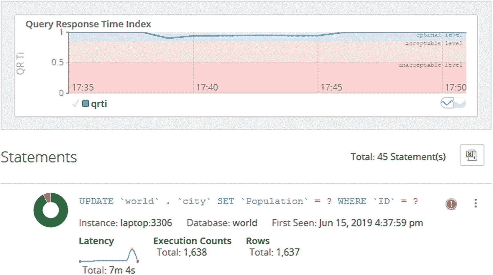
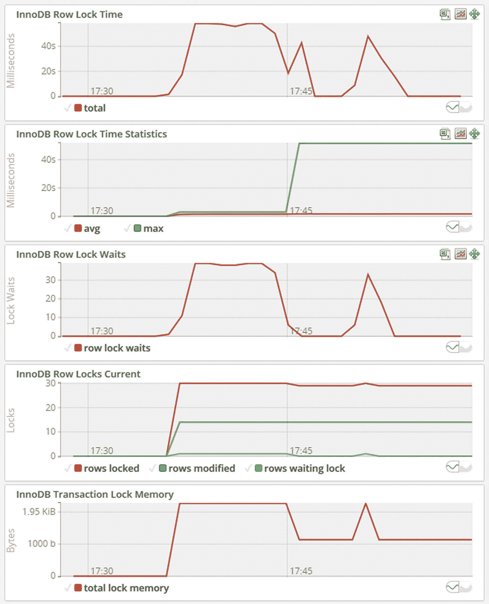
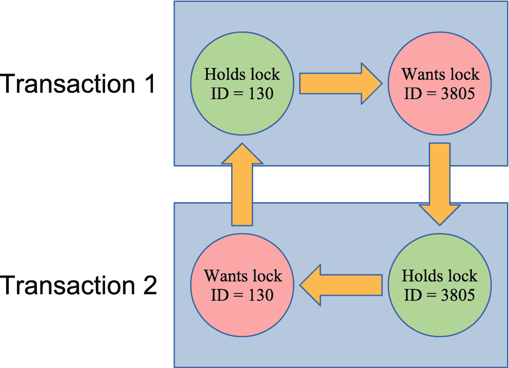

# 22.诊断锁争用

在第 [18](18.html) 章中，你被介绍到了 MySQL 中的锁的世界。如果你还没有读过第 18 章[的话，强烈建议你现在就去读，因为这一章是紧密相关的。如果你已经读过一段时间了，你甚至可能想刷新一下你的记忆。锁定问题是性能问题的常见原因之一，其影响可能非常严重。在最坏的情况下，查询可能会失败，连接会堆积起来，因此无法建立新的连接。因此，了解如何调查锁定问题并修复这些问题非常重要。](18.html)

本章将讨论四类锁问题:

*   平齐锁

*   元数据和模式锁

*   记录级锁，包括间隙锁

*   僵局

每一类锁都使用不同的技术来确定锁争用的原因。当您阅读示例时，您应该记住，可以使用类似的技术来调查与示例不完全匹配的锁问题。

对于每个锁类别，讨论分为六个部分:

*   **症状:**这描述了您如何识别遇到了这种锁定问题。

*   **原因:**您遇到这种锁定问题的根本原因。这与第 [18](18.html) 章中对锁的一般性讨论有关。

*   **设置:**这包括设置锁定问题的步骤，如果你想自己尝试的话。因为锁争用需要多个连接，所以提示符，例如`Connection 1>`，用于告诉哪个连接应该用于哪个语句。如果您希望在调查过程中获得的信息不会比在真实案例中获得的更多，那么您可以跳过这一部分，在完成调查后再回头查看。

*   **调查:**调查的细节。这利用了第 [18](18.html) 章的“监控锁”一节。

*   **解决方案:**如何解决即时锁定问题，从而最大限度地减少由此导致的停机。

*   **预防:**讨论如何减少遇到问题的机会。这与第 [18](18.html) 章中的“减少锁定问题”一节密切相关。

说得够多了，首先要讨论的锁类别是齐平锁。

## 平齐锁

MySQL 中常见的锁问题之一是刷新锁。当这个问题发生时，用户通常会抱怨查询没有返回，监控可能会显示查询越积越多，最终 MySQL 将耗尽连接。关于刷新锁的问题有时也是最难调查的锁问题之一。

### 症状

flush lock 问题的主要症状是数据库陷入停滞，所有使用部分或全部表的新查询都要等待 flush lock。要寻找的迹象包括:

*   新查询的查询状态是“等待表刷新”这可能发生在所有新查询中，也可能只发生在访问特定表的查询中。

*   越来越多的连接被创建。

*   最终，由于 MySQL 失去连接，新的连接会失败。新连接收到的错误为`ER_CON_COUNT_ERROR`:使用经典 MySQL 协议(默认端口 3306)时“错误 1040 (HY000):连接过多”或使用 X 协议(默认端口 33060)时“MySQL 错误 5011:无法打开会话”。

*   至少有一个查询的运行时间晚于最早的刷新锁请求。

*   进程列表中可能会有一个`FLUSH TABLES`语句，但并不总是这样。

*   当`FLUSH TABLES`语句等待`lock_wait_timeout`时，出现`ER_LOCK_WAIT_TIMEOUT`错误:`ERROR: 1205: Lock wait timeout exceeded; try restarting transaction`。因为`lock_wait_timeout`的默认值是 365 天，所以只有在超时时间减少的情况下，这种情况才有可能发生。

*   如果您使用默认模式集连接到`mysql`命令行客户端，那么在您到达提示符之前，连接可能会挂起。如果在连接打开的情况下更改默认模式，也会发生同样的情况。

Tip

如果您使用禁用收集自动完成信息的`-A`选项启动客户端，则不会出现`mysql`命令行客户端阻塞的问题。更好的解决方案是使用 MySQL Shell，它以一种不会因刷新锁而阻塞的方式获取自动完成信息。

如果您看到这些症状，是时候了解是什么导致了锁定问题。

### 原因

当一个连接请求刷新一个表时，它要求关闭对该表的所有引用，这意味着没有活动查询可以使用该表。因此，当刷新请求到达时，它必须等待所有使用要刷新的表的查询完成。请注意，除非您明确指定要刷新哪些表，否则必须完成的只是查询，而不是整个事务。显然，所有表都被刷新的情况是最严重的，例如由于`FLUSH TABLES WITH READ LOCK`，因为这意味着所有活动查询必须在 flush 语句可以继续之前完成。

当等待刷新锁成为一个问题时，这意味着有一个或多个查询阻止了`FLUSH TABLES`语句获得刷新锁。由于`FLUSH TABLES`语句需要一个排他锁，因此它会阻止后续查询获取它们需要的共享锁。

在备份过程需要刷新所有表并获得读锁以创建一致备份的情况下，此问题经常出现。

当`FLUSH TABLES`语句超时或被终止，但后续查询没有继续进行时，可能会出现一种特殊情况。出现这种情况是因为低级表定义缓存(TDC)版本锁没有被释放。这种情况可能会引起混淆，因为后续查询仍在等待表刷新的原因并不明显。

### 设置

将要调查的锁定情况涉及三个连接(不包括用于调查的连接)。第一个连接执行慢速查询，第二个连接使用读锁刷新所有表，最后一个连接执行快速查询。这些声明是

```
Connection 1> SELECT city.*, SLEEP(180) FROM world.city WHERE ID = 130;

Connection 2> FLUSH TABLES WITH READ LOCK;

Connection 3> SELECT * FROM world.city WHERE ID = 3805;

```

在第一个查询中使用`SLEEP(180)`意味着您有三分钟(180 秒)的时间来执行另外两个查询并执行调查。如果你想要更长的时间，你可以增加睡眠的持续时间。你现在可以开始调查了。

### 调查

对刷新锁的调查要求您查看实例上运行的查询列表。与其他锁争用不同，没有性能模式表或 InnoDB monitor 报告可用于直接查询阻塞查询。

清单 [22-1](#PC2) 显示了使用`sys.session`视图的输出示例。使用获取查询列表的替代方法将产生类似的结果。线程和连接 id 以及语句延迟会有所不同。

```
mysql> SELECT thd_id, conn_id, state,
              current_statement,
              statement_latency
         FROM sys.session
        WHERE command = 'Query'\G
*************************** 1\. row ***************************
           thd_id: 30
          conn_id: 9
            state: User sleep
current_statement: SELECT city.*, SLEEP(180) FROM city WHERE ID = 130
statement_latency: 49.97 s
*************************** 2\. row ***************************
           thd_id: 53
          conn_id: 14
            state: Waiting for table flush
current_statement: FLUSH TABLES WITH READ LOCK
statement_latency: 44.48 s
*************************** 3\. row ***************************
           thd_id: 51
          conn_id: 13
            state: Waiting for table flush
current_statement: SELECT * FROM world.city WHERE ID = 3805
statement_latency: 41.93 s
*************************** 4\. row ***************************
           thd_id: 29
          conn_id: 8
            state: NULL
current_statement: SELECT thd_id, conn_id, state, ... ession WHERE command = 'Query'
statement_latency: 56.13 ms
4 rows in set (0.0644 sec)

Listing 22-1Investigating flush lock contention using sys.session

```

输出中有四个查询。默认情况下，`sys.session`和`sys.processlist`视图根据执行时间以降序对查询进行排序。这使得调查类似围绕刷新锁的争用这样的问题变得容易，在查找原因时，查询时间是要考虑的主要因素。

您开始寻找`FLUSH TABLES`语句(稍后将讨论没有`FLUSH TABLES`语句的情况)。在这种情况下，那就是`thd_id = 53`(第二排)。注意，`FLUSH`语句的状态是“等待表刷新”然后查找已经运行了较长时间的查询。在这种情况下，只有一个查询:带有`thd_id = 30`的查询。这是阻止`FLUSH TABLES WITH READ LOCK`完成的查询。通常，可能有不止一个查询。

剩下的两个查询是被`FLUSH TABLES WITH READ LOCK`阻塞的查询和获取输出的查询。前三个查询一起构成了一个长时间运行的查询阻塞一个`FLUSH TABLES`语句的典型例子，该语句又阻塞了其他查询。

您还可以从 MySQL Workbench 获取进程列表，在某些情况下，还可以从您的监控解决方案中获取。图 [22-1](#Fig1) 展示了如何从 MySQL Workbench 获取进程列表。


图 22-1

显示 MySQL Workbench 中的客户端连接

要在 MySQL Workbench 中获得进程列表报告，请在屏幕左侧的导航器窗格中选择*管理*下的*客户端连接*项。您不能选择要包括哪些列，并且为了使文本可读，屏幕截图中只包括报告的一部分。 *Id* 列对应`sys.session`输出中的`conn_id`，而*线程*(最右边一列)对应`thd_id`。完整的截图作为`figure_22_1_workbench_flush_lock.png`收录在本书的 GitHub 知识库中。

图 [22-2](#Fig2) 显示了来自 MySQL 企业监视器(MEM)的*进程*报告的例子。


图 22-2

MEM 冲水闸调查流程报告

在各个实例的*指标*菜单项下可以找到*进程*报告。您可以选择要在输出中包含的列。在本书的 GitHub 知识库中可以找到一个包含更多细节的报告示例`figure_22_2_mem_flush_lock.png`。

类似 MySQL Workbench 和 MySQL Enterprise Monitor 中的报告的一个优点是，它们使用现有的连接来创建报告。在锁问题导致所有连接都被使用的情况下，使用监控解决方案获得查询列表是非常宝贵的。

如前所述，`FLUSH TABLES`语句可能并不总是出现在查询列表中。仍然有查询等待刷新表的原因是低级 TDC 版本锁。调查的原则保持不变，但它似乎令人困惑。清单 [22-2](#PC3) 展示了这样一个例子，使用相同的设置，但是在调查之前杀死执行 flush 语句的连接(Ctrl+C 可以在 MySQL Shell 中用于执行`FLUSH TABLES WITH READ LOCK`的连接)。

```
mysql> SELECT thd_id, conn_id, state,
              current_statement,
              statement_latency
         FROM sys.session
        WHERE command = 'Query'\G
*************************** 1\. row ***************************
           thd_id: 30
          conn_id: 9
            state: User sleep
current_statement: SELECT *, SLEEP(180) FROM city WHERE ID = 130
statement_latency: 24.16 s
*************************** 2\. row ***************************
           thd_id: 51
          conn_id: 13
            state: Waiting for table flush
current_statement: SELECT * FROM world.city WHERE ID = 3805
statement_latency: 20.20 s
*************************** 3\. row ***************************
           thd_id: 29
          conn_id: 8
            state: NULL
current_statement: SELECT thd_id, conn_id, state, ... ession WHERE command = 'Query'
statement_latency: 47.02 ms
3 rows in set (0.0548 sec)

Listing 22-2Flush lock contention without a FLUSH TABLES statement

```

这种情况与前一种情况相同，只是没有了`FLUSH TABLES`语句。在这种情况下，查找等待时间最长且状态为“等待表刷新”的查询运行时间超过该查询等待时间的查询会阻止 TDC 版本锁被释放。在这种情况下，这意味着`thd_id = 30`是阻塞查询。

一旦您确定了问题和涉及的主要查询，您需要决定如何处理该问题。

### 解决方案

解决这个问题有两个层次。首先，您需要解决查询不执行的直接问题。其次，你需要努力避免将来出现这种问题。本小节将讨论即时解决方案，下一小节将考虑如何减少问题发生的几率。

要解决眼前的问题，您可以选择等待查询完成或开始终止查询。如果您可以在刷新锁争用正在进行时重定向应用程序以使用另一个实例，那么通过让长时间运行的查询完成，您也许能够让这种情况自行解决。如果在那些正在运行或等待的查询中有数据更改查询，在这种情况下，您确实需要考虑在所有查询完成后，它是否会使系统保持一致的状态。一种选择是以只读模式继续在不同的实例上执行读取查询。

如果您决定终止查询，您可以尝试终止`FLUSH TABLES`语句。如果这行得通，这是最简单的解决方案。然而，正如所讨论的那样，这并不总是有帮助的，在这种情况下，唯一的解决方案是终止那些阻止`FLUSH TABLES`语句完成的查询。如果长时间运行的查询看起来像失控的查询，并且执行它们的应用程序/客户端不再等待它们，那么您可能想要杀死它们，而不是试图首先杀死`FLUSH TABLES`语句。

在终止查询时，一个重要的考虑因素是有多少数据被更改。对于一个纯粹的`SELECT`查询(不涉及存储的例程)，那总是没什么，从所做工作的角度来看，杀死它是安全的。然而，对于`INSERT`、`UPDATE`、`DELETE`和类似的查询，如果查询被终止，则更改的数据必须回滚。回滚更改通常比一开始就进行更改需要更长的时间，所以如果有很多更改，请准备好等待很长时间才能回滚。您可以使用`information_schema.INNODB_TRX`表，通过查看`trx_rows_modified`列来估计完成的工作量。如果有大量工作要回滚，通常最好让查询完成。

Caution

当 DML 语句被终止时，它所做的工作必须回滚。回滚通常比创建变更花费更长的时间，有时甚至更长。如果你考虑终止一个长时间运行的 DML 语句，你需要考虑到这一点。

当然，最理想的情况是完全防止问题发生。

### 预防

刷新锁争用的发生是因为长时间运行的查询和一个`FLUSH TABLES`语句的组合。因此，为了防止这个问题，你需要看看你能做些什么来避免这两种情况同时出现。

查找、分析和处理长时间运行的查询将在整本书的其他章节中讨论。一个特别有趣的选项是为查询设置超时。使用`max_execution_time`系统变量和`MAX_EXECUTION_TIME(N)`优化器提示的`SELECT`语句支持这一点，这是防止失控查询的一个好方法。一些连接器还支持超时查询。

Tip

为了避免长时间运行的`SELECT`查询，您可以配置`max_execution_time`选项或者设置`MAX_EXECUTION_TIME(N)`优化器提示。这将使`SELECT`语句在指定的时间段后超时，并有助于防止类似刷新锁等待的问题。

无法阻止某些长时间运行的查询。这可能是一项报告作业、构建缓存表或其他必须访问大量数据的任务。在这种情况下，您能做的最好的事情就是尽量避免它们运行，同时也有必要刷新表。一种选择是将长时间运行的查询安排在不同于需要刷新表的时间运行。另一种选择是让长时间运行的查询在不同于需要刷新表的作业的实例上运行。

需要刷新表的一个常见任务是进行备份。在 MySQL 8 中，可以通过使用备份和日志锁来避免这个问题。例如，MySQL Enterprise Backup (MEB)在版本 8.0.16 和更高版本中执行此操作，因此 InnoDB 表永远不会被刷新。或者，您可以在使用率较低的时段执行备份，这样潜在的冲突会更低，或者您甚至可以在系统处于只读模式时执行备份，从而完全避免`FLUSH TABLES WITH READ LOCK`。

另一种经常引起混淆的锁类型是元数据锁。

## 元数据和模式锁

在 MySQL 5.7 和更早的版本中，元数据锁经常是混淆的来源。问题是谁持有元数据锁并不明显。在 MySQL 5.7 中，元数据锁的检测被添加到性能模式中，而在 MySQL 8.0 中，它是默认启用的。启用该工具后，就可以很容易地确定是谁阻塞了试图获取锁的连接。

### 症状

元数据锁争用的症状类似于刷新锁争用的症状。在典型的情况下，会有一个长时间运行的查询或事务、一个等待元数据锁定的 DDL 语句，以及可能堆积起来的查询。要注意的症状如下:

*   DDL 语句和其他可能的查询都停留在“等待表元数据锁定”状态。

*   查询可能会堆积如山。等待中的查询都使用同一个表。(如果有多个表的 DDL 语句在等待元数据锁，则可能有不止一组查询在等待。)

*   当 DDL 语句已经等待`lock_wait_timeout`时，出现一个`ER_LOCK_WAIT_TIMEOUT`错误:`ERROR: 1205: Lock wait timeout exceeded; try restarting transaction`。由于`lock_wait_timeout`的默认值是 365 天，只有在超时时间减少的情况下，这种情况才有可能发生。

*   有一个长时间运行的查询或长时间运行的事务。在后一种情况下，事务可能处于空闲状态，或者正在执行一个不使用 DDL 语句所作用的表的查询。

使这种情况变得潜在混乱的是最后一点:可能没有任何长时间运行的查询是导致锁问题的明确候选。那么元数据锁争用的原因是什么呢？

### 原因

请记住，元数据锁的存在是为了保护模式定义(以及与显式锁一起使用)。只要事务处于活动状态，模式保护就会一直存在，因此当事务查询表时，元数据锁定将持续到事务结束。因此，您可能看不到任何长时间运行的查询。事实上，持有元数据锁的事务可能根本不做任何事情。

简而言之，元数据锁的存在是因为一个或多个连接可能依赖于给定表的模式不变，或者它们已经使用`LOCK TABLES`或`FLUSH TABLES WITH READ LOCK`语句显式锁定了该表。

### 设置

元数据锁的示例调查使用了三个连接，就像前面的示例一样。第一个连接正在进行事务处理，第二个连接尝试向事务处理使用的表添加索引，第三个连接尝试对同一个表执行查询。这些查询是

```
Connection 1> START TRANSACTION;
Query OK, 0 rows affected (0.0003 sec)

Connection 1> SELECT * FROM world.city WHERE ID = 3805\G *************************** 1\. row ***************************
         ID: 3805
       Name: San Francisco
CountryCode: USA
   District: California
 Population: 776733
1 row in set (0.0006 sec)

Connection 1> SELECT Code, Name FROM world.country WHERE Code = 'USA'\G
*************************** 1\. row ***************************
Code: USA
Name: United States
1 row in set (0.0020 sec)

Connection 2> ALTER TABLE world.city ADD INDEX (Name);

Connection 3> SELECT * FROM world.city WHERE ID = 130;

```

此时，可以开始调查了。这种情况不会自行解决(除非你的`lock_wait_timeout`值很低，或者你准备等一年)，所以你有足够的时间。当您想要解决这个阻塞时，您可以开始终止连接 2 中的`ALTER TABLE`语句，以避免修改`world.city`表。然后提交或回滚连接 1 中的事务。

### 调查

如果启用了`wait/lock/metadata/sql/mdl`性能模式工具(MySQL 8 中的默认设置)，那么调查元数据锁定问题就很简单了。您可以使用性能模式中的`metadata_locks`表来列出授予的和挂起的锁。然而，获得锁情况摘要的一个更简单的方法是使用`sys`模式中的`schema_table_lock_waits`视图。

作为一个例子，考虑在清单 [22-3](#PC5) 中可以看到的元数据锁定等待问题，其中涉及三个连接。选择了`WHERE`子句，以便只包含该调查感兴趣的行。

```
mysql> SELECT thd_id, conn_id, state,
              current_statement,
              statement_latency
         FROM sys.session
        WHERE command = 'Query' OR trx_state = 'ACTIVE'\G
*************************** 1\. row ***************************
           thd_id: 30
          conn_id: 9
            state: NULL
current_statement: SELECT Code, Name FROM world.country WHERE Code = 'USA'
statement_latency: NULL
*************************** 2\. row ***************************
           thd_id: 7130
          conn_id: 7090
            state: Waiting for table metadata lock
current_statement: ALTER TABLE world.city ADD INDEX (Name)
statement_latency: 19.92 m
*************************** 3\. row ***************************
           thd_id: 51
          conn_id: 13
            state: Waiting for table metadata lock
current_statement: SELECT * FROM world.city WHERE ID = 130
statement_latency: 19.78 m
*************************** 4\. row ***************************
           thd_id: 107
          conn_id: 46
            state: NULL
current_statement: SELECT thd_id, conn_id, state, ... Query' OR trx_state = 'ACTIVE'
statement_latency: 56.77 ms
3 rows in set (0.0629 sec)

Listing 22-3A metadata lock wait issue

```

两个连接正在等待元数据锁定(在`world.city`表上)。包括第三个连接(`conn_id = 9`)，它是空闲的，这可以从语句延迟的`NULL`中看出(在 8.0.18 之前的一些版本中，您也可以看到当前语句是`NULL`)。在这种情况下，查询列表仅限于具有活动查询或活动事务的查询，但通常您会从完整的进程列表开始。然而，为了便于关注重要的部分，输出被过滤。

一旦您知道存在元数据锁定问题，您可以使用`sys.schema_table_lock_waits`视图来获取关于锁定争用的信息。清单 [22-4](#PC6) 显示了与刚才讨论的进程列表相对应的输出示例。

```
mysql> SELECT *
         FROM sys.schema_table_lock_waits\G
*************************** 1\. row ***************************
               object_schema: world
                 object_name: city
           waiting_thread_id: 7130
                 waiting_pid: 7090
             waiting_account: root@localhost
           waiting_lock_type: EXCLUSIVE
       waiting_lock_duration: TRANSACTION
               waiting_query: ALTER TABLE world.city ADD INDEX (Name)
          waiting_query_secs: 1219
 waiting_query_rows_affected: 0
 waiting_query_rows_examined: 0
          blocking_thread_id: 7130
                blocking_pid: 7090
            blocking_account: root@localhost
          blocking_lock_type: SHARED_UPGRADABLE
      blocking_lock_duration: TRANSACTION
     sql_kill_blocking_query: KILL QUERY 7090
sql_kill_blocking_connection: KILL 7090
*************************** 2\. row ***************************
               object_schema: world
                 object_name: city
           waiting_thread_id: 51
                 waiting_pid: 13
             waiting_account: root@localhost
           waiting_lock_type: SHARED_READ
       waiting_lock_duration: TRANSACTION
               waiting_query: SELECT * FROM world.city WHERE ID = 130
          waiting_query_secs: 1210
 waiting_query_rows_affected: 0
 waiting_query_rows_examined: 0
          blocking_thread_id: 7130
                blocking_pid: 7090
            blocking_account: root@localhost
          blocking_lock_type: SHARED_UPGRADABLE
      blocking_lock_duration: TRANSACTION
     sql_kill_blocking_query: KILL QUERY 7090
sql_kill_blocking_connection: KILL 7090
*************************** 3\. row ***************************
               object_schema: world
                 object_name: city
           waiting_thread_id: 7130
                 waiting_pid: 7090
             waiting_account: root@localhost
           waiting_lock_type: EXCLUSIVE
       waiting_lock_duration: TRANSACTION
               waiting_query: ALTER TABLE world.city ADD INDEX (Name)
          waiting_query_secs: 1219
 waiting_query_rows_affected: 0
 waiting_query_rows_examined: 0
          blocking_thread_id: 30
                blocking_pid: 9
            blocking_account: root@localhost
          blocking_lock_type: SHARED_READ
      blocking_lock_duration: TRANSACTION
     sql_kill_blocking_query: KILL QUERY 9
sql_kill_blocking_connection: KILL 9
*************************** 4\. row ***************************
               object_schema: world
                 object_name: city
           waiting_thread_id: 51
                 waiting_pid: 13
             waiting_account: root@localhost
           waiting_lock_type: SHARED_READ
       waiting_lock_duration: TRANSACTION
               waiting_query: SELECT * FROM world.city WHERE ID = 130
          waiting_query_secs: 1210
 waiting_query_rows_affected: 0
 waiting_query_rows_examined: 0
          blocking_thread_id: 30
                blocking_pid: 9
            blocking_account: root@localhost
          blocking_lock_type: SHARED_READ
      blocking_lock_duration: TRANSACTION
     sql_kill_blocking_query: KILL QUERY 9
sql_kill_blocking_connection: KILL 9
4 rows in set (0.0024 sec)

Listing 22-4Finding metadata lock contention

```

输出显示有四种查询等待和阻塞的情况。这可能令人惊讶，但它确实发生了，因为涉及到几个锁，并且有一系列等待。每一行都是一对等待和阻塞连接。输出使用“pid”作为进程列表 id，这与早期输出中使用的连接 id 相同。这些信息包括锁是什么、等待连接的详细信息、阻塞连接的详细信息以及可用于终止阻塞查询或连接的两个查询。

第一行显示了等待自身的进程列表 id 7090。这听起来像是一个僵局，但事实并非如此。原因是`ALTER TABLE`首先获取了一个可以升级的共享锁，然后试图获取正在等待的独占锁。因为没有关于哪个现有锁实际上阻塞了新锁的明确信息，所以该信息最终被包括在内。

第二行显示`SELECT`语句正在等待进程列表 id 7090，即`ALTER TABLE`。这就是当 DDL 语句需要一个独占锁时，连接会开始堆积的原因，所以它会阻塞对共享锁的请求。

第三和第四行揭示了锁争用的潜在问题。进程列表 id 9 阻塞了其他两个连接，这表明这是阻塞 DDL 语句的罪魁祸首。因此，当您调查类似这样的问题时，请查找正在等待被另一个连接阻塞的独占元数据锁的连接。如果输出中有大量的行，您还可以查找导致最多阻塞的连接，并以此为起点。清单 [22-5](#PC7) 展示了如何做到这一点的例子。

```
mysql> SELECT *
         FROM sys.schema_table_lock_waits
        WHERE waiting_lock_type = 'EXCLUSIVE'
              AND waiting_pid <> blocking_pid\G
*************************** 1\. row ***************************
               object_schema: world
                 object_name: city
           waiting_thread_id: 7130
                 waiting_pid: 7090
             waiting_account: root@localhost
           waiting_lock_type: EXCLUSIVE
       waiting_lock_duration: TRANSACTION
               waiting_query: ALTER TABLE world.city ADD INDEX (Name)
          waiting_query_secs: 4906
 waiting_query_rows_affected: 0
 waiting_query_rows_examined: 0
          blocking_thread_id: 30
                blocking_pid: 9
            blocking_account: root@localhost
          blocking_lock_type: SHARED_READ
      blocking_lock_duration: TRANSACTION
     sql_kill_blocking_query: KILL QUERY 9
sql_kill_blocking_connection: KILL 9
1 row in set (0.0056 sec)

mysql> SELECT blocking_pid, COUNT(*)
         FROM sys.schema_table_lock_waits
        WHERE waiting_pid <> blocking_pid
        GROUP BY blocking_pid
        ORDER BY COUNT(*) DESC;
+--------------+----------+
| blocking_pid | COUNT(*) |
+--------------+----------+
|            9 |        2 |
|         7090 |        1 |
+--------------+----------+
2 rows in set (0.0028 sec)

Listing 22-5Looking for the connection causing the metadata lock block

```

第一个查询寻找对独占元数据锁的等待，其中阻塞进程列表 id 不是它本身。在这种情况下，这会立即导致主块争用。第二个查询确定每个进程列表 id 触发的阻塞查询的数量。这可能不像这个例子中显示的那么简单，但是使用这里显示的查询将有助于缩小锁争用的范围。

一旦确定了锁争用的来源，就需要确定事务正在做什么。在这种情况下，锁争用的根源是连接 9。回到进程列表输出，您可以看到在这种情况下它没有做任何事情:

```
*************************** 1\. row ***************************
           thd_id: 30
          conn_id: 9
            state: NULL
current_statement: SELECT Code, Name FROM world.country WHERE Code = 'USA'
statement_latency: NULL

```

这个连接做了什么来获取元数据锁？没有涉及`world.city`表的当前语句这一事实表明该连接有一个活动的事务打开。在这种情况下，事务是空闲的(如`statement_latency = NULL`所示)，但也可能有一个与`world.city`表上的元数据锁无关的查询正在执行。无论哪种情况，您都需要确定事务在当前状态之前正在做什么。为此，您可以使用性能模式和信息模式。清单 [22-6](#PC9) 展示了一个调查事务状态和最近历史的例子。

```
mysql> SELECT *
         FROM information_schema.INNODB_TRX
        WHERE trx_mysql_thread_id = 9\G
*************************** 1\. row ***************************
                    trx_id: 283529000061592
                 trx_state: RUNNING
               trx_started: 2019-06-15 13:22:29
     trx_requested_lock_id: NULL
          trx_wait_started: NULL
                trx_weight: 0
       trx_mysql_thread_id: 9
                 trx_query: NULL
       trx_operation_state: NULL
         trx_tables_in_use: 0
         trx_tables_locked: 0
          trx_lock_structs: 0
     trx_lock_memory_bytes: 1136
           trx_rows_locked: 0
         trx_rows_modified: 0
   trx_concurrency_tickets: 0
       trx_isolation_level: REPEATABLE READ
         trx_unique_checks: 1
    trx_foreign_key_checks: 1
trx_last_foreign_key_error: NULL
 trx_adaptive_hash_latched: 0
 trx_adaptive_hash_timeout: 0
          trx_is_read_only: 0
trx_autocommit_non_locking: 0
1 row in set (0.0006 sec)

mysql> SELECT *
         FROM performance_schema.events_transactions_current
        WHERE THREAD_ID = 30\G
*************************** 1\. row ***************************
                      THREAD_ID: 30
                       EVENT_ID: 113
                   END_EVENT_ID: NULL
                     EVENT_NAME: transaction
                          STATE: ACTIVE
                         TRX_ID: NULL
                           GTID: AUTOMATIC
                  XID_FORMAT_ID: NULL
                      XID_GTRID: NULL
                      XID_BQUAL: NULL
                       XA_STATE: NULL
                         SOURCE: transaction.cc:219
                    TIMER_START: 12849615560172160
                      TIMER_END: 18599491723543808
                     TIMER_WAIT: 5749876163371648
                    ACCESS_MODE: READ WRITE
                ISOLATION_LEVEL: REPEATABLE READ
                     AUTOCOMMIT: NO
           NUMBER_OF_SAVEPOINTS: 0
NUMBER_OF_ROLLBACK_TO_SAVEPOINT: 0
    NUMBER_OF_RELEASE_SAVEPOINT: 0
          OBJECT_INSTANCE_BEGIN: NULL
               NESTING_EVENT_ID: 112
             NESTING_EVENT_TYPE: STATEMENT
1 row in set (0.0008 sec)

mysql> SELECT EVENT_ID, CURRENT_SCHEMA,
              SQL_TEXT
         FROM performance_schema.events_statements_history
        WHERE THREAD_ID = 30
              AND NESTING_EVENT_ID = 113
              AND NESTING_EVENT_TYPE = 'TRANSACTION'\G
*************************** 1\. row ***************************
      EVENT_ID: 114
CURRENT_SCHEMA: world
      SQL_TEXT: SELECT * FROM world.city WHERE ID = 3805
*************************** 2\. row ***************************
      EVENT_ID: 115
CURRENT_SCHEMA: world
      SQL_TEXT: SELECT * FROM world.country WHERE Code = 'USA'
2 rows in set (0.0036 sec)

mysql> SELECT ATTR_NAME, ATTR_VALUE
         FROM performance_schema.session_connect_attrs
        WHERE PROCESSLIST_ID = 9;
+-----------------+------------+
| ATTR_NAME       | ATTR_VALUE |
+-----------------+------------+
| _pid            | 23256      |
| program_name    | mysqlsh    |
| _client_name    | libmysql   |
| _thread         | 20164      |
| _client_version | 8.0.18     |
| _os             | Win64      |
| _platform       | x86_64     |
+-----------------+------------+
7 rows in set (0.0006 sec)

Listing 22-6Investigating a transaction

```

第一个查询使用信息模式中的`INNODB_TRX`表。例如，它显示事务开始的时间，因此您可以确定它已经活动了多长时间。如果决定回滚事务，那么`trx_rows_modified`列对于了解事务更改了多少数据也很有用。注意，InnoDB 所谓的 MySQL 线程 id(`trx_mysql_thread_id`列)实际上是连接 id。

第二个查询使用性能模式中的`events_transactions_current`表来获取更多的事务信息。您可以使用`TIMER_WAIT`列来确定事务的年龄。该值以皮秒为单位，因此使用`FORMAT_PICO_TIME()`函数可以更容易地理解该值:

```
mysql> SELECT FORMAT_PICO_TIME(5749876163371648) AS Age;
+--------+
| Age    |
+--------+
| 1.60 h |
+--------+
1 row in set (0.0003 sec)

```

如果您使用的是 MySQL 8.0.15 或更早版本，请使用`sys.format_time()`函数。

第三个查询使用`events_statements_history`表来查找之前在事务中执行的查询。`NESTING_EVENT_ID`列被设置为来自`events_transactions_current`表输出的`EVENT_ID`的值，而`NESTING_EVENT_TYPE`列被设置为匹配一个事务。这确保了只返回正在进行的事务的子事件。结果由`EVENT_ID`(语句的)排序，按照执行的顺序得到语句。默认情况下，`events_statements_history`表将包含最多十个最新的连接查询。

在这个例子中，调查显示事务执行了两个查询:一个从`world.city`表中选择，另一个从`world.country`表中选择。这是导致元数据锁争用的第一个查询。

第四个查询使用`session_connect_attrs`表来查找连接提交的属性。并非所有客户端和连接器都提交属性，或者它们可能被禁用，因此这些信息并不总是可用。当属性可用时，它们有助于找出违规事务是从哪里执行的。在这个例子中，您可以看到连接来自 MySQL Shell ( `mysqlsh`)。如果您想提交一个空闲事务，这可能很有用。

### 解决方案

对于元数据锁争用，您基本上有两种选择来解决问题:完成阻塞事务或终止 DDL 语句。要完成阻塞事务，您需要提交或回滚它。如果您终止连接，将触发事务回滚，因此您需要考虑需要回滚多少工作。为了提交事务，您必须找到执行连接的位置，并以这种方式提交它。您不能提交由不同连接拥有的事务。

终止 DDL 语句将允许其他查询继续进行，但从长远来看，如果锁被一个已放弃但仍处于活动状态的事务持有，这并不能解决问题。对于持有元数据锁的被放弃的事务，可以选择终止 DDL 语句和与被放弃的事务的连接。这样可以避免 DDL 语句在事务回滚时继续阻塞后续查询。回滚完成后，您可以重试 DDL 语句。

### 预防

避免元数据锁争用的关键是避免长时间运行的事务，同时您需要为事务使用的表执行 DDL 语句。例如，当您知道没有长时间运行的事务时，可以执行 DDL 语句。您还可以将`lock_wait_timeout`选项设置为一个较低的值，这将使 DDL 语句在`lock_wait_timeout`秒后放弃。虽然这不能避免锁问题，但它通过避免 DDL 语句停止其他查询的执行来缓解这个问题。然后，您可以找到根本原因，而不必担心大部分应用程序无法工作。

您还可以致力于缩短事务的活动时间。如果不要求所有操作都作为一个原子单元来执行，一种选择是将一个大的事务分成几个较小的事务。您还应该确保在事务处于活动状态时，您没有进行交互工作、文件 I/O、向最终用户传输数据等，从而确保事务不会保持不必要的长时间打开。

长时间运行事务的一个常见原因是应用程序或客户端根本不提交或回滚事务。禁用`autocommit`选项时，这种情况尤其容易发生。当`autocommit`被禁用时，任何查询——即使是普通的只读`SELECT`语句——都会在没有活动事务的情况下启动一个新事务。这意味着一个看似无辜的查询可能会启动一个事务，如果开发人员不知道`autocommit`被禁用，那么开发人员可能不会考虑显式结束事务。在 MySQL Server 中默认情况下，`autocommit`设置是启用的，但是一些连接器默认情况下禁用它。

关于研究元数据锁的讨论到此结束。下一级锁是记录锁。

## 记录级锁

记录锁争用是最常遇到的，但通常也是最不具干扰性的，因为默认的锁等待超时只有 50 秒，所以不存在查询堆积的可能性。也就是说，在某些情况下——正如将要展示的那样——记录锁会导致 MySQL 嘎然而止。本节将研究 InnoDB 记录锁的一般问题，以及更详细的锁等待超时问题。对死锁细节的研究将推迟到下一节。

### 症状

InnoDB 记录锁争用的症状通常非常微妙，不容易识别。在严重的情况下，您会得到锁等待超时或死锁错误，但在许多情况下，可能没有直接的症状。更确切地说，症状是查询比正常情况下慢。这可能从慢几分之一秒到慢很多秒不等。

对于存在锁等待超时的情况，您将看到类似于以下示例中的`ER_LOCK_WAIT_TIMEOUT`错误:

```
ERROR: 1205: Lock wait timeout exceeded; try restarting transaction

```

当查询比没有锁争用时要慢时，最有可能检测到问题的方法是通过监控，要么使用类似于 MySQL Enterprise Monitor 中的查询分析器，要么使用`sys.innodb_lock_waits`视图检测锁争用。图 [22-3](#Fig3) 显示了查询分析器中的一个查询示例。在讨论记录锁争用的调查时，将使用`sys`模式视图。该图在本书的 GitHub 知识库中以`figure_22_3_quan.png`的形式提供。



图 22-3

查询分析器中检测到的锁争用示例

在图中，请注意查询的延迟图是如何在接近周期结束时增加，然后又突然下降的。规范化查询的右侧还有一个红色图标，该图标表示查询返回了错误。在这种情况下，错误是锁等待超时，但是从图中看不到。规范化查询左侧的环形图表还显示了一个红色区域，指示查询的查询响应时间索引有时被认为很差。顶部的大图显示了一个小的下降，表明实例中有足够多的问题导致实例的性能普遍下降。

还有几个实例级指标显示实例发生了多少锁定。这对于监控一段时间内的一般锁争用非常有用。清单 [22-7](#PC12) 使用`sys.metrics`视图显示了可用的指标。

```
mysql> SELECT Variable_name,
              Variable_value AS Value,
              Enabled
         FROM sys.metrics
        WHERE Variable_name LIKE 'innodb_row_lock%'
              OR Type = 'InnoDB Metrics - lock';
+-------------------------------+--------+---------+
| Variable_name                 | Value  | Enabled |
+-------------------------------+--------+---------+
| innodb_row_lock_current_waits | 0      | YES     |
| innodb_row_lock_time          | 595876 | YES     |
| innodb_row_lock_time_avg      | 1683   | YES     |
| innodb_row_lock_time_max      | 51531  | YES     |
| innodb_row_lock_waits         | 354    | YES     |
| lock_deadlocks                | 0      | YES     |
| lock_rec_lock_created         | 0      | NO      |
| lock_rec_lock_removed         | 0      | NO      |
| lock_rec_lock_requests        | 0      | NO      |
| lock_rec_lock_waits           | 0      | NO      |
| lock_rec_locks                | 0      | NO      |
| lock_row_lock_current_waits   | 0      | YES     |
| lock_table_lock_created       | 0      | NO      |
| lock_table_lock_removed       | 0      | NO      |
| lock_table_lock_waits         | 0      | NO      |
| lock_table_locks              | 0      | NO      |
| lock_timeouts                 | 1      | YES     |
+-------------------------------+--------+---------+
17 rows in set (0.0203 sec)

Listing 22-7InnoDB lock metrics

```

对于这个讨论，`innodb_row_lock_%`和`lock_timeouts`指标是最有趣的。三个时间变量以毫秒为单位。可以看到，有一个锁等待超时，这本身并不一定是一个问题。您还可以看到有 354 种情况下锁不能被立即授予(`innodb_row_lock_waits`)，并且等待时间超过 51 秒(`innodb_row_lock_time_max`)。当锁争用的总体水平增加时，您将看到这些指标也在增加。

甚至比手动监控指标更好的是，确保您的监控解决方案记录指标，并可以在时间序列图中绘制它们。图 [22-4](#Fig4) 显示了针对图 [22-3](#Fig3) 中发现的同一事件绘制的指标示例。



图 22-4

InnoDB 行锁指标的时间序列图

图表显示了锁定的总体增加。锁等待的数量有两个阶段，随着锁等待的增加，然后再次下降。行锁定时间图显示了类似的模式。这是间歇性锁定问题的典型迹象。

### 原因

InnoDB 在行数据、索引记录、间隙和插入意图锁上使用共享锁和排他锁。当有两个事务试图以冲突的方式访问数据时，一个查询将不得不等待，直到所需的锁可用。简而言之，可以同时允许两个对共享锁的请求，但是一旦有了独占锁，任何连接都不能在同一个记录上获得锁。

由于排他锁最有可能导致锁争用，因此通常 DML 查询会更改导致 InnoDB 记录锁争用的数据。另一个来源是`SELECT`语句通过添加`FOR SHARE`(或`LOCK IN SHARE MODE`或`FOR UPDATE`子句来进行抢先锁定。

### 设置

这个示例只需要两个连接来设置正在研究的场景，第一个连接有一个正在进行的事务，第二个连接试图更新第一个连接持有锁的行。因为等待 InnoDB 锁的默认超时是 50 秒，所以您可以选择增加第二个连接的超时时间，这将会阻塞，以便您有更多的时间来执行调查。设置是

```
Connection 1> START TRANSACTION;
Query OK, 0 rows affected (0.0002 sec)

Connection 1> UPDATE world.city
                 SET Population = 5000000
               WHERE ID = 130;
Query OK, 1 row affected (0.0005 sec)

Rows matched: 1  Changed: 1  Warnings: 0

Connection 2> SET SESSION innodb_lock_wait_timeout = 300;
Query OK, 0 rows affected (0.0003 sec)

Connection 2> START TRANSACTION;
Query OK, 0 rows affected (0.0003 sec)

Connection 2> UPDATE world.city SET Population = Population * 1.10 WHERE CountryCode = 'AUS';

```

在本例中，连接 2 的锁定等待超时设置为 300 秒。Connection 2 的`START TRANSACTION`不是必需的，但是允许您在完成后回滚两个事务，以避免对数据进行更改。

### 调查

调查记录锁与调查元数据锁非常相似。您可以查询性能模式中的`data_locks`和`data_lock_waits`表，它们将分别显示原始锁数据和挂起的锁。还有一个`sys.innodb_lock_waits`视图，它查询两个表来寻找一个被另一个阻塞的锁对。

Note

MySQL 8 中新增了`data_locks`和`data_lock_waits`表。在 MySQL 5.7 和更早的版本中，信息模式中有两个相似的表，分别名为`INNODB_LOCKS`和`INNODB_LOCK_WAITS`。使用`innodb_lock_waits`视图的一个优点是它在不同的 MySQL 版本上工作是一样的(但是在 MySQL 8 中有一些额外的信息)。

在大多数情况下，使用`innodb_lock_waits`视图开始调查是最容易的，并且只在需要时深入性能模式表。清单 [22-8](#PC14) 显示了锁等待情况下`innodb_lock_waits`的输出示例。

```
mysql> SELECT * FROM sys.innodb_lock_waits\G
*************************** 1\. row ***************************
                wait_started: 2019-06-15 18:37:42
                    wait_age: 00:00:02
               wait_age_secs: 2
                locked_table: `world`.`city`
         locked_table_schema: world
           locked_table_name: city
      locked_table_partition: NULL
   locked_table_subpartition: NULL
                locked_index: PRIMARY
                 locked_type: RECORD
              waiting_trx_id: 3317978
         waiting_trx_started: 2019-06-15 18:37:42
             waiting_trx_age: 00:00:02
     waiting_trx_rows_locked: 2
   waiting_trx_rows_modified: 0
                 waiting_pid: 4172
               waiting_query: UPDATE city SET Population = P ... 1.10 WHERE CountryCode = 'AUS'
             waiting_lock_id: 1999758099664:525:6:131:1999728339632
           waiting_lock_mode: X,REC_NOT_GAP
             blocking_trx_id: 3317977
                blocking_pid: 9
              blocking_query: NULL
            blocking_lock_id: 1999758097920:525:6:131:1999728329336
          blocking_lock_mode: X,REC_NOT_GAP
        blocking_trx_started: 2019-06-15 18:37:40
            blocking_trx_age: 00:00:04
    blocking_trx_rows_locked: 1
  blocking_trx_rows_modified: 1
     sql_kill_blocking_query: KILL QUERY 9
sql_kill_blocking_connection: KILL 9
1 row in set (0.0145 sec)

Listing 22-8Retrieving lock information from the innodb_lock_waits view

```

根据列名的前缀，输出中的列可以分为五个部分。这些群体是

*   **wait_:** 这些列显示了锁等待时间的一些一般信息。

*   **locked_:** 这些列显示了从模式到索引以及锁类型的锁定内容。

*   **waiting_:** 这些列显示等待授予锁的事务的详细信息，包括查询和请求的锁模式。

*   **blocking_:** 这些列显示了阻塞锁请求的事务的详细信息。注意，在这个例子中，阻塞查询是`NULL`。这意味着在生成输出时事务是空闲的。即使列出了阻塞查询，该查询也可能与存在争用的锁没有任何关系——除了该查询是由持有锁的同一事务执行的。

*   **sql_kill_:** 这两列提供了可用于终止阻塞查询或连接的`KILL`查询。

Note

列`blocking_query`是阻塞事务当前执行的查询(如果有的话)。这并不意味着查询本身必然会导致锁请求阻塞。

`blocking_query`列为`NULL`的情况是常见情况。这意味着阻塞事务当前没有执行查询。这可能是因为它在两个查询之间。如果这段时间很长，则表明应用程序正在做理想情况下应该在事务之外完成的工作。更常见的情况是，事务没有执行查询，因为它被遗忘了，要么是在交互会话中，人们忘记了结束事务，要么是在应用程序流中，不能确保事务被提交或回滚。

### 解决方案

解决方案取决于锁等待的程度。如果有几个查询的锁等待时间很短，那么让受影响的查询等待锁变得可用也是可以接受的。请记住，锁是为了确保数据的完整性，所以锁本身不是问题。只有当锁对性能造成重大影响或者导致查询失败到无法重试的程度时，锁才会成为问题。

如果锁定情况持续很长时间——特别是如果阻塞事务已经被放弃——您可以考虑终止阻塞事务。和往常一样，如果阻塞事务执行了大量工作，您需要考虑回滚可能会花费大量时间。

对于由于锁等待超时错误而失败的查询，应用程序应该重试它们。请记住，默认情况下，锁等待超时仅回滚超时发生时正在执行的查询。事务的其余部分与查询前一样。因此，处理超时失败可能会使未完成的事务带有自己的锁，这可能会导致进一步的锁问题。是只回滚查询还是回滚整个事务由`innodb_rollback_on_timeout`选项控制。

Caution

处理锁等待超时是非常重要的，否则它可能会使事务带有未释放的锁。如果发生这种情况，其他事务可能无法获得它们需要的锁。

### 预防

防止重大的记录级锁争用主要遵循第 [18 章](18.html)的“减少锁定问题”一节中讨论的指南。概括一下讨论，减少锁等待争用的方法主要是减少事务的大小和持续时间，使用索引来减少被访问的记录的数量，并可能将事务隔离级别切换到`READ COMMITTED`来更早地释放锁并减少间隙锁的数量。

## 僵局

数据库管理员最担心的锁问题之一是死锁。这一部分是因为它的名字，另一部分是因为它们不像讨论的其他锁问题那样总是会导致错误。然而，与其他锁定问题相比，没有什么特别担心死锁的。相反，它们导致错误意味着您能更快地知道它们，并且锁问题会自行解决。

### 症状

症状很明显。死锁的受害者收到一个错误，并且`lock_deadlocks` InnoDB 度量增加。将返回给 InnoDB 选择作为受害者的事务的错误是`ER_LOCK_DEADLOCK`:

```
ERROR: 1213: Deadlock found when trying to get lock; try restarting transaction

```

这个指标对于观察死锁发生的频率非常有用。跟踪`lock_deadlocks`的值的一种简便方法是使用`sys.metrics`视图:

```
mysql> SELECT *
         FROM sys.metrics
        WHERE Variable_name = 'lock_deadlocks'\G
*************************** 1\. row ***************************
 Variable_name: lock_deadlocks
Variable_value: 42
          Type: InnoDB Metrics - lock
       Enabled: YES
1 row in set (0.0087 sec)

```

您还可以检查 InnoDB 监视器输出中的`LATEST DETECTED DEADLOCK`部分，例如，通过执行`SHOW ENGINE INNODB STATUS.`这将显示上一次死锁发生的时间，因此您可以使用它来判断死锁发生的频率。如果您启用了`innodb_print_all_deadlocks`选项，错误锁将有许多死锁信息的输出。在讨论了死锁的原因和设置之后，将在“调查”中详细介绍死锁的 InnoDB 监视器输出。

### 原因

死锁是由两个或多个事务以不同的顺序获得锁引起的。每个事务最终都持有另一个事务需要的锁。该锁可以是记录锁、间隙锁、谓词锁或插入意图锁。图 [22-5](#Fig5) 显示了一个触发死锁的循环依赖的例子。



图 22-5

触发死锁的循环锁依赖关系

图中显示的死锁是由于表主键上的两个记录锁造成的。这是可能发生的最简单的死锁之一。如图所示，在调查死锁时，循环可能比这更复杂。

### 设置

本例使用了两个连接，但这一次两个连接都在连接 1 阻塞之前进行了更改，直到连接 2 因出错而回滚其更改。连接 1 用 10%更新澳大利亚及其城市的人口，而连接 2 用达尔文市的人口更新澳大利亚人口并添加城市。这些声明是

```
Connection 1> START TRANSACTION;
Query OK, 0 rows affected (0.0001 sec)

Connection 1> UPDATE world.city SET Population = Population * 1.10 WHERE CountryCode = 'AUS';
Query OK, 14 rows affected (0.0010 sec)

Rows matched: 14  Changed: 14  Warnings: 0

Connection 2> START TRANSACTION;
Query OK, 0 rows affected (0.0003 sec)

Connection 2> UPDATE world.country SET Population = Population + 146000 WHERE Code = 'AUS';
Query OK, 1 row affected (0.0317 sec)

Rows matched: 1  Changed: 1  Warnings: 0

-- Blocks
Connection 1> UPDATE world.country SET Population = Population * 1.1 WHERE Code = 'AUS';

Connection 2> INSERT INTO world.city VALUES (4080, 'Darwin', 'AUS', 'Northern Territory', 146000);
ERROR: 1213: Deadlock found when trying to get lock; try restarting transaction

Connection 2> ROLLBACK;
Query OK, 0 rows affected (0.0003 sec)

Connection 1> ROLLBACK;
Query OK, 0 rows affected (0.3301 sec)

```

关键是这两个事务都更新了`city`和`country`表，但是顺序相反。设置通过显式回滚这两个事务来完成，以确保表保持不变。

### 调查

分析死锁的主要工具是 InnoDB monitor 输出中有关最新检测到的死锁的信息部分。如果您启用了`innodb_print_all_deadlocks`选项(默认情况下为`OFF`，您还可以从错误日志中获得死锁信息；然而，信息是相同的，因此它不改变分析。

死锁信息包含描述死锁和结果的四个部分。这些零件是

*   当死锁发生时。

*   死锁中涉及的第一个事务的信息。

*   死锁所涉及的第二个事务的信息。

*   哪个事务被回滚。当`innodb_print_all_deadlocks`启用时，该信息不包括在错误日志中。

两个事务的编号是任意的，主要目的是能够引用一个事务或另一个事务。包含交易信息的两个部分是最重要的部分。它们包括事务处于活动状态的时间长度、关于事务大小的一些统计信息(根据所使用的锁和撤销日志条目等)、正在阻塞等待锁的查询，以及关于死锁中所涉及的锁的信息。

锁信息不像使用`data_locks`和`data_lock_waits`表以及`sys.innodb_lock_waits`视图时那么容易解释。然而，一旦你尝试进行几次分析，这并不太难。

Tip

在测试系统中故意创建一些死锁，并研究由此产生的死锁信息。然后通过信息来确定死锁发生的原因。因为您知道查询，所以更容易解释锁数据。

对于这个死锁调查，考虑清单 [22-9](#PC18) 中显示的 InnoDB 监视器的死锁部分。清单相当长，行也很宽，所以信息也可以在本书的 GitHub 存储库中作为`listing_22_9_deadlock.txt`获得，所以您可以在自己选择的文本编辑器中打开输出。

```
mysql> SHOW ENGINE INNODB STATUS\G
...
------------------------
LATEST DETECTED DEADLOCK
------------------------
2019-11-06 18:29:07 0x4b78
*** (1) TRANSACTION:
TRANSACTION 6260, ACTIVE 62 sec starting index read
mysql tables in use 1, locked 1
LOCK WAIT 6 lock struct(s), heap size 1136, 30 row lock(s), undo log entries 14
MySQL thread id 61, OS thread handle 22592, query id 39059 localhost ::1 root updating
UPDATE world.country SET Population = Population * 1.1 WHERE Code = 'AUS'

*** (1) HOLDS THE LOCK(S):
RECORD LOCKS space id 160 page no 14 n bits 1368 index CountryCode of table `world`.`city` trx id 6260 lock_mode X locks gap before rec
Record lock, heap no 652 PHYSICAL RECORD: n_fields 2; compact format; info bits 0
 0: len 3; hex 415554; asc AUT;;
 1: len 4; hex 800005f3; asc     ;;

*** (1) WAITING FOR THIS LOCK TO BE GRANTED:
RECORD LOCKS space id 161 page no 5 n bits 128 index PRIMARY of table `world`.`country` trx id 6260 lock_mode X locks rec but not gap waiting
Record lock, heap no 16 PHYSICAL RECORD: n_fields 17; compact format; info bits 0
 0: len 3; hex 415553; asc AUS;;
 1: len 6; hex 000000001875; asc      u;;
 2: len 7; hex 0200000122066e; asc     " n;;
 3: len 30; hex 4175737472616c6961202020202020202020202020202020202020202020; asc Australia                     ; (total 52 bytes);
 4: len 1; hex 05; asc  ;;
 5: len 26; hex 4175737472616c696120616e64204e6577205a65616c616e6420; asc Australia and New Zealand ;;
 6: len 4; hex 483eec4a; asc H> J;;
 7: len 2; hex 876d; asc  m;;
 8: len 4; hex 812267c0; asc  "g ;;
 9: len 4; hex 9a999f42; asc    B;;
 10: len 4; hex c079ab48; asc  y H;;
 11: len 4; hex e0d9bf48; asc    H;;
 12: len 30; hex 4175737472616c6961202020202020202020202020202020202020202020; asc Australia                     ; (total 45 bytes);
 13: len 30; hex 436f6e737469747574696f6e616c204d6f6e61726368792c204665646572;asc Constitutional Monarchy, Feder; (total 45 bytes);
 14: len 30; hex 456c69736162657468204949202020202020202020202020202020202020; asc Elisabeth II                  ; (total 60 bytes);
 15: len 4; hex 80000087; asc     ;;
 16: len 2; hex 4155; asc AU;;

*** (2) TRANSACTION:
TRANSACTION 6261, ACTIVE 37 sec inserting
mysql tables in use 1, locked 1
LOCK WAIT 4 lock struct(s), heap size 1136, 2 row lock(s), undo log entries 2
MySQL thread id 62, OS thread handle 2044, query id 39060 localhost ::1 root update
INSERT INTO world.city VALUES (4080, 'Darwin', 'AUS', 'Northern Territory', 146000)

*** (2) HOLDS THE LOCK(S):
RECORD LOCKS space id 161 page no 5 n bits 128 index PRIMARY of table `world`.`country` trx id 6261 lock_mode X locks rec but not gap
Record lock, heap no 16 PHYSICAL RECORD: n_fields 17; compact format; info bits 0
 0: len 3; hex 415553; asc AUS;;
 1: len 6; hex 000000001875; asc      u;;
 2: len 7; hex 0200000122066e; asc     " n;;
 3: len 30; hex 4175737472616c6961202020202020202020202020202020202020202020; asc Australia                     ; (total 52 bytes);
 4: len 1; hex 05; asc  ;;
 5: len 26; hex 4175737472616c696120616e64204e6577205a65616c616e6420; asc Australia and New Zealand ;;
 6: len 4; hex 483eec4a; asc H> J;;
 7: len 2; hex 876d; asc  m;;
 8: len 4; hex 812267c0; asc  "g ;;
 9: len 4; hex 9a999f42; asc    B;;
 10: len 4; hex c079ab48; asc  y H;;
 11: len 4; hex e0d9bf48; asc    H;;
 12: len 30; hex 4175737472616c6961202020202020202020202020202020202020202020; asc Australia                     ; (total 45 bytes);
 13: len 30; hex 436f6e737469747574696f6e616c204d6f6e61726368792c204665646572; asc Constitutional Monarchy, Feder; (total 45 bytes);
 14: len 30; hex 456c69736162657468204949202020202020202020202020202020202020; asc Elisabeth II                  ; (total 60 bytes);
 15: len 4; hex 80000087; asc     ;;
 16: len 2; hex 4155; asc AU;;

*** (2) WAITING FOR THIS LOCK TO BE GRANTED:
RECORD LOCKS space id 160 page no 14 n bits 1368 index CountryCode of table `world`.`city` trx id 6261 lock_mode X locks gap before rec insert intention waiting
Record lock, heap no 652 PHYSICAL RECORD: n_fields 2; compact format; info bits 0
 0: len 3; hex 415554; asc AUT;;
 1: len 4; hex 800005f3; asc     ;;

*** WE ROLL BACK TRANSACTION (2)

Listing 22-9Example of a detected deadlock

```

死锁发生在 2019 年 11 月 6 日，服务器时区 18:29:07。您可以使用此信息来查看该信息是否与用户报告的死锁相同。

有趣的部分是两个交易的信息。您可以看到，事务 1 正在用`Code = 'AUS'`更新国家的人口:

```
UPDATE world.country SET Population = Population * 1.1 WHERE Code = 'AUS'

```

事务 2 试图插入一个新的城市:

```
INSERT INTO world.city VALUES (4080, 'Darwin', 'AUS', 'Northern Territory', 146000)

```

这是一个死锁涉及多个表的情况。虽然这两个查询在不同的表上工作，但它本身并不能证明涉及到更多的查询，因为外键可以触发一个查询在两个表上获取锁。不过在本例中，`Code`列是`country`表的主键，唯一涉及的外键是从`city`表的`CountryCode`列到`country`表的`Code`列(显示这是留给使用`world`示例数据库的读者的一个练习)。所以两个查询不太可能自己死锁。

Note

死锁输出来自 MySQL 8.0.18，它向输出添加了额外的信息。本讨论仅使用了以前版本中也提供的信息。但是，如果您仍在使用早期版本，升级将使调查死锁变得更加容易。

接下来要观察的是正在等待什么锁。事务 1 等待对`country`表的主键的排他锁:

```
RECORD LOCKS space id 161 page no 5 n bits 128 index PRIMARY of table `world`.`country` trx id 6260 lock_mode X locks rec but not gap waiting

```

主键的值可以在该信息后面的信息中找到。由于 InnoDB 包含了与记录相关的所有信息，这看起来有点让人不知所措。因为它是主键记录，所以包含整行。这有助于理解行中的数据，特别是如果主键本身不包含这些信息，但是当您第一次看到它时，可能会感到困惑。`country`表的主键是表的第一列，所以它是记录信息的第一行，包含锁请求的主键的值:

```
 0: len 3; hex 415553; asc AUS;;

```

InnoDB 以十六进制表示法包含该值，但也试图将其解码为一个字符串，因此这里很明显该值是“AUS”，这并不奇怪，因为它也在查询的`WHERE`子句中。这并不总是那么明显，所以您应该总是确认锁输出的值。您还可以从信息中看到，该列在索引中是按升序排序的。

事务 2 等待对`city`表的`CountryCode`索引的插入意图锁:

```
RECORD LOCKS space id 160 page no 14 n bits 1368 index CountryCode of table `world`.`city` trx id 6261 lock_mode X locks gap before rec insert intention waiting

```

您可以看到锁定请求在记录之前包含一个间隙。在这种情况下，锁信息更简单，因为`CountryCode`索引中只有两列，即`CountryCode`列和主键(`ID`列)，因为`CountryCode`索引是非唯一的二级索引。该指数实际上是`(CountryCode, ID)`，记录前的差距值如下:

```
 0: len 3; hex 415554; asc AUT;;
 1: len 4; hex 800005f3; asc     ;;

```

这表明`CountryCode`的值是“AUT ”,这并不奇怪，因为当按字母升序排序时，它是“AUS”之后的下一个值。`ID`列的值是十六进制值 0x5f3，十进制值是 1523。如果您查询带有`CountryCode = AUT`的城市，并按照`CountryCode`索引的顺序对它们进行排序，您可以看到`ID = 1523`是找到的第一个城市:

```
mysql> SELECT *
         FROM world.city
        WHERE CountryCode = 'AUT'
        ORDER BY CountryCode, ID
        LIMIT 1;
+------+------+-------------+----------+------------+
| ID   | Name | CountryCode | District | Population |
+------+------+-------------+----------+------------+
| 1523 | Wien | AUT         | Wien     |    1608144 |
+------+------+-------------+----------+------------+
1 row in set (0.0006 sec)

```

目前为止一切顺利。因为事务正在等待这些锁，所以当然可以推断出另一个事务持有锁。在 8.0.18 及更高版本中，InnoDB 包含了两个事务持有的锁的完整列表；在早期版本中，InnoDB 只为其中一个事务显式地包含这个查询，所以您需要确定事务还执行了哪些其他查询。

根据现有的信息，你可以做出一些有根据的猜测。例如，`INSERT`语句被`CountryCode`索引上的间隙锁阻塞。使用条件`CountryCode = 'AUS'`的查询就是一个使用该间隙锁的查询示例。死锁信息还包括关于拥有事务的两个连接的信息，这些信息可能对您有所帮助:

```
MySQL thread id 61, OS thread handle 22592, query id 39059 localhost ::1 root updating

MySQL thread id 62, OS thread handle 2044, query id 39060 localhost ::1 root update

```

您可以看到这两个连接都是使用`root@localhost`帐户建立的。如果您确保每个应用程序和角色有不同的用户，该帐户可以帮助您缩小执行事务的用户范围。

如果连接仍然存在，您还可以使用性能模式中的`events_statements_history`表来查找连接执行的最新查询。这可能不是死锁所涉及的那些人，这取决于该连接是否被用于更多的查询，但是仍然可以提供该连接用途的线索。如果连接不再存在，原则上您可以在`events_statements_history_long`表中找到查询，但是您需要将“MySQL 线程 id”(连接 ID)映射到 Performance Schema 线程 ID，这是很难做到的。另外，`events_statements_history_long`消费者在默认情况下是不启用的。

在这种特殊情况下，两个连接仍然存在，除了回滚事务之外，它们没有做任何事情。清单 [22-10](#PC27) 展示了如何找到事务中涉及的查询。请注意，查询可能会返回比这里显示的更多的行，这取决于您使用的客户端以及在连接中执行的其他查询。

```
mysql> SELECT SQL_TEXT, NESTING_EVENT_ID,
              NESTING_EVENT_TYPE
         FROM performance_schema.events_statements_history
        WHERE THREAD_ID = PS_THREAD_ID(61)
        ORDER BY EVENT_ID\G
*************************** 1\. row ***************************
          SQL_TEXT: START TRANSACTION
  NESTING_EVENT_ID: NULL
NESTING_EVENT_TYPE: NULL
*************************** 2\. row ***************************
          SQL_TEXT: UPDATE world.city SET Population = Population * 1.10 WHERE CountryCode = 'AUS'
  NESTING_EVENT_ID: 37
NESTING_EVENT_TYPE: TRANSACTION
*************************** 3\. row ***************************
          SQL_TEXT: UPDATE world.country SET Population = Population * 1.1 WHERE Code = 'AUS'
  NESTING_EVENT_ID: 37
NESTING_EVENT_TYPE: TRANSACTION
*************************** 4\. row ***************************
          SQL_TEXT: ROLLBACK
  NESTING_EVENT_ID: 37
NESTING_EVENT_TYPE: TRANSACTION
4 rows in set (0.0007 sec)

mysql> SELECT SQL_TEXT, MYSQL_ERRNO,
              NESTING_EVENT_ID,
              NESTING_EVENT_TYPE
         FROM performance_schema.events_statements_history
        WHERE THREAD_ID = PS_THREAD_ID(62)
        ORDER BY EVENT_ID\G
*************************** 1\. row ***************************
          SQL_TEXT: START TRANSACTION
       MYSQL_ERRNO: 0
  NESTING_EVENT_ID: NULL
NESTING_EVENT_TYPE: NULL
*************************** 2\. row ***************************
          SQL_TEXT: UPDATE world.country SET Population = Population + 146000 WHERE Code = 'AUS'
       MYSQL_ERRNO: 0
  NESTING_EVENT_ID: 810
NESTING_EVENT_TYPE: TRANSACTION
*************************** 3\. row ***************************
          SQL_TEXT: INSERT INTO world.city VALUES (4080, 'Darwin', 'AUS', 'Northern Territory', 146000)
       MYSQL_ERRNO: 1213
  NESTING_EVENT_ID: 810
NESTING_EVENT_TYPE: TRANSACTION
*************************** 4\. row ***************************
          SQL_TEXT: SHOW WARNINGS
       MYSQL_ERRNO: 0
  NESTING_EVENT_ID: NULL
NESTING_EVENT_TYPE: NULL
*************************** 5\. row ***************************
          SQL_TEXT: ROLLBACK
       MYSQL_ERRNO: 0
  NESTING_EVENT_ID: NULL
NESTING_EVENT_TYPE: NULL
10 rows in set (0.0009 sec)

Listing 22-10Finding the queries involved in the deadlock

```

注意，对于连接 id 62(第二个事务)，包含了 MySQL 错误号，第三行将其设置为 1213——这是一个死锁。当遇到错误时，MySQL Shell 自动执行一个`SHOW WARNINGS`语句，即第 4 行中的语句。还要注意，嵌套事件是事务 2 的`ROLLBACK`的`NULL`，而不是事务 1 的`ROLLBACK`。这是因为死锁触发了整个事务的回滚(所以事务 2 的`ROLLBACK`没有做任何事情)。

死锁是由事务 1 首先更新`city`表的填充，然后更新`country`表的填充触发的。事务 2 首先更新了`country`表的人口，然后试图将一个新的城市插入到`city`表中。这是两个工作流以不同顺序更新记录的典型例子，因此容易出现死锁。

总结调查，它包括两个步骤:

1.  分析来自 InnoDB 的死锁信息，以确定死锁中涉及的锁，并获得尽可能多的关于连接的信息。

2.  使用其他来源(如性能模式)来查找有关事务中查询的更多信息。通常有必要分析应用程序以获得查询列表。

现在您已经知道是什么触发了死锁，那么解决这个问题需要什么呢？

### 解决方案

死锁是最容易解决的锁情况，因为 InnoDB 会自动选择一个事务作为受害者并回滚它。在前面讨论的死锁中，事务 2 被选为受害者，这可以从死锁输出中看出:

```
*** WE ROLL BACK TRANSACTION (2)

```

这意味着对于事务 1，没有什么可做的。事务 2 回滚后，事务 1 可以继续并完成其工作。

对于事务 2，InnoDB 已经回滚了整个事务，所以您需要做的就是重试该事务。记住再次执行所有查询，而不是依赖第一次尝试时返回的值；否则，您可能会使用过时的值。

Tip

时刻准备处理死锁和锁等待超时。对于死锁或当事务在锁等待超时后回滚时，请重试整个事务。对于仅回滚查询的锁等待超时，重试查询可能会增加延迟。

如果死锁相对很少发生，您实际上不需要做更多的事情。死锁是生活中的现实，所以不要因为遇到一些死锁而惊慌。如果死锁造成了重大影响，您需要考虑进行一些更改来防止某些死锁。

### 预防

减少死锁与减少记录锁争用非常相似，只是在整个应用程序中以相同的顺序获取锁非常重要。建议再次阅读第 [18](18.html) 章中的“减少锁定问题”一节。减少死锁的要点是减少锁的数量和持有锁的时间，并按照相同的顺序使用锁:

*   通过将大型事务分成几个较小的事务，并添加索引以减少锁的数量，来减少每个事务所做的工作。

*   如果事务隔离级别适合于您的应用程序来减少锁的数量和它们被持有的时间，那么可以考虑使用它。

*   确保交易只在尽可能短的时间内保持开放。

*   以相同的顺序访问记录，如果需要的话，可以通过执行`SELECT ... FOR UPDATE`或`SELECT ... FOR SHARE`查询来抢占锁。

关于如何研究锁的讨论到此结束。您可能会遇到与本章中讨论的情况不完全匹配的锁情况；然而，调查这些问题的技术是相似的。

## 摘要

本章向您展示了如何使用 MySQL 中的可用资源来研究与锁相关的问题。本章包括了调查四种不同类型的锁问题的例子:刷新锁、元数据锁、记录锁和死锁。每个问题类型使用 MySQL 的不同特性，包括进程列表、性能模式中的锁表和 InnoDB monitor 输出。

还有许多其他类型的锁会导致锁等待问题。本章中讨论的方法对于调查由其他锁类型引起的问题也大有帮助。最后，成为研究锁的专家的唯一方法是经验，但是本章的技术提供了一个很好的起点。

关于查询分析的第五部分到此结束。第六部分是关于改进查询的，首先讨论如何通过配置来提高性能。