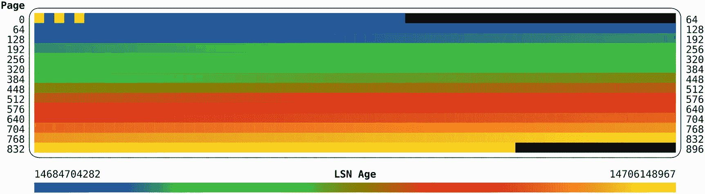
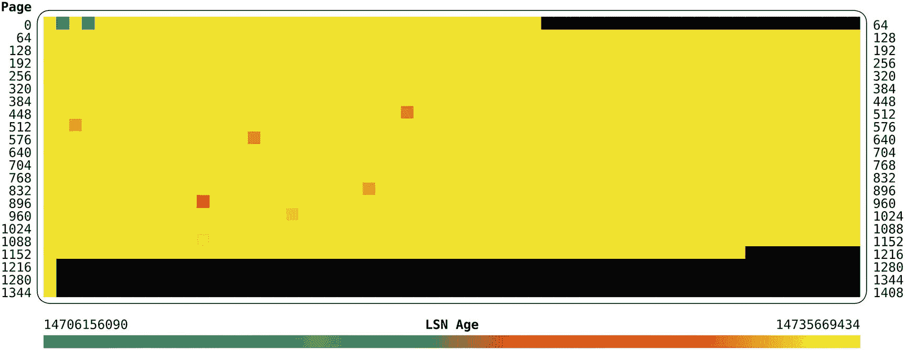

# 25.DDL 和批量数据加载

有时，需要执行模式更改或将大量数据导入表中。这可能是为了适应新功能、恢复备份、导入由第三方流程生成的数据，或者类似的目的。虽然原始磁盘写性能自然非常重要，但是您也可以在 MySQL 端做一些事情来提高这些操作的性能。

Tip

如果您遇到恢复备份需要太长时间的问题，请考虑切换到直接复制数据文件(物理备份)的备份方法，如使用 MySQL Enterprise Backup。物理备份的一个主要优点是，它们比逻辑备份(包含作为`INSERT`语句或 CSV 文件的数据)的恢复速度快得多。

本章从讨论模式变化开始，然后转到加载数据的一些一般考虑事项。这些注意事项也适用于一次插入单行的情况。本章的其余部分将介绍如何通过按主键顺序插入来提高数据加载性能，缓冲池和辅助索引如何影响性能、配置以及调整语句本身。最后演示了 MySQL Shell 的并行导入特性。

## 模式更改

当需要对模式进行更改时，存储引擎可能需要做大量的工作，可能需要制作一个全新的表副本。这一节将讨论如何加速这个过程，首先是模式更改支持的算法，然后是配置等其他考虑因素。

Note

虽然`OPTIMIZE TABLE`没有对表的模式进行任何更改，但 InnoDB 将其实现为一个`ALTER TABLE`后跟一个`ANALYZE TABLE`。所以本节的讨论也适用于`OPTIMIZE TABLE`。

### 算法

MySQL 支持几种用于`ALTER TABLE`的算法，这些算法决定了如何执行模式更改。一些模式更改可以通过更改表定义“立即”完成，而另一方面，一些更改需要将整个表复制到新表中。

按照所需工作量的顺序，这些算法是

*   `INSTANT` **:** 只对表格定义进行修改。虽然变化并不十分迅速，但却非常快。MySQL 8.0.12 及更高版本中提供了`INSTANT`算法。

*   `INPLACE` **:** 通常在现有的表空间文件中进行更改(表空间 id 不变)，但也有一些例外，如`ALTER TABLE <table name> FORCE`(由`OPTIMIZE TABLE`使用)，它更像`COPY`算法，但允许并发数据更改。这可能是一个相对廉价的操作，但也可能涉及复制所有数据。

*   `COPY` **:** 将现有数据复制到新的表空间文件中。这是影响最大的算法，因为它通常需要更多的锁，导致更多的 I/O，并且花费更长的时间。

通常，`INSTANT`和`INPLACE`算法允许并发数据更改，这减少了对其他连接的影响，而`COPY`至少需要一个读锁。MySQL 将根据请求的更改选择影响最小的算法，但您也可以显式请求特定的算法。例如，如果您希望确保 MySQL 不会继续进行更改，如果您选择的算法不受支持，这将非常有用。使用`ALGORITHM`关键字指定算法，例如:

```
mysql> ALTER TABLE world.city
         ADD COLUMN Council varchar(50),
             ALGORITHM=INSTANT;

```

如果无法使用请求的算法执行更改，语句将失败，并显示一个`ER_ALTER_OPERATION_NOT_SUPPORTED`错误(错误号 1845)，例如:

```
mysql> ALTER TABLE world.city
        DROP COLUMN Council,
             ALGORITHM=INSTANT;
ERROR: 1845: ALGORITHM=INSTANT is not supported for this operation. Try ALGORITHM=COPY/INPLACE.

```

如果你能使用`INSTANT`算法，你显然会得到最好的`ALTER TABLE`性能。在编写时，允许使用`INSTANT`算法进行以下操作:

*   添加一个新列作为表中的最后一列。

*   添加生成的虚拟列。

*   删除生成的虚拟列。

*   为现有列设置默认值。

*   删除现有列的默认值。

*   更改数据类型为`enum`或`set`的列所允许的值列表。一个要求是该列的存储大小不变。

*   更改是否为现有索引显式设置索引类型(如`BTREE`)。

还有一些限制值得注意:

*   行格式不能是`COMPRESSED`。

*   该表不能有全文索引。

*   不支持临时表。

*   数据字典中的表不能使用即时算法。

Tip

例如，如果您需要向现有的表中添加一列，请确保将其作为最后一列添加，以便可以“立即”添加

就性能而言，就地更改通常(但不总是)比复制更改更快。此外，当在线进行模式更改(`LOCK=NONE`)时，InnoDB 必须跟踪模式更改执行期间所做的更改。这增加了开销，并且在操作结束时应用模式更改期间所做的更改需要时间。如果您能够在表上使用共享锁(`LOCK=SHARED`)或排他锁(`LOCK=EXCLUSIVE`)，那么与允许并发更改相比，您通常可以获得更好的性能。

### 其他考虑因素

由于就地或复制`ALTER TABLE`所做的工作是非常磁盘密集型的，所以对性能的最大影响是磁盘的速度以及在模式更改期间有多少其他写活动。这意味着，从性能角度来看，最好选择在实例和主机上几乎没有其他写入活动时，执行需要复制或移动大量数据的模式更改。这包括备份本身可能是非常 I/O 密集型的。

Tip

您可以使用性能模式监控 InnoDB 表的`ALTER TABLE`和`OPTIMIZE TABLE`的进度。最简单的方法是使用`sys.session`视图并查看`progress`列，它显示了总工作百分比的大致进度。默认情况下，该功能处于启用状态。

如果您的`ALTER TABLE`包括创建或重建二级索引(这包括`OPTIMIZE TABLE`和重建表的其他语句)，您可以使用`innodb_sort_buffer_size`选项来指定每个排序缓冲区可以使用多少内存。请注意，单个`ALTER TABLE`将创建多个缓冲区，因此注意不要将值设置得太大。默认值为 1 MiB，最大允许值为 64 MiB。在某些情况下，较大的缓冲区可能会提高性能。

当您创建全文索引时，您可以使用`innodb_ft_sort_pll_degree`选项来指定 InnoDB 将使用多少个线程来构建搜索索引。默认值为 2，支持的值介于 1 和 32 之间。如果您在大型表上创建全文索引，增加`innodb_ft_sort_pll_degree`的值可能是一个优势。

需要考虑的一个特殊 DDL 操作是删除或截断表。

### 删除或截断表

似乎没有必要考虑删除表的性能优化。似乎所有需要做的就是删除表空间文件并删除对表的引用。实际上，事情并不那么简单。

删除或截断表时的主要问题是缓冲池中对表数据的所有引用。特别是，自适应散列索引会引起问题。因此，在删除或截断大型表时，可以通过在操作期间禁用自适应散列索引来大大提高性能，例如:

```
mysql> SET GLOBAL innodb_adaptive_hash_index = OFF;
Query OK, 0 rows affected (0.1008 sec)

mysql> DROP TABLE <name of large table>;

mysql> SET GLOBAL innodb_adaptive_hash_index = ON;
Query OK, 0 rows affected (0.0098 sec)

```

禁用自适应散列索引将使受益于散列索引的查询运行得更慢，但是对于大小为几百吉字节或更大的表，禁用自适应散列索引的相对较小的减速通常优于潜在的停顿，因为删除对被删除或截断的表的引用的开销。

关于执行模式更改的讨论到此结束。本章的其余部分讨论加载数据。

## 一般数据加载注意事项

在讨论如何提高大容量插入的性能之前，有必要进行一个小测试并讨论结果。在测试中，200，000 行被插入到两个表中。其中一个表使用自动递增计数器作为主键，另一个表使用随机整数作为主键。两个表的行大小相同。

Tip

本节和下一节中的讨论同样适用于非批量插入。

数据加载完成后，清单 [25-1](#PC4) 中的脚本可以用来确定表空间文件中每个页面的年龄，这是根据日志序列号(LSN)来测量的。日志序列号越高，页面被修改的时间越近。这个脚本的灵感来自杰瑞米·科尔 <sup>[1](#Fn1)</sup> 的 innodb_ruby，它生成了一个类似于 innodb_ruby `space-lsn-age-illustrate-svg`命令的地图。但是 innodb_ruby 还不支持 MySQL 8，所以单独开发了一个 Python 程序。该程序已经过 Python 2.7 (Linux)和 3.6 (Linux 和微软 Windows)的测试。它也可以在本书的 GitHub 存储库中的 listing_25_1.py 文件中找到。

```
'''Read a MySQL 8 file-per-table tablespace file and generate an
SVG formatted map of the LSN age of each page.

Invoke with the --help argument to see a list of arguments and
Usage instructions.'''

import sys
import argparse
import math
from struct import unpack

# Some constants from InnoDB
FIL_PAGE_OFFSET = 4          # Offset for the page number
FIL_PAGE_LSN = 16            # Offset for the LSN
FIL_PAGE_TYPE = 24           # Offset for the page type
FIL_PAGE_TYPE_ALLOCATED = 0  # Freshly allocated page

def mach_read_from_2(page, offset):
    '''Read 2 bytes in big endian. Based on the function of the same
    name in the InnoDB source code.'''
    return unpack('>H', page[offset:offset + 2])[0]

def mach_read_from_4(page, offset):
    '''Read 4 bytes in big endian. Based on the function of the same
    name in the InnoDB source code.'''
    return unpack('>L', page[offset:offset + 4])[0]

def mach_read_from_8(page, offset):
    '''Read 8 bytes in big endian. Based on the function of the same
    name in the InnoDB source code.'''
    return unpack('>Q', page[offset:offset + 8])[0]

def get_color(lsn, delta_lsn, greyscale):
    '''Get the RGB color of a relative lsn.'''
    color_fmt = '#{0:02x}{1:02x}{2:02x}'

    if greyscale:
        value = int(255 * lsn / delta_lsn)
        color = color_fmt.format(value, value, value)
    else:
        # 0000FF -> 00FF00 -> FF0000 -> FFFF00
        # 256 + 256 + 256 values
        value = int((3 * 256 - 1) * lsn / delta_lsn)
        if value < 256:
            color = color_fmt.format(0, value, 255 - value)
        elif value < 512:
            value = value % 256
            color = color_fmt.format(value, 255 - value, 0)
        else:
            value = value % 256
            color = color_fmt.format(255, value, 0)

    return color

def gen_svg(min_lsn, max_lsn, lsn_age, args):
    '''Generate an SVG output and print to stdout.'''
    pages_per_row = args.width
    page_width = args.size
    num_pages = len(lsn_age)
    num_rows = int(math.ceil(1.0 * num_pages / pages_per_row))
    x1_label = 5 * page_width + 1
    x2_label = (pages_per_row + 7) * page_width
    delta_lsn = max_lsn - min_lsn

    print('<?xml version="1.0"?>')
    print('<svg xmlns:="http://www.w3.org/2000/svg" version="1.1">')
    print('<text x="{0}" y="{1}" font-family="monospace" font-size="{2}" '
          .format(x1_label, int(1.5 * page_width) + 1, page_width) +
          'font-weight="bold" text-anchor="end">Page</text>')

    page_number = 0
    page_fmt = '  <rect x="{0}" y="{1}" width="{2}" height="{2}" fill="{3}" />'
    label_fmt = '  <text x="{0}" y="{1}" font-family="monospace" '
    label_fmt += 'font-size="{2}" text-anchor="{3}">{4}</text>'
    for i in range(num_rows):
        y = (i + 2) * page_width
        for j in range(pages_per_row):
            x = 6 * page_width + j * page_width
            if page_number >= len(lsn_age) or lsn_age[page_number] is None:
                color = 'black'
            else:
                relative_lsn = lsn_age[page_number] - min_lsn
                color = get_color(relative_lsn, delta_lsn, args.greyscale)

            print(page_fmt.format(x, y, page_width, color))
            page_number += 1

        y_label = y + page_width
        label1 = i * pages_per_row
        label2 = (i + 1) * pages_per_row
        print(label_fmt.format(x1_label, y_label, page_width, 'end', label1))
        print(label_fmt.format(x2_label, y_label, page_width, 'start', label2))

    # Create a frame around the pages
    frame_fmt = '  <path stroke="black" stroke-width="1" fill="none" d="'
    frame_fmt += 'M{0},{1} L{2},{1} S{3},{1} {3},{4} L{3},{5} S{3},{6} {2},{6}'
    frame_fmt += ' L{0},{6} S{7},{6} {7},{5} L{7},{4} S{7},{1} {0},{1} Z" />'
    x1 = int(page_width * 6.5)
    y1 = int(page_width * 1.5)
    x2 = int(page_width * 5.5) + page_width * pages_per_row
    x2b = x2 + page_width
    y1b = y1 + page_width
    y2 = int(page_width * (1.5 + num_rows))
    y2b = y2 + page_width
    x1c = x1 - page_width
    print(frame_fmt.format(x1, y1, x2, x2b, y1b, y2, y2b, x1c))

    # Create legend
    x_left = 6 * page_width
    x_right = x_left + pages_per_row * page_width
    x_mid = x_left + int((x_right - x_left) * 0.5)
    y = y2b + 2 * page_width
    print('<text x="{0}" y="{1}" font-family="monospace" '.format(x_left, y) +
          'font-size="{0}" text-anchor="start">{1}</text>'.format(page_width,
                                                                  min_lsn))
    print('<text x="{0}" y="{1}" font-family="monospace" '.format(x_right, y) +
          'font-size="{0}" text-anchor="end">{1}</text>'.format(page_width,
                                                                  max_lsn))
    print('<text x="{0}" y="{1}" font-family="monospace" '.format(x_mid, y) +
          'font-size="{0}" font-weight="bold" text-anchor="middle">{1}</text>'
          .format(page_width, 'LSN Age'))

    color_width = 1
    color_steps = page_width * pages_per_row
    y = y + int(page_width * 0.5)
    for i in range(color_steps):
        x = 6 * page_width + i * color_width
        color = get_color(i, color_steps, args.greyscale)
        print('<rect x="{0}" y="{1}" width="{2}" height="{3}" fill="{4}" />'
              .format(x, y, color_width, page_width, color))

    print('</svg>')

def analyze_lsn_age(args):
    '''Read the tablespace file and find the LSN for each page.'''
    page_size_bytes = int(args.page_size[0:-1]) * 1024
    min_lsn = None
    max_lsn = None
    lsn_age = []
    with open(args.tablespace, 'rb') as fs:
        # Read at most 1000 pages at a time to avoid storing too much
        # in memory at a time.
        chunk = fs.read(1000 * page_size_bytes)
        while len(chunk) > 0:
            num_pages = int(math.floor(len(chunk) / page_size_bytes))
            for i in range(num_pages):
                # offset is the start of the page inside the
                # chunk of data
                offset = i * page_size_bytes
                # The page number, lsn for the page, and page
                # type can be found at the FIL_PAGE_OFFSET,
                # FIL_PAGE_LSN, and FIL_PAGE_TYPE offsets
                # relative to the start of the page.
                page_number = mach_read_from_4(chunk, offset + FIL_PAGE_OFFSET)
                page_lsn = mach_read_from_8(chunk, offset + FIL_PAGE_LSN)
                page_type = mach_read_from_2(chunk, offset + FIL_PAGE_TYPE)

                if page_type == FIL_PAGE_TYPE_ALLOCATED:
                    # The page has not been used yet
                    continue

                if min_lsn is None:
                    min_lsn = page_lsn
                    max_lsn = page_lsn
                else:
                    min_lsn = min(min_lsn, page_lsn)
                    max_lsn = max(max_lsn, page_lsn)

                if page_number == len(lsn_age):
                    lsn_age.append(page_lsn)
                elif page_number > len(lsn_age):
                    # The page number is out of order - expand the list first
                    lsn_age += [None] * (page_number - len(lsn_age))
                    lsn_age.append(page_lsn)
                else:
                    lsn_age[page_number] = page_lsn

            chunk = fs.read(1000 * page_size_bytes)

    sys.stderr.write("Total # Pages ...: {0}\n".format(len(lsn_age)))
    gen_svg(min_lsn, max_lsn, lsn_age, args)

def main():
    '''Parse the arguments and call the analyze_lsn_age()
    function to perform the analysis.'''
    parser = argparse.ArgumentParser(
        prog='listing_25_1.py',
        description='Generate an SVG map with the LSN age for each page in an' +
        ' InnoDB tablespace file. The SVG is printed to stdout.')

    parser.add_argument(
        '-g', '--grey', '--greyscale', default=False,
        dest='greyscale', action="store_true",
        help='Print the LSN age map in greyscale.')

    parser.add_argument(
        '-p', '--page_size', '--page-size', default="16k",
        dest='page_size',
        choices=['4k', '8k', '16k', '32k', '64k'],
        help='The InnoDB page size. Defaults to 16k.')

    parser.add_argument(
        '-s', '--size', default=16, dest="size",
        choices=[4, 8, 12, 16, 20, 24], type=int,
        help='The size of the square representing a page in the output. ' +
        'Defaults to 16.')

    parser.add_argument(
        '-w', '--width', default=64, dest="width",
        type=int,
        help='The number of pages to include per row in the output. ' +
        'The default is 64.')

    parser.add_argument(
        dest='tablespace',
        help='The tablespace file to analyze.')

    args = parser.parse_args()
    analyze_lsn_age(args)

if __name__ == '__main__':
    main()

Listing 25-1Python program to map the LSN age of InnoDB pages

```

在由每页的`FIL_PAGE_OFFSET`、`FIL_PAGE_LSN`和`FIL_PAGE_TYPE`常量定义的位置(以字节为单位)提取页码、日志序列号和页面类型。如果页面类型具有常量`FIL_PAGE_TYPE_ALLOCATED`的值，这意味着它还没有被使用，因此可以跳过它——这些页面在日志序列号映射中被涂成黑色。

Tip

如果您想探索页面标题中可用的信息，源代码中的文件`storage/innobase/include/fil0types.h` ( [`https://github.com/mysql/mysql-server/blob/8.0/storage/innobase/include/fil0types.h`](https://github.com/mysql/mysql-server/blob/8.0/storage/innobase/include/fil0types.h) )和 MySQL 内部手册中 fil 标题的描述( [`https://dev.mysql.com/doc/internals/en/innodb-fil-header.html`](https://dev.mysql.com/doc/internals/en/innodb-fil-header.html) )是很好的起点。

您可以通过使用`--help`参数调用程序来获得使用程序的帮助。唯一必需的参数是要分析的表空间文件的路径。除非您已经将`innodb_page_size`选项设置为 16384 字节以外的值，否则您只需要可选参数的默认值，除非您想要更改生成的地图的尺寸和大小。

Caution

不要在生产系统上使用该程序！程序中有最少的错误检查以使它尽可能的简单，并且它本质上是实验性的。

您现在可以生成测试表了。清单 [25-2](#PC5) 展示了如何创建`table_autoinc`表。这是带有自动递增主键的表。

```
mysql-sql> CREATE SCHEMA chapter_25;
Query OK, 1 row affected (0.0020 sec)

mysql-sql> CREATE TABLE chapter_25.table_autoinc (
             id bigint unsigned NOT NULL auto_increment,
             val varchar(36),
             PRIMARY KEY (id)
           );
Query OK, 0 rows affected (0.3382 sec)

mysql-sql> \py
Switching to Python mode...

mysql-py> for i in range(40):
              session.start_transaction()
              for j in range(5000):
                  session.run_sql("INSERT INTO chapter_25.table_autoinc (val) VALUES (UUID())")
              session.commit()

Query OK, 0 rows affected (0.1551 sec)

Listing 25-2Populating a table with an auto-incrementing primary key

```

该表有一个`bigint`主键和一个用 UUIDs 填充的`varchar(36)`，以创建一些随机数据。MySQL Shell 的 Python 语言模式用于插入数据。8.0.17 及更高版本中提供了`session.run_sql()`方法。最后，您可以执行`listing_25_1.py`脚本来生成可伸缩矢量图形(SVG)格式的表空间年龄图:

```
shell> python listing_25_1.py <path to datadir>\chapter_25\table_autoinc.ibd > table_autoinc.svg
Total # Pages ...: 880

```

程序的输出显示，表空间中有 880 个页面，文件末尾可能还有一些未使用的页面。

图 [25-1](#Fig1) 显示了`table_autoinc`表的日志序列号年龄图。



图 25-1

按主键顺序插入时每页的 LSN 年龄

在图中，左上角代表表空间的第一页。当您从左到右、从上到下浏览该图时，页面越来越深入到表空间文件中，右下方表示最后的页面。该图显示，除了第一页之外，这些页的年龄模式遵循与该图底部的 LSN 年龄标度相同的模式。这意味着随着您在表空间中的前进，页的年龄会变得越来越年轻。前几页是例外，例如，它们包括表空间头。

这个模式显示了数据被顺序地插入到表空间中，使得表空间尽可能紧凑。这也使得如果一个查询从逻辑上连续的几个页中读取数据，那么它们在表空间文件中也是物理上连续的。

如果你随机插入，会是什么样子呢？随机顺序插入的一个常见示例是将 UUID 作为主键，但是为了确保两个表的行大小相同，使用了一个随机整数。清单 [25-3](#PC7) 展示了如何填充`table_random`表。

```
mysql-py> \sql
Switching to SQL mode... Commands end with ;

mysql-sql> CREATE TABLE chapter_25.table_random (
             id bigint unsigned NOT NULL,
             val varchar(36),
             PRIMARY KEY (id)
           );
Query OK, 0 rows affected (0.0903 sec)

mysql-sql> \py
Switching to Python mode...

mysql-py> import random
mysql-py> import math
mysql-py> maxint = math.pow(2, 64) - 1
mysql-py> random.seed(42)

mysql-py> for i in range(40):
              session.start_transaction()
              for j in range(5000):
                  session.run_sql("INSERT INTO chapter_25.table_random VALUE ({0}, UUID())".format(random.randint(0, maxint)))
              session.commit()

Query OK, 0 rows affected (0.0185 sec)

Listing 25-3Populating a table with a random primary key

```

Python `random`模块用于生成 64 位随机无符号整数。种子是显式设置的，因为已知(通过实验)种子为 42 会在一行中生成 200，000 个不同的数字，因此不会出现重复的键错误。当表被填充后，执行`listing_25_1.py`脚本:

```
shell> python listing_25_1.py <path to datadir>\chapter_25\table_random.ibd > table_random.svg
Total # Pages ...: 1345

```

`listing_25_1.py`脚本的输出显示这个表空间中有 1345 个页面。生成的年龄图如图 [25-2](#Fig2) 所示。



图 25-2

以随机顺序插入时每页的 LSN 年龄

这一次，日志序列号年龄模式完全不同。除了未使用的页面之外，所有页面的年龄颜色对应于最新日志序列号的颜色。这意味着所有包含数据的页面都是在同一时间最后更新的，或者说，它们都是在大容量装载结束之前写入的。包含数据的页数是 1345，而包含自动递增主键的表中使用了 880 页。这就增加了超过 50%的页面。

以随机顺序插入数据会导致相同数量的数据有更多的页面，这是因为 InnoDB 在插入数据时会填满页面。当按顺序主键顺序插入数据时，这意味着下一行将总是在前一行之后，因此当行按主键顺序排序时，这种方法很有效。如图 [25-3](#Fig3) 所示。


图 25-3

按顺序插入时添加新行的示例

该图显示了插入的两行新行。id = 1005 的行刚好可以放入第 N 页，所以当插入 id = 1006 的行时，它会被插入到下一页。在这个场景中，一切都很好，很紧凑。

当行以随机顺序到达时，有时需要将行插入到已经满得没有空间容纳新行的页面中。在这种情况下，InnoDB 将现有页面一分为二，这两个页面中的每一个页面都有原始页面的一半数据，因此有空间容纳新行。如图 [25-4](#Fig4) 所示。


图 25-4

随机插入导致的页面分割示例

在这种情况下，id = 3500 的行被插入，但是在逻辑上它所属的页面 N 中没有更多空间。因此，第 N 页被分成第 N 页和第 N+1 页，每页大约有一半的数据。

页面分割有两个直接后果。首先，以前占用一个页面的数据现在使用了两个页面，这就是为什么随机插入最终会多占用 50%的页面，这也意味着相同的数据在缓冲池中需要更多的空间。额外页面的一个显著副作用是，B 树索引最终会有更多的叶页面和树中潜在的更多层，并且考虑到树中的每一层都意味着访问页面时的额外寻道，这会导致额外的 I/O。

其次，以前一起读入内存的行现在位于磁盘上不同位置的两个页面中。当 InnoDB 增加表空间文件的大小时，它是通过在页面大小为 16 KiB 或更小时分配一个 1 MiB 的新区来实现的。这有助于提高磁盘 I/O 的顺序性(在某种程度上，新的扩展区可以在磁盘上获得连续的扇区)。发生的页拆分越多，页就越多，不仅在一个扩展区内，而且在多个扩展区之间，从而导致更多的随机磁盘 I/O。当由于页拆分而创建新页时，它很可能位于磁盘上完全不同的部分，因此在读取页时，随机 I/O 的数量会增加。如图 [25-5](#Fig5) 所示。


图 25-5

磁盘上页面位置的示例

在图中描绘了三个范围。为简单起见，每个区段中只显示了五个页面(默认页面大小为 16 KiB，每个区段有 64 个页面)。属于页面分割一部分的页面会突出显示。第 11 页是在最后一页是第 13 页时被拆分的，因此第 11 页和第 12 页仍然相对靠近。然而，当创建了几个额外的页面时，第 15 页被拆分，这意味着第 16 页在下一个区段中结束。

更深的 B 树、占用缓冲池空间的更多页面和更多随机 I/O 的组合意味着以随机主键顺序插入行的表的性能不如以主键顺序插入数据的表。性能差异不仅适用于插入数据；它也适用于数据的后续使用。因此，按主键顺序插入数据对于优化性能非常重要。接下来将讨论如何实现这一点。

## 按主键顺序插入

正如前面的讨论所示，按主键顺序插入数据有很大的优势。实现这一点最简单的方法是通过使用一个无符号整数并声明自动递增的列来自动生成主键值。或者，您需要确保数据是按照主键顺序插入的。本节将调查这两种情况。

### 自动递增主键

确保数据按主键顺序插入的最简单方法是允许 MySQL 通过使用自动递增的主键来自己赋值。您可以通过在创建表时为主键列指定`auto_increment`属性来做到这一点。也可以结合多列主键使用自动递增列；在这种情况下，自动递增列必须是索引中的第一列。

清单 [25-4](#PC9) 展示了一个创建两个表的例子，这两个表使用一个自动增加的列以主键顺序插入数据。

```
mysql> \sql
Switching to SQL mode... Commands end with ;

mysql> DROP SCHEMA IF EXISTS chapter_25;
Query OK, 0 rows affected, 1 warning (0.0456 sec)

mysql> CREATE SCHEMA chapter_25;
Query OK, 1 row affected (0.1122 sec)

mysql> CREATE TABLE chapter_25.t1 (
         id int unsigned NOT NULL auto_increment,
         val varchar(10),
         PRIMARY KEY (id)
       );
Query OK, 0 rows affected (0.4018 sec)

mysql> CREATE TABLE chapter_25.t2 (
         id int unsigned NOT NULL auto_increment,
         CreatedDate datetime NOT NULL
                              DEFAULT CURRENT_TIMESTAMP(),
         val varchar(10),
         PRIMARY KEY (id, CreatedDate)
       );
Query OK, 0 rows affected (0.3422 sec)

Listing 25-4Creating tables with an auto-increment primary key

```

`t1`表只有一个主键列，值是自动递增的。使用无符号整数而不是有符号整数的原因是自动增量值总是大于 0，因此使用无符号整数在用尽可用值之前允许两倍的值。这些示例使用了一个 4 字节的整数，如果使用所有的值，它允许的行数略少于 43 亿。如果这还不够，您可以将该列声明为`bigint unsigned`，它使用 8 个字节，允许 1.8E19 行。

`t2`表向主键添加了一个`datetime`列，例如，如果您希望在创建行时进行分区，这个列会很有用。自动递增的`id`列仍然确保用唯一的主键创建行，并且因为`id`列是主键中的第一列，所以即使主键中的后续列本质上是随机的，行仍然按主键顺序插入。

当您使用自动递增主键时，您可以使用`sys`模式中的`schema_auto_increment_columns`视图来检查自动递增值的使用，并监视是否有任何表接近耗尽它们的值。清单 [25-5](#PC10) 显示了`sakila.payment`表的输出。

```
mysql> SELECT *
         FROM sys.schema_auto_increment_columns
        WHERE table_schema = 'sakila'
              AND table_name = 'payment'\G
*************************** 1\. row ***************************
        table_schema: sakila
          table_name: payment
         column_name: payment_id
           data_type: smallint
         column_type: smallint(5) unsigned
           is_signed: 0
         is_unsigned: 1
           max_value: 65535
      auto_increment: 16049
auto_increment_ratio: 0.2449
1 row in set (0.0024 sec)

Listing 25-5Using the sys.schema_auto_increment_columns view

```

您可以从输出中看到，该表使用了一个用于自动增量值的`smallint unsigned`列，其最大值为`65535`，该列被命名为`payment_id`。下一个自动增量值是 16049，因此使用了可用值的 24.49%。

如果从外部源插入数据，可能已经为主键列分配了值(即使使用自动递增主键)。让我们看看在这种情况下你能做什么。

### 插入现有数据

无论您需要插入由某个进程生成的数据、恢复备份，还是使用不同的存储引擎转换表，最好在插入之前确保它处于主键顺序。如果您生成数据或者数据已经存在，那么您可以考虑在插入数据之前对其进行排序。或者，在导入完成后，使用`OPTIMIZE TABLE`语句重建表。

重建`chapter_25.t1`表的一个例子是

```
mysql> OPTIMIZE TABLE chapter_25.t1\G
*************************** 1\. row ***************************
   Table: chapter_25.t1
      Op: optimize
Msg_type: note
Msg_text: Table does not support optimize, doing recreate + analyze instead
*************************** 2\. row ***************************
   Table: chapter_25.t1
      Op: optimize
Msg_type: status
Msg_text: OK
2 rows in set (0.6265 sec)

```

对于大型表，重建可能需要大量时间，但是除了在开始和结束时需要锁以确保一致性的短暂时间之外，该过程是在线的。

如果您使用`mysqldump`程序创建备份，您可以添加`--order-by-primary`选项，这使得`mysqldump`添加一个包含主键中的列的`ORDER BY`子句(`mysqlpump`没有等价的选项)。如果备份是使用存储引擎(使用所谓的堆组织数据，如 MyISAM)创建的表，目的是将其恢复到 InnoDB 表(使用数据的索引组织)，这将非常有用。

Tip

虽然在使用不带`ORDER BY`子句的查询时，通常不应该依赖于返回行的顺序，但 InnoDB 的索引组织行意味着，即使省略了`ORDER BY`子句，全表扫描通常(但不保证)会按主键顺序返回行。一个值得注意的例外是，当表包含一个覆盖所有列的二级索引，并且优化器选择将该索引用于查询时。

如果将数据从一个表复制到另一个表，也可以使用相同的原则。清单 [25-6](#PC12) 展示了一个将`world.city`表中的行复制到`world.city_new`表中的例子。

```
mysql> CREATE TABLE world.city_new
         LIKE world.city;
Query OK, 0 rows affected (0.8607 sec)

mysql> INSERT INTO world.city_new
       SELECT *
         FROM world.city
        ORDER BY ID;
Query OK, 4079 rows affected (2.0879 sec)

Records: 4079  Duplicates: 0  Warnings: 0

Listing 25-6Ordering data by the primary key when copying it

```

作为最后一种情况，考虑当您有一个 UUID 作为主键。

### UUID 主键

例如，如果您的主键仅限于一个 UUID，因为您无法更改应用程序来支持自动递增主键，那么您可以通过交换 UUID 组件并将 uuid 存储在二进制列中来提高性能。

一个 UUID (MySQL 使用 UUID 版本 1)由一个时间戳和一个序列号(如果时间戳向后移动，例如在夏令时更改期间，以保证唯一性)以及 MAC 地址组成。

Caution

在某些情况下，泄露 MAC 地址可能会被认为是一个安全问题，因为它可以用来识别计算机和潜在的用户。

时间戳是一个 60 位值，使用 UTC，从 1582 年 10 月 15 日午夜(公历开始使用时)开始，时间间隔为 100 纳秒。 <sup>[2](#Fn2)</sup> 它被分成三部分，最低有效部分在前，最高有效部分在后。(对于 UUID 版本，时间戳的高位字段也包括四位。UUID 的组成也如图 [25-6](#Fig6) 所示。)


图 25-6

UUID 版本 1 的五个部分

时间戳的较低部分代表 100 纳秒或不到 430 秒的最多 4，294，967，295 (0xffffffff)个间隔。这意味着，从排序的角度来看，时间戳的低位部分每隔 7 分钟略少于 10 秒滚动一次，使 UUID 重新开始。这就是为什么普通 UUIDs 不能很好地用于索引组织的数据，因为这意味着插入很大程度上是在主键树中的随机位置。

MySQL 8 包含两个新函数来操作 UUIDs，使它们更适合作为 InnoDB 中的主键:`UUID_TO_BIN()`和`BIN_TO_UUID()`。这些函数分别将 UUID 从十六进制表示形式转换为二进制表示形式，然后再转换回来。它们接受相同的两个参数:要转换的 UUID 值和是否交换时间戳的高低部分。清单 [25-7](#PC13) 展示了一个使用函数插入和检索数据的例子。

```
mysql> CREATE TABLE chapter_25.t3 (
         id binary(16) NOT NULL,
         val varchar(10),
         PRIMARY KEY (id)
       );
Query OK, 0 rows affected (0.4413 sec)

mysql> INSERT INTO chapter_25.t3
       VALUES (UUID_TO_BIN(
                 '14614d6e-b5a8-11e9-ae6e-080027b7c106',
                 TRUE
              ), 'abc');
Query OK, 1 row affected (0.2166 sec)

mysql> SELECT BIN_TO_UUID(id, TRUE) AS id, val
         FROM chapter_25.t3\G
*************************** 1\. row ***************************
 id: 14614d6e-b5a8-11e9-ae6e-080027b7c106
val: abc
1 row in set (0.0004 sec)

Listing 25-7Using the UUID_TO_BIN() and BIN_TO_UUID() functions

```

这种方法有两个优点。因为 UUID 交换了低时间和高时间分量，所以它变得单调递增，这使得它更适合于按索引组织的行。二进制存储意味着 UUID 只需要 16 个字节的存储，而不是十六进制版本的 36 个字节，用破折号来分隔 UUID 的各个部分。请记住，由于数据是按主键组织的，主键被添加到辅助索引中，因此可以从索引转到行，因此存储主键所需的字节越少，辅助索引就越小。

## InnoDB 缓冲池和二级索引

对于批量数据加载的性能来说，最重要的一个因素是 InnoDB 缓冲池的大小。本节讨论为什么缓冲池对于大容量数据装载很重要。

当您向表中插入数据时，InnoDB 需要能够将数据存储在缓冲池中，直到数据被写入表空间文件。缓冲池中存储的数据越多，InnoDB 将脏页刷新到表空间文件的效率就越高。然而，还有第二个原因是维护二级索引。

在插入数据时，需要维护辅助索引，但是辅助索引的排序顺序与主键不同，所以在插入数据时，它们会不断地重新排列。只要可以在内存中维护索引，插入率就可以保持很高，但是当索引不再适合缓冲池时，维护索引的成本会突然变得更高，插入率会显著下降。图 [25-7](#Fig7) 说明了性能如何依赖于处理二级索引的缓冲池的可用性。


图 25-7

与缓冲池中的索引大小相比的插入性能

该图显示了插入速率在一段时间内大致保持不变，而在这段时间内，越来越多的缓冲池用于辅助索引。当缓冲池中无法存储更多的索引时，插入速率会突然下降。在极端情况下，将数据加载到一个只有一个二级索引的表中，该索引包含整行，而没有其他内容，当二级索引使用了将近一半的缓冲池(剩余的用于主键)时，就会出现这种情况。

您可以使用`information_schema.INNODB_BUFFER_PAGE`表来确定一个索引在缓冲池中使用了多少空间。例如，通过`world.city`表上的`CountryCode`索引来查找缓冲池中使用的内存量

```
mysql> SELECT COUNT(*) AS NumPages,
              IFNULL(SUM(DATA_SIZE), 0) AS DataSize,
              IFNULL(SUM(IF(COMPRESSED_SIZE = 0,
                            @@global.innodb_page_size,
                            COMPRESSED_SIZE
                           )
                        ),
                     0
                    ) AS CompressedSize
         FROM information_schema.INNODB_BUFFER_PAGE
        WHERE TABLE_NAME = '`world`.`city`'
              AND INDEX_NAME = 'CountryCode';
+----------+----------+----------------+
| NumPages | DataSize | CompressedSize |
+----------+----------+----------------+
|        3 |    27148 |          49152 |
+----------+----------+----------------+
1 row in set (0.1027 sec)

```

结果将取决于你使用了多少索引，所以一般来说你的结果会有所不同。这个查询最好用在测试系统上，因为查询`INNODB_BUFFER_PAGE`表会有很大的开销。

Caution

在您的生产系统上查询`INNODB_BUFFER_PAGE`表时要小心，因为开销可能很大，尤其是当您有一个包含许多表和索引的大型缓冲池时。

当辅助索引无法放入缓冲池时，有三种策略可以避免性能下降，如下所示:

*   增加缓冲池的大小。

*   插入数据时删除辅助索引。

*   给桌子分区。

在进行大容量装载时增加缓冲池大小是最明显的策略，但也是最不可能有用的策略。它主要用于将数据插入到已经有大量数据的表中，并且您知道在数据加载期间，您可以将其他进程需要的一些内存用于缓冲池。在这种情况下，支持动态调整缓冲池的大小非常有用。例如，将缓冲池大小设置为 256 MiB

```
mysql> SET GLOBAL innodb_buffer_pool_size = 256 * 1024 * 1024;
Query OK, 0 rows affected (0.0003 sec)

```

数据加载完成后，可以将缓冲池大小设置回通常的值(如果使用默认值，则为 134217728)。

如果要插入到一个空表中，一个非常有用的策略是在加载数据之前删除所有的辅助索引(可能为数据验证留下唯一的索引),然后再添加索引。在大多数情况下，这比在加载数据时试图维护索引更有效，如果您使用它来创建备份，这也是`mysqlpump`实用程序所做的。

最后一个策略是对表进行分区。这很有帮助，因为索引是分区的本地索引(这就是分区键必须是所有唯一索引的一部分的原因)，所以如果您按分区顺序插入数据，InnoDB 只需维护当前分区中数据的索引。这使得每个索引更小，所以它们更容易放入缓冲池。

## 配置

您可以通过配置执行加载的会话来影响加载性能。这包括考虑关闭约束检查、如何生成自动增量 id 等等。

表 [25-1](#Tab1) 总结了除缓冲池大小之外与批量数据性能相关的最重要的配置选项。范围是该选项是可以在会话级别更改，还是仅在全局可用。

表 25-1

影响数据加载性能的配置选项

<colgroup><col class="tcol1 align-left"> <col class="tcol2 align-left"> <col class="tcol3 align-left"></colgroup> 
| 

选项名称

 | 

范围

 | 

描述

 |
| --- | --- | --- |
| `foreign_key_checks` | 会议 | 指定是否检查新行是否违反外键。禁用此选项可以提高具有外键的表的性能。 |
| `unique_checks` | 会议 | 指定是否检查新行是否违反唯一约束。禁用此选项可以提高具有唯一索引的表的性能。 |
| `innodb_autoinc_lock_mode` | 全球的 | 指定 InnoDB 如何确定下一个自动增量值。将该选项设置为 MySQL 8 中的默认值——需要`binlog_format = ROW`)可以获得最佳性能，但代价是可能会出现不连续的自动增量值。需要重启 MySQL。 |
| `innodb_flush_log_at_trx_commit` | 全球的 | 确定 InnoDB 刷新对数据文件所做更改的频率。如果使用许多小事务导入数据，将此选项设置为 0 或 2 可以提高性能。 |
| `sql_log_bin` | 会议 | 当设置为 0 或`OFF`时，禁用二进制日志。这将大大减少写入的数据量。 |
| `transaction_isolation` | 会议 | 设置事务隔离级别。如果您没有读取 MySQL 中的现有数据，可以考虑将隔离级别设置为`READ UNCOMMITTED`。 |

所有选项都有副作用，所以请仔细考虑更改设置是否适合您。例如，如果您将数据从现有实例导入到新实例，并且您知道外键和唯一键约束没有问题，那么您可以为导入数据的会话禁用`foreign_key_checks`和`unique_checks`选项。另一方面，如果您从一个不确定数据完整性的源进行导入，最好启用约束检查以确保数据质量，即使这意味着较慢的加载性能。

对于`innodb_flush_log_at_trx_commit`选项，您需要考虑丢失最后一秒左右已提交事务的风险是否可以接受。如果您的数据加载进程是实例上唯一的事务，并且很容易重做导入，那么您可以将`innodb_flush_log_at_trx_commit`设置为 0 或 2，以减少刷新次数。这种改变对小额交易非常有用。如果导入每秒提交的次数少于一次，那么更改带来的好处很少。如果您更改了`innodb_flush_log_at_trx_commit`，那么在导入后记得将该值设置回 1。

对于二进制日志，禁用写入导入的数据很有用，因为这大大减少了必须写入磁盘的数据更改量。如果二进制日志与重做日志和数据文件位于同一个磁盘上，这将特别有用。如果您不能修改导入过程来禁用`sql_log_bin`，您可以考虑使用`skip-log-bin`选项重新启动 MySQL 来完全禁用二进制日志，但是请注意，这也会影响系统上的所有其他事务。如果在导入过程中禁用了二进制日志记录，则在导入后立即创建完整备份会很有用，这样您就可以再次使用二进制日志进行时间点恢复。

Tip

如果您使用复制，请考虑在禁用`sql_log_bin`的情况下，在拓扑中的每个实例上单独进行数据导入。不过请注意，只有当 MySQL 不生成自动递增主键时，它才会起作用，并且只有当您需要导入大量数据时，才值得增加复杂性。对于 MySQL 8.0.17 中的初始加载，您可以只填充复制的源，并使用克隆插件 <sup>[3](#Fn3)</sup> 来创建副本。

您还可以通过选择导入数据的语句以及如何使用事务来提高加载性能。

## 交易和加载方法

一个事务表示一组更改，InnoDB 在提交事务之前不会完全应用这些更改。每次提交都涉及到将数据写入重做日志，并包括其他开销。如果您有非常小的事务(比如一次插入一行),这种开销会显著影响加载性能。

最佳交易规模没有金科玉律。对于较小的行大小，通常几千行就足够了，对于较大的行大小，选择较少的行。最终，您将需要在您的系统上进行测试，并使用您的数据来确定最佳的事务大小。

对于加载方法，主要有两种选择:`INSERT`语句或`LOAD DATA [LOCAL] INFILE`语句。总的来说，`LOAD DATA`比`INSERT`语句执行得更好，因为解析更少。对于`INSERT`语句，使用扩展的 insert 语法有一个优点，即使用一个语句而不是多个单行语句插入多行。

Tip

当使用`mysqlpump`进行备份时，可以将`--extended-insert`选项设置为每个`INSERT`语句包含的行数，默认值为 250。对于`mysqldump`，`--extended-insert`选项作为开关工作。启用时(默认)，`mysqldump`将自动决定每条语句的行数。

使用`LOAD DATA`加载数据的一个优点是 MySQL Shell 可以自动并行加载。

## MySQL Shell 并行加载数据

将数据加载到 MySQL 时可能会遇到的一个问题是，单个线程无法将 InnoDB 推到它所能承受的极限。如果将数据分成几批，并使用多线程加载数据，可以提高整体加载速率。自动完成这项工作的一个选项是使用 MySQL Shell 8.0.17 和更高版本的并行数据加载特性。

通过 Python 模式下的`util.import_table()`实用程序和 JavaScript 模式下的`util.importTable()`方法可以获得并行加载特性。这个讨论将假设您正在使用 Python 模式。第一个参数是文件名，第二个(可选)参数是带有可选参数的字典。您可以使用`util.help()`方法获得`import_table()`实用程序的帮助文本，比如

`mysql-py> util.help('import_table')`

帮助文本包括所有设置的详细描述，这些设置可以通过第二个参数中指定的字典给出。

MySQL Shell 禁用重复键和外键检查，并将执行导入的连接的事务隔离级别设置为`READ UNCOMMITTED`，以尽可能减少导入过程中的开销。

默认情况下，将数据插入到当前模式的一个表中，该表与不带扩展名的文件同名。例如，如果文件名为`t_load.csv`，默认的表名为`t_load`。清单 [25-8](#PC16) 显示了一个将文件`D:\MySQL\Files\t_load.csv`加载到表`chapter_25.t_load`中的简单示例。`t_load.csv`文件可以从这本书的 GitHub 库中以`t_load.csv.zip`的名称获得。

```
mysql> \sql
Switching to SQL mode... Commands end with ;

mysql-sql> CREATE SCHEMA IF NOT EXISTS chapter_25;
Query OK, 1 row affected, 1 warning (0.0490 sec)

mysql-sql> DROP TABLE IF EXISTS chapter_25.t_load;
Query OK, 0 rows affected (0.3075 sec)

mysql-sql> CREATE TABLE chapter_25.t_load (
             id int unsigned NOT NULL auto_increment,
             val varchar(40) NOT NULL,
             PRIMARY KEY (id),
             INDEX (val)
           );
Query OK, 0 rows affected (0.3576 sec)

mysql> SET GLOBAL local_infile = ON;
Query OK, 0 rows affected (0.0002 sec)

mysql> \py
Switching to Python mode...

mysql-py> \use chapter_25
Default schema set to `chapter_25`.

mysql-py> util.import_table('D:/MySQL/Files/t_load.csv')
Importing from file 'D:/MySQL/Files/t_load.csv' to table `chapter_25`.`t_load` in MySQL Server at localhost:3306 using 2 threads
[Worker000] chapter_25.t_load: Records: 721916  Deleted: 0  Skipped: 0  Warnings: 0
[Worker001] chapter_25.t_load: Records: 1043084  Deleted: 0  Skipped: 0  Warnings: 0
100% (85.37 MB / 85.37 MB), 446.55 KB/s
File 'D:/MySQL/Files/t_load.csv' (85.37 MB) was imported in 1 min 52.1678 sec at 761.13 KB/s
Total rows affected in chapter_25.t_load: Records: 1765000  Deleted: 0  Skipped: 0  Warnings: 0

Listing 25-8Using the util.import_table() utility with default settings

```

创建`chapter_25`模式时的警告取决于您之前是否创建了该模式。请注意，您必须启用`local_infile`选项，该实用程序才能工作。

该示例最有趣的部分是导入的执行。当您没有指定任何内容时，MySQL Shell 会将文件分割成 50 MB 的块，并使用多达八个线程。在本例中，文件大小为 85.37 MB (MySQL Shell 使用文件大小度量标准–85.37 MB 与 81.42 MiB 相同)，因此它提供了两个块，其中第一个是 50 MB，第二个是 35.37 MB。这不是一个可怕的好分布。

Tip

在调用`util.import_table()`实用程序之前，您必须在服务器端启用`local_infile`。

你可以选择做的是告诉 MySQL Shell 以多大的尺寸分割。最佳情况是每个线程最终处理相同数量的数据。例如，如果您想要划分 85.37 MB 的数据，请将块大小设置为略大于一半，例如 43 MB。如果为大小指定了一个小数值，则向下舍入。还有几个其他选项可以设置，清单 [25-9](#PC17) 显示了设置其中一些选项的示例。

```
mysql-py> \sql TRUNCATE TABLE chapter_25.t_load
Query OK, 0 rows affected (1.1294 sec)

mysql-py> settings = {
              'schema': 'chapter_25',
              'table': 't_load',
              'columns': ['id', 'val'],
              'threads': 4,
              'bytesPerChunk': '21500k',
              'fieldsTerminatedBy': '\t',
              'fieldsOptionallyEnclosed': False,
              'linesTerminatedBy': '\n'
          }

mysql-py> util.import_table('D:/MySQL/Files/t_load.csv', settings)
Importing from file 'D:/MySQL/Files/t_load.csv' to table `chapter_25`.`t_load` in MySQL Server at localhost:3306 using 4 threads
[Worker001] chapter_25.t_load: Records: 425996  Deleted: 0  Skipped: 0  Warnings: 0
[Worker002] chapter_25.t_load: Records: 440855  Deleted: 0  Skipped: 0  Warnings: 0
[Worker000] chapter_25.t_load: Records: 447917  Deleted: 0  Skipped: 0  Warnings: 0
[Worker003] chapter_25.t_load: Records: 450232  Deleted: 0  Skipped: 0  Warnings: 0
100% (85.37 MB / 85.37 MB), 279.87 KB/s
File 'D:/MySQL/Files/t_load.csv' (85.37 MB) was imported in 2 min 2.6656 sec at 695.99 KB/s
Total rows affected in chapter_25.t_load: Records: 1765000  Deleted: 0  Skipped: 0  Warnings: 0

Listing 25-9Using util.import_table() with several custom settings

```

在这种情况下，目标模式、表和列是显式指定的，文件被分成四个大致相等的块，线程数设置为四。CSV 文件的格式也包括在设置中(指定的值是默认值)。

根据硬件、数据和运行的其他查询，最佳线程数量会有很大的不同。您需要进行试验，为您的系统找到最佳设置。

## 摘要

本章讨论了决定 DDL 语句和大容量数据装载性能的因素。第一个主题是关于`ALTER TABLE`和`OPTIMIZE TABLE`的模式变化。当您更改模式时，支持三种不同的算法。性能最好的算法是`INSTANT`算法，该算法可用于在行尾添加列和一些元数据更改。第二好的算法是`INPLACE`，它在大多数情况下会修改现有表空间文件中的数据。最后，也是通常最昂贵的算法是`COPY`。

在无法使用`INSTANT`算法的情况下，将会有大量的 I/O，因此磁盘性能很重要，需要磁盘 I/O 的其他工作越少越好。它也有助于锁定表，因此 MySQL 不需要跟踪数据更改并在模式更改结束时应用它们。

对于插入数据，我们讨论了按主键顺序插入的重要性。如果插入顺序是随机的，则会导致更大的表、聚集索引的更深的 B 树索引、更多的磁盘寻道和更多的随机 I/O。以主键顺序插入数据的最简单方法是使用自动递增主键，并让 MySQL 确定下一个值。对于 UUID，MySQL 8 添加了`UUID_TO_BIN()`和`BIN_TO_UUID()`函数，允许您将 UUID 所需的存储减少到 16 个字节，并交换时间戳的低阶和高阶部分，以使 uuid 单调增加。

当您插入数据时，插入速率突然变慢的一个典型原因是辅助索引不再适合缓冲池。如果插入到一个空表中，在导入过程中删除索引是一个优势。分区也有帮助，因为它将索引分成每个分区一部分，所以一次只需要索引的一部分。

在某些情况下，您可以禁用约束检查，减少重做日志的刷新，禁用二进制日志记录，并将事务隔离降低到`READ UNCOMMITTED`。这些配置更改都将有助于减少开销；但是，所有这些都有副作用，所以您必须仔细考虑这些更改是否能被您的系统接受。您还可以通过调整事务大小来平衡提交开销的减少和处理大型事务的开销，从而影响性能。

对于批量插入，您有两个加载数据的选项。可以使用常规的`INSERT`语句，也可以使用`LOAD DATA`语句。后者通常是首选方法。它还允许您使用 MySQL Shell 8.0.17 和更高版本的并行表导入功能。

在下一章中，您将了解如何提高复制的性能。

<aside aria-label="Footnotes" class="FootnoteSection" epub:type="footnotes">Footnotes [1](#Fn1_source)

[T2`https://github.com/jeremycole/innodb_ruby`](https://github.com/jeremycole/innodb_ruby)

  [2](#Fn2_source)

[T2`www.ietf.org/rfc/rfc4122.txt`](http://www.ietf.org/rfc/rfc4122.txt)

  [3](#Fn3_source)

[T2`https://dev.mysql.com/doc/refman/en/clone-plugin.html`](https://dev.mysql.com/doc/refman/en/clone-plugin.html)

 </aside>