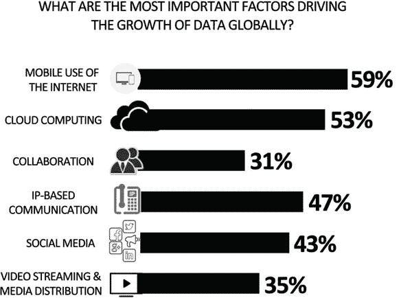
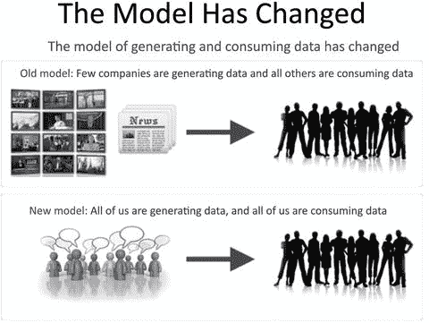
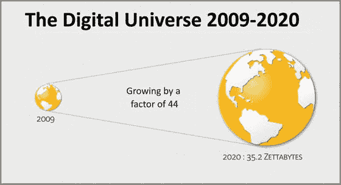
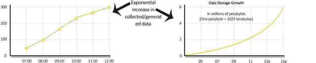

# 一、大数据

> "Big data is a term used to describe data with massive data, various structures and high-speed generation. This kind of data challenges the traditional RDBMS system for storing and processing data. Bidding data paves the way for new methods of processing and storing data. "

在本章中，我们将讨论大数据的基础知识、来源和挑战。我们将向您介绍大数据的三个 v(容量、速度和多样性),以及传统技术在处理大数据时面临的限制。

## 1.1 入门

大数据以及云、社交、分析和移动性是当今信息技术领域的热门词汇。大众对互联网和电子设备的可用性与日俱增。具体而言，智能手机、社交网站和平板电脑和传感器等其他数据生成设备正在创造数据爆炸。数据是从各种来源以各种格式生成的，如视频、文本、语音、日志文件和图像。一秒钟的高清视频产生的字节数是一页文本的 2000 倍。

考虑一下脸书公司网站上报道的以下统计数据:

There were 968 million daily active users on average for June of 2015\. There were 844 million mobile daily active users on average for June of 2015.   There were 1.49 billion monthly active users as of June 30, 2015\. There were 1.31 billion mobile monthly active users as of June 30, 2015.   There were 4.5 billion likes generated daily as of May 2013, which is a 67 percent increase from August 2012.  

图 [1-1](#Fig1) 描绘了 Twitter 的统计数据。

图 1-1。

If you printed Twitter…

这里有另一个例子:考虑像去看电影这样的简单事件可以生成的数据量。你首先在电影评论网站上搜索一部电影，阅读关于这部电影的评论，并提出疑问。你可以在推特上谈论这部电影，或者在脸书上发布去看电影的照片。在去剧院的途中，您的 GPS 系统会跟踪您的路线并生成数据。

你可以想象一下:智能手机、社交网站和其他媒体正在产生大量数据，供公司处理和存储。当数据的规模对典型软件工具捕获、处理、存储和管理数据的能力构成挑战时，我们就有了大数据。图 [1-2](#Fig2) 图形化定义了大数据。

图 1-2。

Definition of Big Data

## 1.2 大数据

大数据是指具有高容量、高速生成、多品种的数据。我们来看几个大数据的事实和数字。

### 1.2.1 关于大数据的事实

世界各地的各种研究团队已经对生成的数据量进行了分析。例如，IDC 的分析显示，仅一年(2007 年)产生的数字数据量就超过了全球的总存储容量，这意味着无法存储所有产生的数据。此外，数据生成的速度将很快超过数据存储容量的增长速度。

以下章节涵盖了 2011 年 5 月发布的 MGI(麦肯锡全球研究院)报告( [`www.mckinsey.com/insights/business_technology/big_data_the_next_frontier_for_innovation`)中的观点。这项研究表明，大数据的商业和经济可能性及其更广泛的影响是商业领袖和政策制定者必须解决的重要问题。](http://www.mckinsey.com/insights/business_technology/big_data_the_next_frontier_for_innovation)that)

#### 1.2.1.1 大数据的规模因行业而异

大数据的增长是每个行业都存在的现象。MGI 估计，2010 年，全球企业使用了超过 7eb 的增量磁盘驱动器数据存储容量；有趣的是，其中近 80%的数据似乎是存储在其他地方的重复数据。MGI 还估计，到 2009 年，美国经济中几乎所有行业的每家公司平均至少存储 200 TB 的数据，许多行业的每家公司平均存储数据超过 1pb。

一些部门的数据密集程度远远高于其他部门；在这种情况下，数据密集度是指该行业的公司/企业积累的平均数据量，这意味着它们更有潜力从大数据中获取价值。

金融服务部门，包括银行、投资和证券服务，高度面向事务；法规还要求它们存储数据。分析表明，平均每个公司存储的数字数据最多。

通信和媒体公司、公用事业和政府也有每个企业或组织存储的大量数字数据，这似乎反映了这样的事实，即这些实体具有大量的操作和多媒体数据。

离散制造业和流程制造业拥有最高的总数据存储字节数。然而，这些部门的密集程度要低得多，因为它们分散在许多公司中。

#### 1.2.1.2 大数据类型因行业而异

MGI 的研究还表明，存储的数据类型也因行业而异。例如，零售和批发、政府行政部门以及金融服务都会产生大量的文本和数字数据，包括客户数据、事务信息以及数学建模和模拟。制造业、医疗保健、媒体和通信等行业负责更高百分比的多媒体数据。X 射线、CT 和其他扫描形式的图像数据在医疗保健的数据存储量中占主导地位。

就大数据的地理分布而言，北美和欧洲目前拥有全球总量的 70%。由于云计算，一个地区产生的数据可以存储在另一个国家的数据中心。因此，拥有大量云和托管提供商产品的国家往往拥有大量数据存储。

## 1.3 大数据源

在本节中，我们将讨论导致数据不断增长的主要因素。图 [1-3](#Fig3) 描述了主要来源。

图 1-3。

Sources of data

正如 MGI 报告所强调的，这一数据的主要来源是

*   企业现在以更精细的方式收集数据，为每笔事务附加更多细节，以了解消费者行为。
*   医疗保健、产品公司等行业中多媒体使用的增加。
*   脸书、推特等社交媒体网站越来越受欢迎。
*   智能手机的快速普及，使用户能够积极使用社交媒体网站和其他互联网应用。
*   在日常生活中，通过网络连接到计算资源的传感器和设备的使用越来越多。

MGI 报告还预测，未来五年，传感器等机器对机器设备(也被称为物联网，或物联网)的数量将以每年超过 30%的速度增长。

因此，数据的增长率和多样性都在增加。此外，数据生成的模式已经从少数公司生成数据，其他公司消费数据，转变为人人生成数据，人人消费数据。这是由于消费 IT 和互联网技术的渗透以及社交媒体等趋势。图 [1-4](#Fig4) 描述了数据生成模型的变化。

图 1-4。

Data model

## 1.4 大数据的三个 v

我们将大数据定义为具有三个 v 的数据:量、速度和多样性，如图 [1-5](#Fig5) 所示。让我们来看看这三个方面。组织和 It 领导者必须关注这些方面。

图 1-5。

The three Vs of big data. The “big” isn’t just the volume

### 1.4.1 体积

大数据中的体积意味着数据的大小。如前所述，各种因素影响着大数据的规模:随着业务变得越来越以事务为导向，我们看到事务数量不断增加；越来越多的设备连接到互联网，这增加了容量；互联网的使用越来越多；内容的数字化也在增加。图 [1-6](#Fig6) 描绘了自 2009 年以来数字世界的增长。

图 1-6。

Digital universe size

在今天的场景中，数据不仅仅是从企业内部产生的；它也是基于与扩展企业和客户的事务而生成的。这需要企业对客户数据进行大量维护。如今，十亿字节的规模变得越来越普遍。图 [1-7](#Fig7) 描绘了数据增长率。

图 1-7。

Growth rate

如此庞大的数据量是大数据技术面临的最大挑战。以及时且经济的方式存储、处理和访问数据所需的存储和处理能力是巨大的。

### 1.4.2 品种

从各种设备和来源生成的数据没有固定的格式或结构。与文本相比，CSV 或 RDBMS 数据不同于文本文件、日志文件、流视频、照片、仪表读数、股票行情数据、pdf、音频和各种其他非结构化格式。

如今，数据的结构无法控制。新的数据源和数据结构正在快速创建。因此，技术上的责任是找到一种解决方案来分析和可视化存在的大量数据。例如，要为通勤者提供备用路线，交通分析应用需要来自数百万部智能手机和传感器的数据，以提供对交通状况和备用路线的准确分析。

### 1.4.3 速度

大数据中的速度是数据创建的速度和处理数据的速度。如果数据不能以要求的速度处理，它就失去了意义。由于来自社交媒体网站、传感器、报价器、计量和监控的数据流，无论数据是动态的还是静态的，组织都必须快速处理数据(参见图 [1-8](#Fig8) )。对于大数据技术来说，以足够快的速度应对和处理数据是另一个挑战。

图 1-8。

The three aspects of data

在许多大数据用例中，实时洞察至关重要。例如，算法事务系统从市场和 Twitter 等社交媒体网站获取实时信息，以做出股票事务决策。处理这些数据的任何延迟都可能意味着损失数百万美元的股票事务机会。

每当讨论大数据时，都会谈到第四个 V。第四个 V 是准确性，这意味着并不是所有的数据都是重要的，所以确定什么将提供有意义的洞察力，什么应该被忽略是至关重要的。

## 1.5 大数据的使用

本节将重点介绍使用大数据为组织创造价值的方法。在我们深入研究如何让大数据为组织所用之前，我们先来看看大数据为什么重要。

大数据是一个全新的数据来源；它是当你在博客上发表文章时产生的数据，比如一个产品或旅行。以前，这种细微的可用信息没有被捕获。现在，it 和采用此类数据的组织可以追求创新、提高灵活性并增加盈利能力。

大数据可以以多种方式为任何组织创造价值。正如 MGI 报告中所列，这可以大致分为五种使用大数据的方式。

### 能见度

相关利益相关者及时访问数据会产生巨大的价值。我们用一个例子来理解这个。假设一家制造公司的 R&D、工程和制造部门分散在不同的地理位置。如果这些数据可以在所有这些部门之间访问，并且可以很容易地集成，它不仅可以减少搜索和处理时间，而且还有助于根据当前的需要提高产品质量。

### 1.5.2 发现和分析信息

大数据的大部分价值来自于从外部来源收集的数据可以与组织的内部数据合并。组织正在获取关于库存、员工和客户的详细数据。使用所有这些数据，他们可以发现和分析新的信息和模式；因此，这些信息和知识可以用来改进过程和性能。

### 细分和定制

大数据使组织能够创建量身定制的产品和服务，以满足特定细分市场的需求。这也可用于社会部门，以准确划分人口，并针对具体需求制定福利计划。基于各种参数的客户细分有助于有针对性的营销活动和定制产品以满足客户的需求。

### 辅助决策

大数据可以极大地降低风险，改善决策，并揭示有价值的见解。信用卡处理中的自动化欺诈警报系统和库存的自动微调是基于大数据分析帮助或自动化决策的系统示例。

### 创新

大数据以产品和服务的形式实现了新思想的创新。它可以在现有的基础上进行创新，从而接触到更多的人。使用为实际产品收集的数据，制造商不仅可以创新以创造下一代产品，还可以创新销售产品。

例如，可以分析来自机器和车辆的实时数据，以提供对维护计划的洞察；可以监控机器的磨损，以制造更有弹性的机器；油耗监控可以提高发动机的效率。实时交通信息已经为通勤者提供了选择替代路线的选项，让他们的生活变得更加轻松。

因此，大数据不仅仅是数据量。这是从不断增加的数据中发现有意义的见解的机会。它帮助组织做出更明智的决策，使他们更加敏捷。它不仅为组织提供了通过做出明智的决策来加强现有业务的机会，还帮助识别新的机会。

## 1.6 大数据挑战

大数据也带来了一些挑战。在本节中，我们将重点介绍其中的几个。

### 政策和程序

随着越来越多的数据在全球范围内被收集、数字化和移动，策略和法规遵从性问题变得越来越重要。数据隐私、安全、知识产权和保护对组织来说非常重要。

遵守各种法令和法律要求给数据处理带来了挑战。围绕数据的所有权和责任问题是大数据案例中需要处理的重要法律问题。

此外，许多大数据项目利用公共云计算提供商的可扩展性功能。这给合规性带来了挑战。

还需要回答关于谁拥有数据、什么被定义为数据的合理使用以及谁对数据的准确性和保密性负责的政策问题。

### 数据的获取

访问供消费的数据是大数据项目面临的一项挑战。有些数据可能会被第三方获取，获取这些数据可能会面临法律和合同方面的挑战。

关于产品或服务的数据可以在脸书、Twitter feeds、评论和博客上获得，那么产品所有者如何从不同提供商拥有的不同来源访问这些数据呢？

同样，需要将访问大数据的合同条款和经济激励捆绑在一起，以使消费者能够获得数据。

### 技术和工艺

必须利用专门为满足大数据需求而构建的新工具和技术，而不是试图通过遗留系统来解决上述问题。一方面，遗留系统在处理大数据方面的不足，另一方面，新技术中缺乏经验丰富的资源，这是任何大数据项目都必须应对的挑战。

## 1.7 遗留系统和大数据

在本节中，我们将讨论组织在使用传统系统管理大数据时面临的挑战。

### 1.7.1 大数据结构

遗留系统设计用于处理结构化数据，其中定义了带有列的表。列中保存的数据的格式也是已知的。

但是，大数据是有很多结构的数据。基本上是图像、视频、日志等非结构化数据。

由于大数据可能是非结构化的，为通过基于不同列中保存的特定数据类型的索引等技术来执行快速查询和分析而创建的遗留系统无法用于保存或处理大数据。

### 数据存储

传统系统使用大型服务器、NAS 和 SAN 系统来存储数据。随着数据的增加，服务器大小和后端存储大小也必须增加。传统的传统系统通常在纵向扩展模式下工作，需要向服务器添加越来越多的计算、内存和存储来满足不断增长的数据需求。因此，处理时间呈索引级增长，这破坏了大数据的另一个重要要求，即速度。

### 数据处理

遗留系统中的算法设计用于处理结构化数据，如字符串和整数。它们也受到数据大小的限制。因此，遗留系统无法处理非结构化数据、海量此类数据以及需要执行处理的速度。

因此，为了从大数据中获取价值，我们需要在存储、计算和检索领域部署更新的技术，并且我们需要分析数据的新技术。

## 1.8 大数据技术

你见过什么是大数据。在这一节中，我们将简要地看一下哪些技术可以处理这个庞大的数据源。讨论中的技术需要有效地接受和处理不同类型的数据。

使组织能够充分利用大数据的最新技术进步如下:

New storage and processing technologies designed specifically for large unstructured data   Parallel processing   Clustering   Large grid environments   High connectivity and high throughput   Cloud computing and scale-out architectures  

越来越多的技术正在利用这些技术进步。在本书中，我们将讨论 MongoDB，这是一种可用于存储和处理大数据的技术。

## 1.9 摘要

在本章中，您了解了大数据。您研究了产生大数据的各种来源，以及大数据的用途和带来的挑战。您还了解了为什么需要更新的技术来存储和处理大数据。

在接下来的章节中，您将了解一些有助于组织管理大数据并使他们能够从大数据中获得有意义的见解的技术。