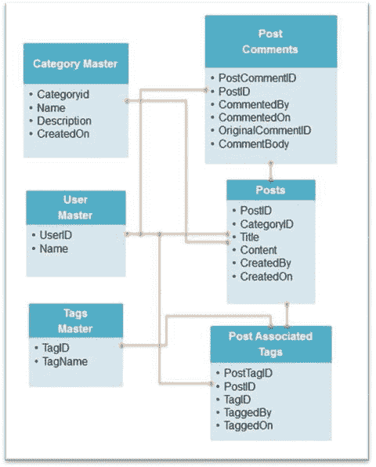

# 6.使用 MongoDB Shell

> "mongo shell comes with the standard distribution of MongoDB. It provides a JavaScript environment with full access to the language and standard functions. It provides a complete interface for MongoDB database. "

在本章中，您将学习 mongo shell 的基础知识以及如何使用它来管理 MongoDB 文档。在深入研究创建与数据库交互的应用之前，理解 MongoDB shell 的工作原理是很重要的。

没有比从 MongoDB shell 开始体验 MongoDB 数据库更好的方法了。MongoDB shell 简介分为三个部分，以便读者更容易理解和实践这些概念。

第一部分涵盖了数据库的基本特性，包括基本的 CRUD 操作符。下一节将介绍高级查询。本章的最后一节解释了存储和检索数据的两种方式:嵌入和引用。

## 6.1 基本查询

本节将简要讨论 CRUD 操作(创建、读取、更新和删除)。通过使用基本的示例和练习，您将学习如何在 MongoDB 中执行这些操作。此外，您将了解在 MongoDB 中查询是如何执行的。

与用于查询的传统 SQL 不同，MongoDB 使用自己的类似 JSON 的查询语言从存储的数据中检索信息。

成功安装 MongoDB 后，如第 [5 章](05.html)所述，您将导航到目录`C:\practicalmongodb\bin\`。该文件夹包含运行 MongoDB 的所有可执行文件。

MongoDB shell 可以通过执行 mongo 可执行文件来启动。

第一步总是启动数据库服务器。打开命令提示符(以管理员身份运行)并发出命令`CD \`。

接下来，运行命令`C:\practicalmongodb\bin\mongod.exe`。(如果安装在其他文件夹中，路径会相应改变。对于本章中的示例，安装在`C:\practicalmongodb`文件夹中。)这将启动数据库服务器。

`C:\>c:\practicalmongodb\bin\mongod.exe`

`2015-07-06T02:29:24.501-0700 I CONTROL Hotfix KB2731284 or later update is insalled, no need to zero-out data files`

`2015-07-06T02:29:24.522-0700 I JOURNAL [initandlisten] journal dir=c:\data\db\ournal`

`....................................................`

`2015-07-06T02:29:24.575-0700 I CONTROL [initandlisten] MongoDB starting : pid=384 port=27017 dbpath=c:\data\db\ 64-bit host=ANC09`

`2015-07-06T02:29:24.575-0700 I CONTROL [initandlisten] targetMinOS: Windows 7/windows Server 2008 R2`

`2015-07-06T02:29:24.575-0700 I CONTROL [initandlisten] db version v3.0.4`

`2015-07-06T02:29:24.575-0700 I CONTROL [initandlisten] OpenSSL version: OpenSSL1.0.1j-fips 19 Mar 2015`

`2015-07-06T02:29:24.575-0700 I CONTROL [initandlisten] build info: windows sys getwindowsversion(major=6, minor=1, build=7601, platform=2, service_pack='Service Pack 1') BOOST_LIB_VERSION=1_49`

`2015-07-06T02:29:24.575-0700 I CONTROL [initandlisten] allocator: system`

`2015-07-06T02:29:24.575-0700 I CONTROL [initandlisten] options: {}`

`2015-07-06T02:29:24.584-0700 I NETWORK [initandlisten] waiting for connections on port 27017`

默认情况下，MongoDB 在 localhost 接口的端口 27017 上监听任何传入的连接。

既然数据库服务器已经启动，您可以开始使用 mongo shell 向服务器发出命令。

在查看 mongo shell 之前，让我们简单地看一下如何使用导入/导出工具将数据导入和导出 MongoDB 数据库。

首先，创建一个 CSV 文件，用以下结构保存学生的记录:

`Name, Gender, Class, Score, Age.`

CSV 的样本数据如图 [6-1](#Fig1) 所示。

图 6-1。

Sample CSV file

接下来，将数据从 MongoDB 数据库导入到一个新的集合中，以便了解导入工具是如何工作的。

以管理员身份运行命令提示符，将其打开。以下命令用于获得关于`import`命令的帮助:

`C:\>c:\practicalmongodb\bin\mongoimport.exe --help`

`Import CSV, TSV or JSON data into MongoDB.`

`When importing JSON documents, each document must be a separate line of the input file.`

`Example:`

`mongoimport --host myhost --db my_cms --collection docs < mydocfile.json`

`....`

`C:\>`

发出以下命令，将数据从文件`exporteg.csv`导入到`MyDB`数据库中名为`importeg`的新集合中:

`C:\>c:\practicalmongodb\bin\mongoimport.exe --host localhost --db mydb --collection importeg --type csv --file c:\exporteg.csv --headerline`

`2015-07-06T01:53:23.537-0700 connected to: localhost`

`2015-07-06T01:53:23.608-0700 imported 15 documents`

为了验证集合是否被创建以及数据是否被导入，您使用 mongo shell 连接到数据库(在本例中是`localhost`),并发出命令来验证集合是否存在。

要启动 mongo shell，以管理员身份运行命令提示符并发出命令`C:\PracticalMongoDB\bin\mongo.exe`(路径会因安装文件夹而异；在这个例子中，文件夹是`C:\PracticalMongoDB\`)，并按回车键。

默认情况下，它连接到正在监听端口 27017 的`localhost`数据库服务器。

`C:\>c:\practicalmongodb\bin\mongo.exe`

`MongoDB shell version: 3.0.4`

`connecting to: test`

`> use mydb`

`switched to db mydb`

`> show collections`

`importeg`

`system.indexes`

`> db.importeg.find()`

`{ "_id" : ObjectId("5450af58c770b7161eefd31d"), "Name" : "S1", "Gender" : "M", "Class" : "C1", "Score" : 95, "Age" : 25 }`

`.......`

`{ "_id" : ObjectId("5450af59c770b7161eefd31e"), "Name" : "S2", "Gender" : "M", "Class" : "C1", "Score" : 85, "Age" : 18 }`

`>`

简而言之，你在这里做的是

Connecting to the mongo shell   Switching to your database, which is `MyDB` in this case   Checking for the collections that exist in the `MyDB` database using `show collections`.   Checking the count of the collection that you imported using the import tool.   Finally, executing the `find()` command to check for the data in the new collection.  

要连接到不同的主机和端口，可以将`–host`和`–port`与命令一起使用。

如图 [6-1](#Fig1) 所示，默认情况下，数据库`test`用于上下文。

在任一时间点，执行`db`命令将显示 shell 连接到的当前数据库:

`> db`

`test`

`>`

要显示所有数据库名称，可以运行`show dbs`命令。执行此命令将列出连接的服务器的所有数据库。

`> show dbs`

在任何时候，都可以使用`help()`命令访问帮助。

`> help`

`db.help() help on db methods`

`db.mycoll.help() help on collection methods`

`sh.help() sharding helpers`

`rs.help() replica set helpers`

`help admin administrative help`

`help connect connecting to a db help`

`help keys key shortcuts`

`help misc misc things to know`

`help mr mapreduce`

`show dbs show database names`

`show collections show collections in current database`

`show users show users in current database`

`.............`

`exit quit the mongo shell`

如上图所示，如果你需要关于`db`或`collection`的任何方法的帮助，你可以使用`db.help()`或`db.<CollectionName>.help()`。例如，如果你需要关于`db`命令的帮助，执行`db.help()`。

`> db.help()`

`DB methods:`

`db.addUser(userDocument)`

`...`

`db.shutdownServer()`

`db.stats()`

`db.version() current version of the server`

`>`

到目前为止，您一直使用默认的`test` db。命令`use <newdbname>`可用于切换到新的数据库。

`> use mydb`

`switched to db mydb`

在开始您的探索之前，让我们先简要地看一下与 SQL 术语和概念相对应的 MongoDB 术语和概念。表 [6-1](#Tab1) 对此进行了总结。

表 6-1。

SQL and MongoDB Terminology

<colgroup><col> <col></colgroup> 
| 结构化查询语言 | MongoDB |
| --- | --- |
| 数据库ˌ资料库 | 数据库ˌ资料库 |
| 桌子 | 募捐 |
| 排 | 文件 |
| 圆柱 | 田 |
| 索引 | 索引 |
| 表内联接 | 嵌入和引用 |
| 主键:可以指定一列或一组列 | 主键:自动设置为 _id 字段 |

让我们开始探索 MongoDB 中的查询选项。切换到`MYDBPOC`数据库。

`> use mydbpoc`

`switched to db mydbpoc`

`>`

这将上下文从`test`切换到`MYDBPOC`。同样可以使用`db`命令来确认。

`> db`

`mydbpoc`

`>`

尽管上下文被切换到了`MYDBPOC`，但是如果发出了`show dbs`命令，数据库名称将不会出现，因为 MongoDB 直到数据被插入到数据库中时才创建数据库。这与 MongoDB 的动态数据简化方法、动态名称空间分配以及简化和加速的开发过程是一致的。如果此时发出`show dbs`命令，它将不会在数据库列表中列出`MYDBPOC`数据库，因为在数据被插入数据库之前，数据库不会被创建。

以下示例假设一个名为`users`的多态集合，其中包含以下两个原型的文档:

`{`

`_id: ObjectID(),`

`FName: "First Name",`

`LName: "Last Name",`

`Age: 30, Gender: "M",`

`Country: "Country"`

`}`

`and`

`{`

`_id: ObjectID(),`

`Name: "Full Name",`

`Age: 30,`

`Gender: "M",`

`Country: "Country"`

`}`

`and`

`{`

`_id: ObjectID(), Name: "Full Name", Age: 30 }`

### 创建和插入

现在，您将了解如何创建数据库和集合。如前所述，MongoDB 中的文档是 JSON 格式的。

首先，通过发出`db`命令，您将确认上下文是`mydbpoc`数据库。

`> db`

`mydbpoc`

`>`

现在您将看到如何创建文档。

第一文档符合第一原型，而第二文档符合第二原型。您已经创建了两个名为 user1 和 user2 的文档。

`> user1 = {FName: "Test", LName: "User", Age:30, Gender: "M", Country: "US"}`

`{`

`"FName" : "Test",`

`"LName" : "User",`

`"Age" : 30,`

`"Gender" : "M",`

`"Country" : "US"`

`}`

`> user2 = {Name: "Test User", Age:45, Gender: "F", Country: "US"}`

`{ "Name" : "Test User", "Age" : 45, "Gender" : "F", "Country" : "US" }`

`>`

接下来，您将按照以下操作顺序将这两个文档(用户 1 和用户 2)添加到`users`集合中:

`> db.users.insert(user1)`

`> db.users.insert(user2)`

`>`

上面的操作不仅将两个文档插入到`users`集合中，还将创建集合和数据库。同样可以使用`show collections`和`show dbs`命令进行验证。

如上所述，`show dbs`将显示数据库列表。

`> show dbs`

`admin 0.078GB`

`local 0.078GB`

`mydb 0.078GB`

`mydbproc 0.078GB`

并且`show collections`会显示当前数据库中的收藏列表。

`> show collections`

`system.indexes`

`users`

`>`

与集合`users`一起，`system.indexes`集合也被显示。这个`system.indexes`集合是在创建数据库时默认创建的。它管理数据库中所有集合的所有索引的信息。

执行命令`db.users.find()`将显示`users`集合中的文档。

`> db.users.find()`

`{ "_id" : ObjectId("5450c048199484c9a4d26b0a"), "FName" : "Test", "LName" : "User", "Age" : 30, "Gender": "M", "Country" : "US" }`

`{ "_id" : ObjectId("5450c05d199484c9a4d26b0b"), "Name" : "Test", User", "Age" : 45,"Gender" : "F", "Country" : "US" }`

`>`

您可以看到显示了您创建的两个文档。除了您添加到文档中的字段之外，还有一个为所有文档生成的额外的`_id`字段。

所有文档必须有一个唯一的 _ `_id`字段。如果您没有明确指定，MongoDB 会自动将它指定为惟一的对象 ID，如上例所示。

您没有明确插入一个`_id`字段，但是当您使用`find()`命令显示文档时，您可以看到一个与每个文档相关联的`_id`字段。

这背后的原因是默认情况下会在 _ `_id`字段上创建一个索引，这可以通过在`system.indexes`集合上发出`find`命令来验证。

`>db.system.indexes.find()`

`{ "v" : 1, "key" : { "_id" : 1 }, "ns" : "mydbpoc.users", "name" : "_id_" }`

`>`

可以使用`ensureIndex()`和`dropIndex()`命令在集合中添加或删除新的索引。我们将在本章的后面讨论这一点。默认情况下，在所有集合的`_id`字段上创建一个索引。不能删除此默认索引。

### 显式创建集合

在上面的示例中，第一个插入操作隐式地创建了集合。但是，用户也可以在执行 insert 语句之前显式创建一个集合。

`db.createCollection("users")`

### 6.1.3 使用循环插入文档

还可以使用 for 循环将文档添加到集合中。下面的代码使用 for 插入用户。

`> for(var i=1; i<=20; i++) db.users.insert({"Name" : "Test User" + i, "Age": 10+i, "Gender" : "F", "Country" : "India"})`

`>`

为了验证插入是否成功，在集合上运行`find`命令。

`> db.users.find()`

`{ "_id" : ObjectId("52f48cf474f8fdcfcae84f79"), "FName" : "Test", "LName" : "User", "Age" : 30, "Gender" : "M", "Country" : "US" }`

`{ "_id" : ObjectId("52f48cfb74f8fdcfcae84f7a"), "Name" : "Test User", "Age" : 45`

`, "Gender" : "F", "Country" : "US" }`

`................`

`{ "_id" : ObjectId("52f48eeb74f8fdcfcae84f8c"), "Name" : "Test User18", "Age" :`

`28, "Gender" : "F", "Country" : "India" }`

`Type "it" for more`

`>`

用户出现在集合中。在您继续之前，让我们先理解“Type”it“for more”语句。

`find`命令将光标返回到结果集。光标不是在屏幕上一次显示所有文档(可能有数千或数百万个结果)，而是显示前 20 个文档，并等待请求迭代(it)以显示下 20 个，依此类推，直到显示所有结果集。

也可以将结果游标赋给一个变量，然后通过编程使用 while 循环对其进行迭代。光标对象也可以作为数组来操作。

在您的情况下，如果您键入“it”并按 Enter，将出现以下内容:

`>` `it`

`{ "_id" : ObjectId("52f48eeb74f8fdcfcae84f8d"), "Name" : "Test User19", "Age" :`

`29, "Gender" : "F", "Country" : "India" }`

`{ "_id" : ObjectId("52f48eeb74f8fdcfcae84f8e"), "Name" : "Test User20", "Age" :`

`30, "Gender" : "F", "Country" : "India" }`

`>`

因为只剩下两个文档，所以它显示剩下的两个文档。

### 6.1.4 通过显式指定 _id 进行插入

在前面的 insert 示例中，没有指定`_id`字段，所以它是隐式添加的。在下面的例子中，您将看到在集合中插入文档时如何显式地指定`_id`字段。

当显式指定`_id`字段时，您必须记住字段的唯一性；否则插入将会失败。

以下命令明确指定了`_id`字段:

`> db.users.insert({"_id":10, "Name": "explicit id"})`

插入操作在`users`集合中创建以下文档:

`{ "_id" : 10, "Name" : "explicit id" }`

这可以通过发出以下命令来确认:

`>db.users.find()`

### 更新

在本节中，您将探索用于更新集合中文档的`update()`命令。

默认情况下，`update()`方法更新单个文档。如果需要更新所有符合选择标准的文档，可以通过将`multi`选项设置为 true 来完成。

让我们从更新现有列的值开始。`$set`操作符将用于更新记录。

以下命令将所有女性用户的国家更新为英国:

`> db.users.update({"Gender":"F"}, {$set:{"Country":"UK"}})`

为了检查更新是否已经发生，发出一个`find`命令来检查所有的女性用户。

`> db.users.find({"Gender":"F"})`

`{ "_id" : ObjectId("52f48cfb74f8fdcfcae84f7a"), "Name" : "Test User", "Age" : 45`

`, "Gender" : "F", "Country" : "UK" }`

`{ "_id" : ObjectId("52f48eeb74f8fdcfcae84f7b"), "Name" : "Test User1", "Age" : 11, "Gender" : "F", "Country" : "India" }`

`{ "_id" : ObjectId("52f48eeb74f8fdcfcae84f7c"), "Name" : "Test User2", "Age" : 12, "Gender" : "F", "Country" : "India" }`

`...................`

`Type "it" for more`

`>`

如果您检查输出，您将看到只有第一个文档记录被更新，这是 update 的默认行为，因为没有指定`multi`选项。

现在让我们更改`update`命令，并包含`multi`选项:

`>db.users.update({"Gender":"F"},{$set:{"Country":"UK"}},{multi:true})`

`>`

再次发出`find`命令，检查是否已经为所有女性员工更新了国家。发出`find`命令将返回以下输出:

`> db.users.find({"Gender":"F"})`

`{ "_id" : ObjectId("52f48cfb74f8fdcfcae84f7a"), "Name" : "Test User", "Age" : 45, "Gender" : "F", "Country" : "UK" }`

`..............`

`Type "it" for more`

`>`

如您所见，所有符合条件的记录的国家都更新为英国。

在实际的应用中工作时，您可能会遇到一种模式演变，最终可能会在文档中添加或删除字段。让我们看看如何在 MongoDB 数据库中执行这些更改。

`update()`操作可以在文档级使用，这有助于更新集合中的单个文档或一组文档。

接下来，让我们看看如何向文档添加新字段。为了给文档添加字段，使用带有`$set`操作符和`multi`选项的`update()`命令。

如果您使用不存在的带`$set`的字段名，那么该字段将被添加到文档中。以下命令将把字段`company`添加到所有文档中:

`> db.users.update({},{$set:{"Company":"TestComp"}},{multi:true})`

`>`

对用户的集合发出`find`命令，您会发现新字段被添加到所有文档中。

`> db.users.find()`

`{ "Age" : 30, "Company" : "TestComp", "Country" : "US", "FName" : "Test", "Gender" : "M", "LName" : "User", "_id" : ObjectId("52f48cf474f8fdcfcae84f79") }`

`{ "Age" : 45, "Company" : "TestComp", "Country" : "UK", "Gender" : "F", "Name" : "Test User", "_id" : ObjectId("52f48cfb74f8fdcfcae84f7a") }`

`{ "Age" : 11, "Company" : "TestComp", "Country" : "UK", "Gender" : "F", ....................`

`Type "it" for more`

`>`

如果使用文档中已有的字段执行`update()`命令，它将更新该字段的值；但是，如果文档中不存在该字段，则该字段将被添加到文档中。

接下来您将看到如何使用相同的`update()`命令和`$unset`操作符从文档中删除字段。

以下命令将从所有文档中删除字段`Company`:

`> db.users.update({},{$unset:{"Company":""}},{multi:true})`

`>`

这可以通过对`Users`集合发出`find()`命令来检查。您可以看到,`Company`字段已经从文档中删除。

`> db.users.find()`

`{ "Age" : 30, "Country" : "US", "FName" : "Test", "Gender" : "M", "LName" : "User", "_id" : ObjectId("52f48cf474f8fdcfcae84f79") }`

`.............`

`Type "it" for more`

### 删除

要删除集合中的文档，请使用`remove ()`方法。如果指定了选择标准，则只会删除符合标准的文档。如果没有指定标准，所有文档都将被删除。

以下命令将删除性别= 'M '的文档:

`> db.users.remove({"Gender":"M"})`

`>`

同样可以通过在`Users`上发出`find()`命令来验证:

`> db.users.find({"Gender":"M"})`

`>`

不返回任何文档。

以下命令将删除所有文档:

`> db.users.remove({})`

`> db.users.find()`

`>`

如您所见，没有文档被返回。

最后，如果您想要删除集合，以下命令将删除集合:

`> db.users.drop()`

`true`

`>`

为了验证集合是否被删除，发出`show collections`命令。

`> show collections`

`system.indexes`

`>`

正如您所看到的，没有显示集合名称，这表明集合已经从数据库中删除。

已经介绍了基本的创建、更新和删除操作，下一节将向您展示如何执行读操作。

### 阅读

在本章的这一部分，您将看到各种示例，展示作为 MongoDB 一部分的查询功能，它使您能够从数据库中读取存储的数据。

为了从基本查询开始，首先创建`users`集合，并按照`insert`命令插入数据。

`> user1 = {FName: "Test", LName: "User", Age:30, Gender: "M", Country: "US"}`

`{`

`"FName" : "Test",`

`"LName" : "User",`

`"Age" : 30,`

`"Gender" : "M",`

`"Country" : "US"`

`}`

`> user2 = {Name: "Test User", Age:45, Gender: "F", Country: "US"}`

`{ "Name" : "Test User", "Age" : 45, "Gender" : "F", "Country" : "US" }`

`> db.users.insert(user1)`

`> db.users.insert(user2)`

`> for(var i=1; i<=20; i++) db.users.insert({"Name" : "Test User" + i, "Age": 10+i, "Gender" : "F", "Country" : "India"})`

现在让我们从基本的查询开始。`find()`命令用于从数据库中检索数据。

启动一个`find()`命令返回集合中的所有文档。

`> db.users.find()`

`{ "_id" : ObjectId("52f4a823958073ea07e15070"), "FName" : "Test", "LName" : "User", "Age" : 30, "Gender" : "M", "Country" : "US" }`

`{ "_id" : ObjectId("52f4a826958073ea07e15071"), "Name" : "Test User", "Age" : 45, "Gender" : "F", "Country" : "US" }`

`......`

`{ "_id" : ObjectId("52f4a83f958073ea07e15083"), "Name" : "Test User18", "Age" :28, "Gender" : "F", "Country" : "India" }`

`Type "it" for more`

`>`

#### 6.1.7.1 查询文档

MongoDB 提供了一个丰富的查询系统。查询文档可以作为参数传递给`find()`方法，以过滤集合中的文档。

查询文档在左“{”和右“}”花括号中指定。在返回结果集之前，将查询文档与集合中的所有文档进行匹配。

使用不带任何查询文档或空查询文档(如`find({})`)的`find()`命令返回集合中的所有文档。

查询文档可以包含选择器和投影仪。

选择器类似于 SQL 中的 where 条件或用于过滤结果的过滤器。

投影仪类似于用于显示数据字段的选择条件或选择列表。

#### 6.1.7.2 选择器

现在您将看到如何使用选择器。以下命令将返回所有女性用户:

`> db.users.find({"Gender":"F"})`

`{ "_id" : ObjectId("52f4a826958073ea07e15071"), "Name" : "Test User", "Age" : 45, "Gender" : "F", "Country" : "US" }`

`.............`

`{ "_id" : ObjectId("52f4a83f958073ea07e15084"), "Name" : "Test User19", "Age" :29, "Gender" : "F", "Country" : "India" }`

`Type "it" for more`

`>`

让我们更进一步。MongoDB 还支持将不同条件合并在一起的操作符，以便根据您的需求来细化您的搜索。

让我们细化上面的查询，现在寻找来自印度的女性用户。以下命令将返回相同的结果:

`> db.users.find({"Gender":"F", $or: [{"Country":"India"}]})`

`{ "_id" : ObjectId("52f4a83f958073ea07e15072"), "Name" : "Test User1", "Age" : 11, "Gender" : "F", "Country" : "India" }`

`...........`

`{ "_id" : ObjectId("52f4a83f958073ea07e15085"), "Name" : "Test User20", "Age" :30, "Gender" : "F", "Country" : "India" }`

`>`

接下来，如果您想要查找属于印度或美国的所有女性用户，请执行以下命令:

`>db.users.find({"Gender":"F",$or:[{"Country":"India"},{"Country":"US"}]})`

`{ "_id" : ObjectId("52f4a826958073ea07e15071"), "Name" : "Test User", "Age" : 45, "Gender" : "F", "Country" : "US" }`

`..............`

`{ "_id" : ObjectId("52f4a83f958073ea07e15084"), "Name" : "Test User19", "Age" :29, "Gender" : "F", "Country" : "India" }`

`Type "it" for more`

对于聚合需求，需要使用聚合函数。接下来，您将学习如何使用`count()`函数进行聚合。

在上面的例子中，不是显示文档，而是想找出居住在印度或美国的女性用户的数量。因此，执行以下命令:

`>db.users.find({"Gender":"F",$or:[{"Country":"India"}, {"Country":"US"}]}).count()`

`21`

`>`

如果您想在不考虑任何选择器的情况下计算用户数，请执行以下命令:

`> db.users.find().count()`

`22`

`>`

#### 6.1.7.3 投影仪

您已经看到了如何使用选择器过滤掉集合中的文档。在上面的例子中，`find()`命令返回与选择器匹配的文档的所有字段。

让我们向查询文档添加一个投影仪，除了选择器之外，您还将提到需要显示的特定细节或字段。

假设您想显示所有女性雇员的名字和年龄。在这种情况下，除了选择器，还使用了投影仪。

执行以下命令返回所需的结果集:

`> db.users.find({"Gender":"F"}, {"Name":1,"Age":1})`

`{ "_id" : ObjectId("52f4a826958073ea07e15071"), "Name" : "Test User", "Age" : 45 }`

`..........`

`Type "it" for more`

`>`

#### 6.1.7.4 排序( )

在 MongoDB 中，排序顺序指定如下:1 表示升序，1 表示降序。

如果在上面的示例中，您希望按年龄的升序对记录进行排序，您可以执行以下命令:

`>db.users.find({"Gender":"F"}, {"Name":1,"Age":1}).sort({"Age":1})`

`{ "_id" : ObjectId("52f4a83f958073ea07e15072"), "Name" : "Test User1", "Age" : 11 }`

`{ "_id" : ObjectId("52f4a83f958073ea07e15073"), "Name" : "Test User2", "Age" : 12 }`

`{ "_id" : ObjectId("52f4a83f958073ea07e15074"), "Name" : "Test User3", "Age" : 13 }`

`..............`

`{ "_id" : ObjectId("52f4a83f958073ea07e15085"), "Name" : "Test User20", "Age" :30 }`

`Type "it" for more`

如果要按姓名降序和年龄升序显示记录，请执行以下命令:

`>db.users.find({"Gender":"F"},{"Name":1,"Age":1}).sort({"Name":-1,"Age":1})`

`{ "_id" : ObjectId("52f4a83f958073ea07e1507a"), "Name" : "Test User9", "Age" : 19 }`

`............`

`{ "_id" : ObjectId("52f4a83f958073ea07e15072"), "Name" : "Test User1", "Age" : 11 }`

`Type "it" for more`

#### 6.1.7.5 极限( )

现在，您将了解如何限制结果集中的记录。例如，在拥有数千个文档的大型集合中，如果您只想返回五个匹配的文档，那么可以使用`limit`命令，这就使您能够做到这一点。

回到您之前对居住在印度或美国的女性用户的查询，假设您想要限制结果集，只返回两个用户。需要执行以下命令:

`>db.users.find({"Gender":"F",$or:[{"Country":"India"},{"Country":"US"}]}).limit(2)`

`{ "_id" : ObjectId("52f4a826958073ea07e15071"), "Name" : "Test User", "Age" : 45, "Gender" : "F", "Country" : "US" }`

`{ "_id" : ObjectId("52f4a83f958073ea07e15072"), "Name" : "Test User1", "Age" : 11, "Gender" : "F", "Country" : "India" }`

#### 6.1.7.6·斯基普

如果要求跳过前两个记录并返回第三个和第四个用户，则使用`skip`命令。需要执行以下命令:

`>db.users.find({"Gender":"F",$or:[{"Country":"India"}, {"Country":"US"}]}).limit(2).skip(2)`

`{ "_id" : ObjectId("52f4a83f958073ea07e15073"), "Name" : "Test User2", "Age" : 12, "Gender" : "F", "Country" : "India" }`

`{ "_id" : ObjectId("52f4a83f958073ea07e15074"), "Name" : "Test User3", "Age" : 13, "Gender" : "F", "Country" : "India" }`

`>`

#### 6.1.7.7 findOne()

与`find()`类似的是`findOne()`命令。`findOne()`方法可以接受与`find()`相同的参数，但是它返回的不是一个光标，而是一个文档。假设您想要返回一个居住在印度或美国的女性用户。这可以使用以下命令来实现:

`> db.users.findOne({"Gender":"F"}, {"Name":1,"Age":1})`

`{`

`"_id" : ObjectId("52f4a826958073ea07e15071"),`

`"Name" : "Test User",`

`"Age" : 45`

`}`

`>`

类似地，如果您想在这种情况下返回第一条记录而不考虑任何选择器，您可以使用`findOne()`，它将返回集合中的第一个文档。

`> db.users.findOne()`

`{`

`"_id" : ObjectId("52f4a823958073ea07e15070"),`

`"FName" : "Test",`

`"LName" : "User",`

`"Age" : 30,`

`"Gender" : "M",`

`"Country" : "US"}`

#### 使用光标的 6.1.7.8

当使用`find()`方法时，MongoDB 将查询结果作为游标对象返回。为了显示结果，mongo shell 对返回的光标进行迭代。

MongoDB 允许用户使用`find`方法的光标对象。在下一个示例中，您将看到如何将光标对象存储在一个变量中，并使用 while 循环来操作它。

假设您想要返回美国的所有用户。为了做到这一点，您创建了一个变量，将`find()`的输出分配给这个变量，它是一个游标，然后使用 while 循环迭代并打印输出。

代码片段如下:

`> var c = db.users.find({"Country":"US"})`

`> while(c.hasNext()) printjson(c.next())`

`{`

`"_id" : ObjectId("52f4a823958073ea07e15070"),`

`"FName" : "Test",`

`"LName" : "User",`

`"Age" : 30,`

`"Gender" : "M",`

`"Country" : "US"`

`}`

`{`

`"_id" : ObjectId("52f4a826958073ea07e15071"),`

`"Name" : "Test User",`

`"Age" : 45,`

`"Gender" : "F",`

`"Country" : "US"`

`}`

`>`

`next()`函数返回下一个文档。如果文档存在，`hasNext()`函数返回 true，并且`printjson()`以 JSON 格式呈现输出。

光标对象所分配到的变量也可以作为数组来操作。如果不想遍历变量，而是想在数组索引 1 处显示文档，可以运行以下命令:

`> var c = db.users.find({"Country":"US"})`

`> printjson(c[1])`

`{`

`"_id" : ObjectId("52f4a826958073ea07e15071"),`

`"Name" : "Test User",`

`.... "Gender" : "F",`

`"Country" : "US"}`

`>`

#### 6.1.7.9 解释( )

`explain()`函数可用于查看 MongoDB 数据库在执行查询时正在运行哪些步骤。从 3.0 版开始，函数的输出格式和传递给函数的参数都发生了变化。它带有一个名为`verbose`的可选参数，该参数决定解释输出应该是什么样子。以下是详细度模式:`allPlansExecution`、`executionStats`、`queryPlanner`。默认的详细模式是`queryPlanner`，这意味着如果没有指定，它默认为`queryPlanner`。

以下代码涵盖了对`username`字段进行过滤时执行的步骤:

`> db.users.find({"Name":"Test User"}).explain("allPlansExecution")`

`"queryPlanner" : {`

`"plannerVersion" : 1,`

`"namespace" : "mydbproc.users",`

`"indexFilterSet" : false,`

`"parsedQuery" : {`

`"$and" : [ ]`

`},`

`"winningPlan" : {`

`"stage" : "COLLSCAN",`

`"filter" : {`

`"$and" : [ ]`

`},`

`"direction" : "forward"`

`},`

`"rejectedPlans" : [ ]`

`},`

`"executionStats" : {`

`"executionSuccess" : true,`

`"nReturned" : 20,`

`"executionTimeMillis" : 0,`

`"totalKeysExamined" : 0,`

`"totalDocsExamined" : 20,`

`"executionStages" : {`

`"stage" : "COLLSCAN",`

`"filter" : {`

`"$and" : [ ]`

`},`

`"nReturned" : 20,`

`"executionTimeMillisEstimate" : 0,`

`"works" : 22,`

`"advanced" : 20,`

`"needTime" : 1,`

`"needFetch" : 0,`

`"saveState" : 0,`

`"restoreState" : 0,`

`"isEOF" : 1,`

`"invalidates" : 0,`

`"direction" : "forward",`

`"docsExamined" : 20`

`},`

`"allPlansExecution" : [ ]`

`},`

`"serverInfo" : {`

`"host" : " ANOC9",`

`"port" : 27017,`

`"version" : "3.0.4",`

`"gitVersion" : "534b5a3f9d10f00cd27737fbcd951032248b5952"`

`},`

`"ok" : 1`

如您所见，`explain()`输出返回关于`queryPlanner`、`executionStats`和`serverInfo`的信息。如上所述，输出返回的信息取决于所选的详细模式。

您已经看到了如何执行基本的查询、排序、限制等。您还了解了如何使用 while 循环或作为数组来操作结果集。在下一节中，您将了解索引以及如何在查询中使用它们。

### 使用索引

索引用于为频繁使用的查询提供高性能的读取操作。默认情况下，每当创建一个集合并将文档添加到其中时，都会在文档的`_id`字段上创建一个索引。

在这一节中，您将了解如何创建不同类型的索引。让我们首先使用 for 循环在一个名为`testindx`的新集合中插入 100 万个文档。

`>for(i=0;i<1000000;i++){db.testindx.insert({"Name":"user"+i,"Age":Math.floor(Math.random()*120)})}`

接下来，发出`find()`命令获取一个值为 user101 的名称。运行`explain()`命令来检查 MongoDB 正在执行哪些步骤来返回结果集。

`> db.testindx.find({"Name":"user101"}).explain("allPlansExecution")`

`{`

`"queryPlanner" : {`

`"plannerVersion" : 1,`

`"namespace" : "mydbproc.testindx",`

`"indexFilterSet" : false,`

`"parsedQuery" : {`

`"Name" : {`

`"$eq" : "user101"`

`}`

`},`

`"winningPlan" : {`

`"stage" : "COLLSCAN",`

`"filter" : {`

`"Name" : {`

`"$eq" : "user101"`

`}`

`},`

`"direction" : "forward"`

`},`

`"rejectedPlans" : [ ]`

`},`

`"executionStats" : {`

`"executionSuccess" : true,`

`"nReturned" : 1,`

`"executionTimeMillis" : 645,`

`"totalKeysExamined" : 0,`

`"totalDocsExamined" : 1000000,`

`"executionStages" : {`

`"stage" : "COLLSCAN",`

`"filter" : {`

`"Name" : {`

`"$eq" : "user101"`

`}`

`},`

`"nReturned" : 1,`

`"executionTimeMillisEstimate" : 20,`

`"works" : 1000002,`

`"advanced" : 1,`

`"needTime" : 1000000,`

`"needFetch" : 0,`

`"saveState" : 7812,`

`"restoreState" : 7812,`

`"isEOF" : 1,`

`"invalidates" : 0,`

`"direction" : "forward",`

`"docsExamined" : 1000000`

`},`

`"allPlansExecution" : [ ]`

`},`

`"serverInfo" : {`

`"host" : " ANOC9",`

`"port" : 27017,`

`"version" : "3.0.4",`

`"gitVersion" : "534b5a3f9d10f00cd27737fbcd951032248b5952"`

`},`

`"ok" : 1`

如您所见，数据库扫描了整个表。这会对性能产生重大影响，这是因为没有索引。

#### 6.1.8.1 单键索引

让我们在文档的`Name`字段上创建一个索引。使用`ensureIndex()`创建索引。

`> db.testindx.ensureIndex({"Name":1})`

创建索引需要几分钟时间，具体取决于服务器和集合大小。

让我们运行您之前使用`explain()`运行的相同查询，以检查数据库在索引创建后执行的步骤。检查输出中的`n`、`nscanned`和`millis`字段。

`>db.testindx.find({"Name":"user101"}).explain("allPathsExecution")`

`{`

`"queryPlanner" : {`

`"plannerVersion" : 1,`

`"namespace" : "mydbproc.testindx",`

`"indexFilterSet" : false,`

`"parsedQuery" : {`

`"Name" : {`

`"$eq" : "user101"`

`}`

`},`

`"winningPlan" : {`

`"stage" : "FETCH",`

`"inputStage" : {`

`"stage" : "IXSCAN",`

`"keyPattern" : {`

`"Name" : 1`

`},`

`"indexName" : "Name_1",`

`"isMultiKey" : false,`

`"direction" : "forward",`

`"indexBounds" : {`

`"Name" : [`

`"[\"user101\", \"user101\"]"`

`]`

`}`

`}`

`},`

`"rejectedPlans" : [ ]`

`},`

`"executionStats" : {`

`"executionSuccess" : true,`

`"nReturned" : 1,`

`"executionTimeMillis" : 0,`

`"totalKeysExamined" : 1,`

`"totalDocsExamined" : 1,`

`"executionStages" : {`

`"stage" : "FETCH",`

`"nReturned" : 1,`

`"executionTimeMillisEstimate" : 0,`

`"works" : 2,`

`"advanced" : 1,`

`"needTime" : 0,`

`"needFetch" : 0,`

`"saveState" : 0,`

`"restoreState" : 0,`

`"isEOF" : 1,`

`"invalidates" : 0,`

`"docsExamined" : 1,`

`"alreadyHasObj" : 0,`

`"inputStage" : {`

`"stage" : "IXSCAN",`

`"nReturned" : 1,`

`"executionTimeMillisEstimate" : 0,`

`"works" : 2,`

`"advanced" : 1,`

`"needTime" : 0,`

`"needFetch" : 0,`

`"saveState" : 0,`

`"restoreState" : 0,`

`"isEOF" : 1,`

`"invalidates" : 0,`

`"keyPattern" : {`

`"Name" : 1`

`},`

`"indexName" : "Name_1",`

`"isMultiKey" : false,`

`"direction" : "forward",`

`"indexBounds" : {`

`"Name" : [`

`"[\"user101\", \"user101\"]"`

`]`

`},`

`"keysExamined" : 1,`

`"dupsTested" : 0,`

`"dupsDropped" : 0,`

`"seenInvalidated" : 0,`

`"matchTested" : 0`

`}`

`},`

`"allPlansExecution" : [ ]`

`},`

`"serverInfo" : {`

`"host" : "ANOC9",`

`"port" : 27017,`

`"version" : "3.0.4",`

`"gitVersion" : "534b5a3f9d10f00cd27737fbcd951032248b5952"`

`},`

`"ok" : 1`

`}`

`>`

正如您在结果中看到的，没有表扫描。索引的创建对查询执行时间有很大的影响。

#### 6.1.8.2 综合指数

创建索引时，您应该记住索引涵盖了您的大多数查询。如果您有时只查询`Name`字段，有时同时查询`Name`和`Age`字段，那么在`Name`和`Age`字段上创建复合索引将比在任一字段上创建索引更有益，因为复合索引将涵盖这两个查询。

下面的命令在集合`testindx`的字段`Name`和`Age`上创建一个复合索引。

`> db.testindx.ensureIndex({"Name":1, "Age": 1})`

复合索引有助于 MongoDB 更高效地执行包含多个子句的查询。创建复合索引时，记住将用于精确匹配的字段(如`Name` : `"S1"`)排在最前面，后面是用于范围的字段(如`Age` : `{"$gt":20}`)，这一点也非常重要。

因此，上述索引将有利于以下查询:

`>db.testindx.find({"Name": "user5","Age":{"$gt":25}}).explain("allPlansExecution")`

`{`

`"queryPlanner" : {`

`"plannerVersion" : 1,`

`"namespace" : "mydbproc.testindx",`

`"indexFilterSet" : false,`

`"parsedQuery" : {`

`"$and" : [`

`{`

`"Name" : {`

`"$eq" : "user5"`

`}`

`},`

`{`

`"Age" : {`

`"$gt" : 25`

`}`

`}`

`]`

`},`

`"winningPlan" : {`

`"stage" : "KEEP_MUTATIONS",`

`"inputStage" : {`

`"stage" : "FETCH",`

`"filter" : {`

`"Age" : {`

`"$gt" : 25`

`}`

`},`

`............................`

`"indexBounds" : {`

`"Name" : [`

`"[\"user5\", \"user5\"`

`},`

`"rejectedPlans" : [`

`{`

`"stage" : "FETCH",`

`......................................................`

`"indexName" : "Name_1_Age_1",`

`"isMultiKey" : false,`

`"direction" : "forward",`

`.....................................................`

`"executionStats" : {`

`"executionSuccess" : true,`

`"nReturned" : 1,`

`"executionTimeMillis" : 0,`

`"totalKeysExamined" : 1,`

`"totalDocsExamined" : 1,`

`.....................................................`

`"inputStage" : {`

`"stage" : "FETCH",`

`"filter" : {`

`"Age" : {`

`"$gt" : 25`

`}`

`},`

`"nReturned" : 1,`

`"executionTimeMillisEstimate" : 0,`

`"works" : 2,`

`"advanced" : 1,`

`"allPlansExecution" : [`

`{`

`"nReturned" : 1,`

`"executionTimeMillisEstimate" : 0,`

`"totalKeysExamined" : 1,`

`"totalDocsExamined" : 1,`

`"executionStages" : {`

`.............................................................`

`"serverInfo" : {`

`"host" : " ANOC9",`

`"port" : 27017,`

`"version" : "3.0.4",`

`"gitVersion" : "534b5a3f9d10f00cd27737fbcd951032248b5952"`

`},`

`"ok" : 1`

`}`

`>`

#### 6.1.8.3 对排序操作的支持

在 MongoDB 中，使用索引字段对文档进行排序的排序操作提供了最高的性能。

正如在其他数据库中一样，MongoDB 中的索引也因此有了顺序。如果使用索引来访问文档，它返回结果的顺序与索引的顺序相同。

对多个字段进行排序时，需要创建复合索引。在复合索引中，输出可以是索引前缀或完整索引的排序顺序。

索引前缀是复合索引的子集，复合索引包含从索引开始的一个或多个字段。

例如，以下是复合指数的指数前缀:`{ x:1, y: 1, z: 1}`。

排序操作可以是索引前缀的任意组合，如`{x: 1}, {x: 1, y: 1}`。

复合索引只有在作为排序的前缀时才能帮助排序。

例如，`Age`、`Name`和`Class,`的复合指数如下

`> db.testindx.ensureIndex({"Age": 1, "Name": 1, "Class": 1})`

将对以下查询有用:

`> db.testindx.find().sort({"Age":1})`

`> db.testindx.find().sort({"Age":1,"Name":1})`

`> db.testindx.find().sort({"Age":1,"Name":1, "Class":1})`

上述索引在以下查询中不会有太大帮助:

`> db.testindx.find().sort({"Gender":1, "Age":1, "Name": 1})`

您可以使用`explain()`命令来诊断 MongoDB 是如何处理查询的。

#### 6.1.8.4 唯一指数

在一个字段上创建索引并不能确保唯一性，所以如果在`Name`字段上创建索引，那么两个或更多的文档可以有相同的名称。但是，如果惟一性是需要启用的约束之一，那么在创建索引时需要将`unique`属性设置为 true。

首先，让我们删除现有的索引。

`>db.testindx.dropIndexes()`

以下命令将在`testindx`集合的`Name`字段上创建唯一索引:

`> db.testindx.ensureIndex({"Name":1},{"unique":true})`

现在，如果您尝试在集合中插入重复的名称，如下所示，MongoDB 将返回一个错误，并且不允许插入重复的记录:

`> db.testindx.insert({"Name":"uniquename"})`

`> db.testindx.insert({"Name":"uniquename"})`

`"E11000 duplicate key error index: mydbpoc.testindx.$Name_1 dup key: { : "uniquename" }"`

如果您检查集合，您会看到只存储了第一个`uniquename`。

`> db.testindx.find({"Name":"uniquename"})`

`{ "_id" : ObjectId("52f4b3c3958073ea07f092ca"), "Name" : "uniquename" }`

`>`

也可以为复合索引启用唯一性，这意味着尽管单个字段可以有重复值，但组合将始终是唯一的。

例如，如果您有一个关于`{"name":1, "age":1}`的唯一索引，

`> db.testindx.ensureIndex({"Name":1, "Age":1},{"unique":true})`

`>`

则允许插入以下内容:

`> db.testindx.insert({"Name":"usercit"})`

`> db.testindx.insert({"Name":"usercit", "Age":30})`

然而，如果你执行

`> db.testindx.insert({"Name":"usercit", "Age":30})`

它会抛出一个错误，比如

`E11000 duplicate key error index: mydbpoc.testindx.$Name_1_Age_1 dup key: { : "usercit", : 30.0 }`

您可以先创建集合并插入文档，然后在集合上创建索引。如果在集合上创建唯一索引，而该集合在创建索引的字段中可能有重复值，则索引创建将会失败。

为了迎合这种情况，MongoDB 提供了一个`dropDups`选项。`dropDups`选项保存找到的第一个文档，并删除任何具有重复值的后续文档。

以下命令将在`name`字段上创建一个唯一的索引，并将删除任何重复的文档:

`>db.testindx.ensureIndex({"Name":1},{"unique":true, "dropDups":true})`

`>`

#### 6.1.8.5 系统.索引

无论何时创建数据库，默认情况下都会创建一个`system.indexes`集合。关于数据库索引的所有信息都存储在`system.indexes`集合中。这是一个保留的集合，因此您不能修改它的文档或从中删除文档。您只能通过`ensureIndex`和`dropIndexes`数据库命令来操作它。

每当创建一个索引时，可以在`system.indexes`中看到它的元信息。以下命令可用于获取上述集合的所有索引信息:

`db.collectionName.getIndexes()`

例如，以下命令将返回在`testindx`集合上创建的所有索引:

`> db.testindx.getIndexes()`

#### 6.1.8.6 下降指数

`dropIndex`命令用于删除索引。

以下命令将从`testindx`集合中删除`Name`字段索引:

`> db.testindx.dropIndex({"Name":1})`

`{ "nIndexesWas" : 3, "ok" : 1 }`

`>`

#### 6.1.8.7 重新指数

当您对集合执行了多次插入和删除操作后，您可能需要重新生成索引，以便能够以最佳方式使用索引。`reIndex`命令用于重建索引。

以下命令重建集合的所有索引。它将首先删除索引，包括`_id`字段上的默认索引，然后重新构建索引。

`db.collectionname.reIndex()`

以下命令重建`testindx`集合的索引:

`> db.testindx.reIndex()`

`{`

`"nIndexesWas" : 2,`

`"msg" : "indexes dropped for collection",`

`"nIndexes" : 2,`

`..............`

`"ok" : 1`

`}`

`>`

我们将在下一章详细讨论 MongoDB 中可用的不同类型的索引。

#### 6.1.8.8 索引是如何工作的

MongoDB 将索引存储在 BTree 结构中，因此自动支持范围查询。

如果在一个查询中使用了多个选择标准，MongoDB 会尝试找到最佳的单个索引来选择一个候选集。之后，它依次遍历集合，以评估其他标准。

当第一次执行查询时，MongoDB 为查询可用的每个索引创建多个执行计划。它让计划在一定数量的周期内轮流执行，直到执行最快的计划完成。然后将结果返回给系统，系统会记住最快的执行计划所使用的索引。

对于后续查询，将使用记住的索引，直到集合中发生了一定数量的更新。超过更新限制后，系统将再次执行该过程，以找出当时适用的最佳索引。

当下列任一事件发生时，将重新评估查询计划:

*   集合接收 1，000 次写操作。
*   添加或删除了一个索引。
*   mongod 进程重启。
*   发生了用于重建索引的重新索引。

如果想覆盖 MongoDB 的默认索引选择，同样可以使用`hint()`方法。

版本 2.6 中引入了索引过滤器。它由优化器将对查询进行评估的索引组成，包括查询、投影和排序。MongoDB 将使用索引过滤器提供的索引，并忽略`hint()`。

在 2.6 版之前，MongoDB 在任何时候都只使用一个索引，所以您需要确保存在复合索引来更好地匹配您的查询。这可以通过检查查询的排序和搜索标准来完成。

索引交集是在 2.6 版中引入的。它支持索引的交集，以满足具有复合条件的查询，其中条件的一部分由一个索引满足，而另一部分由另一个索引满足。

一般来说，一个索引交集由两个索引组成；但是，可以使用多个索引交集来解析查询。这种能力提供了更好的优化。

与其他数据库一样，索引维护也有成本。每个更改集合的操作(比如创建、更新或删除)都有开销，因为索引也需要更新。为了保持最佳平衡，您需要定期检查索引的有效性，该索引可以通过您在系统上执行的读写操作的比率来衡量。找出不常用的索引并删除它们。

## 6.2 超越基础

本节将介绍在选择器部分使用条件操作符和正则表达式的高级查询。这些操作符和正则表达式中的每一个都为您提供了对所编写的查询的更多控制，从而也为您提供了对从 MongoDB 数据库中获取的信息的更多控制。

### 使用条件运算符

条件运算符使您能够更好地控制试图从数据库中提取的数据。在本节中，您将重点关注以下操作员:`$lt`、`$lte`、`$gt`、`$gte`、`$in`、`$nin`和`$not`。

以下示例假设名为`Students`的集合包含以下类型的文档:

`{`

`_id: ObjectID(),`

`Name: "Full Name",`

`Age: 30,`

`Gender: "M",`

`Class: "C1",`

`Score: 95`

`}`

您将首先创建集合并插入几个示例文档。

`>db.students.insert({Name:"S1",Age:25,Gender:"M",Class:"C1",Score:95})`

`>db.students.insert({Name:"S2",Age:18,Gender:"M",Class:"C1",Score:85})`

`>db.students.insert({Name:"S3",Age:18,Gender:"F",Class:"C1",Score:85})`

`>db.students.insert({Name:"S4",Age:18,Gender:"F",Class:"C1",Score:75})`

`>db.students.insert({Name:"S5",Age:18,Gender:"F",Class:"C2",Score:75})`

`>db.students.insert({Name:"S6",Age:21,Gender:"M",Class:"C2",Score:100})`

`>db.students.insert({Name:"S7",Age:21,Gender:"M",Class:"C2",Score:100})`

`>db.students.insert({Name:"S8",Age:25,Gender:"F",Class:"C2",Score:100})`

`>db.students.insert({Name:"S9",Age:25,Gender:"F",Class:"C2",Score:90})`

`>db.students.insert({Name:"S10",Age:28,Gender:"F",Class:"C3",Score:90})`

`> db.students.find()`

`{ "_id" : ObjectId("52f874faa13cd6a65998734d"), "Name" : "S1", "Age" : 25, "Gender" : "M", "Class" : "C1", "Score" : 95 }`

`.......................`

`{ "_id" : ObjectId("52f8758da13cd6a659987356"), "Name" : "S10", "Age" : 28, "Gender" : "F", "Class" : "C3", "Score" : 90 }`

`>`

#### 6.2.1.1 $lt 和$ lt

让我们从`$lt`和`$lte`操作符开始。它们分别代表“小于”和“小于或等于”。

如果您想查找所有小于 25 岁的学生(年龄< 25)，您可以使用选择器执行下面的`find`:

`> db.students.find({"Age":{"$lt":25}})`

`{ "_id" : ObjectId("52f8750ca13cd6a65998734e"), "Name" : "S2", "Age" : 18, "Gender" : "M", "Class" : "C1", "Score" : 85 }`

`.............................`

`{ "_id" : ObjectId("52f87556a13cd6a659987353"), "Name" : "S7", "Age" : 21, "Gender" : "M", "Class" : "C2", "Score" : 100 }`

`>`

如果您想找出所有大于 25 岁(年龄< = 25)的学生，请执行以下命令:

`> db.students.find({"Age":{"$lte":25}})`

`{ "_id" : ObjectId("52f874faa13cd6a65998734d"), "Name" : "S1", "Age" : 25, "Gender" : "M", "Class" : "C1", "Score" : 95 }`

`....................`

`{ "_id" : ObjectId("52f87578a13cd6a659987355"), "Name" : "S9", "Age" : 25, "Gender" : "F", "Class" : "C2", "Score" : 90 }`

`>`

#### 6.2.1.2 $ gt 和$gte

`$gt`和`$gte`运算符分别代表“大于”和“大于或等于”。

让我们找出所有年龄大于 25 岁的学生。这可以通过执行以下命令来实现:

`> db.students.find({"Age":{"$gt":25}})`

`{ "_id" : ObjectId("52f8758da13cd6a659987356"), "Name" : "S10", "Age" : 28, "Gender" : "F", "Class" : "C3", "Score" : 90 }`

`>`

如果将上述示例更改为返回年龄> = 25 岁的学生，则命令为

`> db.students.find({"Age":{"$gte":25}})`

`{ "_id" : ObjectId("52f874faa13cd6a65998734d"), "Name" : "S1", "Age" : 25, "Gender" : "M", "Class" : "C1", "Score" : 95 }`

`......................................`

`{ "_id" : ObjectId("52f8758da13cd6a659987356"), "Name" : "S10", "Age" : 28, "Gender" : "F", "Class" : "C3", "Score" : 90 }`

`>`

#### 6.2.1.3 $ in 和$nin

让我们找出属于 C1 班或 C2 班的所有学生。同样的命令是

`> db.students.find({"Class":{"$in":["C1","C2"]}})`

`{ "_id" : ObjectId("52f874faa13cd6a65998734d"), "Name" : "S1", "Age" : 25, "Gender" : "M", "Class" : "C1", "Score" : 95 }`

`................................`

`{ "_id" : ObjectId("52f87578a13cd6a659987355"), "Name" : "S9", "Age" : 25, "Gender" : "F", "Class" : "C2", "Score" : 90 }`

`>`

使用`$nin`可以返回相反的结果。

接下来让我们找出不属于 C1 或 C2 班的学生。命令是

`> db.students.find({"Class":{"$nin":["C1","C2"]}})`

`{ "_id" : ObjectId("52f8758da13cd6a659987356"), "Name" : "S10", "Age" : 28, "Gender" : "F", "Class" : "C3", "Score" : 90 }`

`>`

接下来让我们看看如何组合上述所有操作符并编写一个查询。假设您想找出所有性别为“M”或属于“C1”或“C2”班级且年龄大于或等于 25 岁的学生。这可以通过执行以下命令来实现:

`>db.students.find({$or:[{"Gender":"M","Class":{"$in":["C1","C2"]}}], "Age":{"$gte":25}})`

`{ "_id" : ObjectId("52f874faa13cd6a65998734d"), "Name" : "S1", "Age" : 25, "Gender" : "M", "Class" : "C1", "Score" : 95 }`

`>`

### 正则表达式

在本节中，您将了解如何使用正则表达式。正则表达式在您想要查找姓名以“A”开头的学生的情况下非常有用。

为了理解这一点，我们再补充三四个名字不同的同学。

`> db.students.insert({Name:"Student1", Age:30, Gender:"M", Class: "Biology", Score:90})`

`> db.students.insert({Name:"Student2", Age:30, Gender:"M", Class: "Chemistry", Score:90})`

`> db.students.insert({Name:"Test1", Age:30, Gender:"M", Class: "Chemistry", Score:90})`

`> db.students.insert({Name:"Test2", Age:30, Gender:"M", Class: "Chemistry", Score:90})`

`> db.students.insert({Name:"Test3", Age:30, Gender:"M", Class: "Chemistry", Score:90})`

`>`

假设您想要查找姓名以“St”或“Te”开头且班级以“Che”开头的所有学生。同样可以使用正则表达式进行过滤，如下所示:

`> db.students.find({"Name":/(St|Te)*/i, "Class":/(Che)/i})`

`{ "_id" : ObjectId("52f89ecae451bb7a56e59086"), "Name" : "Student2", "Age" : 30, "Gender" : "M", "Class" : "Chemistry", "Score" : 90 }`

`.........................`

`{ "_id" : ObjectId("52f89f06e451bb7a56e59089"), "Name" : "Test3", "Age" : 30, "Gender" : "M", "Class" : "Chemistry", "Score" : 90 }`

`>`

为了理解正则表达式是如何工作的，让我们以查询`"Name":/(St|Te)*/i`为例。

*   //i 表示正则表达式不区分大小写。
*   (St|Te)*表示名称字符串必须以“St”或“Te”开头。
*   末尾的*表示它将匹配其后的任何内容。

当您将所有内容放在一起时，您正在对以“St”或“Te”开头的名称进行不区分大小写的匹配。在该类的正则表达式中，也发出相同的正则表达式。

接下来，让我们使查询变得复杂一点。让我们把它和上面提到的操作符结合起来。

获取姓名为 student1、student2 且年龄> =25 岁的男性学生。执行此操作的命令如下:

`>db.students.find({"Name":/(student*)/i,"Age":{"$gte":25},"Gender":"M"})`

`{ "_id" : ObjectId("52f89eb1e451bb7a56e59085"), "Name" : "Student1", "Age" : 30,`

`"Gender" : "M", "Class" : "Biology", "Score" : 90 }`

`{ "_id" : ObjectId("52f89ecae451bb7a56e59086"), "Name" : "Student2", "Age" : 30,`

`"Gender" : "M", "Class" : "Chemistry", "Score" : 90 }`

### MapReduce

MapReduce 框架支持任务的划分，在这种情况下是跨计算机集群的数据聚合，以减少聚合数据集所需的时间。它由两部分组成:Map 和 Reduce。

这里有一个更具体的描述:MapReduce 是一个框架，用于处理高度分布在巨大数据集上并使用多个节点运行的问题。如果所有节点都有相同的硬件，这些节点统称为集群；否则，它被称为网格。这种处理可以发生在结构化数据(存储在数据库中的数据)和非结构化数据(存储在文件系统中的数据)上。

*   “Map”:在这一步中，充当主节点的节点接受输入参数，并将大问题分成多个小的子问题。这些子问题然后分布在工作节点上。工作者节点可以进一步将问题分成子问题。这导致了多级树结构。然后，工作节点将处理其中的子问题，并将答案返回给主节点。
*   “Reduce”:在这一步中，所有子问题的答案都可以通过主节点获得，然后主节点将所有答案组合起来并产生最终输出，这就是您试图解决的大问题的答案。

为了理解它是如何工作的，让我们考虑一个小例子，在这个例子中，您将找出您的集合中男女学生的数量。

这包括以下步骤:首先创建`map`和`reduce`函数，然后调用`mapReduce`函数并传递必要的参数。

让我们从定义`map`函数开始:

`> var map = function(){emit(this.Gender,1);};`

`>`

该步骤将文档作为输入，并基于`Gender`字段发出类型为`{"F", 1}`或`{"M", 1}`的文档。

接下来，创建`reduce`函数:

`> var reduce = function(key, value){return Array.sum(value);};`

`>`

这将对键字段上的`map`函数发出的文档进行分组，在您的示例中是`Gender`，并将返回值的总和，在上面的示例中是“1”。上面定义的 reduce 函数的输出是基于性别的计数。

最后，使用`mapReduce`函数将它们放在一起，就像这样:

`> db.students.mapReduce(map, reduce, {out: "mapreducecount1"})`

`{`

`"result" : "mapreducecount1",`

`"timeMillis" : 29,`

`"counts" : {`

`"input" : 15,`

`"emit" : 15,`

`"reduce" : 2,`

`"output" : 2`

`},`

`"ok" : 1,`

`}`

`>`

这实际上是应用了您在`students`集合中定义的`map`，`reduce`函数。最终结果存储在一个名为`mapreducecount1`的新集合中。

为了检查它，在`mapreducecount1`集合上运行`find()`命令，如下所示:

`> db.mapreducecount1.find()`

`{ "_id" : "F", "value" : 6 }`

`{ "_id" : "M", "value" : 9 }`

`>`

这里还有一个例子来解释`MapReduce`的工作原理。让我们用`MapReduce`找出班级的平均分数。正如您在上面的例子中看到的，您需要首先创建`map`函数，然后创建`reduce`函数，最后将它们组合起来，将输出存储在数据库的一个集合中。代码片段是

`> var map_1 = function(){emit(this.Class,this.Score);};`

`> var reduce_1 = function(key, value){return Array.avg(value);};`

`>db.students.mapReduce(map_1,reduce_1, {out:"MR_ClassAvg_1"})`

`{`

`"result" : "MR_ClassAvg_1",`

`"timeMillis" : 4,`

`"counts" : {`

`"input" : 15, "emit" : 15,`

`"reduce" : 3 , "output" : 5`

`},`

`"ok" : 1,`

`}`

`> db.MR_ClassAvg_1.find()`

`{ "_id" : "Biology", "value" : 90 }`

`{ "_id" : "C1", "value" : 85 }`

`{ "_id" : "C2", "value" : 93 }`

`{ "_id" : "C3", "value" : 90 }`

`{ "_id" : "Chemistry", "value" : 90 }`

`>`

第一步是定义`map`函数，该函数循环遍历集合文档，并将输出作为`{"Class": Score},`返回，例如`{"C1":95}`。第二步是对班级进行分组，并计算该班级的平均分数。第三步合并结果；它定义了需要应用`map`、`reduce`函数的集合，最后它定义了在哪里存储输出，在本例中是一个名为`MR_ClassAvg_1`的新集合。

在最后一步中，使用`find`来检查结果输出。

### 6.2.4 聚合()

上一节介绍了`MapReduce`功能。在本节中，您将大致了解一下 MongoDB 的聚合框架。

聚合框架使您能够在不使用`MapReduce`函数的情况下找出聚合值。在性能方面，聚合框架比`MapReduce`函数更快。你需要时刻记住`MapReduce`是用于批量方法而不是实时分析的。

接下来，您将使用`aggregate`函数描述上面讨论的两个输出。首先，输出是查找男女学生的数量。这可以通过执行以下命令来实现:

`> db.students.aggregate({$group:{_id:"$Gender", totalStudent: {$sum: 1}}})`

`{ "_id" : "F", "totalStudent" : 6 }`

`{ "_id" : "M", "totalStudent" : 9 }`

`>`

类似地，为了找出类的平均分数，可以执行下面的命令:

`> db.students.aggregate({$group:{_id:"$Class", AvgScore: {$avg: "$Score"}}})`

`{ "_id" : "Biology", "AvgScore" : 90 }`

`{ "_id" : "C3", "AvgScore" : 90 }`

`{ "_id" : "Chemistry", "AvgScore" : 90 }`

`{ "_id" : "C2", "AvgScore" : 93 }`

`{ "_id" : "C1", "AvgScore" : 85 }`

`>`

## 6.3 设计应用的数据模型

在本节中，您将了解如何为应用设计数据模型。MongoDB 数据库为设计数据模型提供了两种选择:用户可以将相关对象嵌入到另一个对象中，也可以使用 ID 相互引用。在本节中，您将探索这些选项。

为了理解这些选项，您将设计一个博客应用并演示这两个选项的用法。

典型的博客应用由以下场景组成:

有人在不同的主题上发表博客。除了主题分类，还可以使用不同的标签。举例来说，如果类别是政治，帖子谈论一个政治家，那么这个政治家的名字可以作为标签添加到帖子中。这有助于用户快速找到与他们兴趣相关的帖子，并让他们将相关帖子链接在一起。

浏览博客的人可以对博客文章发表评论。

### 6.3.1 关系数据建模和规范化

在开始使用 MongoDB 的方法之前，让我们先绕一小段路，看看如何在关系数据库(如 SQL)中对此建模。

在关系数据库中，数据建模通常是通过定义表并逐渐删除数据冗余来实现范式的。

#### 6.3.1.1 什么是范式？

在关系数据库中，范式通常从根据应用需求创建表开始，然后逐渐移除冗余以实现最高范式，这也被称为第三范式或 3NF。为了更好地理解这一点，让我们将博客应用数据放在表格中。初始数据如图 [6-2](#Fig2) 所示。

图 6-2。

Blogging application initial data

这个数据其实是第一范式的。你会有很多冗余，因为你可以对文章有多个评论，多个标签可以与文章相关联。当然，冗余的问题是它引入了不一致的可能性，即相同数据的不同副本可能具有不同的值。要消除这种冗余，您需要通过将数据拆分到多个表中来进一步规范化数据。作为此步骤的一部分，您必须标识唯一标识表中每一行的键列，以便您可以在表之间创建链接。当使用 3NF 范式建模时，上述场景将看起来像图 [6-3](#Fig3) 所示的 RDBMs 图。

图 6-3。

RDBMS diagram

在这种情况下，您有一个没有冗余的数据模型，允许您更新它，而不必担心更新多行。特别是，您不再需要担心数据模型中的不一致性。

#### 6.3.1.2 范式的问题

如前所述，标准化的好处是它允许轻松更新，没有任何冗余(即，它有助于保持数据的一致性)。更新用户名意味着更新`Users`表中的名称。

然而，当您试图取回数据时，问题出现了。例如，为了找到与特定用户的帖子相关联的所有标签和评论，关系数据库程序员使用一个 JOIN。通过使用连接，数据库根据应用屏幕设计返回所有数据，但是真正的问题是数据库执行什么操作来获得结果集。

一般来说，任何 RDBMS 从磁盘读取并进行寻道，这要花费 99%以上的时间来读取一行。当涉及到磁盘访问时，随机寻道是敌人。这在这个上下文中如此重要的原因是因为连接通常需要随机查找。连接操作是关系数据库中开销最大的操作之一。此外，如果最终需要将数据库扩展到多台服务器，就会引入生成分布式连接的问题，这是一个复杂且通常很慢的操作。

### 6.3.2 MongoDB 文档数据模型方法

如您所知，在 MongoDB 中，数据存储在文档中。幸运的是，作为应用设计者，这为模式设计带来了一些新的可能性。不幸的是，这也使我们的模式设计过程变得复杂。现在，当面临模式设计问题时，不再像关系数据库那样有固定的规范化数据库设计路径。在 MongoDB 中，模式设计取决于您试图解决的问题。

如果您必须使用 MongoDB 文档模型对上述内容进行建模，您可以将博客数据存储在一个文档中，如下所示:

`{`

`"_id" : ObjectId("509d27069cc1ae293b36928d"),`

`"title" : "Sample title",`

`"body" : "Sample text.",`

`"tags" : [`

`"Tag1",`

`"Tag2",`

`"Tag3",`

`"Tag4"`

`],`

`"created_date" : ISODate("2015-07-06T12:41:39.110Z"),`

`"author" : "Author 1",`

`"category_id" : ObjectId("509d29709cc1ae293b369295"),`

`"comments" : [`

`{`

`"subject" : "Sample comment",`

`"body" : "Comment Body",`

`"author " : "author 2",`

`"created_date":ISODate("2015-07-06T13:34:23.929Z")`

`}`

`]}`

如您所见，您只在一个文档中嵌入了注释和标签。或者，您可以通过引用`_id`字段的注释和标签来“规范化”模型:

`// Authors document:`

`{`

`"_id": ObjectId("509d280e9cc1ae293b36928e "),`

`"name": "Author 1",}`

`// Tags document:`

`{`

`"_id": ObjectId("509d35349cc1ae293b369299"),`

`"TagName": "Tag1",.....}`

`// Comments document:`

`{`

`"_id": ObjectId("509d359a9cc1ae293b3692a0"),`

`"Author": ObjectId("508d27069cc1ae293b36928d"),`

`.......`

`"created_date" : ISODate("2015-07-06T13:34:59.336Z")`

`}`

`//Category Document`

`{`

`"_id": ObjectId("509d29709cc1ae293b369295"),`

`"Category": "Catgeory1"......`

`}`

`//Posts Document`

`{`

`"_id" : ObjectId("509d27069cc1ae293b36928d"),`

`"title" : "Sample title","body" : "Sample text.",`

`"tags" : [ ObjectId("509d35349cc1ae293b369299"),`

`ObjectId("509d35349cc1ae293b36929c")`

`],`

`"created_date" : ISODate("2015-07-06T13:41:39.110Z"),`

`"author_id" : ObjectId("509d280e9cc1ae293b36928e"),`

`"category_id" : ObjectId("509d29709cc1ae293b369295"),`

`"comments" : [`

`ObjectId("509d359a9cc1ae293b3692a0"),`

`]}`

这一章的剩余部分将致力于确定哪种解决方案将在您的环境中工作(即是否使用引用或是否嵌入)。

#### 6.3.2.1 嵌入

在本节中，您将看到嵌入是否会对性能产生积极的影响。当您想要获取一些数据集并将其显示在屏幕上时，例如显示与博客相关的评论的页面，嵌入会很有用；在这种情况下，评论可以嵌入到博客文档中。

这种方法的好处是，由于 MongoDB 将文档连续存储在磁盘上，所以所有相关数据都可以在一次寻道中获取。

除此之外，由于不支持连接，并且在这种情况下使用了引用，所以应用可能会执行如下操作来获取与博客相关联的评论数据。

Fetch the associated `comments_id` from the blogs document.   Fetch the comments document based on the `comments_id` found in the first step.  

如果您采用这种方法(引用),不仅数据库必须进行多次查找才能找到您的数据，而且还会在查找中引入额外的延迟，因为现在需要两次往返数据库才能检索到您的数据。

如果应用经常访问博客中的评论数据，那么几乎可以肯定的是，在博客文档中嵌入评论会对性能产生积极的影响。

支持嵌入的另一个考虑是在编写数据时对原子性和隔离性的需求。MongoDB 的设计没有多文档事务。在 MongoDB 中，操作的原子性只在单个文档级别提供，因此需要一起原子更新的数据需要一起放在单个文档中。

当您更新数据库中的数据时，您必须确保您的更新要么成功，要么完全失败，决不能有“部分成功”，并且没有其他数据库读取器会看到未完成的写操作。

#### 6.3.2.2 参考

您已经看到，嵌入是在许多情况下提供最佳性能的方法；它还提供数据一致性保证。然而，在某些情况下，更规范化的模型在 MongoDB 中工作得更好。

拥有多个集合并添加引用的一个原因是它在查询数据时增加了灵活性。让我们用上面提到的博客例子来理解这一点。

您了解了如何使用嵌入式模式，当在一个页面上显示所有数据时(即显示博客文章和所有相关评论的页面)，这种模式会工作得很好。

现在假设您需要搜索某个用户发布的评论。查询(使用这个嵌入式模式)如下所示:

`db.posts.find({'comments.author': 'author2'},{'comments': 1})`

那么，该查询的结果将是以下形式的文档:

`{`

`"_id" : ObjectId("509d27069cc1ae293b36928d"),`

`"comments" : [ {`

`"subject" : "Sample Comment 1 ",`

`"body" : "Comment1 Body.",`

`"author_id" : "author2",`

`"created_date" : ISODate("2015-07-06T13:34:23.929Z")}...]`

`}`

`"_id" : ObjectId("509d27069cc1ae293b36928d"),`

`"comments" : [`

`{`

`"subject" : "Sample Comment 2",`

`"body" : "Comments Body.",`

`"author_id" : "author2",`

`"created_date" : ISODate("2015-07-06T13:34:23.929Z")`

`}...]}`

这种方法的主要缺点是得到的数据比实际需要的多得多。特别是不能只要求 author2 的评论；你必须询问作者 2 评论过的帖子，这也包括对这些帖子的所有其他评论。这些数据需要在应用代码中进一步过滤。

另一方面，假设您决定使用规范化模式。在这种情况下，您将有三个文档:“作者”、“帖子”和“评论”

“作者”文档将包含特定于作者的内容，如姓名、年龄、性别等。，而“Posts”文档将包含特定于帖子的详细信息，如帖子创建时间、帖子作者、实际内容和帖子主题。

“评论”文档将包含帖子的评论，如日期时间、作者创建的评论，以及评论的文本。这描述如下:

`// Authors document:`

`{`

`"_id": ObjectId("508d280e9cc1ae293b36928e "),`

`"name": "Jenny",`

`..........`

`}`

`//Posts Document`

`{`

`"_id" : ObjectId("508d27069cc1ae293b36928d"),....................`

`}`

`// Comments document:`

`{`

`"_id": ObjectId("508d359a9cc1ae293b3692a0"),`

`"Author": ObjectId("508d27069cc1ae293b36928d"),`

`"created_date" : ISODate("2015-07-06T13:34:59.336Z"),`

`"Post_id": ObjectId("508d27069cc1ae293b36928d"),`

`..........`

`}`

在这个场景中，通过“author2”查找评论的查询可以通过对评论集合执行简单的`find()`来完成:

`db.comments.find({"author": "author2"})`

一般来说，如果您的应用的查询模式是众所周知的，并且数据往往只能以一种方式访问，那么嵌入式方法就可以很好地工作。或者，如果您的应用可能以许多不同的方式查询数据，或者您无法预测查询数据的模式，那么更“规范化”的方法可能更好。

例如，在上面的模式中，您将能够使用 limit、skip 操作符对注释进行排序或返回一组更受限制的注释。在嵌入的情况下，你不得不按照存储在文章中的顺序来检索所有的评论。

另一个可能支持使用文档引用的因素是当您有一对多关系时。

例如，一个有大量读者参与的热门博客可能会有数百甚至数千条评论。在这种情况下，嵌入会带来很大的损失:

*   对读取性能的影响:随着文档大小的增加，它将占用更多的内存。内存的问题是，MongoDB 数据库将频繁访问的文档缓存在内存中，文档越大，放入内存的可能性就越小。这将导致在检索文档时出现更多的页面错误，这将导致随机的磁盘 I/O，从而进一步降低性能。
*   对更新性能的影响:随着文件大小的增加以及对这类文档执行更新操作以追加数据，MongoDB 最终需要将文档移动到一个有更多可用空间的区域。这种移动一旦发生，会显著降低更新性能。

除此之外，MongoDB 文档有一个 16MB 的硬性大小限制。尽管需要注意这一点，但在达到 16MB 的大小限制之前，您通常会由于内存压力和文档复制而遇到问题。

支持使用文档引用的最后一个因素是多对多或 M:N 关系。

例如，在上面的例子中，有一些标签。每个博客可以有多个标签，每个标签可以与多个博客条目相关联。

实现 blogs-tags M:N 关系的一种方法是拥有以下三个集合:

*   `Tags`集合，它将存储标签的详细信息
*   `Blogs`集合，其中将有博客的详细信息
*   第三个集合叫做`Tag-To-Blog Mapping`，它将在标签和博客之间进行映射

这种方法类似于关系数据库中的方法，但是这会对应用的性能产生负面影响，因为查询最终会执行大量应用级的“连接”

或者，您可以使用嵌入模型，在博客文档中嵌入标签，但是这将导致数据重复。虽然这将稍微简化读取操作，但它将增加更新操作的复杂性，因为在更新标签细节时，用户需要确保更新的标签在嵌入到其他博客文档中的每个地方都得到更新。

因此，对于多对多连接，折衷的方法通常是最好的，嵌入一列`_id`值而不是整个文档:

`// Tags document:`

`{`

`"_id": ObjectId("508d35349cc1ae293b369299"),`

`"TagName": "Tag1",`

`..........`

`}`

`// Posts document with Tag IDs added as References`

`//Posts Document`

`{ "_id" : ObjectId("508d27069cc1ae293b36928d"),`

`"tags" : [`

`ObjectId("509d35349cc1ae293b369299"),`

`ObjectId("509d35349cc1ae293b36929a"),`

`ObjectId("509d35349cc1ae293b36929b"),`

`ObjectId("509d35349cc1ae293b36929c")`

`],....................................`

`}`

尽管查询会有点复杂，但您不再需要担心到处更新标签。

总之，MongoDB 中的模式设计是您需要做出的最早决策之一，它取决于应用的需求和查询。

正如您所看到的，当您需要一起访问数据或者需要进行原子更新时，嵌入将会产生积极的影响。但是，如果您在查询时需要更多的灵活性，或者如果您有多对多的关系，使用引用是一个不错的选择。

最终，决定取决于应用的访问模式，在 MongoDB 中没有严格的规则。在下一节中，您将了解各种数据建模注意事项。

#### 数据建模的 6.3.2.3 决策

这包括决定如何组织文档，以便有效地对数据建模。需要决定的重要一点是，您是需要嵌入数据还是使用对数据的引用(即，是使用嵌入还是引用)。

这一点最好用一个例子来说明。假设你有一个书评网站，里面有作者和书籍，还有带线索评论的评论。

现在的问题是如何组织收藏。这个决定取决于每本书预期的注释数量以及执行读写操作的频率。

#### 6.3.2.4 操作注意事项

除了元素之间的交互方式(即是否以嵌入式方式存储文档或使用引用)，在为应用设计数据模型时，许多其他操作因素也很重要。这些因素将在以下章节中介绍。

##### 数据生命周期管理

如果您的应用有只需要在数据库中保留有限时间的数据集，则需要使用此功能。

比如说你需要保留一个月的评审和评论的相关数据。可以考虑这个特点。

这是通过使用集合的生存时间(TTL)功能实现的。集合的 TTL 功能确保文档在一段时间后过期。

此外，如果应用要求只处理最近插入的文档，那么使用上限集合将有助于优化性能。

##### 指数

可以创建索引来支持常用的查询，以提高性能。默认情况下，MongoDB 会在`_id`字段上创建一个索引。

以下是创建索引时需要考虑的几点:

*   每个索引至少需要 8KB 的数据空间。
*   对于写操作，添加索引会对性能产生一些负面影响。因此，对于具有大量写入的集合，索引可能很昂贵，因为对于每次插入，必须将键添加到所有索引中。
*   索引对于具有大量读取操作的集合非常有用，例如读写操作比例很高的情况。未索引的读取操作不受索引的影响。

##### 分片

设计应用模型时的一个重要因素是是否对数据进行分区。这是在 MongoDB 中使用分片实现的。

分片也称为数据分区。在 MongoDB 中，集合被分区，其文档分布在机器集群上，这些机器集群被称为碎片。这可能会对性能产生重大影响。我们将在 tk 章节中更多地讨论分片。

##### 大量的收藏

拥有多个集合与将数据存储在单个集合中的设计考虑事项如下:

*   选择多个集合来存储数据不会影响性能。
*   对于不同类型的数据拥有不同的集合可以提高高吞吐量批处理应用的性能。

当您设计具有大量集合的模型时，需要考虑以下行为:

*   几千字节的某个最小开销与每个集合相关联。
*   每个索引至少需要 8KB 的数据空间，包括`_id`索引。

现在您已经知道每个数据库的元数据都存储在`<database>.ns`文件中。每个集合和索引在名称空间文件中都有自己的条目，因此在决定实现大量集合时，需要考虑名称空间文件的大小限制。

##### 文档的增长

一些更新，比如将一个元素推送到一个数组，添加新的字段等等。会导致文档尺寸的增加，这可能会导致文档从一个槽移动到另一个槽以适合文档。这一文档重定位过程既耗费资源又耗费时间。尽管 MongoDB 提供了填充来最小化重定位的发生，但是您可能需要手动处理文档的增长。

## 6.4 总结

在本章中，您学习了基本的 CRUD 操作和高级查询功能。您还研究了存储和检索数据的两种方式:嵌入和引用。

在下一章中，您将了解 MongoDB 架构、其核心组件和特性。