# 7.MongoDB 架构

“MongoDB 架构涵盖了 MongoDB 的深层架构概念。”

在本章中，您将了解 MongoDB 架构，尤其是核心流程和工具、独立部署、分片概念、复制概念和生产部署。

## 7.1 核心流程

MongoDB 包中的核心组件是

*   mongod，这是核心数据库进程
*   mongos，它是分片集群的控制器和查询路由器
*   mongo，这是交互式 MongoDB shell

这些组件在 bin 文件夹下作为应用提供。让我们详细讨论这些组件。

### 7.1.1 蒙戈布

MongoDB 系统中的主要守护进程称为 mongod。这个守护进程处理所有数据请求，管理数据格式，并执行后台管理操作。

当一个 mongod 在没有任何参数的情况下运行时，它连接到默认的数据目录，即`C:\data\db`或`/data/db`，以及默认的端口 27017，在这里它监听套接字连接。

在 mongod 进程启动之前，确保数据目录存在并且您拥有对该目录的写权限是很重要的。

如果该目录不存在，或者您对该目录没有写权限，此过程的开始将失败。如果默认端口 27017 不可用，服务器将无法启动。

mongod 还有一个 HTTP 服务器，它监听比默认端口高 1000 的端口，所以如果您使用默认端口 27017 启动 mongod，在这种情况下，HTTP 服务器将位于端口 28017 上，并且可以使用 URL http://localhost:28017 进行访问。这个基本的 HTTP 服务器提供关于数据库的管理信息。

### 蒙哥

mongo 为开发人员直接在数据库上测试查询和操作以及系统管理员管理数据库提供了一个交互式 JavaScript 接口。这都是通过命令行完成的。当 mongo shell 启动时，它将连接到名为`test`的默认数据库。这个数据库连接值被分配给全局变量`db`。

作为开发人员或管理员，您需要在第一次连接建立后将数据库从`test`更改为您的数据库。您可以通过使用`<databasename>.`来完成此操作

### 7.1.3 僧侣

mongos 用于 MongoDB 分片。它充当路由服务，处理来自应用层的查询，并确定所请求的数据在分片集群中的位置。

我们将在分片部分更详细地讨论 mongos。现在，您可以将 mongos 视为将查询路由到保存数据的正确服务器的过程。

## 7.2 MongoDB 工具

除了核心服务之外，MongoDB 安装中还提供了各种工具:

*   mongodump:这个工具被用作有效备份策略的一部分。它创建数据库内容的二进制导出。
*   mongorestore:使用 mongorestore 实用程序将 mongodump 实用程序创建的二进制数据库转储导入到新的或现有的数据库中。
*   bsondump:这个实用程序将 BSON 文件转换成人类可读的格式，比如 JSON 和 CSV。例如，这个实用程序可以用来读取 mongodump 生成的输出文件。
*   mongoimport、mongoexport: mongoimport 提供了一种方法，用于获取 [JSON](http://docs.mongodb.org/manual/reference/glossary/#term-json) 、 [CSV](http://docs.mongodb.org/manual/reference/glossary/#term-csv) 或 [TSV](http://docs.mongodb.org/manual/reference/glossary/#term-tsv) 格式的数据，并将其导入到 mongod 实例中。mongoexport 提供了一种将数据从 mongod 实例导出为 JSON、CSV 或 TSV 格式的方法。
*   mongostat、mongotop、mongosniff:这些实用程序提供与 mongod 实例的当前操作相关的诊断信息。

## 7.3 独立部署

独立部署用于开发目的；它不能确保任何数据冗余，也不能确保故障时的恢复。因此不建议在生产环境中使用。独立部署有以下组件:一个 mongod 和一个连接到 mongod 的客户端，如图 [7-1](#Fig1) 所示。

图 7-1。

Standalone deployment

MongoDB 使用分片和复制，通过分发和复制数据来提供高可用性系统。在接下来的章节中，您将会看到分片和复制。接下来，您将看到推荐的生产部署架构。

## 7.4 复制

在独立部署中，如果 mongod 不可用，您就有丢失所有数据的风险，这在生产环境中是不可接受的。复制用于防止这种数据丢失。

复制通过在不同节点上复制数据来提供数据冗余，从而在节点出现故障时提供数据保护。复制在 MongoDB 部署中提供了高可用性。

复制还简化了某些管理任务，在这些任务中，备份等日常任务可以转移到复制副本拷贝，从而释放主拷贝来处理重要的应用请求。

在某些情况下，它还可以让客户端从不同的数据拷贝中读取数据，从而有助于扩展读取。

在本节中，您将了解复制在 MongoDB 及其各种组件中是如何工作的。MongoDB 支持两种类型的复制:传统的主/从复制和副本集。

### 7.4.1 主/从复制

在 MongoDB 中，传统的主/从复制是可用的，但建议仅用于超过 50 个节点的复制。首选的复制方法是副本集，我们将在后面解释。在这种类型的复制中，有一个主服务器和许多从服务器，它们从主服务器复制数据。这种复制的唯一优点是集群中的从属服务器数量没有限制。然而，数千个从节点会使主节点负担过重，所以在实际场景中，最好少于十几个从节点。此外，这种类型的复制不会自动执行故障切换，并且提供的冗余较少。

在基本的主/从设置中，您有两种类型的 mongod 实例:一个实例处于主模式，其余的处于从模式，如图 [7-2](#Fig2) 所示。因为从设备是从主设备复制的，所以所有从设备都需要知道主设备的地址。

图 7-2。

Master/slave replication

主节点维护有上限的集合(操作日志),该集合存储对数据库的逻辑写入的有序历史。

从设备使用该操作日志集合复制数据。由于操作日志是有上限的集合，如果从设备的状态远远落后于主设备的状态，则从设备可能变得不同步。在这种情况下，复制将停止，需要手动干预来重新建立复制。

从机变得不同步有两个主要原因:

*   从机关闭或停止，稍后重新启动。在此期间，操作日志可能已经删除了需要在从设备上应用的操作的日志。
*   从设备在执行从主设备获得的更新时速度很慢。

### 7.4.2 副本集

副本集是传统主从复制的复杂形式，是 MongoDB 部署中的推荐方法。

副本集基本上是一种主从复制，但它们提供自动故障转移。一个副本集有一个主副本集和多个从副本集，主副本集被称为主要副本集，从副本集被称为次要副本集；然而，与主-从复制不同，在副本集中没有一个固定的主节点。

如果副本集中的主节点出现故障，一个从节点会自动提升为主节点。客户端开始连接到新的主服务器，数据和应用都将保持可用。在副本集中，这种故障转移以自动方式发生。我们将在后面解释这个过程如何发生的细节。

通过选举机制选择主节点。如果主节点关闭，选定的节点将被选为主节点。

图 [7-3](#Fig3) 显示了两个成员的副本集故障转移是如何发生的。让我们讨论故障转移中两个成员的副本集发生的各个步骤。

The primary goes down, and the secondary is promoted as primary.   The original primary comes up, it acts as slave, and becomes the secondary node.  

图 7-3。

Two-member replica set failover

需要注意的几点是

*   副本集是 mongod 的集群，它在彼此之间复制并确保自动故障转移。
*   在副本集中，一个 mongod 将是主要成员，其他的将是次要成员。
*   主要成员由副本集的成员选举产生。所有写入都指向主成员，而辅助成员使用操作日志从主成员异步复制。
*   辅助节点的数据集反映了主节点的数据集，使它们能够在当前主节点不可用时升级到主节点。

副本集复制对成员数量有限制。在 3.0 版之前，限制为 12 个，但在 3.0 版中已更改为 50 个。因此，现在副本集复制最多只能有 50 个成员，并且在任何给定的时间点，在 50 个成员的副本集中，只有 7 个成员可以参与投票。我们将在一个副本集中详细解释投票的概念。

从 3.0 版开始，副本集成员可以使用不同的存储引擎。例如，次要成员可以使用 WiredTiger 存储引擎，而主要成员可以使用 MMAPv1 引擎。在接下来的小节中，您将看到 MongoDB 中可用的不同存储引擎。

#### 7.4.2.1 小学和中学成员

在继续讨论副本集如何工作之前，让我们先看看副本集可以拥有的成员类型。有两种类型的成员:主要成员和次要成员。

*   主要成员:一个副本集只能有一个主要成员，由副本集中的投票节点选举产生。关联优先级为 1 的任何节点都可以被选为主要节点。客户端将所有写操作重定向到主要成员，然后再复制到次要成员。
*   次要成员:普通的次要成员持有数据的副本。次要成员可以投票，也可以在当前主要成员发生故障转移的情况下成为提升为主要成员的候选成员。

除此之外，副本集可以有其他类型的次要成员。

#### 次要成员的 7.4.2.2 类型

优先级为 0 的成员是辅助成员，维护主成员的数据副本，但在发生故障转移时永远不会成为主成员。除此之外，它们还充当普通的辅助节点，可以参与投票并接受读取请求。优先级为 0 的成员是通过将优先级设置为 0 来创建的。

这种类型的成员特别有用，原因如下:

They can serve as a cold standby.   In replica sets with varied hardware or geographic distribution, this configuration ensures that only the qualified members get elected as primary.   In a replica set that spans multiple data centers across network partitioning, this configuration can help ensure that the main data center has the eligible primary. This is used to ensure that the failover is quick.  

隐藏成员是对客户端应用隐藏的 0 优先级成员。与 0 优先级成员一样，该成员也维护主节点数据的副本，不能成为主节点，并可以参与投票，但与 0 优先级成员不同，它不能处理任何读取请求或接收复制要求之外的任何流量。通过将 hidden 属性设置为 true，可以将节点设置为隐藏成员。在副本集中，这些成员可以专用于报告需求或备份。

延迟成员是从主成员的操作日志中延迟复制数据的辅助成员。这有助于从人为错误中恢复，例如意外删除数据库或由不成功的应用升级导致的错误。

在决定延迟时间时，请考虑您的维护周期和操作日志的大小。延迟时间应等于或大于维护窗口，并且操作日志大小的设置应确保在复制时不会丢失任何操作。

请注意，由于延迟成员没有作为主节点的最新数据，因此优先级应该设置为 0，这样它们就不能成为主节点。此外，hidden 属性应该为 true，以避免任何读取请求。

仲裁员是次要成员，不持有主要成员数据的副本，因此他们永远不会成为主要成员。他们仅作为成员参与[投票](http://docs.mongodb.org/manual/core/replication/#replica-set-elections)。这使得副本集可以具有奇数个节点，而不会产生数据复制所产生的任何复制成本。

无投票权的成员持有主要成员的数据副本，他们可以接受客户端读取操作，也可以成为主要成员，但他们不能在选举中投票。

成员的投票能力可以通过将其票数设置为 0 来禁用。默认情况下，每个成员都有一票。假设您有一个包含七个成员的副本集。在 mongo shell 中使用以下命令，第四、第五和第六个成员的投票被设置为 0:

`cfg_1 = rs.conf()`

`cfg_1.members[3].votes = 0`

`cfg_1.members[4].votes = 0`

`cfg_1.members[5].votes = 0`

`rs.reconfig(cfg_1)`

虽然此设置允许第四、第五和第六名成员被选为主要成员，但在投票时，他们的投票将不被计算在内。他们成为无投票权的成员，这意味着他们可以参选，但不能投票。

您将在本章后面看到如何配置成员。

#### 7.4.2.3 选举

在本节中，您将了解选择主要成员的选举过程。为了当选，服务器不仅需要拥有多数票，还需要拥有总票数的多数。

如果有 X 个服务器，每个服务器有 1 票，那么一个服务器只有当它至少有[(X/2) + 1]票时才能成为主服务器。

如果一个服务器获得了所需的票数或更多，那么它将成为主要的。

发生故障的主设备仍然是设备的一部分；当它启动时，它将充当辅助服务器，直到它再次获得多数选票。

这种类型的投票系统的复杂性在于，不能只有两个节点充当主节点和从节点。在这种情况下，您总共有两票，要成为主节点，一个节点需要多数票，在这种情况下是两票。如果其中一台服务器出现故障，另一台服务器将最终拥有两票中的一票，它将永远不会被提升为主服务器，因此它将仍然是从服务器。

在网络分区的情况下，主节点将失去多数票，因为它将只有自己的一票，并且它将被降级为从节点，并且在没有多数票的情况下，充当从节点的节点也将保持为从节点。您将最终拥有两个从服务器，直到两个服务器再次相互连接。

副本集有许多方法可以避免这种情况。最简单的方法是使用仲裁器来帮助解决这种冲突。它非常轻量级，只是一个投票器，所以它可以在任何一个服务器上运行。

现在让我们看看使用仲裁器后，上述场景会发生什么变化。让我们首先考虑网络分区场景。如果你有一个主服务器、一个从服务器和一个仲裁服务器，每个都有一票，总共三票。如果发生网络分区，主设备和仲裁器位于一个数据中心，而从设备位于另一个数据中心，则主设备仍将是主设备，因为它仍将拥有多数投票权。

如果主设备在没有网络分区的情况下失败，从设备可以提升为主设备，因为它将拥有两票(从设备+仲裁器)。

这种三台服务器的设置提供了强大的故障转移部署。

##### 示例-更详细的选举流程工作

这一节将解释选举是如何发生的。

让我们假设您有一个包含以下三个成员的副本集:A1、B1 和 C1。每个成员每隔几秒钟与其他成员交换一次心跳请求。成员用他们的当前情况信息来响应这种请求。A1 向 B1 和 C1 发出心跳请求。B1 和 C1 用它们的当前状况信息来响应，例如它们所处的状态(主节点或次节点)、它们当前的时钟时间、它们被提升为主节点的资格等等。A1 接收所有这些信息，并更新其集合的“map ”,该“map”维护诸如成员改变的状态、已经下降或上升的成员以及往返时间之类的信息。

在更新 A1 的地图更改时，它将根据其状态检查一些事情:

*   A1 要做第一个任务是运行一个健全性检查，检查几个问题的答案，例如，A1 认为它已经是主的了吗？另一个成员认为它是主要的吗？A1 没有参选资格吗？如果它不能回答任何一个基本问题，A1 就会继续这样空转下去；否则，它将继续选举进程:
    *   A1 向该组的其他成员(在本例中是 B1 和 C1)发送消息，说“我计划成为主要成员”。请建议”
    *   当 B1 和 C1 收到消息时，他们将检查他们周围的景色。它们将运行一个大的健全性检查列表，例如，是否有任何其他节点可以作为主节点？A1 是否有最新的数据，或者是否有任何其他节点有最新的数据？如果所有的检查看起来都没问题，他们发送一个“继续”信息；但是，如果任何检查失败，就会发送“停止选举”消息。
    *   如果任何成员发送“停止选举”回复，则选举被取消，A1 仍然是次要成员。
    *   如果所有人都同意，A1 将进入选举过程的最后阶段。
*   在第二(最终)阶段，
    *   A1 向其余成员重新发送消息，宣布其候选资格。
    *   成员 B1 和 C1 做最后一次检查，以确保所有的答案仍然像以前一样正确。
    *   如果是，则允许 A1 获取其选举锁，这将阻止其投票能力 30 秒，并发回一个投票。
    *   如果任何一项检查不成立，就会发出否决。
    *   如果收到任何否决，选举停止。
    *   如果没有人否决，A1 获得了大多数选票，它就成为初选。

*   如果 A1 是次要的，并且如果映射没有改变，它将偶尔检查它是否应该选举自己。

*   降级:当 A1 被降级时会有一个问题。在 MongoDB 中，默认情况下写操作是一劳永逸的(即客户端发出写操作，但不等待响应)。如果应用在主应用退出时执行默认写入，它将永远不会意识到写入实际上并未发生，最终可能会丢失数据。因此，建议使用安全写入。在这种情况下，当主节点退出时，它会关闭所有的客户端连接，这将导致客户端出现套接字错误。然后，客户端库需要重新检查谁是新的主服务器，以免丢失其写操作数据。

*   如果 A1 是主要的，并且其中一个成员已经关闭，那么它将确保它仍然能够到达集合的大多数。如果它不能这样做，它会将自己降级到次级状态。

选举受到优先级设置的影响。优先级为 0 的成员永远不能成为主要成员。

#### 7.4.2.4 数据复制流程

让我们看看数据复制是如何工作的。副本集的成员不断复制数据。包括主要成员在内的每个成员都维护一个操作日志。操作日志是有上限的集合，其中成员维护对数据集执行的所有操作的记录。

次要成员复制主要成员的操作日志，并以异步方式应用所有操作。

##### 升起来

操作日志代表操作日志。操作日志是一个有上限的集合，其中记录了修改数据的所有操作。

操作日志保存在一个特殊的数据库中，即集合`oplog.$main`中的`local`。每个操作都作为一个文档来维护，其中每个文档对应于在主服务器上执行的一个操作。该文档包含各种密钥，包括以下密钥:

*   `ts`:存储操作执行时的时间戳。它是一个内部类型，由一个 4 字节的时间戳和一个 4 字节的递增计数器组成。
*   `op`:存储所执行操作的类型信息。该值存储为 1 字节代码(例如，它将为插入操作存储“I”)。
*   `ns`:这个键存储执行操作的集合名称空间。
*   `o`:该键指定执行的操作。在插入的情况下，这将存储要插入的文档。

只有更改数据的操作才会保留在操作日志中，因为这是一种确保辅助节点数据与主节点数据同步的机制。

存储在操作日志中的操作被转换，以便它们保持等幂，这意味着即使在辅助节点上多次应用，辅助节点数据也将保持一致。由于操作日志是一个有上限的集合，随着操作的每一个新添加，最旧的操作被自动移出。这样做是为了确保它不会增长超过预设的界限，即操作日志大小。

根据操作系统的不同，每当副本集成员首次启动时，MongoDB 都会创建一个默认大小的操作日志。

在 MongoDB 中，默认情况下，Windows 和 64 位 Linux 实例上的操作日志使用 5%的可用空间。如果大小低于 1GB，那么 1GB 的空间由 MongoDB 分配。

虽然默认大小在大多数情况下已经足够，但是您可以在启动服务器时使用`–oplogsize`选项来指定操作日志的大小(以 MB 为单位)。

如果您有以下工作负载，可能需要重新考虑操作日志大小:

*   同时更新多个文档:由于操作需要被转换成幂等的操作，这种情况可能最终需要大量的操作日志大小。
*   删除和插入以相同的速率发生，涉及相同的数据量:在这种情况下，尽管数据库大小不会增加，但是转换成幂等操作的操作会导致更大的操作日志。
*   大量就地更新:尽管这些更新不会改变数据库大小，但是在操作日志中将更新记录为幂等操作会导致操作日志变大。

##### 初始同步和复制

当成员处于以下两种情况之一时，完成初始同步:

The node has started for the first time (i.e. it’s a new node and has no data).   The node has become stale, where the primary has overwritten the oplog and the node has not replicated the data. In this case, the data will be removed.  

在这两种情况下，初始同步都包括以下步骤:

First, all databases are cloned.   Using oplog of the source node, the changes are applied to its dataset.   Finally, the indexes are built on all the collections.  

初始同步后，副本集成员不断复制更改，以便保持最新。

大多数同步从主节点发生，但是可以启用链式复制，其中同步仅从辅助节点发生(即，同步目标根据 ping 时间和其他成员复制的状态而改变)。

##### 同步–正常操作

在正常操作中，辅助节点选择一个成员，并从中同步其数据，然后从所选源的操作日志集合中提取操作(`local.oplog.rs`)。

一旦获得操作(op ),辅助节点将执行以下操作:

It first applies the op to its data copy.   Then it writes the op to its local oplog.   Once the op is written to the oplog, it requests the next op.  

假设它在第一步和第二步之间崩溃了，然后又回来了。在这种情况下，它将假设操作尚未执行，并将重新应用它。

由于操作日志操作是幂等的，相同的操作可以被应用任意次，并且每次结果文档将是相同的。

*   如果您有以下文档
*   {我:11}
*   在相同的上执行递增操作，例如
*   主服务器上的{$inc:{I:1}}
*   在这种情况下，以下内容将存储在主操作日志中:
*   {我:12}。

这将被辅助节点复制。因此，即使多次应用日志，该值也保持不变。

##### 启动

当一个节点启动时，它检查它的本地集合以找出`lastOpTimeWritten`。这是在辅助节点上应用的最新操作的时间。

以下 shell 助手可用于在 shell 中查找最新的 op:

`> rs.debug.getLastOpWritten()`

输出返回一个名为`ts`的字段，它描述了最后一次操作时间。

如果一个成员启动并找到了`ts`条目，它首先选择一个要同步的目标，然后像正常操作一样开始同步。但是，如果没有找到条目，节点将开始初始同步过程。

##### 从谁同步？

在本节中，您将了解如何选择同步源。从 2.0 开始，基于平均 ping 时间，服务器自动从“最近”的节点同步。

当您启动一个新节点时，它会向所有节点发送心跳并监控响应时间。根据收到的数据，它使用以下算法决定要同步的成员:

`for each healthy member Loop:`

`if state is Primary`

`add the member to possible sync target set`

`if member’s lastOpTimeWritten is greater then the local lastOpTime Written`

`add the member to possible sync target set`

`Set sync_from = MIN (PING TIME to members of sync target set)`

`Note: A “healthy member” can be thought of as a “normal” primary or secondary member.`

在 2.0 版本中，从属节点的延迟节点被有争议地包含在“健康”节点中。从 2.2 版开始，延迟节点和隐藏节点被排除在“健康”节点之外。

运行以下命令将显示被选为同步源的服务器:

`db.adminCommand({replSetGetStatus:1})`

`syncingTo`的输出字段仅出现在辅助节点上，并提供同步节点的相关信息。

##### 让写操作与链接从机一起工作

您已经看到，上述选择同步源的算法意味着从属链接是半自动的。当服务器启动时，它很可能会选择同一数据中心内的服务器进行同步，从而减少 WAN 流量。

然而，这绝不会导致循环，因为节点将仅从具有大于其自身的最新值`lastOpTimeWritten`的辅助节点同步。你永远不会陷入 N1 从 N2 同步、N2 从 N1 同步的局面。永远不是 N1 从 N2 同步，就是 N2 从 N1 同步。

在本节中，您将看到 w(写操作)如何与从链接一起工作。如果 N1 从 N2 同步，而又从 N3 同步，在这种情况下，N3 如何知道 N1 同步到哪一点。

当 N1 从 N2 开始同步时，会发送一个特殊的“握手”消息，通知 N2 N1 将从其操作日志同步。由于 N2 不是主节点，它会将消息转发到它正在同步的节点(即，它打开一个到 N3 的连接，假装是 N1)。到上述步骤结束时，N2 已经打开了与 N3 的两个连接:一个是它自己的连接，另一个是 N1 的连接。

每当 N1 向 N2 发出 op 请求时，N2 就会从其操作日志中发送 op，并在 N1 到 N3 的链路上转发一个伪请求，如图 [7-4](#Fig4) 所示。

图 7-4。

Writes via chaining slaves

虽然这最大限度地减少了网络流量，但增加了写操作到达所有成员的绝对时间。

#### 7.4.2.5 故障转移

在本节中，您将了解在副本集中如何处理主要和次要成员故障转移。副本集的所有成员都相互连接。如图 [7-5](#Fig5) 所示，它们相互交换心跳消息。

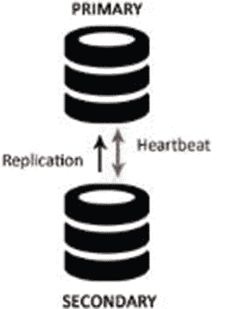

图 7-5。

Heartbeat message exchange

因此，心跳丢失的节点被认为是崩溃的。

##### 如果该节点是次节点

如果该节点是辅助节点，它将从副本集的成员中删除。在未来，当它恢复时，它可以重新加入。一旦它重新加入，它需要更新最新的变化。

If the down period is small, it connects to the primary and catches up with the latest updates.   However, if the down period is lengthy, the secondary server will need to resync with primary where it deletes all its data and does an initial sync as if it’s a new server.  

##### 如果该节点是主节点

如果该节点是主节点，在这种情况下，如果原始副本集的大多数成员能够相互连接，则这些节点将选出新的主节点，这符合副本集的自动故障转移能力。

选举过程将由无法到达主节点的任何节点发起。

新的主节点由大多数副本集节点选举产生。仲裁器可用于打破平局，例如当网络分区将参与节点分成两半并且大多数节点无法到达时。

优先级最高的节点将成为新的主节点。如果有一个以上的节点具有相同的优先级，数据新鲜度可用于打破平局。

主节点使用心跳来跟踪有多少节点对其可见。如果可见节点的数量低于多数，主节点会自动退回到辅助节点状态。当主服务器被网络分区分开时，这种情况会阻止主服务器运行。

#### 7.4.2.6 回滚

在主节点发生变化的情况下，新主节点上的数据被认为是系统中的最新数据。当以前的主节点重新加入时，对其应用的任何操作也将回滚。然后，它将与新的主服务器同步。

回滚操作将恢复所有未在副本集中复制的写操作。这样做是为了维护整个副本集的数据库一致性。

当连接到新的主节点时，所有节点都要经历一个重新同步过程，以确保完成回滚。这些节点检查新主服务器上没有的操作，然后查询新主服务器以返回受操作影响的文档的更新副本。节点处于重新同步过程中，称为正在恢复；在这一过程完成之前，他们没有资格参加初选。

这种情况很少发生，如果发生了，通常是由于复制滞后的网络分区，辅助节点无法跟上前一个主节点上的操作吞吐量。

需要注意的是，如果写操作在主节点降级之前复制到其他成员，并且这些成员对于副本集的大多数节点都是可访问的，则回滚不会发生。

回滚数据被写入数据库的 [`dbpath`](http://docs.mongodb.org/manual/reference/configuration-options/#dbpath%23dbpath) 目录下的文件，文件名如`<database>.<collection>.<timestamp>.bson`。

管理员可以决定忽略或应用回滚数据。只有当所有节点都与新的主节点同步并且已经回滚到一致状态时，才能开始应用回滚数据。

回滚文件的内容可以使用`Bsondump`读取，然后需要使用 mongorestore 手动应用到新的主服务器。

对于 MongoDB，没有自动处理回滚情况的方法。因此，需要手动干预来应用回滚数据。在应用回滚时，确保将这些复制到集合中的所有成员或至少部分成员是至关重要的，以便在发生任何故障转移时可以避免回滚。

#### 7.4.2.7 一致性

您已经看到，副本集成员通过读取操作日志不断在彼此之间复制数据。如何维护数据的一致性？在这一节中，您将看到 MongoDB 如何确保您总是访问一致的数据。

在 MongoDB 中，虽然读操作可以路由到辅助节点，但是写操作总是路由到主节点，消除了两个节点同时尝试更新同一数据集的情况。主节点上的数据集总是一致的。

如果读请求被路由到主节点，它将总是看到最新的更改，这意味着读操作总是与最后的写操作一致。

但是，如果应用已将读取首选项更改为从辅助节点读取，用户可能看不到最新的更改或以前的状态。这是因为写入在辅助节点上异步复制。

这种行为的特征是最终一致性，这意味着虽然辅助节点的状态与主节点的状态不一致，但随着时间的推移，它最终会变得一致。

没有任何方法可以保证从辅助节点的读取是一致的，除非发出写入问题，以确保在操作实际标记为成功之前，所有成员上的写入都成功。我们稍后将讨论写问题。

#### 7.4.2.8 可能的复制部署

您选择用来部署副本集的体系结构会影响其功能和容量。在这一节中，您将看到在决定架构时需要注意的一些策略。我们还将讨论部署架构。

Odd number of members: This should be done in order to ensure that there is no tie when electing a primary. If the number of nodes is even, then an arbiter can be used to ensure that the total nodes participating in election is odd, as shown in Figure [7-6](#Fig6).

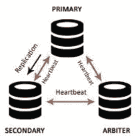

图 7-6。

Members replica set with primary, secondary, and arbiter   Replica set fault tolerance is the count of members, which can go down but still the replica set has enough members to elect a primary in case of any failure. Table [7-1](#Tab1) indicates the relationship between the member count in the replica set and its fault tolerance. Fault tolerance should be considered when deciding on the number of members.

表 7-1。

Replica Set Fault Tolerance

<colgroup><col> <col> <col></colgroup> 
| 成员人数 | 初选所需的多数票 | 容错 |
| --- | --- | --- |
| three | Two | one |
| four | three | one |
| five | three | Two |
| six | four | Two |

  If the application has specific dedicated requirements, such as for reporting or backups, then delayed or hidden members can be considered as part of the replica set, as shown in Figure [7-7](#Fig7).

图 7-7。

Members replica set with primary, secondary, and hidden members   If the application is read-heavy, the read can be distributed across secondaries. As the requirement increases, more nodes can be added to increase the data duplication; this can have a positive impact on the read throughput.   The members should be distributed geographically in order to cater to main data center failure. As shown in Figure [7-8](#Fig8), the members that are kept at a geographically different location other than the main data center can have priority set as 0, so that they cannot be elected as primary and can act as a standby only.

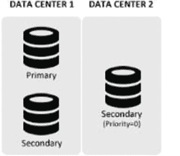

图 7-8。

Members replica set with primary, secondary, and a priority 0 member distributed across the data center   When replica set members are distributed across data centers, network partitioning can prevent data centers from communicating with each other. In order to ensure a majority in the case of network partitioning, it keeps a majority of the members in one location.  

#### 7.4.2.9 缩放读取

虽然辅助节点的主要目的是在主节点停机时确保数据可用性，但是辅助节点还有其他有效的使用案例。它们可以专门用于执行备份操作或数据处理作业，或者扩展读取。扩展读取的方法之一是对辅助节点发出读取查询；通过这样做，减少了主服务器上的工作量。

在使用辅助节点进行扩展读取操作时，需要考虑的一个要点是，在 MongoDB 中，复制是异步的，这意味着如果对主节点的数据执行任何写入或更新操作，辅助节点的数据将暂时过时。如果有问题的应用需要大量读取，并且是通过网络访问的，并且不需要最新数据，则可以使用辅助节点来横向扩展读取，以便提供良好的读取吞吐量。虽然默认情况下，读取请求被路由到主节点，但是可以通过指定读取首选项将请求分布到辅助节点。图 [7-9](#Fig9) 描述了默认的读取偏好。

图 7-9。

Default read preference

以下是理想的使用情形，通过这些情形，在辅助节点上路由读取可以帮助显著提高读取吞吐量，还可以帮助减少延迟:

Applications that are geographically distributed: In such cases, you can have a replica set that is distributed across geographies. The read preferences should be set to read from the nearest secondary node. This helps in reducing the latency that is caused when reading over network and this improves the read performance. See Figure [7-10](#Fig10).

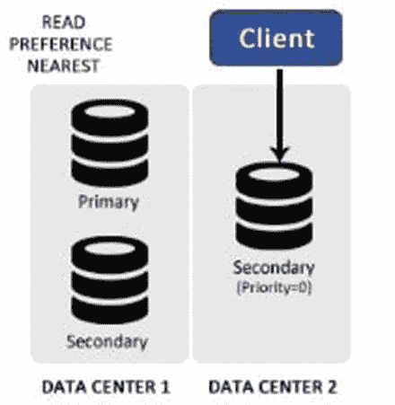

图 7-10。

Read Preference – Nearest   If the application always requires up-to-date data, it uses the option `primaryPreferred`, which in normal circumstances will always read from the primary node, but in case of emergency will route the read to secondaries. This is useful during failovers. See Figure [7-11](#Fig11).

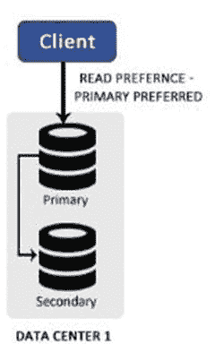

图 7-11。

Read Preference – primaryPreferred   If you have an application that supports two types of operations, the first operation is the main workload that involves reading and doing some processing on the data, whereas the second operation generates reports using the data. In such a scenario, you can have the reporting reads directed to the secondaries.  

MongoDB 支持以下读取首选模式:

*   主要:这是默认模式。所有读取请求都被路由到主节点。
*   primaryPreferred:在正常情况下，读取将从主节点进行，但是在紧急情况下，例如主节点不可用，读取将从辅助节点进行。
*   次要:从次要成员读取。
*   secondaryPreferred:从次要成员读取。如果辅助节点不可用，则从主节点读取。
*   nearest:从最近的副本集成员中读取。

除了扩展读取，使用辅助节点的第二个理想用例是卸载密集型处理、聚合和管理任务，以避免降低主节点的性能。可以在辅助节点上执行阻塞操作，而不会影响主节点的性能。

#### 7.4.2.10 应用编写问题

当客户机应用与 MongoDB 交互时，它通常不知道数据库是在独立部署上还是作为副本集部署。然而，当处理副本集时，客户机应该注意写问题和读问题。

由于副本集复制数据并将其存储在多个节点上，这两个问题为客户端应用提供了在执行读或写操作时跨节点实施数据一致性的灵活性。

使用写关注使应用能够从 MongoDB 获得成功或失败的响应。

当在 MongoDB 的副本集部署中使用时，写操作会从服务器向应用发送一个确认，表明主节点上的写操作已经成功。但是，可以对此进行配置，以便仅当写入操作被复制到维护数据的所有节点时，写入问题才返回成功。

在实际场景中，这是不可行的，因为它会降低写性能。理想情况下，客户端可以使用写操作来确保数据被复制到除主节点之外的另一个节点，这样即使主节点出现故障，数据也不会丢失。

写问题返回一个指示错误或无错误的对象。

`w`选项确保写入已被复制到指定数量的成员。可以指定一个数字或多数作为`w`选项的值。

如果指定了一个数字，则在返回成功之前，写操作会复制到该数量的节点。如果指定了多数，则在返回结果之前，写操作会复制到大多数成员。

图 [7-12](#Fig12) 显示了如何对 w: 2 进行写操作。

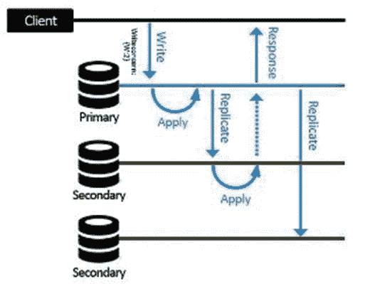

图 7-12。

writeConcern

如果在指定 number 时，数量大于实际保存数据的节点，该命令将继续等待，直到成员可用。为了避免这种不确定的等待时间，`wtimeout`也应该与`w`一起使用，这将确保它将等待指定的时间段，如果到那时写操作还没有成功，它将超时。

##### 写操作是如何发生的

为了确保所写的数据存在于至少两个成员上，发出以下命令:

`>db.testprod.insert({i:”test”, q: 50, t: “B”}, {writeConcern: {w:2}})`

为了理解如何执行这个命令，假设您有两个成员，一个名为 primary，另一个名为 secondary，它正在从主服务器同步数据。

但是，主映像如何知道辅助映像同步的时间点呢？因为辅助节点向主节点的操作日志查询要应用的操作结果，所以如果辅助节点请求在比如说 t 时间写入的操作，这向主节点暗示辅助节点已经复制了在 t 之前写入的所有操作

以下是写问题需要采取的步骤。

The write operation is directed to the primary.   The operation is written to the oplog of primary with `ts` depicting the time of operation.   A `w: 2` is issued, so the write operation needs to be written to one more server before it’s marked successful.   The secondary queries the primary’s oplog for the op, and it applies the op.   Next, the secondary sends a request to the primary requesting for ops with `ts` greater than t.   At this point, the primary sends an update that the operation until t has been applied by the secondary as it’s requesting for ops with `{ts: {$gt: t}}`.   The writeConcern finds that a write has occurred on both the primary and secondary, satisfying the `w: 2` criteria, and the command returns success.  

### 7.4.3 使用副本集实现高级集群

学习了副本集的体系结构和内部工作原理后，现在您将重点关注副本集的管理和使用。您将关注以下内容:

Setting up a replica set.   Removing a server.   Adding a server.   Adding an arbiter.   Inspecting the status.   Forcing a new election of a primary.   Using the web interface to inspect the status of the replica set.  

下面的例子假设一个名为`testset`的副本集，其配置如表 [7-2](#Tab2) 所示。

表 7-2。

Replica Set Configuration

<colgroup><col> <col> <col> <col></colgroup> 
| 成员 | 守护进程 | 主机:端口 | 数据文件路径 |
| --- | --- | --- | --- |
| 活动成员 1 | 蒙戈布 | [主机名]:27021 | C:\db1\active1\data |
| 活动成员 2 | 蒙戈布 | [主机名]:27022 | C:\db1\active2\data |
| 被动 _ 成员 _1 | 蒙戈布 | [主机名]:27023 | C:\db1\passive1\data |

使用以下命令可以找到上表中使用的主机名:

`C:\>hostname`

`ANOC9`

`C:\>`

在以下示例中,[hostname]需要替换为 hostname 命令在您的系统上返回的值。在我们的例子中，返回的值是 ANOC9，它在下面的例子中使用。

在以下实现中使用默认的(MMAPv1)存储引擎。

#### 7.4.3.1 设置副本集

为了设置并运行副本，您需要启动并运行所有活动成员。

第一步是启动第一个活动成员。打开终端窗口，创建`data`目录:

`C:\>mkdir C:\db1\active1\data`

`C:\>`

连接到 mongod:

`c:\practicalmongodb\bin>mongod --dbpath C:\db1\active1\data --port 27021 --replSet testset/ANOC9:27021 –rest`

`2015-07-13T23:48:40.543-0700 I CONTROL ** WARNING: --rest is specified without --httpinterface,`

`2015-07-13T23:48:40.543-0700 I CONTROL ** enabling http interface`

`2015-07-13T23:48:40.543-0700 I CONTROL Hotfix KB2731284 or later update is installed, no need to zero-out data files`

`2015-07-13T23:48:40.563-0700 I JOURNAL [initandlisten] journal dir=C:\db1\active1\data\journal`

`2015-07-13T23:48:40.564-0700 I JOURNAL [initandlisten] recover : no journal files present, no recovery needed`

`..................................... port=27021 dbpath=C:\db1\active1\data 64-bit host=ANOC9`

`2015-07-13T23:48:40.614-0700 I CONTROL [initandlisten] targetMinOS: Windows 7/Windows Server 2008 R2`

`2015-07-13T23:48:40.615-0700 I CONTROL [initandlisten] db version v3.0.4`

正如您所看到的，`–replSet`选项指定了实例正在加入的副本集的名称以及该副本集的另一个成员的名称，在上面的示例中是 Active_Member_2。

虽然您在上面的示例中只指定了一个成员，但是可以通过指定逗号分隔的地址来提供多个成员，如下所示:

`mongod –dbpath C:\db1\active1\data –port 27021 –replset testset/[hostname]:27022,[hostname]:27023 --rest`

在下一步中，您将启动并运行第二个活动成员。在新的终端窗口中为第二个活动成员创建`data`目录。

`C:\>mkdir C:\db1\active2\data`

`C:\>`

连接到 mongod:

`c:\ practicalmongodb \bin>mongod --dbpath C:\db1\active2\data --port 27022 –replSet testset/ANOC9:27021 –rest`

`2015-07-13T00:39:11.599-0700 I CONTROL ** WARNING: --rest is specified without --httpinterface,`

`2015-07-13T00:39:11.599-0700 I CONTROL ** enabling http interface`

`2015-07-13T00:39:11.604-0700 I CONTROL Hotfix KB2731284 or later update is installed, no need to zero-out data files`

`2015-07-13T00:39:11.615-0700 I JOURNAL [initandlisten] journal dir=C:\db1\active2\data\journal`

`2015-07-13T00:39:11.615-0700 I JOURNAL [initandlisten] recover : no journal files present, no recovery needed`

`2015-07-13T00:39:11.664-0700 I JOURNAL [durability] Durability thread started`

`2015-07-13T00:39:11.664-0700 I JOURNAL [journal writer] Journal writer thread started rs.initiate() in the shell -- if that is not already done`

最后，您需要启动被动成员。打开一个单独的窗口，为被动成员创建`data`目录。

`C:\>mkdir C:\db1\passive1\data`

`C:\>`

连接到 mongod:

`c:\ practicalmongodb \bin>mongod --dbpath C:\db1\passive1\data --port 27023 --replSet testset/ ANOC9:27021 –rest`

`2015-07-13T05:11:43.746-0700 I CONTROL Hotfix KB2731284 or later update is installed, no need to zero-out data files`

`2015-07-13T05:11:43.757-0700 I JOURNAL [initandlisten] journal dir=C:\db1\passive1\data\journal`

`2015-07-13T05:11:43.808-0700 I CONTROL [initandlisten] MongoDB starting : pid=620 port=27019 dbpath=C:\db1\passive1\data 64-bit host= ANOC9`

`......................................................................................`

`2015-07-13T05:11:43.812-0700 I CONTROL [initandlisten] options: { net: { http:`

`{ RESTInterfaceEnabled: true, enabled: true }, port: 27019 }, replication: { re`

`lSet: "testset/ ANOC9:27017" }, storage: { dbPath: "C:\db1\passive1\data" }`

在前面的示例中，`--rest`选项用于激活+1000 端口上的 REST 接口。激活 REST 使您能够使用 web 界面检查副本集状态。

在上述步骤结束时，您已经有了三台启动并运行的服务器，它们正在相互通信；然而，副本集仍未初始化。在下一步中，您将初始化副本集，并向每个成员说明他们的职责和角色。

为了初始化副本集，您需要连接到其中一台服务器。在本例中，它是第一台服务器，运行在端口 27021 上。

打开一个新的命令提示符，并连接到第一个服务器的 mongo 界面:

`C:\>cd c:\practicalmongodb\bin`

`c:\practicalmongodb\bin>mongo ANOC9 --port 27021`

`MongoDB shell version: 3.0.4`

`connecting to: ANOC9:27021/test`

`>`

接下来，切换到`admin`数据库。

`> use admin`

`switched to db admin`

`>`

接下来，建立一个配置数据结构，其中提到了服务器方面的角色:

`>cfg = {`

`... _id: 'testset',`

`... members: [`

`... {_id:0, host: 'ANOC9:27021'},`

`... {_id:1, host: 'ANOC9:27022'},`

`... {_id:2, host: 'ANOC9:27023', priority:0}`

`... ]`

`... }`

`{ "_id" : "testset",`

`"members" : [`

`{`

`"_id" : 0,`

`"host" : "ANOC9:27021"`

`},`

`..........`

`{`

`"_id" : 2,`

`"host" : "ANOC9:27023",`

`"priority" : 0`

`} ]}>`

在此步骤中，副本集结构被配置。

您在为被动成员定义角色时使用了 0 优先级。这意味着该成员不能提升为主成员。

下一个命令启动副本集:

`> rs.initiate(cfg)`

`{ "ok" : 1}`

现在让我们来查看副本集的状态，以便检查它的设置是否正确:

`testset:PRIMARY> rs.status()`

`{`

`"set" : "testset",`

`"date" : ISODate("2015-07-13T04:32:46.222Z")`

`"myState" : 1,`

`"members" : [`

`{`

`"_id" : 0,`

`...........................`

`testset:PRIMARY>`

输出表明一切正常。副本集现在已成功配置和初始化。

让我们看看如何确定主节点。为此，请连接到任何成员，发出以下命令并验证主服务器:

`testset:PRIMARY> db.isMaster()`

`{`

`"setName" : "testset",`

`"setVersion" : 1,`

`"ismaster" : true,`

`"primary" : " ANOC9:27021",`

`"me" : "ANOC9:27021",`

`...........................................`

`"localTime" : ISODate("2015-07-13T04:36:52.365Z"),`

`.........................................................`

`"ok" : 1`

`}testset:PRIMARY>`

#### 7.4.3.2 删除服务器

在本例中，您将从集合中移除第二个活动成员。让我们连接到次要成员 mongo 实例。打开一个新的命令提示符，如下所示:

`C:\>cd c:\practicalmongodb\bin`

`c:\practicalmongodb\bin>mongo ANOC9 --port 27022`

`MongoDB shell version: 3.0.4`

`connecting to: 127.0.0.1:27022/ANOC9`

`testset:SECONDARY>`

`Issue the following command to shut down the instance:`

`testset:SECONDARY> use admin`

`switched to db admin`

`testset:SECONDARY> db.shutdownServer()`

`2015-07-13T21:48:59.009-0700 I NETWORK DBClientCursor::init call() failed server should be down...`

接下来，您需要连接到主要成员 mongo 控制台，并执行以下操作来删除该成员:

`testset:PRIMARY> use admin`

`switched to db admin`

`testset:PRIMARY> rs.remove("ANOC9:27022")`

`{ "ok" : 1 }`

`testset:PRIMARY>`

为了检查成员是否被删除，您可以发出`rs.status()`命令。

#### 7.4.3.3 添加服务器

接下来，您将向副本集添加一个新的活动成员。与其他成员一样，首先打开一个新的命令提示符并创建`data`目录:

`C:\>mkdir C:\db1\active3\data`

`C:\>`

接下来，使用以下命令启动 mongod:

`c:\practicalmongodb\bin>mongod --dbpath C:\db1\active3\data --port 27024 --replSet testset/ANOC9:27021 --rest`

`..........`

您已经运行了新的 mongod，所以现在您需要将它添加到副本集中。为此，您需要连接到主服务器的 mongo 控制台:

`C:\>c:\practicalmongodb\bin\mongo.exe --port 27021`

`MongoDB shell version: 3.0.4`

`connecting to: 127.0.0.1:27021/test`

`testset:PRIMARY>`

接下来，您切换到`admin` db:

`testset:PRIMARY> use admin`

`switched to db admin`

`testset:PRIMARY>`

最后，需要发出以下命令来将新的 mongod 添加到副本集:

`testset:PRIMARY> rs.add("ANOC9:27024")`

`{ "ok" : 1 }`

可以使用`rs.status()`检查副本集状态，以检查是否添加了新的活动成员。

#### 7.4.3.4 向副本集添加仲裁器

在本例中，您将向集合中添加一个仲裁成员。与其他成员一样，首先为 MongoDB 实例创建`data`目录:

`C:\>mkdir c:\db1\arbiter\data`

`C:\>`

接下来使用以下命令启动 mongod:

`c:\practicalmongodb\bin>mongod --dbpath c:\db1\arbiter\data --port 30000 --replSet testset/ANOC9:27021 --rest`

`2015-07-13T22:05:10.205-0700 I CONTROL [initandlisten] MongoDB starting : pid=3700 port=30000 dbpath=c:\db1\arbiter\data 64-bit host=ANOC9`

`..........................................................`

连接到主服务器的 mongo 控制台，切换到`admin` db，将新创建的 mongod 作为仲裁器添加到副本集:

`C:\>c:\practicalmongodb\bin\mongo.exe --port 27021`

`MongoDB shell version: 3.0.4`

`connecting to: 127.0.0.1:27021/test`

`testset:PRIMARY> use admin`

`switched to db admin`

`testset:PRIMARY> rs.addArb("ANOC9:30000")`

`{ "ok" : 1 }`

`testset:PRIMARY>`

使用`rs.status().`可以验证该步骤是否成功

#### 7.4.3.5 使用 rs.status()检查状态

我们在上面的例子中一直引用`rs.status()`来检查副本集的状态。在本节中，您将了解这个命令是关于什么的。

它使您能够检查其控制台所连接的成员的状态，还使他们能够查看其在副本集中的角色。

从主节点的 mongo 控制台发出以下命令:

`testset:PRIMARY> rs.status()`

`{`

`"set" : "testset",`

`"date" : ISODate("2015-07-13T22:15:46.222Z")`

`"myState" : 1,`

`"members" : [`

`{`

`"_id" : 0,`

`...........................`

`"ok" : 1`

`testset:PRIMARY>`

myState 字段的值指示成员的状态，它可以具有表 [7-3](#Tab3) 中所示的值。

表 7-3。

Replica Set Status

<colgroup><col> <col></colgroup> 
| 我的状态 | 描述 |
| --- | --- |
| Zero | 第一阶段，启动 |
| one | 主要成员 |
| Two | 次要杆件 |
| three | 恢复状态 |
| four | 致命错误状态 |
| five | 第二阶段，启动 |
| six | 未知状态 |
| seven | 仲裁员成员 |
| eight | 停机或不可达 |
| nine | 当写操作在从主节点转换后由辅助节点回滚时，就会达到这种状态。 |
| Ten | 从副本集中删除成员时，成员将进入此状态。 |

因此，上面的命令将 myState 值返回为 1，这表明这是主要成员。

#### 7.4.3.6 强行举行新的选举

可以使用`rs.stepDown ()`命令强制当前的主服务器退出运行。这股力量开始了新的初选。

该命令在下列情况下很有用:

When you are simulating the impact of a primary failure, forcing the cluster to fail over. This lets you test how your application responds in such a scenario.   When the primary server needs to be offline. This is done for either a maintenance activity or for upgrading or to investigating the server.   When a diagnostic process need to be run against the data structures.  

以下是对 testset 副本集运行该命令时的输出:

`testset:PRIMARY> rs.stepDown()`

`2015-07-13T22:52:32.000-0700 I NETWORK DBClientCursor::init call() failed`

`2015-07-13T22:52:32.005-0700 E QUERY Error: error doing query: failed`

`2015-07-13T22:52:32.009-0700 I NETWORK trying reconnect to 127.0.0.1:27021 (127.0.0.1) failed`

`2015-07-13T22:52:32.011-0700 I NETWORK reconnect 127.0.0.1:27021 (127.0.0.1) ok testset:SECONDARY>`

执行命令后，提示符从 testset:PRIMARY 变为 testset:SECONDARY。

`rs.status()`可用于检查`stepDown ()`是否成功。

请注意，它返回的 myState 值现在是 2，这意味着“成员作为辅助成员运行。”

#### 7.4.3.7 使用 Web 界面检查副本集的状态

MongoDB 维护了一个基于 web 的控制台，用于查看系统状态。在您的示例中，可以通过 http://localhost:28021 访问控制台。

默认情况下，web 接口端口号被设置为 X+1000，其中 X 是 mongod 实例端口号。在本章的示例中，由于主实例位于 27021 上，因此 web 界面位于端口 28021 上。

图 [7-13](#Fig13) 显示了副本集状态的链接。点击链接会将你带到如图 [7-14](#Fig14) 所示的副本集仪表盘。

图 7-14。

Replica set status report

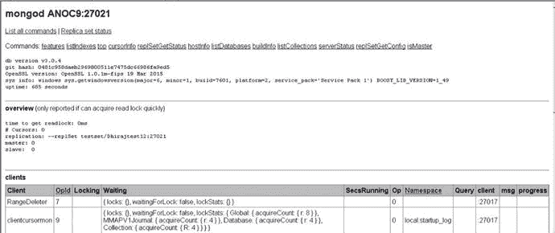

图 7-13。

Web interface

## 7.5 分片

在上一节中，您看到了如何使用 MongoDB 中的副本集来复制数据，以防止任何不利情况，并分布读取负载以提高读取效率。

MongoDB 大量使用内存进行低延迟数据库操作。当您比较从内存读取数据和从磁盘读取数据的速度时，从内存读取大约比从磁盘读取快 100，000 倍。

在 MongoDB 中，理想情况下工作集应该适合内存。工作集由最常访问的数据和索引组成。

当 MongoDB 访问内存中没有的数据时，就会发生页面错误。如果有可用的空闲内存，操作系统会直接将请求的页面加载到内存中；但是，在没有空闲内存的情况下，内存中的页面被写入磁盘，然后请求的页面被加载到内存中，从而减慢了该过程。很少有操作会意外地从内存中清除大部分工作集，从而对性能产生负面影响。一个例子是扫描数据库中所有文档的查询，其中文档的大小超过了服务器内存。这导致将文档加载到内存中，并将工作集移到磁盘上。

确保在项目的模式设计阶段已经为查询定义了适当的索引覆盖范围，可以最大限度地降低发生这种情况的风险。MongoDB explain 操作可用于提供有关查询计划和所用索引的信息。

MongoDB 的`serverStatus`命令返回一个 workingSet 文档，提供对实例工作集大小的估计。操作团队可以跟踪实例在给定时间段内访问了多少页面，以及工作集最早的文档和最新的文档之间经过的时间。跟踪所有这些指标，就有可能检测到工作集何时将达到当前的内存限制，因此可以采取主动措施，以确保系统的可伸缩性足以处理这种情况。

在 MongoDB 中，扩展是通过横向扩展数据(即在多个商用服务器上划分数据)来处理的，这也称为分片(横向扩展)。

分片通过在服务器之间水平划分数据集来解决扩展以支持大型数据集和高吞吐量的挑战，其中每个服务器负责处理其数据部分，没有一个服务器负担过重。这些服务器也称为碎片。

每个碎片都是一个独立的数据库。所有的碎片共同构成了一个逻辑数据库。

分片减少了每个分片处理的操作数。例如，当插入数据时，只需要访问负责存储这些记录的碎片。

随着集群的增长，每个分片需要处理的进程会减少，因为分片包含的数据子集会减少。这导致横向吞吐量和容量的增加。

假设您有一个 1TB 大小的数据库。如果碎片的数量是 4，每个碎片将处理大约 265GB 的数据，而如果碎片的数量增加到 40，每个碎片将只保存 25GB 的数据。

图 [7-15](#Fig15) 描绘了当分布在三个分片上时，一个分片的集合将如何出现。

图 7-15。

Sharded collection across three shards

虽然分片是一个引人注目的强大功能，但它有很高的基础设施要求，并且增加了整体部署的复杂性。因此，您需要了解您可能考虑使用分片的场景。

在下列情况下使用分片:

*   数据集的规模非常庞大，已经开始挑战单个系统的容量。
*   由于 MongoDB 使用内存来快速获取数据，因此当达到活动工作集限制时，向外扩展就变得很重要。
*   如果应用是写入密集型的，可以使用分片将写入分散到多个服务器上。

### 7.5.1 分片组件

接下来，您将看到 MongoDB 中支持分片的组件。在 MongoDB 中，分片是通过分片集群实现的。

以下是分片集群的组件:

*   陶瓷或玻璃碎片
*   芒果！芒果
*   配置服务器

碎片是存储实际数据的组件。对于分片集群，它包含一个数据子集，可以是 mongod 或副本集。所有 shard 的数据组合在一起形成了完整的分片集群数据集。

分片是基于每个集合启用的，因此可能存在未分片的集合。在每个分片集群中都有一个主分片，除了分片集合数据之外，所有非共享集合都放在这个主分片中。

部署分片集群时，默认情况下第一个分片会成为主分片，尽管它是可配置的。参见图 [7-16](#Fig16) 。

图 7-16。

Primary shard

配置服务器是保存分片集群元数据的特殊 mongods。该元数据描述了分片的系统状态和组织。

配置服务器存储单个分片集群的数据。配置服务器应该可用于集群的正常运行。

一个配置服务器可能导致集群的单点故障。对于生产部署，建议至少有三个配置服务器，这样即使一个配置服务器不可访问，集群也能继续运行。

配置服务器将数据存储在配置数据库中，这使得客户端请求能够路由到相应的数据。不应更新此数据库。

只有当为了平衡集群而改变了数据分布时，MongoDB 才会将数据写入配置服务器。

蒙哥人充当路由器。它们负责将读写请求从应用路由到碎片。

与 mongo 数据库交互的应用不需要担心数据是如何存储在碎片中的。对他们来说，这是透明的，因为他们只和蒙古人交流。mongos 依次将读写路由到碎片。

mongos 缓存来自配置服务器的元数据，这样对于每个读和写请求，它们不会使配置服务器负担过重。

但是，在下列情况下，数据是从配置服务器中读取的:

*   要么一个现有的 mongos 已经重新启动，要么一个新的 mongos 已经第一次启动。
*   语块迁移。我们将在后面详细解释组块迁移。

### 数据分发流程

接下来，您将看到在启用了分片的集合中，数据是如何分布在各个分片中的。在 MongoDB 中，数据在集合级别被分片或分布。集合由 shard 键进行分区。

#### 7.5.2.1 碎片钥匙

存在于集合的所有文档中的任何索引单/复合字段都可以是一个分片键。您指定这是集合的文档需要分发的字段基础。在内部，MongoDB 根据字段的值将文档划分成块，并将它们分布在各个碎片上。

MongoDB 支持数据分发的方式有两种:基于范围的分区和基于散列的分区。

##### 基于范围的划分

在基于范围的分区中，shard 键值被划分为多个范围。假设您考虑将一个`timestamp`字段作为分片键。在这种划分方式中，这些值被认为是从最小值到最大值的一条直线，其中最小值是起始周期(比如 1970 年 1 月 1 日)，最大值是结束周期(比如 9999 年 12 月 31 日)。集合中的每个文档都只有这个范围内的时间戳值，并且它代表行中的某个点。

根据可用碎片的数量，该行将被划分为多个范围，文档将基于这些范围进行分发。

在这种划分方案中，如图 [7-17](#Fig17) 所示，分片键值在附近的文档很可能落在同一个分片上。这可以显著提高范围查询的性能。

图 7-17。

Range-based partitioning

然而，缺点是它可能导致数据分布不均匀，使其中一个碎片过载，这可能最终接收到大多数请求，而其他碎片仍然负载不足，因此系统将无法正常伸缩。

##### 基于散列的分区

在基于散列的分区中，数据是根据 shard 字段的散列值分布的。如果选中，与基于范围的分区相比，这将导致更随机的分布。

带有 close shard 键的文档不太可能是同一个块的一部分。例如，对于基于`_id`字段的散列的范围，将会有一条散列值的直线，这将再次基于碎片的数量进行划分。基于散列值，文档将位于任一碎片中。参见图 [7-18](#Fig18) 。

图 7-18。

Hash-based partitioning

与基于范围的分区相比，这可以确保数据均匀分布，但这是以高效的范围查询为代价的。

##### 大块

数据以块的形式在碎片之间移动。碎片键范围被进一步划分为子范围，这些子范围也被称为块。参见图 [7-19](#Fig19) 。

图 7-19。

Chunks

对于分片集群，64MB 是默认的块大小。在大多数情况下，这是块分割和迁移的合适大小。

让我们用一个例子来讨论分片和组块的执行。假设你有一个博客文章集合，它被分割在字段`date`中。这意味着集合将根据`date`字段值进行拆分。让我们进一步假设你有三个碎片。在这种情况下，数据可能分布在各个分片上，如下所示:

*   碎片#1:时间开始到 2009 年 7 月
*   碎片# 2:2009 年 8 月至 2009 年 12 月
*   碎片# 3:2010 年 1 月到时间的尽头

为了检索从 2010 年 1 月 1 日到今天的文档，查询被发送到 mongos。

在这种情况下，

The client queries mongos.   The mongos know which shards have the data, so mongos sends the queries to Shard #3.   Shard #3 executes the query and returns the results to mongos.   Mongos combines the data received from various shards, which in this case is Shard #3 only, and returns the final result back to the client.  

应用不需要知道分片。它可以像询问普通的蒙哥一样询问蒙哥。

让我们考虑另一个场景，您插入一个新文档。新文档有今天的日期。事件的顺序如下:

The document is sent to the mongos.   Mongos checks the date and on basis of that, sends the document to Shard #3.   Shard #3 inserts the document.  

从客户端的角度来看，这同样与单个服务器设置相同。

##### 以上场景中 ConfigServers 的角色

考虑一个场景，您开始收到日期为 2009 年 9 月的数百万个文档的插入请求。在这种情况下，碎片#2 开始过载。

一旦配置服务器意识到碎片#2 变得太大，它就会介入。它将分割碎片上的数据，并开始将其迁移到其他碎片。迁移完成后，它将更新后的状态发送给 mongos。所以现在碎片#2 有从 2009 年 8 月到 2009 年 9 月 18 日的数据，碎片#3 包含从 2009 年 9 月 19 日到时间结束的数据。

当一个新的碎片被添加到集群中时，配置服务器的责任就是找出如何处理它。数据可能需要立即迁移到新的分片，或者新的分片可能需要保留一段时间。总之，配置服务器是大脑。无论何时移动任何数据，配置服务器都会让 mongos 知道最终的配置，以便 mongos 可以继续进行适当的路由。

### 数据平衡过程

接下来，您将看到集群是如何保持平衡的(例如，MongoDB 如何确保所有的碎片都被同等地加载)。

添加新数据或修改现有数据，或者添加或删除服务器，都可能导致数据分布的不平衡，这意味着要么一个碎片的区块数过多，而其他碎片的区块数较少，要么导致区块大小增加，远远大于其他区块。

MongoDB 确保与以下后台进程的平衡:

*   组块分割
*   平衡器

#### 7.5.3.1 语块分裂

块分割是确保块具有指定大小的过程之一。如您所见，选择了一个分片键，它用于标识文档将如何跨分片分布。文档被进一步分组为 64MB 的块(默认，可配置)，并根据其托管的范围存储在碎片中。

如果块的大小由于插入或更新操作而改变，并且超过了默认的块大小，那么 mongos 会将块分成两个更小的块。参见图 [7-20](#Fig20)

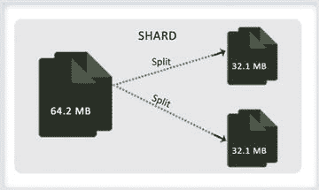

图 7-20。

Chunk splitting

该过程将块保持在指定大小或小于指定大小的碎片内(即，它确保块具有配置的大小)。

插入和更新操作触发拆分。当元数据被修改时，分割操作导致配置服务器中的数据被修改。尽管分割不会导致数据迁移，但此操作会导致集群不平衡，一个碎片比另一个碎片有更多的区块。

#### 7.5.3.2 平衡器

平衡器是一个后台进程，用于确保所有碎片的负载相等或处于平衡状态。该过程管理区块迁移。

组块的分裂会导致不平衡。添加或删除文档也会导致集群不平衡。在集群不平衡的情况下，使用平衡器，平衡器是平均分配数据的过程。

当一个碎片的块比其他碎片多的时候，MongoDB 会自动在这些碎片之间进行块平衡。这个过程对应用和您都是透明的。

集群中的任何 mongos 都可以启动平衡器进程。他们通过获取配置服务器的配置数据库上的锁来做到这一点，因为平衡器涉及到从一个碎片到另一个碎片的块迁移，这可能导致元数据的改变，这将导致配置服务器数据库的改变。平衡器进程会对数据库性能产生巨大影响，因此它可以

Be configured to start the migration only when the migration threshold has reached. The migration threshold is the difference in the number of maximum and minimum chunks on the shards. Threshold is shown in Table [7-4](#Tab4).

表 7-4。

Migration Threshold

<colgroup><col> <col></colgroup> 
| 组块数量 | 迁移阈值 |
| --- | --- |
| < 20 | Two |
| 21-80 | four |
| >80 | eight |

  Or it can be scheduled to run in a time period that will not impact the production traffic.  

平衡器一次迁移一个块(参见图 [7-21](#Fig21) )并遵循以下步骤:

图 7-21。

Chunk migration The `moveChunk` command is sent to the source shard.   An internal `moveChunk` command is started on the source where it creates the copy of the documents within the chunk and queues it. In the meantime, any operations for that chunk are routed to the source by the mongos because the config database is not yet changed and the source will be responsible for serving any read/write request on that chunk.   The destination shard starts receiving the copy of the data from the source.   Once all of the documents in the chunks have been received by the destination shard, the synchronization process is initiated to ensure that all changes that have happened to the data while migration are updated at the destination shard.   Once the synchronization is completed, the next step is to update the metadata with the chunk’s new location in the config database. This activity is done by the destination shard that connects to the config database and carries out the necessary updates.   Post successful completion of all the above, the document copy that is maintained at the source shard is deleted.  

如果同时平衡器需要从源碎片进行额外的块迁移，它可以开始新的迁移，甚至不需要等待当前迁移的删除步骤完成。

如果在迁移过程中出现任何错误，平衡器会中止迁移过程，将块留在原始碎片上。成功完成该过程后，MongoDB 会从原始碎片中删除块数据。

添加或删除碎片也会导致集群不平衡。当添加一个新的碎片时，立即开始向该碎片的数据迁移。但是，集群达到平衡需要时间。

当一个碎片被移除时，平衡器确保数据被迁移到其他碎片，并且元数据信息被更新。两个活动完成后，碎片被安全地移除。

### 操作

接下来，您将了解如何在分片集群上执行读写操作。如上所述，配置服务器维护集群元数据。这些数据存储在配置数据库中。mongos 使用配置数据库的这些数据为应用的读写请求提供服务。

数据由 mongos 实例缓存，然后用于将读写操作路由到碎片。这样，配置服务器就不会过载。

mongos 只会在以下情况下从配置服务器中读取数据:

*   蒙古人第一次开始
*   现有的 mongos 已重新启动或
*   在块迁移之后，当 mongos 需要用新的集群元数据更新其缓存的元数据时。

无论何时发出任何操作，mongos 需要做的第一步是识别将服务于请求的碎片。由于分片键用于在分片集群中分发数据，如果操作使用分片键字段，那么基于该字段，可以将特定的分片作为目标。

如果碎片键是`employeeid`，可能会发生以下情况:

If the `find` query contains the `employeeid` field, then to satiate the query, only specific shards will be targeted by the mongos.   If a single update operation uses `employeeid` for updating the document, the request will be routed to the shard holding that employee data.  

但是，如果操作没有使用碎片键，那么请求将被广播到所有碎片。通常，多次更新或删除操作是针对整个群集的。

在查询数据时，除了识别碎片并从中获取数据之外，mongos 可能还需要处理从各种碎片返回的数据，然后再将最终输出发送给客户机。

假设一个应用用`sort()`发出了一个`find()`请求。在这种情况下，蒙哥将把`$orderby`选项传递给碎片。碎片将从它们的数据集中获取数据，并以有序的方式发送结果。一旦 mongos 拥有了所有 shard 的排序数据，它将对整个数据执行增量合并排序，然后将最终输出返回给客户机。

与 sort 类似的还有`limit()`、`skip(),`等聚合函数。，它要求 mongos 在接收来自碎片的数据之后，在将最终结果集返回给客户机之前执行操作。

mongos 消耗最少的系统资源，并且没有持久状态。因此，如果应用需求是一个简单的`find ()`查询，可以由碎片单独满足，并且不需要在 mongos 级别进行操作，那么您可以在运行应用服务器的同一系统上运行 mongos。

### 实施分片

在本节中，您将学习在 Windows 平台上的一台机器上配置分片。

您将通过仅使用两个碎片来保持示例的简单性。在此配置中，您将使用表 7-5 中列出的服务。

表 7-5。

Sharding Cluster Configuration

<colgroup><col> <col> <col> <col></colgroup> 
| 成分 | 类型 | 港口 | 数据文件路径 |
| --- | --- | --- | --- |
| 碎片控制器 | 莽哥 | Twenty-seven thousand and twenty-one | - |
| 配置服务器 | 蒙戈布 | Twenty-seven thousand and twenty-two | C:\db1\config\data |
| 沙尔多 | 蒙戈布 | Twenty-seven thousand and twenty-three | C:\db1\shard1\data |
| Shard1 | 蒙戈布 | Twenty-seven thousand and twenty-four | C:\db1\shard2\data |

您将关注以下内容:

Setting up a sharded cluster.   Creating a database and collection, and enable sharding on the collection.   Using the import command to load data in the sharded collection.   Distributed data amongst the shards.   Adding and removing shards from the cluster and checking how data is distributed automatically.  

#### 7.5.5.1 设置碎片集群

为了设置集群，第一步是设置配置服务器。在新的终端窗口中输入以下代码，为配置服务器创建`data`目录，并启动 mongod:

`C:\> mkdir C:\db1\config\data`

`C:\>CD C:\practicalmongodb\bin`

`C:\ practicalmongodb\bin>mongod --port 27022 --dbpath C:\db1\config\data --configsvr`

`2015-07-13T23:02:41.982-0700 I JOURNAL [journal writer] Journal writer thread started`

`2015-07-13T23:02:41.984-0700 I CONTROL [initandlisten] MongoDB starting : pid=3084 port=27022 dbpath=C:\db1\config\data master=1 64-bit host=ANOC9`

`......................................`

`2015-07-13T23:02:42.066-0700 I REPL [initandlisten] ******`

`2015-07-13T03:02:42.067-0700 I NETWORK [initandlisten] waiting for connections on port 27022`

接下来，开始蒙哥。在新的终端窗口中键入以下内容:

`C:\>cd c:\practicalmongodb\bin`

`c:\practicalmongodb\bin>mongos --configdb localhost:27022 --port 27021 --chunkSize 1`

`2015-07-13T23:06:07.246-0700 W SHARDING running with 1 config server should be done only for testing purposes and is not recommended for production`

`...............................................................`

`2015-07-13T23:09:07.464-0700 I SHARDING [Balancer] distributed lock 'balancer/ ANOC9:27021:1429783567:41' unlocked`

你现在有了碎片控制器(即 mongos)并开始运行。

如果您切换到启动配置服务器的窗口，您会发现 shard 服务器注册到了配置服务器。

在本例中，您使用了 1MB 的块大小。请注意，这在现实生活中并不理想，因为大小小于 4MB(文档的最大大小)。但是，这只是出于演示目的，因为这将创建必要数量的块，而不会加载大量数据。除非另外指定，否则默认情况下 chunkSize 为 128MB。

接下来，打开分片服务器 Shard0 和 Shard1。

打开一个新的终端窗口。为第一个碎片创建`data`目录并启动 mongod:

`C:\>mkdir C:\db1\shard0\data`

`C:\>cd c:\practicalmongodb\bin`

`c:\practicalmongodb\bin>mongod --port 27023 --dbpath c:\db1\shard0\data –shardsvr`

`2015-07-13T23:14:58.076-0700 I CONTROL [initandlisten] MongoDB starting : pid=1996 port=27023 dbpath=c:\db1\shard0\data 64-bit host=ANOC9`

`.................................................................`

`2015-07-13T23:14:58.158-0700 I NETWORK [initandlisten] waiting for connections on port 27023`

打开新的终端窗口。为第二个碎片创建`data`目录并启动 mongod:

`C:\>mkdir c:\db1\shard1\data`

`C:\>cd c:\practicalmongodb\bin`

`c:\practicalmongodb\bin>mongod --port 27024 --dbpath C:\db1\shard1\data --shardsvr`

`2015-07-13T23:17:01.704-0700 I CONTROL [initandlisten] MongoDB starting : pid=3672 port=27024 dbpath=C:\db1\shard1\data 64-bit host=ANOC9`

`2015-07-13T23:17:01.704-0700 I NETWORK [initandlisten] waiting for connections on port 27024`

在上述步骤结束时，与设置相关的所有服务器都已启动并运行。下一步是将碎片信息添加到碎片控制器。

mongos 对应用来说是一个完整的 MongoDB 实例，尽管实际上并不是一个完整的实例。mongo shell 可以用来连接到 mongo 来执行任何操作。

打开 mongos mongo 控制台:

`C:\>cd c:\practicalmongodb\bin`

`c:\ practicalmongodb\bin>mongo localhost:27021`

`MongoDB shell version: 3.0.4`

`connecting to: localhost:27021/test`

`mongos>`

切换到`admin`数据库:

`mongos> use admin`

`switched to db admin`

`mongos>`

通过运行以下命令添加碎片信息:

`mongos> db.runCommand({addshard:"localhost:27023",allowLocal:true})`

`{ "shardAdded" : "shard0000", "ok" : 1 }`

`mongos> db.runCommand({addshard:"localhost:27024",allowLocal:true})`

`{ "shardAdded" : "shard0001", "ok" : 1 }`

`mongos>`

这将激活两个 shard 服务器。

下一个命令检查碎片:

`mongos> db.runCommand({listshards:1})`

`{`

`"shards" : [`

`{`

`"_id" : "shard0000",`

`"host" : "localhost:27023"`

`}, {`

`"_id" : "shard0001",`

`"host" : "localhost:27024"`

`}`

`], "ok" : 1}`

#### 7.5.5.2 创建数据库和碎片收集

为了继续这个例子，您将创建一个名为`testdb`的数据库和一个名为`testcollection`的集合，您将在键`testkey`上对其进行分片。

连接到 mongos 控制台，发出以下命令来获取数据库:

`mongos> testdb=db.getSisterDB("testdb")`

`testdb`

接下来，在数据库级别为`testdb`启用分片:

`mongos> db.runCommand({enableSharding system: "testdb"})`

`{ "ok" : 1 }`

`mongos>`

接下来，指定需要分片的集合以及将对集合进行分片的键:

`mongos> db.runCommand({shardcollection: "testdb.testcollection", key: {testkey:1}})`

`{ "collectionsharded" : "testdb.testcollection", "ok" : 1 }`

`mongos>`

完成上述步骤后，您现在就有了一个分片集群，所有组件都已启动并运行。您还创建了一个数据库，并对集合启用了分片。

接下来，将数据导入到集合中，以便可以检查碎片上的数据分布。

您将使用 import 命令在`testcollection`中加载数据。连接到新的终端窗口，并执行以下操作:

`C:\>cd C:\practicalmongodb\bin`

`C:\practicalmongodb\bin>mongoimport --host ANOC9 --port 27021 --db testdb --collection testcollection --type csv --file c:\mongoimport.csv –-headerline`

`2015-07-13T23:17:39.101-0700 connected to: ANOC9:27021`

`2015-07-13T23:17:42.298-0700 [##############..........] testdb.testcollection 1.1 MB/1.9 MB (59.6%)`

`2015-07-13T23:17:44.781-0700 imported 100000 documents`

`mongoimport.csv`由两个字段组成。第一个是`testkey`，这是一个随机产生的数字。第二个字段是文本字段；它用于确保文档占据足够数量的块，使得使用分片机制变得可行。

这将在集合中插入 100，000 个对象。

为了检查记录是否被插入，连接到 mongos 的 mongo 控制台并发出以下命令:

`C:\Windows\system32>cd c:\practicalmongodb\bin`

`c:\practicalmongodb\bin>mongo localhost:27021`

`MongoDB shell version: 3.0.4`

`connecting to: localhost:27021/test`

`mongos> use testdb`

`switched to db testdb`

`mongos> db.testcollection.count()`

`100000`

`mongos>`

接下来，连接到两个 shard(shard 0 和 Shard1)的控制台，查看数据是如何分布的。打开一个新的终端窗口并连接到 Shard0 的控制台:

`C:\>cd C:\practicalmongodb\bin`

`C:\ practicalmongodb\bin>mongo localhost:27023`

`MongoDB shell version: 3.0.4`

`connecting to: localhost:27023/test`

切换到`testdb`，发出`count()`命令，检查分片上的文件数量:

`> use testdb`

`switched to db testdb`

`> db.testcollection.count()`

`57998`

接下来，打开一个新的终端窗口，连接到 Shard1 的控制台，按照上述步骤操作(即切换到`testdb`并检查`testcollection`集合的计数):

`C:\>cd c:\practicalmongodb\bin`

`c:\practicalmongodb\bin>mongo localhost:27024`

`MongoDB shell version: 3.0.4`

`connecting to: localhost:27024/test`

`> use testdb`

`switched to db testdb`

`> db.testcollection.count()`

`42002`

`>`

当您运行上面的命令一段时间后，您可能会看到每个碎片中文档的编号有所不同。当加载文档时，mongos 将所有的块放在一个分片上。随着时间的推移，碎片集通过在所有碎片之间平均分配块而重新平衡。

#### 7.5.5.3 增加了一个新碎片

您已经设置了一个分片集群，还对一个集合进行了分片，并查看了数据在分片之间的分布情况。接下来，您将向集群添加一个新的碎片，以便负载分布得更广一些。

您将重复上述步骤。首先，在新的终端窗口中为新碎片创建一个数据目录:

`c:\>mkdir c:\db1\shard2\data`

接下来，在端口 27025 启动 mongod:

`c:\>cd c:\practicalmongodb\bin`

`c:\ practicalmongodb\bin>mongod --port 27025 --dbpath C:\db1\shard2\data --shardsvr`

`2015-07-13T23:25:49.103-0700 I CONTROL [initandlisten] MongoDB starting : pid=3744 port=27025 dbpath=C:\db1\shard2\data 64-bit host=ANOC9`

`................................`

`2015-07-13T23:25:49.183-0700 I NETWORK [initandlisten] waiting for connections on port 27025`

接下来，新的 shard 服务器将被添加到 shard 集群中。为了配置它，在一个新的终端窗口中打开 mongos mongo 控制台:

`C:\>cd c:\practicalmongodb\bin`

`c:\practicalmongodb\bin>mongo localhost:27021`

`MongoDB shell version: 3.0.4`

`connecting to: localhost:27021/test`

`mongos>`

切换到`admin`数据库并运行`addshard`命令。该命令将分片服务器添加到分片集群中。

`mongos> use admin`

`switched to db admin`

`mongos> db.runCommand({addshard: "localhost:27025", allowlocal: true})`

`{ "shardAdded" : "shard0002", "ok" : 1 }`

`mongos>`

为了检查添加是否成功，运行`listshards`命令:

`mongos> db.runCommand({listshards:1})`

`{`

`"shards" : [`

`{`

`"_id" : "shard0000",`

`"host" : "localhost:27023"`

`},`

`{`

`"_id" : "shard0001",`

`"host" : "localhost:27024"`

`},`

`{`

`"_id" : "shard0002",`

`"host" : "localhost:27025"`

`}`

`],`

`"ok" : 1`

`}`

接下来，检查`testcollection`数据是如何分布的。在新的终端窗口中连接到新碎片的控制台:

`C:\>cd c:\practicalmongodb\bin`

`c:\practicalmongodb\bin>mongo localhost:27025`

`MongoDB shell version: 3.0.4`

`connecting to: localhost:27025/test`

切换到`testdb`并检查碎片上列出的收藏:

`> use testdb`

`switched to db testdb`

`> show collections`

`system.indexes`

`testcollection`

发出三次`testcollection.count`命令:

`> db.testcollection.count()`

`6928`

`> db.testcollection.count()`

`12928`

`> db.testcollection.count()`

`16928`

有趣的是，收藏品的数量正在慢慢增加。蒙古人正在重新平衡星团。

随着时间的推移，数据块将从分片服务器 Shard0 和 Shard1 迁移到新添加的分片服务器 Shard2，这样数据就可以均匀地分布在所有服务器上。完成此过程后，配置服务器元数据将被更新。这是一个自动的过程，即使 testcollection 中没有新的数据添加，它也会发生。这是决定块大小时需要考虑的重要因素之一。

如果`chunkSize`的值非常大，那么数据分布将会不均匀。`chunkSize`越小，数据分布越均匀。

#### 7.5.5.4 取出一块碎片

在下面的例子中，您将看到如何删除一个 shard 服务器。对于本例，您将删除在上例中添加的服务器。

为了启动这个过程，您需要登录到 mongos 控制台，切换到`admin` db，并执行以下命令从 shard 集群中删除 shard:

`C:\>cd c:\practicalmongodb\bin`

`c:\practicalmongodb\bin>mongo localhost:27021`

`MongoDB shell version: 3.0.4`

`connecting to: localhost:27021/test`

`mongos> use admin`

`switched to db admin`

`mongos> db.runCommand({removeShard: "localhost:27025"})`

`{`

`"msg" : "draining started successfully",`

`"state" : "started",`

`"shard" : "shard0002",`

`"ok" : 1`

`}`

`mongos>`

如您所见，`removeShard`命令返回了一条消息。其中一个消息字段是`state`，它指示进程状态。该消息还指出排空过程已经开始。这由字段`msg`指示。

您可以重新发出`removeShard`命令来检查进度:

`mongos> db.runCommand({removeShard: "localhost:27025"})`

`{`

`"msg" : "draining ongoing",`

`"state" : "ongoing",`

`"remaining" : {`

`"chunks" : NumberLong(2),`

`"dbs" : NumberLong(0)`

`},`

`"ok" : 1`

`}`

`mongos>`

响应告诉您仍然需要从服务器中排出的块和数据库的数量。如果您重新发出该命令，并且该进程终止，则该命令的输出将显示相同的内容。

`mongos> db.runCommand({removeShard: "localhost:27025"})`

`{`

`"msg" : "removeshard completed successfully",`

`"state" : "completed",`

`"shard" : "shard0002",`

`"ok" : 1`

`}`

`mongos>`

你可以用`listshards`来检验`removeShard`是否成功。

正如您所看到的，数据成功地迁移到了其他 Shard，因此您可以删除存储文件并终止 Shard2 mongod 进程。

这种在不离线的情况下修改 shard 集群的能力是 MongoDB 的关键组件之一，这使它能够支持高可用性、高可伸缩性、大容量的数据存储。

#### 7.5.5.5 列出了分片集群的状态

`printShardingStatus()`命令提供了很多关于分片系统内部的信息。

`mongos> db.printShardingStatus()`

`--- Sharding Status ---`

`sharding version: {`

`"_id" : 1,`

`"version" : 3,`

`"minCompatibleVersion" : 5,`

`"currentVersion" : 6,`

`"clusterId" : ObjectId("52fb7a8647e47c5884749a1a")`

`}`

`shards:`

`{ "_id" : "shard0000", "host" : "localhost:27023" }`

`{ "_id" : "shard0001", "host" : "localhost:27024" }`

`balancer:`

`Currently enabled: yes`

`Currently running: no`

`Failed balancer rounds in last 5 attempts: 0`

`Migration Results for the last 24 hours:`

`17 : Success`

`databases:`

`{ "_id" : "admin", "partitioned" : false, "primary" : "config" }`

`{ "_id" : "testdb", "partitioned" : true, "primary" : "shard0000" }`

`...............`

输出列出了以下内容:

*   碎片集群的所有碎片服务器
*   每个分片数据库/集合的配置
*   共享数据集的所有块

可以从上面的命令中获得的重要信息是分片键范围，它与每个块相关联。这也显示了特定的块存储在哪里(在哪个 shard 服务器上)。输出可以用来分析 shard 服务器的密钥和块分布。

### 7.5.6 控制集合分发(基于标签的分片)

在上一节中，您看到了数据分布是如何发生的。在本节中，您将了解基于标记的分片。这个特性是在版本 2.2.0 中引入的。

标签使运营商能够控制哪些集合将被分配到哪个碎片。

为了理解基于标签的分片，让我们建立一个分片集群。您将使用上面创建的 shard 集群。对于本例，您需要三个 Shard，因此您将再次向集群添加 Shard2。

#### 7.5.6.1 先决条件

您将首先启动集群。再次重申，请遵循以下步骤。

Start the config server. Enter the following command in a new terminal window (if it’s not already running): `C:\> mkdir C:\db1\config\data` `C:\>cd c:\practicalmongodb\bin` `C:\practicalmongodb\bin>mongod --port 27022 --dbpath C:\db\config\data --configsvr`   Start the mongos. Enter the following command in a new terminal window (if it’s not already running): `C:\>cd c:\practicalmongodb\bin` `c:\practicalmongodb\bin>mongos --configdb localhost:27022 --port 27021`   You will start the shard servers next.  

开始分享。在新的终端窗口中输入以下命令(如果它尚未运行):

`C:\>cd c:\practicalmongodb\bin`

`c:\practicalmongodb\bin>mongod --port 27023 --dbpath c:\db1\shard0\data --shardsvr`

开始 Shard1。在新的终端窗口中输入以下命令(如果它尚未运行):

`C:\>cd c:\practicalmongodb\bin`

`C:\practicalmongodb\bin>mongod --port 27024 --dbpath c:\db1\shard1\data –shardsvr`

开始 Shard2。在新的终端窗口中输入以下命令(如果它尚未运行):

`C:\>cd c:\practicalmongodb\bin`

`c:\practicalmongodb\bin>mongod --port 27025 --dbpath c:\db1\shard2\data –shardsvr`

由于在前面的示例中已经从分片集群中删除了 Shard2，因此必须将 Shard2 添加到分片集群中，因为在本示例中需要三个分片。

为此，您需要连接到 mongos。输入以下命令:

`C:\Windows\system32>cd c:\practicalmongodb\bin`

`c:\practicalmongodb\bin>mongo localhost:27021`

`MongoDB shell version: 3.0.` `4`

`connecting to: localhost:27021/test`

`mongos>`

在将碎片添加到集群之前，您需要删除`testdb`数据库:

`mongos> use testdb`

`switched to db testdb`

`mongos> db.dropDatabase()`

`{ "dropped" : "testdb", "ok" : 1 }`

`mongos>`

接下来，使用以下步骤添加 Shard2 碎片:

`mongos> use admin`

`switched to db admin`

`mongos> db.runCommand({addshard: "localhost:27025", allowlocal: true})`

`{ "shardAdded" : "shard0002", "ok" : 1 }`

`mongos>`

如果您尝试在不删除`testdb`数据库的情况下添加已删除的碎片，将会出现以下错误:

`mongos>db.runCommand({addshard: "localhost:27025", allowlocal: true})`

`{`

`"ok" : 0,`

`"errmsg" : "can't add shard localhost:27025 because a local database 'testdb' exists in another shard0000:localhost:27023"}`

为了确保所有三个碎片都出现在集群中，请运行以下命令:

`mongos> db.runCommand({listshards:1})`

`{`

`"shards" : [`

`{`

`"_id" : "shard0000",`

`"host" : "localhost:27023"`

`}, {`

`"_id" : "shard0001",`

`"host" : "localhost:27024"`

`}, {`

`"_id" : "shard0002",`

`"host" : "localhost:27025"`

`}`

`], "ok" : 1}`

#### 7.5.6.2 标签

在上述步骤结束时，您已经拥有了带有一个配置服务器、三个分片和一个运行中的 mongos 的分片集群。接下来，在新的终端窗口中连接到 mongos 的 30999 端口和 configdb 的 27022 端口:

`C:\ >cd c:\practicalmongodb\bin`

`c:\ practicalmongodb\bin>mongos --port 30999 --configdb localhost:27022`

`2015-07-13T23:24:39.674-0700 W SHARDING running with 1 config server should be done only for testing purposes and is not recommended for production`

`...................................`

`2015-07-13T23:24:39.931-0700 I SHARDING [Balancer] distributed lock 'balancer /ANOC9:30999: 1429851279:41' unlocked..`

接下来，启动一个新的终端窗口，连接到 mongos，并在集合上启用分片:

`C:\ >cd c:\practicalmongodb\bin`

`c:\practicalmongodb\bin>mongo localhost:27021`

`MongoDB shell version: 3.0.4`

`connecting to: localhost:27021/test`

`mongos> show dbs`

`admin (empty)`

`config 0.016GB`

`testdb 0.078GB`

`mongos> conn=new Mongo("localhost:30999")`

`connection to localhost:30999`

`mongos> db=conn.getDB("movies")`

`movies`

`mongos> sh.enableSharding("movies")`

`{ "ok" : 1 }`

`mongos> sh.shardCollection("movies.drama", {originality:1})`

`{ "collectionsharded" : "movies.hindi", "ok" : 1 }`

`mongos> sh.shardCollection("movies.action", {distribution:1})`

`{ "collectionsharded" : "movies.action", "ok" : 1 }`

`mongos> sh.shardCollection("movies.comedy", {collections:1})`

`{ "collectionsharded" : "movies.comedy", "ok" : 1 }`

`mongos>`

步骤如下:

Connect to the mongos console.   View the running databases connected to the mongos instance running at port 30999.   Get reference to the database `movies`.   Enable sharding of the database `movies`.   Shard the collection `movies.drama` by shard key `originality`.   Shard the collection `movies.action` by shard key `distribution`.   Shard the collection `movies.comedy` by shard key `collections`.  

接下来，使用以下命令序列在集合中插入一些数据:

`mongos>for(var i=0;i<100000;i++){db.drama.insert({originality:Math.random(), count:i, time:new Date()});}`

`mongos>for(var i=0;i<100000;i++){db.action.insert({distribution:Math.random(),`

`count:i, time:new Date()});}`

`mongos>for(var i=0;i<100000;i++) {db.comedy.insert({collections:Math.random(), count:i, time:new Date()});}`

`mongos>`

到上述步骤结束时，您已经有了三个分片和三个启用了分片的集合。接下来，您将看到数据是如何跨碎片分布的。

切换到 configdb:

`mongos> use config`

`switched to db config`

`mongos>`

您可以使用`chunks.find`来查看块是如何分布的:

`mongos> db.chunks.find({ns:"movies.drama"}, {shard:1, _id:0}).sort({shard:1})`

`{ "shard" : "shard0000" }`

`{ "shard" : "shard0000" }`

`{ "shard" : "shard0000" }`

`{ "shard" : "shard0000" }`

`{ "shard" : "shard0001" }`

`{ "shard" : "shard0001" }`

`{ "shard" : "shard0001" }`

`{ "shard" : "shard0002" }`

`{ "shard" : "shard0002" }`

`{ "shard" : "shard0002" }`

`mongos> db.chunks.find({ns:"movies.action"}, {shard:1, _id:0}).sort({shard:1})`

`{ "shard" : "shard0000" }`

`{ "shard" : "shard0000" }`

`{ "shard" : "shard0000" }`

`{ "shard" : "shard0000" }`

`{ "shard" : "shard0000" }`

`{ "shard" : "shard0001" }`

`{ "shard" : "shard0001" }`

`{ "shard" : "shard0001" }`

`{ "shard" : "shard0001" }`

`{ "shard" : "shard0002" }`

`{ "shard" : "shard0002" }`

`{ "shard" : "shard0002" }`

`{ "shard" : "shard0002" }`

`mongos> db.chunks.find({ns:"movies.comedy"}, {shard:1, _id:0}).sort({shard:1})`

`{ "shard" : "shard0000" }`

`{ "shard" : "shard0000" }`

`{ "shard" : "shard0000" }`

`{ "shard" : "shard0000" }`

`{ "shard" : "shard0001" }`

`{ "shard" : "shard0001" }`

`{ "shard" : "shard0001" }`

`{ "shard" : "shard0002" }`

`{ "shard" : "shard0002" }`

`{ "shard" : "shard0002" }`

`mongos>`

如你所见，大块相当均匀地分布在碎片中。见图 [7-22](#Fig22)

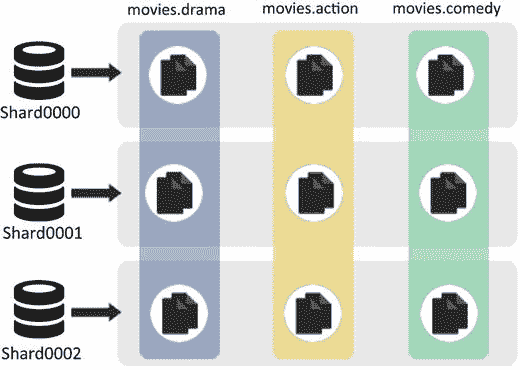

图 7-22。

Distribution without tagging

接下来，您将使用标记来分隔集合。这样做的目的是让每个碎片有一个集合(也就是说，你的目标是让块分布如表 [7-6](#Tab6) 所示)。

表 7-6。

Chunk Distribution

<colgroup><col> <col></colgroup> 
| 集合块 | 在碎片上 |
| --- | --- |
| 电影.戏剧 | 沙尔德 0000 |
| 电影.动作 | Shard0001 |
| 电影.喜剧 | Shard0002 |

标签描述了碎片的属性，可以是任何东西。因此，您可以将一个碎片标记为“慢”或“快”或“机架空间”或“西海岸”

在以下示例中，您将把碎片标记为属于每个集合:

`mongos> sh.addShardTag("shard0000", "dramas")`

`mongos> sh.addShardTag("shard0001", "actions")`

`mongos> sh.addShardTag("shard0002", "comedies")`

`mongos>`

这意味着:

*   在 shard0000 上贴上“戏剧”标签。
*   将标记为“actions”的块放在 shard0001 上。
*   并在 shard0002 上贴上“喜剧”的标签。

接下来，您将创建相应的规则来标记集合块。

规则 1:在`movies.drama`集合中创建的所有块都将被标记为“戏剧”

`mongos> sh.addTagRange("movies.drama", {originality:MinKey}, {originality:MaxKey}, "dramas")`

`mongos>`

该规则使用表示负无穷大的 MinKey 和表示正无穷大的 MaxKey。因此，上面的规则意味着用标签“戏剧”来标记集合`movies.drama`的所有块

与此类似，您将为其他两个集合制定规则。

规则 2:在`movies.action`集合中创建的所有块都将被标记为“动作”

`mongos> sh.addTagRange("movies.action", {distribution:MinKey}, {distribution:MaxKey}, "actions")`

`mongos>`

规则 3:在`movies.comedy`集合中创建的所有块都将被标记为“喜剧”

`mongos> sh.addTagRange("movies.comedy", {collection:MinKey}, {collection:MaxKey}, "comedies")`

`mongos>`

您需要等待集群重新平衡，以便根据上面定义的标记和规则来分配块。如前所述，块分配是一个自动过程，所以过一段时间后，块将自动重新分配，以实现您所做的更改。

接下来，发出`chunks.find`来检查组块组织:

`mongos> use config`

`switched to db config`

`mongos> db.chunks.find({ns:"movies.drama"}, {shard:1, _id:0}).sort({shard:1})`

`{ "shard" : "shard0000" }`

`{ "shard" : "shard0000" }`

`{ "shard" : "shard0000" }`

`{ "shard" : "shard0000" }`

`{ "shard" : "shard0000" }`

`{ "shard" : "shard0000" }`

`{ "shard" : "shard0000" }`

`{ "shard" : "shard0000" }`

`{ "shard" : "shard0000" }`

`{ "shard" : "shard0000" }`

`mongos> db.chunks.find({ns:"movies.action"}, {shard:1, _id:0}).sort({shard:1})`

`{ "shard" : "shard0001" }`

`{ "shard" : "shard0001" }`

`{ "shard" : "shard0001" }`

`{ "shard" : "shard0001" }`

`{ "shard" : "shard0001" }`

`{ "shard" : "shard0001" }`

`{ "shard" : "shard0001" }`

`{ "shard" : "shard0001" }`

`{ "shard" : "shard0001" }`

`{ "shard" : "shard0001" }`

`{ "shard" : "shard0001" }`

`{ "shard" : "shard0001" }`

`{ "shard" : "shard0001" }`

`mongos> db.chunks.find({ns:"movies.comedy"}, {shard:1, _id:0}).sort({shard:1})`

`{ "shard" : "shard0002" }`

`{ "shard" : "shard0002" }`

`{ "shard" : "shard0002" }`

`{ "shard" : "shard0002" }`

`{ "shard" : "shard0002" }`

`{ "shard" : "shard0002" }`

`{ "shard" : "shard0002" }`

`{ "shard" : "shard0002" }`

`{ "shard" : "shard0002" }`

`{ "shard" : "shard0002" }`

`mongos>`

因此，集合块已经基于定义的标签和规则被重新分配(图 [7-23](#Fig23) )。

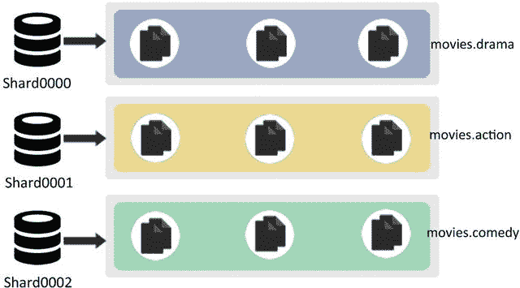

图 7-23。

Distribution with tagging

#### 带标签的 7.5.6.3 缩放

接下来，您将了解如何通过标记进行扩展。我们换个场景吧。让我们假设集合`movies.action`需要两台服务器来存储它的数据。因为只有三个碎片，这意味着另外两个集合的数据需要移动到一个碎片中。

在这种情况下，您将更改碎片的标记。您将向 Shard0 添加标签“comedies ”,从 Shard2 中删除标签，并进一步向 Shard2 添加标签“actions”。

这意味着标记为“喜剧”的块将被移动到 Shard0，而标记为“动作”的块将被传播到 Shard2。

首先将集合`movies.comedy`块移动到 Shard0，并从 Shard2:

`mongos> sh.addShardTag("shard0000","comedies")`

`mongos> sh.removeShardTag("shard0002","comedies")`

接下来，将标签“actions”添加到 Shard2，这样`movies.action`块也分布在 Shard2 中:

`mongos> sh.addShardTag("shard0002","actions")`

一段时间后重新发出 find 命令将显示以下结果:

`mongos> db.chunks.find({ns:"movies.drama"}, {shard:1, _id:0}).sort({shard:1})`

`{ "shard" : "shard0000" }`

`{ "shard" : "shard0000" }`

`{ "shard" : "shard0000" }`

`{ "shard" : "shard0000" }`

`{ "shard" : "shard0000" }`

`{ "shard" : "shard0000" }`

`{ "shard" : "shard0000" }`

`{ "shard" : "shard0000" }`

`{ "shard" : "shard0000" }`

`{ "shard" : "shard0000" }`

`mongos> db.chunks.find({ns:"movies.action"}, {shard:1, _id:0}).sort({shard:1})`

`{ "shard" : "shard0001" }`

`{ "shard" : "shard0001" }`

`{ "shard" : "shard0001" }`

`{ "shard" : "shard0001" }`

`{ "shard" : "shard0001" }`

`{ "shard" : "shard0001" }`

`{ "shard" : "shard0001" }`

`{ "shard" : "shard0002" }`

`{ "shard" : "shard0002" }`

`{ "shard" : "shard0002" }`

`{ "shard" : "shard0002" }`

`{ "shard" : "shard0002" }`

`{ "shard" : "shard0002" }`

`mongos> db.chunks.find({ns:"movies.comedy"}, {shard:1, _id:0}).sort({shard:1})`

`{ "shard" : "shard0000" }`

`{ "shard" : "shard0000" }`

`{ "shard" : "shard0000" }`

`{ "shard" : "shard0000" }`

`{ "shard" : "shard0000" }`

`{ "shard" : "shard0000" }`

`{ "shard" : "shard0000" }`

`{ "shard" : "shard0000" }`

`{ "shard" : "shard0000" }`

`{ "shard" : "shard0000" }`

`mongos>`

块已经被重新分配，反映了所做的更改(图 [7-24](#Fig24) )。

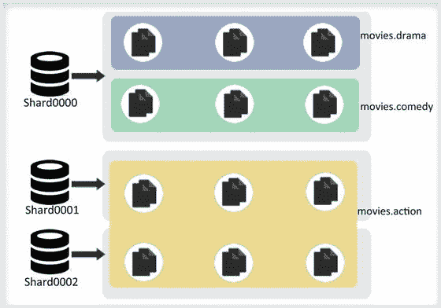

图 7-24。

Tagging with scaling

#### 7.5.6.4 多重标签

您可以将多个标签与碎片相关联。让我们给碎片添加两个不同的标签。

假设您想要基于磁盘分布写入。你有一个碎片有一个旋转磁盘，另一个有一个 SSD(固态硬盘)。您希望将 50%的写入重定向到使用 SSD 的碎片，将剩余的写入重定向到使用旋转磁盘的碎片。

首先，根据这些属性标记碎片:

`mongos> sh.addShardTag("shard0001", "spinning")`

`mongos> sh.addShardTag("shard0002", "ssd")`

`mongos>`

让我们进一步假设您有一个`movies.action`集合的`distribution`字段，您将使用它作为分片键。`distribution`字段值介于 0 和 1 之间。接下来你要说“如果分发<5，把这个发给旋转盘。如果分配> = .5，发送到 SSD 因此，您将规则定义如下:

`mongos>sh.addTagRange("movies.action", {distribution:MinKey} ,{distribution:.5} ,"spinning")`

`mongos>sh.addTagRange("movies.action" ,{distribution:.5} ,{distribution:MaxKey},"ssd")`

`mongos>`

现在，发行版小于. 5 的文档将被写入旋转碎片，其他文档将被写入 SSD 磁盘碎片。

通过标记，您可以控制每个新添加的服务器将获得的负载类型。

### 7.5.7 在共享环境中导入数据时要记住的几点

以下是导入数据时需要记住的几点。

#### 数据的 7.5.7.1 预分割

您可以使用下面的命令告诉 MongoDB 如何创建块，而不是让 MongoDB 选择创建块:

`db.runCommand( { split : "practicalmongodb.mycollection" , middle : { shardkey : value } } );`

张贴这个你也可以让 MongoDB 知道哪个块去哪个节点。

为此，您需要了解将要导入数据库的数据。这也取决于您要解决的用例以及您的应用如何读取数据。在决定将块放在哪里时，要记住数据局部性之类的东西。

#### 7.5.7.2 决定块的大小

在决定块大小时，您需要记住以下几点:

If the size is too small, the data will be distributed evenly but it will end up having more frequent migrations, which will be an expensive operation at the mongos layer.   If the size is large, it will lead to less migration, reducing the expense at the mongos layer, but you will end up with uneven data distribution.  

#### 7.5.7.3 选择了一把好的碎片钥匙

选择一个好的碎片键对于在碎片集群的节点之间良好地分配数据是非常重要的。

### 对碎片的监控

除了对其他 MongoDB 实例进行正常的监控和分析之外，分片集群还需要额外的监控，以确保其所有操作正常运行，并且数据在节点之间有效分布。在本节中，您将看到为了分片集群的正常运行应该进行哪些监控。

### 监控配置服务器

如您所知，配置服务器存储了分片集群的元数据。mongos 缓存数据并将请求路由到各自的碎片。如果配置服务器宕机，但有一个正在运行的 mongos 实例，对 shard 集群没有直接影响，它将在一段时间内保持可用。然而，您将无法执行诸如块迁移或重启新 mongos 之类的操作。从长远来看，配置服务器的不可用性会严重影响集群的可用性。为了确保集群保持平衡和可用，您应该监视配置服务器。

#### 7.5.9.1 监控分片状态平衡和块分配

对于最有效的分片集群部署来说，需要将块均匀地分布在各个分片中。如您所知，这是由 MongoDB 使用后台进程自动完成的。您需要监控碎片状态，以确保流程有效运行。为此，您可以在 mongos mongo shell 中使用`db.printShardingStatus()`或`sh.status()`命令来确保该进程有效工作。

#### 7.5.9.2 监控锁的状态

几乎在所有情况下，平衡器都会在完成其进程后自动释放其锁，但是您需要检查数据库的锁状态，以确保没有持久锁，因为这可能会阻碍未来的平衡，从而影响集群的可用性。从 mongos mongo 发出以下命令来检查锁的状态:

`use config`

`db.locks.find()`

## 7.6 生产集群架构

在本节中，您将了解生产集群体系结构。为了理解它，让我们考虑一个非常普通的社交网络应用的用例，其中用户可以创建一个朋友圈，并可以在整个组中共享他们的评论或图片。用户还可以评论或喜欢她朋友的评论或图片。用户在地理上是分散的。

应用要求所有评论跨地理位置立即可用；数据要冗余，这样用户的评论、帖子、图片才不会丢失；而且应该是高度可用的。因此，应用的生产集群应该包含以下组件:

At least two [mongos](http://docs.mongodb.org/manual/reference/mongos/#mongos%23mongos) instance, but you can have more as per need.   Three [config servers](http://docs.mongodb.org/manual/administration/sharded-clusters/#sharding-config-server), each on a separate system.   Two or more [replica sets](http://docs.mongodb.org/manual/reference/glossary/#term-replica-set) serving as [shards](http://docs.mongodb.org/manual/reference/glossary/#term-shard). The replica sets are distributed across geographies with read concern set to nearest. See Figure [7-25](#Fig25).

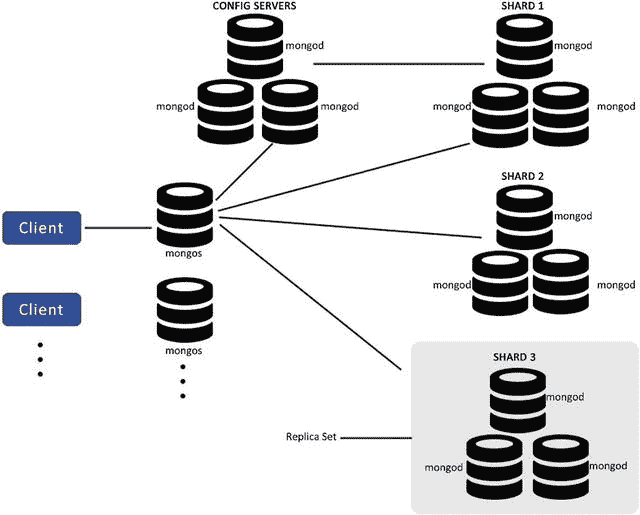

图 7-25。

Production cluster architecture  

现在让我们看看 MongoDB 生产部署中可能出现的故障场景及其对环境的影响。

### 场景 1

Mongos 变得不可用:mongos 发生故障的应用服务器将无法与集群通信，但这不会导致任何数据丢失，因为 mongos 不维护自己的任何数据。mongos 可以重启，重启时，它可以与配置服务器同步以缓存集群元数据，应用可以正常启动其操作(图 [7-26](#Fig26) )。

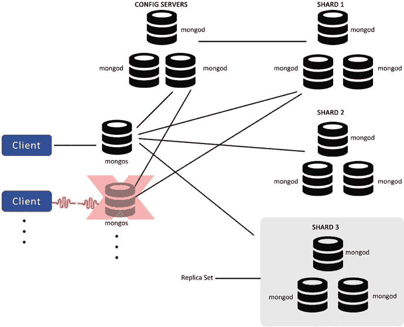

图 7-26。

Mongos become unavailable

### 场景 2

副本集的一个 mongod 在碎片中变得不可用:因为您使用副本集来提供高可用性，所以没有数据丢失。如果主节点关闭，则选择一个新的主节点，而如果它是一个次节点，则断开连接并继续正常运行(图 [7-27](#Fig27) )。

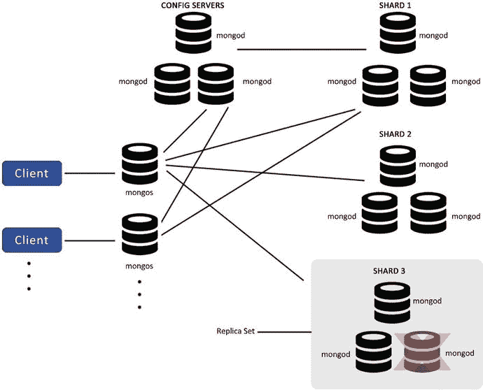

图 7-27。

One of the mongod of replica set is unavailable

唯一的区别是减少了数据的重复，使系统变得不那么脆弱，所以您应该并行检查 mongod 是否是可恢复的。如果是，应该恢复并重新启动，而如果是不可恢复的，您需要创建一个新的副本集并尽快替换它。

### 场景 3

如果其中一个碎片变得不可用:在这种情况下，碎片上的数据将不可用，但其他碎片将可用，因此不会停止应用。应用可以继续其读/写操作；但是，部分结果必须在应用中处理。同时，碎片应该尝试尽快恢复(图 [7-28](#Fig28) )。

图 7-28。

Shard unavailable

### 场景 4

三个配置服务器中只有一个是可用的:在这种情况下，尽管集群将变成只读的，但它不会为任何可能导致集群结构变化的操作提供服务，从而导致元数据的变化，如块迁移或块分割。应尽快更换配置服务器，因为如果所有配置服务器都不可用，将导致集群无法运行(图 [7-29](#Fig29) )。

图 7-29。

Only one config server available

## 7.7 摘要

在本章中，您讲述了核心流程和工具、独立部署、分片概念、复制概念和生产部署。您还了解了如何实现 HA。

在下一章中，您将看到数据是如何存储的，如何使用日志来写数据，GridFS 的用途，以及 MongoDB 中不同类型的索引。