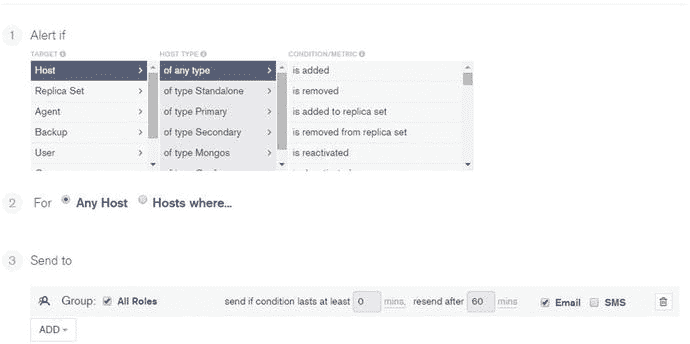
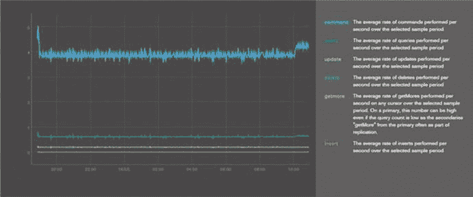
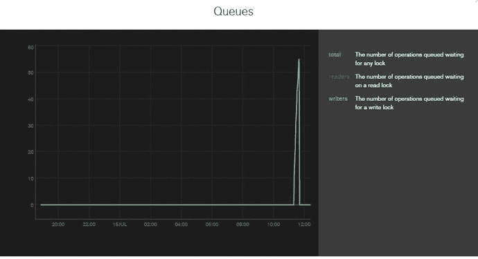
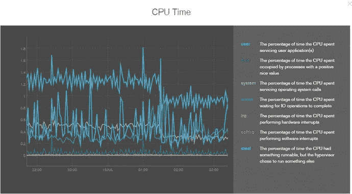
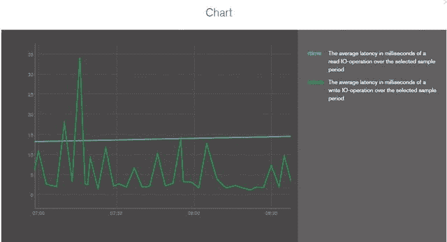

# 9.管理 MongoDB

“管理 MongoDB 不同于管理传统的 RDBMS 数据库。尽管大多数管理任务不是必需的，或者是由系统自动完成的，但仍有少数任务需要人工干预。”

在本章中，您将了解备份和恢复、导入和导出数据、管理服务器以及监视数据库实例的基本管理操作过程。

## 9.1 管理工具

在开始管理任务之前，这里有一个工具的快速概述。由于 MongoDB 没有 GUI 风格的管理界面，大多数管理任务都是使用命令行 mongo shell 来完成的。然而，一些 ui 可以作为单独的社区项目使用。

### 蒙哥语

mongo shell 是 MongoDB 发行版的一部分。这是一个用于 MongoDB 数据库的交互式 JavaScript shell。它为管理员和开发者直接使用数据库测试查询和操作提供了一个强大的接口。

在前面的章节中，您介绍了使用 shell 进行开发。在本章中，您将使用 shell 完成系统管理任务。

### 9.1.2 第三方管理工具

MongoDB 提供了许多第三方工具。大多数工具都是基于网络的。

10gen 在 MongoDB 网站 [`https://docs.mongodb.org/ecosystem/tools/administration-interfaces/`](https://docs.mongodb.org/ecosystem/tools/administration-interfaces/) 上维护了所有支持 MongoDB 的第三方管理工具的列表。

## 9.2 备份和恢复

备份是最重要的管理任务之一。它确保数据是安全的，并在任何紧急情况下可以恢复回来。

如果数据无法恢复，备份是没有用的。因此，在进行备份后，管理员需要确保备份的格式可用，并且以一致的状态捕获数据。

管理员需要学习的第一项技能是如何进行备份和恢复。

### 数据文件备份

备份数据库最简单的方法是将数据复制到数据目录文件夹中。

所有的 MongoDB 数据都存储在一个数据目录中，默认情况下是`C:\data\db`(在 Windows 中)或`/data/db`(在 LINUX 中)。启动 mongod 时，可以使用`–dbpath`选项将默认路径更改为不同的目录。

数据目录内容是存储在 MongoDB 数据库中的数据的完整图片。因此，备份 MongoDB 只是复制数据目录文件夹的全部内容。

通常，在 MongoDB 运行时复制数据目录内容是不安全的。一种选择是在复制数据目录内容之前关闭 MongoDB 服务器。

如果服务器正常关闭，数据目录的内容代表 MongoDB 数据的安全快照，因此可以在服务器重新启动之前复制它。

尽管这是一种安全有效的备份方式，但它不是一种理想的方式，因为它需要停机。

接下来，您将讨论不需要停机的备份技术。

### 9.2.2 mongodump 和 mongorestore

mongodump 是作为 MongoDB 发行版的一部分提供的 MongoDB 备份实用程序。它通过查询一个 MongoDB 实例并将所有读取的文档写入磁盘，作为一个普通的客户机工作。

让我们执行备份，然后恢复它，以验证备份的格式是否可用且一致。

以下代码片段来自在 Windows 平台上运行实用程序。MongoDB 服务器运行在 localhost 实例上。

打开终端窗口，输入以下命令:

`C:\>` `cd c:\practicalmongodb\bin`

`c:\practicalmongodb\bin>` `mongod --rest`

`2015-07-15T22:26:47.288-0700 I CONTROL [initandlisten] MongoDB starting : pid=3820 port=27017 dbpath=c:\data\db\ 64-bit host=ANOC9`

`.....................................................................................`

`2015-07-15T22:28:23.563-0700 I NETWORK [websvr] admin web console waiting for connections on port 28017`

为了运行 mongodump，请在新的终端窗口中执行以下命令:

`C:\>` `cd c:\practicalmongodb\bin`

`c:\practicalmongodb\bin>` `mongodump`

`2015-07-15T22:29:41.538-0700 writing admin.system.indexes to dump\admin\system.indexes.bson`

`................................`

`2015-07-14T22:29:46.720-0700 writing mydbproc.users to dump\mydbproc\users.bson`

`c:\practicalmongodb\bin>`

这会将整个数据库转储到`bin`文件夹目录下的`dump`文件夹下，如图 [9-1](#Fig1) 所示。

图 9-1。

The dump folder

默认情况下，mongodump 实用程序在默认端口上连接到数据库的 localhost 接口。

接下来，它将每个数据库和集合的相关数据文件提取并存储到一个预定义的文件夹结构中，默认为`./dump/[databasename]/[collectionname].bson`。

数据以`.bson`格式保存，这种格式类似于 MongoDB 在内部存储数据时使用的格式。

如果内容已经在目录中，它将保持不变，除非转储包含相同的文件。例如，如果转储包含文件`c1.bson`和`c2.bson`，而输出目录有文件`c3.bson`和`c1.bson`，那么 mongodump 会用它的`c1.bson`文件替换文件夹的`c1.bson`文件，并会复制`c2.bson`文件，但不会删除或更改`c3.bson`文件。

除非您需要在备份中覆盖数据，否则在将目录用于 mongodump 之前，您应该确保该目录是空的。

#### 9.2.2.1 单一数据库备份

在上面的示例中，您使用默认设置执行了 mongodump，这将转储 MongoDB 数据库服务器上的所有数据库。

在现实生活中，您将在一台服务器上运行多个应用数据库，每个数据库都有不同的备份策略要求。

在 mongodump 实用程序中指定`–d`参数将允许您明智地备份数据库。

`c:\practicalmongodb\bin>` `mongodump -d mydbpoc`

`2015-07-14T22:37:49.088-0700 writing mydbproc.mapreducecount1 to dump\mydbproc\ mapreducecount1.bson`

`......................`

`2015-07-14T22:37:54.217-0700 writing mydbproc.users metadata to dump\mydbproc\users.metadata.json`

`2015-07-14T22:37:54.218-0700 done dumping mydbproc.users`

`c:\practicalmongodb\bin>`

从 MongoDB-2.6 开始，数据库管理员必须能够访问管理数据库，以便为给定的数据库备份用户和用户定义的角色，因为 MongoDB 只将这些信息存储在管理数据库中。

#### 9.2.2.2 集合级备份

每个数据库中有两种类型的数据:很少更改的数据，例如维护用户、用户角色和任何与应用相关的配置的配置数据，还有经常更改的数据，例如事件数据(对于监控应用)、帖子数据(对于博客应用)等等。

因此，备份要求是不同的。例如，完整的数据库可以每周备份一次，而快速变化的集合需要每小时备份一次。

在 mongodump 实用程序中指定`–c`参数使用户能够为指定的集合单独实现备份。

`c:\practicalmongodb\bin>` `mongodump -d mydbpoc -c users`

`2015-07-14T22:41:19.850-0700 writing mydbproc.users to dump\mydbproc\users.bson`

`2015-07-14T22:41:30.710-0700 writing mydbproc.users metadata to dump\mydbproc\users.metadata.json`

`...........................................................`

`2015-07-14T22:41:30.712-0700 done dumping mydbproc.users`

`c:\practicalmongodb\bin>`

如果没有指定需要转储数据的文件夹，默认情况下，它会将数据转储到当前工作目录中名为`dump`的目录中，在本例中是`c:\practicalmongodb\bin`。

#### 9.2.2.3 蒙古垃圾场——救命

您已经了解了执行 mongodump 的基础知识。除了上面提到的选项，mongodump 还提供了其他选项，让您可以根据需要定制备份。与所有其他实用程序一样，使用`–help`选项执行实用程序将提供所有可用选项的列表。

#### 9.2.2.4 蒙古恢复

如上所述，管理员必须确保备份以一致且可用的格式进行。所以下一步是使用 mongorestore 恢复数据转储。

该实用程序会将数据库恢复到进行转储时的状态。在 3.0 版本之前，甚至不需要启动 mongod/mongos 就可以运行该命令。从版本 3.0 开始，如果在启动 mongod/mongos 之前执行该命令，将显示以下错误:

`c:\>``cd`T2】

`c:\ practicalmongodb\bin>` `mongorestore`

`2015-07-15T22:43:07.365-0700 using default 'dump' directory`

`2015-07-15T22:43:17.545-0700 Failed: error connecting to db server: no reachable servers`

在运行`mongorestore`命令之前，您必须运行 mongod/mongos 实例。

`c:\>``cd`T2】

`c:\ practicalmongodb\bin>` `mongod --rest`

`2015-07-15T22:43:25.765-0700 I CONTROL [initandlisten] MongoDB starting : pid=3820 port=27017 dbpath=c:\data\db\ 64-bit host=ANOC9`

`.....................................................................................`

`2015-07-15T22:43:25.865-0700 I NETWORK [websvr] admin web console waiting for connections on port 28017`

`c:\ practicalmongodb\bin>` `mongorestore`

`2015-07-15T22:44:09.786-0700 using default 'dump' directory`

`2015-07-15T22:44:09.792-0700 building a list of dbs and collections to restore from dump dir`

`...................................`

`2015-07-15T22:44:09.732-0700 restoring indexes for collection mydbproc.users from metadata`

`2015-07-15T22:44:09.864-0700 finished restoring mydbproc.users`

`c:\practicalmongodb\bin>`

该力将数据追加到现有数据的后面。

要覆盖默认行为，应该在上面的代码片段中使用`–drop`。

`–drop`命令向 mongorestore 实用程序指出，它需要删除上述数据库中的所有集合和数据，然后将转储数据恢复到数据库中。

如果不使用`–drop`，该命令会将数据附加到现有数据的末尾。

注意，从版本 3.0 开始，`mongorestore`命令也可以接受来自标准输入的输入。

#### 9.2.2.5 恢复单个数据库

正如您在备份一节中看到的，备份策略可以在单个数据库级别指定。您可以通过使用`–d`选项运行`mongodump`来备份单个数据库。

类似地，您可以将`–d`选项指定给`mongorestore`来恢复单个数据库。

`c:\ practicalmongodb\bin>` `mongorestore -d mydbpocc:\practicalmongodb\bin\dump\mydbproc -drop`

`2015-07-14T22:47:01.155-0700 building a list of collections to restore from C :\practicalmongodb\bin\dump\mydbproc dir`

`2015-07-14T22:47:01.156-0700 reading metadata file from C :\practicalmongodb\bin\dump\mydbproc \users.metadata.json`

`..........................................................................`

`2015-07-14T22:50:09.732-0700 restoring indexes for collection mydbproc.users from metadata`

`2015-07-14T22:50:09.864-0700 finished restoring mydbproc.users`

`c:\practicalmongodb\bin>`

#### 9.2.2.6 修复单一系列

对于 mongodump，您可以使用`–c`选项来指定集合级备份，您也可以通过使用 mongorestore 实用程序的`–c`选项来恢复单个集合。

`c:\ practicalmongodb\bin>` `mongorestore -d mydbpoc -c users C:\ practicalmongodb\bin\dum\mydb\user.bson -drop`

`2015-07-14T22:52:14.732-0700 restoring indexes for collection mydbproc.users from metadata`

`2015-07-14T22:52:14.864-0700 finished restoring mydbproc.users`

`c:\practicalmongodb\bin>`

#### 9.2.2.7 蒙古恢复——救命

mongorestore 也有多个选项，可以使用`–help`选项查看。还可以参考以下网站: [`http://docs.mongodb.org/manual/core/backups/`](http://docs.mongodb.org/manual/core/backups/) 。

### fsync 和锁定

虽然上面的两种方法(mongodump 和 mongorestore)使您能够在不停机的情况下进行数据库备份，但是它们不提供获得时间点数据视图的能力。

您了解了如何复制数据文件来进行备份，但是这需要在复制数据之前关闭服务器，这在生产环境中是不可行的。

MongoDB 的`fsync`命令允许您通过运行 MongoDB 复制数据目录的内容，而不改变任何数据。

`fsync`命令强制将所有挂起的写入刷新到磁盘。或者，它持有一个锁，以防止进一步的写入，直到服务器解锁。这个锁只使`fsync`命令可用于备份。

要从 shell 运行该命令，请在新的终端窗口中连接到 mongo 控制台。

`c:\practicalmongodb\bin>` `mongo`

`MongoDB shell version: 3.0.4`

`connecting to: test`

`>`

接下来，切换到 admin 并发出`runCommand`到`fsync`:

`>` `use admin`

`switched to db admin`

`>` `db.runCommand({"fsync":1, "lock":1})`

`{`

`"info" : "now locked against writes, use db.fsyncUnlock() to unlock",`

`"seeAlso" : "`[`http://dochub.mongodb.org/core/fsynccommand`](http://dochub.mongodb.org/core/fsynccommand)T2】

`"ok" : 1`

`}`

`>`

此时，对于任何写入，服务器都是锁定的，确保数据目录代表数据的一致的时间点快照。可以安全地复制数据目录内容以用作数据库备份。

您必须在备份活动完成后解锁数据库。为此，发出以下命令:

`>` `db.$cmd.sys.unlock.findOne()`

`{ "ok" : 1, "info" : "unlock completed" }`

`>`

`currentOp`命令可以用来检查数据库锁是否已经被释放。

`>` `db.currentOp()`

`{ "inprog" : [ ] }`

`(It may take a moment after the unlock is first requested.)`

`fsync`命令允许您在不停机的情况下进行备份，并且不会牺牲备份的时间点特性。但是，会有短暂的写入阻塞(也称为短暂的写入停机时间)。

从 3.0 版本开始，使用 WiredTiger 时，`fsync`无法保证数据文件不会发生变化。因此它不能用于确保创建备份的一致性。

接下来，您将了解从属备份。这是唯一能够在不停机的情况下拍摄时间点快照的备份技术。

### 从属备份

从备份是 MongoDB 中推荐的数据备份方式。从机总是存储与主机几乎同步的数据副本，从机的可用性或性能不是大问题。您可以在从服务器而不是主服务器上应用前面讨论过的任何技术:关机、`fsync`带锁，或者转储和恢复。

## 9.3 进口和出口

当您试图将应用从一个环境迁移到另一个环境时，通常需要导入或导出数据。

### 蒙古进口

MongoDB 提供了 mongoimport 实用程序，允许您将数据直接批量装载到数据库集合中。它从文件中读取数据，并将数据大容量加载到集合中。

这些方法不适合生产环境。

mongoimport 支持以下三种文件格式:

*   JSON:在这种格式中，每行都有 JSON 块，代表一个文档。
*   CSV:这是一个逗号分隔的文件。
*   TSV: TSV 文件与 CSV 文件相同；唯一的区别是它使用制表符作为分隔符。

将`–help`与`mongoimport`一起使用将提供该实用程序可用的所有选项。

mongoimport 非常简单。大多数情况下，您最终会使用以下选项:

*   `-h`或`–host`:指定数据需要恢复到的 mongod 主机名。如果没有指定该选项，默认情况下，该命令将连接到本地主机上运行的 mongod 的端口 27017。或者，可以指定一个端口号来连接到运行在不同端口上的 mongod。
*   `-d`或`–db`:指定需要导入数据的数据库。
*   `-c`或`–collection`:指定需要上传数据的集合。
*   `--type`:这是文件类型(即 CSV、TSV 或 JSON)。
*   `--file`:这是需要导入数据的文件路径。
*   `--drop`:如果设置了此选项，将删除集合，并从导入的数据中重新创建集合。否则，数据将追加到集合的末尾。
*   `--headerLine`:仅用于 CSV 或 TSV 文件，用于表示第一行是标题行。

以下命令将数据从 CSV 文件导入到本地主机上的`testimport`集合中:

`c:\practicalmongodb\bin>` `mongoimport --host localhost --db mydbpoc --collection testimport --type csv –file c:\exporteg.csv –-headerline`

`2015-07-14T22:54:08.407-0700 connected to: localhost`

`2015-07-14T22:54:08.483-0700 imported 15 documents`

`c:\ practicalmongodb\bin>`

### 蒙古出口

与 mongoimport 实用程序类似，MongoDB 提供了一个 mongoexport 实用程序，允许您从 MongoDB 数据库中导出数据。顾名思义，这个实用程序从现有的 MongoDB 集合中导出文件。

使用`–help`显示了 mongoexport 实用程序的可用选项。以下选项是您最终最常使用的选项:

*   `-q`:用于指定将需要导出的记录作为输出返回的查询。这类似于当您必须检索匹配选择标准的记录时，您在`db.CollectionName.find()`函数中指定的内容。如果没有指定查询，则导出所有文档。
*   `-f`:用于指定所选单据中需要导出的字段。

以下命令将数据从`Users`集合导出到 CSV 文件:

`c:\practicalmongodb\bin>` `mongoexport -d mydbpoc -c myusers -f _id,Age –type=csv > myusers.csv`

`2015-07-14T22:54:48.604-0700 connected to: 127.0.0.1`

`2015-07-14T22:54:48.604-0700 exported 22 records`

`c:\practicalmongodb\bin>`

## 9.4 管理服务器

在本节中，您将看到作为系统管理员需要了解的各种选项。

### 9.4.1 启动服务器

本节介绍如何启动服务器。之前，您使用 mongo shell 通过运行`mongod.exe`来启动服务器。

MongoDB 服务器可以通过在 Windows 中打开命令提示符(以管理员身份运行)或在 Linux 系统上打开终端窗口并键入以下命令来手动启动:

`C:\>cd c:\practicalmongodb\bin`

`c:\ practicalmongodb\bin>mongod`

`mongod --help for help and startup options`

`.........................................`

这个窗口将显示所有与 mongod 的连接。它还显示可用于监控服务器的信息。

如果没有指定配置，MongoDB 在 Windows 上以默认数据库路径`C:\data\db`启动，在 Linux 上以默认数据库路径`/data/db`启动，并使用默认端口 27017 和 27018 绑定到本地主机。

键入`^C`将彻底关闭服务器。

MongoDB 提供了两种方法来指定启动服务器的配置参数。

第一种是使用命令行选项来指定(参考第 tk 章)。

第二种方法是加载配置文件。可以通过编辑文件然后重新启动服务器来更改服务器配置。

### 停止服务器

在 mongod 控制台中按 CTRL+C 可以关闭服务器。否则，您可以从 mongo 控制台使用`shutdownServer`命令。

打开一个终端窗口，并连接到 mongo 控制台。

`C:\>` `cd c:\practicalmongodb\bin`

`c:\practicalmongodb\bin>` `mongo`

`MongoDB shell version: 3.0.4`

`connecting to: test`

`>`

切换到 admin db 并发出`shutdownServer`命令:

`>` `use admin`

`switched to db admin`

`>` `db.shutdownServer()`

`2015-07-14T22:57:20.413-0700 I NETWORK DBClientCursor::init call() failed server should be down...`

`2015-07-14T22:57:20.418-0700 I NETWORK trying reconnect to 127.0.0.1:27017`

`2015-07-14T22:57:21.413-0700 I NETWORK 127.0.0.1:27017 failed couldn't connect to server 127.0.0.1:27017`

`>`

如果您检查在上一步中启动服务器的 mongod 控制台，您将看到服务器已经成功关闭。

`.......................`

`2015-07-14T22:57:30.259-0700 I COMMAND [conn1] terminating, shutdown command received`

`2015-07-14T22:57:30.260-0700 I CONTROL [conn1] now exiting`

`.................................................`

`2015-07-14T22:57:30.380-0700 I STORAGE [conn1] shutdown: removing fs lock...`

`2015-07-14T22:57:30.380-0700 I CONTROL [conn1] dbexit: rc: 0`

### 查看日志文件

默认情况下，MongoDB 的整个日志输出被写入到`stdout`中，但是这可以通过在启动服务器时指定配置中的 logpath 选项来改变，以便将输出重定向到一个文件中。

日志文件内容可用于识别异常等问题，这些问题可能表明某些数据问题或连接问题。

### 服务器状态

`db.ServerStatus()`是 MongoDB 提供的一个简单方法，用于检查服务器状态，比如连接数、正常运行时间等等。server status 命令的输出取决于操作系统平台、MongoDB 版本、使用的存储引擎和配置类型(如独立、副本集和分片集群)。

从 3.0 版开始，输出中删除了以下部分:workingSet、indexCounters 和 recordStats。

为了检查使用 MMAPv1 存储引擎的服务器的状态，连接到 mongo 控制台，切换到 admin db，并发出`db.serverStatus()`命令。

`c:\practicalmongodb\bin>` `mongo`

`MongoDB shell version: 3.0.4`

`connecting to: test`

`>` `use admin`

`switched to db admin`

`>` `db.serverStatus()`

`host" : "ANOC9",`

`"version" : "3.0.4",`

`"process" : "mongod",`

`"pid" : NumberLong(1748),`

`"uptime" : 14,`

`"uptimeMillis" : NumberLong(14395),`

`"uptimeEstimate" : 13,`

`"localTime" : ISODate("2015-07-14T22:58:44.532Z"),`

`"asserts" : {`

`"regular" : 0,`

`"warning" : 0,`

`"msg" : 0,`

`"user" : 1,`

`"rollovers" : 0`

`},`

`.........................................................`

上面的`serverStatus`输出还将有一个“backgroundflushing”部分，它显示与 MongoDB 使用 MMAPv1 作为存储引擎将数据刷新到磁盘的过程相对应的报告。

“操作计数器”和“断言”部分提供了有用的信息，可以对这些信息进行分析以对任何问题进行分类。

“操作计数器”部分显示每种类型的操作数。为了发现是否有任何问题，您应该对这些操作有一个基线。如果计数器开始偏离基线，这表明存在问题，需要采取措施将其恢复到正常状态。

“asserts”部分描述了已经发生的客户端和服务器警告或异常的数量。如果您发现此类异常和警告增多，您需要仔细查看日志文件，以确定问题是否正在发展。断言数量的增加也可能表明数据有问题，在这种情况下，应该使用 MongoDB validate 函数来检查数据是否完好无损。

接下来，让我们使用 WiredTiger 存储引擎启动服务器，并查看 serverStatus 输出。

`c:\practicalmongodb\bin>` `mongod –storageEngine wiredTiger`

`2015-07-14T22:51:05.965-0700 I CONTROL Hotfix KB2731284 or later update is installed, no need to zero-out data files`

`2015-07-29T22:51:05.965-0700 I STORAGE [initandlisten] wiredtiger_open config: create,cache_size=1G,session_max=20000,eviction=(threads_max=4),statistics=(fast),log=(enabled=true,archive=true,path=journal,compressor=snappy),file_manager=(close_idle_time=100000),checkpoint=(wait=60,log_size=2GB),statistics_log=(wait=0)`

`..................................................`

为了检查服务器状态，连接到 mongo 控制台，切换到 admin db，并发出`db.serverStatus()`命令。

`c:\practicalmongodb\bin>` `mongo`

`MongoDB shell version: 3.0.4`

`connecting to: test`

`>` `use admin`

`switched to db admin`

`>` `db.serverStatus()`

`"wiredTiger" : {`

`"uri" : "statistics:",`

`"LSM" : {`

`"...........................................................,`

`"tree maintenance operations scheduled":0,`

`............................................................,`

`},`

`"async" : {`

`"number of allocation state races":0,`

`"number of operation slots viewed for allocation":0,`

`"current work queue length" : 0,`

`"number of flush calls" : 0,`

`"number of times operation allocation failed":0,`

`"maximum work queue length" : 0,`

`............................................................,`

`},`

`"block-manager" : {`

`"mapped bytes read" : 0,`

`"bytes read" : 966656,`

`"bytes written" : 253952,`

`...................................,`

`"blocks written" : 45`

`},`

`............................................................,`

如您所见，当使用存储引擎 wiredTiger 启动时，服务器状态输出有一个新的部分，称为 wiredTiger statistics。

### 9.4.5 识别和修复 MongoDB

在本节中，您将了解如何修复损坏的数据库。

如果您遇到类似以下的错误

*   数据库服务器拒绝启动，声称数据文件已损坏
*   在日志文件或`db.serverStatus()`命令中可以看到断言
*   奇怪或意外的查询结果

这意味着数据库已损坏，必须运行修复才能恢复数据库。

在开始修复之前，您需要做的第一件事是让服务器离线(如果它还没有离线的话)。你可以使用上面提到的任何一个选项。在本例中，在 mongod 控制台中键入`^C`。这将关闭服务器。

接下来，使用`–repair`选项启动 mongod，如下所示:

`c:\practicalmongodb\bin>` `mongod --repair`

`2015-07-14T22:58:31.171-0700 I CONTROL Hotfix KB2731284 or later update is installed, no need to zero-out data files`

`2015-07-14T22:58:31.173-0700 I CONTROL [initandlisten] MongoDB starting : pid=3996 port=27017 dbpath=c:\data\db\ 64-bit host=ANOC9`

`2015-07-14T22:58:31.174-0700 I CONTROL [initandlisten] db version v3.0.4`

`.....................................`

`2015-07-14T22:58:31.447-0700 I STORAGE [initandlisten] shutdown: removing fs lock...`

`2015-07-14T22:58:31.449-0700 I CONTROL [initandlisten] dbexit: rc: 0`

`c:\ practicalmongodb\bin>`

这将修复 mongod。如果您查看输出，您会发现该实用程序正在修复的各种差异。一旦修复过程结束，它就会退出。

修复过程完成后，服务器可以正常启动，然后可以使用最新的数据库备份来恢复丢失的数据。

有时，您可能会注意到在修复大型数据库时，驱动器磁盘空间不足。这是因为 MongoDB 需要在数据文件所在的驱动器上创建文件的临时副本。为了解决这个问题，在修复数据库时，您应该使用`–repairpath`参数来指定在修复过程中可以创建临时文件的驱动器。

### 9.4.6 识别和修复集合级数据

有时，您可能希望验证集合是否包含有效数据和有效索引。对于这种情况，MongoDB 提供了一个`validate()`方法来验证指定集合的内容。

以下示例验证了`Users`集合的数据:

`c:\practicalmongodb\bin>` `mongo`

`MongoDB shell version: 3.0.4`

`connecting to: test`

`>` `use mydbpoc`

`switched to db mydbpoc`

`>` `db.myusers.validate()`

`{`

`"ns" : "mydbpoc.myusers",`

`"firstExtent" : "1:4322000 ns:mydbpoc.myusers",`

`"lastExtent" : "1:4322000 ns:mydbpoc.myusers",`

`"...............`

`"valid" : true,`

`"errors" : [ ],`

`"warning" : "Some checks omitted for speed. use {full:true} option to do`

`more thorough scan.",`

`"ok" : 1`

`}`

默认情况下，通过`validate()`选项检查数据文件和相关索引。提供收集统计信息是为了帮助识别数据文件或索引是否有问题。

如果运行`validate()`表明索引被损坏，在这种情况下`reIndex`可以用于重新索引集合的索引。这将删除并重新生成集合的所有索引。

以下命令重新索引`Users`集合的索引:

`>` `use mydbpoc`

`switched to db mydbpoc`

`>` `db.myusers.reIndex()`

`{`

`"nIndexesWas" : 1,`

`"msg" : "indexes dropped for collection",`

`"nIndexes" : 1,`

`"indexes" : [`

`{`

`"key" : {`

`"_id" : 1`

`},`

`"ns" : "mydbpoc.myusers",`

`"name" : "_id_"`

`}`

`],`

`"ok" : 1`

`}`

`>`

如果集合的数据文件损坏，那么运行`–repair`选项是修复所有数据文件的最佳方式。

## 9.5 监控 MongoDB

作为 MongoDB 服务器管理员，监控系统的性能和健康状况非常重要。在本节中，您将学习监控系统的方法。

### mongostat

mongostat 是 MongoDB 发行版的一部分。这个工具在服务器上提供简单的统计数据；虽然它不全面，但它提供了一个很好的概述。下面显示了本地主机的统计信息。打开终端窗口并执行以下操作:

`c:\>` `cd c:\practicalmongodb\bin`

`c:\practicalmongodb\bin>` `mongostat`

前六列显示了 mongod 服务器处理各种操作的速度。除了这些列之外，下面的列也值得一提，在诊断问题时可能有用:

*   Conn:这是 mongod 实例的连接数指标。这里的高值可能表示应用没有释放或关闭连接，这意味着尽管应用正在发出一个打开的连接，但在操作完成后它没有关闭连接。

从 3.0 版本开始，mongostat 也可以使用选项`–json`以 json 格式返回响应。

`c:\>` `cd c:\practicalmongodb\bin`

`c:\practicalmongodb\bin>` `mongostat –json`

`{"ANOC9":{"ar|aw":"0|0","command":"1|0","conn":"1","delete":"*0","faults":"1","flushes":"0","getmore":"0","host":"ANOC9","insert":"*0","locked":"", "mapped":"560.0M","netIn":"79b","netOut":"10k","non mapped":"","qr|qw":"0|0","query":"*0","res":"153.0M","time":"05:16:17","update":"*0","vsize":"1.2G"}}`

### 9.5.2 mongod Web 界面

每当 mongod 启动时，它都会默认创建一个 web 端口，这个端口比 mongod 用来监听连接的端口号大 1000。默认情况下，HTTP 端口是 28017。

这个 mongod web 界面是通过您的 web 浏览器访问的，它显示了大部分统计信息。如果 mongod 运行在 localhost 上，并且正在监听端口 27017 上的连接，那么可以使用下面的 URL 访问 HTTP 状态页面:`http://localhost:28017`。页面如图 [9-2](#Fig2) 所示。

图 9-2。

Web interface

### 9.5.3 第三方插件

除了这个工具，还有各种第三方适配器可用于 MongoDB，这些适配器允许您使用常见的开源或商业监控系统，如 cacti、Ganglia 等。在其网站上，10gen 维护着一个页面，分享关于可用 MongoDB 监控接口的最新信息。

要获得第三方插件的最新列表，请访问 [`www.mongodb.org/display/DOCS/Monitoring+and+Diagnostics`](http://www.mongodb.org/display/DOCS/Monitoring+and+Diagnostics) 。

### 9.5.4 MongoDB 云管理器

除了上面讨论的用于监控和备份目的的工具和技术之外，还有 MongoDB 云管理器(以前称为 MMS–MongoDB 监控服务)。它是由开发 MongoDB 的团队开发的，可以免费使用(30 天试用许可)。与上面讨论的技术相比，MongoDB Cloud Manager 以图形和图表的形式提供了用户界面以及日志和性能细节。

MongoDB 云管理器图表是交互式的，允许用户设置自定义的日期范围，如图 [9-3](#Fig3) 所示。

图 9-3。

Setting a custom date range

云管理器的另一个简洁的特性是在不同事件发生时使用电子邮件和文本提醒的能力。这在图 [9-4](#Fig4) 中进行了描述。

图 9-4。

Email and text alerts

Cloud Manager 不仅提供图形和警报，还允许您查看按响应时间排序的较慢的查询。您可以在一个地方很容易地看到您的查询是如何执行的。图 9-5 显示了查询性能的图表。

图 9-5。

Query response time

云管理器允许您执行以下操作:

*   自动化您的 MongoDB 部署(MongoDB 节点、集群的配置和现有部署的升级)
*   通过持续备份保护您的数据
*   提供与 AWS 集成的任何拓扑
*   在您的仪表板中监控性能
*   执行操作任务，如增加容量

对于 AWS 用户，它提供了直接集成，因此可以在 AWS 上启动 MongoDB，而无需离开 Cloud Manager。您在第 tk 章中看到了如何使用 AWS 进行配置。

云管理器还可以帮助您发现系统中的低效之处，并进行纠正以实现平稳运行。

它使用您安装的代理收集和报告指标。Cloud Manager 提供了 MongoDB 系统健康的快速浏览，并帮助您确定性能问题的根本原因。

接下来，您将看到应该用于任何性能调查的关键指标。在这个过程中，您还会看到指标的组合表明了什么。

#### 9.5.4.1 度量

您将主要关注以下关键指标:这些指标在调查性能问题时起着关键作用。它们提供了 MongoDB 系统内部正在发生的事情以及哪些系统资源(即 CPU、RAM 或磁盘)是瓶颈的快速浏览。

*   页错误
*   操作计数器
*   锁定百分比
*   行列
*   CPU 时间(等待和用户)

要查看下面提到的图表，您可以单击部署部分下的部署链接。选择已经被配置为由云管理器监控的 MongoDB 实例。接下来，从管理图表部分选择所需的图形/图表。

页面错误显示系统中每秒发生的平均页面错误数。图 [9-6](#Fig6) 显示了页面故障图。

图 9-6。

Page faults

OpCounters 显示系统上每秒执行的平均操作数。参见图 [9-7](#Fig7) 。

图 9-7。

OpCounters

在页面错误与操作数的比率中，页面错误取决于系统上正在执行的操作以及当前内存中的内容。因此，每秒页面错误数与每秒操作计数器数的比率可以提供磁盘 I/O 需求的大致情况。参见图 [9-8](#Fig8) 。

图 9-8。

Page fault to Opcounters ratio

如果该比率为

*   < 1，这被归类为低磁盘 I/O
*   接近 1 时，这被归类为常规磁盘 I/O。
*   > 1，这被归类为高磁盘 I/O。

Queues 图显示了在任何给定时间等待释放锁的操作数。参见图 [9-9](#Fig9) 。

图 9-9。

Queues

CPU 时间(低等待和用户)图显示了 CPU 内核如何度过它们的周期。参见图 [9-10](#Fig10) 。

图 9-10。

CPU Time

IOWait 表示 CPU 等待其他资源(如磁盘或网络)所花费的时间。参见图 [9-11](#Fig11) 。

图 9-11。

IOWait

用户时间表示执行计算所花费的时间，例如文档更新、更新和重新平衡索引、选择或排序查询结果、运行聚合框架命令、Map/Reduce 或服务器端 JavaScripts。参见图 [9-12](#Fig12) 。

图 9-12。

User time

要查看 CPU 时间图，您需要安装 munin。

这些关键指标及其组合应该用于调查任何性能问题。

## 9.6 总结

在本章中，您了解了如何使用打包成 MongoDB 发行版一部分的各种实用程序来管理和维护系统。

您了解了作为管理员必须了解的主要操作，以便详细了解这些实用程序。请通读参考资料。在下一章中，您将研究 MongoDB 的用例，并且您还将看到 MongoDB 不是一个好选择的情况。